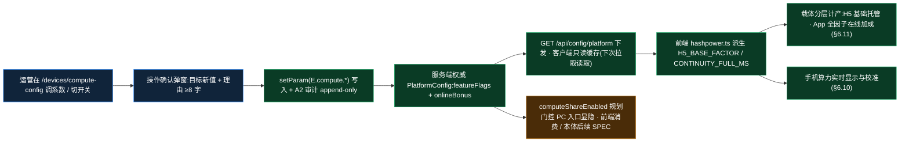
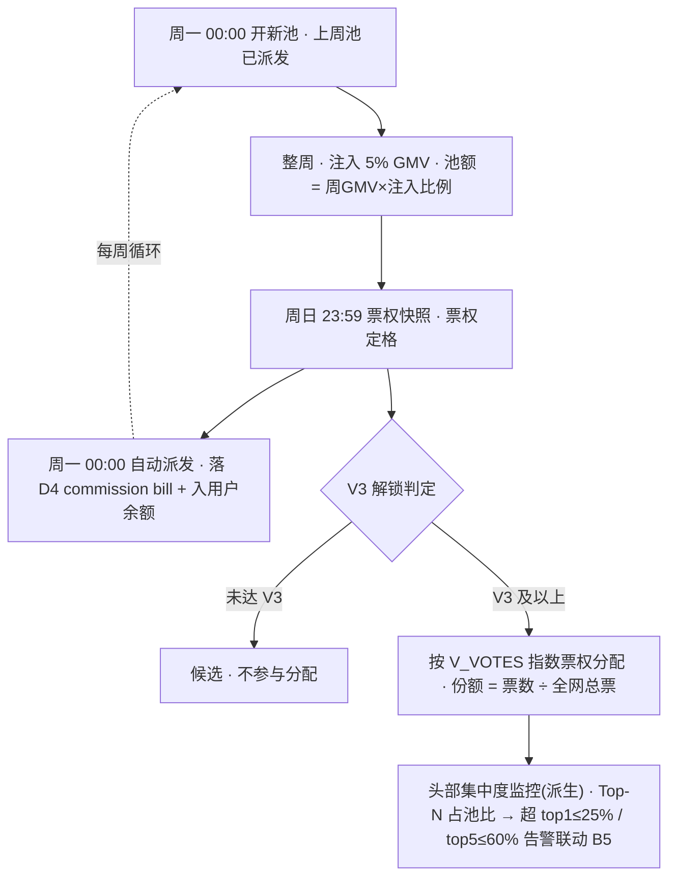

# Nexion · 运营控制后台 PRD(Ops Console PRD)— V2 卷:设备商城(E)+ 分销团队(F)

> **现行裁决(2026-08-07)**:全项目已取消 KYC 与钱包配对；本卷中相关门槛、事件、履约核验和地址确认描述全部失效，不得实现或恢复。

> 本卷是运营控制后台 PRD 的 **V2 分卷**,承接 V1 卷(`Nexion_运营控制后台PRD_v1.md`)的横切地基:§1.8 三原则(双账本 / server-canonical / 埋点优先)· A2 审计 & 操作确认(Confirm-with-Reason,2026-06 操作确认决议)· A4 埋点事件体系(§2.4)· §3.14 跨域归属 · H1 Phase 10-dial 权威(§1.7)。章节编号续 V1(Ch10 起)。
> **跨卷 §锚点**:§1.x–§9.x(本后台)指向 **V1 文件**;§13.4 / §9.11x / §6.x / §7.x 指向前端 PRD v3.5 与 12 月节奏表。参数默认值锚 12 月节奏表 §6,前端为现状参考。撰写遵循 `nexion-admin-prd` skill 流水线。
> **E3 后发裁定（2026-07-21）**：`specs/FEAT-DEV01-task-capacity-schedule.md` 与 `specs/FEAT-DEV02-tradein-ladder.md` 是 E3 当前唯一执行规格，优先于本卷中全部 `degradeEarly/degradeMid/degradeLate/minEfficiency/minHoldingMonths/salvage` 旧字段、旧公式、旧接口与旧 K2 联动描述。旧段落只保留为历史设计背景，不得进入代码、配置、页面、CGM 或验收口径。

> **当前状态合同（2026-08-16）**：状态必须按能力边界读取，不得把 Sandbox/Mock、单一配置页或阶段展示扩大为生产能力。
>
> | 能力 | 当前状态 | 允许宣称的范围 | 明确保持 HOLD 的范围 |
> |---|---|---|---|
> | Gen-2 E1 `purchaseGate` + App `GET /api/store/purchase-eligibility` | **COMPLETE** | 服务端权威判定；普通单、组合/Sandbox 单、Trade-in 与容量替换均在提交前复验；Pro v2 默认 V≥2、Rack P2 默认 V≥4 | 不得把 E3 九类通用规则编辑器混入该完成项 |
> | E3 九类通用 eligibility 编辑器 | **HOLD** | 仅保留未来扩展设计，当前不覆盖或旁路 E1 `purchaseGate` | 编辑器 UI、九类规则运行时映射和以其作为成交授权 |
> | Passkey / Telegram | **Sandbox Mock COMPLETE** | 显式 Sandbox 使用服务端 Mock 身份并显示 Mock 标识 | 生产 WebAuthn/Passkey ceremony 与 Telegram Login Widget verifier |
> | Janus | **Sandbox executor / 签名回执 / ACK Mock COMPLETE** | 仅 `test/acceptance/local-sandbox` allowlist，回执/证明带 `SANDBOX` 来源 | 实体真机、native attestation、生产 handoff 与真实设备 ACK |
> | 提现结果未知的核验与放弃 | **COMPLETE** | 服务端先核验 canonical withdrawal；未建单才写 `ABANDONED` tombstone；不取消已提交提现 | 真实银行/链上/PSP 出款仍按生产供应商范围 HOLD |
>
> **历史口径说明**：2026-08-15 的旧 HOLD 记录仅代表当日快照，已由本节 2026-08-16 状态合同取代；历史事实不改写，当前执行口径以本节为准。

## 目录(V2 卷)

| 章 | 标题 | 域 | 状态 |
|---|---|---|---|
| 10 | 设备与商城 | E | ✅ 本卷 |
| 11 | 分销与团队 | F | ✅ 本卷 |

---

## 第 10 章 设备与商城(域 E)

> **编号收编(2026-06 实现对齐)**:域 E 原 7 功能子模块在运营后台**收编为 5 个页面级模块 E1-E5**(连续编号,与导航 / 实现一致):**E1** 商品目录 & 代际门(原 E1 商品目录&定价 + 原 E2 代际发布门)· **E2** 收益 & 任务引擎(原 E3)· **E3** 生命周期 & Trade-in(原 E4 设备生命周期 + 原 E5 Trade-in 配置)· **E4** 订单状态机(原 E6)· **E5** 设备运维(原 E7)。两个合并页内的功能区以 **E1a/E1b**、**E3a/E3b** 子标号细分,各自保留完整 8 段规格。全章 E 编号引用均按此收编后口径(E1=商品+代际门、E2=收益任务、E3=生命周期+Trade-in、E4=订单、E5=运维)。

> **本章是 V2 分卷的首章**,覆盖域 E 收编后的 **5 个页面级子模块 E1-E5**(下分 7 功能区:E1a 商品目录 & 定价 / E1b 代际发布门 / E2 收益 & 任务引擎 / E3a 设备生命周期 / E3b Trade-in 配置 / E4 订单状态机 / E5 设备运维),全部 V2。E 域是平台两大硬件收入引擎之一(硬件 GMV)的运营控制面:从「卖什么、卖多少钱、何时放新代」(E1)到「设备产出多少、衰减多快」(E2 / E3a)、「旧机如何置换升级」(E3b)、「订单如何履约与退款」(E4)、「在网设备如何运维」(E5),构成设备资产从发布到退役的完整生命周期运营闭环。
>
> 本章承接 V1 已落地的横切地基:**审计 / 操作确认权威归 A2**(§3.14;全章高敏写操作复用 A2 操作确认契约——确认弹窗 + 理由必填(server 强制非空 400 `REASON_REQUIRED`)+ 审计 schema,2026-06 操作确认决议,E 域不另立确认机制)、**埋点命名 / 身份 / 通用属性权威归 A4**(§2.4;本章所有 `device.*` / `store.*` / `checkout.*` / `admin.*` 事件均在 A4 schema registry 注册,⑧ 段不另立命名)、**资金动作权威归 D 域**(订单支付走 D1 充值 / PSP、paid 写 D4 账本,见 E4)。
>
> 跨域归属(§3.14)在本章的体现 / 须补登条目:
> - **E3 换新阶梯权威归 E3**，K2 只读消费已完成置换、正数佣金与 IN 向正数赠送事实；K2 不持有换新配置，也不再读取 `minHoldingMonths`。
> - **E1 设备规格(baseRate / baseRateNEX / price)被 C1 用户画像 fleet 卡引用**(§Ch5 C1 展示用户持有设备的日产基准),E1 为规格权威源,C1 只读展示。
> - **E1 代际发布门由 H1 Phase 月龄派发驱动**(§1.7 Phase 引擎权威归 H1),E1 调整的是「代际发布时点 / trade-in 折扣」,Phase 月龄判定本身归 H1;E1 联动 H1 但不持 Phase 权威。
> - **E4 订单支付链路依赖 D 域**:支付走 **D1 充值对账中心 / PSP**,paid 状态写 **D4 账本 / 账单审计**,退款联动 D 资金回退 + `cumulativeDepositUsdt` 核减(原子)。E4 持订单状态机权威,资金侧动作归 D。
> - **salvage credit 不入余额**:E3 残值额度**仅在置换结账时作为扣减项使用,不写 `creditBalance`、不可提现、不可累加**(§7.5 不变量 M2),后台不得提供「将 salvage 转入余额」的运营动作。
>
> **本章须在 V4 跨文档收口时补入 V1 §3.14 跨域归属表的条目**(与 V1 其他章节记录 §3.14 待补条目的体例保持一致):**E1 设备规格权威归 E1**(C1 只读引用)/ **E3 `minHoldingMonths` 权威归 E3**(K2 只读消费)/ **E4 订单状态机权威归 E4**(资金侧动作走 D 域,D1/D4 为资金联动方)/ **E4 `cumulativeDepositUsdt` 退款核减写权归属**(下条单列)。
>
> **本章须在 V2 落地前(非 V4 可拖)完成的阻断性跨域确认项**(列入 §3.14 待补条目并标注 V2 gate 阻断):
> - **`cumulativeDepositUsdt` 退款核减写路径归属待 D1/D4 对齐确认**:E4 退款核减拟由 D4 账本通过 `recordDeposit(-amount)` 原子写入,但 V1 D1⑦ 仅定义正向充值写路径、D1④ chargeback 仅要求「同步核减」而未指定执行域/函数。**该逆向写权归属须在 V2 落地前与 D1/D4 域对齐确认,E4 不可单方面声明 D4 的写行为**(详见 E4⑤/⑦)。
> - **`order` domain 扩展申请**:V1 §2.4.3 domain 枚举(21 个)不含 `order`;E4 订单状态机事件依赖该 domain。**V2 sprint 开始即向 A4 申请 `order` domain 扩展(blocking 依赖,不可拖至 V4),并登记为 V2 起始工单**(详见 E4⑧)。
> - **Gen-2 当前成交授权已完成**：E1 结构化 `purchaseGate`（Pro v2 默认 V≥2、Rack P2 默认 V≥4）及 App eligibility 查询/服务端复验已闭环；E3 九类通用 eligibility 编辑器仍为后续扩展，不能再作为 Gen-2 当前成交阻断项(详见 E1⑤ / E3b③/④)。
> - **`MAX_DEVICES` 参数化为条件性待补项**:V2 阶段 `MAX_DEVICES` 为写死常量(hardcode=6),不开放运营调整,**不作为现状补录项进入 §3.14**;**V4 评估参数化后,若 `MAX_DEVICES` 开放运营调整,则权威归 E5 并补入 §3.14**(详见 E5③)。
>
> 全章遵循三条贯穿原则(§1.8):**server-canonical**(定价 / 衰减 / salvage / 槽位上限 / minHoldingMonths 全部服务端权威,client 仅 UI cache,§9.11d.2)、**操作确认(Confirm-with-Reason)**(改定价 / 上下架 / 代际发布 / 衰减曲线 / salvage / trade-in 参数等放大转化或影响全站回本的高敏动作一律经业务专属确认弹窗 + 理由必填执行并落 A2 审计,2026-06 操作确认决议)、**埋点优先**(所有商城与设备态势派生自 A4 事件流)。
>
> **默认值口径(§7 硬规则)**:本章参数默认值,凡 12 月节奏表 §6 覆盖者(衰减曲线 §6.1 / 代际节点 §6.2 / 任务锁定累计 §6.5)**以 12 月节奏表为权威**;设备基础定价(SKU price / baseRate / baseRateNEX / 任务定价)12 月节奏表未覆盖,**以前端 §7 / §6.3 现状为参考**并在文中标注「现状值」。三者冲突时以 12 月节奏表为准,就地注明前端现状值与差异(供开发对照现状↔目标)。

---

#### [E1a] 商品目录 & 定价

**① 目的 & 对齐**
设备 SKU 的目录、定价、上下架与库存的统一运营面,是硬件 GMV 收入引擎的源头控制点。对齐前端 §7.1(商品列表 `/store`,6+ SKU 卡片)+ §9.11c.1(Device specs,`GET /api/products/specs` 收敛 `lib/store/index.ts` 的 `baseRate / baseRateNEX / price` 全表)。服务的业务目标:设备销售转化(§1.4 收入来源一·硬件 GMV)、回本叙事与首年 ROI 的全站口径管理、套餐折扣驱动多件购买的客单价提升。**E1 是设备规格的唯一权威源**,被 C1 用户画像 fleet 卡只读引用(§3.14)。

> **现行数据契约(2026-08-16)**：E1 与 UniApp 商城不是两份目录。商品编号、名称、档位、价格、双币日产、库存、销量、销售状态、代际和解锁阶段指针统一以 `nx_product` 为服务端交易真源；发布月份、资格前置、阶段偏移和强制解锁等运营规则由 `nx_admin_device_generation_gate` 管理。PC E1 通过 `/api/admin/devices/skus` 管理商品，UniApp 通过 `/api/store/catalog` 只读投影，询价与下单校验同一商品行。`nx_admin_device_sku` 仅作为兼容扩展表补充数据中心、功耗、AI 展示参数、功能列表、`baseRate` 展示串、媒体引用与结构化 `purchaseGate`；历史核心字段不能反向覆盖 `nx_product`。Sandbox 可复制库存以隔离验收写入，但读取时刷新可售项，提交时再次联查当前商品状态。完整编辑、上下架和删除均必须携 `X-Product-Revision`；revision 为 `DATETIME(6)`，任一商品或库存写入都至少单调前进 1 微秒，同秒并发也不能复用旧版本，冲突返回 409。

> **销售状态、发布阶段与用户成交资格必须分离**：当前 SKU API 的销售状态只接受 `on / off / pending`，`lifecycle` 只表达 `active / legacy`；未发布商品由 `unlockPhase` 和 E1 上架节奏门控制，不能再把 `coming-soon` 混入销售状态。App 的锁定卡是展示层；Gen-2 用户成交资格已由 E1 `purchaseGate` + 服务端 eligibility 复验闭环。E3 九类通用 eligibility 编辑器仍 HOLD，不得用其 HOLD 状态否定或覆盖 E1 当前完成项。

**② 后台界面**
SKU 目录管理台,自上而下三区:
1. **SKU 列表表格**:每行一个 SKU `[SKU key / 名称 / 代际 / saleStatus(on|off|pending) / lifecycle(active|legacy) / price / 双币日产 / stock / unlockPhase]`,行尾操作入口(编辑 / 上下架)。列表不得写死商品数量或名称，以 `nx_product` 当前记录为准；Pro v2 等新代际商品通过 `unlockPhase` 展示发布阶段，不使用 `coming-soon` 销售状态。
   > **注 1(SKU 数量跨文档差异)**:V1 §3.2 E1 行记录为「/store 商品表(6 SKU)」(V1 时前端现状),本表列出 7 个管理对象(含 Pro v2 / Genesis 目录位)。**差异为 V2 落地补入 Pro v2 后修正为 7 个 SKU**(消除 §3.2「6 SKU」与本章「7 对象」的隐性矛盾)。
   > **注 2(Cloud Share Premium 待确认)**:Cloud Share Premium(12 月节奏表 §3.3 月 10 新品)的 SKU 治理方案待确认——若为独立 SKU 则 E1 补入 SKU 列表 + E1 补入代际发布门;若为原地 tier 升级则在 status 逻辑中补充 Cloud Share 的 `premium` 状态;先经 PM 确认。当前 7 个管理对象未涵盖该新品。
2. **SKU 详情编辑面**:单 SKU 的价格 / baseRate / baseRateNEX / installMonths / stock 编辑表单 + 派生指标实时回显(回本天数 = round(price / baseRate)、首年净利 = baseRate × 365 − price);改价时高亮「影响全站回本 / ROI」红条 + 确认弹窗 + 理由必填提示(E1a-MD2)。
3. **套餐折扣 ladder 面**:阶梯折扣配置(4 件 12% / 3 件 8% / 2 件 5%,对齐 §9.11c.1 `GET /api/config/cart/bundle-discount` + 前端 `lib/store/cart.ts`),驱动结算购物车多件购买。
4. **库存告警视图**:`stock < 50` 的 SKU 以橙色 `NN LEFT` 标注(对齐前端 §7.1 库存告警 `<50 时显示 NN LEFT 橙色`),供运营补货 / 控量决策。
5. **SKU 购买门配置区（E1，COMPLETE）**：结构化配置 `rankMin / activeDirectMin / teamVolumeMin / mode(all|either) / quotaCap / quotaSold / quotaPeriod / enforce`。App 先通过 `GET /api/store/purchase-eligibility` 获取当前用户决策；普通单、组合单、Sandbox 单、Trade-in 询价/提交及容量替换由服务端按同一规则复验。规则畸形或用户事实缺失时失败关闭；空门表示不附加用户条件。当前仅支持 `quotaPeriod=lifetime`；旧 `month` 数据保留读取但标记 HOLD、不可直接保存，待建立按自然月隔离的原子 usage 计数后再恢复。E3 九类通用 eligibility 编辑器另列 HOLD，不得作为本门的运行时实现。

**③ 可控参数**

| 参数 | 默认值 | 范围 | 生效时机 | 影响的前端 |
|---|---|---|---|---|
| `price`(各 SKU,USDT) | **现状值(前端 §7.1)**:S1 $1,299(legacy)/ Pro $2,399(legacy)/ Pro v2 $2,639 / Rack P1 $8,999(legacy)/ Rack P2 $14,999 / Cloud Share $199 / Genesis $9,999 | > 0 | 仅新单(在途订单锁价,见 ⑦) | §7.1 ProductCard 价格行 / §7.2 详情 / 结账金额 |
| `baseRate`(USDT/日,满效率) | **现状值**:S1 38.50 / Pro 76.00(原型 `lib/store/index.ts` 已核实)/ Pro v2 96.00 / Rack P1 142.60 / Rack P2 248.00 / Cloud Share 0.073 | > 0 | 仅新对象(已激活设备按购入时 baseRate,衰减叠加 E3) | §6.6 设备 baseline / §7.1 日产大字 / C1 fleet 卡(引用) |
| `baseRateNEX`(NEX/日) | **现状值**:S1 65 / Pro 215 / Pro v2 280 / Rack P1 950 / Rack P2 1,820 / Cloud Share 30 | ≥ 0 | 仅新对象 | §7.1 双币副字 `+N NEX/d` |
| 回本天数(派生) | **派生,非独立存储**:回本天数 = round(price / baseRate) | 派生 | 随 price / baseRate 实时 | §7.1 conversion chip `Pays back in Nd`(对齐 §7.1 结账计算器 `paybackDays`) |
| 首年净利(派生) | **派生,非独立存储**:首年净利 = baseRate × 365 − price | 派生 | 随 price / baseRate 实时 | §7.1 conversion chip `Year 1 net +$N`(对齐 §7.1 结账计算器 `year1Net`) |
| `monthlyPrice × installMonths` | 现状:installMonths=12(如 S1 `$119/mo × 12`) | installMonths 1–24 | 仅新单 | §7.1 价格行分期文案 |
| `stock`(各 SKU) | 现状值(`lib/store` 库存),`< 50` 触发橙色告警 | ≥ 0 | 实时(影响在售) | §7.1 库存告警 `NN LEFT` / 售罄态 |
| `saleStatus` / `lifecycle` | 销售状态与生命周期分列；新代际的待发布状态由 `unlockPhase` 表达 | saleStatus:`on\|off\|pending`; lifecycle:`active\|legacy` | 实时 | 商品是否可售 / LEGACY chip / 阶段锁定卡 |
| 套餐折扣 ladder | **现状值**:4 件 12% / 3 件 8% / 2 件 5%(§9.11c.1) | 各档 0–30% | 仅新购物车结算 | §9.11c.1 cart / 结算购物车多件折扣 |
| **购买门** `purchaseGate` | Gen-2 初始值：Pro v2 `V≥2`；Rack P2 `V≥4`；PC 可按结构化字段调整 | rank 0–12；直推/团队业绩非负；可选锁额配对 | 新询价/新成交实时；服务端最终授权 | App 目录/结算提示 + 普通/组合/Sandbox/换购/容量替换服务端复验 |

> **默认值口径声明**:设备基础定价(price / baseRate / baseRateNEX / 套餐折扣)**12 月节奏表 §6 未覆盖**,上表取前端 §7.1 / §9.11c.1 现状值为参考并标注「现状值」(供开发对照)。**Pro baseRate $76.00 已对原型 `lib/store/index.ts` 核实**;其余 baseRate 现状值开发落地时按前端 `lib/store/index.ts-91` 实际常量回核,发现差异以前端现状为准。**衰减曲线与代际折扣由 12 月节奏表 §6.1/§6.2 权威,分别在 E3 / E1/E3 落地**,E1 不重复定义。
>
> **原型定价 bug(须同步修正)**:原型 `lib/store/index.ts` 的 `DEVICE_PRICE_USDT["stellarbox-pro"]=2639` 与 `lib/mock/products.ts` 的 `price=2399` 及本表 / 前端 §7.1 Pro 价格 $2,399 矛盾。该 bug 导致 **E3 salvage 计算对 Pro 设备使用了错误基价 $2,639(而非 $2,399),存在约 $240 的残值基价误差**。**V2 后台对接时服务端必须以 `products.ts` 的 $2,399 为 Pro Gen-1 的权威定价**;原型代码须同步修正 `DEVICE_PRICE_USDT["stellarbox-pro"]=2399`。该误差在 E3 salvage 参数说明中一并注明。

**④ 操作动作**

| 动作 | 执行权 | 确认弹窗 | 审计点 |
|---|---|---|---|
| 上下架 SKU(`saleStatus` on / off) | 商品运营(lead) | 行内确认；影响在售目录 | `admin.product_listed` / `admin.product_unlisted`(SKU / before-after saleStatus / operator / reason) |
| 调定价(price / baseRate / baseRateNEX / installMonths) | 商品运营(lead)/ 超管 | E1a-MD2(理由必填)(**影响全站回本 / ROI 叙事,弹窗强制展示派生指标预览与警示条**) | `admin.product_price_changed`(SKU / 字段 / before-after / operator / reason) |
| 覆盖 stock | 商品运营 | SKU 编辑确认；库存只接受 0–2147483647 整数，并携商品版本防并发覆盖。`stock=0` 只形成售罄，不自动改销售状态；下架须另走状态动作 | admin 审计事件(SKU / before-after stock / operator) |
| 调套餐折扣 ladder | 商品运营(lead) | E1a-MD3(理由必填)(放大转化向,影响客单价与毛利) | `admin.product_price_changed`(scope=bundle-discount / before-after / operator / reason) |

> 2026-06 操作确认决议后,原复核层级转为执行门槛:上下架 / 调折扣执行权 = 商品运营 lead 层级(member 不可执行);调定价影响全站经济叙事,执行权就高 = 商品运营(lead)/ 超管。所有确认弹窗动作经理由必填(server 强制非空 400 `REASON_REQUIRED`)即时生效,落 A2 审计并实时告警超管 / 商品运营 lead。

**④a 交互与弹窗规格**

**(1) 动作触发总表**

| 动作(同④) | 触发控件 + 位置 | 形态 | 可用态规则 | 点击行为 |
|---|---|---|---|---|
| 上下架 SKU | ②第 1 区 SKU 列表行尾「上下架」 | 行内按钮 | 仅商品运营 lead / 超管渲染；阶段未到由 `unlockPhase` 独立展示锁定，不复用销售状态 | 调用独立状态接口，行内确认后执行 |
| 调定价 | ②第 2 区 SKU 详情编辑面「保存定价变更」 | 主按钮 | 仅商品运营 lead / 超管渲染;表单无变更时置灰 | 打开弹窗 E1a-MD2 |
| 覆盖 stock | ②第 1 区 SKU 列表行尾「改库存」 | 行内按钮 | 商品运营及以上渲染 | 随完整 SKU 编辑提交；接受 0，显示售罄但不自动下架；携 `X-Product-Revision` 防止覆盖并发扣库存 |
| 调套餐折扣 ladder | ②第 3 区套餐折扣 ladder 面「保存折扣配置」 | 主按钮 | 仅商品运营 lead / 超管渲染;各档未变更时置灰 | 打开弹窗 E1a-MD3 |
| 查看库存告警视图 | ②第 4 区导航 tab | 链接 | 恒可用 | 跳转视图,无弹窗 |

**(2) 弹窗规格(逐弹窗)**

##### [E1a-MD1] 上下架 SKU 确认
- **功能**:切换单 SKU 的销售状态 `saleStatus`(`on` / `off`)，确认即生效，仅影响在售目录；`lifecycle`(`active` / `legacy`)与 `unlockPhase` 是独立字段，不能借上下架接口改写。
- **布局结构**:1. **信息区**:SKU key / 名称 / 代际 / 当前 saleStatus / lifecycle / unlockPhase / stock / price。2. **影响预览区**:展示「before saleStatus → after saleStatus」与受影响商城入口；`stock=0` 只显示售罄，阶段未到只显示锁定。3. **输入区**:见下表。4. **按钮区**。
- **输入与选择控件**:

| 字段 | 控件类型 | 必填 | 校验 | 默认值 |
|---|---|---|---|---|
| 目标 saleStatus | 下拉单选(on / off) | 是 | 仅切换销售状态；不得与当前值相同 | 当前 saleStatus |
| reason | 多行文本 | 是 | 8–200 字;server 空值 400 `REASON_REQUIRED` | 空 |

- **按钮区**:`[取消]` · `[确认上下架]`(主按钮;必填未过校验 / eligibility 阻断时置灰;提交 loading 防双击)。
- **错误态**:400 `REASON_REQUIRED` / 409(销售状态已被他人变更,提示刷新)/ 403。
- **成功反馈**:弹窗关闭;列表行 saleStatus 就地更新;toast「SKU 已上下架 · 已记审计」;事件 `admin.product_listed` / `admin.product_unlisted` 落 A2;实时告警超管 / 商品运营 lead。

##### [E1a-MD2] 调定价确认
- **功能**:更新单 SKU 的 price / baseRate / baseRateNEX / installMonths,确认即生效;仅新单 / 新对象生效(在途锁价,见 ⑦)。
- **布局结构**:1. **信息区**:SKU key / 名称 / 代际 / 当前 price / baseRate / baseRateNEX / installMonths。2. **影响预览区(必有)**:**派生指标预览** —— before→after 并排展示「回本天数 = round(price / baseRate)」与「首年净利 = baseRate × 365 − price」(server 预检计算下发);**「影响全站回本 / ROI 叙事」红色警示条恒显**(改价即触发,提示结账金额 / conversion chip / C1 fleet 卡引用面同步变化);提示行「仅对新 `placed` 订单生效,在途订单锁价」。3. **输入区**:见下表。4. **按钮区**。
- **输入与选择控件**:

| 字段 | 控件类型 | 必填 | 校验 | 默认值 |
|---|---|---|---|---|
| 目标 price(USDT) | 数字输入 | 否(至少改一项) | > 0(③ 参数表范围);client 即时校验 + server 复核 | 当前值 |
| 目标 baseRate(USDT/日) | 数字输入 | 否(至少改一项) | > 0(③) | 当前值 |
| 目标 baseRateNEX(NEX/日) | 数字输入 | 否(至少改一项) | ≥ 0(③) | 当前值 |
| 目标 installMonths | 数字输入 | 否(至少改一项) | 1–24(③) | 当前值 |
| reason | 多行文本 | 是 | 8–200 字;server 空值 400 `REASON_REQUIRED` | 空 |

- **按钮区**:`[取消]` · `[确认调价]`(警示色主按钮;四个业务字段均未变更或 reason 未达标时置灰;loading 防双击)。
- **错误态**:400(数值越界,server 回传违规字段与允许范围,弹窗不关内联警示)/ 400 `REASON_REQUIRED` / 409(他人已先变更,提示刷新当前值)/ 403。
- **成功反馈**:弹窗关闭;详情面与列表行就地更新 + 派生指标重算;toast「定价已更新 · 仅新单生效 · 已记审计」;事件 `admin.product_price_changed` 落 A2;实时告警超管 / 商品运营 lead。

##### [E1a-MD3] 调套餐折扣 ladder 确认
- **功能**:更新阶梯折扣(4 件 / 3 件 / 2 件档),确认即生效,仅新购物车结算生效。
- **布局结构**:1. **信息区**:当前 ladder 三档(4 件 12% / 3 件 8% / 2 件 5%)。2. **影响预览区**:before→after 并排展示三档;提示行「放大折扣提升客单价转化、压缩毛利,仅新购物车结算生效」。3. **输入区**:见下表。4. **按钮区**。
- **输入与选择控件**:

| 字段 | 控件类型 | 必填 | 校验 | 默认值 |
|---|---|---|---|---|
| 目标折扣(4 件档,%) | 数字输入 | 是 | 0–30%(③);须 ≥ 3 件档(阶梯保序,server 复核) | 当前值 |
| 目标折扣(3 件档,%) | 数字输入 | 是 | 0–30%(③);须 ≥ 2 件档 | 当前值 |
| 目标折扣(2 件档,%) | 数字输入 | 是 | 0–30%(③) | 当前值 |
| reason | 多行文本 | 是 | 8–200 字;server 空值 400 `REASON_REQUIRED` | 空 |

- **按钮区**:`[取消]` · `[确认调折扣]`(主按钮;越界 / 失序 / reason 未达标置灰;loading 防双击)。
- **错误态**:400(越界或阶梯失序,内联警示)/ 400 `REASON_REQUIRED` / 409(提示刷新)/ 403。
- **成功反馈**:弹窗关闭;ladder 面就地更新;toast「套餐折扣已更新 · 已记审计」;事件 `admin.product_price_changed`(scope=bundle-discount)落 A2;实时告警超管 / 商品运营 lead。

**⑤ 接口**
收敛前端 §9.11c.1 Device specs 种子:
- `GET /api/admin/devices/skus` · `GET /api/admin/devices/skus/:skuKey` — PC E1 返回 `nx_product` 交易核心及 `nx_admin_device_sku` 运营扩展；App `GET /api/store/catalog` 从相同 `nx_product` 投影当前可售集合。商品身份、价格、双币日产、库存、销量和销售状态不得从兼容表或客户端常量补回；`baseRate` 目前仍是 E1 扩展展示串，不能宣称已迁入 `nx_product`。
- `POST /api/admin/devices/skus` · `PUT /api/admin/devices/skus/:skuKey` · `PATCH /api/admin/devices/skus/:skuKey/status` · `DELETE /api/admin/devices/skus/:skuKey` — 新增、更新、上下架和软删除均在同一事务内先写 `nx_product`，再同步 E1 扩展。PUT、PATCH 和 DELETE 除理由及幂等键外，都必须把最近一次 GET 响应体中的 `updatedAt` 作为 `X-Product-Revision` 请求头；缺失或过期返回 409，客户端刷新后重新操作。库存允许 0，但不会自动改写销售状态。
- `purchaseGate` 已启用：PC E1 可保存结构化门，App 可查询当前用户资格，普通/组合/Sandbox 下单、Trade-in 和容量替换均在服务端复验；非法配置或事实缺失失败关闭。配额字段仅在成对有效时启用，Sandbox 配额消费限定 RunID 隔离目录。
- `PUT /api/admin/config/cart/bundle-discount` — 套餐折扣 ladder(对齐 §9.11c.1 `GET /api/config/cart/bundle-discount`;确认弹窗 E1a-MD3,body 携 reason)。

**⑥ 权限 & 审计**

| 动作 | 商品运营 | 超管 | 财务 | 只读审计 |
|---|---|---|---|---|
| 查看 SKU 目录 / 规格 | ✅ | ✅ | ✅ | ✅ |
| 覆盖 stock | ✅ | ✅ | — | — |
| 上下架 SKU | ✅(lead) | ✅ | — | — |
| 调定价 / baseRate | ✅(lead) | ✅ | — | — |
| 调套餐折扣 | ✅(lead) | — | — | — |

> 「✅(lead)」指商品运营角色的 lead 层级(商品运营主管),member 不可执行(2026-06 操作确认决议:原复核层级转为执行门槛)。审计记录字段引用 A2 统一 schema(§2.4 ⑥ / Ch2 A2):`action_type / skuKey / before / after / operator / reason / IP / ts`。

**⑦ 风控 & 联动**
- **定价 server-canonical**:price / baseRate / baseRateNEX 服务端唯一权威,client(`lib/store`)仅 UI cache(§9.11d.2 设备类常量篡改防御外推:定价不可由 client 决定)。结账金额、回本天数、ROI 全部 server 计算并下发。
- **调价仅影响新单,在途锁价**:已 `placed` 未 `paid` 的订单按下单时价格结算(订单快照价),改价 `effectiveAt` 后仅对新 `placed` 订单生效,避免「支付中价格漂移」。
- **stock 与销售状态分离**:`stock=0` 表示当前售罄，不等于下架；服务端不自动改写 `saleStatus`。恢复库存后能否重新可售仍取决于独立销售状态与阶段门，避免库存写入偷偷改变商品生命周期。
- **改价为放大转化向须留意但非资金流出红线**:下调价格 / 提高 baseRate / 加大折扣会放大转化与对平台的应付负债(更优回本叙事 → 更多购买与后续收益负债),属须经确认弹窗 + 理由必填留痕的运营杠杆,但**不直接构成即时资金流出**(资金流出红线由 D 域提现 / B1 兑付覆盖率守门,故 E1a-MD1/MD2/MD3 不前置 B1 红线预检);改价动作建议在 B4 节奏态势与 B1 覆盖率约束下评估。
- **购买门服务端授权**:`purchaseGate` 由 E1 保存并下发只读展示，App 客户端只做预提示；最终授权在普通/组合/Sandbox 下单、Trade-in 与容量替换入口由服务端执行，客户端不能放行或覆盖。
- **联动**:E1 的 `unlockPhase` 仅负责阶段锁定展示，`saleStatus` 独立控制是否在售，E1 `purchaseGate` 负责 Gen-2 用户成交授权并由服务端复验，E3 衰减曲线决定 legacy SKU 的终身产出节奏；C1 fleet 卡引用本规格表(§3.14)。E3 九类通用 eligibility 编辑器的 UI/运行时映射仍 HOLD；该 HOLD 不回退已完成的 E1 `purchaseGate`。

**⑧ 埋点(事件)**
对齐 A4(§2.4.5 ②转化 family + ⑥ admin family):
- **消费(转化漏斗,§2.4.5 ②)**:`store.viewed`(商城浏览,← 漏斗 L2→L3,§2.4.7)· `product.detail_viewed`(SKU 详情曝光,归因哪些 SKU 被看)· `checkout.completed`(首购 / 复购成交,← L3→L4),用于 E1 的「SKU 维度转化漏斗」(浏览→详情→成交)与定价调整前后的成交率归因。
- **产生(admin 审计,§2.4.5 ⑥ admin family,须 A4 schema registry 注册)**:
  - `admin.product_listed` / `admin.product_unlisted` — 触发点:SKU 上下架确认执行(E1a-MD1);属性 `skuKey / before_status / after_status / operator / reason / ts`;喂 L3 财务报表(在售目录变更)+ 审计。
  - `admin.product_price_changed` — 触发点:定价 / baseRate / baseRateNEX / installMonths / 套餐折扣确认执行(E1a-MD2 / E1a-MD3);属性 `skuKey / scope(price|baseRate|baseRateNEX|installMonths|bundle-discount) / field / before / after / effective_at / operator / reason / ts`;喂 B4 节奏态势(改价对转化的影响归因)+ L3 + 审计。
- 库存覆盖、纯查看仅落 A2 审计记录,无独立 KPI 事件(运营内部目录治理,无用户侧事件)。

---

#### [E1b] 代际发布门

**① 目的 & 对齐**
控制 Gen-2 新品(Pro v2 / Rack P2)的发布时点与 trade-in 折扣,制造代际升级的稀缺感与升级窗口紧迫感。对齐前端 §7.1(`Product.unlocksAtPhase` 代际发布门 + 底部 "Next generation" 锁定区)+ 12 月节奏表 §6.2(`GENERATION_RELEASES`)。服务的业务目标:首波 / 末波代际升级转化(§1.4 硬件 GMV 复购)、配合 12 月节奏 P3/P5 升级窗口放大 trade-in 漏斗(联动 E3)。

**② 后台界面**
1. **代际发布时点表**:每个 Gen-2 SKU 一行 `[SKU / 计划发布月(按 H1 Phase 月龄)/ releaseState(locked / released)/ saleStatus(on / off)/ tradeinDiscount(抵扣额 USDT)/ 距发布剩余 / 提前·延迟开关]`。
2. **提前 / 延迟开关**:对单 SKU 调整发布时点(相对 H1 Phase 月龄拐点提前 / 延后),或**强制解锁单 SKU**(将 releaseState 从 locked 变为 released，绕过月龄门，应急放量用；不自动把已下架商品改为 on)。
3. **trade-in 折扣编辑**:每个 Gen-2 SKU 的代际抵扣额(`TRADEIN_UPGRADE_MAP`,E3 落地置换扣减,E1 持发布侧折扣登记),与 E3 的 salvage 残值叠加构成净付。
   > **注**:Cloud Share Premium(12 月节奏表 §3.3 月 10 新品)若为独立 SKU,须在本代际发布门补入相应发布节点;若为原地 tier 升级则不进发布门,仅在 E1 status 逻辑承载。当前代际发布节点(Pro v2 / Rack P2)未涵盖该新品,先经 PM 确认。

**③ 可控参数**

| 参数 | 默认值 | 范围 | 生效时机 | 影响的前端 |
|---|---|---|---|---|
| `GENERATION_RELEASES` 发布月(`releaseMonth`,绝对月) | **12 月节奏表 §6.2 权威**:月 5 `stellarbox-pro-v2`、月 10 `stellarrack-p2`(产品标识符为 §6.2 kebab-case key) | 月 1–12 | 仅新对象(到月龄门后 releaseState 由 locked 变为 released，saleStatus 不变) | §7.1 列表分组(已发布→ProductCard / 未发布→LockedProductCard)/ §7.2 ProductDetailGate |
| `tradeinDiscount`(代际抵扣 USDT) | **§6.2 权威**:`stellarbox-pro-v2` $300、`stellarrack-p2` $800(与前端 `TRADEIN_UPGRADE_MAP`:S1/Pro→Pro v2 −$300、Rack P1→Rack P2 −$800 一致) | ≥ 0 | 仅新置换单 | §7.1 代际映射 / §7.6 TradeinWindowBanner 折扣文案 / E3 置换净付 |
| `unlocksAtPhase`(仅前端现状映射字段,参考) | **前端 §7.1 现状**:`stellarbox-pro-v2` = `P3` / `stellarrack-p2` = `P5`。Phase→月龄语义见下「冲突裁决」注 | P1–P6 | 仅新对象 | §7.1 / §7.2 phase gate 渲染 |
| 提前 / 延迟 / 强制解锁开关 | 关(按 §6.2 月龄门自动派发) | per SKU 布尔 + 偏移月 | 实时(影响释放判定) | §7.1 锁定区显隐 |

> **默认值口径与冲突裁决(§7 硬规则;已回源核实)**:发布时点**以 12 月节奏表 §6.2 为权威——月 5 `stellarbox-pro-v2` / 月 10 `stellarrack-p2`**。`unlocksAtPhase` 为**仅前端现状映射字段,后台不直接配置此值;后台以 `releaseMonth`(绝对月)为配置单位**。
> - **Pro v2(P3)经源码核实与 §6.2 月 5 一致,无差异**:原型 `lib/store/product-phase.ts` 定义 P3 `monthsFrom: 4`(`monthsTo: 6`),而 `getMonthsSince` 返回「已**经过**的月数」、`getPhaseForMonth` 以 `month >= monthsFrom` 匹配——即经过 4 个月后进入 P3,对应平台第 5 个月起,**与 §6.2 月 5 完全一致**。故 Pro v2 不存在月份差异。
> - **Rack P2(P5)与 §6.2 月 10 存在 1 个月真实差异**:P5 `monthsFrom: 8` 即经过 8 个月后进入 P5(平台第 9 个月起),而 §6.2 记为月 10,**差 1 个月**。**冲突以 §6.2 的月 10 为准**;该 Rack P2 差异条目(`Rack P2 P5(monthsFrom=8 → 月 9)vs §6.2 月 10`)**须在 V4 跨文档收口时补入 V1 §3.15 附录 A(前端内部矛盾清单)**,使 V4 收口 checklist 可追踪(供开发对齐 Phase→月龄阈值或改用绝对发布月)。E1 的发布派发以 H1 Phase 月龄为驱动源(§1.7),E1 调发布时点与折扣,不持 Phase 权威。

**④ 操作动作**

| 动作 | 执行权 | 确认弹窗 | 审计点 |
|---|---|---|---|
| 提前 / 延迟代际发布(调发布月,联动 H1 Phase 月龄门) | 商品运营(lead)/ 超管 | E1b-MD1(理由必填)(影响全站新品供给与升级窗口节奏) | `admin.generation_released`(SKU / 计划→实际发布月 / 偏移 / mode=schedule-advance\|schedule-delay / operator / reason) |
| 强制解锁单 SKU(`locked → released`,应急放量) | 商品运营(lead)/ 超管 | E1b-MD2(理由必填)(绕过月龄门,应急放量,弹窗强制展示 E3b eligibility 校验结果) | `admin.generation_released`(SKU / mode=force-unlock / operator / reason) |
| 调 `tradeinDiscount`(代际抵扣额) | 商品运营(lead) | E1b-MD3(理由必填)(放大置换转化向,影响 GMV 与应付) | `admin.generation_released`(SKU / mode=discount-change / field=tradeinDiscount / before-after / operator / reason) |

> 2026-06 操作确认决议后,原复核层级转为执行门槛:调发布月 / 强制解锁原复核为超管层级,执行权就高 = 商品运营(lead)/ 超管;调 `tradeinDiscount` 原复核为商品运营 lead 层级,执行权 = 商品运营(lead)。所有确认弹窗动作经理由必填(server 强制非空 400 `REASON_REQUIRED`)即时生效,落 A2 审计并实时告警超管 / 商品运营 lead。`tradeinDiscount` 调升放大置换转化与应付,但不构成即时资金流出(同 E1a⑦ 口径),不前置 B1 红线预检。

**④a 交互与弹窗规格**

**(1) 动作触发总表**

| 动作(同④) | 触发控件 + 位置 | 形态 | 可用态规则 | 点击行为 |
|---|---|---|---|---|
| 提前 / 延迟代际发布 | ②第 1 区发布时点表行尾「提前·延迟开关」 | 行内按钮 | 仅商品运营 lead / 超管渲染;releaseState 已 released 时置灰(已释放不可回拨) | 打开弹窗 E1b-MD1 |
| 强制解锁单 SKU（阶段释放能力） | ②第 2 区「强制解锁」 | 行内按钮(警示色) | 仅商品运营 lead / 超管渲染;releaseState 已 released 时置灰;force-unlock 阶段释放操作仍 HOLD；不影响已完成的 E1 `purchaseGate` | 打开弹窗 E1b-MD2 |
| 调 tradeinDiscount | ②第 3 区 trade-in 折扣编辑「保存抵扣额」 | 主按钮 | 仅商品运营 lead / 超管渲染;表单无变更时置灰 | 打开弹窗 E1b-MD3 |
| 查看发布时点表 / 距发布剩余 | ②第 1 区 | 只读视图 | 恒可用 | 就地查看,无弹窗 |

**(2) 弹窗规格(逐弹窗)**

##### [E1b-MD1] 调代际发布月确认
- **功能**:对单 Gen-2 SKU 调整发布时点(相对 H1 Phase 月龄拐点提前 / 延后),确认即生效,影响释放判定。
- **布局结构**:1. **信息区**:SKU key / 名称 / 当前 status / §6.2 计划发布月 / 当前生效发布月 / 距发布剩余。2. **影响预览区**:before→after 发布月并排展示 + 偏移量(±N 月);提示行「提前放量与延迟放量对转化节奏含义相反(B4 按 mode 分向归因)」;与 H1 Phase 拐点 checklist 的协同提示(⑦ 联动 H1)。3. **输入区**:见下表。4. **按钮区**。
- **输入与选择控件**:

| 字段 | 控件类型 | 必填 | 校验 | 默认值 |
|---|---|---|---|---|
| 目标发布月(releaseMonth,绝对月) | 数字输入 | 是 | 月 1–12(③ 范围);不得与当前生效值相同;client 即时校验 + server 复核 | 当前生效发布月 |
| reason | 多行文本 | 是 | 8–200 字;server 空值 400 `REASON_REQUIRED` | 空 |

- **按钮区**:`[取消]` · `[确认调整发布月]`(主按钮;未变更 / 越界 / reason 未达标时置灰;loading 防双击)。
- **错误态**:400(月份越界,server 回传允许范围,弹窗不关内联警示)/ 400 `REASON_REQUIRED` / 409(发布门配置已被他人变更,提示刷新)/ 403。
- **成功反馈**:弹窗关闭;发布时点表行就地更新(计划→实际发布月 + 偏移标记);toast「发布月已调整 · 已记审计」;事件 `admin.generation_released`(mode=schedule-advance|schedule-delay)落 A2;实时告警超管 / 商品运营 lead。

##### [E1b-MD2] 强制解锁 SKU 确认
- **功能**:目标能力是将单 Gen-2 SKU 的 `releaseState` 从 `locked` 变为 `released`，且不改 `saleStatus`；该“强制释放阶段门”仍为 **HOLD**，仅表示运营阶段覆盖能力未签发，不回退已完成的 E1 `purchaseGate` 用户成交授权。
- **布局结构**:1. **信息区**:SKU key / 名称 / 当前 status / §6.2 计划发布月 / 距计划发布剩余。2. **影响预览区(必有)**:**「绕过 H1 月龄门,全体用户立即可购」红色警示条恒显**;E1 阶段释放谓词校验结果回显(server 预检下发;阶段规则为空时阻断警示条 + 确认钮置灰,文案含「server 将拒绝(400),force-unlock 不豁免」);提示行「释放后不可自动回收,回退须经 E1a 上下架(E1a-MD1)」。3. **输入区**:见下表。4. **按钮区**。
- **输入与选择控件**:

| 字段 | 控件类型 | 必填 | 校验 | 默认值 |
|---|---|---|---|---|
| reason | 多行文本 | 是 | 8–200 字;server 空值 400 `REASON_REQUIRED` | 空 |

- **按钮区**:`[取消]` · `[确认强制解锁]`(警示色主按钮;eligibility 阻断 / reason 未达标时置灰;loading 防双击)。
- **错误态**:400(E1 阶段释放谓词为空,弹窗不关,内联阻断条)/ 400 `REASON_REQUIRED` / 409(SKU 已被释放,提示刷新)/ 403。
- **成功反馈(完成阶段释放服务端复核后)**:弹窗关闭;发布时点表 releaseState 就地更新为 released，E1a saleStatus 保持原值;toast「SKU 已强制解锁 · 已记审计」;事件 `admin.generation_released`(mode=force-unlock)落 A2;实时告警超管 / 商品运营 lead。该动作不改变 E1 `purchaseGate` 判定。

##### [E1b-MD3] 调 tradeinDiscount 确认
- **功能**:更新单 Gen-2 SKU 的代际抵扣额(`tradeinDiscount`),确认即生效,仅新置换单生效。
- **布局结构**:1. **信息区**:SKU key / 名称 / 当前 tradeinDiscount(§6.2 权威值对照)。2. **影响预览区**:before→after 抵扣额并排展示;**置换净付预览**(代际抵扣 + E3 salvage 残值叠加构成净付的示例换算);提示行「调升放大置换转化与应付 GMV 让利,仅新置换单生效」。3. **输入区**:见下表。4. **按钮区**。
- **输入与选择控件**:

| 字段 | 控件类型 | 必填 | 校验 | 默认值 |
|---|---|---|---|---|
| 目标 tradeinDiscount(USDT) | 数字输入 | 是 | ≥ 0(③ 范围);不得与当前值相同;client 即时校验 + server 复核 | 当前值 |
| reason | 多行文本 | 是 | 8–200 字;server 空值 400 `REASON_REQUIRED` | 空 |

- **按钮区**:`[取消]` · `[确认调抵扣额]`(主按钮;未变更 / 越界 / reason 未达标时置灰;loading 防双击)。
- **错误态**:400(数值越界,内联警示)/ 400 `REASON_REQUIRED` / 409(提示刷新当前值)/ 403。
- **成功反馈**:弹窗关闭;折扣编辑面就地更新;toast「代际抵扣已更新 · 仅新置换单生效 · 已记审计」;事件 `admin.generation_released`(mode=discount-change)落 A2;实时告警超管 / 商品运营 lead。

**⑤ 接口**
- `GET / POST / PATCH / DELETE /api/admin/devices/e1/generation-gates[/{skuId}]` — 上架节奏配置接口已启用，持久化 `releaseMonth / phase / eligibility / phaseOffset / forceUnlock / status` 等规则并由 E1 列表和上架前置校验消费；PC BFF 对应 `/api/admin/e1/generation-gates[/{skuId}]`。它不替代商品核心字段，也不直接授予某个用户购买资格。
  - **阶段释放与成交授权分轨**:服务端按 `releaseMonth`/账户 Phase 复核 E1 阶段释放；`force-unlock` 不改变 `saleStatus`，也不得旁路 E1 `purchaseGate`。Gen-2 用户购买资格已由 E1 `purchaseGate` 在普通/组合/Sandbox 下单、Trade-in 与容量替换入口复验；E3 九类通用 eligibility 编辑器仍 HOLD。
- 读取侧由 `nx_product` 商品核心 + `nx_admin_device_generation_gate` 运营规则 + H1 Phase 共同投影；App 锁定卡只是 UI 提示，不能替代订单授权。

**⑥ 权限 & 审计**

| 动作 | 商品运营 | 超管 | 只读审计 |
|---|---|---|---|
| 查看发布门配置 | ✅ | ✅ | ✅ |
| 提前 / 延迟发布 | ✅(lead) | ✅ | — |
| 强制解锁 SKU | ✅(lead) | ✅ | — |
| 调 tradeinDiscount | ✅(lead) | ✅ | — |

> 「✅(lead)」指商品运营角色的 lead 层级,member 不可执行(2026-06 操作确认决议:原复核层级转为执行门槛)。审计字段引用 A2 统一 schema:`skuKey / before / after / mode / operator / reason / ts`。

**⑦ 风控 & 联动**
- **上架前置与成交授权均已服务端闭环（COMPLETE）**：E1 上架动作读取服务端 generation gate，校验阶段、发布时间与 eligibility 前置；同时普通下单、组合下单、Sandbox、Trade-in 与容量替换均在提交前按用户 Phase/资格由服务端最终复核，客户端不能绕过或覆盖该授权门。Pro v2 默认 V≥2、Rack P2 默认 V≥4。
- **发布释放与 eligibility 互锁**：Gen-2 SKU 在 E1 转为在售前，以 generation gate 的 eligibility 标记、阶段及发布时间为前置，规则不满足则服务端阻断上架；成交入口另由 E1 `purchaseGate` 服务端复核。E3 九类通用 eligibility 编辑器仍为未来扩展 **HOLD**，不覆盖、旁路或否定当前已完成的 E1 成交授权。
- **联动 H1**:调整发布月须在 H1 调度的 Phase 拐点 checklist 中评估(代际发布与 P3/P5 升级窗口协同,§1.7);E1 提前 / 延迟为 H1 Phase 推进的连带项之一。
- **联动 E3 / E1**:发布释放 → E1 SKU `status` 转 active;`tradeinDiscount` 与 E3 salvage 残值叠加构成置换净付(E3 落地置换 tx)。

**⑧ 埋点(事件)**
对齐 A4(§2.4.5 ⑥ admin family):
- **产生(admin 审计,须 A4 schema registry 注册)**:`admin.generation_released` — 触发点:代际发布门确认执行(提前 / 延迟 / 强制解锁 / 改折扣,E1b-MD1 / E1b-MD2 / E1b-MD3);属性 `skuKey / mode(schedule-advance|schedule-delay|force-unlock|discount-change) / planned_month / effective_month / tradeinDiscount / operator / reason / ts`;**`mode` 区分提前(`schedule-advance`)/ 延迟(`schedule-delay`)/ 应急强制(`force-unlock`)/ 折扣调整(`discount-change`),供 B4 按方向聚合转化影响(提前放量与延迟放量对转化节奏含义相反,不合并为同一 mode)**;喂 B4 节奏态势(代际发布拐点)+ L3 财务报表(新品供给变更)+ 审计。
- **消费(间接)**:代际发布的转化效果由 E1 `store.viewed` / `product.detail_viewed`(Gen-2 SKU 维度)+ E3 `device.replaced`(置换成交)反映,E1 不另立用户侧事件(发布门为配置项)。

---

#### [E2] 收益 & 任务引擎

**① 目的 & 对齐**
AI 任务定价与任务路由门槛的运营面,决定设备每日产出的「任务侧」叙事(与 E1 baseRate 的「设备侧」基准互补)。对齐前端 §6.3(任务中心 / `/earn`,6 类 AI 任务定价 + locked teaser)+ §6.5(Market / AI Workload Price Index)+ §9.11c.1(Task pricing 表,`GET /api/config/task-pricing` 收敛 `lib/mock/tasks.ts:31-193`)。服务的业务目标:留存与活跃(任务产出叙事支撑 Day7 留存 KPI)、locked teaser 的「被锁高价任务损失感」驱动升级转化(联动 E1 商品目录 + 代际门升级)。

> **任务类标识口径**:本子模块 ② ③ ⑤ 中的 `IG / VG / LL / FT / EM / SP` 为**后台内部枚举值(server-side taskClass)**,对应前端 §6.3 显示的六类 AI 任务全称。前端 PRD §6.3 及 §9.11c.1 未定义这组缩写,故此处建立映射表避免开发端混淆:`IG` = Image Gen / `VG` = Video Gen / `LL` = LLM / `FT` = Fine-tune / `EM` = Embedding / `SP` = Speech。下文均以「缩写(全称)」首次声明。

**② 后台界面**
1. **6 类 AI 任务定价表**:每类一行 `[任务类 / 代表模型 / minReward / maxReward(USDT)/ minVRAM 路由门槛 / 当前是否可承接(kill 开关)]`。6 类:**IG(Image Gen)**(SDXL Turbo / Flux Schnell)/ **VG(Video Gen)**(Sora-class)/ **LL(LLM)**(Llama 70B / Phi-3-mini)/ **FT(Fine-tune)** / **EM(Embedding)** / **SP(Speech)**(Whisper)。
2. **QUEUE_SATURATION 配置**:全局饱和因子(影响 locked teaser 的 `dailyPotential` 估算)。
3. **任务路由门槛**:各类 `minVRAM`(决定哪些设备能承接该类任务,与 fleet 最大 VRAM 对齐,§6.3)。
4. **Locked teaser 预览**:按设备 VRAM 档(**phone 8** / S1 96 / Pro 192 / Rack 640 / cloud-share 0)预览「被锁任务 + daily potential」文案,校验升级叙事不失真。
   > **注(phone VRAM 档跨文档差异)**:前端 §6.7 写「phone 12 GB」,但原型 `lib/store/index.ts` 定义 `phone.vramTotal=8`(8 GB)。**以原型代码 8 GB 为准**,本预览段标注 8 GB;前端 §6.7 的 12 GB 与原型 `vramTotal=8` 的矛盾记 V4 跨文档收口。(同理 cloud-share `vramTotal=0`,按原型现状。)
5. **紧急下架面**:某类任务一键 kill(停止派发该类任务,监管点名某类 AI workload 时用)。
6. **手机算力档位收益配置**:手机端按校准能力分 5 档(Tier 1–5),每档一行 `[档位 / 名称 / 日产 USDT / 日产 NEX]`,每值单行可调(每档「调 USDT / 调 NEX」两个独立单值输入)。手机日产由设备校准能力档位派生(前端 §6.10 手机算力显示规则),T3 为典型机、锚定营销 $0.06;调高任一档放大资金流出,经 B1 覆盖率护栏 + 确认 + 理由。任务路由门槛(③)的设备要求枚举含「手机+」档(手机即可承接的最低门槛,对齐前端手机接低档任务)。
7. **任务列表浏览能力**:任务定价表支持按 `taskClass` 分类筛选(「全部」+ 各类,各项附该类任务计数)与分页浏览,使任务条目随运营「新增任务」增长后仍可按类高效定位与巡检。筛选与分页为纯查询视图能力,不改变 server-canonical 的任务定价/路由数据,无审计事件。任务条目的类型归属以 `taskClass`(④ 新增/编辑任务时所选的权威枚举,server-canonical)为单一真源,展示侧按该枚举分类,不依赖任务名推断。

**③ 可控参数**

| 参数 | 默认值 | 范围 | 生效时机 | 影响的前端 |
|---|---|---|---|---|
| `minReward / maxReward`(IG〔Image Gen〕,USDT) | **现状值(前端 §6.3)**:$0.0001 – $0.045 | ≥ 0,min ≤ max | 实时(热更,仅新派发任务) | §6.3 任务中心收益 / §6.5 Price Index |
| `minReward / maxReward`(VG〔Video Gen〕,USDT) | **现状值**:$0.45 – $1.80 | ≥ 0 | 实时 | 同上 / locked teaser(高价类) |
| `minReward / maxReward`(LL〔LLM〕,USDT) | **现状值**:$0.00005 – $0.85 | ≥ 0 | 实时 | 同上 |
| `minReward / maxReward`(FT〔Fine-tune〕,USDT) | **现状值**:$0.06 – $0.42 | ≥ 0 | 实时 | 同上 |
| `minReward / maxReward`(EM〔Embedding〕,USDT) | **现状值**:$0.00001 – $0.09 | ≥ 0 | 实时 | 同上 |
| `minReward / maxReward`(SP〔Speech〕,USDT) | **现状值**:$0.00005 – $0.072 | ≥ 0 | 实时 | 同上 |
| `QUEUE_SATURATION` | **现状值**:0.35(**规格参考值 spec reference figure,§9.11c.1;普通业务配置参数,经确认弹窗 + 理由必填热更**) | 0–1 | 实时(影响 teaser 估算) | §6.3 locked teaser `dailyPotential = (86400/avgSec) × QUEUE_SATURATION × avgReward` |
| `minVRAM`(各类路由门槛,GB) | 现状值(各类按模型显存需求,VG/FT/LL 70B 需 Pro/Rack 级) | ≥ 0 | 实时(仅新路由判定) | §6.3 「Upgrade Unlocks」哪些任务对哪些设备锁定 |
| 任务类 kill 开关 | 全开(6 类可承接) | per 类布尔 | 实时(kill 立即停派该类) | §6.3 任务可承接性 |
| 手机算力档位日产(USDT,Tier 1–5) | **现状值**:T1 $0.04 / T2 $0.05 / T3 $0.06 / T4 $0.08 / T5 $0.095 | > 0,档间单调非降 | 实时(对下一结算周期生效) | §6.10 手机算力显示 / 手机卡片日产 |
| 手机算力档位日产(NEX,Tier 1–5) | **现状值**:T1 6 / T2 8 / T3 10 / T4 13 / T5 16 | > 0,档间单调非降 | 实时(对下一结算周期生效) | §6.10 手机卡片 NEX |

> **默认值口径声明**:任务定价 6 类 min/maxReward **12 月节奏表 §6 未覆盖**,上表取前端 §6.3 现状值为参考并标注「现状值」。`QUEUE_SATURATION=0.35` 为前端 §9.11c.1 **规格参考值(§9.11c.1 普通业务配置参数)**,变更走常规确认弹窗 + 理由必填热更(见 ④);**该值不在 §9.11d.3 A/B 实验值表(仅 chargeFailRate / Unilevel rates multiplier / Sign-in lucky multiplier / PHASES 全表 / NEX 价格曲线 5 项),故不强制经 A3 feature flag 管道**。如 PM 希望将其纳入 A/B 管道,须先在 §9.11d.3 补登并在 A3 注册对应 flag slot 后方可引用。**双币产出的 NEX 侧由 E1 `baseRate` / `baseRateNEX` 决定**(设备日产基准),E2 管任务侧 USDT 定价与路由,不重复定义双币基准。**任务锁定累计的月度损失阈值($40 / $140 / $450)权威归 12 月节奏表 §6.5,由 E3 落地**(设备生命周期 banner 的损失叙事),E2 仅持单任务定价与路由门槛。

**④ 操作动作**

| 动作 | 执行权 | 确认弹窗 | 审计点 |
|---|---|---|---|
| 热更任务定价(某类 min/maxReward) | 商品运营(lead)/ 收益运营(lead)(任一可独立执行) | E2-MD1(理由必填)(改全站任务产出叙事,影响应付负债与留存) | `admin.task_pricing_changed`(任务类 / 字段 / before-after / operator / reason) |
| 调 `QUEUE_SATURATION` | 收益运营(lead) | E2-MD2(理由必填)(影响全站 locked teaser 估算口径;**普通业务配置参数,经常规确认弹窗 + 理由必填热更,不强制经 A3 feature flag 管道**) | `admin.task_pricing_changed`(field=QUEUE_SATURATION / before-after / operator / reason) |
| 调 `minVRAM` 路由门槛 | 收益运营(lead) | E2-MD3(理由必填)(改变设备↔任务可承接映射,联动升级叙事) | `admin.task_pricing_changed`(任务类 / field=minVRAM / before-after / operator / reason) |
| 紧急下架某类任务(kill,监管) | 收益运营(lead)/ 超管 | E2-MD4(理由必填)(紧急停派,监管点名某类 AI workload) | `admin.task_pricing_changed`(任务类 / field=enabled / after=false / operator / reason) |
| 调手机算力档位日产(某档 USDT / NEX) | 收益运营(lead) | 确认弹窗(目标新值 + 理由必填 + **B1 覆盖率护栏**,同 E 域放大类动作) | A2 审计(action=手机算力档位日产调整 · tier / 币种 / before-after / operator / reason) |

> **E2 定价类执行权说明(与 E1 区分 + 双角色执行口径,2026-06 操作确认决议)**:
> - **执行门槛分级**:E 域「定价类」高敏动作的执行门槛按风险分级——E1 改 SKU 价 / baseRate 影响全站回本叙事,风险更高,执行权就高 = 商品运营(lead)/ 超管;E2 任务单价较低、热更频率高,执行权为对应角色 **lead 层级**(原复核层级商品主管转为执行门槛,member 不可执行)。仅「紧急下架某类任务(kill)」属监管应急,执行权就高 = 收益运营(lead)/ 超管。
> - **「热更任务定价」双角色执行口径**:商品运营 lead 与收益运营 lead **任一均可独立执行**(单人确认,非两者联署);⑥ 权限表同行据此标注「任一可独立执行」。
> - 所有确认弹窗动作经理由必填(server 强制非空 400 `REASON_REQUIRED`)即时生效,落 A2 审计并实时告警超管 / 对应域 lead。调升任务定价放大应付负债叙事,但不构成即时资金流出(同 E1a⑦ 口径),不前置 B1 红线预检。

**④a 交互与弹窗规格**

**(1) 动作触发总表**

| 动作(同④) | 触发控件 + 位置 | 形态 | 可用态规则 | 点击行为 |
|---|---|---|---|---|
| 热更任务定价 | ②第 1 区任务定价表行尾「编辑定价」 | 行内按钮 | 仅商品运营 lead / 收益运营 lead / 超管渲染 | 打开弹窗 E2-MD1 |
| 调 QUEUE_SATURATION | ②第 2 区 QUEUE_SATURATION 配置「保存」 | 主按钮 | 仅收益运营 lead / 超管渲染;未变更时置灰 | 打开弹窗 E2-MD2 |
| 调 minVRAM 路由门槛 | ②第 3 区任务路由门槛行尾「编辑门槛」 | 行内按钮 | 仅收益运营 lead / 超管渲染 | 打开弹窗 E2-MD3 |
| 紧急下架某类任务 | ②第 5 区紧急下架面「Kill」 | 行内按钮(警示色) | 仅收益运营 lead / 超管渲染;该类已 kill 时置灰(恢复走同控件「恢复派发」,亦经 E2-MD4) | 打开弹窗 E2-MD4 |
| 查看 Locked teaser 预览 | ②第 4 区 VRAM 档切换 | 就地筛选 | 恒可用 | 就地切换预览,无弹窗 |

**(2) 弹窗规格(逐弹窗)**

##### [E2-MD1] 热更任务定价确认
- **功能**:更新某任务类的 minReward / maxReward,确认即生效,仅新派发任务生效。
- **布局结构**:1. **信息区**:任务类(缩写 + 全称)/ 代表模型 / 当前 minReward / maxReward / minVRAM / enabled。2. **影响预览区(必有)**:before→after 区间并排展示;**locked teaser `dailyPotential` 重算预览**(server 预检按 86400/avgSec × QUEUE_SATURATION × avgReward 下发);提示行「改全站任务产出叙事,影响应付负债与留存;已派发任务按派发时定价结算」。3. **输入区**:见下表。4. **按钮区**。
- **输入与选择控件**:

| 字段 | 控件类型 | 必填 | 校验 | 默认值 |
|---|---|---|---|---|
| 目标 minReward(USDT) | 数字输入 | 否(至少改一项) | ≥ 0 且 ≤ maxReward(③ 范围,server 复核区间保序) | 当前值 |
| 目标 maxReward(USDT) | 数字输入 | 否(至少改一项) | ≥ 0 且 ≥ minReward(③) | 当前值 |
| reason | 多行文本 | 是 | 8–200 字;server 空值 400 `REASON_REQUIRED` | 空 |

- **按钮区**:`[取消]` · `[确认热更定价]`(主按钮;两字段均未变更 / 区间失序 / reason 未达标时置灰;loading 防双击)。
- **错误态**:400(越界或 min > max,server 回传违规字段,弹窗不关内联警示)/ 400 `REASON_REQUIRED` / 409(该类定价已被他人变更,提示刷新当前值)/ 403。
- **成功反馈**:弹窗关闭;定价表行就地更新;toast「任务定价已热更 · 仅新派发任务生效 · 已记审计」;事件 `admin.task_pricing_changed` 落 A2;实时告警超管 / 商品运营 lead / 收益运营 lead。

##### [E2-MD2] 调 QUEUE_SATURATION 确认
- **功能**:更新全局饱和因子,确认即生效,影响全站 locked teaser `dailyPotential` 估算口径。
- **布局结构**:1. **信息区**:当前 QUEUE_SATURATION / 现状参考值 0.35。2. **影响预览区**:before→after 并排展示 + 按当前 6 类定价重算的 teaser `dailyPotential` 样例(server 预检下发);提示行「与真实 GPU 池水位严重背离会使升级叙事失真(⑦)」。3. **输入区**:见下表。4. **按钮区**。
- **输入与选择控件**:

| 字段 | 控件类型 | 必填 | 校验 | 默认值 |
|---|---|---|---|---|
| 目标 QUEUE_SATURATION | 数字输入(步进 0.01) | 是 | 0–1(③ 范围);不得与当前值相同 | 当前值 |
| reason | 多行文本 | 是 | 8–200 字;server 空值 400 `REASON_REQUIRED` | 空 |

- **按钮区**:`[取消]` · `[确认调饱和因子]`(主按钮;未变更 / 越界 / reason 未达标时置灰;loading 防双击)。
- **错误态**:400(越界,内联警示)/ 400 `REASON_REQUIRED` / 409(提示刷新)/ 403。
- **成功反馈**:弹窗关闭;配置面就地更新;toast「QUEUE_SATURATION 已更新 · 已记审计」;事件 `admin.task_pricing_changed`(field=QUEUE_SATURATION)落 A2;实时告警超管 / 收益运营 lead。

##### [E2-MD3] 调 minVRAM 路由门槛确认
- **功能**:更新某任务类的 minVRAM 路由门槛,确认即生效,仅新路由判定生效。
- **布局结构**:1. **信息区**:任务类 / 当前 minVRAM / 代表模型显存需求。2. **影响预览区**:before→after 门槛并排展示 + **设备↔任务可承接映射变化预览**(按 VRAM 档 phone 8 / S1 96 / Pro 192 / Rack 640 / cloud-share 0 列出哪些档从可承接变锁定或反之);提示行「改变 Upgrade Unlocks 升级叙事面(§6.3)」。3. **输入区**:见下表。4. **按钮区**。
- **输入与选择控件**:

| 字段 | 控件类型 | 必填 | 校验 | 默认值 |
|---|---|---|---|---|
| 目标 minVRAM(GB) | 数字输入 | 是 | ≥ 0(③ 范围);不得与当前值相同 | 当前值 |
| reason | 多行文本 | 是 | 8–200 字;server 空值 400 `REASON_REQUIRED` | 空 |

- **按钮区**:`[取消]` · `[确认调门槛]`(主按钮;未变更 / 越界 / reason 未达标时置灰;loading 防双击)。
- **错误态**:400(越界,内联警示)/ 400 `REASON_REQUIRED` / 409(提示刷新)/ 403。
- **成功反馈**:弹窗关闭;路由门槛行就地更新;toast「路由门槛已更新 · 仅新路由判定生效 · 已记审计」;事件 `admin.task_pricing_changed`(field=minVRAM)落 A2;实时告警超管 / 收益运营 lead。

##### [E2-MD4] 紧急下架 / 恢复任务类确认
- **功能**:对某任务类一键 kill(立即停派)或恢复派发,确认即生效。
- **布局结构**:1. **信息区**:任务类 / 当前 enabled 态 / 该类当前在派任务量(server 下发)。2. **影响预览区(必有)**:**「立即停派该类任务,全网该类产出归零」红色警示条恒显(kill 方向)**;受影响设备档与 teaser 文案变化预览;提示行「监管应急动作,已派发任务按派发时定价结算完毕,不中断结算」。3. **输入区**:见下表。4. **按钮区**。
- **输入与选择控件**:

| 字段 | 控件类型 | 必填 | 校验 | 默认值 |
|---|---|---|---|---|
| reason | 多行文本 | 是 | 8–200 字;server 空值 400 `REASON_REQUIRED` | 空 |

- **按钮区**:`[取消]` · `[确认停派该类]` / `[确认恢复派发]`(警示色主按钮,按方向取文案;reason 未达标时置灰;loading 防双击)。
- **错误态**:400 `REASON_REQUIRED` / 409(该类 enabled 态已被他人变更,提示刷新)/ 403。
- **成功反馈**:弹窗关闭;定价表行 enabled 态就地更新;toast「任务类已停派 / 已恢复 · 已记审计」;事件 `admin.task_pricing_changed`(field=enabled)落 A2;实时告警超管 / 收益运营 lead。

**⑤ 接口**
- `GET /api/admin/config/task-pricing` — 返回 6 类任务定价表 `[{ taskClass, models[], minReward, maxReward, minVRAM, enabled }]` + `QUEUE_SATURATION`;**server-canonical**,前端 `GET /api/config/task-pricing`(§9.11c.1 收敛 `lib/mock/tasks.ts`)消费只读投影。
- `PUT /api/admin/config/task-pricing` — 热更任务定价 / QUEUE_SATURATION / minVRAM / kill;经确认弹窗提交(E2-MD1–E2-MD4,body 携 reason,server 校验非空 400 `REASON_REQUIRED`)即时生效;响应回 `{ effectiveAt }`,仅对新派发任务生效(已派发任务奖励按派发时定价结算)。
- `GET /api/admin/config/phone-tiers` — 返回手机算力 5 档日产 `[{ tier, baseRateUsdt, baseRateNex }]`;**server-canonical**,前端 `GET /api/config/phone-tiers`(收敛 `mock/phone-tiers.ts`)消费只读投影,与前端 §6.10 同口径。
- `PUT /api/admin/config/phone-tiers` — 调某档日产(USDT / NEX);经确认弹窗 + 理由(server 校验非空 `REASON_REQUIRED`)+ **B1 覆盖率护栏**(放大资金流出),即时对下一结算周期生效(已计提不回溯)。

**⑥ 权限 & 审计**

| 动作 | 收益运营 | 商品运营 | 超管 | 只读审计 |
|---|---|---|---|---|
| 查看任务定价 | ✅ | ✅ | ✅ | ✅ |
| 热更任务定价 | ✅(lead,任一可独立执行) | ✅(lead,任一可独立执行) | ✅ | — |
| 调 QUEUE_SATURATION / minVRAM | ✅(lead) | — | ✅ | — |
| 紧急下架某类任务 | ✅(lead) | — | ✅ | — |

> 「✅(lead)」指对应角色的 lead 层级,member 不可执行(2026-06 操作确认决议:原复核层级转为执行门槛)。审计字段引用 A2 统一 schema:`taskClass / field / before / after / operator / reason / ts`。

**⑦ 风控 & 联动**
- **定价 server-canonical**:任务 min/maxReward / QUEUE_SATURATION / minVRAM 服务端唯一权威,client(`lib/mock/tasks.ts`)仅 fallback 默认值;任务奖励派发与 locked teaser 估算均 server 计算,client 不可篡改奖励额。
- **QUEUE_SATURATION 应与真实 GPU 池对齐**:该因子模拟分布式 GPU 池非 100% 饱和(操作者间竞争,§6.3);若与真实任务供给严重背离,locked teaser 的 `dailyPotential` 估算失真(升级叙事说服力受损或夸大),建议运营按真实任务队列水位校准。
- **任务锁定触发阈值与 dailyPotential 显示数字角色区分**:E3 月度损失阈值($40 / $140 / $450)是 §6.7 TaskLockCumulativeBanner 的**触发判定依据**(决定何时弹);E2 `dailyPotential` 是 locked teaser 的**潜在收益估算值**(决定弹什么数字)。二者是独立计算、独立数据源——E3 阈值决定何时弹,E2 估算决定弹什么数字,开发不得将两个数值对接到同一数据源。
- **联动 E1 / E3**:双币基准(baseRate / baseRateNEX)归 E1;设备衰减(E3)降低有效产出,任务定价不变但实际接单能力随效率下降;E3 的月度损失叙事引用 locked teaser 的 daily potential 口径(§6.7 TaskLockCumulativeBanner / §6.8 DeviceLifecycleBanner)。

**⑧ 埋点(事件)**
对齐 A4(§2.4.5 ③ money family + ⑥ admin family):
- **关联(收益事件,§2.4.5 ③ money,server-authoritative)**:`earnings.credited` 为 V1 §2.4.5③ **已注册的 server-authoritative money 事件,由任务结算引擎产生,E2 不重复注册、E2 本身不是该事件的消费方**(V1 §2.4.8 消费方列表为 B3/B1/B2/D/K/L/H1,不含 E2)。E2 定价调整对 `earnings.credited` 的金额字段产生**间接影响**(改单价 → 影响后续派发金额),任务产出归因在 **B3/L 看板**消费该事件流完成;辅以 `device.first_yield_received`(首次接入产出,§2.4.5 ①,同由 B3/L 侧聚合)。
- **产生(admin 审计,须 A4 schema registry 注册)**:`admin.task_pricing_changed` — 触发点:任务定价 / QUEUE_SATURATION / minVRAM / kill 确认执行(E2-MD1–E2-MD4);属性 `taskClass / field(minReward|maxReward|QUEUE_SATURATION|minVRAM|enabled) / before / after / effective_at / operator / reason / ts`;喂 B4 节奏态势 + L3(产出口径变更)+ 审计。

---

#### [E3a] 设备生命周期
> **当前执行口径**：本小节凡出现旧衰减字段、加法衰减、总周期截断、旧 `/api/admin/config/lifecycle` 接口，均由 `specs/FEAT-DEV01-task-capacity-schedule.md` 覆盖。运行时使用三段逐月复利产能曲线，`cycleMonths` 只作图表视窗，第三段开区间持续至 floor；8 类 SKU 开关、补贴标注和任务锁定阈值均来自 `/api/admin/devices/e3/config`。


**① 目的 & 对齐**
设备效率衰减曲线的运营面,是「设备 12 月内自然失效 → 驱动 trade-in / 升级 / 锁仓」的核心机制控制点。对齐前端 §6.8(DeviceLifecycleBanner / `/earn` 入口,`lib/store/device-lifecycle.ts`)+ §9.11c.1(lifecycle,`GET /api/config/lifecycle`)+ **12 月节奏表 §6.1 衰减曲线**。服务的业务目标:LTV 与资金沉淀(设备衰减 → 持续升级消费,§1.4 硬件 GMV 复购 + 12 月节奏软退场)、损失感驱动的 trade-in 漏斗(联动 E3)。

**② 后台界面**
1. **衰减曲线配置面**:三段衰减率编辑 `[月 1-3 / 月 4-8 / 月 9-12+ 的月度衰减率]` + 累计效率曲线可视化(100% → ~22% floor)+ `MIN_EFFICIENCY` floor 编辑 + **分段月界与周期编辑**(早期段末月 `stageEarlyEnd` / 中期段末月 `stageMidEnd` / 总周期月数 `cycleMonths`,三值定义早/中/晚各段的月份范围与总寿命,默认 §6.1 的 3 / 8 / 12;早 / 中 / 晚段范围 = [1–早末] / [早末+1–中末] / [中末+1–总月数],改后曲线整体重算)。
2. **豁免类型管理**:豁免设备类型清单(`phone` / `cloud-share`,产能 trivial / 平台云端自维护,§6.8)。
3. **设备效率分布**:全网在网设备按效率分档(≥85% / 65-85% / <65%)的分布柱状(派生自设备 purchasedAt + 曲线),呈现「fleet 老化态势」。
4. **网络月度损失面**:全网 `getNetworkMonthlyLoss` 聚合(`totalMonthlyLossUSD / degradableCount`)+ 任务锁定累计月度损失**触发阈值配置**(§6.5)。
   > **第 4 区职责边界(触发门槛 vs 展示数字,与 E3a③ 注脚 + E2⑦ 一致)**:本区配置的是**触发门槛**——决定何时弹 §6.7 TaskLockCumulativeBanner;**banner 显示的具体损失数字由 E2 `dailyPotential` 实时派生(E2⑦),不从本配置表取值**。§6.8 DeviceLifecycleBanner 的损失叙事同理引用 E2 实时派生值。即本配置表只喂「触发时机」,不喂「展示数字」(开发不得将两者对接到同一数据源)。

**③ 可控参数**

| 参数 | 默认值 | 范围 | 生效时机 | 影响的前端 |
|---|---|---|---|---|
| `DEGRADATION_CURVE.month_1_3` | **12 月节奏表 §6.1 权威**:−0.04(−4%/月) | −0.20 – 0 | 仅新计算(影响所有用户次次重算效率,不追溯历史已派发收益) | §6.8 DeviceLifecycleBanner 效率 / §7.1 legacy 退化 |
| `DEGRADATION_CURVE.month_4_8` | **§6.1 权威**:−0.06(−6%/月) | −0.20 – 0 | 仅新计算 | 同上 |
| `DEGRADATION_CURVE.month_9_12` | **§6.1 权威**:−0.237(−23.7%/月) | −0.20 – 0 | 仅新计算 | 同上(段末落到 ~22% floor;−10% 只到 ~43%,与 floor 矛盾) |
| `MIN_EFFICIENCY`(floor) | **§6.1 / 前端 §6.8 现状**:0.22 | 0–1 | 仅新计算 | §6.8 效率 floor(月 12+ 不再降) |
| 豁免类型 | `phone` / `cloud-share`(§6.8) | 设备 kind 集合 | 实时(影响 isDegradable 判定) | §6.8 哪些设备显示衰减 banner |
| 衰减分段月界与总周期(`stageEarlyEnd` / `stageMidEnd` / `cycleMonths`) | **默认 §6.1**:早期段末月 3 / 中期段末月 8 / 总周期 12(月);三值划定早 [1–早末] / 中 [早末+1–中末] / 晚 [中末+1–总月数] 三段的月份范围 | `stageEarlyEnd` ≥ 1;**须 `stageEarlyEnd < stageMidEnd < cycleMonths`**(接口侧强制校验,违反返回 400);`cycleMonths` ≥ 1 | 仅新计算(影响所有用户次次重算的分段判定,不追溯历史已派发收益) | §6.8 DeviceLifecycleBanner 效率分段 / 各段衰减率(`DEGRADATION_CURVE.*`)所作用的月份区间 |
| 任务锁定月度损失阈值 | **12 月节奏表 §6.5 权威**:月 1-3 = $40、月 4-8 = $140、月 9-12 = $450(**后台配置的 banner 触发阈值,仅决定触发时机**) | ≥ 0 | 仅新对象 | §6.7 TaskLockCumulativeBanner 触发判定 |

> **任务锁定阈值:配置触发值 vs 实际派生值的区别**:上述 $40 / $140 / $450 为**后台配置的 banner 触发阈值**,决定何时弹 §6.7 TaskLockCumulativeBanner;**banner 实际展示的锁定损失数字以 E2 任务定价 × QUEUE_SATURATION 实时派生(§6.3 `dailyPotential` 口径)**。后台配置值与平台实际月度产出损失计量值是**两个独立数据层,不可混用**——配置阈值决定触发时机,实际派生值决定展示数字(参见 E2 ⑦联动段 + 本子模块 ②第 4 区同口径)。

> **默认值口径声明(§7 硬规则)**:衰减曲线(−4% / −6% / −23.7%)、`MIN_EFFICIENCY=0.22`、任务锁定月度损失($40 / $140 / $450)**全部以 12 月节奏表 §6.1 / §6.5 为权威**,与前端 §6.8 现状常量(`DEGRADATION_PER_MONTH = { early: -0.04, middle: -0.06, late: -0.237 }`、`MIN_EFFICIENCY = 0.22`)一致,无冲突(late 率取 −23.7% 使月 9-12 累计落到 22% floor;原 −10% 只到 ~43%,与 floor 矛盾,已订正)。衰减按 `purchasedAt` 浮点月数平滑积分(跨段边界),E3 是曲线配置权威源。
>
> **衰减曲线变更的追溯口径(硬规则)**:衰减曲线变更**仅影响下次效率快照(`efficiency` 字段)的重算,不追溯调整历史已派发收益**(`earnings.credited` 已入账金额不变);效率降低仅影响曲线变更后新触发的收益派发。即「调曲线」改的是未来产出节奏,不回溯既往账本。

**④ 操作动作**

| 动作 | 执行权 | 确认弹窗 | 审计点 |
|---|---|---|---|
| 调衰减曲线(三段衰减率任一) | 商品运营(lead)/ 超管 | E3a-MD1(理由必填)(**影响所有用户后续终身收益与 trade-in 节奏,高敏;不追溯历史已派发收益**) | `admin.lifecycle_curve_changed`(段 / before-after / operator / reason) |
| 调 `MIN_EFFICIENCY` floor | 商品运营(lead)/ 超管 | E3a-MD2(理由必填)(决定设备「最低产出地板」,影响软退场节奏) | `admin.lifecycle_curve_changed`(field=MIN_EFFICIENCY / before-after / operator / reason) |
| 调豁免类型 | 商品运营(lead) | E3a-MD3(理由必填)(改变哪些设备纳入衰减,影响产出叙事) | `admin.lifecycle_curve_changed`(field=exempt / before-after / operator / reason) |
| 调衰减分段周期(段边界 + 总月数,一次调齐) | 商品运营(lead)/ 超管 | E3a-MD5(理由必填)(改变早/中/晚段的月份范围与总寿命,影响断崖到来时点与软退场节奏,高敏;不追溯历史已派发收益) | `admin.lifecycle_curve_changed`(field=stages / before-after / operator / reason) |
| 调任务锁定月度损失阈值 | 收益运营(lead) | E3a-MD4(理由必填)(放大损失叙事向,影响升级转化) | `admin.lifecycle_curve_changed`(field=taskLockLoss / before-after / operator / reason) |

> 2026-06 操作确认决议后,原复核层级转为执行门槛:调衰减曲线 / MIN_EFFICIENCY 原复核为超管层级,执行权就高 = 商品运营(lead)/ 超管;调豁免类型执行权 = 商品运营(lead);调任务锁定损失阈值执行权 = 收益运营(lead)。所有确认弹窗动作经理由必填(server 强制非空 400 `REASON_REQUIRED`)即时生效,落 A2 审计并实时告警超管 / 对应域 lead。曲线 / 阈值调整为产出叙事杠杆,不构成即时资金流出,不前置 B1 红线预检(改曲线建议在 B4 节奏与 B1 覆盖率约束下评估,见 ⑦)。
>
> **「调衰减曲线」确认执行前提(不追溯原则)**:确认衰减曲线变更时须明确——变更**仅作用于曲线变更后新触发的效率重算与收益派发,历史已派发收益(`earnings.credited`)不受影响、不回溯核减**。此不追溯原则为确认前提,确认弹窗 reason 须载明变更生效边界(次次快照起),弹窗影响预览区恒显该边界提示(E3a-MD1)。

**④a 交互与弹窗规格**

**(1) 动作触发总表**

| 动作(同④) | 触发控件 + 位置 | 形态 | 可用态规则 | 点击行为 |
|---|---|---|---|---|
| 调衰减曲线 | ②第 1 区衰减曲线配置面「保存曲线变更」 | 主按钮 | 仅商品运营 lead / 超管渲染;三段均未变更时置灰 | 打开弹窗 E3a-MD1 |
| 调 MIN_EFFICIENCY floor | ②第 1 区 floor 编辑「保存 floor」 | 主按钮 | 仅商品运营 lead / 超管渲染;未变更时置灰 | 打开弹窗 E3a-MD2 |
| 调豁免类型 | ②第 2 区豁免类型管理「保存豁免清单」 | 主按钮 | 仅商品运营 lead / 超管渲染;清单未变更时置灰 | 打开弹窗 E3a-MD3 |
| 调衰减分段周期 | ②第 1 区衰减曲线配置面「调分段周期」 | 主按钮 | 仅商品运营 lead / 超管渲染;三值均未变更时置灰 | 打开弹窗 E3a-MD5 |
| 调任务锁定损失阈值 | ②第 4 区网络月度损失面「编辑触发阈值」 | 行内按钮 | 仅收益运营 lead / 超管渲染 | 打开弹窗 E3a-MD4 |
| 查看效率分布 / 网络月度损失 | ②第 3 / 4 区 | 只读视图 | 恒可用 | 就地查看,无弹窗 |

**(2) 弹窗规格(逐弹窗)**

##### [E3a-MD1] 调衰减曲线确认
- **功能**:更新三段月度衰减率(月 1-3 / 月 4-8 / 月 9-12+ 任一或多段),确认即生效,仅影响全体设备下次效率快照重算,不追溯历史已派发收益。
- **布局结构**:1. **信息区**:三段当前衰减率(§6.1 权威值对照)/ MIN_EFFICIENCY / 当前全网效率分布摘要。2. **影响预览区(必有)**:before→after **累计效率曲线可视化并排预览**(server 预检按新曲线重算 100% → floor 轨迹下发);**「影响所有用户后续终身收益与 trade-in 节奏」红色警示条恒显**;**不追溯边界提示恒显**(「仅作用于变更后新触发的效率重算与收益派发,`earnings.credited` 不回溯核减,自次次快照起生效」);调陡方向附加提示「月 9-10 陡降集中投诉风险(§7 风险表)」。3. **输入区**:见下表。4. **按钮区**。
- **输入与选择控件**:

| 字段 | 控件类型 | 必填 | 校验 | 默认值 |
|---|---|---|---|---|
| 目标 month_1_3 衰减率 | 数字输入(步进 0.005) | 否(至少改一段) | −0.20 – 0(③ 范围);client 即时校验 + server 复核 | 当前值 |
| 目标 month_4_8 衰减率 | 数字输入(步进 0.005) | 否(至少改一段) | −0.20 – 0(③) | 当前值 |
| 目标 month_9_12 衰减率 | 数字输入(步进 0.005) | 否(至少改一段) | −0.20 – 0(③);server 附加校验段末累计不得高于 MIN_EFFICIENCY 矛盾警示 | 当前值 |
| reason | 多行文本 | 是 | 8–200 字(须载明生效边界);server 空值 400 `REASON_REQUIRED` | 空 |

- **按钮区**:`[取消]` · `[确认调衰减曲线]`(警示色主按钮;三段均未变更 / 越界 / reason 未达标时置灰;loading 防双击)。
- **错误态**:400(越界或与 floor 矛盾,server 回传违规段与允许范围,弹窗不关内联警示)/ 400 `REASON_REQUIRED` / 409(曲线已被他人变更,提示刷新当前值)/ 403。
- **成功反馈**:弹窗关闭;曲线配置面与可视化就地更新;toast「衰减曲线已更新 · 自次次快照生效 · 不追溯 · 已记审计」;事件 `admin.lifecycle_curve_changed`(scope=curve)落 A2;实时告警超管 / 商品运营 lead。

##### [E3a-MD2] 调 MIN_EFFICIENCY floor 确认
- **功能**:更新效率地板,确认即生效,仅新计算生效。
- **布局结构**:1. **信息区**:当前 MIN_EFFICIENCY(§6.1 权威 0.22 对照)/ 当前曲线段末累计效率。2. **影响预览区**:before→after floor 并排展示 + 曲线落点变化预览;floor 与曲线段末累计矛盾时阻断警示条(确认钮置灰);提示行「月 12+ 不再降,floor 决定软退场底线」。3. **输入区**:见下表。4. **按钮区**。
- **输入与选择控件**:

| 字段 | 控件类型 | 必填 | 校验 | 默认值 |
|---|---|---|---|---|
| 目标 MIN_EFFICIENCY | 数字输入(步进 0.01) | 是 | 0–1(③ 范围);不得与当前值相同;server 复核与曲线一致性 | 当前值 |
| reason | 多行文本 | 是 | 8–200 字;server 空值 400 `REASON_REQUIRED` | 空 |

- **按钮区**:`[取消]` · `[确认调 floor]`(主按钮;未变更 / 越界 / 矛盾阻断 / reason 未达标时置灰;loading 防双击)。
- **错误态**:400(越界或与曲线矛盾,内联警示)/ 400 `REASON_REQUIRED` / 409(提示刷新)/ 403。
- **成功反馈**:弹窗关闭;floor 与可视化就地更新;toast「MIN_EFFICIENCY 已更新 · 仅新计算生效 · 已记审计」;事件 `admin.lifecycle_curve_changed`(field=MIN_EFFICIENCY)落 A2;实时告警超管 / 商品运营 lead。

##### [E3a-MD3] 调豁免类型确认
- **功能**:更新豁免设备类型清单(纳入 / 移出衰减计算),确认即生效,实时影响 isDegradable 判定。
- **布局结构**:1. **信息区**:当前豁免清单(`phone` / `cloud-share`)及豁免理由说明(产能 trivial / 平台云端自维护)。2. **影响预览区**:before→after 清单 diff(新增豁免 / 移出豁免逐项列出)+ 受影响在网设备数(server 预检下发);移出豁免方向提示「该 kind 设备将开始按曲线衰减并显示 banner」。3. **输入区**:见下表。4. **按钮区**。
- **输入与选择控件**:

| 字段 | 控件类型 | 必填 | 校验 | 默认值 |
|---|---|---|---|---|
| 豁免类型清单 | 多选框组(设备 kind 集合) | 是 | 仅合法设备 kind;不得与当前清单相同 | 当前清单 |
| reason | 多行文本 | 是 | 8–200 字;server 空值 400 `REASON_REQUIRED` | 空 |

- **按钮区**:`[取消]` · `[确认调豁免]`(主按钮;清单未变更 / reason 未达标时置灰;loading 防双击)。
- **错误态**:400(非法 kind,内联警示)/ 400 `REASON_REQUIRED` / 409(提示刷新)/ 403。
- **成功反馈**:弹窗关闭;豁免清单就地更新;toast「豁免类型已更新 · 已记审计」;事件 `admin.lifecycle_curve_changed`(field=exempt)落 A2;实时告警超管 / 商品运营 lead。

##### [E3a-MD4] 调任务锁定损失阈值确认
- **功能**:更新三档 banner 触发阈值(月 1-3 / 月 4-8 / 月 9-12),确认即生效,仅新对象生效;仅决定触发时机,不改展示数字(E2 派生)。
- **布局结构**:1. **信息区**:三档当前阈值(§6.5 权威 $40 / $140 / $450 对照)。2. **影响预览区**:before→after 三档并排展示;提示行「本阈值仅决定 §6.7 TaskLockCumulativeBanner 何时弹;banner 展示数字由 E2 dailyPotential 实时派生,两数据层不可混用(②第 4 区口径)」;调低方向提示「banner 更早触发,放大损失叙事与升级转化压力」。3. **输入区**:见下表。4. **按钮区**。
- **输入与选择控件**:

| 字段 | 控件类型 | 必填 | 校验 | 默认值 |
|---|---|---|---|---|
| 目标阈值(月 1-3,USD) | 数字输入 | 否(至少改一档) | ≥ 0(③ 范围) | 当前值 |
| 目标阈值(月 4-8,USD) | 数字输入 | 否(至少改一档) | ≥ 0(③) | 当前值 |
| 目标阈值(月 9-12,USD) | 数字输入 | 否(至少改一档) | ≥ 0(③) | 当前值 |
| reason | 多行文本 | 是 | 8–200 字;server 空值 400 `REASON_REQUIRED` | 空 |

- **按钮区**:`[取消]` · `[确认调阈值]`(主按钮;三档均未变更 / 越界 / reason 未达标时置灰;loading 防双击)。
- **错误态**:400(越界,内联警示)/ 400 `REASON_REQUIRED` / 409(提示刷新)/ 403。
- **成功反馈**:弹窗关闭;阈值配置就地更新;toast「触发阈值已更新 · 仅新对象生效 · 已记审计」;事件 `admin.lifecycle_curve_changed`(field=taskLockLoss)落 A2;实时告警超管 / 收益运营 lead。

##### [E3a-MD5] 调衰减分段周期确认
- **功能**:在一个弹窗内一次调齐早期段末月 / 中期段末月 / 总周期月数三值(定义早/中/晚各段的月份范围与设备总寿命),确认即生效,仅影响下次效率快照的分段重算,不追溯历史已派发收益。
- **布局结构**:1. **信息区**:三值当前值(默认 §6.1 的 3 / 8 / 12 对照)/ 当前各段月份范围摘要。2. **影响预览区(必有)**:before→after **分段后的累计效率曲线并排预览**(server 按新边界重算 100% → floor 轨迹);**「改变断崖到来时点与软退场节奏,影响所有用户后续终身收益」红色警示条恒显**;不追溯边界提示恒显(「仅作用于变更后新触发的效率重算,自次次快照起生效」)。3. **输入区**:见下表。4. **按钮区**。
- **输入与选择控件**:

| 字段 | 控件类型 | 必填 | 校验 | 默认值 |
|---|---|---|---|---|
| 目标 早期段末月(`stageEarlyEnd`) | 数字输入(整数月) | 否(三值至少改一项) | ≥ 1(③ 范围);client 即时 + server 复核 | 当前值 |
| 目标 中期段末月(`stageMidEnd`) | 数字输入(整数月) | 否(至少改一项) | 须 > 早期段末月(③ 递增约束) | 当前值 |
| 目标 总周期月数(`cycleMonths`) | 数字输入(整数月) | 否(至少改一项) | 须 > 中期段末月(③ 递增约束);server 强校验 `stageEarlyEnd < stageMidEnd < cycleMonths`,违反 400 | 当前值 |
| reason | 多行文本 | 是 | 8–200 字(须载明生效边界);server 空值 400 `REASON_REQUIRED` | 空 |

- **按钮区**:`[取消]` · `[确认调分段周期]`(警示色主按钮;三值均未变更 / 递增约束违反 / reason 未达标时置灰;loading 防双击)。
- **错误态**:400(递增约束违反或越界,server 回传违规项与允许范围,弹窗不关内联警示)/ 400 `REASON_REQUIRED` / 409(分段已被他人变更,提示刷新当前值)/ 403。
- **成功反馈**:弹窗关闭;分段配置与曲线可视化就地更新;toast「衰减分段周期已更新 · 自次次快照生效 · 不追溯 · 已记审计」;事件 `admin.lifecycle_curve_changed`(scope=stages)落 A2;实时告警超管 / 商品运营 lead。

**⑤ 接口**
- `GET /api/admin/config/lifecycle` — 返回衰减配置 `{ degradationCurve: { month_1_3, month_4_8, month_9_12 }, stages: { stageEarlyEnd, stageMidEnd, cycleMonths }, minEfficiency, exemptKinds[], taskLockLossMonthly: { month_1_3, month_4_8, month_9_12 } }` + 全网效率分布 + 网络月度损失聚合;**server-canonical**,前端 `GET /api/config/lifecycle`(§9.11c.1 收敛 `lib/store/device-lifecycle.ts:31-39`)消费只读投影。
- `PUT /api/admin/config/lifecycle` — 调衰减曲线 / 分段周期(段边界 + 总月数)/ floor / 豁免 / 损失阈值;经确认弹窗提交(E3a-MD1–E3a-MD5,body 携 reason,server 校验非空 400 `REASON_REQUIRED`,分段周期附 `stageEarlyEnd < stageMidEnd < cycleMonths` 递增校验违反 400)即时生效;响应回 `{ effectiveAt }`,**对存量与新设备的下次效率重算均生效**(衰减按 purchasedAt 派生,曲线变更影响全体的次次快照);**历史已派发收益(`earnings.credited`)不重算、不追溯**。

**⑥ 权限 & 审计**

| 动作 | 商品运营 | 收益运营 | 超管 | 只读审计 |
|---|---|---|---|---|
| 查看衰减配置 / 分布 | ✅ | ✅ | ✅ | ✅ |
| 调衰减曲线 / 分段周期 / MIN_EFFICIENCY | ✅(lead) | — | ✅ | — |
| 调豁免类型 | ✅(lead) | — | ✅ | — |
| 调任务锁定损失阈值 | — | ✅(lead) | ✅ | — |

> 「✅(lead)」指对应角色的 lead 层级,member 不可执行(2026-06 操作确认决议:原复核层级转为执行门槛)。审计字段引用 A2 统一 schema:`scope(curve|stages|minEfficiency|exempt|taskLockLoss) / segment / before / after / operator / reason / ts`。

**⑦ 风控 & 联动**
- **衰减 server 计算**:效率由服务端从 `purchasedAt`(server-canonical,§9.11d.2 防伪造老化设备)派生,client(`lib/store/device-lifecycle.ts`)仅 UI 重算展示;`purchasedAt` 不可由 client 篡改(防伪造老龄设备领里程碑 / 套利残值)。
- **曲线决定后续终身收益与 trade-in 节奏(不追溯)**:衰减率是 12 月节奏「软退场」的核心杠杆——调陡(更负)加速失效与升级压力但增挫败风险(§7 风险表「月 9-10 陡降集中投诉」),调缓减缓沉淀;改曲线属影响所有用户后续终身收益的最高敏配置,执行权就高(商品运营 lead / 超管)+ 确认弹窗理由必填留痕,并在 B4 节奏 / B1 覆盖率约束下评估。**衰减曲线变更仅影响次次效率快照(`efficiency` 字段)的重算,不追溯调整历史已派发收益(`earnings.credited` 已入账金额不变);效率降低仅影响曲线变更后新触发的收益派发。**
- **任务锁定阈值是触发判定,非实际损失计量**:E3 配置的月度损失阈值($40 / $140 / $450)是 §6.7 TaskLockCumulativeBanner 的触发判定依据(决定何时弹),与 E2 `dailyPotential`(决定弹什么数字,实时派生)是两个独立数据层,开发不得对接到同一数据源(参见 E2 ⑦ + 本子模块 ②第 4 区)。
- **联动 E3 / E2**:衰减效率喂 E3 trade-in 时点决策(效率越低 trade-in 紧迫感越强)+ salvage 残值与 ageMonths 联动(E3 monthlyDecay);任务锁定损失阈值喂 E2 locked teaser 的损失叙事口径与 §6.7 TaskLockCumulativeBanner / §6.8 DeviceLifecycleBanner(效率衰减叙事)。

**⑧ 埋点(事件)**
对齐 A4(§2.4.5 ⑥ admin family):
- **喂前端(数据源)**:E3 衰减配置喂前端 §6.8 DeviceLifecycleBanner(效率 / 月度损失派生展示);该 banner 的曝光 / 点击为 client UI 交互(`is_server_authoritative=false`)。**若 V2 落地时该 banner 维度转化分析事件 `device.lifecycle_banner_viewed` 已开始产生(含 client-side),须在 V2 gate 前完成 A4 schema registry 注册(操作确认 + A2 留痕)**——与 V1 §2.4.8「所有在用事件须经 registry」口径一致,不推迟至 V4。
- **产生(admin 审计,须 A4 schema registry 注册)**:`admin.lifecycle_curve_changed` — 触发点:衰减曲线 / MIN_EFFICIENCY / 豁免 / 损失阈值确认执行(E3a-MD1–E3a-MD4);属性 `scope(curve|stages|minEfficiency|exempt|taskLockLoss) / segment / before / after / effective_at / operator / reason / ts`;喂 B4 节奏态势(衰减调整 → 升级压力变化)+ L3 + 审计。

---

#### [E3b] Trade-in 配置
> **当前执行口径**：本小节凡出现 `salvage/minHoldingMonths`、按设备月龄拒绝或旧 `/api/config/tradein` 接口，均由 `specs/FEAT-DEV02-tradein-ladder.md` 覆盖。现行模型按累计已结算产出/旧机实付比例选择 4 个界点、5 个折抵率；用户只走 `/api/app/trade-in/config|quote|submit`，submit 在单事务内扣钱包、写 D4、回收旧机并交付新机。


**① 目的 & 对齐**
旧机置换升级的核心漏斗配置面——残值参数、购买资格规则、promo banner 节奏、原子换机 tx 监控。对齐前端 §7.5(Trade-in,`lib/v3/_config/tradein-config.ts`)+ §9.11c.1(tradein-config,`GET /api/config/tradein`)。服务的业务目标:代际升级转化(§1.4 硬件 GMV 复购,12 月节奏 P3/P5 升级窗口的核心承接)、防套利(minHoldingMonths,联动 K2)。**E3 是 `minHoldingMonths` 等 trade-in 参数的唯一配置权威源**,K2 套利检测只读消费(§3.14 / §Ch8 K2)。

**② 后台界面**
1. **salvage 参数面**:残值率基准 / 月衰减 / floor 编辑 + 残值曲线可视化(`rate(t) = max(floor, baseline − monthlyDecay × t)`,月 12 归零)。
2. **eligibility 规则组**:各 SKU 购买资格规则编辑(`open / any-of / all-of` + 9 种规则类型),呈现 S1 / Pro / Rack 各自的 `any-of` 条件组。
3. **`minHoldingMonths` 配置**:最短持有月(防「买入立即 trade-in 套利」守卫,**E3 权威,K2 只读消费**)。
4. **promo banner 节奏面**:`<TradeInPromoBanner>`(挂 `/me/devices`)的门控参数(enabled / cooldownHours / maxPerSession / delayMs / minDeviceAgeDays / hasEligibleDeviceInInventoryOrSlot / routes)。
5. **库存软上限面**:设备仓库 `inventory.softMax` 库存软上限警告阈值配置。
6. **原子换机 tx 监控**:recycle / replace / deactivate 三类置换 tx 的成功 / 失败 / 回滚监控(防 half-completed replace)。
7. **TRADEIN_UPGRADE_MAP 视图**:代际抵扣映射(与 E1 折扣登记联动,Pro v2 −$300 / Rack P2 −$800)。

**③ 可控参数**

| 参数 | 默认值 | 范围 | 生效时机 | 影响的前端 |
|---|---|---|---|---|
| `salvage.rate`(baseline,月 0 基准) | **前端 §7.5 现状**:0.30(30%) | 0–1;**须满足 `rate(baseline) ≤ monthlyDecay × 12`(月 12 归零约束,接口侧强制校验,违反返回 400,见 ⑦)** | 实时(仅新置换计算) | §7.5 残值额度 / TradeInSheet 抵扣 |
| `salvage.monthlyDecay` | **现状**:0.025/月(月 12 归零) | 0–1;**须满足 `rate(baseline) ≤ monthlyDecay × 12`(月 12 归零约束,接口侧强制校验,违反返回 400,见 ⑦)** | 实时 | §7.5 残值随设备月龄递减 |
| `salvage.floor` | **现状**:0 | ≥ 0 | 实时 | §7.5 残值触底为 $0 |
| **`minHoldingMonths`** | **现状**:1(月)——**E3 权威,K2 只读消费** | ≥ 0 | 实时(server enforce 守卫) | §7.5.1 守卫 `if (ageMonths < minHoldingMonths) return 0` |
| `eligibility[kind]`(E3 九类通用规则编辑器;**`kind` 为设备 kind 枚举值,如 `stellarbox-s1` / `stellarbox-pro` / `stellarrack-p1`,括号为可读简称非 API 字段名**) | **配置参考(§7.5.1,原型 `tradein-config.ts`)**:`stellarbox-s1`(S1)= `open`;`stellarbox-pro`(Pro)= `any-of`〔`own-kind`(kind=stellarbox-s1,≥1)/ V-Rank ≥2 / 累计入金 ≥$1000 / `trade-in`(fromKind=stellarbox-s1)〕;`stellarrack-p1`(Rack P1)= `any-of`〔own ≥1 Pro / V-Rank ≥4 / 累计入金 ≥$5000 / trade-in from Pro〕 | 规则组(9 类型) | **HOLD**：仅未来编辑器/映射；不覆盖当前成交授权 | §7.5.1；E3 通用编辑器 |
| `purchaseGate[stellarbox-pro-v2]`(Gen-2 当前成交门) | E1 结构化规则默认 `rankMin=2,mode=all,enforce=true`；PC 可调整 | E1 purchaseGate schema | 用户查询与每次新成交实时复验 | `/api/store/purchase-eligibility` + 全成交入口 |
| `purchaseGate[stellarrack-p2]`(Gen-2 当前成交门) | E1 结构化规则默认 `rankMin=4,mode=all,enforce=true`；PC 可调整 | E1 purchaseGate schema | 用户查询与每次新成交实时复验 | `/api/store/purchase-eligibility` + 全成交入口 |
| `promo.enabled` | true(kill switch) | bool | 实时 | §7.5.4 promo banner 显隐 |
| `promo.cooldownHours` | 24 | ≥ 0 | 实时 | §7.5.4 dismiss 后冷却 |
| `promo.maxPerSession` | 1 | ≥ 0 | 实时 | §7.5.4 单会话弹出上限 |
| `promo.delayMs` | 1500 | ≥ 0 | 实时 | §7.5.4 进页延迟弹出 |
| `promo.triggerWhen.minDeviceAgeDays` | 30 | ≥ 0 | 实时 | §7.5.4 不为太新设备弹 promo |
| `promo.triggerWhen.hasEligibleDeviceInInventoryOrSlot` | true | bool | 实时 | §7.5.4 promo 显示**粗 kill switch**(false 时无视其他门控强制不弹;对齐前端 §7.5.4 / §9.11c.1) |
| `promo.routes` | `["/me/devices"]` | 路由白名单 | 实时 | §7.5.4 promo 路由门 |
| `inventory.softMax`(设备仓库库存软上限警告阈值) | **现状(原型 `tradein-config.ts:160`)**:`0`(禁用,无软上限提示,原型现状;`hardMax` 同为 0) | ≥ 0 | 实时(超阈仅告警,不阻断;`0` = 禁用) | §11.1 / `/me/devices` 库存软上限警告 |
| `TRADEIN_UPGRADE_MAP`(代际抵扣) | Pro v2 −$300 / Rack P2 −$800(与 E1 / §6.2 一致) | ≥ 0 | 仅新置换单 | §7.1 代际映射 / E1 折扣 |

> **eligibility 规则类型说明(9 种规则类型;首次声明)**:eligibility 支持 9 种规则类型(`open` / `own-kind` / `own-prev-tier` / `trade-in` / V-Rank 门槛 / 累计入金门槛 等)。**`stellarbox-pro` 使用 `own-kind`(kind=stellarbox-s1)而非 `own-prev-tier`**——前者匹配**特定 kind**(原型 `tradein-config.ts:106-108` 实为 `{ type: "own-kind", kind: "stellarbox-s1", count: 1 }`),后者按升级阶梯**推断上一级**;Pro 的 trade-in from S1 规则在原型中是 `{ type: "trade-in", fromKind: "stellarbox-s1" }`。如需后台 UI 支持两种规则模式,**规则编辑器须分别提供 `own-kind`(指定 kind)与 `own-prev-tier`(阶梯推断)两种编辑入口**。
>
> **默认值口径声明**:trade-in 具体数值(salvage rate / decay / floor / minHoldingMonths / eligibility / promo / inventory.softMax)**12 月节奏表 §6 未覆盖具体值**,上表取前端 §7.5 / §9.11c.1 / 原型 `tradein-config.ts` 现状值为参考并标注「现状」。**代际抵扣(−$300 / −$800)对齐 12 月节奏表 §6.2**(E1 权威登记,E3 落地置换)。`minHoldingMonths` 默认 1 月为防套利守卫值(§7.5.1)。Gen-2 当前用户成交资格采用 E1 结构化 `purchaseGate`（Pro v2 V≥2、Rack P2 V≥4）并已覆盖全部现行成交入口；E3 九类 eligibility 编辑器仍为 HOLD，不能把其 HOLD 误写成当前成交门 HOLD，也不能用其未来设计覆盖 E1 已完成门。
>
> **Pro salvage 基价误差提示(承 E1③ 原型 bug)**:原型 `DEVICE_PRICE_USDT["stellarbox-pro"]=2639` 与权威定价 $2,399 不符,导致 **Pro 设备 salvage 计算基价在原型中存在约 $240 误差**(salvage = price × rate × 衰减,基价偏高 → 残值偏高)。**V2 服务端 salvage 计算须以 Pro Gen-1 权威定价 $2,399 为基价**,原型代码须同步修正(见 E1③)。

**④ 操作动作**

| 动作 | 执行权 | 确认弹窗 | 审计点 |
|---|---|---|---|
| 全局 kill(`enabled=false`,停 trade-in) | 商品运营(lead)/ 超管 | E3b-MD1(理由必填)(紧急停整条置换漏斗) | `admin.tradein_config_changed`(field=enabled / after=false / operator / reason) |
| 调 salvage rate(baseline / decay / floor) | 商品运营(lead) | E3b-MD2(理由必填)(影响置换扣减额与 GMV / 应付;月 12 归零约束 server 强校验) | `admin.tradein_config_changed`(field=salvage.* / before-after / operator / reason) |
| **临时降 `minHoldingMonths`(促销)** | 商品运营(lead)/ 超管 | E3b-MD3(理由必填)(**留意 K2 套利风险**:降低后买入即置换的套利窗口打开,确认即自动知会 K2 加强监控) | `admin.tradein_config_changed`(field=minHoldingMonths / before-after / operator / reason / k2_notified) |
| 调 E3 九类通用 eligibility 配置(放宽 / 收紧参考规则) | 商品运营(lead) | E3b-MD4(理由必填)；编辑器与运行时映射仍 HOLD，不覆盖已完成的 E1 `purchaseGate` | `admin.tradein_config_changed`(field=eligibility[kind] / before-after / operator / reason) |
| **编辑 E3 九类通用 eligibility(Pro v2 / Rack P2 未来扩展)** | 商品运营(lead) | E3b-MD5(理由必填)；当前编辑器与运行时映射 **HOLD**，不阻断或覆盖 E1 `purchaseGate` | `admin.tradein_config_changed`(field=eligibility[stellarbox-pro-v2\|stellarrack-p2] / before-after / operator / reason) |
| 调 promo 节奏(cooldown / maxPerSession / delay / minAge / hasEligibleDeviceInInventoryOrSlot / routes) | 商品运营(lead) | E3b-MD6(理由必填)(放大 / 收缩 promo 推送强度) | `admin.tradein_config_changed`(field=promo.* / before-after / operator / reason) |
| 调 `inventory.softMax`(库存软上限警告阈值) | 商品运营(lead) | E3b-MD7(理由必填)(库存软上限影响置换可承接判定) | `admin.tradein_config_changed`(field=inventory.softMax / before-after / operator / reason) |

> 2026-06 操作确认决议后,原复核层级转为执行门槛:全局 kill / 临时降 `minHoldingMonths` 原复核为超管层级,执行权就高 = 商品运营(lead)/ 超管;其余动作执行权 = 商品运营(lead)。所有确认弹窗动作经理由必填(server 强制非空 400 `REASON_REQUIRED`)即时生效,落 A2 审计并实时告警超管 / 商品运营 lead。salvage / eligibility / promo 为转化面杠杆,salvage credit 仅结账抵扣不入余额(⑦ 不变量 M2),不构成即时资金流出,不前置 B1 红线预检;`minHoldingMonths` 反套利不变量与 K2 知会联动保留(⑦)。

**④a 交互与弹窗规格**

**(1) 动作触发总表**

| 动作(同④) | 触发控件 + 位置 | 形态 | 可用态规则 | 点击行为 |
|---|---|---|---|---|
| 全局 kill | ②第 4 区 promo 节奏面顶部「Trade-in 总开关」 | 开关(警示色) | 仅商品运营 lead / 超管渲染 | 打开弹窗 E3b-MD1 |
| 调 salvage rate | ②第 1 区 salvage 参数面「保存残值参数」 | 主按钮 | 仅商品运营 lead / 超管渲染;三参数均未变更时置灰 | 打开弹窗 E3b-MD2 |
| 临时降 minHoldingMonths | ②第 3 区 minHoldingMonths 配置「编辑」 | 行内按钮(警示色) | 仅商品运营 lead / 超管渲染 | 打开弹窗 E3b-MD3 |
| 调 eligibility 门槛 | ②第 2 区 eligibility 规则组各 SKU 行尾「编辑规则」 | 行内按钮 | 仅商品运营 lead / 超管渲染 | 打开弹窗 E3b-MD4 |
| 编辑 E3 九类通用 eligibility | ②第 2 区 Gen-2 SKU 行「未来规则编辑」 | 当前不渲染（HOLD） | 不得以 E3 编辑器阻断、覆盖或旁路 E1 `purchaseGate` | 解除 HOLD 后另行定义 |
| 调 promo 节奏 | ②第 4 区 promo banner 节奏面「保存节奏配置」 | 主按钮 | 仅商品运营 lead / 超管渲染;未变更时置灰 | 打开弹窗 E3b-MD6 |
| 调 inventory.softMax | ②第 5 区库存软上限面「保存阈值」 | 主按钮 | 仅商品运营 lead / 超管渲染;未变更时置灰 | 打开弹窗 E3b-MD7 |
| 查看原子换机 tx 监控 / TRADEIN_UPGRADE_MAP | ②第 6 / 7 区 | 只读视图 | 恒可用 | 就地查看,无弹窗 |

**(2) 弹窗规格(逐弹窗)**

##### [E3b-MD1] Trade-in 全局开关确认
- **功能**:切换 `promo.enabled` 总开关 / 全局停启 trade-in 漏斗,确认即生效。
- **布局结构**:1. **信息区**:当前 enabled 态 / 当前在途置换 tx 数(server 下发)。2. **影响预览区(必有)**:kill 方向**「立即停整条置换漏斗(结账 intercept / promo banner / TradeInSheet 全停)」红色警示条恒显**;提示行「在途原子 tx 不中断,按事务边界完成或回滚」。3. **输入区**:见下表。4. **按钮区**。
- **输入与选择控件**:

| 字段 | 控件类型 | 必填 | 校验 | 默认值 |
|---|---|---|---|---|
| reason | 多行文本 | 是 | 8–200 字;server 空值 400 `REASON_REQUIRED` | 空 |

- **按钮区**:`[取消]` · `[确认停用 Trade-in]` / `[确认恢复 Trade-in]`(警示色主按钮,按方向取文案;reason 未达标时置灰;loading 防双击)。
- **错误态**:400 `REASON_REQUIRED` / 409(开关已被他人切换,提示刷新)/ 403。
- **成功反馈**:弹窗关闭;开关态就地更新;toast「Trade-in 已停用 / 已恢复 · 已记审计」;事件 `admin.tradein_config_changed`(field=enabled)落 A2;实时告警超管 / 商品运营 lead。

##### [E3b-MD2] 调 salvage 残值参数确认
- **功能**:更新 salvage baseline / monthlyDecay / floor,确认即生效,仅新置换计算生效。
- **布局结构**:1. **信息区**:三参数当前值(现状 0.30 / 0.025 / 0 对照)。2. **影响预览区(必有)**:before→after **残值曲线可视化并排预览**(`rate(t) = max(floor, baseline − monthlyDecay × t)`,server 预检下发);**月 12 归零约束校验结果回显**(`baseline ≤ monthlyDecay × 12`,违反时阻断警示条 + 确认钮置灰,文案含「server 将拒绝(400),防套利窗口意外开放」);提示行「Pro 基价以权威 $2,399 计(③ 原型 bug 注)」。3. **输入区**:见下表。4. **按钮区**。
- **输入与选择控件**:

| 字段 | 控件类型 | 必填 | 校验 | 默认值 |
|---|---|---|---|---|
| 目标 baseline | 数字输入(步进 0.01) | 否(至少改一项) | 0–1 且 `baseline ≤ monthlyDecay × 12`(③ 互锁,client 即时 + server 强校验 400) | 当前值 |
| 目标 monthlyDecay | 数字输入(步进 0.005) | 否(至少改一项) | 0–1,同上互锁 | 当前值 |
| 目标 floor | 数字输入 | 否(至少改一项) | ≥ 0(③) | 当前值 |
| reason | 多行文本 | 是 | 8–200 字;server 空值 400 `REASON_REQUIRED` | 空 |

- **按钮区**:`[取消]` · `[确认调残值参数]`(主按钮;均未变更 / 互锁违反 / reason 未达标时置灰;loading 防双击)。
- **错误态**:400(月 12 归零约束违反或越界,server 回传违规项,弹窗不关内联警示)/ 400 `REASON_REQUIRED` / 409(提示刷新当前值)/ 403。
- **成功反馈**:弹窗关闭;参数面与曲线可视化就地更新;toast「残值参数已更新 · 仅新置换生效 · 已记审计」;事件 `admin.tradein_config_changed`(field=salvage.*)落 A2;实时告警超管 / 商品运营 lead。

##### [E3b-MD3] 调 minHoldingMonths 确认
- **功能**:更新最短持有月(防套利守卫),确认即生效(server enforce 实时切换),调降即自动知会 K2。
- **布局结构**:1. **信息区**:当前 minHoldingMonths(现状 1 月)/ K2 当前套利命中率摘要(server 下发)。2. **影响预览区(必有)**:before→after 并排展示;**调降方向「买入即置换套利窗口扩大,确认后自动知会 K2 加强监控(审计携 `k2_notified`)」红色警示条恒显**;提示行「守卫 `if (ageMonths < minHoldingMonths) return 0` 由 server enforce,K2 只读消费此值」。3. **输入区**:见下表。4. **按钮区**。
- **输入与选择控件**:

| 字段 | 控件类型 | 必填 | 校验 | 默认值 |
|---|---|---|---|---|
| 目标 minHoldingMonths | 数字输入(整数) | 是 | ≥ 0(③ 范围);不得与当前值相同 | 当前值 |
| reason | 多行文本 | 是 | 8–200 字;server 空值 400 `REASON_REQUIRED` | 空 |

- **按钮区**:`[取消]` · `[确认调最短持有月]`(警示色主按钮;未变更 / 越界 / reason 未达标时置灰;loading 防双击)。
- **错误态**:400(越界,内联警示)/ 400 `REASON_REQUIRED` / 409(提示刷新)/ 403。
- **成功反馈**:弹窗关闭;配置就地更新;toast「minHoldingMonths 已更新 · K2 已知会 · 已记审计」;事件 `admin.tradein_config_changed`(field=minHoldingMonths,携 `k2_notified`)落 A2;实时告警超管 / 商品运营 lead + K2 风控通道。

##### [E3b-MD4] 调 eligibility 规则确认
- **功能**:编辑单 SKU 的 E3 通用资格配置参考(`open / any-of / all-of` + 9 种规则类型)；当前编辑器与运行时映射为 HOLD，不覆盖按用户成交已完成的 E1 `purchaseGate`。
- **布局结构**:1. **信息区**:SKU kind / 当前 mode / 当前规则组逐条列出。2. **影响预览区**:before→after 规则 diff(新增 / 删除 / 修改逐条)；明确提示「当前只改变 E1 上架前置条件，不代表结账资格已生效」。3. **输入区**:见下表。4. **按钮区**。
- **输入与选择控件**:

| 字段 | 控件类型 | 必填 | 校验 | 默认值 |
|---|---|---|---|---|
| mode | 下拉单选(open / any-of / all-of) | 是 | 枚举内 | 当前 mode |
| 规则组 | 规则编辑器(逐条增删改;`own-kind`〔指定 kind〕与 `own-prev-tier`〔阶梯推断〕分别提供编辑入口,③ 注) | mode≠open 时至少 1 条 | 仅 9 种合法规则类型;字段按类型 schema 校验(server 复核) | 当前规则组 |
| reason | 多行文本 | 是 | 8–200 字;server 空值 400 `REASON_REQUIRED` | 空 |

- **按钮区**:`[取消]` · `[确认调资格规则]`(主按钮;规则未变更 / schema 不合法 / reason 未达标时置灰;loading 防双击)。
- **错误态**:400(规则 schema 不合法或 mode≠open 但规则为空,server 回传违规条目,弹窗不关内联警示)/ 400 `REASON_REQUIRED` / 409(提示刷新)/ 403。
- **成功反馈**:当前产品不渲染该未来编辑器；不得产生“资格配置已更新”或改变成交授权的成功反馈。若后续解除 HOLD，必须另行补充服务端映射、回读与验收契约。

##### [E3b-MD5] 未来 E3 九类 eligibility 编辑器（Gen-2 展示扩展）确认
- **功能（未来扩展）**:为 Pro v2 / Rack P2 编辑 E3 九类通用 eligibility 规则组；当前不写入运行时、不解除 E1 阶段发布门，也不改变 E1 `purchaseGate`。
- **布局结构(未来 E3 九类规则扩展)**:1. **信息区**:Gen-2 SKU kind / 当前 E1 `purchaseGate` 生效摘要 / 拟扩展 E3 规则状态。2. **影响预览区(必有)**:明确提示“现行成交授权继续由 E1 结构化门执行；E3 规则未完成服务端映射前不得覆盖或旁路”。3. **输入区**:同 E3b-MD4(mode + 规则编辑器 + reason)。4. **按钮区**。当前产品不渲染此未来编辑器，运营通过 E1 购买门配置区维护已生效规则。
- **输入与选择控件**:

| 字段 | 控件类型 | 必填 | 校验 | 默认值 |
|---|---|---|---|---|
| mode | 下拉单选(any-of / all-of;open 置灰) | 是 | 枚举内且 ≠ open(server 复核)；当前编辑器 HOLD | any-of(③ 建议值预填) |
| 规则组 | 规则编辑器(同 E3b-MD4) | 至少 1 条 | 仅 9 种合法规则类型;schema 校验；当前不写入运行时 | ③ 建议规则组预填 |
| reason | 多行文本 | 是 | 8–200 字;server 空值 400 `REASON_REQUIRED` | 空 |

- **按钮区**:`[取消]` · `[确认编辑未来资格规则]`（当前产品不渲染主按钮；解除 HOLD 后另行定义）。
- **错误态**:当前无运行时提交；解除 HOLD 后再定义 400/409/403 契约。
- **成功反馈**:当前产品不渲染该未来 E3 编辑器；Gen-2 行不得再以“待补录”阻断 E1 `purchaseGate`。E1 购买门由 E1 配置区维护，E3 九类编辑器解除 HOLD 前不得写入或宣称生效。

##### [E3b-MD6] 调 promo 节奏确认
- **功能**:更新 promo banner 门控参数(cooldownHours / maxPerSession / delayMs / minDeviceAgeDays / hasEligibleDeviceInInventoryOrSlot / routes),确认即生效。
- **布局结构**:1. **信息区**:各门控参数当前值。2. **影响预览区**:before→after 逐项 diff;放大方向(降 cooldown / 升 maxPerSession / 降 minAge)提示「推送强度放大,留意打扰与投诉面」;`hasEligibleDeviceInInventoryOrSlot=false` 时提示「粗 kill switch:无视其他门控强制不弹」。3. **输入区**:见下表。4. **按钮区**。
- **输入与选择控件**:

| 字段 | 控件类型 | 必填 | 校验 | 默认值 |
|---|---|---|---|---|
| cooldownHours | 数字输入 | 否(至少改一项) | ≥ 0(③) | 当前值 |
| maxPerSession | 数字输入(整数) | 否(至少改一项) | ≥ 0(③) | 当前值 |
| delayMs | 数字输入(整数) | 否(至少改一项) | ≥ 0(③) | 当前值 |
| minDeviceAgeDays | 数字输入(整数) | 否(至少改一项) | ≥ 0(③) | 当前值 |
| hasEligibleDeviceInInventoryOrSlot | 开关 | 否(至少改一项) | bool | 当前值 |
| routes | 路由白名单编辑(逐条) | 否(至少改一项) | 合法路由路径格式(server 复核) | 当前值 |
| reason | 多行文本 | 是 | 8–200 字;server 空值 400 `REASON_REQUIRED` | 空 |

- **按钮区**:`[取消]` · `[确认调 promo 节奏]`(主按钮;均未变更 / 越界 / reason 未达标时置灰;loading 防双击)。
- **错误态**:400(越界或路由格式非法,内联警示)/ 400 `REASON_REQUIRED` / 409(提示刷新)/ 403。
- **成功反馈**:弹窗关闭;节奏面就地更新;toast「promo 节奏已更新 · 已记审计」;事件 `admin.tradein_config_changed`(field=promo.*)落 A2;实时告警超管 / 商品运营 lead。

##### [E3b-MD7] 调 inventory.softMax 确认
- **功能**:更新设备仓库库存软上限警告阈值(超阈仅告警不阻断;0 = 禁用),确认即生效。
- **布局结构**:1. **信息区**:当前 softMax(现状 0 = 禁用)/ 当前全网用户仓库持有分布摘要(server 下发)。2. **影响预览区**:before→after 并排展示;提示行「软上限仅触发告警,不阻断置换可承接判定;0 = 禁用提示」。3. **输入区**:见下表。4. **按钮区**。
- **输入与选择控件**:

| 字段 | 控件类型 | 必填 | 校验 | 默认值 |
|---|---|---|---|---|
| 目标 softMax | 数字输入(整数) | 是 | ≥ 0(③ 范围);不得与当前值相同 | 当前值 |
| reason | 多行文本 | 是 | 8–200 字;server 空值 400 `REASON_REQUIRED` | 空 |

- **按钮区**:`[取消]` · `[确认调软上限]`(主按钮;未变更 / 越界 / reason 未达标时置灰;loading 防双击)。
- **错误态**:400(越界,内联警示)/ 400 `REASON_REQUIRED` / 409(提示刷新)/ 403。
- **成功反馈**:弹窗关闭;阈值就地更新;toast「库存软上限已更新 · 已记审计」;事件 `admin.tradein_config_changed`(field=inventory.softMax)落 A2;实时告警超管 / 商品运营 lead。

**⑤ 接口**
- `GET /api/admin/config/tradein` — 返回全 trade-in 配置 `{ salvage: { rate, monthlyDecay, floor }, minHoldingMonths, eligibility: { [kind]: { mode, rules[] } }, promo: { enabled, cooldownHours, maxPerSession, delayMs, routes, triggerWhen: { minDeviceAgeDays, hasEligibleDeviceInInventoryOrSlot } }, inventory: { softMax }, tradeinUpgradeMap }`;**server-canonical**。
- `PUT /api/admin/config/tradein` — 更新配置 `{ salvage?, minHoldingMonths?, eligibility?, promo?, inventory: { softMax? }, tradeinUpgradeMap? }`;经确认弹窗提交(E3b-MD1–E3b-MD7,body 携 reason,server 校验非空 400 `REASON_REQUIRED`)即时生效。**接口侧强制校验 `salvage` 的月 12 归零约束(`baseline ≤ monthlyDecay × 12`),违反返回 `400`(见 ⑦)。**
- **运行时只读端点(K2 等消费方)**:`GET /api/config/tradein`(§7.5.1 / §9.11c.1,TBD candidate)——salvage 守卫、`<TradeInPromoBanner>` 与 **K2 套利检测**从此只读端点取 E3 权威值；E3 九类 eligibility 目前仅保留未来编辑器/展示语义，仍不得覆盖成交授权。Gen-2 当前成交资格由 E1 `purchaseGate` 及 `/api/store/purchase-eligibility`/全成交入口服务端复验负责。E3 是写权威源,`/api/config/tradein` 是其只读投影(K2 不另建配置端点,§Ch8 K2)。
- **原子置换 endpoint**(server tx,替代 client composer,§9.11c.1):
  - `POST /api/devices/recycle` — 回收旧设备置换(salvage 抵扣 → server 原子 tx)。
  - `POST /api/devices/replace` — 置换换机(移除旧设备 + 加新设备 + server 原子事务从用户余额扣减净付款〔= price − salvageCredit〕+ 在 D4 落 `device.replaced` bill,单事务)。**server 在单事务内先读旧设备 `generation`,再以 `(old.generation ?? 1) + 1` 写入新设备(对齐 §7.5.3 M4),旧设备移除与新设备写入在同一原子边界内,防止并发 replace 导致 generation 断链。**
  - `POST /api/devices/deactivate` — 出槽(槽满 replace-lowest 路径)。
  - 三者均须 `Idempotency-Key`(防双击 / 重放,对齐 §7.5.3 M3 confirmingRef + M1 原子回滚)。
- **360 设备卡 per-device 运维处置**(C1 用户 360 设备卡 inline CRUD,`app/components/hub/devices-section.tsx`,复用 `lib/store/ui.ts` confirm 弹窗 + 理由)— 单设备运营处置,均经操作确认(理由必填)+ 写设备审计,server-canonical 真改设备态(行状态 / 在线数 / 今日产出即时更新):
  - 下线 / 上线 `POST /api/admin/devices/:id/{deactivate|activate}`(停止 / 恢复该设备算力产出)· 换机(代际置换,复用上方 `replace`)。
  - **回收(退役)** `POST /api/admin/devices/:id/recycle` — 停止产出 + 退出车队,salvage 残值不入余额;**与上方 trade-in 置换 `recycle` 区分:本路径为纯退役,无新设备、无 salvage 抵扣**。
  - **撤销回收** `POST /api/admin/devices/:id/restore`(**2026-06 新增,误回收纠偏**)— 把已回收设备恢复为**离线**态(可再上线接回车队);此前「回收」为终态(已回收行只剩占位),本动作给运营误操作留后路。仅对已回收设备生效,经确认(理由必填)+ 写「撤销回收」设备审计。

**⑥ 权限 & 审计**

| 动作 | 商品运营 | 超管 | 风控运营 | 只读审计 |
|---|---|---|---|---|
| 查看 trade-in 配置 / tx 监控 | ✅ | ✅ | ✅(只读) | ✅ |
| 全局 kill | ✅(lead) | ✅ | — | — |
| 调 salvage rate / eligibility / promo / inventory.softMax | ✅(lead) | ✅ | — | — |
| 编辑 E3 九类通用 eligibility（未来扩展） | ✅(lead) | ✅ | — | — |
| 临时降 minHoldingMonths | ✅(lead) | ✅ | (自动知会 K2) | — |

> 「✅(lead)」指商品运营角色的 lead 层级,member 不可执行(2026-06 操作确认决议:原复核层级转为执行门槛)。审计字段引用 A2 统一 schema:`field / before / after / operator / reason / ts`;`minHoldingMonths` 变更额外携带 `k2_notified`(K2 套利监控知会标记)。

**⑦ 风控 & 联动**
- **salvage credit server-canonical,仅结账抵扣不入余额**(§7.5 不变量 M2):残值额度服务端计算,**唯一用途是置换结账的扣减项(server 原子事务从用户余额扣减净付款 = price − salvageCredit,在 D4 落 bill),绝不写 `creditBalance`、不可提现、不可累加**;后台无「salvage 转余额」动作。残值守卫 `if (ageMonths < minHoldingMonths) return 0` 由 server enforce。
- **`minHoldingMonths` server enforce(防套利,K2 联动)**:该阈值由 E3 配置、server 在残值计算时强制(buy-then-immediately-tradein 返 $0 salvage);**K2 套利检测只读消费此值**标记「买入未满最短持有月即尝试 trade-in」命中(§Ch8 K2 (b)),K2 不配置该阈值。临时降低 `minHoldingMonths` 经确认弹窗(E3b-MD3,理由必填)执行并自动知会 K2(套利窗口扩大,审计携 `k2_notified`)。
- **月 12 归零约束 enforce(防套利窗口意外开放)**:`月 12 残值归零` 须在 E3 后台配置校验中 enforce——server 在接受 `PUT /api/admin/config/tradein` 时校验 `baseline ≤ monthlyDecay × 12`(归零约束),违反时返回 `400` + 提示;防止运营调高 `baseline` 而不同步调整 `monthlyDecay` 导致月 12 残值非零、trade-in 套利窗口意外开放(③参数表 `salvage.rate` / `salvage.monthlyDecay` 行「范围」列已明示此互锁约束,体例与 B1⑤ 黄线/红线互锁一致)。
- **Gen-2 当前成交资格已闭环**：启动迁移仅在值为空时为 Pro v2 / Rack P2 写入 E1 结构化购买门（分别 V2 / V4，不覆盖 PC 已配置值）。App 查询端点与普通单、组合单、Sandbox 单、Trade-in、容量替换复用同一服务端判定；规则畸形、用户事实缺失或锁额售罄均 deny。E3 规划中的 9 类 eligibility 规则编辑器仍是后续扩展，不得与本轮已生效的 E1 结构化门混称为已实现。
- **原子 tx(防 half-completed replace)**:置换三 endpoint 为 server 单事务,任一步失败全回滚(设备数组 + 余额 + bill 回到调用前,§7.5.3 M1);`generation lineage` 由 server 在单事务内维护(先读旧设备 `generation`,新设备 `generation = (old.generation ?? 1) + 1`,§7.5.3 M4,不写死 2;旧设备移除与新设备写入同一原子边界,防并发 replace 断链)。
- **联动 E1 / E3 / D / K2**:代际抵扣(TRADEIN_UPGRADE_MAP)与 E1 折扣登记联动;salvage 残值与 E3 衰减效率 / ageMonths 联动;置换扣款走 D 余额、写 D4 bill;套利信号喂 K2(§3.14)。

**⑧ 埋点(事件)**
对齐 A4(§2.4.5 ③ money family + ⑥ admin family + ⑤ risk family 喂给方):
- **产生(置换业务事件 + admin 审计,须 A4 schema registry 注册)**:
  - `device.recycled` — 触发点:回收置换 tx 成功;属性 `userId / fromKind / salvageCredit / ageMonths / minHoldingMonths / is_server_authoritative: true / ts`。**`device.recycled` 为 V2 新增 money-class 事件**(V1 §2.4.5③ money family枚举不含此事件),**须在 V2 gate 时通过 A4 schema registry 正式扩展③ money family,并在 V4 §3.14 收口时补登扩展条目**。
  - `device.replaced` — 触发点:换机 tx 成功;属性 `userId / fromKind / toKind / price / salvageCredit / netPaid / generation / is_server_authoritative: true / ts`(← 置换 GMV)。**`device.replaced` 同为 V2 新增 money-class 事件**(不在 V1 §2.4.5③ 枚举),**须在 V2 gate 时通过 A4 schema registry 正式扩展③ money family,并在 V4 §3.14 收口时补登扩展条目**;`is_server_authoritative: true`(置换 tx server 成功后发出)。
  - `admin.tradein_config_changed` — 触发点:trade-in 配置确认执行(E3b-MD1–E3b-MD7);属性 `field(salvage.*|minHoldingMonths|eligibility[kind]|promo.*|inventory.softMax|enabled) / before / after / effective_at / operator / reason / k2_notified / ts`;喂 B4 + L3 + 审计。
- **喂 K2(套利检测,§2.4.5 ⑤ risk)**:`device.recycled` / `device.replaced`(含 `ageMonths / minHoldingMonths`)+ `GET /api/config/tradein` 阈值,供 K2 产出 `risk.arbitrage_suspected`(买入未满最短持有月即置换的套利命中,§Ch8 K2 (b))。E3 产置换事实事件,K2 消费并检测(产消方向:E3 产、K2 消)。
- **消费**:`device.replaced` 同时是 E4 订单 / D4 账本的入账依据(置换含扣款 + bill)。

---

#### [E4] 订单状态机

**① 目的 & 对齐**
设备订单的全生命周期状态机运营面——订单列表、状态推进、数据中心(DC)分配、退款。对齐前端 §7.4(订单管理 `/store/orders`,4 阶段直通车)+ §9.11f(订单失败态补全:当前前端 `cancelled` 折叠所有失败为一类,后台须拆分缺失态)。服务的业务目标:履约可观测(订单从下单到激活的状态流转)、退款与资金回退的合规处置(联动 D 域)、失败态精细化(区分支付失败 / 过期 / 退款 / 拒付 / 配机失败)。**E4 持订单状态机权威,订单支付走 D1 / PSP、paid 写 D4 账本**。

> **本子模块涉及的 V2 落地前阻断性跨域确认项(承本章引言)**:
> - **`cumulativeDepositUsdt` 退款核减写权归属**:退款核减拟由 D4 账本通过 `recordDeposit(-amount)` 原子写入(⑤/⑦),但 V1 D1⑦ 仅定义正向充值写路径、D1④ chargeback 仅要求「同步核减」未指定执行域。**该逆向写权归属须在 V2 落地前与 D1/D4 域对齐确认,E4 不可单方面声明 D4 的写行为**;列为 §3.14 待补条目 + V2 gate 阻断项。
> - **`order` domain 扩展**:V1 §2.4.3 domain 枚举(21 个)不含 `order`,**V2 sprint 开始即向 A4 申请 `order` domain 扩展(blocking 依赖),并登记为 V2 起始工单**(⑧)。

**② 后台界面**
1. **订单列表**:`[订单 ID(server mint)/ userId / SKU / 数量 / 金额(USDT)/ 当前状态 / DC 分配 / 支付方式 / placedAt / 关联 deviceId]` + 状态筛选 + 失败态筛选。
2. **订单状态机视图**:可视化状态流转 + 当前态高亮 + 可推进 / 回滚的下一态。
3. **DC 分配面**:数据中心分配规则与单订单 DC 改派(Rack → Frankfurt / 其余 → Singapore)。
4. **退款面**:单订单取消 / 退款入口(联动 D 资金回退 + `cumulativeDepositUsdt` 核减)。

**③ 可控参数**

| 参数 | 默认值 | 范围 | 生效时机 | 影响的前端 |
|---|---|---|---|---|
| DC 分配规则 | **现状**:Rack(P1/P2)→ Frankfurt / 其余 SKU → Singapore | 规则表(kind → DC) | 仅新订单 | 订单详情 DC 字段 / provisioning 阶段 |
| 各阶段推进策略 | 自动推进(placed→paid→provisioning→activated,机房托管无物流,§7.4) | 自动 / 手动 / 混合 | 仅新订单 | §7.4 订单 4 阶段直通车 |
| 订单过期时窗(`placed → expired`) | **现状未定义**(前端 §9.11f 仅声明缺失态,具体时窗由 PM 与开发在 V2 实施时确认);建议 15–30 分钟 | 分钟 | 仅新订单 | 订单 expired 态(新增) |

> **订单状态机(§9.11f 补全,后台权威拆分)**:
> - **正常链路(前端 §7.4 现状)**:`placed → paid → provisioning → activated`(平台机房托管模式,无实物物流环节)。
> - **缺失失败态(§9.11f 后台须拆分)**:当前前端 `cancelled` 折叠所有失败为一类;后台拆分为 **`payment_failed`**(支付失败)/ **`expired`**(下单未支付超时)/ **`refunded`**(已退款)/ **`chargeback`**(拒付)/ **`provisioning_failed`**(配机失败)五个独立终态/中间态。
> - **状态转移**:`placed →(支付成功)→ paid`;`placed →(支付失败)→ payment_failed`;`placed →(超时)→ expired`;`placed →(用户取消)→ cancelled`;`paid →(配机)→ provisioning →(成功)→ activated`;`provisioning →(失败)→ provisioning_failed`;`paid / provisioning / activated →(运营退款)→ refunded`;`paid →(PSP 拒付)→ chargeback`。创建订单时已预占的 `nx_product` 库存，在 `payment_failed`、`expired`、`cancelled` 或 `refunded` 时必须与订单状态更新同事务复库并回退销量；商品即使已软删除也须承接历史订单复库，但不重新对商城可见。
> - **`payment_failed` 终态处置(业务决策:方案 A 终态)**:`payment_failed` 为**终态,用户须重新下单**;E4 订单列表须展示原失败单,新下单时携带可选 `relatedOrderId` 关联原单便于 GMV 去重,失败单不计 GMV。(不采用「`payment_failed →(重新支付)→ paid`」重试路径,避免同单多次支付的状态机歧义。)
>   - **`relatedOrderId` server 端校验(防伪造操纵 GMV)**:`relatedOrderId` 为可选字段,**client 传入时 server 强制校验原单须处于 `payment_failed` 终态且 `userId` 一致,否则 `POST /api/orders` 返回 400**;server 亦可按「同 `userId` + 同 SKU + 60 分钟内 `payment_failed` 单」自动关联(**server-side 关联优先于 client 传入,防伪造**)。
>
> **默认值口径声明**:订单状态机为前端 §7.4 现状(4 阶段)+ §9.11f 失败态拆分需求,**12 月节奏表 §6 未覆盖**,以前端现状 + §9.11f 补全为准。DC 分配为机房托管运营规则(前端现状)。订单过期时窗前端现状未定义,具体值由 PM 与开发 V2 实施时确认(建议 15–30 分钟)。

**④ 操作动作**

| 动作 | 执行权 | 确认弹窗 | 审计点 |
|---|---|---|---|
| 手动推进 / 回滚订单状态 | 运维 / 订单运营 | 否(直接生效留痕)(履约推进;但回滚至更早态 / 进入失败态须填 reason) | `admin.order_state_changed`(订单 ID / from-to / operator / reason) |
| 关联 / 改派 deviceId | 运维 | 否(直接生效留痕)(配机关联,activated 时绑定设备) | admin 审计事件(订单 ID / deviceId / operator) |
| DC 改派 | 运维 | 否(直接生效留痕)(机房分配调整,provisioning 前可改) | admin 审计事件(订单 ID / from-to DC / operator) |
| 取消并退款 | 财务(lead)/ 订单运营(lead)(任一可独立执行) | E4-MD1(理由必填 + B1 红线预检)(**联动 D 退款 + 资金回退 + cumulativeDepositUsdt 核减,资金流出动作**) | `admin.order_refunded`(订单 ID / 金额 / 退款渠道 / operator / reason) |

> 2026-06 操作确认决议后,原复核层级转为执行门槛:取消并退款原复核为财务主管层级,执行权 = 财务(lead)/ 订单运营(lead),任一可独立执行。退款为放大资金流出方向动作,**确认弹窗前置 B1 兑付覆盖率红线核验**(低于红线 server 返回 422 `COVERAGE_BELOW_REDLINE` 拒绝执行);经理由必填(server 强制非空 400 `REASON_REQUIRED`)即时生效,资金写携 `Idempotency-Key`,落 A2 审计并实时告警超管 / 财务 lead。

**④a 交互与弹窗规格**

**(1) 动作触发总表**

| 动作(同④) | 触发控件 + 位置 | 形态 | 可用态规则 | 点击行为 |
|---|---|---|---|---|
| 手动推进 / 回滚订单状态 | ②第 2 区状态机视图「推进至下一态 / 回滚」 | 行内按钮 | 仅运维 / 订单运营渲染;按状态机合法转移启用(非法目标态置灰) | 直接生效 + toast 留痕;回滚至更早态 / 进入失败态时就地弹出 reason 必填输入(非弹窗 ID,内联表单) |
| 关联 / 改派 deviceId | ②第 2 区订单详情「关联设备」 | 行内按钮 | 仅运维渲染;activated 前可改 | 输入 deviceId 直接生效 + toast 留痕 |
| DC 改派 | ②第 3 区 DC 分配面单订单行「改派 DC」 | 菜单项 | 仅运维渲染;provisioning 后置灰 | 选择目标 DC 直接生效 + toast 留痕 |
| 取消并退款 | ②第 4 区退款面订单行「取消并退款」 | 行内按钮(警示色) | 仅财务 lead / 订单运营 lead / 超管渲染;仅 paid / provisioning / activated 态启用,其余态置灰 | 打开弹窗 E4-MD1 |
| 状态 / 失败态筛选 | ②第 1 区订单列表筛选器 | 就地筛选 | 恒可用 | 就地筛选,无弹窗 |

**(2) 弹窗规格(逐弹窗)**

##### [E4-MD1] 取消并退款确认
- **功能**:对已支付订单执行取消并退款,server 单事务联动 D1 退款渠道 + D4 bill 冲正 + `cumulativeDepositUsdt` 核减,确认即生效。
- **布局结构**:1. **信息区**:订单 ID / userId / SKU / 数量 / 金额(USDT)/ 当前状态 / 支付方式 / placedAt / 关联 deviceId。2. **影响预览区(必有)**:**退款金额与资金回退路径预览**(D1 退款渠道 / D4 bill 冲正 / `cumulativeDepositUsdt` 核减额,server 预检下发);**B1 红线核验结果回显**(server 预检当前兑付覆盖率与执行后覆盖率,**低于红线时红线警示条渲染 + 确认钮置灰**,文案含「server 将拒绝(422 `COVERAGE_BELOW_REDLINE`)」);提示行「核减仅影响未来新购资格判定,不追溯已完成 eligibility 校验(⑦)」;关联已激活设备时提示「设备持有不因退款核减失效,如需解绑走 E5」。3. **输入区**:见下表。4. **按钮区**。
- **输入与选择控件**:

| 字段 | 控件类型 | 必填 | 校验 | 默认值 |
|---|---|---|---|---|
| 退款渠道 | 下拉单选(原路退回 PSP / 余额回退) | 是 | 仅 D1 支持的渠道枚举(server 复核) | 原路退回 |
| reason | 多行文本 | 是 | 8–200 字;server 空值 400 `REASON_REQUIRED` | 空 |

- **按钮区**:`[取消]` · `[确认取消并退款]`(警示色主按钮;B1 红线阻断 / reason 未达标时置灰;提交 loading 防双击;请求携 `Idempotency-Key`)。
- **错误态**:422 `COVERAGE_BELOW_REDLINE`(B1 红线阻断,弹窗不关,server 回传当前覆盖率与红线值内联展示)/ 400 `REASON_REQUIRED` / 409(订单已被处理 / 状态已变更,提示刷新)/ 403 / 400(渠道非法)。
- **成功反馈**:弹窗关闭;订单行状态就地更新为 `refunded`;toast「订单已退款 · 资金回退与核减已原子落账 · 已记审计」;事件 `admin.order_refunded` + `order.refunded` 落 A2 / A4;实时告警超管 / 财务 lead。

**⑤ 接口**
- `GET /api/admin/orders` — 订单列表(`?status=&failState=&userId=&sku=`),返回订单 + 状态 + DC + 关联 deviceId。
- `GET /api/admin/orders/:id` — 单订单详情(状态机历史 + 支付 / bill 关联 + DC)。
- `PUT /api/admin/orders/:id` — 手动推进 / 回滚状态 / 改派 DC / 关联 deviceId(履约运维)。
- `POST /api/orders` — 用户下单(创建 `placed`);**`relatedOrderId` 可选,server 强制校验原单为 `payment_failed` 终态且 `userId` 一致,否则返回 400**;server-side 自动关联(同 userId + 同 SKU + 60 分钟内 payment_failed 单)优先于 client 传入(防伪造,见 ③ 状态机注 + ⑧ GMV 去重)。
- `POST /api/admin/orders/:id/cancel` — 取消订单(未支付 / 可取消态);`Idempotency-Key`。
- `POST /api/admin/orders/:id/refund` — 退款(已支付态);经确认弹窗提交(E4-MD1,body 携 reason,server 校验非空 400 `REASON_REQUIRED`)+ **B1 红线预检(低于红线返回 422 `COVERAGE_BELOW_REDLINE`)** + `Idempotency-Key`;**联动 D1 退款渠道 + D4 bill 冲正 + `cumulativeDepositUsdt` 核减**。`cumulativeDepositUsdt` 核减拟由 **D4 账本事务内通过 `recordDeposit(-amount)` 原子写入**(与 D4 bill 冲正同一事务),确保与「仅由 `recordDeposit` 写」的 server-canonical 规则一致;**该逆向写路径的写权归属须在 V2 落地前与 D1/D4 域对齐确认,E4 不可单方面声明 D4 的写行为**(§3.14 待补条目 + V2 gate 阻断项,见 ① / ⑦)。

**⑥ 权限 & 审计**

| 动作 | 运维 | 订单运营 | 财务 | 只读审计 |
|---|---|---|---|---|
| 查看订单 / 状态机 | ✅ | ✅ | ✅ | ✅ |
| 手动推进 / 回滚 / DC 改派 / 关联 deviceId | ✅ | ✅ | — | — |
| 取消并退款 | — | ✅(lead,任一可独立执行) | ✅(lead,任一可独立执行) | — |

> 「✅(lead)」指对应角色的 lead 层级,member 不可执行(2026-06 操作确认决议:原复核层级转为执行门槛)。审计字段引用 A2 统一 schema:`orderId / from_state / to_state / amount / refund_channel / deviceId / dc / operator / reason / ts`。

**⑦ 风控 & 联动**
- **订单 ID server mint**(§9.11d.2):订单 ID(及 Bill ID)服务端单源生成,client 不可 mint / 枚举 / 撞 ID(防伪造 PSP token / 枚举订单)。
- **支付走 D1 PSP**:订单支付经 D1 充值对账中心 / PSP(Stripe / Adyen 等),`payment_failed` / `chargeback` 由 PSP 回调驱动(前端永不可知失败概率 / RNG,§9.11d.2)。
- **paid 写 D4 bill**:订单进入 `paid` 时 server 在 D4 账本写入账单(server 是唯一账本,client 拉 `GET /api/bills` 不写,§9.11d.2);`device.replaced` 类置换订单的扣款 + bill 同理。
- **退款联动 D 资金 + `cumulativeDepositUsdt` 核减(原子)**:退款须 server 单事务同时执行资金回退(D 余额 / PSP 退款)+ D4 bill 冲正 + `cumulativeDepositUsdt` 核减(拟由 D4 事务内 `recordDeposit(-amount)` 写入,避免「退款后累计入金虚高」绕过 E3b trade-in 资格门槛 / F 团队业绩)。**该核减写路径归属(D4)须在 V2 落地前与 D1/D4 对齐确认**——V1 D1④ chargeback 动作(`admin.topup_chargeback_refunded`)有「影响 cumulativeDepositUsdt」说明但未指定执行域/函数,D1⑦ 仅定义正向充值写路径,故 E4 不可单方面声明 D4 行为(§3.14 待补 + V2 gate 阻断,见 ① / ⑤)。
- **退款核减为防套利目的,不追溯撤销已完成的 eligibility 校验**:核减影响**未来新购资格判定**,但**不追溯撤销已完成的 eligibility 校验**——已购设备的持有和已激活状态不因退款核减而无效;eligibility 校验为购买时点快照,仅对退款后的新购申请重新判定。**鉴于 E3b eligibility 消费方在 V2 期间即需读取 `cumulativeDepositUsdt`,该「不追溯」口径不可等至 V4——须在 V2 sprint 开始时,E4 开发团队读 V1 D1④ chargeback 退款规定,确认不追溯口径是否已有冲突**(V1 §8.3 实为 Unilevel 费率章节、非退款扣减规定,不可作为退款口径引用源)。
- **联动 E1 / E5**:订单 SKU 价格引用 E1 规格(下单快照价,在途锁价);`activated` 时关联 E5 设备(deviceId 绑定 + 槽位激活)。

**⑧ 埋点(事件)**
对齐 A4(§2.4.5 ②转化 + ③ money + ⑥ admin family)。
> **`order` domain 注册(V2 gate 阻断依赖)**:当前 A4 §2.4.3 domain 枚举(21 个)含 `store / checkout / device`,**不含 `order`**。**E4 落地前(V2 gate)须向 A4 申请扩展 `order` 为新 domain,作为 blocking 依赖,不等 V4 收口;该申请登记为 V2 sprint 开始即发起的工单**(若 V2 落地时 A4 无 `order` domain,所有 `order.*` 事件无法引用)。
> **过渡策略(V4 收口前的暂行,须经 A4 章节负责人确认后方可落地)**:若 V2 gate 时 `order` domain 尚未就绪,**仅允许以 `checkout.*` 子域作过渡宿主承载订单生命周期事件**(**剔除 `device.*` 宿主**——`device.*` 在 V1 语义为设备激活/产出域,不混入订单状态机事件);待 `order` domain 注册后迁移。临时命名映射表(每个 `order.*` → `checkout.*` 过渡全名):

| 目标事件(`order.*`) | 过渡宿主全名(`checkout.*`) | 迁移识别标记 |
|---|---|---|
| `order.placed` | `checkout.order_placed` | `domain_override: 'order'` |
| `order.paid` | `checkout.order_paid` | `domain_override: 'order'` |
| `order.provisioning` | `checkout.order_provisioning` | `domain_override: 'order'` |
| `order.activated` | `checkout.order_activated` | `domain_override: 'order'` |
| `order.payment_failed` | `checkout.order_payment_failed` | `domain_override: 'order'` |
| `order.expired` | `checkout.order_expired` | `domain_override: 'order'` |
| `order.refunded` | `checkout.order_refunded` | `domain_override: 'order'` |
| `order.chargeback` | `checkout.order_chargeback` | `domain_override: 'order'` |
| `order.provisioning_failed` | `checkout.order_provisioning_failed` | `domain_override: 'order'` |

> 过渡期约束:① 过渡期内订单状态机事件使用 `checkout.*` 子域时,**必须在事件属性中加 `is_order_lifecycle: true`** 以区分结账动作事件;② 所有过渡事件属性中加 `domain_override: 'order'` 供 V4 迁移识别;③ **GMV 计量口径在过渡期内以 `checkout.order_paid`(对应 `order.paid`)为权威**,`checkout.completed`(结账动作)不参与 GMV 计量;④ **不允许用同一事件 key 同时服务漏斗归因和订单状态机两种语义**(`checkout.completed` 仅漏斗、`checkout.order_*` 仅状态机)。

- **产生(订单状态机 + admin 审计,须 A4 schema registry 注册;`order.*` 域注册前按上表过渡)**:
  - `order.placed` — 触发点:订单创建;属性 `orderId / userId / sku / qty / amount / dc / relatedOrderId(payment_failed 重新下单关联,如适用) / is_server_authoritative: true(server 侧创建) / ts`。
  - `order.paid` — 触发点:支付成功(写 D4 bill);属性 `orderId / amount / pay_method / billId / is_server_authoritative: true / ts`(← GMV)。
  - `order.provisioning` / `order.activated` — 触发点:配机 / 激活(关联 deviceId);属性 `orderId / deviceId / dc / is_server_authoritative: true / ts`。
  - **失败态事件(§9.11f)**:`order.payment_failed` / `order.expired` / `order.refunded` / `order.chargeback` / `order.provisioning_failed` — 各携 `orderId / reason / amount(退款额,如适用) / relatedOrderId(如适用) / is_server_authoritative: true / ts`。
  - `admin.order_refunded` — 触发点:退款确认执行(E4-MD1,B1 红线预检通过);属性 `orderId / amount / refund_channel / cumulativeDeposit_adjusted / operator / reason / ts`;喂 D 资金对账 + L3 + 审计。
- **`order.placed` 与 `checkout.completed` 双源去重(防 GMV 双计)**:`checkout.completed` 属**转化漏斗 family**(§2.4.5② L3→L4 KPI 口径),`order.placed` 属**订单状态机 family**(履约起点);两者在同一结账动作中同时产生。**GMV 计量以 `order.paid`(server-authoritative,已写 D4 bill;过渡期为 `checkout.order_paid`)为权威**,`checkout.completed` 仅做漏斗归因,不参与 GMV 计量;**`payment_failed` 单的 `order.placed` 不计入 GMV**;**若新单含 `relatedOrderId` 且已 paid,GMV 仅计新单一次(以 `order.paid.orderId` 去重)**。V4 收口须声明 `order.placed` 与 `checkout.completed` 的对应关系以防 GMV 双计(V1 无「1:1 对应」定义,不得直接混用作 GMV 来源)。
- **消费**:`wallet.topup_confirmed`(§2.4.5 ③,支付确认入账,作订单 paid 的资金侧对账依据);辅 `checkout.completed`(§2.4.5 ②,结账成交,仅漏斗归因,不参与 GMV)。

---

#### [E5] 设备运维

**① 目的 & 对齐**
在网设备 fleet 的运维面——heartbeat 监控、批量操作、库存激活、强制激活 / 解绑。对齐前端 §6.1(我的设备 / `/earn` 已激活 fleet)+ §11.1(`/me/devices` 全 inventory 激活 / 取消激活管理)+ §9.11d.2(`MAX_DEVICES` server enforce)。服务的业务目标:设备产出连续性运维(heartbeat / 槽位)、风控应急处置(批量 pause / 强制解绑)、防多设备 yield 篡改(MAX_DEVICES server enforce)。

> **数据中心管理能力(2026-06-23 新增)**
>
> **作用与对齐**:数据中心(DC)是被租算力设备的**托管载体**——设备物理 / 云上运行的地点。前端在商品规格卡(§7.1 商品详情「DC」行)与购买激活页(§7.4 订单 / §6.1 设备)向用户展示托管数据中心名称,作为「专业托管 · 全托管服务」的服务可信度呈现。本能力把数据中心从写死常量升级为**运营可增删改的配置单源**:每个数据中心持 `{区域 ID · 所在地 · 前端展示名称}` 三字段;运维监控面(在线设备 / 吞吐 / 延迟 / CPU·GPU / heartbeat)按区域 ID join 该单源;E1 新建 / 编辑 SKU 的「数据中心」从自由文本改为读该单源「前端展示名称」的下拉选择,使商品规格与订单激活展示的托管 DC 名称有统一权威来源。
>
> **后台界面**:E5 运维台新增「数据中心管理」区——表格列 `[区域 ID · 所在地 · 前端展示名称 · 在线设备数 · 动作(编辑 / 删除)]` + 顶部「新增数据中心」入口。原 DC 监控卡与设备库存表的数据中心列改显示「前端展示名称」(按区域 ID join)。DC 卡「健康详情」打开只读健康抽屉(运行 / 派单状态、任务吞吐、P95 延迟、CPU·GPU 平均、心跳曲线、该 DC 绑定设备清单)。
>
> **可控参数(数据中心实体,运营可增删改)**:
>
> | 字段 | 默认(seed) | 范围 / 校验 | 生效时机 | 影响的前端 |
> |---|---|---|---|---|
> | 区域 ID `id` | `ap-southeast-1` / `eu-west-1` / `us-east-2` | 唯一标识串;非空 | 实时(配置即生效) | 后台运维监控 join 键(用户侧不可见) |
> | 所在地 `location` | 亚太 · 新加坡 / 欧洲 · 都柏林 / 美国 · 弗吉尼亚 | 非空文案 | 实时 | 后台展示;可随展示名称体现给用户 |
> | 前端展示名称 `displayName` | Singapore DC / Dublin DC / Virginia DC | 非空文案 | 实时(仅对其后新选该 DC 的 SKU 生效) | §7.1 商品规格「托管数据中心」· §7.4 / §6.1 购买激活页展示的 DC 名 |
>
> **操作动作**:新增数据中心 / 编辑数据中心({区域 ID · 所在地 · 前端展示名称})/ 删除数据中心,执行权 = 运维(lead)/ 超管;均经业务专属确认弹窗 + 理由必填(server 强制非空 400 `REASON_REQUIRED`)+ A2 审计;非资金流出动作,不前置 B1 红线。删除经破坏性理由弹窗(影响确认);引用了被删 DC 展示名称的 SKU 保留旧值(陈旧值兜底,不静默清空)。**弹窗 E5-MD3** 新增 / 编辑数据中心(三字段表单:区域 ID · 所在地 · 前端展示名称,均必填;reason 8–200 字)·**E5-MD4** 删除数据中心(信息区列被删 DC + 影响:从 SKU 可选列表移除、已绑定 SKU 留旧值;reason 必填 + 影响确认)。
>
> **接口**:`GET /api/admin/data-centers`(列表)· `POST /api/admin/data-centers`(新增)· `PUT /api/admin/data-centers/:id`(编辑,允许改区域 ID;server 迁移按旧 ID 键的运维暂停态)· `DELETE /api/admin/data-centers/:id`(删除)。监控遥测(在线 / 吞吐 / 延迟等)由 fleet 监控服务实时下发,按区域 ID join,非本资源持有。
>
> **埋点(事件)**:`admin.datacenter_created` / `admin.datacenter_updated` / `admin.datacenter_deleted`(id / displayName / operator / reason)· 仅 admin 审计事件,无用户侧事件。
>
> **业务逻辑流转**(数据中心从配置到用户展示的闭环):
>
> ```mermaid
> flowchart TD
>   A["运营在 E5 配数据中心<br/>区域 ID · 所在地 · 前端展示名称"] --> B["E1 新建 / 编辑 SKU<br/>「数据中心」下拉选托管 DC<br/>存前端展示名称"]
>   B --> C["用户下单 → 设备分配到 DC 槽位"]
>   C --> D{"激活校验:DC 在线<br/>+ 订单 active<br/>+ 未超 MAX_DEVICES?"}
>   D -->|是| E["设备激活在网<br/>心跳监控 / 任务派单 / 收益计提"]
>   D -->|否| F["激活阻断<br/>提示 DC 离线 / 槽位满"]
>   E --> G["运维处置:批量 pause 维护<br/>/ 健康详情只读监控"]
>   E --> H["用户端商品卡 + 购买激活页<br/>展示托管数据中心名称"]
>   G -.恢复派单.-> E
> ```
>
> **现状口径(诚实标注)**:V2 阶段数据中心主要承担「**运营可配的托管命名 + 运维监控**」两条线;用户订单里设备**实际落到哪个 DC**,前端目前按 productId 确定性派生(§7.4 DC 分配 `Rack → Frankfurt / 其余 → Singapore`),与 SKU.datacenter 展示字段**未做真实联动**(主人 2026-06-23 决议:前端不改、只保持功能一致)。若 V4 评估将「SKU 选定 DC」升级为「设备实际托管 / 激活 DC」(真分配维度),则需接 fleet 分配逻辑读 SKU.datacenter,届时补该联动规格。

**② 后台界面**
1. **设备 fleet 运维台**:`[deviceId / userId / kind / activatedAt / purchasedAt / 当前 baseRate / 效率(E3 派生)/ heartbeat 态(phone:isCharging/isWifiConnected/batteryLevel/thermalState)/ pausedReason / currentTask]`。
2. **heartbeat 监控**:phone 设备的 heartbeat 状态面(在线 / 暂停 + pausedReason),离线设备聚合。**运维台 heartbeat 面应展示 `batteryLevel`(电量百分比)与 `thermalState`(`nominal` / `fair` / `serious` / `critical` 4 态)**(前端 §12.2 heartbeat 上报体 4 字段:`isCharging` / `isWifiConnected` / `batteryLevel` / `thermalState`);`thermalState: serious/critical` 触发 thermal pause 时 `pausedReason` 自动写入(§6.1),**后台可观测但不配置此门槛**(由前端/服务端实现逻辑决定)。
3. **批量操作面**:按 userId 批量 pause / resume 指定用户的设备(风控应急)。
4. **库存激活面**:手动激活库存设备(`activatedAt` 写入)+ 激活 auto-prompt 延迟配置。
5. **强制操作面**:强制激活 / 解绑指定 deviceId(运维 escalation)。

**③ 可控参数**

| 参数 | 默认值 | 范围 | 生效时机 | 影响的前端 |
|---|---|---|---|---|
| `MAX_DEVICES`(激活槽位上限) | **现状(§9.11d.2 / §11.1,原型 `lib/store/index.ts`)**:6——**server enforce,client 限制纯 UI;V2 写死常量,不开放运营调整** | （V2 不可调） | 仅新激活判定(`activateDevice` 守卫) | §6.1 / §11.1 slot meter `activeCount/MAX_DEVICES` / §6.9 空槽位卡 / §7.5.2 replace-lowest 触发 |
| phone heartbeat 门槛 | **现状(§6.1 / §12.2)**:`isCharging && isWifiConnected`(满足才「在线」产出) | 布尔组合 | 实时(heartbeat 校验) | §6.1 phone 在线 / 暂停态 + `pausedReason` |
| 激活 auto-prompt 延迟 | 待定(购买后引导激活的提示延迟) | 毫秒 / 秒 | 实时 | 激活引导 prompt 时机 |

> **`MAX_DEVICES` 参数化口径(V2 现状为固定常量)**:`MAX_DEVICES=6` 为**激活槽位**上限(非购买上限),购买不受限,激活进槽时守卫。**V2 阶段为写死常量(hardcode 为 6),不开放运营调整**,故本子模块未提供其配置动作 / 确认弹窗 / 配置接口。**该常量不作为现状补录项进入 §3.14**;**V4 评估参数化后,若 `MAX_DEVICES` 开放运营调整,则权威归 E5 并补入 §3.14**(条件性待补项),届时补「调 MAX_DEVICES 槽位上限」动作 + 执行权商品运营(lead)/ 超管 + 确认弹窗(理由必填)+ 审计事件 `admin.device_slot_cap_changed` + `PUT /api/admin/config/devices/max-slots`。phone heartbeat 门槛(isCharging + isWifiConnected)亦为前端现状(§9.11d.2 / §6.1)。
>
> **默认值口径声明**:`MAX_DEVICES=6`、phone heartbeat 门槛均为前端现状(§9.11d.2 / §6.1),**12 月节奏表 §6 未覆盖**,以前端现状为准。

**④ 操作动作**

| 动作 | 执行权 | 确认弹窗 | 审计点 |
|---|---|---|---|
| 批量 pause / resume 指定 userId 设备 | 风控运营 / 运维 | 否(直接生效留痕)(风控应急暂停产出;resume 同级;批量须填 reason + userId 范围) | `admin.device_paused` / `admin.device_resumed`(deviceId[] / userId / operator / reason) |
| 手动激活库存设备(写 `activatedAt`) | 运维 | 否(直接生效留痕)(运维履约,受 MAX_DEVICES 槽位约束) | `admin.device_activated`(deviceId / userId / operator) |
| 强制激活 deviceId(escalation) | 运维(lead) | E5-MD1(理由必填)(绕过常规激活约束;**不绕过 MAX_DEVICES 硬上限**,见 ⑦) | `admin.device_activated`(deviceId / mode=force / operator / reason) |
| 强制解绑 deviceId(escalation,影响用户资产关联) | 运维(lead)/ 超管 | E5-MD2(理由必填)(解绑影响用户资产关联,风险更高,执行权就高) | `admin.device_activated`(deviceId / mode=unbind / operator / reason) |

> **注**:`MAX_DEVICES` 在 V2 为写死常量,无配置动作(见 ③ 参数化口径);故本表不含「调 MAX_DEVICES」动作。若 V4 参数化,按 ③ 注补充动作 + 确认弹窗。2026-06 操作确认决议后,原复核层级转为执行门槛并按操作风险分级:强制激活原复核为运维主管层级 → 执行权 = 运维(lead);强制解绑(影响用户资产关联)原复核为超管层级 → 执行权就高 = 运维(lead)/ 超管。两动作经理由必填(server 强制非空 400 `REASON_REQUIRED`)即时生效,落 A2 审计并实时告警超管 / 运维 lead;均非资金流出动作,不前置 B1 红线预检。

**④a 交互与弹窗规格**

**(1) 动作触发总表**

| 动作(同④) | 触发控件 + 位置 | 形态 | 可用态规则 | 点击行为 |
|---|---|---|---|---|
| 批量 pause / resume | ②第 3 区批量操作面「批量暂停 / 批量恢复」 | 主按钮 | 风控运营 / 运维渲染;未选定 userId 范围时置灰 | 填 reason + userId 范围后直接生效 + toast 留痕(内联表单,非弹窗 ID) |
| 手动激活库存设备 | ②第 4 区库存激活面设备行「激活」 | 行内按钮 | 运维渲染;槽位满(≥ MAX_DEVICES)时置灰并提示 | 直接生效 + toast 留痕 |
| 强制激活 deviceId | ②第 5 区强制操作面「强制激活」 | 行内按钮(警示色) | 仅运维 lead / 超管渲染;槽位满时置灰(force 不绕过硬上限,⑦) | 打开弹窗 E5-MD1 |
| 强制解绑 deviceId | ②第 5 区强制操作面「强制解绑」 | 行内按钮(警示色) | 仅运维 lead / 超管渲染 | 打开弹窗 E5-MD2 |
| heartbeat / fleet 筛选 | ②第 1 / 2 区筛选器 | 就地筛选 | 恒可用 | 就地筛选,无弹窗 |

**(2) 弹窗规格(逐弹窗)**

##### [E5-MD1] 强制激活设备确认
- **功能**:绕过常规激活约束强制激活指定 deviceId(escalation),确认即生效;不绕过 MAX_DEVICES 硬上限。
- **布局结构**:1. **信息区**:deviceId / userId / kind / purchasedAt / 当前槽位占用(`activeCount / MAX_DEVICES`)。2. **影响预览区**:激活后槽位占用预览;**槽位满时阻断警示条 + 确认钮置灰**(文案含「force 不绕过 MAX_DEVICES 硬上限,须先 deactivate 旧设备(⑦)」);提示行「绕过的是常规激活约束(如引导流程),非槽位守卫」。3. **输入区**:见下表。4. **按钮区**。
- **输入与选择控件**:

| 字段 | 控件类型 | 必填 | 校验 | 默认值 |
|---|---|---|---|---|
| reason | 多行文本 | 是 | 8–200 字;server 空值 400 `REASON_REQUIRED` | 空 |

- **按钮区**:`[取消]` · `[确认强制激活]`(警示色主按钮;槽位满阻断 / reason 未达标时置灰;loading 防双击)。
- **错误态**:409(激活数 ≥ MAX_DEVICES / 设备不存在 / 已激活,server 回传当前槽位态,提示刷新)/ 400 `REASON_REQUIRED` / 403。
- **成功反馈**:弹窗关闭;fleet 行就地更新为已激活;toast「设备已强制激活 · 已记审计」;事件 `admin.device_activated`(mode=force)落 A2;实时告警超管 / 运维 lead。

##### [E5-MD2] 强制解绑设备确认
- **功能**:强制解绑指定 deviceId(escalation),解除用户资产关联,确认即生效。
- **布局结构**:1. **信息区**:deviceId / userId / kind / activatedAt / purchasedAt / 当前效率 / currentTask。2. **影响预览区(必有)**:**「解绑影响用户资产关联与后续产出」红色警示条恒显**;受影响面预览(槽位释放 / 产出停止 / C1 fleet 卡变更);提示行「`purchasedAt` 不因解绑改写(⑦ server-canonical),解绑不触发退款(退款走 E4)」。3. **输入区**:见下表。4. **按钮区**。
- **输入与选择控件**:

| 字段 | 控件类型 | 必填 | 校验 | 默认值 |
|---|---|---|---|---|
| reason | 多行文本 | 是 | 8–200 字;server 空值 400 `REASON_REQUIRED` | 空 |

- **按钮区**:`[取消]` · `[确认强制解绑]`(警示色主按钮;reason 未达标时置灰;loading 防双击)。
- **错误态**:409(设备已解绑 / 状态已变更,提示刷新)/ 400 `REASON_REQUIRED` / 403。
- **成功反馈**:弹窗关闭;fleet 行就地更新;toast「设备已强制解绑 · 已记审计」;事件 `admin.device_activated`(mode=unbind)落 A2;实时告警超管 / 运维 lead。

**⑤ 接口**
- `GET /api/admin/devices` — 设备 fleet 运维列表(`?userId=&kind=&status=&heartbeat=`),返回设备 + heartbeat 态 + 效率 + 槽位占用。
- `POST /api/device/:id/heartbeat` — phone 设备 agent 上报 `{isCharging, isWifiConnected, batteryLevel, thermalState}`;server 跑 ping 校验 + 决定 eligibility,返 `pausedReason`(§6.1 现状端点,运维侧只读监控)。
- `POST /api/device/:id/activate` — 激活进槽;**server enforce `MAX_DEVICES` 槽位上限**(返 false 当激活数 ≥ MAX_DEVICES / 设备不存在 / 已激活,§11.1 `activateDevice`);批量 / 强制激活经此端点(force 模式经确认弹窗 E5-MD1,body 携 reason;**force 不绕过 MAX_DEVICES 硬上限**,见 ⑦)。
- `POST /api/device/:id/deactivate` — 出槽 / 解绑(批量 pause 复用;强制解绑经确认弹窗 E5-MD2,body 携 reason,server 校验非空 400 `REASON_REQUIRED`)。
> **注**:V2 阶段不提供 `MAX_DEVICES` 配置接口(写死常量);V4 若参数化则补 `PUT /api/admin/config/devices/max-slots`(见 ③ 注)。

**⑥ 权限 & 审计**

| 动作 | 运维 | 风控运营 | 超管 | 只读审计 |
|---|---|---|---|---|
| 查看 fleet / heartbeat | ✅ | ✅ | ✅ | ✅ |
| 批量 pause / resume | ✅ | ✅ | — | — |
| 手动激活库存设备 | ✅ | — | — | — |
| 强制激活 deviceId | ✅(lead) | — | ✅ | — |
| 强制解绑 deviceId | ✅(lead) | — | ✅ | — |

> 「✅(lead)」指运维角色的 lead 层级(原运维主管复核层级转为执行门槛,2026-06 操作确认决议),member 不可执行。审计字段引用 A2 统一 schema:`deviceId / userId / action(pause|resume|activate|deactivate|force|unbind) / scope(single|batch) / operator / reason / ts`。

**⑦ 风控 & 联动**
- **`MAX_DEVICES` server enforce(防多设备 yield 篡改)**:激活槽位上限由 `POST /api/device/:id/activate` 服务端守卫,client `MAX_DEVICES=6` 常量仅限制 UI(§9.11d.2 改常量无效——server enforce slot cap);防用户改 client 常量激活超额设备刷 yield。
- **强制激活不绕过 MAX_DEVICES 硬上限**:`force` 模式强制激活**不绕过 MAX_DEVICES 硬上限**;若运维需在槽位满时替换某设备,**须先 `deactivate` 旧设备(出槽)再 `activate` 新设备(进槽),不可用 force 模式跳过槽位守卫**。如业务上确有「槽满直接覆盖」需要,须单独设计 `force-slot-override` 动作并要求**超管执行 + 专属确认弹窗(理由必填)**(本子模块 V2 不提供该越界动作)。
- **heartbeat server gating**:phone 产出资格由 server 按 heartbeat(isCharging + isWifiConnected + ping 校验)gating,client 上报值不可单方决定「在线产出」(server 跑 ping 校验,§6.1);防伪造 heartbeat 持续产出。`batteryLevel` / `thermalState` 后台只读可观测,门槛由前端/服务端实现决定(② 第 2 区),后台不配置。
- **`purchasedAt` server-canonical(防伪造老化设备领里程碑)**:设备购入时间服务端权威(§9.11d.2 `_devSeedLegacyDevice` 生产剥离),运维激活 / 解绑不改 `purchasedAt`;防伪造老龄设备领里程碑 / 套利 E3 残值。
- **联动 K1 / E3 / E4**:批量 pause 指定 userId 设备复用 K1 冻结 / 风控应急链路(风控运营发起);设备效率随 E3 衰减;激活由 E4 订单 `activated` 触发常规绑定(deviceId 关联)。

**⑧ 埋点(事件)**
对齐 A4(§2.4.5 ①获客 + ⑥ admin family):
- **引用(首产 KPI,§2.4.5 ①)**:`device.first_yield_received`(设备首次接入产出,latency_sec ← Day0 接入 KPI #1,§2.4.6)**由 V1 B3 为消费方**(§2.4.5① 定义、B3⑧ 明确 B3 消费);**E5 运维台展示该 KPI 指标卡是从 B3/L 侧只读拉取聚合结果,E5 本身不是该事件的消费方**(避免 §3.14 事件消费关系图引入冗余节点)。E5 据此聚合值监控设备从激活到首产的时延健康。
- **产生(admin 审计,须 A4 schema registry 注册)**:
  - `admin.device_activated` / `admin.device_paused` / `admin.device_resumed` — **均为运营后台触发的人工动作审计事件(`is_server_authoritative=false`),区别于设备状态机自动推进的 `device.*` 事件**。`admin.device_activated` 触发点:手动激活(直接生效留痕)/ 强制激活·解绑确认执行(E5-MD1 / E5-MD2);属性 `deviceId / userId / mode(manual|force|unbind) / operator / reason / ts`。`admin.device_paused` / `admin.device_resumed` 触发点:批量 / 单设备 pause / resume;属性 `deviceId[] / userId / scope(single|batch) / operator / reason / ts`;喂 K 风控(应急处置留痕)+ 审计。
  - **与 `device.*` 自动事件的区分**:若 E4 订单 `activated` 自动触发设备激活,则产 `device.activated`(server-canonical,`is_server_authoritative=true`)而非 `admin.device_activated`;两者须在 A4 schema registry 中明确区分注册(人工运营动作 vs 状态机自动推进)。
- heartbeat 上报为设备 agent 高频运行态(非 KPI 事件),运维侧只读监控,不另立用户侧 KPI 事件。

---

#### [E6a] 在线加成系数

**① 目的 & 对齐**:为运营提供「载体在线分层」数值系数的调参面 —— 调整 H5 非常驻载体的基础托管档位与 App 连续在线达满的稳定加成时长,以服务端为唯一权威下发给用户端计产。对齐前端 §6.11(载体分层与收益服务端结算 · 载体因子表 / 登记 / 结算 / `onlineBonus`)、§6.10(手机算力显示规则与校准)、§13.3(关键参数集:在线加成系数 `h5BaseFactor` 0.6 / `continuityFullHours` 2)、§12.2(`Device.lastSettledAt` 登记结算锚点);代码事实源:uniapp `store/config-types.ts`(`OnlineBonus`)+ `mock/platform-config.ts`(`DEFAULT_PLATFORM_CONFIG.onlineBonus`)+ `lib/hashpower.ts`(`H5_BASE_FACTOR` / `CONTINUITY_FULL_MS` 派生)+ `lib/carrier.ts`(`Carrier`),admin `lib/mock/admin/compute-config.ts`(`COMPUTE_COEFFICIENTS`)。服务的业务目标:维持手机算力呈现口径可信、调控 H5↔App 的产出差以引导用户升级到 App 载体。served goal 主锚 = §18.2 留存(Day-7 留存 / 「仍开过 app」—— 连续在线激励)+ §1.3 设备阶梯零门槛 top-of-funnel(手机→NexionBox→…→创世节点 中,H5→App 是免费手机层内子步骤,属留存 / engagement 杠杆,App「升级」为免费下载、不直接产生设备销售或撮合服务费);§1.4(设备销售收入 + 算力撮合服务费)为显式 distal 漏斗终点链接(常驻 App → 更多触点 → 下游设备销售转化),非本系数直接归因。

**② 后台界面**:路由 `/devices/compute-config`(E 域 flagship tab,真渲染面 = `domain-views/e-view.tsx` + `e-tabs/e6-compute-config.tsx`)。顶部 `EStats` 四联:平台特性开关数 / 已开启数 / 待填配置项(SPEC-2)/ 在线加成系数数。本子模块对应「在线加成系数 · 载体在线分层」面板:逐行 = 系数中文名 + key(`h5BaseFactor` / `continuityFullHours`)+ 用途说明 + 当前值(带单位)+ 行尾「调整」按钮(`data-proof=e6-coeff-<key>`);未设值时回退 `COMPUTE_COEFFICIENTS.defaultVal`。改值唯一出口 = shell 持有的 `OperationConfirmModal`(经 `EViewCtx.openActionConfirm` 注入,显式 `edit` 契约出「目标新值」number 输入)。

数据流水线(admin 改系数 → 审计 → server-canonical → 前端读 → 载体分层计产):



**③ 可控参数**:

| 参数 | 默认值 | 范围 | 生效时机 | 影响的前端 |
|---|---|---|---|---|
| `h5BaseFactor`(H5 基础托管系数) | 0.6(现状实现值,12 月节奏表未覆盖,取前端 `DEFAULT_PLATFORM_CONFIG.onlineBonus`) | `(0,1]`(开下界、含 1;`hashpower.ts` INVARIANT,排除 0 —— 0 会把 H5 产出清零、违反不变量) | 下次 `platform-config` 拉取生效(客户端冷启动或 TTL 刷新;无服务端推送通道),不回溯已结算收益 | H5 载体手机算力 = baseline × `h5BaseFactor` × 在线 × 抖动(基础托管,不叠充电 / 散热 / 连续在线);影响 §6.10 显示 + §6.11 计产 |
| `continuityFullHours`(连续在线满额时长) | 2(现状实现值,单位小时) | `> 0`(建议 0.5–24) | 下次 `platform-config` 拉取生效(冷启动 / TTL 刷新),不回溯已结算收益 | App 载体连续在线达此时长后稳定加成因子升至满额 1.0(此前自 0.85 线性爬升,`hashpower.ts` `CONTINUITY_FLOOR`);影响 §6.10 / §6.11 |

> 默认值依据:`NEXION_12月节奏表.md` 未覆盖在线加成系数,按现状实现值取数(前端 `mock/platform-config.ts` 与 admin `COMPUTE_COEFFICIENTS` 一致),供开发对照现状。
>
> 配套不可配下限:`CONTINUITY_FLOOR`(`hashpower.ts` = 0.85,连续在线斜坡下限)是前端数值杠杆但**有意固定的客户端常量**(换机 / 被踢出后的起步惩罚起点),当前**不纳入 server-canonical 配置** —— `OnlineBonus` 仅 `h5BaseFactor` / `continuityFullHours` 两键(`config-types.ts`)。若运营确需调下限,须作为 `onlineBonus` 第三键纳入 E6a 三端同步,否则保持 by-design 固定。

**④ 操作动作**:`调整<系数>`(改 `h5BaseFactor` / `continuityFullHours`)。执行角色:**超管**(平台经济口径参数,直接影响全网产出;必要时风控会签 / 知会);参数批改类高敏动作,不涉资金流出 / kill-switch。每次改值经业务专属确认弹窗 + 理由必填 → `setParam(E.compute.<key>, value)` 写入 server-canonical(下次拉取生效)+ A2 审计 + 实时告警。

**④a 交互与弹窗规格**:
- 触发控件:系数行右侧「调整」按钮(`.adj`,`data-proof=e6-coeff-<key>`;位置:在线加成系数面板每行尾;可用态:`hydrated` 后可点;点击行为:`openActionConfirm({op:"param", paramKey:computeCoeffParamKey(key), edit:{kind:"number", current, unit}})` → 因传 `edit` 而出「目标新值」number 输入)。
- 弹窗(shell `OperationConfirmModal`,唯一动作出口):
  - 信息区:动作名(如「H5 基础托管系数 调整」)+ detail(server-canonical 说明 + `frontendEffect`)。
  - 影响预览区:当前值 → 目标新值;「改后写入 server-canonical,全网下次拉取生效,不回溯已结算收益,以服务器为准」提示。
  - 输入区:① 目标新值(number 输入,`kind=number`,带单位「× 基线 · 取值 `(0,1]`」/「小时」,placeholder `0.6` / `2`);② 理由(reason,必填 ≥8 字 / `reasonMin=8`)。
  - 输入控件表:目标新值 number(必填 —— **现状仅校验非空** / `newVal.trim().length>0`;范围约束 `(0,1]` / `>0` 为 server-canonical 不变量,**PROD 服务端兜底拒绝越界**;现状 admin `EditSpec` 无 min/max/step 槽位、`canConfirm` 与 `e-view` `E.compute` param 分支均未做客户端范围校验,标 TBD);reason text(必填 ≥8 字;无客户端上界,`textarea` 无 maxLength;空 reason 由 PROD 服务端拒绝为**建议契约(TBD)**)。
  - 按钮区:确认(写入)/ 取消(视觉弱于确认)。
  - 错误态:目标新值空值 → `canConfirm` 阻止提交(现状仅非空校验);数字越界 / 非有限值的拒绝为 **PROD 服务端兜底(TBD,现状客户端未拦)**;reason 不足 8 字 → 阻止提交(`reasonMin`)。
  - 成功反馈:toast「<动作名>:已写入 <值> · server-canonical」;A2 审计落账。

**⑤ 接口**:
- 用户端读(已落地,server-canonical):`GET /api/config/platform` → `PlatformConfig { featureFlags, onlineBonus }`(`mock/platform-config.ts` 头注 PROD 行;客户端只读缓存,前端 `hashpower.ts` 派生 `H5_BASE_FACTOR` / `CONTINUITY_FULL_MS`)。
- admin 改(TBD·建议):`PATCH /api/admin/config/online-bonus/:key` body `{ value: number; reason: string }`,`Idempotency-Key` 请求去重头(PROD PATCH);`:key ∈ {h5BaseFactor, continuityFullHours}`。
- admin 读(TBD·建议):`GET /api/admin/config/online-bonus` → `{ key: ComputeCoefficientKey; value: number }[]`。
- 现状 mock(backend-replaceable):`e6-compute-config.tsx` → `openActionConfirm(op:"param")` → `e-view.tsx` `setParam("E.compute.<key>", value, {action, reason})`(走 `E.compute` else 分支,自带 A2 审计);读经 `pget("E.compute.<key>")`,未设回退 `defaultVal`。DR-7:admin 与 uniapp 各自 mock,结构 / 键一致,PROD 由服务端打通。
- 注:admin `compute-config.ts` PROD 头注当前仅文档化 feature-flags 的 GET/PATCH,未文档化 online-bonus(`COMPUTE_COEFFICIENTS`)的 admin 读 / 改端点 —— 故上述 online-bonus admin 端点标 TBD·建议是准确的(头注非对称,非本草稿缺陷)。

**⑥ 权限 & 审计**:角色×动作矩阵片段 —— 查看:全运营角色只读;调整系数:**超管**执行(必要时风控会签)+ 理由必填 + A2 审计。审计**沿用统一 A2 schema(§2.x A2 ⑥)**,字段(append-only):`actor`(operator)、`role`、`ip`、`action`(如「H5 基础托管系数 调整」)、`target`(paramKey `E.compute.h5BaseFactor` / `E.compute.continuityFullHours`)、`before`、`after`、`reason`(≥8 字)、`ts`;`setParam` 调用即写审计(`e-view.tsx` `setParam(..., {action, reason})`)。高敏配置变更实时告警运营群。注:现状 mock `OpsAuditEntry` = `{id,ts,actor,action,target,before,after,reason}`,**缺 `role` / `ip`**,登记为代码侧待补(code ↔ PRD-canonical 审计 schema 漂移,以 §2.x A2 ⑥ 为审计 schema 单源);`Idempotency-Key` 非审计列,为 PROD PATCH 请求去重头(见 ⑤)。

**⑦ 风控 & 联动**:server-canonical —— `PlatformConfig` 服务端权威,客户端仅 UI cache(DR-7,对齐 §9.11d server-driven 理念),客户端不可篡改;前端 `hashpower.ts` 不变量(每个因子 ∈ `(0,1]`)仅为显示兜底,权威值以服务端为准。下次拉取生效(非实时):改后对全网在客户端**下次 `platform-config` 拉取(冷启动或 TTL 刷新)时生效**;无服务端推送 / SSE 通道,故非实时;客户端 re-fetch 节奏 / TTL 现状代码未定义,须 PROD 定义(建议冷启动 + 周期 TTL 刷新)。不回溯已结算收益(§6.11 收益服务端结算 + §12.2 `Device.lastSettledAt` 为结算边界)。范围不变量:`h5BaseFactor ∈ (0,1]`(排除 0)、`continuityFullHours > 0`,为 server-canonical 约束(`hashpower.ts` INVARIANT);PROD 须服务端兜底拒绝越界,防异常系数放大产出;现状 admin mock 仅校验非空、未做客户端范围校验(TBD,见 ④a)。联动:调 `h5BaseFactor` 改变 H5↔App 产出差 → §6.10 手机算力显示 + §6.11 载体计产口径(影响「升级 App」转化口径)。注:App 满额在线加成仅在**充电 + 连续在线**时达成(`charge` 1.0 × `continuity` 满额 1.0);非充电新会话 App(`charge` 0.6 × `continuity` floor 0.85 ≈ 0.51,jitter 后)渲染可**低于** H5 平 0.6 基线(≈0.58)—— 「升级 App 拿在线加成」对充电 + 连续在线 App 成立,operator 调参勿假设 App 恒高于 H5(App 产出独立于 `h5BaseFactor`,调低 `h5BaseFactor` 仅拉大差距)。跨端一致:admin `E.compute.*` 与 uniapp `PlatformConfig.onlineBonus` 同 key(单一标识),增减 / 改名 key 须三端同步(`config-types.ts` / `platform-config.ts` / `hashpower.ts` ↔ `compute-config.ts`)。

**⑧ 埋点(事件)**:纯平台配置,无用户侧业务事件;仅 admin 审计事件(对齐 A4 命名 `domain.object_action`)。`compute.coefficient_changed` —— 触发点:E6a「调整」确认提交成功;关键属性:`actor`、`coeffKey`(`h5BaseFactor` | `continuityFullHours`)、`before`、`after`、`reason`、`ts`;消费:A2 审计流水 + 配置变更告警,不进用户漏斗 / KPI。

#### [E6b] 平台特性开关

**① 目的 & 对齐**:为运营提供平台布尔特性开关(feature flag)寄存器,规划用于门控用户端对应功能的显隐(forward-spec);本期(SPEC-0)示范 `computeShareEnabled`(电脑共享算力 PC 入口,默认关闭)。对齐 uniapp `store/config-types.ts`(`FeatureFlags.computeShareEnabled` / `FeatureFlagKey`)+ `mock/platform-config.ts`(`DEFAULT_PLATFORM_CONFIG.featureFlags`,DR-1 默认 OFF),admin `lib/mock/admin/compute-config.ts`(`COMPUTE_FLAGS`)。**现状(真)**:flag 在 admin 可切换 + DR-1 默认 OFF + admin/uniapp 双 mock 镜像;前端**尚无任何 UI 消费此 flag**(grep `computeShareEnabled` 于 uniapp `src/` 仅命中 `mock/platform-config.ts` 与 `store/config-types.ts`,0 个 `.vue` / 组件 / store 消费;`config-types.ts` 注:「前端零入口零推送;后台一键开启后前端才长出弱入口」—— 将来时)。**门控用户端「电脑共享算力」PC 弱入口与下载页显隐是 forward-spec(后续 SPEC,pending),前端消费未落地**;电脑算力本体(对应 §6.11 载体分层将新增的 PC 载体)亦为后续 SPEC,前端 PRD 暂无独立章节。服务的业务目标:以可控开关分阶段对用户放开新算力载体入口(对齐 §1.4 **算力撮合服务费**新增量 —— 共享自有 PC 算力 ≠ 购买 NexionBox,故不含设备销售口径;撮合服务费是三杠杆里最直接的 §1.4 链;与 12 月节奏的功能开放节拍对齐)。

**② 后台界面**:同路由 `/devices/compute-config` 的「平台特性开关 · feature flags」面板。逐行 = flag 中文名 + key(`computeShareEnabled`)+ 用途说明 + 当前态(已开启 / 已关闭)+ 开关控件(`role=switch`,`aria-checked`,`data-on`,`data-proof=e6-flag-toggle`);未设值时回退 `COMPUTE_FLAGS.defaultOn`(`false`)。切换唯一出口 = shell `OperationConfirmModal`(`op:"param-fixed"`,固定 `on` / `off`,不传 `edit` → 不出「目标新值」number 输入)。该开关 → server-canonical 配置的处置路径见 [E6a] ② 流水线节点 I(`computeShareEnabled` 规划门控 PC 入口显隐分支,`:::pending`)。

**③ 可控参数**:

| 参数 | 默认值 | 范围 | 生效时机 | 影响的前端 |
|---|---|---|---|---|
| `computeShareEnabled`(电脑共享算力入口) | `false`(默认关闭,DR-1) | 布尔(`on` / `off`) | 下次 `platform-config` 拉取生效(冷启动 / TTL 刷新;无推送通道) | **[forward-spec · 前端消费未落地]** 规划门控用户端「电脑共享算力」PC 弱入口与下载页显隐(开启则显现、关闭则隐藏);现状前端无任何 UI 消费此 flag,toggle 仅改 server-canonical flag 值 |

> admin params 存储以字符串 `"on"` / `"off"` 编码(`pget` 派生);PROD 接口 body 用 `enabled: boolean`(`compute-config.ts` 头注),与 uniapp 端 `boolean` 一致 —— 编码差异为各端 mock 细节,跨端 key 与语义一致。

**④ 操作动作**:`开启<flag>` / `关闭<flag>`(切 `computeShareEnabled`)。执行角色:**对齐 A3/J1 feature-flag 治理分层 —— 增长(lead)/ 超管执行,止血场景风控参与**;开启即对全网放开新载体入口,reversible 且不涉资金流出 / kill-switch。切换经业务专属确认弹窗(toggle)+ 理由必填 → `setParam(E.compute.computeShareEnabled, "on"|"off")` 写入 server-canonical(下次拉取生效)+ A2 审计 + 实时告警。

**④a 交互与弹窗规格**:
- 触发控件:flag 行右侧开关(`role=switch`,`data-on`,`data-proof=e6-flag-toggle`;位置:平台特性开关面板每行尾;可用态:`hydrated` 后可点;点击行为:`openActionConfirm({op:"param-fixed", paramKey:computeFlagParamKey(key), fixedVal:next?"on":"off"})` → 因不传 `edit` 故无「目标新值」number 输入)。
- 弹窗(shell `OperationConfirmModal`):
  - 信息区:动作名(「开启 / 关闭 电脑共享算力入口 · `computeShareEnabled`」)+ detail(`frontendEffect`,forward-spec:**规划**开启后用户端显现 PC 入口与下载页、关闭则隐藏;现状前端尚无消费,toggle 仅改 server-canonical flag 值)。
  - 影响预览区:当前态 → 目标态(开 / 关);(规划)门控用户端入口显隐说明。
  - 输入区:仅 理由(reason,必填 ≥8 字 / `reasonMin=8`);无目标新值 number 输入(`param-fixed` 固定值)。
  - 输入控件表:reason text(必填 ≥8 字;无客户端上界;空 reason 由 PROD 服务端拒绝为建议契约,TBD)。
  - 按钮区:确认 / 取消(视觉弱于确认)。
  - 错误态:reason 不足 8 字 → 阻止提交(`reasonMin`)。
  - 成功反馈:toast「<动作名> · 已写入 · 以后端为准」;A2 审计落账。

**⑤ 接口**:
- 用户端读(已落地,server-canonical):`GET /api/config/platform` → `featureFlags.computeShareEnabled`(`mock/platform-config.ts` 头注 PROD 行;客户端只读缓存)。
- admin 改(已定义于 `compute-config.ts` 头注 PROD 行):`PATCH /api/admin/config/feature-flags/:key` body `{ enabled: boolean; reason: string }`,`Idempotency-Key` 请求去重头(PROD PATCH)。
- admin 读:`GET /api/admin/config/feature-flags` → `{ key: ComputeFlagKey; enabled: boolean }[]`。
- 现状 mock(backend-replaceable):`e6-compute-config.tsx` → `openActionConfirm(op:"param-fixed")` → `e-view.tsx` `setParam("E.compute.computeShareEnabled", "on"|"off", {action, reason})`(自带 A2 审计);读经 `pget`,未设回退 `defaultOn=false`。

**⑥ 权限 & 审计**:角色×动作矩阵片段 —— 查看:全运营角色只读;切换开关:**增长(lead)/ 超管**执行(对齐 A3/J1 flag 治理,止血场景风控参与)+ 理由必填 + A2 审计。审计**沿用统一 A2 schema(§2.x A2 ⑥)**,字段(append-only):`actor`、`role`、`ip`、`action`(如「开启 电脑共享算力入口」)、`target`(`E.compute.computeShareEnabled`)、`before`(on / off)、`after`、`reason`(≥8 字)、`ts`。注:同 E6a —— 现状 mock `OpsAuditEntry` 缺 `role` / `ip`,登记为代码侧待补(以 §2.x A2 ⑥ 为 schema 单源);`Idempotency-Key` 非审计列,为 PROD PATCH 请求去重头(见 ⑤)。开关变更实时告警(放开 / 收起用户侧载体入口为高敏配置)。

**⑦ 风控 & 联动**:server-canonical —— `featureFlags` 服务端权威,客户端仅 UI cache(DR-7),不可篡改。下次拉取生效:改后对全网在客户端**下次 `platform-config` 拉取(冷启动 / TTL 刷新)时生效**;无推送通道,非实时;开关本身不涉已结算收益,无回溯问题。联动(forward-spec):`computeShareEnabled` 规划门控用户端电脑算力 PC 入口与下载页显隐,**现状前端无消费(后续 SPEC,pending)**;开启即对全网放开新载体入口,须与 12 月节奏(新载体何时对用户开放)、容量与风控就绪对齐。电脑算力本体计产规则、PC 载体因子待后续 SPEC 在 §6.11 载体因子表落地。**治理边界**:`computeShareEnabled` = 平台能力开关(载体放开,E6 域托管),与 §9.11d.1 → J1 止血型 kill-switch 功能闸**分治、不重叠**(`computeShareEnabled` 不在 §9.11d.1 二元功能闸集合,无双写冲突);交叉引用 A3 / J1。**上线顺序门**:`computeShareEnabled → on` 仅在 **PC-载体 SPEC(§6.11 PC 载体行 + 计产规则)落地后**才有业务价值;此前 ON 会暴露指向尚未实现功能的不完整入口,须按此顺序依赖放开。跨端一致:admin `E.compute.computeShareEnabled` 与 uniapp `FeatureFlags.computeShareEnabled` 同 key,增减 flag 须三端同步(`config-types.ts` / `platform-config.ts` ↔ `compute-config.ts`)。

**⑧ 埋点(事件)**:纯平台配置,无用户侧业务事件;仅 admin 审计事件(对齐 A4)。`compute.flag_toggled` —— 触发点:E6b 开关切换确认成功;关键属性:`actor`、`flagKey`(`computeShareEnabled`)、`before`、`after`、`reason`、`ts`;消费:A2 审计流水 + 配置变更告警。注:当 `computeShareEnabled` 翻为 `on` 后,用户端新增 PC 入口曝光 / 点击等用户侧事件由后续「电脑算力」SPEC 定义,不在本开关范围。

## 第 11 章 分销与团队(域 F)

> **编号收编(2026-06 实现对齐)**:域 F 原 8 子模块在运营后台**收编为 5 个页面级模块 F1-F5**(连续编号,与导航 / 实现一致):**F1** V-Rank 晋升 · **F2** 网络版税费率 · **F3** 双轨结算引擎 · **F4** 池 / 配额 / 大使 / 榜(原 F4 领导奖池 + 原 F6 硬件配额 + 原 F7 区域大使审批 + 原 F8 排行榜&反欺诈,四区聚合)· **F5** 佣金事件审计。F4 聚合页内 4 功能区:**F4**(领导奖池,主)/ **F4b** 硬件配额 / **F4c** 区域大使审批 / **F4d** 排行榜&反欺诈,各保留完整 8 段规格(F4b/F4c/F4d 文档位置排在 F5 之后为历史编排,聚合归属以本注为准)。全章 F 编号引用均按此收编后口径。

> **本章是 V2 分卷的第二章**,覆盖域 F 收编后的 **5 个页面级子模块 F1-F5**(F4 聚合 4 功能区,合 8 功能规格:F1 V-Rank 晋升管理 / F2 网络版税费率 / F3 双轨结算引擎 / F4 领导奖池 + F4b 硬件配额 + F4c 区域大使审批 + F4d 排行榜 & 反欺诈 / F5 佣金事件审计),全部 V2。F 域是平台两大收入引擎之一(团队分润佣金体系)的运营控制面:从「头衔阶梯与晋升发奖」(F1)到「网络版税费率与冷却」(F2)、「双轨平衡匹配结算」(F3)、「领导奖池周分配 + 硬件配额门 + 区域大使预算 + 排行榜反欺诈」(F4 聚合)、「六类佣金事件审计与撤销」(F5),构成影响力网络版税(Unilevel)+ 双轨对碰两条腿的完整团队分润运营闭环。
>
> 本章承接 V1 已落地的横切地基:**审计 / 操作确认权威归 A2**(§3.14;全章高敏写操作——手动晋升 / 回滚 V 级、改费率、改匹配比例、注入奖池、撤销 / 补发佣金、覆盖配额、审批大使预算、排行榜派奖纠错 / 取消资格——一律复用 A2 操作确认契约:确认弹窗 + 理由必填(server 强制非空 400 `REASON_REQUIRED`)+ 审计 schema,2026-06 操作确认决议,F 域不另立确认机制)、**埋点命名 / 身份 / 通用属性权威归 A4**(§2.4;本章所有 `commission.*` / `admin.*` 事件均在 A4 schema registry 注册,⑧ 段不另立命名;`commission.paid` 已在 V1 §2.4.5③ money family 登记)、**资金动作权威归 D 域**(佣金发放即在 **D4 账本落 commission bill**,见各子模块 ⑦/⑧)。
>
> **跨域归属(§3.14)在本章的体现 / 须补登条目**:
> - **F3 双轨日封顶 `binaryDailyCapUSD` 是 H1 Phase 派发参数,权威归 H1(§1.7 / V1 §3.14),F3 是其在双轨结算的生效面,不另设第二源**——与 D5 提现 cooldown/points(H1 派发、D5 生效)、E1 代际发布门(H1 派发月龄、E1 生效)同一分工范式。F3 只读展示 Phase 现值并跳 H1 调整,不持 dial 写权。V1 §3.14 已列「F3 双轨(binaryDailyCapUSD 随 Phase)」为 H1 引用方,本章据此落地。
> - **佣金发放写 D4 账本 + 受 B1 兑付覆盖率约束**:六类佣金(network / binary / peer / cultivation / leadership / genesis)的 USDT 发放与 NEX 发放均为「放大资金流出 / 放大应付负债」方向,**发放即在 D4 落 commission bill**(§3.14:server 唯一记账源归 D4),且任何「放大佣金流出」的运营动作(上调费率 / 上调匹配比例 / 额外注入奖池 / 补发佣金)**须先核验 B1 覆盖率约束**(§1.8 原则一;§3.14:兑付覆盖率权威归 B1)。F 域不另立佣金账本。
> - **佣金冷却 `commission/cooling-days` 是 commission 域独立参数,与提现冷却 `withdrawCooldownDays` 分属两条线,开发不得混用**:`withdrawCooldownDays` 是 H1 Phase 10 dial 之一(V1 §1.7 / B2⑦ / B4 dial 表注),其生效面在 **D5 提现**;`commission/cooling-days` 是独立于 Phase 引擎的 **commission 域参数(V1 B2⑦)**,作用于佣金从计提到可提的解锁,默认 30d,参考前端 §9.11c.1(`lib/v3/commission.ts:141`)。**其权威归属须在 V2 sprint 中与 commission 域对齐确认(可能归 F2 自持或 D5 共享,需回源确认),F2 暂作配置 / 展示面,经确认弹窗 + 理由必填(见 F2③/④)**。二者拐点节奏可能相近,但**不是同一参数、不同源**,任何「同源拐点」表述均为错误,开发须严格区分两套配置。
> - **F4d 排行榜反欺诈复用 K1 + 消费 K2,owns 取消资格执行**:F4d **复用 K1 反多账户引擎**(IP / 设备指纹 / 支付工具三层去重,§Ch8 K1)识别冲榜账户簇,**消费 K2 刷榜信号**(§Ch8 K2④/⑤ 已声明「取消资格执行接口归 F4d 接管,K2 仅产信号」);**F4d owns 排行榜取消资格 / 奖池剔除的执行与确认弹窗动作,不重复 K1 去重引擎、不重复 K2 信号检测**。这落地了 V1 §Ch8 K2④/⑤「排行榜取消资格端点归 F4d(V2)」与「§3.14 须补『排行榜刷榜处置执行 → F4d 权威 / K2 信号输入方』」。**K2 当前实际产出的刷榜信号事件名待 F5⑧ blocking 工单与 A4 一并核定**(§2.4.5⑤ 同时登记 `risk.arbitrage_suspected` 含 `type=leaderboard` 与 `risk.leaderboard_velocity_flagged` 两名,K2⑧ 正文实际产出前者;F4d 消费锚点须跟随工单结论,见 F4d⑦⑧)。
> - **V-Rank 可见性 gating 读 12 月 §6.3**:F1 的 V 级网络深度可见性(`ROYALTY_VISIBILITY_BY_VRANK`)以 **12 月节奏表 §6.3 为权威**——V0-1=`[direct]` / V2=`[direct,indirect]` / V3=`[direct,indirect,network_pool]` / V4-5=`[direct,indirect,network_pool,cultivation]` / V6+=`[direct,indirect,network_pool,cultivation,founders_tier]`(V4 与 V5 为**独立键、值相同但不可合并**,§6.3);此为用户端 UI 渐进解锁映射,F1 配置面据此设默认。
>
> **本章须在 V4 跨文档收口时补入 V1 §3.14 跨域归属表的条目**(与 V1 / V2 其他章节记录 §3.14 待补条目的体例一致):**F1 V_RANKS 阶梯 / 晋升判定 / 等级奖励清单配置权威归 F1**(C1 用户画像、B 域只读引用 V 级 / 风险分档不重算;奖励清单含 SKU / 代金券项时引用 E 域 SKU 目录与 H7 代金券定义为现存项下拉源,不另建)/ **F2 `UNILEVEL_USDT`(含固定 10% 直推)/ `UNILEVEL_NEX` / Partner Status 门槛权益 / InfluenceScore 权威归 F2**(D4 commission bill 计提引用)/ **`commission/cooling-days` 权威归属待 V2 确认(F2 自持或 commission 域 / D5 共享,回源后落 §3.14)**/ **F3 `binaryDailyCapUSD` 权威归 H1**(F3 生效面,不另设源,与 D5 体例一致)/ **F4 领导奖池 `V_VOTES` 权重与注入比例权威归 F4**(受 B1 覆盖率约束)/ **F4d 排行榜取消资格执行 → F4d 权威 / K2 信号输入方 / K1 去重引擎复用方**(承 V1 §Ch8 K2④/⑤ 已记入收口的条目)/ **佣金类别数量(genesis 是否纳入前端 §8.6 filter pills)前端文档 §8.6 标题↔正文不一致须收口**。
>
> **本章须在 V2 落地前(非 V4 可拖)完成的阻断性跨域确认项**(列入 §3.14 待补条目并标注 V2 gate 阻断):
> 1. **`commission` domain 与 `commission.paid` 的 `kind` 枚举扩展**:V1 §2.4.5③ money family 已登记 `commission.paid` 单一事件,但**未细分 `kind`**;F 域七类派发(network / binary / peer / cultivation / leadership / genesis / leaderboard_prize)依赖 `commission.paid` 携 `kind` 维度做分类审计与 KPI #7。**V2 sprint 开始即向 A4 申请 `commission.paid` 的 `kind` 枚举扩展(blocking 依赖,不可拖至 V4),并登记为 V2 起始工单**(详见 F5⑧)。**同时须在该工单中评估:排行榜派奖是否应走独立事件(如 `leaderboard.prize_paid`)而非复用 `commission.paid`,以避免将非佣金结构的奖池派发混入 commission 语义;二选一后 F5⑧ / F4d⑧ 两处须保持一致**。
> 2. **`commission.paid` 的 `kind` 值命名(`network` vs `unilevel`)+ `layer` 属性注册**:前端现有 TypeScript 类型(**§12.5** Commission Event,非 §12.4)网络版税类用 `"unilevel"`,本章草拟为 `"network"`;**V2 申请 A4 注册时须二选一统一**(建议优先沿用前端现有 `"unilevel"` 以减少改动面;若改为 `network` 须同步前端 §12.5 类型)。同时确认 `commission.paid` 的 `layer` 属性(整型,L1-L7 层号)在 A4 schema registry 中登记为可聚合过滤维度,作为 KPI #7 基础计数的 server 聚合锚点(详见 F5⑧)。本章 F2③/F3⑧/F4⑧/F5⑧/F4d 全文凡出现 `kind:"network"` 处均标注「候选值,待工单确认」。
> 3. **KPI #7「团队佣金触发率」由 F5 落地基础读数**:V1 B3⑧ 明确 #7「为 V2 基础计数 / V4 完整下钻,V1 阶段 F 域未落地」(§1.6);**F5 佣金审计模块落地后由其提供 #7 基础读数**(§2.4.6 #7),V1 B3 已明确不承载 #7,**F5 为唯一产出方**。#7 口径以 V1 §2.4.6 权威定义为准(「L1 被推荐人首单 `commission.paid` ÷ 直推数」,不限 kind),不在 F5 悬空收窄(详见 F5⑧)。
> 4. **排行榜奖池派发 / 取消资格端点归属确认**:V1 §Ch8 K2④/⑤ 已声明 `POST /api/admin/risk/leaderboard/:userId/disqualify` 写端点与奖池剔除由 F4d(V2)接管;**V2 落地须确认 F4d 不与 K2 在 `/api/admin/risk/` namespace 双写**,K2 仅产刷榜信号、F4d 持取消资格执行端点(详见 F4d⑤/⑦)。**排行榜正常派奖为 server 自动执行(§8.11.3),F4d 后台展示结算结果并提供纠错入口;all-time 奖池无自动 reset(§8.11.4 Resets In = —),其结算触发规则(milestone 触发或纯手动)须一并确认(详见 F4d②/④/⑤)**。
> 5. **`residualPolicy`(较大侧未匹配处置 / 沉淀处置)— ✅ 已 PM 裁定**:裁定为**三档运营可配**枚举 `每月清零 | 每次对碰清零 | 转结`,默认 `每月清零`(前端 §8.4.1.2 权威,取代 §8.4.0.2「累积或备付金」并存表述);字段已解冻为有效写入(F3③ 列入参数 / F3⑤ PUT 接受校验 / F3-MD5 确认弹窗),改向「转结」前置 B1 红线核验。同时新增 `settlePeriod`(结算周期 每日/每周/每月,默认每月,§8.4.1.2)。
> 6. **`binaryTrackMinUsd`(两轨门槛)结算路径单一口径 — ✅ 已 PM 裁定**:两轨任一未达 $1,000/月门槛 → 该周期匹配归零(前端 §8.4.1.2 权威,非 pending 批量结算);门槛恒按月口径,与结算周期正交。后台 UI 文案与结算逻辑据「归零」口径落地(详见 F3③)。
> 7. **`commission/cooling-days` 权威归属**:候选三项——①F2 自持;②D5 共享(保持独立参数);③commission 结算引擎独立配置面。归属变化直接影响 F2⑤ 写入接口实现(若归 D5 则该端点退化为只读)。确认时同步明确与 B2 §7 冷却负债计算的取数路径(详见 F2③/④/⑤)。
> 8. **F2 出口费率合并护栏**:`UNILEVEL_USDT[L1..L7]` 各层之和 25% 护栏为编辑自设,无 V1 / 前端 / 12 月节奏表依据,须 PM 确认。**原 Direct Rate-Tier(8-15%)与 Network L1 叠加风险已随 v3.7「直推固定 10% / Direct = `UNILEVEL_USDT[1]` 单一源」化解**(L1 仅计一次,名义总 22%,无 25% 叠加),无需额外合并出口护栏(详见 F2③)。
> 9. **佣金类别 5 类 vs 6 类**:前端 §8.6 节标题写「5 类」,正文 table / filter pills / how-it-works 写「6 类(含 genesis)」;后台按 6 类实现而前端按 5 类过滤会致 genesis 数据在 `/team/commissions` 消失。**V2 sprint 前由 PM 与前端确认 genesis 是否纳入 filter pills 并更新 §8.6 标题,不得等到 V4**(详见 F5①)。
> 10. **F4 注入比例 3%-10% 护栏与头部集中度阈值(top1≤25% / top5≤60%)**:均为编辑自设,无来源;**确认前 F4⑤ 接口校验从硬 400 改为可配告警(不硬阻断)或加超管覆盖确认门控**,避免上线即锁死业务可用性(详见 F4③/⑤)。
>
> 全章遵循三条贯穿原则(§1.8):**server-canonical**(V 级晋升判定 / 费率 / 匹配比例 / 冷却 / 奖池权重 / 配额解锁 / 排行榜排序键全部服务端权威,client 仅 UI cache / preview,§9.11d.2 / §13.2)、**操作确认(Confirm-with-Reason)**(手动调 V 级 / 费率 / 匹配比例 / 培育奖 / 奖池注入 / 佣金撤销补发 / 配额覆盖 / 大使预算 / 排行榜派奖纠错 / 取消资格等放大流出或影响全站分润的高敏动作一律经业务专属确认弹窗 + 理由必填执行并落 A2 审计;其中放大资金流出方向(费率 / 倍率 / 奖池调升、佣金补发等)前置 B1 红线核验(低于红线 422 `COVERAGE_BELOW_REDLINE`),2026-06 操作确认决议)、**埋点优先**(所有分销与团队态势派生自 A4 事件流,佣金账与 KPI 只认 `is_server_authoritative=true` 的 server 事件)。
>
> **默认值口径(§7 硬规则)**:本章参数默认值,凡 12 月节奏表 §6 覆盖者(V 级可见性 §6.3 / 双轨日封顶 §6.4 `binaryDailyCap`)**以 12 月节奏表为权威**;V 级门槛 / 等级奖励清单(培育奖 NEX 等)/ `UNILEVEL_USDT` / `UNILEVEL_NEX` / Partner Status 门槛 / 领导池票数 / 配额门 / 大使预算 / 排行榜奖池 / 佣金冷却天数等业务常量 12 月节奏表未覆盖,**以前端 §8.2–§8.11 / §13.2 / §13.3 现状为参考**并在文中标注「现状值」。三者冲突时以 12 月节奏表为准,就地注明前端现状值与差异(供开发对照现状↔目标)。**全章用户侧语言中性**:用 团队分润 / 影响力网络版税 / 双轨对碰 / Track A·B / 较小侧 / 平衡匹配 / 网络伙伴 / 自动分配;`left/right/spillover/upline/downline` 仅内部技术字段,用户侧与界面文案一律不暴露(§8.4 铁律)。

---

#### [F1] V-Rank 晋升管理

**① 目的 & 对齐**: 管理 13 阶 V 级头衔体系(V0–V12)的阶梯门槛、server 晋升判定、以及每个 V 级的**运营可配等级奖励清单**派发,是团队分润体系的「身份与解锁」中枢——V 级决定网络版税扩展覆盖度、平级奖 / 领导池票数解锁、以及用户端网络深度可见性的渐进暴露。对齐前端 §8.2(V 级头衔体系 `/team/rank`)+ §13.2(V 级升级判定 server canonical)+ 12 月节奏表 §6.3(`ROYALTY_VISIBILITY_BY_VRANK` 可见性 gating)。服务的业务目标:用阶梯门槛与永久保留机制驱动持续团队业绩投入、用**可由运营自由编排的等级奖励清单**(USDT / NEX / 代金券 / 系统 SKU / 自定义项,每阶可多项,增删改走操作确认)强化晋升获得感、用可见性 gating 实现网络深度的渐进解锁(前期不暴露完整网络结构);为 B5 头部集中度监控供 V 级分布维度。**实物奖品 / 发货队列 / Claim 履约机制已下线**——奖励统一由结构化奖励清单表达,不再含需物流履约的实物条目。

> **V3 / V4 头衔跨文档口径**:V3 / V4 头衔以前端 §8.2.1 为准——V3 = 「Captain 舰长」、V4 = 「Commander 指挥官」。12 月节奏表 §2.2「V 级阶梯渐进式深度解锁」表在 V3 行括号内使用 **Engineer**、V4-V5 行括号内使用 **Architect / Wing Leader** 作为辅助标记(非正式头衔),与 §8.2.1 的 Captain / Commander 不一致;后台配置面以前端 §8.2.1 为准,列入 V4 跨文档收口澄清。可见性 key 值逻辑不受头衔命名影响。

**② 后台界面**: V 级阶梯配置 + 晋升记录 + 等级奖励清单配置 + 奖励派发流水,四区。
1. **13 阶阶梯表**:每阶一行 `[V 级 / 头衔 / 晋升条件(达标分支数 directRefs / 分支最低等级 vDownlines / selfBuyUSD / teamVolumeUSD 组合)/ 扩展版税覆盖度(unilevelDepth)/ 平级奖 % / 领导池票数 / 等级奖励清单(摘要:N 项)/ 可见性解锁档]`,支持编辑各阶门槛 / 奖励清单(经确认弹窗 + 理由必填,见 ④)。
2. **晋升记录流**:`[userId / 晋升前 V → 晋升后 V / 触发时点 / 判定快照(各 check 完成度)/ 是否手动 / operator]`;支持按 V 级 / cohort / 时间筛选。手动晋升 / 回滚条目高亮并附审计号。
3. **等级奖励清单配置**:每个 V 级一个**有序奖励清单**,清单内每项为一条结构化奖励 `[奖励类型(USDT / NEX / 代金券 / 系统 SKU / 自定义)/ 数量或标的 / 备注]`——`USDT` / `NEX` 填数额;`代金券`从现存 H7 代金券定义下拉选(`voucherId`);`系统 SKU`从现存上架 SKU 目录下拉选(`skuId`);`自定义`填运营自定义文案 + 可选金额(仅展示与记账标注,非物流履约)。支持一阶**多项**奖励、**增 / 删 / 改**单项与调序(均经确认弹窗 + 理由必填,见 ④)。清单为 V 级达成后的发放配方,server 在晋升判定通过时按配方逐项发放(可发放项即时入账,见 ⑦)。
4. **奖励派发流水**:`[受奖 userId / 达成 V 级 / 奖励项(类型 + 标的 + 数量)/ 受奖上线 userId(培育类 NEX 发被培育者直接上线 L1 sponsor)/ 结算态 / 关联 D4 billId(资金类)]`;对齐 §8.2.5(培育类 NEX 即时入账无冷却,发被培育者直接上线、L2+ 不分);支持按 V 级 / 奖励类型 / cohort / 时间筛选,手动补发 / 撤销条目高亮并附审计号。

**③ 可控参数**:

| 参数 | 默认值 | 范围 | 生效时机 | 影响的前端 |
|---|---|---|---|---|
| V_RANKS 各阶门槛(`selfBuyUSD` / **达标分支数** `directRefs` / `teamVolumeUSD` / **分支最低等级** `vDownlines`) | **现状**(§8.2.1):V1 `selfBuyUSD≥$299` AND **达标分支数 ≥3**(`directRefs`)· V2 `teamVolumeUSD≥$5K`(仅团队业绩)· V3 `teamVolumeUSD≥$20K` AND **2 条分支 · 每条 ≥V1**(`vDownlines {1:2}`)· V4 `teamVolumeUSD≥$50K` AND **3 条分支 · 每条 ≥V2**(`vDownlines {2:3}`)… V12 `$500M`(各阶为 **AND 复合**条件) | 各阶门槛 ≥ 0;须保序(Vn 门槛 ≥ Vn-1) | 仅新判定(改后对下一次 server re-check 生效,不回溯已晋升者——§8.2.4 不降级) | `/team/rank` 晋升判定 + 进度条 + Missing 清单(§13.2 server canonical) |
| 等级奖励清单(`rewards[V]` — 有序数组,每项 `{ type, amount?, voucherId?, skuId?, label? }`) | **现状**(§8.2.5 培育奖迁入此清单):各阶清单默认含一条 `type:"NEX"`(培育奖 NEX)——V1 500 / V2 2,000 / V3 10,000 / V4 50,000 / V5 200,000 / V6 800,000 / V7 3,200,000 / V8 10,000,000 / V9+ 空清单(高阶默认不发);运营可向任一阶清单增删 `USDT` / `NEX` / `代金券`(`voucherId`)/ `系统 SKU`(`skuId`)/ `自定义`(`label`)项 | `type ∈ {USDT, NEX, voucher, sku, custom}`;`USDT`/`NEX` amount ≥ 0;`voucher` 须为现存 H7 代金券 id;`sku` 须为现存上架 SKU id;清单可为空 | 实时(改后下一次达成该 V 级按新清单发放,不回溯已晋升者) | `/team/rank` 等级权益展示 + `/team/commissions`(NEX 培育类即时入 `nexBalance`)+ 代金券 / SKU 入用户对应账户(见 ⑦) |
| 平级奖 `peerBonus[V]` | **现状**(§8.2.1):V0–V2 = 0 / V3+ = 5% | 0–100% | 仅新结算周期(peer 每月结,§8.6) | `/team/commissions`(peer 类,V3+ 解锁,同 V 级团员业绩 5%) |
| V 级可见性 gating(`ROYALTY_VISIBILITY_BY_VRANK`) | **12 月 §6.3 权威**(全量数组):V0-1=`[direct]` / V2=`[direct,indirect]` / V3=`[direct,indirect,network_pool]` / V4=`[direct,indirect,network_pool,cultivation]` / V5=`[direct,indirect,network_pool,cultivation]` / V6+=`[direct,indirect,network_pool,cultivation,founders_tier]`(**V4 与 V5 为独立键,值相同但不可合并**) | 枚举映射(direct / indirect / network_pool / cultivation / founders_tier) | 实时(用户 V 级变更即解锁对应可见性) | `/team` 主页 + `/team/unilevel` 详情:按 V 级渐进暴露网络深度卡片(§8.3.2 / 12 月 §2.2) |
| 不降级永久保留(`vRankPermanent`) | **现状**(§8.2.4):true(V 级一旦达成永久保留,唯一例外账户注销清零) | true / false | 实时 | `/team/rank` 维持期规则(无月度维护 / 无激活窗口) |

> **默认值口径**:V 级门槛 / 等级奖励清单(含培育奖 NEX)/ 平级奖为 12 月节奏表未覆盖的业务常量,以前端 §8.2.1 / §8.2.5 现状为参考;**V 级可见性 gating 以 12 月 §6.3 `ROYALTY_VISIBILITY_BY_VRANK` 为权威**(渐进解锁是 12 月节奏「前期不暴露完整网络结构」的直接落地,§2.2)。可见性参数表已按全量数组列出每一 V 级(含 V4 / V5 两条独立键),开发不得用「+cultivation」差量写法合并 V4 / V5。逐阶晋升不可越级(§8.2.2:即使一次满足 V5 条件也只先升下一阶),奖励清单按每次跨阶达成分别按该阶配方触发发放。
>
> **晋升门槛术语对运营的易懂表达(运营面文案约定)**:`directRefs` 在运营界面称「**达标分支数**」(需要多少条达标的直推团队分支)、`vDownlines` 枚举称「**分支最低等级**」(每条分支至少达到的 V 级,展示如「2 条分支 · 每条 ≥V1」)。技术字段名(`directRefs` / `vDownlines`)在接口与数据模型层保留不变(见 ⑤),仅运营界面的列标题 / 弹窗 label / 进度提示采用易懂表达;开发不据此改字段名。
>
> **V_RANKS 条件为 AND 复合,各阶字段组合不一**:每阶晋升条件为「AND 复合」(全部子条件同时满足才晋升),**且各阶要求的字段组合不同**——V1 同时要求 `selfBuyUSD` AND `directRefs`;V2 仅要求 `teamVolumeUSD`(无 `selfBuyUSD` 字段);V3+ 要求 `teamVolumeUSD` AND `vDownlines`(同样无 `selfBuyUSD`)。开发不得假设所有阶都有 `selfBuyUSD` 字段,须按阶读取实际存在的子条件做 server 判定。
>
> **`vDownlines` 字段语义为枚举结构,不得字面比较 V 级编号**:`vDownlines` 字段语义为枚举结构 `{ targetV: count }`(参 §8.2.2),V3 表达式为 `{1: 2}`,即「≥2 个直推中 V≥1(含更高 V 级也算)」,而非字面比较 V 级编号或要求恰好 V1。同理 V4 `{2: 3}` = ≥3 个 V≥2 直推。开发须按枚举语义实现,不得实现为 `directV == n` 之类的字面数值比较。

**④ 操作动作**:

| 动作 | 执行权 | 确认弹窗 | 审计点(A2) |
|---|---|---|---|
| 手动晋升 / 回滚用户 V 级 | 增长运营(lead)/ 超管 | F1-MD1(理由必填)(直接改 V 级 = 影响版税覆盖 / 平级奖 / 票数 / 可见性,高敏) | `admin.vrank_overridden`(userId / before-V / after-V / direction(promote\|rollback) / operator / reason) |
| 编辑 V 级门槛 / 等级奖励清单(增删改奖励项)/ 可见性映射 | 增长运营(lead)/ 超管 | F1-MD2(理由必填;**奖励清单新增 / 调升资金类(USDT / NEX)项方向 + B1 红线预检**)(改门槛影响全站晋升节奏;增 / 调升资金奖励放大资金流出) | `admin.vrank_config_changed`(field / before / after / operator / reason) |
| 手动补发 / 撤销单条奖励派发 | 财务(lead)/ 超管 | F1-MD4(理由必填;**资金类(USDT / NEX)补发方向 + B1 红线预检**)(资金类奖励变更,联动 D4 bill 与 C3 资产调整;代金券 / SKU 项补发为发账户权益,无 B1) | `admin.commission_reversed` / `admin.commission_reissued`(资金类,kind=cultivation 等,见 F5⑧)/ `admin.vrank_reward_granted`(代金券 / SKU 项) |

> **手动调 V 级为高敏确认动作的依据(2026-06 操作确认决议)**:V 级直接决定网络版税扩展覆盖度、平级奖 / 领导池票数解锁与网络深度可见性,手动 promote 可绕过 server 判定放大下游分润、rollback 可剥夺已得权益,风险等级与 C3 余额调整对称,故执行权就高(增长运营 lead / 超管,原超管复核层级转为执行门槛)+ 业务专属确认弹窗 + 理由必填(server 强制非空 400 `REASON_REQUIRED`)+ 即时生效 + 实时告警超管 / 增长 lead。**server 判定为常态**(§13.2:所有晋升由 server 二次判定,client preview 仅 UI 提示,client 显 100% 仍可能被 server reject),手动覆盖仅用于纠错 / 申诉处置,不替代 server 判定。等级奖励清单编辑与单条奖励补发 / 撤销执行权以 F1⑥ 权限矩阵为准。**新增 / 调升资金类(USDT / NEX)奖励项与补发资金类奖励为放大资金流出方向,确认弹窗前置 B1 覆盖率红线核验(低于红线 422 `COVERAGE_BELOW_REDLINE`);代金券 / SKU / 自定义项及调降 / 删除 / 撤销 / 收紧方向不前置**。

**④a 交互与弹窗规格**

**(1) 动作触发总表**

| 动作(同④) | 触发控件 + 位置 | 形态 | 可用态规则 | 点击行为 |
|---|---|---|---|---|
| 手动晋升 / 回滚 V 级 | ②第 2 区晋升记录流用户行「手动调级」 | 菜单项(警示色) | 仅增长运营 lead / 超管渲染 | 打开弹窗 F1-MD1 |
| 编辑阶梯配置(含奖励清单增删改) | ②第 1 区 13 阶阶梯表行尾「编辑该阶」/ ②第 3 区奖励清单「添加奖励项 / 编辑 / 删除 / 调序」 | 行内按钮 + 清单内逐项控件 | 仅增长运营 lead / 超管渲染 | 打开弹窗 F1-MD2 |
| 补发 / 撤销单条奖励派发 | ②第 4 区奖励派发流水行「补发 / 撤销」 | 菜单项(警示色) | 仅财务 lead / 超管渲染;已撤销条目「撤销」置灰 | 打开弹窗 F1-MD4 |
| 晋升记录筛选(V 级 / cohort / 时间) | ②第 2 区筛选器 | 就地筛选 | 恒可用 | 就地筛选,无弹窗 |

**(2) 弹窗规格(逐弹窗)**

##### [F1-MD1] 手动晋升 / 回滚 V 级确认
- **功能**:对单用户手动 promote / rollback V 级(纠错 / 申诉处置),确认即生效,server 原子置 V 级并联动版税覆盖 / 票数 / 可见性。
- **布局结构**:1. **信息区**:userId / 当前 V 级 + 头衔 / server 判定快照(各 check 完成度)/ K1 簇命中标记(如有,标红)。2. **影响预览区(必有)**:before→after V 级并排展示 + **联动变化清单**(unilevelDepth 覆盖度 / 平级奖 % / 领导池票数 / 可见性解锁档 before→after,server 预检下发);promote 方向警示条「绕过 server 判定放大下游分润」、rollback 方向警示条「剥夺已得权益,§8.2.4 不降级原则的人工例外,须申诉依据」。3. **输入区**:见下表。4. **按钮区**。
- **输入与选择控件**:

| 字段 | 控件类型 | 必填 | 校验 | 默认值 |
|---|---|---|---|---|
| 目标 V 级 | 下拉单选(V0–V12) | 是 | 不得与当前 V 级相同;逐阶语义提示(跨多阶时警示) | 当前 V 级 |
| direction | 自动派生(promote / rollback,按目标与当前比较) | — | server 复核一致性 | — |
| reason | 多行文本 | 是 | 8–200 字;server 空值 400 `REASON_REQUIRED` | 空 |

- **按钮区**:`[取消]` · `[确认调整 V 级]`(警示色主按钮;未变更 / reason 未达标时置灰;loading 防双击;请求携 `Idempotency-Key`)。
- **错误态**:400 `REASON_REQUIRED` / 409(V 级已被他人变更或 server re-check 已自动晋升,提示刷新判定快照)/ 403。
- **成功反馈**:弹窗关闭;晋升记录流新增高亮条目(手动标记 + 审计号);toast「V 级已调整 · 联动权益已原子生效 · 已记审计」;事件 `admin.vrank_overridden` 落 A2;实时告警超管 / 增长运营 lead。

##### [F1-MD2] 编辑 V 级阶梯配置确认
- **功能**:更新单阶(或多阶)门槛 / **等级奖励清单(增 / 删 / 改 / 调序奖励项)** / 平级奖 / 可见性映射,确认即生效;门槛与奖励清单改动仅作用于下一次 server re-check / 达成,不回溯已晋升者。
- **布局结构**:1. **信息区**:目标阶 V 级 + 头衔 / 各字段当前值(conditions / 当前奖励清单 N 项逐项 / peerBonus / visibility)。2. **影响预览区(必有)**:before→after 逐字段 diff + **奖励清单 diff**(新增 / 删除 / 修改的奖励项逐条列出);**奖励清单新增或调升资金类(USDT / NEX)项、或调升平级奖方向时 B1 红线核验结果回显**(server 预检执行后覆盖率,**低于红线时红线警示条渲染 + 确认钮置灰**,文案含「server 将拒绝(422 `COVERAGE_BELOW_REDLINE`)」);门槛保序校验回显(Vn ≥ Vn-1,违反阻断);`代金券` / `SKU` 项的标的有效性回显(选中的 voucherId / skuId 须为现存可用项,失效时内联警示);提示行「改门槛 / 奖励清单不回溯已晋升者(§8.2.4 不降级)」。3. **输入区**:见下表。4. **按钮区**。
- **输入与选择控件**:

| 字段 | 控件类型 | 必填 | 校验 | 默认值 |
|---|---|---|---|---|
| 各阶门槛(selfBuyUSD / **达标分支数** directRefs / teamVolumeUSD / **分支最低等级** vDownlines) | 数字输入 / 分支结构编辑器(`{分支最低等级: 数量}`,即 `{targetV: count}`) | 否(至少改一项) | ≥ 0;保序 Vn ≥ Vn-1(③,server 400);字段缺失语义按 ⑤(absent key ≠ 0) | 当前值 |
| 等级奖励清单(逐项) | **清单编辑器**:每项 = 奖励类型下拉(USDT / NEX / 代金券 / 系统 SKU / 自定义)+ 类型相关副控件(USDT/NEX→数额输入;代金券→现存 H7 代金券下拉;系统 SKU→现存上架 SKU 下拉;自定义→文案输入 + 可选金额);支持「添加奖励项 / 删除项 / 调序」 | 否(至少改一项) | type 枚举内;USDT/NEX amount ≥ 0;voucher/sku 须为现存可用 id(③,server 复核);新增 / 调升资金类项触发 B1 预检 | 当前清单 |
| peerBonus(%) | 数字输入 | 否(至少改一项) | 0–100%(③);调升触发 B1 预检 | 当前值 |
| visibility 映射 | 多选枚举(direct / indirect / network_pool / cultivation / founders_tier) | 否(至少改一项) | 枚举内;V4 / V5 独立键不可合并(③ 注) | 当前值 |
| reason | 多行文本 | 是 | 8–200 字;server 空值 400 `REASON_REQUIRED` | 空 |

- **按钮区**:`[取消]` · `[确认更新阶梯]`(主按钮;均未变更 / 保序违反 / 标的失效 / B1 阻断 / reason 未达标时置灰;loading 防双击)。
- **错误态**:400(保序违反 / voucherId / skuId 失效 / 枚举非法,server 回传违规字段,弹窗不关内联警示)/ 422 `COVERAGE_BELOW_REDLINE`(新增 / 调升资金类项方向 B1 阻断,回传当前覆盖率)/ 400 `REASON_REQUIRED` / 409(提示刷新当前值)/ 403。
- **成功反馈**:弹窗关闭;阶梯表行与奖励清单就地更新;toast「阶梯配置已更新 · 仅新达成生效 · 已记审计」;事件 `admin.vrank_config_changed` 落 A2;实时告警超管 / 增长运营 lead。

##### [F1-MD4] 补发 / 撤销单条奖励派发确认
- **功能**:对单条奖励派发流水手动补发或撤销(纠错处置),确认即生效;资金类(USDT / NEX)联动 D4 bill 与 C3 资产调整(复用 F5 撤销 / 补发原语),代金券 / SKU 类联动用户对应账户权益的发放 / 收回。
- **布局结构**:1. **信息区**:受奖 userId / 达成 V 级 / 奖励项(类型 + 标的 + 数量)/ 受奖上线 userId(培育类)/ 结算态 / 关联 D4 billId(资金类)。2. **影响预览区(必有)**:补发方向——**补发标的与联动预览**(资金类→D4 bill / C3 资产联动 + **B1 红线核验结果回显**,低于红线时红线警示条 + 确认钮置灰,422 文案;代金券 / SKU 类→发账户权益预览,无 B1);撤销方向——「撤销已发放奖励,资金类联动 C3 核减 + D4 冲正 / 权益类收回对应账户权益」警示条(无 B1 预检)。3. **输入区**:见下表。4. **按钮区**。
- **输入与选择控件**:

| 字段 | 控件类型 | 必填 | 校验 | 默认值 |
|---|---|---|---|---|
| 操作方向 | 单选(补发 / 撤销) | 是 | 撤销仅对已结算条目;补发仅对漏发 / 已撤销待纠错条目(server 复核) | 按入口预选 |
| 目标数额 / 标的 | 数字输入(资金类)/ 标的只读回显(代金券 / SKU 类) | 补发时必填 | 资金类 > 0 且 ≤ 该阶清单对应奖励项配置值(③,server 复核);权益类按原标的 | 原值 |
| reason | 多行文本 | 是 | 8–200 字;server 空值 400 `REASON_REQUIRED` | 空 |

- **按钮区**:`[取消]` · `[确认补发]` / `[确认撤销]`(警示色主按钮,按方向取文案;B1 阻断(资金类补发)/ reason 未达标时置灰;loading 防双击;请求携 `Idempotency-Key`)。
- **错误态**:422 `COVERAGE_BELOW_REDLINE`(资金类补发方向 B1 阻断)/ 400(额度越界 / 标的失效)/ 400 `REASON_REQUIRED` / 409(条目已被处理,提示刷新)/ 403。
- **成功反馈**:弹窗关闭;流水行结算态就地更新;toast「奖励已补发 / 已撤销 · 账户已原子联动 · 已记审计」;事件 `admin.commission_reissued` / `admin.commission_reversed`(资金类)或 `admin.vrank_reward_granted`(权益类)落 A2;实时告警超管 / 财务 lead。

**⑤ 接口**:
- `GET /api/admin/config/v-ranks` — 返回 13 阶完整配置 `{ ranks: [{ v, title, conditions:{selfBuyUSD?, directRefs?, teamVolumeUSD?, vDownlines?}, unilevelDepth, peerBonus, leadershipVotes, rewards:[{ type, amount?, voucherId?, skuId?, label? }], visibility:[...] }], permanent }`,**server-canonical**。`conditions` 字段语义:**字段缺失(absent key)= 该维度不作为此阶晋升条件;字段存在且 value>0 = AND 子条件**。V2+ 条件对象**不含 `selfBuyUSD` key**(而非 `value=0`);`vDownlines` 为枚举结构 `{ targetV: count }`(运营面称「分支最低等级: 数量」,见 ③ 注)。`rewards` 为有序数组,每项 `type ∈ {USDT, NEX, voucher, sku, custom}`(培育奖 NEX = `type:"NEX"` 项)。client preview 与 server re-check 须按此语义解读,不得把「key 缺失」当作「value=0 满足」。
- `PUT /api/admin/config/v-ranks` — 更新阶梯配置(门槛 / **奖励清单 rewards** / 平级奖 / 可见性);经确认弹窗提交(F1-MD2,body 携 reason,server 校验非空 400 `REASON_REQUIRED`)即时生效;**新增 / 调升资金类(USDT / NEX)奖励项或调升平级奖方向前置 B1 红线预检(低于红线返回 422 `COVERAGE_BELOW_REDLINE`)**;`voucher` / `sku` 项的 `voucherId` / `skuId` 须为现存可用项(失效返回 `400`)。门槛须保序(接口侧校验 Vn ≥ Vn-1,违反返回 `400`)。
- `POST /api/admin/users/:userId/vrank/override` — 手动晋升 / 回滚单用户 V 级;payload `{ targetV, direction, reason }`(经确认弹窗 F1-MD1,reason server 校验非空 400 `REASON_REQUIRED`);**`Idempotency-Key` 必带**(V 级写入为状态变更,防重复触发);确认即时生效,server 原子置 V 级并联动版税覆盖 / 票数 / 可见性。
- `GET /api/admin/team/reward-payouts` — 奖励派发流水;query `?type=&v=&cursor=`;返回 `[{ id, userId, v, reward:{ type, amount?, voucherId?, skuId?, label? }, sponsorUserId?, status, billId?, grantedAt }]`(`sponsorUserId` 仅培育类 NEX 有值)。
- `POST /api/admin/team/reward-payouts/:id/{reissue|reverse}` — 手动补发 / 撤销单条奖励派发;经确认弹窗 F1-MD4(body 携 reason,server 校验非空 400 `REASON_REQUIRED`)即时生效;**资金类(USDT / NEX)补发前置 B1 红线预检(低于红线 422 `COVERAGE_BELOW_REDLINE`)**;**`Idempotency-Key` 必带**;资金类联动 D4 bill + C3 资产调整,代金券 / SKU 类联动用户账户权益发放 / 收回。
- **server-side 判定与发放(非 admin)**:V 级晋升由 server 在 §8.2.3 被动评估触发点(自买 / 团队订单 paid / 直推注册 + KYC / 下家晋升)re-check;晋升通过时 server 按该阶 `rewards` 清单逐项发放(资金类入账户余额 / 落 D4 bill,代金券 / SKU 入对应账户)。F1 后台为判定提供门槛配置、奖励清单配置与派发记录观测,**不在 client 做判定**(§13.2)。

**⑥ 权限 & 审计**:

| 动作 \ 角色 | 超管 | 财务 | 增长 | 客服 | 只读审计 |
|---|---|---|---|---|---|
| 查看阶梯 / 晋升记录 / 奖励清单 / 派发流水 | ✅ | ✅(只读) | ✅ | ✅(只读) | ✅(只读) |
| 编辑门槛 / 奖励清单 / 可见性 | ✅ | — | ✅(lead) | — | — |
| 手动晋升 / 回滚 V 级 | ✅ | — | ✅(lead) | — | — |
| 补发 / 撤销单条奖励派发 | ✅ | ✅(lead) | — | — | — |

> 注:「✅(lead)」指对应角色的 lead 层级(增长 lead = 增长角色中经超管授权的高级别人员,见 F4b⑥ 角色对齐说明),member 不可执行(2026-06 操作确认决议:原复核层级转为执行门槛);F1④ 操作表与本矩阵以此矩阵为准,不引入 V1 §1.1 RBAC 未定义的独立「增长主管」角色行(增长 lead 为增长角色的授权粒度,非独立角色)。审计字段引用 A2 统一 schema:`userId / action(vrank_override\|config_change\|reward_reissue\|reward_reverse) / field / before / after / operator / reason / ts`。

**⑦ 风控 & 联动**:
- **V 级 server 判定(防伪造)**:V 级晋升 100% server-canonical(§13.2),client `nextRankProgress` / `nextRankGap`(`lib/v3/v-rank.ts`)仅 UI preview;**client 显 100% 时 server 仍可能 reject(anti-abuse / race / fraud check)是产品契约而非 bug**。F1 配置面改门槛不回溯已晋升者(§8.2.4 不降级),仅作用于下一次 server re-check。
- **奖励异常高频检测(联动 K)**:奖励清单中的资金类项(尤其培育类 NEX)按下属跨阶晋升触发即时入账,**异常高频晋升簇(同实体多账户互相培育套取奖励)须联动 K**——晋升记录中关联 K1 簇命中(`risk.multi_account_flagged`)的 userId 标红,疑似「养号互升刷奖励」喂 K4 评分(套利维度)+ B5 风险雷达;F1 不重算评分,引用 K4(§3.14)。
- **资金类奖励发放 = 应付负债流出,落 D4 bill**:奖励清单中 USDT / NEX 项发放即在 D4 落 commission bill(培育类 kind=cultivation,§3.14:D4 唯一记账源),手动补发 / 撤销联动 C3 资产调整 + D4 记账;**新增 / 调升资金类奖励项**前须核验 B1 覆盖率约束(§1.8 原则一)。代金券 / SKU / 自定义项为账户权益 / 标注类发放,不入 D4 应付负债账本(代金券为促销折扣不计负债,见 H7;SKU 为标的发放)。
- **代金券 / SKU 奖励项标的有效性**:奖励清单引用的 `voucherId` 须为现存 H7 代金券定义、`skuId` 须为现存上架 SKU(E 域 SKU 目录),F1 配置面下拉只列现存可用项、不另建;标的下线 / 失效时配置面内联警示并阻断保存(⑤ 400)。

**⑧ 埋点(事件)**:
对齐 A4(§2.4.5③ money / ⑥ admin family):
- **产生(资金记账,§2.4.5③)**:`commission.paid` — 触发点:奖励清单中资金类项派发(培育类 NEX 按下属跨阶晋升,USDT / NEX 项按 V 级达成);属性 `userId(受奖人 / 培育类为受奖上线)/ kind(cultivation 等)/ currency: "USDT" | "NEX" / amount / sourceUserId?(培育类被培育者)/ targetV / is_server_authoritative: true / ts`;落 D4 commission bill + 喂 B1/B2 应付负债(NEX 锁仓 / 可提负债科目)。**`commission.paid` 已在 V1 §2.4.5③ 登记,本章依赖其 `kind` 维度扩展(`kind` 枚举须 A4 注册,见 F5⑧)。**
- **产生(admin 审计,须 A4 schema registry 注册)**:
  - `admin.vrank_overridden` — 触发点:手动晋升 / 回滚 V 级确认执行(F1-MD1);属性 `userId / before_v / after_v / direction / operator / reason / ts`;喂 A2 + C1 用户画像(V 级变更)+ B5。
  - `admin.vrank_reward_granted` — 触发点:代金券 / SKU 类奖励项发放(V 级达成自动发 或 F1-MD4 手动补发);属性 `userId / v / reward_type(voucher\|sku\|custom)/ voucher_id? / sku_id? / label? / operator?(手动补发时)/ ts`;喂 A2 + C1 用户画像(权益发放)。
  - `admin.vrank_config_changed` — 触发点:阶梯门槛 / 奖励清单 / 可见性映射确认执行(F1-MD2);属性 `field / before / after / operator / reason / ts`;喂 A2 + B4(影响晋升节奏)。
- **消费(晋升相关)**:`commission.paid`(kind=network/binary 等,判定 `teamVolumeUSD` 的订单事实由 §8.2.3 触发 re-check)、`checkout.completed`(自买 / 下游订单 → 重算 `selfBuyUSD` / `teamVolumeUSD`)、`auth.register_completed`(直推注册 → 重算 `directRefs`);F1 消费这些事实做 server 晋升 re-check 的输入,不作为其权威产生方。
- **喂给**:C1 用户画像(V 级 + 风险分档不重算)、B5 风险雷达(V 级分布 / 头部集中度)、KPI 体系(V 级 cohort 维度)。

---

#### [F2] 网络版税费率

**① 目的 & 对齐**: 配置影响力网络版税的 L1–L7 数学层费率、Partner Status 升档门槛与权益、InfluenceScore 算法 clamp 与佣金冷却,是横向团队分润(Direct Royalty + Network Yield Bonus)的费率中枢。**直推费率固定 10%(`UNILEVEL_USDT[1]` 单一源),Partner Status 仅按月度网络活跃度解锁权益、不改费率**(对齐前端 v3.7 §8.3;原"Rate Tier 8/10/12/15% 按活跃度改费率"已废止)。对齐前端 §8.3(影响力网络版税 `/team/unilevel`)+ §13.3(Partner Status / InfluenceScore 关键参数)+ §9.11c.1(`commission/cooling-days`,`lib/v3/commission.ts:141`)。服务的业务目标:用 L1–L7 数学层费率与 InfluenceScore 驱动网络收益奖金、用 **Partner Status 权益(非费率)** 驱动网络活跃度投入、用 promotion 周倍率做限时拉升、用佣金冷却延迟佣金从计提到可提的解锁(沉淀);费率是平台利润出口的主要应付负债来源之一,须受兑付安全约束。**用户侧不暴露 L{N} 层级编号**(§8.6:UI 只展示「直推 DIRECT / 扩展 EXTENDED」二态,数学层 `UNILEVEL_USDT[layer]` 计算不动)。

**② 后台界面**: L1–L7 费率面 + Partner Status 面 + InfluenceScore 面 + 冷却面,四区。
1. **L1–L7 费率表**:`[layer / UNILEVEL_USDT% / UNILEVEL_NEX(per $1)/ promotion 周 multiplier(可选)/ 启停]`;UI 内部用 layer 标识,旁注「用户侧二分类:L1=直推(Direct Royalty 固定 10%)/ L2-L7=扩展(Network Yield Bonus)」。
2. **Partner Status 升档表**:`[status(Standard / Verified / Premium / Diamond)/ 月度网络活跃度门槛 / 解锁权益(优先客服 / 新品优先 / AMA+VIP)/ 当前各档用户分布]`;**仅配置门槛与权益,直推费率恒 10% 不随档变**。
3. **InfluenceScore 面**:公式参数只读展示 `clamp(1 + log10(monthlyNetworkVolume / 100), 1.0, 5.0)` + 下限 / 上限 clamp 可配。
4. **冷却面**:`commission/cooling-days` 当前值 + 暂停某层结算开关(故障应急)+ 「commission 域独立参数 / 权威归属待 V2 确认」口径说明(**不与提现冷却 `withdrawCooldownDays` 混用**,见 ⑦)。

**③ 可控参数**:

| 参数 | 默认值 | 范围 | 生效时机 | 影响的前端 |
|---|---|---|---|---|
| `UNILEVEL_USDT[L1..L7]` | **现状**(§8.3.1):`[10%, 5%, 3%, 2%, 1%, 0.5%, 0.5%]`(L1 折算入 Direct Royalty,L2-L7 合并入 Network Yield Bonus) | 各层 0–100%;`UNILEVEL_USDT[L1..L7]` 数组各层之和 ≤ 25%(护栏,见下注) | 仅新结算(改后对下一笔订单版税生效,不回溯已计提) | `/team/unilevel` Direct Royalty + Network Yield Bonus 金额(数学层常量) |
| `UNILEVEL_NEX[L1..L7]`(per $1) | **现状**(§8.3.1):`[50, 20, 10, 5, 2.5, 1, 1]` NEX | 各层 ≥ 0 | 仅新结算 | `/team/unilevel` NEX 双币奖励(放大 NEX 流出) |
| Direct Royalty 费率 | **固定 10%**(`UNILEVEL_USDT[1]` 单一源,§8.3.1 v3.7) | 不随活跃度变;如需全局调整走「调 L1–L7 费率」同口径(经 B1 覆盖率门) | 仅新结算 | `/team/unilevel` Direct Royalty 金额 + Partner Status chip(固定 10%) |
| Partner Status 门槛 + 权益 | **现状**(§8.3.2):Standard `$0+`(基础)· Verified `$5,000+`(优先客服)· Premium `$50,000+`(新品优先)· Diamond `$500,000+`(AMA+VIP) | 门槛 ≥ 0 保序;**权益为非现金,不改费率** | 仅新评定周期(过去 30 天网络活跃度自动评定) | `/team/unilevel` Partner Status 进度卡(显示权益、不显示费率) |
| InfluenceScore clamp 下/上限 | **现状**(§8.3.1 / §13.3):`clamp(…, 1.0, 5.0)` | 下限 ≥ 0;上限 ≤ 10(护栏) | 仅新结算 | `/team/unilevel` Network Yield Bonus 算法倍率(Influence Score 1.00–5.00) |
| 佣金冷却 `commission/cooling-days` | **现状**(§9.11c.1,`lib/v3/commission.ts:141`):默认 **30d**;commission 域独立参数,**与提现冷却 `withdrawCooldownDays` 不同源**,权威归属待 V2 确认(候选:F2 自持 / D5 共享 / commission 结算引擎独立配置面,见引言阻断项 7) | 0–90 天 | 由其最终权威方下发(V2 确认后落地) | `/team/commissions` 冷却 N 天状态(§8.6:network / binary 佣金冷却现状)+ B1/B2 科目 7「佣金冷却未解锁」负债 |
| promotion 周倍率(`unilevelPromoMultiplier`) | 默认 1.0(无 promo) | 1.0–3.0 | 限时(运营设定起止周,到期自动回 1.0) | `/team/unilevel` 限时活动话术(「Limited time · N× bonus」真实电商促销文案,不暴露 phase) |

> **默认值口径**:`UNILEVEL_USDT` / `UNILEVEL_NEX` / Partner Status 门槛 / InfluenceScore clamp 为 12 月节奏表未覆盖的数学层 / 业务常量,以前端 §8.3.1 / §8.3.2 / §13.3 现状为参考;直推费率固定 10%、不入可变档;**佣金冷却 `commission/cooling-days` 默认 30d 取前端 §9.11c.1 现状**,其为 commission 域独立参数(V1 B2⑦),**与 H1 Phase dial `withdrawCooldownDays`(生效面在 D5)分属两条线,不同源、不得混用**——权威归属须在 V2 sprint 回源确认(见 ⑦ 及引言阻断项 7)。
>
> **`UNILEVEL_USDT` 总和护栏来源**:护栏「`UNILEVEL_USDT[L1..L7]` 数组各层之和 ≤ 25%」**为编辑自设,无 V1 / 前端 PRD / 12 月节奏表依据**,PM 须在 V2 gate 前确认该上限是否符合业务需求,否则改为「须 PM 确认」并据结论修订。
>
> **合并出口叠加风险——已随固定 10% 化解**:原顾虑(Direct Rate-Tier 8–15% 与 Network `UNILEVEL_USDT[L1]=10%` 在同一 L1 订单叠加、合并出口达 25%)**不再成立**——v3.7 下 **Direct Royalty = `UNILEVEL_USDT[1]` = 固定 10% 单一源**,L1 仅计一次(归 Direct),L2-L7 计入 Network,名义总额 = 10%+5%+3%+2%+1%+0.5%+0.5% = 22%,**无 25% 叠加**。B1 覆盖率按此 22% 名义出口约束即可,无需额外「合并出口上限护栏」。

**④ 操作动作**:

| 动作 | 执行权 | 确认弹窗 | 审计点(A2) |
|---|---|---|---|
| 调 L1–L7 费率 / NEX 系数 | 增长运营(lead)/ 超管 | F2-MD1(理由必填;**上调方向 + B1 红线预检**)(上调费率放大佣金流出 / 应付负债) | `admin.commission_rate_changed`(field=UNILEVEL_USDT[L]\|UNILEVEL_NEX[L] / before / after / operator / reason) |
| 调 Partner Status 门槛 / 权益 | 增长运营(lead) | F2-MD2(理由必填)(权益履约成本,但**不改费率、不直接放大现金流出**) | `admin.partner_status_changed`(field=partnerStatus.* / before / after / operator / reason) |
| 设 / 撤 promotion 周倍率 | 增长运营(lead) | F2-MD3(理由必填;**设倍率(>1.0)方向 + B1 红线预检**)(限时放大流出,须设起止) | `admin.commission_promo_set`(multiplier / startAt / endAt / operator / reason) |
| 暂停 / 恢复某层结算(故障应急) | 风控运营(lead)/ 增长运营(lead)(任一可独立执行) | F2-MD4(理由必填)(暂停影响用户应得分润) | `admin.commission_layer_paused`(layer / paused / operator / reason) |
| 回滚误发佣金(联动 D 退回) | 财务(lead)/ 超管 | 复用 F5 撤销弹窗 F5-MD1(理由必填)(资产回退,联动 D4 + C3) | `admin.commission_reversed`(见 F5⑧) |
| 调佣金冷却 `commission/cooling-days` | 增长运营(lead)/ 财务(lead)(任一可独立执行;**待 V2 确认最终权威方:若归 D5 共享则改去 D5 调整**) | F2-MD5(理由必填)(冷却影响佣金可提解锁节奏) | `admin.commission_cooling_changed`(before / after / operator / reason)(若归 D5 则由 D5 记录) |

> **改费率为放大流出向须核 B1 的依据(2026-06 操作确认决议)**:上调 `UNILEVEL_USDT`(含直推固定费率的全局调整)/ 设 promotion 倍率会放大平台对用户的应付佣金负债(§1.8 原则一:放大资金流出的参数调整须先核验 B1 兑付覆盖率约束,§3.14 覆盖率权威归 B1)——**确认弹窗前置 B1 红线核验,低于红线 server 返回 422 `COVERAGE_BELOW_REDLINE` 拒绝执行;下调 / 撤 promo / 暂停结算等收紧方向不前置**。**Partner Status 仅动非现金权益,不入此约束**。原复核层级转为执行门槛:调费率原复核为超管层级,执行权就高 = 增长运营(lead)/ 超管;其余动作执行权为对应角色 lead 层级。所有确认弹窗动作经理由必填(server 强制非空 400 `REASON_REQUIRED`)即时生效,落 A2 审计并实时告警超管 / 对应域 lead。**佣金冷却 `commission/cooling-days` 与提现冷却 `withdrawCooldownDays` 是两个独立参数**:后者是 H1 Phase dial(生效面 D5),前者是 commission 域参数(默认 30d),**开发不得混用、不得视为同源拐点**;`commission/cooling-days` 权威归属须 V2 回源确认(候选三项见引言阻断项 7),确认前 F2 暂作配置 / 展示面经确认弹窗 + 理由必填。

**④a 交互与弹窗规格**

**(1) 动作触发总表**

| 动作(同④) | 触发控件 + 位置 | 形态 | 可用态规则 | 点击行为 |
|---|---|---|---|---|
| 调 L1–L7 费率 / NEX 系数 | ②第 1 区费率表行尾「编辑该层」 | 行内按钮 | 仅增长运营 lead / 超管渲染 | 打开弹窗 F2-MD1 |
| 调 Partner Status 门槛 / 权益 | ②第 2 区升档表行尾「编辑该档」 | 行内按钮 | 仅增长运营 lead / 超管渲染 | 打开弹窗 F2-MD2 |
| 设 / 撤 promotion 周倍率 | ②第 1 区费率面「设置限时倍率」/ 生效中倍率条「撤销」 | 主按钮 / 行内按钮 | 仅增长运营 lead / 超管渲染;已有生效中 promo 时「设置」置灰(先撤后设) | 打开弹窗 F2-MD3 |
| 暂停 / 恢复某层结算 | ②第 4 区冷却面「暂停该层 / 恢复该层」 | 开关(警示色) | 仅风控运营 lead / 增长运营 lead / 超管渲染 | 打开弹窗 F2-MD4 |
| 回滚误发佣金 | 经 F5 佣金审计页发起(F5④a) | 行内按钮 | 见 F5 | 打开 F5-MD1 |
| 调佣金冷却 | ②第 4 区冷却面「编辑冷却天数」 | 行内按钮 | 仅增长运营 lead / 财务 lead / 超管渲染;若 V2 确认归 D5 则本控件转只读跳 D5 | 打开弹窗 F2-MD5 |
| 查看 InfluenceScore 公式 | ②第 3 区 | 只读视图(clamp 可配走 F2-MD1 同口径) | 恒可用 | 就地查看,无弹窗 |

**(2) 弹窗规格(逐弹窗)**

##### [F2-MD1] 调 L1–L7 费率 / NEX 系数确认
- **功能**:更新某数学层的 `UNILEVEL_USDT[L]` / `UNILEVEL_NEX[L]`(或 InfluenceScore clamp),确认即生效,仅新结算生效,不回溯已计提。
- **布局结构**:1. **信息区**:layer 编号 + 用户侧二分类旁注(L1=直推 / L2-L7=扩展)/ 当前 USDT% / NEX 系数 / 当前七层费率全表。2. **影响预览区(必有)**:before→after 并排展示 + **七层总和重算预览**(≤ 25% 护栏校验回显,违反阻断;护栏为编辑自设待 PM 确认,③ 注);**上调方向 B1 红线核验结果回显**(server 预检执行后覆盖率,**低于红线时红线警示条渲染 + 确认钮置灰**,文案含「server 将拒绝(422 `COVERAGE_BELOW_REDLINE`)」);提示行「仅新结算生效,不回溯已计提;L1 为直推固定 10% 单一源,全局调整同口径」。3. **输入区**:见下表。4. **按钮区**。
- **输入与选择控件**:

| 字段 | 控件类型 | 必填 | 校验 | 默认值 |
|---|---|---|---|---|
| 目标 UNILEVEL_USDT[L](%) | 数字输入 | 否(至少改一项) | 0–100%;七层和 ≤ 25%(③ 护栏,server 复核) | 当前值 |
| 目标 UNILEVEL_NEX[L](per $1) | 数字输入 | 否(至少改一项) | ≥ 0(③) | 当前值 |
| InfluenceScore clampMin / clampMax | 数字输入 | 否(至少改一项) | 下限 ≥ 0 / 上限 ≤ 10(③ 护栏) | 当前值 |
| reason | 多行文本 | 是 | 8–200 字;server 空值 400 `REASON_REQUIRED` | 空 |

- **按钮区**:`[取消]` · `[确认调费率]`(警示色主按钮;均未变更 / 护栏违反 / B1 阻断 / reason 未达标时置灰;loading 防双击)。
- **错误态**:422 `COVERAGE_BELOW_REDLINE`(上调方向 B1 阻断,弹窗不关,server 回传当前覆盖率与红线值内联展示)/ 400(护栏越界,回传违规层)/ 400 `REASON_REQUIRED` / 409(费率已被他人变更,提示刷新当前值)/ 403。
- **成功反馈**:弹窗关闭;费率表行就地更新 + 总和重算;toast「费率已更新 · 仅新结算生效 · 已记审计」;事件 `admin.commission_rate_changed`(携 `coverage_checked`)落 A2;实时告警超管 / 增长运营 lead。

##### [F2-MD2] 调 Partner Status 门槛 / 权益确认
- **功能**:更新某档月度网络活跃度门槛与解锁权益(非现金,不改费率),确认即生效,仅新评定周期生效。
- **布局结构**:1. **信息区**:status 档名 / 当前门槛 / 当前权益 / 该档当前用户分布。2. **影响预览区**:before→after 门槛与权益 diff;门槛保序校验回显(Standard ≤ Verified ≤ Premium ≤ Diamond,违反阻断);提示行「仅动非现金权益,直推费率恒 10% 不随档变,不入 B1 现金门」。3. **输入区**:见下表。4. **按钮区**。
- **输入与选择控件**:

| 字段 | 控件类型 | 必填 | 校验 | 默认值 |
|---|---|---|---|---|
| 目标门槛(USD) | 数字输入 | 否(至少改一项) | ≥ 0 且各档保序(③,server 复核) | 当前值 |
| 权益描述 | 文本输入 | 否(至少改一项) | 非现金权益文本 | 当前值 |
| reason | 多行文本 | 是 | 8–200 字;server 空值 400 `REASON_REQUIRED` | 空 |

- **按钮区**:`[取消]` · `[确认调升档配置]`(主按钮;未变更 / 失序 / reason 未达标时置灰;loading 防双击)。
- **错误态**:400(门槛失序,内联警示)/ 400 `REASON_REQUIRED` / 409(提示刷新)/ 403。
- **成功反馈**:弹窗关闭;升档表行就地更新;toast「Partner Status 配置已更新 · 仅新评定周期生效 · 已记审计」;事件 `admin.partner_status_changed` 落 A2;实时告警超管 / 增长运营 lead。

##### [F2-MD3] 设 / 撤 promotion 周倍率确认
- **功能**:设定限时 `unilevelPromoMultiplier`(含起止周,到期自动回 1.0)或提前撤销生效中倍率,确认即生效。
- **布局结构**:1. **信息区**:当前倍率 / 生效中 promo 起止(如有)。2. **影响预览区(必有)**:设方向——倍率 before→after + 预计放大佣金流出测算(server 预检按近 4 周版税基数 × 倍率下发)+ **B1 红线核验结果回显**(低于红线阻断 + 置灰,422 文案);撤方向——「提前终止限时活动,前端话术同步下线」提示。3. **输入区**:见下表。4. **按钮区**。
- **输入与选择控件**:

| 字段 | 控件类型 | 必填 | 校验 | 默认值 |
|---|---|---|---|---|
| 目标 multiplier | 数字输入(步进 0.1) | 设时必填 | 1.0–3.0(③ 范围) | 1.0 |
| startAt / endAt | 日期区间选择 | 设时必填 | endAt > startAt;起止为周边界 | 空 |
| reason | 多行文本 | 是 | 8–200 字;server 空值 400 `REASON_REQUIRED` | 空 |

- **按钮区**:`[取消]` · `[确认设置倍率]` / `[确认撤销倍率]`(警示色主按钮,按方向取文案;B1 阻断(设)/ 区间非法 / reason 未达标时置灰;loading 防双击)。
- **错误态**:422 `COVERAGE_BELOW_REDLINE`(设方向 B1 阻断)/ 400(倍率或区间越界)/ 400 `REASON_REQUIRED` / 409(已有生效中 promo 或已被撤,提示刷新)/ 403。
- **成功反馈**:弹窗关闭;费率面 promo 条就地更新;toast「限时倍率已设置 / 已撤销 · 已记审计」;事件 `admin.commission_promo_set` 落 A2;实时告警超管 / 增长运营 lead。

##### [F2-MD4] 暂停 / 恢复某层结算确认
- **功能**:故障应急暂停(或恢复)某数学层的版税结算,确认即生效。
- **布局结构**:1. **信息区**:layer 编号 / 当前启停态 / 该层近 7 日结算量(server 下发)。2. **影响预览区(必有)**:暂停方向**「该层用户应得分润将停止计提,恢复后不自动补结」红色警示条恒显**;受影响用户量预估;提示行「故障应急动作,尽快恢复并经 F5 审计面核对漏结」。3. **输入区**:见下表。4. **按钮区**。
- **输入与选择控件**:

| 字段 | 控件类型 | 必填 | 校验 | 默认值 |
|---|---|---|---|---|
| reason | 多行文本 | 是 | 8–200 字;server 空值 400 `REASON_REQUIRED` | 空 |

- **按钮区**:`[取消]` · `[确认暂停该层]` / `[确认恢复该层]`(警示色主按钮,按方向取文案;reason 未达标时置灰;loading 防双击)。
- **错误态**:400 `REASON_REQUIRED` / 409(该层启停态已被他人变更,提示刷新)/ 403。
- **成功反馈**:弹窗关闭;层开关态就地更新;toast「该层结算已暂停 / 已恢复 · 已记审计」;事件 `admin.commission_layer_paused` 落 A2;实时告警超管 / 风控 lead / 增长运营 lead。

##### [F2-MD5] 调佣金冷却天数确认
- **功能**:更新 `commission/cooling-days`(佣金计提到可提的解锁天数),确认即生效;权威归属待 V2 确认(若归 D5 本弹窗下线转跳 D5)。
- **布局结构**:1. **信息区**:当前 coolingDays(默认 30d)/ authorityOwner 待确认标记。2. **影响预览区**:before→after 并排展示 + B1/B2 科目 7「佣金冷却未解锁」负债变化预估(server 预检下发);**「与提现冷却 `withdrawCooldownDays` 不同参数、不同源,勿混用」提示条恒显**;调短方向提示「加速佣金可提,放大短期兑付压力(B2 负债释放提前)」。3. **输入区**:见下表。4. **按钮区**。
- **输入与选择控件**:

| 字段 | 控件类型 | 必填 | 校验 | 默认值 |
|---|---|---|---|---|
| 目标 coolingDays | 数字输入(整数) | 是 | 0–90 天(③ 范围);不得与当前值相同 | 当前值 |
| reason | 多行文本 | 是 | 8–200 字;server 空值 400 `REASON_REQUIRED` | 空 |

- **按钮区**:`[取消]` · `[确认调冷却天数]`(主按钮;未变更 / 越界 / reason 未达标时置灰;loading 防双击)。
- **错误态**:400(越界,内联警示)/ 400 `REASON_REQUIRED` / 409(提示刷新)/ 403(含权威已移交 D5 后本端点退化只读的 403 提示)。
- **成功反馈**:弹窗关闭;冷却面就地更新;toast「佣金冷却已更新 · 已记审计」;事件 `admin.commission_cooling_changed` 落 A2;实时告警超管 / 增长运营 lead / 财务 lead。

**⑤ 接口**:
- `GET /api/admin/config/commission/rates` — 返回 `{ unilevelUsdt:[...7], unilevelNex:[...7], directRoyaltyRate: 0.10(固定 = unilevelUsdt[0]), partnerStatus:[{tier, thresholdUsd, perk}], influenceScore:{ clampMin, clampMax, formula }, promoMultiplier:{ value, startAt, endAt }, layerPaused:[...] }`,**server-canonical**。
- `PUT /api/admin/config/commission/rates` — 更新 `UNILEVEL_USDT` 费率 / Partner Status 门槛权益 / InfluenceScore clamp / promotion;经确认弹窗提交(F2-MD1 / F2-MD2 / F2-MD3,body 携 reason,server 校验非空 400 `REASON_REQUIRED`)即时生效;**上调 `UNILEVEL_USDT` / 设 promo 前置 B1 覆盖率红线校验(低于红线返回 422 `COVERAGE_BELOW_REDLINE` 拒绝执行)**;Partner Status 权益调整不入 B1 现金门。
- `GET /api/admin/config/commission/cooling-days` — 返回 `{ coolingDays, authorityOwner(待 V2 确认:"F2"\|"commission-domain"\|"D5-shared"), asOf }`(对齐前端 `GET /api/config/commission/cooling-days`,§9.11c.1);**此为 commission 域独立参数,不复用提现 `withdrawCooldownDays` 端点**。
- `PUT /api/admin/config/commission/cooling-days` — 更新佣金冷却天数;经确认弹窗 F2-MD5(body 携 reason)即时生效;**V2 回源确认前 F2 暂持此写入面;若确认归 D5 共享,则改由 D5 调整入口接管,本端点退化为只读投影**(归属确认是引言阻断项 7,直接决定本端点是写入面还是只读)。
- `POST /api/admin/config/commission/layer/:layer/pause` — 暂停 / 恢复某层结算(故障应急);经确认弹窗 F2-MD4(body 携 reason,server 校验非空 400 `REASON_REQUIRED`)即时生效。
- **server-side 计算(非 admin)**:版税在 §8.3.1 公式由 server 结算(Direct Royalty = `Σ(L1 月订单额) × 10%`,固定 `UNILEVEL_USDT[1]`;Network Bonus = `Σ(L2-L7 各层订单额 × UNILEVEL_USDT[layer]) × InfluenceScore`);F2 后台提供费率配置,**费率 server-canonical**,client 不算佣金账。

**⑥ 权限 & 审计**:

| 动作 \ 角色 | 超管 | 财务 | 增长 | 风控 | 只读审计 |
|---|---|---|---|---|---|
| 查看费率 / Partner Status / 冷却 | ✅ | ✅(只读) | ✅ | ✅(只读) | ✅(只读) |
| 调费率(UNILEVEL_USDT)/ Partner Status / promo | ✅ | — | ✅(lead) | — | — |
| 调佣金冷却(待 V2 权威确认) | ✅ | ✅(lead,任一可独立执行) | ✅(lead,任一可独立执行) | — | — |
| 暂停 / 恢复某层结算 | ✅ | — | ✅(lead,任一可独立执行) | ✅(lead,任一可独立执行) | — |
| 回滚误发佣金(经 F5-MD1) | ✅ | ✅(lead) | — | — | — |

> 「✅(lead)」指对应角色的 lead 层级,member 不可执行(2026-06 操作确认决议:原复核层级转为执行门槛)。审计字段引用 A2 统一 schema:`field / before / after / scope(layer\|tier\|promo\|cooling\|pause) / operator / reason / ts`。

**⑦ 风控 & 联动**:
- **费率 server-canonical**:`UNILEVEL_USDT`(含固定 10% 直推)/ `UNILEVEL_NEX` / Partner Status 映射 / InfluenceScore 全部 server 权威,client 仅展示版税金额(§9.11d.2 / §13.2);后台改费率仅作用于下一笔订单结算,不回溯已计提佣金。
- **佣金冷却独立于提现冷却(关键区分)**:`commission/cooling-days`(commission 域参数,默认 30d,§9.11c.1)作用于「佣金从计提到可提的解锁」;`withdrawCooldownDays`(H1 Phase 10 dial,V1 §1.7 / B2⑦ / B4 dial 表注)作用于「提现申请的冷却」,生效面在 D5。**两者是不同参数、不同源、不得混用**——即便节奏拐点相近也不可视为同源;`commission/cooling-days` 权威归属(候选三项见引言阻断项 7)须在 V2 sprint 回源确认后落 §3.14,同步明确与 B2 §7 冷却负债计算的取数路径。
- **撤销联动 D 退回**:误发 / 异常佣金撤销时,server 原子回退用户余额 + 在 D4 落冲正 bill(§3.14:D4 唯一记账),联动 C3 资产调整;撤销窗口受冷却期保护(冷却内未解锁佣金可直接核减,已提现部分走 C3 追回流程)。
- **放大流出前置约束**:上调费率 / 设 promotion 前 server 强制核验 B1 覆盖率(§1.8 原则一);费率是平台利润出口,放大须经兑付安全门。

**⑧ 埋点(事件)**:
对齐 A4(§2.4.5③ money / ⑥ admin family):
- **产生(资金记账,§2.4.5③)**:`commission.paid` — 触发点:被推荐人订单产生网络版税(Direct + Network Yield Bonus);属性 `userId / kind: "network"(候选值,待 F5⑧ blocking 工单 A4 确认后统一;若选 unilevel 则全文同步)/ currency(USDT\|NEX)/ amount / sourceUserId / layer / partnerStatus / influenceScore / is_server_authoritative: true / ts`;落 D4 commission bill + 喂 B1/B2 应付负债 + KPI #7(由 F5 提供基础读数,§2.4.6)。
- **产生(admin 审计,须 A4 schema registry 注册)**:
  - `admin.commission_rate_changed` — 触发点:`UNILEVEL_USDT` 费率 / InfluenceScore 确认执行(F2-MD1;Partner Status 权益变更走 `admin.partner_status_changed`);属性 `field / before / after / operator / reason / coverage_checked(B1 覆盖率前置标记)/ ts`;喂 A2 + B4 + L3。
  - `admin.commission_promo_set` / `admin.commission_layer_paused` / `admin.commission_cooling_changed` — 触发点:promotion 设撤 / 某层暂停 / 佣金冷却调整;属性见 ④;喂 A2 + B4。
- **消费**:`checkout.completed` / `wallet.reinvest`(订单 paid → 触发版税结算)、`risk.multi_account_flagged`(K1 簇 → 异常佣金标记);F2 消费订单事实作版税结算输入,不作其权威产生方。
- **喂给**:D4 commission bill、B1/B2 应付负债(科目 7 佣金冷却未解锁)、KPI #7(经 F5)。

---

#### [F3] 双轨结算引擎

**① 目的 & 对齐**: 配置双轨对碰(平衡匹配)的较小侧匹配比例、两轨最低门槛、自动分配(内部 spillover)规则、结算周期与沉淀处置策略、月度 GV 归零,并以只读方式展示 H1 Phase 派发的双轨日封顶现值。对齐前端 §8.4(双轨平衡匹配 `/team/binary`,含 §8.4.1.2 结算周期与沉淀处置)+ §13.4.1(`binaryDailyCapUSD` Phase 派发)+ 12 月节奏表 §6.4(`binaryDailyCap` 权威值)。服务的业务目标:用 `min(A, B) × 10%` 较小侧匹配公式鼓励两轨均衡发展、用两轨门槛形成业绩沉淀缓冲、用自动分配增强网络绑定降低退出意愿、用日封顶随 Phase 收紧延长 LTV 并控制日结流出。**用户侧一律称 Track A / Track B,不暴露翼 / 左 / 右 / spillover / 上线 / 下线**(§8.4 铁律;内部 enum `binary: "left"|"right"` 仅技术字段)。

**② 后台界面**: 平衡匹配结算面 + 日封顶面 + 两轨门槛面 + 自动分配面 + 月归零面,五区。
1. **平衡匹配结算面**:`[userId / Track A 月 GV / Track B 月 GV / 较小侧 / Balance Match(= min×比例)/ 是否达两轨门槛 / 当日已发(对日封顶)/ 状态]`;支持按用户 / cohort / 是否阻塞筛选。
2. **日封顶面**:`binaryDailyCapUSD` 当前值(随 Phase)+ Phase 现值只读 + 距下一拐点(月 7 由 $5,000 → $2,000)+ 跳 H1 调整入口。**此面为只读展示,不内联编辑 cap**。
3. **两轨门槛面**:两轨最低门槛 `$1,000/轨` 配置 + 未达门槛 pending 业绩沉淀池规模监控。
4. **自动分配面**:spillover 规则配置(上游饱和自动填下游)+ 自动分配记录 `[网络伙伴 / 被分配成员数 / 目标轨]`(用户侧称 Auto-placement)。
5. **结算周期 & 沉淀面**:结算周期(`settlePeriod`,每日/每周/每月)与沉淀处置策略(`residualPolicy`,每月清零/每次对碰清零/转结)配置 + 月度 GV 自然月归零口径展示(每月 1 日 00:00 UTC 滚动归零、月底 23:59 UTC 锁定结算,§8.4.1.1)+ 较大侧未匹配体量沉淀池监控。

**③ 可控参数**:

| 参数 | 默认值 | 范围 | 生效时机 | 影响的前端 |
|---|---|---|---|---|
| 匹配比例(`balanceMatchRate`) | **现状**(§8.4.1):**10%**(`min(A, B) × 10%`,较小侧月 GV) | 0–20%(护栏) | 仅新结算(改后对下一日结算生效) | `/team/binary` 今日 Balance Match 估算 hero + 公式 |
| 双轨日封顶(`binaryDailyCapUSD`) | **12 月 §6.4 权威 = H1 Phase 派发**:**月 1-6 = $5,000;月 7+ = $2,000**(直接引用 12 月 §6.4,以月份为口径)。**F3 是生效面,权威归 H1,不另设第二源** | 由 H1 Phase 引擎控制(F3 不写) | Phase 派发(月粒度;现值由 H1 服务端下发,F3 只读展示) | `/team/binary` 日封顶常量(§8.4.1 较小侧匹配公式;§13.4.1 接入点 — 直接显示金额,无 phase 提示) |
| 两轨最低门槛(`binaryTrackMinUsd`) | **现状**(§8.4.1):**$1,000/轨**(Track A ≥ $1,000 且 Track B ≥ $1,000 才结算) | $0–$5,000 | 仅新结算周期 | `/team/binary` 阻塞警告(任一轨 < $1,000)+ 资格 chip |
| 自动分配规则(`spilloverEnabled` + 饱和阈值) | 现状:启用(上游节点饱和后新成员自动分配到下游轨,内部 `isSpillover: true`,§8.4.2) | 启用 / 停用 + 阈值 | 实时 | `/team/binary` 自动分配记录(Auto-placement,用户侧不暴露 spillover) |
| 结算周期(`settlePeriod`) | **每月**(对齐前端 §8.4.1.2 默认) | 每日 / 每周 / 每月 | 仅新结算周期(改后对下一周期结算生效) | `/team/binary` 预计奖金 hero(金额 + 「本周期…估算」标签随周期联动)+ 公式「{周期}结算」+ 玩法说明结算频率 FAQ(§8.4.1.2) |
| 沉淀处置策略(`residualPolicy`,原冻结字段 `unmatchedSurplusDisposition`,PM 裁定后解冻) | **每月清零**(PM 裁定:三档可配,默认每月清零;取代前端 §8.4.0.2「累积或备付金」并存表述) | 每月清零 / 每次对碰清零 / 转结 | 仅新结算周期 | `/team/binary` 月归零面沉淀监控 + 玩法说明沉淀处置 FAQ(§8.4.1.2) |
| 月度 GV 归零口径(`gvResetCron`) | **现状**(§8.4.1.1):每月 1 日 00:00 UTC 滚动归零;月底 23:59 UTC 锁定结算 | 固定(自然月) | — | `/team/binary` 月业绩统计周期 |

> **默认值口径**:匹配比例 / 两轨门槛 / 自动分配 / GV 归零为前端 §8.4 现状值;**双轨日封顶 `binaryDailyCapUSD` 以 12 月 §6.4 为权威(月 1-6 = $5,000 / 月 7+ = $2,000,以月份数为口径),且权威归 H1 Phase 引擎**——F3 不另设 cap 源,只读展示 H1 下发现值。前端 §8.4.1 正文固定写 $5,000 与 §13.4.1 可变(月 7 起 $2,000)的现状差异已记入 V1 §3.15,后台以 12 月 §6.4 月份口径为准。
>
> **`binaryDailyCap` 月份拐点权威(月 7,非月 6)**:以 12 月 §6.4 为权威——**月 6 cap 仍为 $5,000,月 7 起才切 $2,000**,不以「进入 P4(月段 6)」即切换。V1 §1.7 H1 矩阵注已明确「双轨日封顶在**月 7**(P4 带内)由 $5,000 降 $2,000」,故月份拐点权威已定,**无需向 H1 额外确认**;前端 §13.4.1 将 P4 月段标为 6-8(可能引起「月 6 即切」误读)的差异,后台 H1 调度器以**月份数**(非 Phase 编号)为 Phase dial 触发口径。
>
> **`residualPolicy` 沉淀处置已裁定(原引言阻断项 5,PM 裁定解冻)**:较大侧未匹配体量的处置由 PM 裁定为**三档运营可配**枚举 `每月清零 | 每次对碰清零 | 转结`,默认 `每月清零`(前端 §8.4.1.2 权威口径,取代 §8.4.0.2「累积或备付金」并存表述)。本字段解冻为有效写入字段(F3⑤ PUT 接受校验);「转结」为放大平台负债方向(沉淀累积 → 利息负债科目 #3 + 佣金应付),改向「转结」前置 B1 兑付覆盖率红线核验(低于红线 422)。沉淀处置与结算周期(`settlePeriod`)正交配置:`每次对碰清零` 的清零频率 = 结算周期,`每月清零` 恒按自然月,`转结` 不清零。
>
> **`settlePeriod` 结算周期(PM 裁定新增)**:对碰奖金派发节奏 `每日 | 每周 | 每月`,默认 `每月`(前端 §8.4.1.2 权威)。轨道 GV 始终按自然月累计,结算周期决定按何种节奏计算并派发;前端 hero 预计金额随周期联动(周期业绩 = 月业绩 × 周期天数/30,封顶 = 日封顶 × 周期天数),默认每月 = `min(月 Track A, 月 Track B) × 10%`。
>
> **`binaryTrackMinUsd` 结算路径已裁定(原引言阻断项 6,PM 裁定)**:两轨任一未达 $1,000/月门槛 → 该周期匹配归零(前端 §8.4.1.2 权威口径);门槛恒按月口径,与结算周期正交。后台 UI 说明文案与结算逻辑据此口径(归零,非 pending 批量结算)落地。

**④ 操作动作**:

| 动作 | 执行权 | 确认弹窗 | 审计点(A2) |
|---|---|---|---|
| 调匹配比例(`balanceMatchRate`) | 增长运营(lead)/ 超管 | F3-MD1(理由必填;**上调方向 + B1 红线预检**)(上调比例放大双轨佣金流出) | `admin.binary_config_changed`(field=balanceMatchRate / before / after / operator / reason) |
| 补发 / 纠错 Balance Match | 财务(lead)/ 超管 | F3-MD2(理由必填;**补发方向 + B1 红线预检**)(资产变更,联动 D4 bill) | `admin.commission_reissued` / `admin.commission_reversed`(kind=binary,见 F5⑧) |
| 调两轨门槛 / 自动分配规则 | 增长运营(lead) | F3-MD3(理由必填;**降门槛方向 + B1 红线预检**)(门槛 / 分配影响结算资格与资金沉淀) | `admin.binary_config_changed`(field=trackMin\|spillover / before / after / operator / reason) |
| 调结算周期 / 沉淀处置(`settlePeriod` / `residualPolicy`) | 增长运营(lead)/ 超管 | F3-MD5(理由必填;**沉淀改向「转结」+ B1 红线预检**)(转结放大负债;改结算周期影响派发节奏与用户预期) | `admin.binary_config_changed`(field=settlePeriod\|residualPolicy / before / after / operator / reason) |
| 暂停 / 恢复双轨结算(故障应急) | 风控运营(lead)/ 增长运营(lead)(任一可独立执行) | F3-MD4(理由必填) | `admin.binary_settlement_paused`(paused / operator / reason) |
| 调双轨日封顶 | **不在 F3 写** — 跳 H1(Phase dial)经 H1 侧确认弹窗 | 否(只读 + 导航) | cap 变更审计由 H1 记录(`phase.dial_changed`,§3.14) |

> **`binaryDailyCapUSD` 不在 F3 设定的依据**:双轨日封顶是 H1 Phase 派发 dial(权威 H1,§1.7 / §13.4.1 / 12 月 §6.4 / V1 §3.14),F3 是其在双轨结算的生效面,**不另设第二源**——运营调封顶去 H1 调度器经 H1 侧确认弹窗(理由必填)改 dial,F3 只读展示 Phase 现值 + 跳 H1。这与 D5「提现 cooldown/points = Phase 派发(H1)+ D5 生效面」、E1「代际发布门 = H1 Phase 月龄派发 + E1 生效」同一分工范式(类比 D5)。2026-06 操作确认决议后,原复核层级转为执行门槛:调匹配比例原复核为超管层级,执行权就高 = 增长运营(lead)/ 超管;补发 / 纠错原复核为超管 / 财务层级,执行权 = 财务(lead)/ 超管。**上调匹配比例 / 降两轨门槛 / 补发为放大资金流出方向,确认弹窗前置 B1 覆盖率红线核验(低于红线 422 `COVERAGE_BELOW_REDLINE`);下调比例 / 升门槛 / 纠错回收 / 暂停结算不前置**(§1.8 原则一)。所有确认弹窗动作经理由必填(server 强制非空 400 `REASON_REQUIRED`)即时生效,落 A2 审计并实时告警超管 / 对应域 lead。

**④a 交互与弹窗规格**

**(1) 动作触发总表**

| 动作(同④) | 触发控件 + 位置 | 形态 | 可用态规则 | 点击行为 |
|---|---|---|---|---|
| 调匹配比例 | ②第 1 区平衡匹配结算面「编辑匹配比例」 | 行内按钮 | 仅增长运营 lead / 超管渲染 | 打开弹窗 F3-MD1 |
| 补发 / 纠错 Balance Match | ②第 1 区结算面用户行「补发 / 纠错」 | 菜单项(警示色) | 仅财务 lead / 超管渲染 | 打开弹窗 F3-MD2 |
| 调两轨门槛 / 自动分配规则 | ②第 3 区两轨门槛面「保存门槛」/ ②第 4 区自动分配面「保存分配规则」 | 主按钮 | 仅增长运营 lead / 超管渲染;未变更时置灰 | 打开弹窗 F3-MD3 |
| 调结算周期 / 沉淀处置 | ②第 5 区结算周期 & 沉淀面「调整周期 & 策略」 | 主按钮(警示色) | 仅增长运营 lead / 超管渲染 | 打开弹窗 F3-MD5 |
| 暂停 / 恢复双轨结算 | ②第 1 区结算面顶部「结算总开关」 | 开关(警示色) | 仅风控运营 lead / 增长运营 lead / 超管渲染 | 打开弹窗 F3-MD4 |
| 调双轨日封顶 | ②第 2 区日封顶面「去 H1 调整」 | 链接 | 恒可用(只读面) | 跳转 H1 调度器,无本模块弹窗 |
| 结算面筛选(用户 / cohort / 阻塞) | ②第 1 区筛选器 | 就地筛选 | 恒可用 | 就地筛选,无弹窗 |

**(2) 弹窗规格(逐弹窗)**

##### [F3-MD1] 调匹配比例确认
- **功能**:更新 `balanceMatchRate`(较小侧匹配比例),确认即生效,仅对下一日结算生效。
- **布局结构**:1. **信息区**:当前比例(现状 10%)/ 近 7 日双轨日结总额(server 下发)。2. **影响预览区(必有)**:before→after 并排展示 + 按近 30 日较小侧 GV 基数重算的日流出测算(server 预检下发);**上调方向 B1 红线核验结果回显**(低于红线红线警示条 + 确认钮置灰,422 文案);提示行「仅新结算生效,不回溯已结算;日封顶(H1)继续封顶」。3. **输入区**:见下表。4. **按钮区**。
- **输入与选择控件**:

| 字段 | 控件类型 | 必填 | 校验 | 默认值 |
|---|---|---|---|---|
| 目标 balanceMatchRate(%) | 数字输入(步进 0.5) | 是 | 0–20%(③ 护栏);不得与当前值相同 | 当前值 |
| reason | 多行文本 | 是 | 8–200 字;server 空值 400 `REASON_REQUIRED` | 空 |

- **按钮区**:`[取消]` · `[确认调匹配比例]`(警示色主按钮;未变更 / 越界 / B1 阻断 / reason 未达标时置灰;loading 防双击)。
- **错误态**:422 `COVERAGE_BELOW_REDLINE`(上调方向 B1 阻断,回传当前覆盖率)/ 400(越界)/ 400 `REASON_REQUIRED` / 409(提示刷新当前值)/ 403。
- **成功反馈**:弹窗关闭;结算面比例就地更新;toast「匹配比例已更新 · 下一日结生效 · 已记审计」;事件 `admin.binary_config_changed`(携 `coverage_checked`)落 A2;实时告警超管 / 增长运营 lead。

##### [F3-MD2] 补发 / 纠错 Balance Match 确认
- **功能**:对单用户 Balance Match 补发(reissue)或纠错回收(reverse),确认即生效,server 原子写余额 + D4 bill。
- **布局结构**:1. **信息区**:userId / Track A·B 月 GV / 当期已发 Balance Match / 关联结算记录。2. **影响预览区(必有)**:补发方向——金额与 D4 bill 联动预览 + **B1 红线核验结果回显**(低于红线阻断 + 置灰,422 文案);纠错回收方向——「回收已入账佣金,联动余额核减 + D4 冲正」警示条(无 B1 预检);提示行「日封顶约束同样适用于补发额(server 复核)」。3. **输入区**:见下表。4. **按钮区**。
- **输入与选择控件**:

| 字段 | 控件类型 | 必填 | 校验 | 默认值 |
|---|---|---|---|---|
| direction | 单选(reissue 补发 / reverse 回收) | 是 | 枚举内 | 按入口预选 |
| amount(USDT) | 数字输入 | 是 | > 0;补发受日封顶与结算公式上限 server 复核 | 空 |
| reason | 多行文本 | 是 | 8–200 字;server 空值 400 `REASON_REQUIRED` | 空 |

- **按钮区**:`[取消]` · `[确认补发]` / `[确认回收]`(警示色主按钮,按方向取文案;B1 阻断(补发)/ 越界 / reason 未达标时置灰;loading 防双击;请求携 `Idempotency-Key`)。
- **错误态**:422 `COVERAGE_BELOW_REDLINE`(补发方向 B1 阻断)/ 400(金额越界或超公式上限,server 回传允许上限)/ 400 `REASON_REQUIRED` / 409(该结算记录已被处理,提示刷新)/ 403。
- **成功反馈**:弹窗关闭;结算面用户行就地更新;toast「Balance Match 已补发 / 已回收 · D4 已落账 · 已记审计」;事件 `admin.commission_reissued` / `admin.commission_reversed`(kind=binary)落 A2;实时告警超管 / 财务 lead。

##### [F3-MD3] 调两轨门槛 / 自动分配规则确认
- **功能**:更新 `binaryTrackMinUsd` 与 spillover 规则(启停 + 饱和阈值),确认即生效。
- **布局结构**:1. **信息区**:当前门槛(现状 $1,000/轨)/ spillover 启停与阈值 / pending 沉淀池规模。2. **影响预览区(必有)**:before→after diff;**降门槛方向 B1 红线核验结果回显**(更多用户达结算资格放大流出;低于红线阻断 + 置灰,422 文案);提示行「门槛未达 → 该周期匹配归零(PM 已裁定,§8.4.1.2;门槛恒按月口径,与结算周期正交)」。3. **输入区**:见下表。4. **按钮区**。
- **输入与选择控件**:

| 字段 | 控件类型 | 必填 | 校验 | 默认值 |
|---|---|---|---|---|
| 目标 binaryTrackMinUsd | 数字输入 | 否(至少改一项) | $0–$5,000(③ 范围) | 当前值 |
| spilloverEnabled | 开关 | 否(至少改一项) | bool | 当前值 |
| 饱和阈值 | 数字输入 | 否(至少改一项) | ≥ 0 | 当前值 |
| reason | 多行文本 | 是 | 8–200 字;server 空值 400 `REASON_REQUIRED` | 空 |

- **按钮区**:`[取消]` · `[确认调门槛 / 分配规则]`(主按钮;均未变更 / 越界 / B1 阻断(降门槛)/ reason 未达标时置灰;loading 防双击)。
- **错误态**:422 `COVERAGE_BELOW_REDLINE`(降门槛方向 B1 阻断)/ 400(越界)/ 400 `REASON_REQUIRED` / 409(提示刷新)/ 403。
- **成功反馈**:弹窗关闭;门槛 / 分配面就地更新;toast「双轨规则已更新 · 仅新结算周期生效 · 已记审计」;事件 `admin.binary_config_changed` 落 A2;实时告警超管 / 增长运营 lead。

##### [F3-MD4] 暂停 / 恢复双轨结算确认
- **功能**:故障应急暂停(或恢复)双轨日结算,确认即生效。
- **布局结构**:1. **信息区**:当前结算态 / 当日已结算量 / 待结算队列规模(server 下发)。2. **影响预览区(必有)**:暂停方向**「全站双轨日结停止,恢复后不自动补结,须经 F5 审计面核对漏结」红色警示条恒显**;受影响用户量预估。3. **输入区**:见下表。4. **按钮区**。
- **输入与选择控件**:

| 字段 | 控件类型 | 必填 | 校验 | 默认值 |
|---|---|---|---|---|
| reason | 多行文本 | 是 | 8–200 字;server 空值 400 `REASON_REQUIRED` | 空 |

- **按钮区**:`[取消]` · `[确认暂停结算]` / `[确认恢复结算]`(警示色主按钮,按方向取文案;reason 未达标时置灰;loading 防双击)。
- **错误态**:400 `REASON_REQUIRED` / 409(结算态已被他人变更,提示刷新)/ 403。
- **成功反馈**:弹窗关闭;总开关态就地更新;toast「双轨结算已暂停 / 已恢复 · 已记审计」;事件 `admin.binary_settlement_paused` 落 A2;实时告警超管 / 风控 lead / 增长运营 lead。

##### [F3-MD5] 调结算周期 / 沉淀处置确认
- **功能**:更新 `settlePeriod`(结算周期)与 `residualPolicy`(沉淀处置策略),多字段一次确认,仅对下一结算周期生效。
- **布局结构**:1. **信息区**:当前结算周期(现状每月)/ 当前沉淀处置(现状每月清零)/ 沉淀池规模。2. **影响预览区(必有)**:before→after 并排;**沉淀改向「转结」时 B1 红线核验结果回显**(沉淀累积放大负债 → 利息负债科目 #3 + 佣金应付;低于红线阻断 + 置灰,422 文案);提示行「仅新结算周期生效,不回溯已结算;前端 hero 预计金额与结算频率文案随之联动(§8.4.1.2)」。3. **输入区**:见下表。4. **按钮区**。
- **输入与选择控件**:

| 字段 | 控件类型 | 必填 | 校验 | 默认值 |
|---|---|---|---|---|
| settlePeriod | 单选 / 下拉(每日 / 每周 / 每月) | 否(至少改一项) | 枚举内 | 当前值 |
| residualPolicy | 单选 / 下拉(每月清零 / 每次对碰清零 / 转结) | 否(至少改一项) | 枚举内 | 当前值 |
| reason | 多行文本 | 是 | 8–200 字;server 空值 400 `REASON_REQUIRED` | 空 |

- **按钮区**:`[取消]` · `[确认调周期 & 策略]`(警示色主按钮;均未变更 / 沉淀改向转结 B1 阻断 / reason 未达标时置灰;loading 防双击)。
- **错误态**:422 `COVERAGE_BELOW_REDLINE`(沉淀改向「转结」B1 阻断)/ 400(枚举越界)/ 400 `REASON_REQUIRED` / 409(提示刷新)/ 403。
- **成功反馈**:弹窗关闭;结算周期 & 沉淀面就地更新;toast「结算周期 / 沉淀处置已更新 · 下一结算周期生效 · 已记审计」;事件 `admin.binary_config_changed`(field=settlePeriod|residualPolicy,携 `coverage_checked`)落 A2;实时告警超管 / 增长运营 lead。

**⑤ 接口**:
- `GET /api/admin/config/binary` — 返回 `{ balanceMatchRate, binaryTrackMinUsd, spillover:{ enabled, saturationThreshold }, settlePeriod, residualPolicy, gvResetCron, dailyCap:{ value, phase, asOf } }`,**server-canonical**;`dailyCap` 字段为 H1 Phase 现值只读投影(F3 不写 cap)。前端经平台配置接口读取 `settlePeriod` / `residualPolicy` 后联动渲染(§8.4.1.2;前端以 `lib/binary-settlement.ts` 单源承接,backend-replaceable)。
- `PUT /api/admin/config/binary` — 更新匹配比例 / 两轨门槛 / 自动分配规则 / 结算周期 / 沉淀处置;经确认弹窗提交(F3-MD1 / F3-MD3 / F3-MD5,body 携 reason,server 校验非空 400 `REASON_REQUIRED`)即时生效;**上调匹配比例 / 降两轨门槛 / 沉淀改向「转结」前置 B1 覆盖率红线校验(低于红线返回 422 `COVERAGE_BELOW_REDLINE`)**;`settlePeriod` / `residualPolicy` 改后仅对下一结算周期生效,不回溯已结算。**`binaryDailyCapUSD` 不在本 endpoint 可写**(写入返回 `422` + `suggestedPath: "/api/admin/phase/dials"`,advisory-only;H1 是 cap 唯一配置入口,与 D5↔H1 体例一致;该 422 + suggestedPath 响应体格式待前端 PRD §9.11 接口约定章节补充标准化定义后对齐,本端点不先行硬定通用错误体格式)。`residualPolicy`(原冻结字段 `unmatchedSurplusDisposition`)已 PM 裁定解冻,接受 `每月清零 | 每次对碰清零 | 转结` 枚举写入校验;`settlePeriod` 接受 `每日 | 每周 | 每月` 枚举写入校验。
- `POST /api/admin/team/binary/:userId/adjust` — 补发 / 纠错单用户 Balance Match;payload `{ amount, direction(reissue|reverse), reason }`(经确认弹窗 F3-MD2,reason server 校验非空 400 `REASON_REQUIRED`;**reissue 方向前置 B1 红线预检,低于红线 422 `COVERAGE_BELOW_REDLINE`**);**`Idempotency-Key` 必带**(资产写入防重复);确认即时生效,server 原子写余额 + D4 bill。
- **server-side 结算(非 admin)**:Balance Match 由 server 按 §8.4.1 / §8.4.1.2 公式、依 `settlePeriod` 结算(`min(leftVolumeMonth, rightVolumeMonth) × rate` 折算到结算周期,受 `binaryDailyCapUSD` 封顶 + 两轨门槛 gating);两轨门槛未达 → 该周期匹配归零,较大侧未匹配体量按 `residualPolicy`(每月清零 / 每次对碰清零 / 转结)处置(均 PM 已裁定,§8.4.1.2);F3 后台提供 `settlePeriod` / `residualPolicy` 规则配置,**结算 server-canonical**。

**⑥ 权限 & 审计**:

| 动作 \ 角色 | 超管 | 财务 | 增长 | 风控 | 只读审计 |
|---|---|---|---|---|---|
| 查看结算 / 封顶 / 门槛 / 分配 | ✅ | ✅(只读) | ✅ | ✅(只读) | ✅(只读) |
| 调匹配比例 | ✅ | — | ✅(lead) | — | — |
| 调门槛 / 自动分配 | ✅ | — | ✅(lead) | — | — |
| 调结算周期 / 沉淀处置 | ✅ | — | ✅(lead) | — | — |
| 补发 / 纠错 Balance Match | ✅ | ✅(lead) | — | — | — |
| 暂停 / 恢复结算 | ✅ | — | ✅(lead,任一可独立执行) | ✅(lead,任一可独立执行) | — |

> 「✅(lead)」指对应角色的 lead 层级,member 不可执行(2026-06 操作确认决议:原复核层级转为执行门槛)。审计字段引用 A2 统一 schema:`field / before / after / userId(纠错时)/ scope(rate\|trackMin\|spillover\|settlePeriod\|residualPolicy\|adjust\|pause) / operator / reason / ts`。(`settlePeriod` / `residualPolicy` scope 随 PM 裁定已纳入,经 F3-MD5 确认弹窗。)

**⑦ 风控 & 联动**:
- **server 结算 + binaryDailyCap Phase 派发**:双轨结算 100% server-canonical,日封顶由 H1 Phase 引擎下发(F3 不另设),较小侧匹配 + 两轨门槛 gating + 月归零均 server enforce(§9.11d.2);client 仅展示今日估算。**`binaryDailyCapUSD` 月份拐点权威为月 7**(12 月 §6.4 + V1 §1.7 矩阵注已确认月 7 切换,非月 6);Phase dial 触发以**月份数**为口径,前端 §13.4.1 P4 月段 6-8 的现状差异,**无须再向 H1 确认拐点**。
- **未匹配大轨沉淀 & 结算周期**:较大侧未匹配体量按 `residualPolicy`(每月清零 / 每次对碰清零 / 转结,PM 已裁定,§8.4.1.2)处置,后台监控沉淀池规模;`settlePeriod` 决定派发节奏。**沉淀改向「转结」放大负债**(累积 → 利息负债科目 #3 + 佣金应付)→ 改向前置 B1 红线核验(低于红线 422)。
- **放大流出前置约束**:上调匹配比例 / 降两轨门槛前 server 强制核验 B1 覆盖率(§1.8 原则一)。
- **中性语言铁律**:界面与用户侧文案一律 Track A / Track B / 较小侧 / 自动分配 / 网络伙伴,**不暴露翼 / 左 / 右 / spillover / 上线 / 下线**(§8.4);内部 `binary: "left"|"right"` / `isSpillover` 仅后台技术字段。

**⑧ 埋点(事件)**:
对齐 A4(§2.4.5③ money / ⑥ admin family):
- **产生(资金记账,§2.4.5③)**:`commission.paid` — 触发点:双轨平衡匹配日结算;属性 `userId / kind: "binary" / currency: "USDT" / amount / smallerTrackGv / matchRate / dailyCapApplied(bool)/ is_server_authoritative: true / ts`;落 D4 commission bill + 喂 B1/B2 应付负债 + 排行榜排序键(§8.11.3:本期累计佣金含 binary)。
- **产生(admin 审计,须 A4 schema registry 注册)**:
  - `admin.binary_config_changed` — 触发点:匹配比例 / 门槛 / 自动分配确认执行(F3-MD1 / F3-MD3);属性 `field / before / after / operator / reason / coverage_checked / ts`;喂 A2 + B4 + L3。
  - `admin.binary_settlement_paused` — 触发点:双轨结算暂停 / 恢复确认执行(F3-MD4);属性 `paused / operator / reason / ts`;喂 A2 + B5。
- **消费**:`checkout.completed` / `wallet.reinvest`(轨道下游订单 → 累加月 GV)、`phase.dial_changed`(H1 改 `binaryDailyCapUSD` → 反映在封顶面现值)、`risk.multi_account_flagged`(K1 簇 → 异常双轨业绩标记)。
- **喂给**:D4 commission bill、B1/B2 应付负债、F4d 排行榜排序键(binary 佣金计入本期累计)、KPI 团队分润维度。

---

#### [F4] 领导奖池

**① 目的 & 对齐**: 配置全球领导奖池的周注入比例、V_VOTES 票数权重与周结算,是 V3+ 头部用户的周度利润分享池。对齐前端 §8.5(全球领导奖池 `/team/leadership-pool`)。服务的业务目标:用周池 + V 级票数翻倍权重激励头部用户冲高 V 级、用周结算节奏强化头部活跃;奖池是平台利润分享的应付负债,须受兑付安全约束 + 头部集中度监控。

**② 后台界面**: 周池面 + V_VOTES 权重面 + 周结算面,三区。
1. **周池面**:`[本周池总额(= 平台每周总交易额 × 注入比例)/ 距结算倒计时 / 全网 V3+ 票数总和 / 历史周池列表 / 头部集中度(topConcentration)]`;手动额外注入入口(活动补贴)。
2. **V_VOTES 权重面**:`[V 级 / 票数权重 / 当前该级用户数 / 该级总票占比]`(V3=1 / V4=2 / … 每升一级翻倍 / V12=512)。
3. **周结算面**:周结算时点(周日 23:59 UTC 快照)+ 中周达 V3 按比例计入规则(§8.5.3)+ 头部集中度监控(单用户 / Top-N 占池比,见 ⑤ `topConcentration` 结构)。

**业务流程(server 周结算循环;F4 配置注入比例/票权/阈值,派发 server-canonical)**:



**③ 可控参数**:

| 参数 | 默认值 | 范围 | 生效时机 | 影响的前端 |
|---|---|---|---|---|
| 池注入比例(`leadershipPoolInjectRate`) | **现状**(§8.5.1):**5%** 平台每周总交易额 | **3%–10%**(编辑自设安全护栏,见下注) | 仅新结算周(改后下一周池生效) | `/team/leadership-pool` 本周池子总额 hero |
| V_VOTES 票数权重 | **现状**(§8.5.1):`{V3:1, V4:2, V5:4, V6:8, V7:16, V8:32, V9:64, V10:128, V11:256, V12:512}`(每升一级翻倍) | 各级 ≥ 0(建议保持翻倍序) | 仅新结算周(赛季制调整) | `/team/leadership-pool` 你的票数 / 全网票数 / 占比 + V 级票数权重完整表(后台与用户侧 §8.5.3 均展示 V3-V12 完整表) |
| 周结算时点(`poolSettleCron`) | **现状**(§8.5.3):周日 23:59 UTC 快照 + 周一 00:00 UTC 开新池 | 固定(周) | — | `/team/leadership-pool` 距结算倒计时 + 结算时间表 |
| 头部集中度告警阈值(`top1MaxPct` / `top5MaxPct`) | **编辑自设**:top1 单用户占池 ≤ **25%** / top5 合计占池 ≤ **60%**(超阈告警,非硬阻断;见下注) | top1 0–100% / top5 0–100% | 实时(下一周结算快照评估) | 无用户侧(运营内部头部集中度告警 + 联动 B5) |
| 解锁门(`poolUnlockVRank`) | **现状**(§8.5):V3+ 解锁(V<3 显「V3+ to unlock」) | V0–V12 | 实时 | `/team/leadership-pool` V<3 升级路径 CTA |

> **默认值口径**:注入比例 5% / V_VOTES / 周结算 / V3+ 解锁均为前端 §8.5 现状值,12 月节奏表未单列领导奖池参数,以 §8.5 为参考。手动额外注入与提前结算为运营活动 / 应急动作,非默认常量。注入基数为「平台每周总交易额」(前端 §8.5.1 现状口径),与 F4③/⑤/⑦ 统一。
>
> **注入比例 3%–10% 范围与头部集中度阈值的来源标注(V2 gate 阻断,引言阻断项 10)**:**注入比例上下界(3%–10%)与头部集中度告警阈值(top1 ≤ 25% / top5 ≤ 60%)均为编辑自设安全护栏,非 12 月节奏表或前端 PRD 覆盖值**;PM 在 V2 gate 前须确认该上下界 / 阈值是否与实际业务需求一致,若需调整则修订本条并记入 §3.14 待补条目。**确认前 F4⑤ 接口对注入比例的越界校验从硬 400 改为可配告警(不硬阻断)或加超管覆盖确认门控**,避免上线即基于未授权参数锁死业务可用性。
>
> **V_VOTES 展示口径**:后台配置面与用户侧 how-it-works(§8.5.3 §2 票数对照表)均展示 V3-V12 完整表(含 V11=256 / V12=512),与 `/team/leadership-pool` 主页票权表同一数据源(派生自全网分布 × 票权),指数翻倍序完整呈现以强化高阶头部集中的权重展示。各档周分红占比(单人份额 = 票数 ÷ 全网总票)运行时派生,非写死。

**④ 操作动作**:

| 动作 | 执行权 | 确认弹窗 | 审计点(A2) |
|---|---|---|---|
| 手动注入额外 USDT(活动补贴) | 财务(lead)/ 增长运营(lead)/ 超管(任一可独立执行) | F4-MD1(理由必填 + B1 红线预检)(放大奖池 = 放大流出) | `admin.leadership_pool_injected`(amount / operator / reason / ts) |
| 提前结算周池 | 增长运营(lead)/ 超管 | F4-MD2(理由必填)(改变结算节奏,影响周内业绩归属) | `admin.leadership_pool_settled_early`(week / operator / reason) |
| 调注入比例 / 票数权重 / 头部集中度阈值(赛季) | 增长运营(lead)/ 超管 | F4-MD3(理由必填;**调升注入比例 / 权重方向 + B1 红线预检**)(影响全站奖池规模与头部分配) | `admin.leadership_pool_config_changed`(field=injectRate\|votes\|topConcentration / before / after / operator / reason) |

> **手动注入 / 调权重为高敏确认动作的依据(2026-06 操作确认决议)**:额外注入直接放大奖池 USDT 流出(应付负债),调注入比例 / 票数权重影响全站奖池规模与头部集中分配,风险等级与 C3 余额调整对称;**放大流出方向(注入 / 调升比例·权重)确认弹窗前置 B1 覆盖率红线核验(低于红线 422 `COVERAGE_BELOW_REDLINE`),调降 / 收紧方向不前置**(§1.8 原则一)。原复核层级转为执行门槛:提前结算 / 调比例·权重原复核为超管层级,执行权就高 = 增长运营(lead)/ 超管;注入原复核为超管 / 财务层级,执行权 = 财务(lead)/ 增长运营(lead)/ 超管(任一可独立执行)。所有确认弹窗动作经理由必填(server 强制非空 400 `REASON_REQUIRED`)即时生效,资金写携 `Idempotency-Key`,落 A2 审计并实时告警超管 / 财务 lead / 增长 lead。

**④a 交互与弹窗规格**

**(1) 动作触发总表**

| 动作(同④) | 触发控件 + 位置 | 形态 | 可用态规则 | 点击行为 |
|---|---|---|---|---|
| 手动注入额外 USDT | ②第 1 区周池面「手动额外注入」 | 主按钮(警示色) | 仅财务 lead / 增长运营 lead / 超管渲染 | 打开弹窗 F4-MD1 |
| 提前结算周池 | ②第 3 区周结算面「提前结算本周池」 | 行内按钮(警示色) | 仅增长运营 lead / 超管渲染;本周池已结算时置灰 | 打开弹窗 F4-MD2 |
| 调注入比例 / 票数权重 / 阈值 | ②第 1 区「编辑注入比例」/ ②第 2 区权重表「编辑权重」/ ②第 3 区「编辑集中度阈值」 | 行内按钮 | 仅增长运营 lead / 超管渲染 | 打开弹窗 F4-MD3 |
| 查看历史周池 / 集中度监控 | ②第 1 / 3 区 | 只读视图 | 恒可用 | 就地查看,无弹窗 |

**(2) 弹窗规格(逐弹窗)**

##### [F4-MD1] 手动注入奖池确认
- **功能**:向当前周池手动注入额外 USDT(活动补贴),确认即生效,server 原子增池 + 记账。
- **布局结构**:1. **信息区**:本周池当前总额 / 距结算倒计时 / 全网 V3+ 票数总和。2. **影响预览区(必有)**:注入后池总额预览 + 按当前票数分布的头部派发预估(top1 / top5 占比变化,server 预检下发);**B1 红线核验结果回显**(server 预检执行后覆盖率,**低于红线时红线警示条渲染 + 确认钮置灰**,文案含「server 将拒绝(422 `COVERAGE_BELOW_REDLINE`)」);提示行「注入计入 B1/B2 应付负债,周日结算随池派发」。3. **输入区**:见下表。4. **按钮区**。
- **输入与选择控件**:

| 字段 | 控件类型 | 必填 | 校验 | 默认值 |
|---|---|---|---|---|
| amountUsdt | 数字输入 | 是 | > 0;server 复核 B1 约束 | 空 |
| reason | 多行文本 | 是 | 8–200 字;server 空值 400 `REASON_REQUIRED` | 空 |

- **按钮区**:`[取消]` · `[确认注入]`(警示色主按钮;金额未填 / B1 阻断 / reason 未达标时置灰;loading 防双击;请求携 `Idempotency-Key`)。
- **错误态**:422 `COVERAGE_BELOW_REDLINE`(B1 阻断,弹窗不关,回传当前覆盖率与红线值)/ 400(金额非法)/ 400 `REASON_REQUIRED` / 409(本周池已结算,提示刷新)/ 403。
- **成功反馈**:弹窗关闭;周池面总额就地更新;toast「奖池已注入 · 已记账 · 已记审计」;事件 `admin.leadership_pool_injected`(携 `coverage_checked`)落 A2;实时告警超管 / 财务 lead / 增长运营 lead。

##### [F4-MD2] 提前结算周池确认
- **功能**:提前结算当前周池(server 按 V_VOTES 权重原子派发到 V3+ 用户 + 落 D4 bill),确认即生效。
- **布局结构**:1. **信息区**:本周池总额 / 全网票数 / 原定结算时点(周日 23:59 UTC)/ 距原定结算剩余。2. **影响预览区(必有)**:**「改变结算节奏,周内后续业绩不再计入本池(中周达 V3 按比例规则同步截断)」红色警示条恒显**;按当前票数的派发预估(top1 / top5 份额);提示行「派发即落 D4 bill,不可撤回,纠错走 F5」。3. **输入区**:见下表。4. **按钮区**。
- **输入与选择控件**:

| 字段 | 控件类型 | 必填 | 校验 | 默认值 |
|---|---|---|---|---|
| reason | 多行文本 | 是 | 8–200 字;server 空值 400 `REASON_REQUIRED` | 空 |

- **按钮区**:`[取消]` · `[确认提前结算]`(警示色主按钮;reason 未达标时置灰;loading 防双击;请求携 `Idempotency-Key`)。
- **错误态**:400 `REASON_REQUIRED` / 409(本周池已结算 / 正在结算,提示刷新)/ 403。
- **成功反馈**:弹窗关闭;周结算面就地更新(历史周池入列 + 新池开启);toast「周池已提前结算并派发 · 已记审计」;事件 `admin.leadership_pool_settled_early` + 派发 `commission.paid`(kind=leadership)落 A2 / A4;实时告警超管 / 增长运营 lead。

##### [F4-MD3] 调奖池配置确认
- **功能**:更新注入比例 / V_VOTES 票数权重 / 头部集中度告警阈值 / 解锁门,确认即生效,仅新结算周生效。
- **布局结构**:1. **信息区**:目标字段当前值(injectRate 现状 5% / 权重表 / top1≤25%·top5≤60% 阈值)。2. **影响预览区(必有)**:before→after diff + 按近 4 周交易额基数的周池规模重算预览(server 预检下发);**调升注入比例 / 权重方向 B1 红线核验结果回显**(低于红线阻断 + 置灰,422 文案);注入比例越界(3%–10% 编辑自设护栏)时**告警条提示但不硬阻断**(护栏待 PM 确认,③ 注 + 引言阻断项 10);破坏票数翻倍序时提示条。3. **输入区**:见下表。4. **按钮区**。
- **输入与选择控件**:

| 字段 | 控件类型 | 必填 | 校验 | 默认值 |
|---|---|---|---|---|
| injectRate(%) | 数字输入(步进 0.5) | 否(至少改一项) | 3%–10% 越界仅告警不阻断(③ 注,待 PM 确认后转硬校验) | 当前值 |
| V_VOTES 权重(V3–V12 逐级) | 数字输入组 | 否(至少改一项) | 各级 ≥ 0;破坏翻倍序时告警提示 | 当前值 |
| top1MaxPct / top5MaxPct(%) | 数字输入 | 否(至少改一项) | 0–100%(③) | 当前值 |
| poolUnlockVRank | 下拉单选(V0–V12) | 否(至少改一项) | 枚举内 | 当前值 |
| reason | 多行文本 | 是 | 8–200 字;server 空值 400 `REASON_REQUIRED` | 空 |

- **按钮区**:`[取消]` · `[确认调奖池配置]`(主按钮;均未变更 / B1 阻断(调升)/ reason 未达标时置灰;loading 防双击)。
- **错误态**:422 `COVERAGE_BELOW_REDLINE`(调升方向 B1 阻断)/ 400(数值非法)/ 400 `REASON_REQUIRED` / 409(提示刷新当前值)/ 403。
- **成功反馈**:弹窗关闭;配置面就地更新;toast「奖池配置已更新 · 下一结算周生效 · 已记审计」;事件 `admin.leadership_pool_config_changed` 落 A2;实时告警超管 / 增长运营 lead。

**⑤ 接口**:
- `GET /api/admin/config/leadership-pool` — 返回 `{ injectRate, votes:{V3..V12}, settleCron, unlockVRank, topConcentrationThreshold:{ top1MaxPct, top5MaxPct }, currentWeek:{ poolUsdt, totalVotes, countdownTo, topConcentration:{ top1Pct, top5Pct, alertThreshold } } }`,**server-canonical**;`topConcentration` 结构含 `top1Pct`(当前单用户最高占池比)/ `top5Pct`(Top5 合计占池比)/ `alertThreshold`(触发告警的阈值快照);周池总额由 A4 周交易额事件流聚合(非临时 SQL)。
- `PUT /api/admin/config/leadership-pool` — 更新注入比例 / 票数权重 / 头部集中度阈值 / 解锁门;经确认弹窗提交(F4-MD3,body 携 reason,server 校验非空 400 `REASON_REQUIRED`)即时生效;**调升比例 / 权重方向前置 B1 覆盖率红线校验(低于红线返回 422 `COVERAGE_BELOW_REDLINE`)**。**注入比例越界校验:V2 gate 确认 3%–10% 来源前,以可配告警形式提示(不硬返回 400 锁死);确认后再按授权范围补硬校验**(见 ③ 注 + 引言阻断项 10)。
- `POST /api/admin/team/leadership-pool/inject` — 手动注入额外 USDT;payload `{ amountUsdt, reason }`(经确认弹窗 F4-MD1,reason server 校验非空 400 `REASON_REQUIRED`;**前置 B1 红线预检,低于红线 422 `COVERAGE_BELOW_REDLINE`**);**`Idempotency-Key` 必带**;确认即时生效,server 原子增池 + 记账。
- `POST /api/admin/team/leadership-pool/settle` — 提前结算当前周池;经确认弹窗 F4-MD2(body 携 reason)即时生效;server 按 V_VOTES 权重原子派发到 V3+ 用户 USDT 余额 + 落 D4 bill。
- **server-side 周结算(非 admin)**:周池按 §8.5.1 规则(平台每周总交易额 × 注入比例 → 按 V_VOTES 票数权重分配)在周日 23:59 UTC server 自动结算并派发;F4 后台提供配置,**周池 server-canonical**。

**⑥ 权限 & 审计**:

| 动作 \ 角色 | 超管 | 财务 | 增长 | 只读审计 |
|---|---|---|---|---|
| 查看周池 / 票数 / 结算 / 集中度 | ✅ | ✅(只读) | ✅ | ✅(只读) |
| 手动注入额外 USDT | ✅ | ✅(lead,任一可独立执行) | ✅(lead,任一可独立执行) | — |
| 提前结算 / 调比例 / 调权重 / 调阈值 | ✅ | — | ✅(lead) | — |

> 「✅(lead)」指对应角色的 lead 层级,member 不可执行(2026-06 操作确认决议:原复核层级转为执行门槛)。审计字段引用 A2 统一 schema:`action(inject\|settle_early\|config_change) / field / before / after / amountUsdt(注入时)/ operator / reason / ts`。

**⑦ 风控 & 联动**:
- **周池 server 结算**:周池注入与按票数权重分配 100% server-canonical(§9.11d.2),client 仅展示预估分红 / 票数 / 占比;周池总额由 A4 周交易额事件流聚合,非临时查询(§1.8 原则三)。
- **头部集中度监控**:单用户 / Top-N 占池比超 `top1MaxPct` / `top5MaxPct` 时后台告警(头部过度集中是兑付压力与合规风险信号),联动 B5 风险雷达头部集中度维度;F4 不持处置权,异常处置走 K / C。**阈值为编辑自设护栏,V2 gate 前须 PM 确认(见 ③ 注 + 引言阻断项 10)**。
- **受 B1 覆盖率约束**:手动注入 / 调注入比例(放大奖池流出)前 server 强制核验 B1 覆盖率(§1.8 原则一);奖池发放计入 B1/B2 应付负债。

**⑧ 埋点(事件)**:
对齐 A4(§2.4.5③ money / ⑥ admin family):
- **产生(资金记账,§2.4.5③)**:`commission.paid` — 触发点:领导奖池周结算派发到 V3+ 用户;属性 `userId / kind: "leadership" / currency: "USDT" / amount / week / votes / poolShare / is_server_authoritative: true / ts`;落 D4 commission bill + 喂 B1/B2 应付负债 + F4d 排行榜排序键(leadership 计入本期累计,§8.11.3)。
- **产生(admin 审计,须 A4 schema registry 注册)**:
  - `admin.leadership_pool_injected` — 触发点:手动注入确认执行(F4-MD1,B1 红线预检通过);属性 `amount_usdt / week / operator / reason / coverage_checked / ts`;喂 A2 + B1/B2(注入增储备分配池)+ L3。
  - `admin.leadership_pool_config_changed` / `admin.leadership_pool_settled_early` — 触发点:配置变更 / 提前结算;属性见 ④;喂 A2 + B4。
- **消费**:周交易额资金事件流(`checkout.completed` / `device.replaced` 等订单 → 聚合周池注入基数)、`admin.vrank_overridden`(V 级变更 → 票数重算)。
- **喂给**:D4 commission bill、B1/B2 应付负债、B5 头部集中度、F4d 排行榜排序键。

---

#### [F5] 佣金事件审计

**① 目的 & 对齐**: 六类佣金事件(network / binary / peer / cultivation / leadership / genesis)的统一实时流水、异常预警、冷却状态与撤销 / 补发处置入口,是团队分润体系的「资金出口审计」中枢——佣金发放是平台利润出口,撤销联动 D 退回。对齐前端 §8.6(`/team/commissions` 佣金事件)。服务的业务目标:统一审计六类佣金流水以保证账实相符、异常金额 / 层比例异常预警以堵套利、提供撤销 / 补发 / 暂停的处置入口;为 KPI #7(团队佣金触发率)提供基础读数(§1.6:V2 基础计数)。

> **佣金类别数量「5 类 vs 6 类」前端内部不一致(V2 gate 阻断,引言阻断项 9)**:前端 §8.6 section 标题写「5 类」,但正文 table / filter pills(全部 / 网络版税 / 平衡匹配 / 平级 / 培育 / 领导池 / 创世)/ how-it-works(`ALL 6 COMMISSION TYPES`)均列 **6 类(含 genesis)**。**后台按 6 类实现而前端按 5 类过滤,会导致 genesis 数据在前端 `/team/commissions` 页消失的 UX bug**。须**升级为 V2 gate 阻断性确认项**,由 PM 在 V2 sprint 前与前端确认 genesis 是否纳入 filter pills 并更新 §8.6 标题,**不得等到 V4 收口**。后台 PRD 暂以 6 类实现(含 genesis 审计),最终以前端确认结论为准。
>
> **genesis 类批次依赖说明**:genesis 类佣金计提权威归 **G4(V3)**,F5 审计消费其 `commission.paid(kind=genesis)` 事件但不产出该类事件;**V2 阶段若 G4 未落地,genesis 行在 F5 流水显示为空集,不阻断 F5 其余五类审计**。

**② 后台界面**: 六类佣金流水 + 异常预警 + 冷却状态 + 撤销/补发,四区。
1. **六类佣金实时流水**:`[commissionId / userId / kind(network\|binary\|peer\|cultivation\|leadership\|genesis)/ currency(USDT\|NEX)/ amount / sourceUserId / layer(network 类)/ 结算时间 / 冷却剩余天数 / 状态(cooling\|unlocked\|withdrawn\|reversed)]`;支持按 kind / 币种 / 用户 / cohort / 状态筛选(对齐 §8.6 filter pills:全部 / 网络版税 / 平衡匹配 / 平级 / 培育 / 领导池 / 创世)。
2. **异常预警面**:`[异常类型(金额 >3σ / 层比例异常 / 高频)/ userId\|cluster / 证据 / 关联 K 簇 / 处置态]`(联动 K)。
3. **冷却状态面**:各 kind 冷却期现值(network / binary 佣金冷却 `commission/cooling-days` 默认 30d;peer / leadership / genesis / cultivation 无独立冷却)+ 冷却中未解锁佣金汇总(对应 B1/B2 科目 7)。
4. **撤销/补发面**:单笔撤销(退款对应)+ 批量异常核查 + 暂停特定用户佣金(反欺诈调查)入口。

**③ 可控参数**:

| 参数 | 默认值 | 范围 | 生效时机 | 影响的前端 |
|---|---|---|---|---|
| 六类佣金结算触发条件(只读口径) | **现状**(§8.6):network=被推荐人订单(实时)/ binary=双轨条件满足(每日)/ peer=同 V 级团员业绩 5%(每月,V3+)/ cultivation=下属升 V(实时,NEX)/ leadership=领导池周分红(每周,V3+)/ genesis=创世节点持有人排放(上所后) | 只读口径(各 kind 触发逻辑由 F1-F4 / G 域配置) | — | `/team/commissions` 六类汇总 grid + 时间线 |
| 异常金额预警阈值(`commissionAnomalySigma`) | **3σ**(单笔金额偏离同 kind 均值 > 3 标准差 → 预警) | 2σ–5σ | 实时(下一笔评估) | 无用户侧(运营内部预警 + 联动 K) |
| 层比例异常阈值(`layerRatioAnomalyPct`) | network 各层占比偏离 `UNILEVEL_USDT` 理论比 > 20% → 预警 | 10%–50% | 实时 | 无用户侧(联动 K4 套利维度) |
| peer bonus 比例(`peerBonusRate`) | **现状**(§8.6 / §8.2.1):**5%**(同 V 级团员业绩,V3+) | 0–10% | 仅新结算周期(peer 每月结) | `/team/commissions` peer 类 + `/team/rank` 平级奖 |
| 各 kind 冷却期 | **cultivation = 无冷却**(NEX 即时入账,§8.2.5)/ **peer / leadership = 无独立冷却期**(按各自结算节奏月结 / 周结)/ **genesis = 无独立冷却**(每日 USDT,§8.6)/ **仅 network + binary 受 `commission/cooling-days`(默认 30d)约束**(§8.6,commission 域参数,见 F2③/⑦,**不与提现冷却混用**) | 见 F2 冷却(仅 network / binary) | 由 `commission/cooling-days` 最终权威方下发(V2 确认) | `/team/commissions` 冷却 N 天状态(仅 network / binary 显冷却) |

> **默认值口径**:六类佣金触发条件为 §8.6 现状只读口径(各 kind 参数权威分散在 F1 cultivation / F2 network / F3 binary / F4 leadership / G 域 genesis);异常阈值(3σ / 层比例 20%)为 12 月节奏表未覆盖的反套利护栏,按异常检测惯例设默认并联动 K;peer bonus 5% 取 §8.2.1 / §8.6 现状。**冷却期精确口径**:仅 network + binary 受 `commission/cooling-days`(默认 30d,commission 域独立参数,F2③ 权威,与提现冷却 `withdrawCooldownDays` 不同源不混用)约束;cultivation / peer / leadership / genesis **均无独立冷却期**(cultivation NEX 即时入账无冷却,§8.2.5;peer / leadership 按月结 / 周结节奏入账;genesis 每日 USDT),与 §8.6 和 §8.2.5 完全对齐——开发不得误认为 peer 有 30d 冷却。

**④ 操作动作**:

| 动作 | 角色 | 确认弹窗 | 审计点(A2) |
|---|---|---|---|
| 单笔佣金撤销(退款对应) | 财务(lead)/ 超管 | F5-MD1(理由必填) | `admin.commission_reversed`(commissionId / userId / kind / amount / refundRef / operator / reason) |
| 批量核查 / 补发异常佣金 | 财务(lead)/ 超管 | F5-MD2(理由必填+B1 红线预检) | `admin.commission_reissued`(commissionId[] / kind / amount / operator / reason) |
| 暂停特定用户佣金(反欺诈调查) | 风控(lead)/ 超管 | F5-MD3(理由必填) | `admin.commission_user_suspended`(userId / kinds[] / reason / operator) |
| 设异常预警阈值(3σ / 层比例) | 风控(lead)/ 超管 | F5-MD4(理由必填) | `admin.commission_anomaly_config_changed`(field / before / after / operator / reason) |

> **佣金撤销 / 暂停为高敏动作的依据**:佣金发放 = 平台利润出口与已入账 / 计提的应付负债,撤销 = 资产回退(联动 D4 冲正 bill + C3 追回已提现部分)、暂停 = 剥夺用户应得分润,风险等级与 D 域提现放行 / C3 余额调整对称,故经确认弹窗 + 理由必填执行(2026-06 操作确认决议:原复核层级转为执行门槛,执行权 = 对应角色 lead 层级 / 超管),落 A2 审计并实时告警。撤销须关联具体退款 / 套利证据(refundRef / 证据链);补发为放大资金流出方向,前置 B1 覆盖率红线预检。「风控(lead)」「财务(lead)」为对应角色的 lead 层级(V1 A1 member/lead 权限层级,见 F4b⑥ 角色对齐说明)。

**④a 交互与弹窗规格**

**(1) 动作触发总表**

| 动作(同④) | 触发控件 + 位置 | 形态 | 可用态规则 | 点击行为 |
|---|---|---|---|---|
| 单笔佣金撤销 | ②(4)撤销/补发面 + ②(1)流水行内菜单「撤销」 | 菜单项 / 次按钮 | 仅 `cooling`/`unlocked` 态佣金可撤;`reversed` 态隐藏;财务(lead)/超管渲染 | 打开弹窗 F5-MD1 |
| 批量补发 | ②(4)撤销/补发面「批量核查/补发」 | 主按钮 | 勾选 ≥1 条异常核查结果后可用 | 打开弹窗 F5-MD2 |
| 暂停用户佣金 | ②(2)异常预警面行内「暂停佣金」+ ②(4)入口 | 菜单项 | 该用户未处于暂停态;风控(lead)/超管渲染 | 打开弹窗 F5-MD3 |
| 设异常预警阈值 | ②(2)异常预警面顶部「阈值配置」 | 次按钮 | 风控(lead)/超管渲染 | 打开弹窗 F5-MD4 |
| 查看流水 / 异常 / 冷却 | ②(1)-(3) 筛选条与 tab | 筛选控件 / 链接 | 恒可用(按角色裁剪) | 就地筛选 / 跳转视图,无弹窗 |

**(2) 弹窗规格**

##### [F5-MD1] 单笔佣金撤销确认
- **功能**:撤销单笔已发放佣金(资产回退:冷却内未解锁直接核减,已提现走 C3 追回),确认即生效并联动 D4 冲正 bill。
- **布局结构**:1. **信息区**:commissionId / userId(链 C1)/ kind / 币种+金额 / sourceUserId / 结算时间 / 当前状态(cooling|unlocked|withdrawn)/ 关联 K 簇与异常证据(如有)。2. **影响预览区**:server 预检回收路径(「冷却内直接核减」或「已提现,将走 C3 追回 $X」)+ D4 冲正 bill 预览。3. **输入区**:见下表。4. **按钮区**:取消 / 确认撤销。
- **输入与选择控件**:

| 字段 | 控件类型 | 必填 | 校验 | 默认值 |
|---|---|---|---|---|
| refundRef(退款/证据关联) | 单行文本(关联单号) | 是 | server 校验单号存在,不存在 422 | 空 |
| reason | 多行文本 | 是 | 8–200 字;server 空值 400 `REASON_REQUIRED` | 空 |

- **按钮区**:`[取消]` · `[确认撤销]`(警示色主按钮;必填未过置灰;loading 防双击;携 `Idempotency-Key`)。
- **错误态**:422 `REFUND_REF_NOT_FOUND`(弹窗不关,字段内联错误)/ 409(佣金已被撤销/状态变更,提示刷新)/ 400 `REASON_REQUIRED` / 403。
- **成功反馈**:弹窗关闭;流水行状态更新 `reversed`;toast「已撤销并冲正 · 已记审计」;事件 `admin.commission_reversed`;实时告警;D4/B1/B2 联动核减。

##### [F5-MD2] 批量补发异常佣金确认
- **功能**:对核查确认的漏发/误发佣金批量补发(USDT/NEX 资金流出),确认即派发并落 D4 bill。
- **布局结构**:1. **信息区**:本批条目数 / 按 kind 分组的补发金额合计 / 受影响用户数 / 核查依据摘要。2. **影响预览区**:server 预检「补发后兑付覆盖率」;低于黄线警示、低于红线阻断(确认钮置灰,文案含「server 将拒绝(422)」);server 分拣预览(可补发 / 被拦截条目清单)。3. **输入区**:reason(多行文本,必填,8–200 字)。4. **按钮区**:取消 / 确认补发。
- **错误态**:422 `COVERAGE_BELOW_REDLINE`(含 server 回传当前覆盖率,弹窗不关)/ 409(部分条目状态已变,展示失效清单)/ 400 / 403。
- **成功反馈**:弹窗关闭;批量条目状态就地更新;toast「已补发 N 条 · 已记审计」;事件 `admin.commission_reissued`;实时告警;D4 落 bill + B1/B2 计提。

##### [F5-MD3] 暂停用户佣金确认
- **功能**:暂停特定用户的指定 kind 佣金发放(反欺诈调查期间),确认即生效,解除须再次确认。
- **布局结构**:1. **信息区**:userId(链 C1)/ 当前各 kind 发放状态 / 关联 K1 簇 / K2 信号 / 本期已发放金额。2. **输入区**:见下表。3. **按钮区**:取消 / 确认暂停。
- **输入与选择控件**:

| 字段 | 控件类型 | 必填 | 校验 | 默认值 |
|---|---|---|---|---|
| 暂停 kinds | 多选(六类佣金 chip) | 是(≥1) | 至少选 1 类 | 全选 |
| reason | 多行文本 | 是 | 8–200 字;400 `REASON_REQUIRED` | 空 |

- **错误态**:409(该用户该 kind 已暂停,提示刷新)/ 400 / 403。
- **成功反馈**:弹窗关闭;反欺诈面该用户行标「已暂停」;toast「已暂停 · 已记审计」;事件 `admin.commission_user_suspended`;实时告警。

##### [F5-MD4] 异常预警阈值配置
- **功能**:调整异常金额预警阈值(σ 倍数)与层比例异常阈值,确认即对下一笔评估生效。
- **布局结构**:1. **信息区**:两阈值当前值 / 最近 7 日各自触发预警次数(server 派生)。2. **影响预览区**:放宽方向(σ 调大 / 比例调大)展示警示行「预警灵敏度将下降」。3. **输入区**:见下表。4. **按钮区**:取消 / 确认变更。
- **输入与选择控件**:

| 字段 | 控件类型 | 必填 | 校验 | 默认值 |
|---|---|---|---|---|
| commissionAnomalySigma | 数字输入(步长 0.5) | 是 | 2–5(引③表) | 当前值 |
| layerRatioAnomalyPct | 数字输入(%) | 是 | 10–50(引③表) | 当前值 |
| reason | 多行文本 | 是 | 8–200 字;400 `REASON_REQUIRED` | 空 |

- **错误态**:422(超③表范围,server 回传合法区间)/ 400 / 403 / 409。
- **成功反馈**:弹窗关闭;预警面阈值就地更新;toast「阈值已生效 · 已记审计」;事件 `admin.commission_anomaly_config_changed`;实时告警。

**⑤ 接口**:
- `GET /api/admin/commissions?kind=&currency=&userId=&status=&cohort=&cursor=` — 六类佣金统一流水;返回 `{ items:[{ commissionId, userId, kind, currency, amount, sourceUserId, layer?, settledAt, coolingDaysLeft, status }], nextCursor }`,**server-canonical**(由 A4 `commission.paid` 事件流派生,非临时查询)。
- `GET /api/admin/commissions/anomalies?type=&cursor=` — 异常预警列表(金额 / 层比例 / 高频)+ 关联 K 簇。
- `POST /api/admin/commissions/:id/reverse` — 单笔撤销;payload `{ refundRef, reason }`(reason 空值 400 `REASON_REQUIRED`);**`Idempotency-Key` 必带**(资产回退防重复);确认弹窗 F5-MD1;server 原子核减 / 追回 + D4 冲正 bill。
- `POST /api/admin/commissions/reissue` — 批量补发;payload `{ commissionIds:[...], reason }`;确认弹窗 F5-MD2;server 前置 B1 覆盖率红线核验(低于红线 422 `COVERAGE_BELOW_REDLINE`);`Idempotency-Key` 必带。
- `POST /api/admin/users/:userId/commission/suspend` — 暂停特定用户佣金;payload `{ kinds:[...], reason }`;确认弹窗 F5-MD3。

**⑥ 权限 & 审计**:

| 动作 \ 角色 | 超管 | 财务 | 风控 | 增长 | 只读审计 |
|---|---|---|---|---|---|
| 查看六类流水 / 异常 / 冷却 | ✅ | ✅ | ✅ | ✅(只读) | ✅(只读) |
| 单笔撤销 / 批量补发 | ✅ | ✅(lead) | — | — | — |
| 暂停用户佣金 | ✅ | — | ✅(lead) | — | — |
| 设异常阈值 | ✅ | — | ✅(lead) | — | — |

审计字段引用 A2 统一 schema:`operator / role / action(reverse\|reissue\|suspend\|anomaly_config) / commissionId(s) / userId / kind / amount / refundRef / reason / ts`。

**⑦ 风控 & 联动**:
- **佣金发放 = 平台利润出口,撤销联动 D 退回**:六类佣金发放即在 D4 落 commission bill(§3.14:D4 唯一记账),撤销时 server 原子核减(冷却内未解锁直接核减 / 已提现走 C3 追回)+ D4 冲正 bill;账实相符 = `commission.paid` 事件计数与 D4 commission bill 加总对齐(任一不符触发对账告警,联动 D3/B2)。
- **异常金额 / 层比例异常预警(联动 K)**:单笔 > 3σ 或 network 层占比偏离理论比 > 20% → 预警并喂 K4 评分(套利维度)+ B5 风险雷达;关联 K1 簇命中的异常佣金标红;F5 不重算评分,引用 K4(§3.14)。
- **server 唯一佣金账**:佣金发放 / 撤销 / 状态流转 100% server-canonical(§9.11d.2:`Bills 客户端 push 无 server 二次入账 = 伪造账单`),client 仅展示流水与冷却态。

**⑧ 埋点(事件)**:
对齐 A4(§2.4.5③ money / ⑥ admin family):
- **消费(六类佣金,§2.4.5③)**:`commission.paid`(`kind ∈ {network, binary, peer, cultivation, leadership, genesis}`)——F5 是六类佣金的**主审计消费方**,按 kind / currency / cohort 聚合流水 + 异常检测;`commission.paid` 由 F1(cultivation)/ F2(network)/ F3(binary)/ F4(leadership)/ G 域(genesis,V3)各自产生,F5 统一消费审计;**F5 是审计消费方,不自产 `commission.paid`**(与其余五类佣金保持一致分工原则)。
- **产生(admin 审计,须 A4 schema registry 注册)**:
  - `admin.commission_reversed` — 触发点:单笔佣金撤销确认执行;属性 `commission_id / user_id / kind / amount / currency / refund_ref / operator / reason / ts`;喂 A2 + D4(冲正 bill)+ B1/B2(核减应付负债)。
  - `admin.commission_reissued` / `admin.commission_user_suspended` / `admin.commission_anomaly_config_changed` — 见 ④;喂 A2 + 对应消费方。
- **peer 类佣金产生方归属(V2 gate 阻断,见引言阻断项 1 + 工单)**:**`peerBonusRate` 当前写在 F5③,但 F5 定位为审计消费方,不应既是产生方又是消费审计方**。peer 类佣金(每月,V3+)的 server 月结触发逻辑须在 V2 gate 前明确归属——若 peer 结算归 **F2**(同 V 级直推版税扩展),则将 `peerBonusRate` 移至 F2③、由 F2⑦/⑧ 补 peer 月结产生逻辑;若独立,则新建 peer-settlement 配置子模块声明产生方。确认后 `commission.paid(kind=peer)` 的产生方落到该模块,F5 仅消费审计。本条列入 §3.14 待补条目。
- **`commission.paid` 的 `kind` 枚举扩展(V2 起始工单,blocking;引言阻断项 1/2)**:V1 §2.4.5③ 已登记 `commission.paid` 但未细分 kind;**F 域全部派发类别依赖 `kind` 维度,V2 sprint 开始即向 A4 申请枚举扩展(不可拖至 V4),登记为 V2 起始工单**,枚举须含七元素:**`kind ∈ {network, binary, peer, cultivation, leadership, genesis, leaderboard_prize}`**(leaderboard_prize 为 F4d 排行榜派奖,统一在本工单一并申请)。本工单须同时确认下列三项:
  1. **`kind` 值命名 network vs unilevel**:前端现有 TypeScript 类型(**§12.5** Commission Event,非 §12.4)网络版税类用 `"unilevel"`,本章草拟为 `"network"`;**A4 注册时二选一统一**——建议优先沿用前端现有 `"unilevel"` 以减少改动面;若改为 `network` 须同步前端 §12.5 类型,且 F2/F3/F4/F5/F4d 全文 `kind:"network"`(及 F4d `leaderboardSortKey` 的 network 组成项)一并改回 `"unilevel"`。本章全文该值已统一标注「候选值」。
  2. **`layer` 属性注册**:确认 `commission.paid` 的 `layer` 属性(整型,L1-L7 层号;前端 §12.5 注「仅 unilevel」)在 A4 schema registry 中登记为可聚合过滤维度,作为 KPI #7 基础计数的 server 聚合锚点。
  3. **排行榜派奖是否走独立事件**:评估排行榜派奖应走独立事件(如 `leaderboard.prize_paid`)还是复用 `commission.paid(kind=leaderboard_prize)`,以避免将非佣金结构的奖池派发混入 commission 语义;**二选一后 F5⑧ / F4d⑧ 两处须保持一致**。
- **喂给 KPI #7(经 F5)**:`#7 = L1 被推荐人首单 commission.paid ÷ 直推数`(V1 §2.4.6 权威定义)。具体口径锁定:**#7 分子 = 该推荐人下 L1 首次出现 `commission.paid` 的去重 userId 计数(不限 kind);分母 = 直推数**。V1 §1.6 明确 V2 基础计数由 F5 提供、**V1 B3 不承载 #7,F5 为唯一产出方**。**该口径为 V1 §2.4.6 已确立权威,不在 F5 悬空收窄**;若实现确需限定 kind(如仅取 network layer=1 第一笔),须先经 A4 治理修订 V1 §2.4.6 原文,不得在 F5⑧ 悬空注记为「V2 待确认」。

---

#### [F4b] 硬件配额

**① 目的 & 对齐**: 配置 NexionBox Pro / NexionRack 的配额解锁门(直推 / 月业绩)与月库存上限,是「团队业绩 → 高阶硬件购买资格」的销售前置门。对齐前端 §8.9(硬件配额解锁 `/team/quota`)。服务的业务目标:用「直推 / 月业绩解锁高阶设备」把团队拉新与硬件 GMV 绑定、用月库存上限制造稀缺与节奏;配额是销售前置门,与 E1 商城库存联动。

**② 后台界面**: Pro / Rack 配额解锁进度 + 月库存,两区。
1. **配额解锁进度面**:`[设备 tier(Pro / Rack P1)/ 解锁条件(直推数 / 月业绩)/ 达标用户数 / 本月已解锁数]`;支持查单用户解锁态。
2. **月库存面**:`[设备 / 月库存上限 / 本月已售 / 剩余]`(Pro 1,000 / Rack 100);旺季扩容 / 断货暂停入口。

**③ 可控参数**:

| 参数 | 默认值 | 范围 | 生效时机 | 影响的前端 |
|---|---|---|---|---|
| Pro 解锁条件(`proUnlockDirects`) | **现状**(§8.9):**≥ 5 已激活直推**(单条件) | ≥ 0 | 实时(改后下一次解锁判定) | `/team/quota` Pro tier 解锁进度条 + Buy/Invite CTA |
| Rack P1 解锁条件(`rackP1UnlockDirects` / `rackP1UnlockVolumeUsd`) | **现状**(§8.9):**≥ 15 直推 或 月业绩 ≥ $20,000**(OR 关系) | directs ≥ 0 / volume ≥ 0 | 实时 | `/team/quota` Rack P1 tier 解锁进度(直推 / 月业绩双路径) |
| Pro 月库存上限(`proMonthlyStock`) | **现状**(§8.9):**1,000 台** | ≥ 0 | 仅新月度周期(改后下月库存) | `/team/quota` Pro 月度库存进度 |
| Rack P1 月库存上限(`rackP1MonthlyStock`) | **现状**(§8.9):**100 台** | ≥ 0 | 仅新月度周期 | `/team/quota` Rack 月度库存进度 |

> **默认值口径**:Pro ≥5 直推 / Rack ≥15 直推或 $20K 月业绩 / Pro 1,000 / Rack 100 均为前端 §8.9 现状值,12 月节奏表未单列硬件配额参数,以 §8.9 为参考。配额是销售前置门(满足条件直跳 store 完成销售,不满足跳 team 邀请),与 E1 商城库存联动(见 ⑦)。**Pro 与 Rack P1 解锁条件参数 key 不混用**:Pro 用 `proUnlockDirects`(单条件),Rack P1 用 `rackP1UnlockDirects` + `rackP1UnlockVolumeUsd`(OR 关系),两者表结构独立分行,与 F4b⑤ `GET /api/admin/config/quota` 返回结构字段级对应。
>
> **参数 key 代际命名(预留 Rack P2)**:Rack 配额参数 key 带 **P1 世代后缀**(`rackP1UnlockDirects` / `rackP1UnlockVolumeUsd` / `rackP1MonthlyStock`),预留 `rackP2*` 命名空间;**Rack P2 代际上线后须补 F4b Rack P2 配额门条目,届时以世代后缀区分参数 key**。

**④ 操作动作**:

| 动作 | 角色 | 确认弹窗 | 审计点(A2) |
|---|---|---|---|
| 覆盖单用户解锁资格(纠错 / 特批) | 增长(lead)/ 超管 | F4b-MD1(理由必填) | `admin.quota_unlocked`(userId / tier / mode(override)/ operator / reason) |
| 调月库存上限(旺季扩容) | 增长(lead,含商城运营子角色发起)/ 超管 | F4b-MD2(理由必填) | `admin.quota_config_changed`(field=monthlyStock / before / after / operator / reason) |
| 调解锁条件(直推 / 月业绩门槛) | 仅超管 | F4b-MD3(理由必填) | `admin.quota_config_changed`(field=unlockCondition) |
| 暂停 Rack 解锁(断货) | 增长(lead)/ 超管 | F4b-MD4(理由必填;断货应急,确认即生效) | `admin.quota_paused`(tier=rack / paused / reason / operator) |

> **覆盖解锁资格为高敏动作的依据**:配额解锁是高阶硬件(Pro / Rack)的销售前置门,override 绕过门可放大销售(更多应付收益负债);调月库存扩容联动 E1 商城库存供给,风险等级与 E1 定价 / 上下架对称,故经确认弹窗 + 理由必填执行(2026-06 操作确认决议:原复核层级转执行门槛——覆盖解锁/调库存/暂停执行权 = 增长 lead/超管,调解锁条件原复核为超管、执行权就高为仅超管),落 A2 审计并实时告警。**库存 / 断货类动作的发起角色为商城运营(归入增长角色的子角色,由超管在 A1 中以增长角色授权),不引入 V1 §1.1 RBAC 未定义的「商品运营 / 商品主管」独立角色**(见 ⑥ 注 + 子角色机制确认项)。

**④a 交互与弹窗规格**

**(1) 动作触发总表**

| 动作(同④) | 触发控件 + 位置 | 形态 | 可用态规则 | 点击行为 |
|---|---|---|---|---|
| 覆盖单用户解锁资格 | ②(1)配额解锁进度面单用户查询结果行「覆盖解锁」 | 行内按钮 | 仅未解锁用户行显示;增长(lead)/超管渲染 | 打开弹窗 F4b-MD1 |
| 调月库存上限 | ②(2)月库存面行内「调库存」 | 行内按钮 | 增长(lead)/超管渲染 | 打开弹窗 F4b-MD2 |
| 调解锁条件 | ②(1)进度面顶部「解锁条件配置」 | 次按钮 | 仅超管渲染 | 打开弹窗 F4b-MD3 |
| 暂停 Rack 解锁 | ②(2)月库存面 Rack 行「暂停解锁」 | 行内警示按钮 | 仅未暂停态显示;增长(lead)/超管渲染 | 打开弹窗 F4b-MD4 |
| 查单用户解锁态 | ②(1)进度面搜索框 | 筛选控件 | 恒可用 | 就地展示,无弹窗 |

**(2) 弹窗规格**

##### [F4b-MD1] 覆盖单用户解锁资格
- **功能**:对单用户人工授予 Pro/Rack 购买资格(绕过解锁门,纠错/特批),确认即生效。
- **布局结构**:1. **信息区**:userId(链 C1)/ 当前直推数与月业绩(server 实时值)/ 目标 tier 解锁条件与差距 / 该用户历史 override 记录(引自审计)。2. **影响预览区**:提示行「override 将放大该用户高阶硬件购买资格;本月该 tier 剩余库存 N 台」。3. **输入区**:见下表。4. **按钮区**:取消 / 确认覆盖。
- **输入与选择控件**:

| 字段 | 控件类型 | 必填 | 校验 | 默认值 |
|---|---|---|---|---|
| 目标 tier | 单选(Pro / Rack P1) | 是 | 已解锁 tier 置灰 | 当前查询 tier |
| reason | 多行文本 | 是 | 8–200 字;400 `REASON_REQUIRED` | 空 |

- **按钮区**:`[取消]` · `[确认覆盖]`(置灰条件同必填;loading;携 `Idempotency-Key`)。
- **错误态**:409(该用户已解锁,提示刷新)/ 400 `REASON_REQUIRED` / 403。
- **成功反馈**:弹窗关闭;该用户解锁态就地更新;toast「已覆盖解锁 · 已记审计」;事件 `admin.quota_unlocked`;实时告警;联动 E1 销售资格。

##### [F4b-MD2] 调月库存上限
- **功能**:调整 Pro/Rack 月库存上限(旺季扩容/收紧),确认后对下一月度周期生效。
- **布局结构**:1. **信息区**:tier / 当前月库存上限 / 本月已售 / 剩余。2. **影响预览区**:before→after 并排;扩容方向提示行「扩容须与 E1 商城库存口径核对,防超卖」+ server 回传 E1 当前可售库存对照。3. **输入区**:目标上限(数字输入,≥0,引③表)+ reason(必填 8–200 字)。4. **按钮区**:取消 / 确认调整。
- **错误态**:422 `E1_STOCK_MISMATCH`(与 E1 库存口径冲突,弹窗不关,展示两侧数值)/ 400 / 403 / 409。
- **成功反馈**:弹窗关闭;库存面就地更新(标注「下月生效」);toast;事件 `admin.quota_config_changed`;实时告警;E1 联动核对记录。

##### [F4b-MD3] 调解锁条件
- **功能**:调整 Pro/Rack 解锁门槛(直推数/月业绩),确认即对下一次解锁判定生效;影响全站解锁节奏,执行权仅超管。
- **布局结构**:1. **信息区**:当前各 tier 解锁条件 / 当前达标用户数。2. **影响预览区**:server 预检「新门槛下达标用户数变化(N→M)」;放宽方向提示行「放宽门槛将放大高阶硬件销售资格面」。3. **输入区**:proUnlockDirects / rackP1UnlockDirects / rackP1UnlockVolumeUsd(数字输入,≥0,引③表)+ reason(必填)。4. **按钮区**:取消 / 确认变更。
- **错误态**:422(超范围)/ 400 / 403(非超管)/ 409。
- **成功反馈**:弹窗关闭;条件就地更新;toast;事件 `admin.quota_config_changed`;实时告警全体超管。

##### [F4b-MD4] 暂停 Rack 解锁
- **功能**:断货应急暂停 Rack tier 解锁(新解锁判定一律拒绝),确认即生效;恢复经同弹窗反向操作。
- **布局结构**:1. **信息区**:tier / 当前剩余库存 / 本月已解锁数。2. **输入区**:reason(必填 8–200 字)。3. **按钮区**:取消 / 确认暂停(警示色)。
- **错误态**:409(已暂停)/ 400 / 403。
- **成功反馈**:弹窗关闭;Rack 行标「已暂停」;toast;事件 `admin.quota_paused`;实时告警;前端 `/team/quota` 同步显示暂停态。

**⑤ 接口**:
- `GET /api/admin/config/quota` — 返回 `{ pro:{ unlockDirects, monthlyStock, soldThisMonth }, rackP1:{ unlockDirects, unlockVolumeUsd, monthlyStock, soldThisMonth } }`,**server-canonical**(`pro.unlockDirects` 对应 `proUnlockDirects` 单条件;`rackP1.unlockDirects` + `rackP1.unlockVolumeUsd` 对应 OR 双路径)。
- `PUT /api/admin/config/quota` — 更新解锁条件 / 月库存;确认弹窗 F4b-MD2/MD3(body 携 reason,空值 400 `REASON_REQUIRED`;解锁条件变更仅超管);调库存扩容须联动 E1 商城库存口径核对(见 ⑦)。
- `POST /api/admin/users/:userId/quota/override` — 覆盖单用户解锁资格;payload `{ tier, reason }`;**`Idempotency-Key` 必带**;确认弹窗 F4b-MD1。
- `POST /api/admin/config/quota/:tier/pause` — 暂停某 tier 解锁(断货);确认弹窗 F4b-MD4(body 携 reason)。
- **server-side 判定(非 admin)**:配额解锁由 server 按 §8.9 条件判定(Pro ≥5 激活直推 / Rack ≥15 直推 OR ≥$20K 月业绩),满足则放行 store 购买;F4b 后台提供门槛 / 库存配置,**解锁判定 server-canonical**。

**⑥ 权限 & 审计**:

| 动作 \ 角色 | 超管 | 增长(含商城运营子角色) | 财务 | 只读审计 |
|---|---|---|---|---|
| 查看配额进度 / 库存 | ✅ | ✅ | ✅(只读) | ✅(只读) |
| 覆盖单用户解锁 | ✅ | ✅(lead) | — | — |
| 调月库存 / 暂停 tier | ✅ | ✅(lead;商城运营子角色可发起,执行须 lead) | — | — |
| 调解锁条件 | ✅ | — | — | — |

> **角色对齐说明 + 子角色机制确认项**:F4b 不引入 V1 §1.1 RBAC 未定义的新角色——**「商城运营」= 增长角色的子角色**,由超管在 A1 中以增长角色授权;库存 / 断货 / 扩容类动作由该子角色发起,执行门槛为增长 lead 层级(= 增长角色经授权的高级别人员)或超管。**但 V1 §1.1 RBAC 未定义增长角色的子角色机制、V1 A1 RBAC 子模块亦无 sub-role 授权描述**,故本子角色粒度为 **V2 gate 前须确认项**:向 A1 RBAC 申请支持增长角色的「商城运营子角色」粒度授权;若 A1 V1 不支持子角色细化,则 F4b 退化为「增长 lead 统一持有库存 / 配额写权」并删除子角色分列。F4b 权限矩阵角色列与 V1 A1 RBAC 定义对齐,实现假设以 A1 确认结论为准。审计字段引用 A2 统一 schema:`operator / role / action(unlock_override\|config_change\|pause) / userId / tier / field / before / after / reason / ts`。

**⑦ 风控 & 联动**:
- **解锁 server 判定**:配额解锁 100% server-canonical(§9.11d.2),client `/team/quota` 仅展示解锁进度;override 绕过门仅用于纠错 / 特批,经确认弹窗 F4b-MD1(理由必填 + 实时告警)。
- **与 E1 商城库存联动**:配额是 Pro / Rack 销售前置门——满足配额 → 跳 E1 store 完成销售;月库存上限须与 E1 商城库存口径一致(配额月库存是「分销侧解锁名额」,E1 是「商城实际可售库存」,两者口径须对齐,调库存扩容时联动核对避免超卖);F4b 不持商城库存权威(归 E1)。
- **解锁基于团队业绩 = 防伪造**:解锁条件依赖 `directRefs`(去重计数,§8.2.2)/ 月业绩(server 累加),server 权威防伪造直推刷解锁。

**⑧ 埋点(事件)**:
对齐 A4(§2.4.5⑥ admin family):
- **产生(admin 审计,须 A4 schema registry 注册)**:
  - `admin.quota_unlocked` — 触发点:覆盖单用户解锁资格确认执行;属性 `user_id / tier(pro\|rack_p1)/ mode(override)/ operator / reason / ts`;喂 A2 + E1(销售资格联动)。
  - `admin.quota_config_changed` / `admin.quota_paused` — 触发点:库存 / 解锁条件变更 / tier 暂停;属性见 ④;喂 A2 + E1(库存口径联动)+ B4。
- **消费**:`auth.register_completed`(直推注册 → 重算解锁条件 directs)、`checkout.completed`(团队订单 → 重算月业绩 + 库存核减)、`admin.device_activated`(设备激活 → Pro 解锁「已激活直推」口径)。
- **喂给**:E1 商城(销售资格 + 库存口径)、B4 节奏态势(配额解锁与硬件 GMV)。本子模块无独立用户侧 KPI 事件(配额解锁态由 server 判定,前端只读展示)。

---

#### [F4c] 区域大使审批

**① 目的 & 对齐**: 区域大使(V5+ 申请)4 类预算申请的审批工作流,是「头部用户 → 区域线下 / KOL 推广预算」的运营审批面。对齐前端 §8.10(区域大使 `/team/agent`,V5+ 开放)。服务的业务目标:用区域预算激励 V5+ 头部用户做线下 / KOL 拉新、用审批工作流控制预算流出与 ROI;预算审批经确认弹窗(F4c-MD1,理由必填)+ 发票 / 签到达标核验,审批通过(放款决策)前置 B1 覆盖率红线预检(2026-06 操作确认决议)。

**② 后台界面**: 4 类预算申请审批工作流,单区。
1. **申请队列**:`[applicationId / userId / V 级 / 预算类型(线下活动 / KOL / 物料 / SDK)/ 申请额度 / 城市 + 日期 / 附件(签到 QR / 发票 / 流量数据)/ SLA 剩余 / 状态(待审 / 通过 / 拒绝 / 补材料)]`;支持按类型 / 区域 / 状态筛选。
2. **审批详情**:申请明细 + 达标核验(线下签到 QR ≥ 100 人 / KOL 发票 + 流量数据)+ 区域预算配额余量 + 审批 / 拒绝 / 发补材料通知动作。

**③ 可控参数**:

| 参数 | 默认值 | 范围 | 生效时机 | 影响的前端 |
|---|---|---|---|---|
| 资格门(`agentEligibilityVRank`) | **现状**(§8.10):**V5 Wing Leader 翼领+** | V0–V12 | 实时 | `/team/agent` Eligibility 状态(V<5 显 locked + 升 V5 路径 CTA) |
| 线下活动预算额度 | **现状**(§8.10):**$1,000 – $10,000**(签到 QR ≥ 100 人) | 下/上限 ≥ 0 | 仅新申请 | `/team/agent` 线下活动场地预算桶卡 |
| KOL 推广补贴比例 | **现状**(§8.10):**50% 补贴**(结束后提交发票 + 流量数据) | 0–100% | 仅新申请 | `/team/agent` KOL 推广配比桶卡 |
| 物料区域配额 | **现状**(§8.10):区域配额(海报 / 手册 / 名片) | 按区域配置 | 仅新申请 | `/team/agent` 物料印刷桶卡 |
| SDK 支持计价 | **现状**(§8.10):按小时(为顶级客户定制集成) | ≥ 0 | 仅新申请 | `/team/agent` SDK / 开发支持桶卡 |
| 审批 SLA(`agentApprovalSlaDays`) | **现状**(§8.10):**3–5 工作日** | 1–10 工作日 | 仅新申请 | `/team/agent` 提交 → 等待 3-5 工作日合规审核 |

> **默认值口径**:V5+ 资格 / 4 类预算额度 / KOL 50% / SLA 3-5 工作日均为前端 §8.10 现状值,12 月节奏表未单列大使预算参数,以 §8.10 为参考。区域预算配额按区域单独配置(运营按实际投放区域设定)。

**④ 操作动作**:

| 动作 | 角色 | 确认弹窗 | 审计点(A2) |
|---|---|---|---|
| 审批通过预算申请 | 增长(lead)/ 超管 | F4c-MD1(理由必填+B1 红线预检) | `admin.agent_application_reviewed`(applicationId / userId / type / amount / decision=approve / operator / reason) |
| 拒绝预算申请 | 增长(lead)/ 超管 | F4c-MD2(理由必填) | `admin.agent_application_reviewed`(applicationId / userId / type / amount / decision=reject / operator / reason) |
| 调区域预算配额 | 仅超管 | F4c-MD3(理由必填) | `admin.agent_budget_config_changed`(region / type / before / after / operator / reason) |
| KOL 发票核验 | 财务(lead)/ 超管 | F4c-MD4(理由必填) | `admin.agent_invoice_verified`(applicationId / invoiceRef / amount / operator / reason) |
| 发补充材料通知 | 增长 | 否(直接生效留痕;仅通知,不放款) | applicationId / 缺材料项 / operator |

> **预算审批为高敏动作的依据**:区域大使预算(线下 $1K-$10K / KOL 50% 补贴 / 物料 / SDK)是平台市场预算流出,审批通过 = 放款决策,经确认弹窗 + 理由必填 + 达标核验(线下签到 ≥ 100 人 / KOL 发票 + 流量数据,§8.10)+ B1 覆盖率红线预检执行(2026-06 操作确认决议:原复核层级转执行门槛——审批执行权=增长 lead/超管;KOL 发票核验关联报销联动 D / L3 财务,执行权=财务 lead/超管;调区域预算配额原复核为超管、执行权就高为仅超管),落 A2 审计并实时告警。「增长(lead)」「财务(lead)」为对应角色 lead 层级(见 F4b⑥ 角色对齐说明)。**用户预算申请单本身的「待审 / 通过 / 拒绝 / 补材料」是业务工作流状态(对象=用户申请),与后台操作确认机制(对象=运营动作)是两层,不混同。**

**④a 交互与弹窗规格**

**(1) 动作触发总表**

| 动作(同④) | 触发控件 + 位置 | 形态 | 可用态规则 | 点击行为 |
|---|---|---|---|---|
| 审批通过 | ②(2)审批详情面决策区主按钮「通过」 | 主按钮 | 仅「待审」态申请;达标核验项未全为通过态时置灰并提示;增长(lead)/超管渲染 | 打开弹窗 F4c-MD1 |
| 拒绝申请 | ②(2)决策区次按钮「拒绝」 | 次按钮 | 仅「待审」态 | 打开弹窗 F4c-MD2 |
| 发补材料通知 | ②(2)决策区菜单项「要求补材料」 | 菜单项 | 仅「待审」态 | 打开轻量输入(缺材料项勾选)后直接生效 + toast + 留痕 |
| 调区域预算配额 | ②(1)申请队列顶部「区域预算配置」 | 次按钮 | 仅超管渲染 | 打开弹窗 F4c-MD3 |
| KOL 发票核验 | ②(2)详情面附件区「核验发票」 | 行内按钮 | 仅 KOL 类申请且发票附件已上传;财务(lead)/超管渲染 | 打开弹窗 F4c-MD4 |
| 查看申请队列 / 详情 | ②(1)列表行链接 | 链接 | 恒可用 | 跳转 ②(2)审批详情面 |

**(2) 弹窗规格**

##### [F4c-MD1] 审批通过预算申请
- **功能**:对单笔大使预算申请放款(登记预算占用,涉直接拨付时联动 D 资金 + D4 bill),确认即生效。
- **布局结构**:1. **信息区**:applicationId / userId(链 C1)+ V 级 / 预算类型 / 申请额度 / 城市+日期 / 附件清单(签到 QR/发票/流量数据,可点开)。2. **达标核验区**:核验项 checklist(线下:签到 ≥100 人 server 校验结果;KOL:发票+流量核验态;物料/SDK:配额余量),任一未达标该项标红且确认钮置灰。3. **影响预览区**:区域预算配额余量(占用后余 $X);涉直接拨付时 server 预检「拨付后兑付覆盖率」,低于红线阻断(确认钮置灰,文案含 422)。4. **输入区**:reason(多行文本,必填,8–200 字)。5. **按钮区**:取消 / 确认放款。
- **按钮区**:`[取消]` · `[确认放款]`(达标项未全过/预算余量不足/覆盖率低于红线/reason 未达标时置灰;loading;携 `Idempotency-Key`)。
- **错误态**:422 `COVERAGE_BELOW_REDLINE` / 422 `BUDGET_QUOTA_EXCEEDED`(均弹窗不关,内联展示 server 回传值)/ 409(申请已被处理,提示刷新)/ 400 `REASON_REQUIRED` / 403。
- **成功反馈**:弹窗关闭;申请行状态更新「通过」;toast「已放款 · 已记审计」;事件 `admin.agent_application_reviewed`;实时告警;联动 D4 bill / L3 科目。

##### [F4c-MD2] 拒绝预算申请
- **功能**:拒绝单笔申请并通知申请人,确认即生效。
- **布局结构**:1. **信息区**:applicationId / userId / 类型 / 额度。2. **输入区**:拒绝原因码(下拉单选:材料不实 / 不达标 / 预算不足 / 其他)+ reason(多行文本,必填,8–200 字;用户侧可见的拒绝说明)。3. **按钮区**:取消 / 确认拒绝。
- **错误态**:409 / 400 `REASON_REQUIRED` / 403。
- **成功反馈**:弹窗关闭;行状态「拒绝」;toast;事件 `admin.agent_application_reviewed`(decision=reject);用户侧通知下发。

##### [F4c-MD3] 调区域预算配额
- **功能**:调整某区域某预算类型的配额总盘,确认即对新申请生效;执行权仅超管。
- **布局结构**:1. **信息区**:region / type / 当前配额 / 本期已占用。2. **影响预览区**:before→after 并排;调升方向提示「扩大市场预算流出总盘」。3. **输入区**:目标配额(数字输入,≥已占用额,违反 422)+ reason(必填)。4. **按钮区**:取消 / 确认调整。
- **错误态**:422 `BELOW_COMMITTED_AMOUNT`(低于已占用,server 回传已占用值)/ 400 / 403(非超管)/ 409。
- **成功反馈**:弹窗关闭;配额面就地更新;toast;事件 `admin.agent_budget_config_changed`;实时告警全体超管。

##### [F4c-MD4] KOL 发票核验
- **功能**:核验 KOL 推广发票与流量数据(关联报销),确认核验结论即生效。
- **布局结构**:1. **信息区**:applicationId / invoiceRef / 发票金额 / 补贴比例(50%)与应报销额 / 流量数据摘要(server 解析)。2. **输入区**:核验结论(单选:通过 / 存疑退回)+ reason(必填,8–200 字)。3. **按钮区**:取消 / 确认核验。
- **错误态**:409(已被核验)/ 400 / 403。
- **成功反馈**:弹窗关闭;附件区核验态更新;toast;事件 `admin.agent_invoice_verified`;喂 L3 报销科目。

**⑤ 接口**:
- `GET /api/admin/agent/applications?type=&region=&status=&cursor=` — 大使预算申请队列;返回 `{ items:[{ applicationId, userId, vRank, type, amount, city, date, attachments:[...], slaDaysLeft, status }], nextCursor }`,**server-canonical**。
- `POST /api/admin/agent/applications/:id/review` — 审批 / 拒绝;payload `{ decision, reason }`(reason 空值 400 `REASON_REQUIRED`);**`Idempotency-Key` 必带**(放款决策防重复);确认弹窗 F4c-MD1/MD2;approve 时 server 校验达标核验项 + 预算配额余量 + (涉直接拨付)B1 覆盖率红线(低于红线 422 `COVERAGE_BELOW_REDLINE`),通过则登记预算占用 + 联动 D 资金 + D4 bill。
- `POST /api/admin/agent/applications/:id/request-materials` — 发补材料通知;直接生效留痕(不放款)。
- `PUT /api/admin/agent/budget` — 调区域预算配额;确认弹窗 F4c-MD3(仅超管,body 携 reason)。

**⑥ 权限 & 审计**:

| 动作 \ 角色 | 超管 | 财务 | 增长 | 只读审计 |
|---|---|---|---|---|
| 查看申请队列 | ✅ | ✅ | ✅ | ✅(只读) |
| 审批 / 拒绝 | ✅ | — | ✅(lead) | — |
| KOL 发票核验 | ✅ | ✅(lead) | — | — |
| 调区域预算配额 | ✅ | — | — | — |
| 发补材料通知 | ✅ | — | ✅ | — |

审计字段引用 A2 统一 schema:`operator / role / action(review\|invoice_verify\|budget_config\|request_materials) / applicationId / userId / type / amount / decision / invoiceRef / region / reason / ts`。

**⑦ 风控 & 联动**:
- **预算审批确认门**:大使预算审批 = 市场预算放款决策,经确认弹窗 + 理由必填 + 达标核验(签到 ≥ 100 人 / KOL 发票 + 流量)+ B1 红线预检 + 实时告警,防虚假活动套预算。
- **KOL ROI 追踪**:KOL 推广结束后核验发票 + 流量数据,追踪 ROI(投放成本 vs 拉新转化),异常低 ROI / 虚假流量喂运营复盘 + 联动 K(疑似刷量);F4c 不持评分,引用 K。
- **活动签到达标核验**:线下活动场地预算放款须核验签到 QR ≥ 100 人(§8.10),server 校验签到数据真实性;资格门 V5+ server enforce(§13.2 V 级 server 判定)。

**⑧ 埋点(事件)**:
对齐 A4(§2.4.5⑥ admin family):
- **产生(admin 审计,须 A4 schema registry 注册)**:
  - `admin.agent_application_reviewed` — 触发点:大使预算申请审批 / 拒绝确认执行;属性 `application_id / user_id / type(venue\|kol\|material\|sdk)/ amount / decision / operator / reason / ts`;喂 A2 + L3 财务(预算流出)+ B4。
  - `admin.agent_invoice_verified` / `admin.agent_budget_config_changed` — 见 ④;喂 A2 + L3。
- **消费**:`admin.vrank_overridden`(V 级变更 → 大使资格 V5+ 判定)、申请附件上传事件(签到 / 发票 / 流量,运营侧)。
- **喂给**:L3 财务报表(市场预算流出科目)、B4 节奏态势(区域投放与拉新)。本子模块无独立用户侧 KPI 事件(审批为运营内部工作流)。

---

#### [F4d] 排行榜 & 反欺诈

**① 目的 & 对齐**: 邀请排行榜 4 周期奖池的派奖执行、Podium 实物履约与反欺诈处置(取消刷榜资格),是「邀请社会证明 + 奖池争夺」的运营执行面。对齐前端 §8.11(邀请排行榜 `/team/leaderboard`)+ §16.2 反欺诈。服务的业务目标:用 4 周期奖池 + TopN 分奖 + Podium 实物驱动用户冲榜增加邀请频次、用反欺诈保证排行榜社会证明真实性;**F4d owns 排行榜取消资格执行,复用 K1 反多账户引擎 + 消费 K2 刷榜信号,不重复 K1 去重 / K2 检测**(承 V1 §Ch8 K2④/⑤ + §3.14 待补条目)。

**② 后台界面**: 4 周期奖池 + Podium 实物 + 反欺诈,三区。
1. **4 周期奖池面**:`[period(today / week / month / all-time)/ 奖池 USD / TopN / 距重置倒计时 / 当前榜单 Top-N 快照]`;切 period 看不同奖池与榜单(§8.11.2 Period Tabs)。**正常派奖 server 自动执行(§8.11.3),本面展示结算结果 + 提供纠错入口,不内联手动派发常规奖**;all-time 奖池无自动 reset(§8.11.4 Resets In = —),其结算触发须按 V2 gate 确认结论(milestone 触发或纯手动)展示。
2. **Podium 实物面**:`[period / #1-#3 / handle / 实物奖品(#1 Genesis Node + Rack ×1 / #2 NexionBox Pro ×3 / #3 NexionBox Pro ×1)/ KYC 地址确认态 / 履约状态]`。
3. **反欺诈面**:`[userId / 本期累计 USDT 佣金(排序键)/ 刷榜增速倍数(对基线)/ 关联 K1 簇 / K2 刷榜信号态 / 是否已取消资格]`;取消资格 / 暂停榜单 / 追加奖池入口。

**③ 可控参数**:

| 参数 | 默认值 | 范围 | 生效时机 | 影响的前端 |
|---|---|---|---|---|
| 4 周期奖池(`PERIOD_PRIZE`) | **现状**(§8.11.4):today `$5,000`/TopN 20 · week `$50,000`/TopN 50 · month `$250,000`/TopN 100 · all-time `$1,000,000`/TopN 100 | 奖池 ≥ 0 / TopN ≥ 1 | 仅新周期(改后下一周期生效) | `/team/leaderboard` Prize Pool Hero + Pays to top {topN} |
| Podium 实物(`PODIUM_PRIZE`) | **现状**(§8.11.5):#1 Genesis Node + Rack ×1 / #2 NexionBox Pro ×3 / #3 NexionBox Pro ×1 | 文本 | 仅新周期 | `/team/leaderboard` Podium 卡下方 3 行实物奖列表 |
| 排序键口径(`leaderboardSortKey`) | **现状**(§8.11.3):本期累计 USDT 佣金(`unilevel` + binary + leadership + 邀请奖 + 平级奖之和) | 只读口径 | — | `/team/leaderboard` 排名 + Earned 列 |
| 入榜门槛(`leaderboardMinUsd`) | **现状**(§8.11.3):本期累计 ≥ $1 | ≥ 0 | 实时 | `/team/leaderboard` 入榜资格 |
| 更新频率(`snapshotIntervalMin`) | **现状**(§8.11.3):服务端每 **5 分钟** snapshot | 1–60 分钟 | 实时 | `/team/leaderboard` Footer「Rankings update every 5 minutes」 |

> **默认值口径**:4 周期奖池 / TopN / Podium / 排序键 / 入榜门槛 / 5 分钟 snapshot 均为前端 §8.11.4 / §8.11.5 / §8.11.3 现状值,12 月节奏表未单列排行榜参数,以 §8.11 为参考。**`leaderboardSortKey` 的佣金组成项使用 `unilevel`(对齐前端 §8.11.3 排序键文案 + §12.5 CommissionEvent kind 枚举),不写 `network`**;kind 名称待 F5⑧ blocking 工单与 A4 确认后统一更新,本条跟随工单结论(若工单最终选 `network` 则同步)。**反欺诈刷榜增速阈值不在本参数表**——该阈值(> 5× 基线)由 K2 配置(K2③ `leaderboardVelocityMultiplier`)并产信号,F4d 只读消费,不持配置权(见 ⑦)。

**④ 操作动作**:

| 动作 | 角色 | 确认弹窗 | 审计点(A2) |
|---|---|---|---|
| 补发 / 纠错当期奖励(正常派奖为 server 自动) | 财务(lead)/ 超管 | F4d-MD1(理由必填+B1 红线预检) | `admin.leaderboard_prize_paid`(period / userId[] / amount[] / mode(reissue\|correct)/ operator / reason) |
| 取消刷榜资格(F4d owns 执行) | 风控(lead)/ 超管 | F4d-MD2(理由必填;须附 K2 信号 / K1 簇证据) | `admin.leaderboard_disqualified`(userId / period / velocityMultiplier / k1ClusterId / reason / operator) |
| 暂停榜单(异常应急) | 风控(lead)/ 增长(lead)/ 超管 | F4d-MD3(理由必填;应急止血,确认即生效) | `admin.leaderboard_paused`(period / paused / reason / operator) |
| 追加奖池(活动) | 财务(lead)/ 超管 | F4d-MD4(理由必填+B1 红线预检) | `admin.leaderboard_pool_topped_up`(period / amount / reason / operator) |

**④a 交互与弹窗规格**

**(1) 动作触发总表**

| 动作(同④) | 触发控件 + 位置 | 形态 | 可用态规则 | 点击行为 |
|---|---|---|---|---|
| 补发 / 纠错奖励 | ②(1)奖池面结算结果区「纠错入口」 | 次按钮 | 仅已结算周期可用;财务(lead)/超管渲染 | 打开弹窗 F4d-MD1 |
| 取消刷榜资格 | ②(3)反欺诈面行内「取消资格」 | 行内警示按钮 | 仅未取消资格行显示;须该行有 K2 信号或 K1 簇命中,否则置灰并提示「无信号证据」;风控(lead)/超管渲染 | 打开弹窗 F4d-MD2 |
| 暂停榜单 | ②(1)奖池面顶部「暂停榜单」 | 警示按钮 | 仅运行中榜单 | 打开弹窗 F4d-MD3 |
| 追加奖池 | ②(1)奖池面「追加奖池」 | 次按钮 | 财务(lead)/超管渲染 | 打开弹窗 F4d-MD4 |
| 切换 period / 查看榜单 | ②(1)Period Tabs / 榜单行 | tab / 链接 | 恒可用 | 就地切换 / 下钻,无弹窗 |

**(2) 弹窗规格**

##### [F4d-MD1] 补发 / 纠错当期奖励
- **功能**:对 server 漏发 / 误发的排行榜奖励人工补发或纠错(USDT 流出),确认即派发并落 D4 bill;非常规派奖通道(常规派奖 server 自动)。
- **布局结构**:1. **信息区**:period / 该期奖池与 TopN / 拟补发条目清单(rank/userId/金额)/ 纠错依据摘要。2. **影响预览区**:server 预检「派发后兑付覆盖率」,低于黄线警示、低于红线阻断(确认钮置灰,文案含 422);本批合计金额。3. **输入区**:见下表。4. **按钮区**:取消 / 确认派发。
- **输入与选择控件**:

| 字段 | 控件类型 | 必填 | 校验 | 默认值 |
|---|---|---|---|---|
| mode | 单选(reissue 补发 / correct 纠错 / early 提前派发) | 是 | all-time 周期 early 选项隐藏(触发规则待 V2 gate 确认) | reissue |
| reason | 多行文本 | 是 | 8–200 字;400 `REASON_REQUIRED` | 空 |

- **按钮区**:`[取消]` · `[确认派发]`(置灰条件同上;loading;携 `Idempotency-Key`)。
- **错误态**:422 `COVERAGE_BELOW_REDLINE`(弹窗不关,内联回传当前覆盖率)/ 409(该期已被处理,提示刷新)/ 400 / 403。
- **成功反馈**:弹窗关闭;结算结果区就地更新;toast「已派发 · 已记审计」;事件 `admin.leaderboard_prize_paid`;实时告警;D4 落 bill + B1/B2 计提。

##### [F4d-MD2] 取消刷榜资格
- **功能**:剔除用户出该周期奖池派发名单并标记 disqualified,确认即生效;须基于 K2 刷榜信号 + K1 簇证据,防误剔正常用户。
- **布局结构**:1. **信息区**:userId(链 C1)/ period / 本期累计 USDT 佣金与当前排名 / **证据区**:刷榜增速倍数(对基线)、K2 信号详情、K1 簇 ID 与簇内账户数(链 K1 图谱)。2. **影响预览区**:提示行「取消后该用户出该期派发名单,名次顺延」。3. **输入区**:reason(多行文本,必填,8–200 字;须说明证据结论)。4. **按钮区**:取消 / 确认取消资格(警示色)。
- **错误态**:422 `NO_RISK_EVIDENCE`(server 校验无 K2 信号且无 K1 簇时拒绝,弹窗不关)/ 409(已取消)/ 400 / 403。
- **成功反馈**:弹窗关闭;反欺诈面行标「已取消资格」;toast;事件 `admin.leaderboard_disqualified`;实时告警;喂 K4 套利维度 + B5。

##### [F4d-MD3] 暂停榜单
- **功能**:应急暂停某 period 榜单(快照冻结、派奖挂起),确认即生效。
- **布局结构**:1. **信息区**:period / 当前榜单状态 / 距重置倒计时。2. **输入区**:reason(必填 8–200 字)。3. **按钮区**:取消 / 确认暂停(警示色)。
- **错误态**:409(已暂停)/ 400 / 403。
- **成功反馈**:弹窗关闭;榜单标「已暂停」;toast;事件 `admin.leaderboard_paused`;实时告警;前端榜单页同步显示维护态。

##### [F4d-MD4] 追加奖池
- **功能**:为某 period 追加奖池金额(放大 USDT 流出),确认即生效。
- **布局结构**:1. **信息区**:period / 当前奖池 / TopN。2. **影响预览区**:server 预检「追加后兑付覆盖率」,低于红线阻断(置灰+422 文案);追加后奖池 before→after。3. **输入区**:追加金额(数字输入,>0)+ reason(必填)。4. **按钮区**:取消 / 确认追加。
- **错误态**:422 `COVERAGE_BELOW_REDLINE` / 400 / 403 / 409。
- **成功反馈**:弹窗关闭;奖池 Hero 就地更新;toast;事件 `admin.leaderboard_pool_topped_up`;实时告警;B1/B2 计提。

> **派奖分工(自动 vs 人工纠错)+ 取消资格为高敏的依据**:**排行榜正常派奖为 server 自动执行**(§8.11.3:周期结束按比例自动派发到对应 USDT 余额,触发 `commission` 事件),F4d 后台展示结算结果;**F4d④ 的确认弹窗派奖动作(F4d-MD1)仅用于「补发 / 纠错」**(server 漏发 / 误发的人工纠正),非常规派奖通道——常规派奖不经手动操作。取消资格 = 剔除用户奖池资格(须基于 K2 刷榜信号 + K1 簇证据,防误剔正常用户);Podium 实物履约须核验 KYC 地址。**取消资格执行归 F4d**(承 V1 §Ch8 K2④/⑤:`POST /api/admin/risk/leaderboard/:userId/disqualify` 写端点与确认执行由 F4d 接管),F4d 不重复 K1 去重引擎 / K2 信号检测,仅 owns 排行榜取消资格 / 奖池剔除执行。**all-time 奖池无自动 reset**(§8.11.4 Resets In = —),其结算触发规则(milestone 触发或纯手动)须列为 V2 gate 确认项(引言阻断项 4),裁定前 all-time 派奖不固化触发机制。放大 / 追加奖池前须核 B1 覆盖率(§1.8 原则一)。

**⑤ 接口**:
- `GET /api/admin/leaderboard?period=&cursor=` — 4 周期奖池 + 榜单快照;返回 `{ period, poolUsd, topN, resetIn, snapshot:[{ rank, userId, handle, cumulativeUsdt, directs, velocityMultiplier, k1ClusterId?, k2Flagged(bool), disqualified(bool) }], podium:[...] }`,**server-canonical**(排序键 server 每 5 分钟 snapshot,§8.11.3);`resetIn` 在 all-time period 返回 `null`(无自动 reset,§8.11.4)。
- `POST /api/admin/leaderboard/:period/payout` — **补发 / 纠错 / 提前派发**当期奖励到 TopN 用户 USDT 余额(**正常派奖 server 自动,本接口用于纠错 / 提前派发**);payload `{ mode(reissue|correct|early), reason }`(reason 空值 400 `REASON_REQUIRED`);**`Idempotency-Key` 必带**(派奖防重复);确认弹窗 F4d-MD1(server 前置 B1 覆盖率红线核验,低于红线 422 `COVERAGE_BELOW_REDLINE`);server 原子派发 + 落 D4 commission bill。**period 触发差异**:today / week / month 奖池在周期 reset 时 server 自动派发(本接口仅纠错 / 提前);**all-time 奖池无自动 reset(§8.11.4),其派发触发规则(milestone 触发或纯手动)待 V2 gate 确认(引言阻断项 4),确认前 all-time 派发走纯手动确认弹窗(F4d-MD1)**。派奖事件归属(`commission.paid(kind=leaderboard_prize)` 复用 vs 独立 `leaderboard.prize_paid`)待 F5⑧ blocking 工单二选一确认,与 F4d⑧ 保持一致。
- `POST /api/admin/risk/leaderboard/:userId/disqualify` — **F4d owns 取消刷榜资格**;payload `{ period, reason, k1ClusterId? }`;**`Idempotency-Key` 必带**;确认弹窗 F4d-MD2(server 校验 K2 信号 / K1 簇证据存在,无证据 422 `NO_RISK_EVIDENCE`);server 原子剔除该用户出该周期奖池派发名单 + 标记 disqualified。**承 V1 §Ch8 K2② 末权责声明(取消资格执行归 F4d);端点路径挂 `/api/admin/risk/` namespace 为本章设计决策,V2 gate 须确认 K2 不在同路径双写**(K2 仅产刷榜信号、不在同路径双写写端点;引言阻断项 4)。
- `POST /api/admin/leaderboard/:period/pause` — 暂停榜单;确认弹窗 F4d-MD3(body 携 reason)。
- `POST /api/admin/leaderboard/:period/topup` — 追加奖池;确认弹窗 F4d-MD4(body 携 reason)+ B1 覆盖率前置(低于红线 422)。

**⑥ 权限 & 审计**:

| 动作 \ 角色 | 超管 | 财务 | 风控 | 增长 | 只读审计 |
|---|---|---|---|---|---|
| 查看奖池 / 榜单 / 反欺诈 | ✅ | ✅ | ✅ | ✅(只读) | ✅(只读) |
| 补发 / 纠错当期奖励 | ✅ | ✅(lead) | — | — | — |
| 取消刷榜资格 | ✅ | — | ✅(lead) | — | — |
| 暂停榜单 | ✅ | — | ✅(lead) | ✅(lead) | — |
| 追加奖池 | ✅ | ✅(lead) | — | — | — |

审计字段引用 A2 统一 schema:`operator / role / action(payout\|disqualify\|pause\|topup) / period / userId(s) / amount / velocityMultiplier / k1ClusterId / reason / ts`。

**⑦ 风控 & 联动**:
- **复用 K1 反多账户 + 消费 K2 刷榜信号,F4d owns 取消资格执行**:F4d **复用 K1 反多账户引擎**(IP / 设备指纹 / 支付工具三层去重,§Ch8 K1)识别冲榜账户簇关联,**消费 K2 刷榜信号**(增速 > 5× 基线,§Ch8 K2④/⑤);**F4d 不重复 K1 去重引擎、不重复 K2 信号检测,仅 owns 排行榜取消资格 / 奖池剔除的确认执行**(承 V1 §Ch8 K2④/⑤:「取消资格执行接口归 F4d 接管,K2 仅产信号 + 标记」)。**增速阈值(> 5× 基线)由 K2 配置(K2③ `leaderboardVelocityMultiplier`),F4d 只读消费,不持该阈值配置权**。
- **奖池发放受 B1 覆盖率约束**:补发 / 纠错 / 追加奖池(放大 USDT 流出)前 server 强制核验 B1 覆盖率(§1.8 原则一);奖池发放计入 B1/B2 应付负债。
- **Podium KYC 地址确认**:Podium 实物履约前强制核验 C4 KYC 态与确认地址(§3.14:KYC 权威归 C4),F4d 引用不重算。
- **排序键 server-canonical**:本期累计 USDT 佣金排序键由 server 每 5 分钟 snapshot(§8.11.3),client 仅按 period 切换读取;handle 完整显示不 mask(§8.11.3:真实平台强化攀比),取消资格基于 server 端 K2 信号 + K1 簇证据,不信 client。

**⑧ 埋点(事件)**:
对齐 A4(§2.4.5③ money / ⑤ risk / ⑥ admin family):
- **消费(刷榜信号,§2.4.5⑤)**:K2 产出的刷榜信号——**V1 §2.4.5⑤ 同时登记 `risk.arbitrage_suspected`(含 `type=leaderboard`)与 `risk.leaderboard_velocity_flagged` 两个事件名;K2⑧ 正文实际产出 `risk.arbitrage_suspected(type=leaderboard)`(已登记),`risk.leaderboard_velocity_flagged` 为待注册清单条目(§9.3④ / 运行期注册 V4 收口)**。F4d 是该刷榜信号的**取消资格执行消费方**(承 §Ch8 K2「刷榜信号喂 F4d」);**消费锚点须明确**:若两者为独立细粒度事件,须在 F5⑧ blocking 工单中一并向 A4 申请注册并说明关系;若等价,统一改用已登记的 **`risk.arbitrage_suspected(type=leaderboard)`**,**不得在未注册状态下以 `risk.leaderboard_velocity_flagged` 作为消费锚点**。F4d 据此执行取消资格,**不重复 K2 的检测产出、不持增速阈值配置**。
- **消费(邀请,§2.4.5①/②)**:`referral.invite_sent` / `referral.bound`(邀请关系 → 排行榜社会证明)+ `commission.paid`(network / binary / leadership / 邀请奖 / 平级奖 → 排序键本期累计,§8.11.3)。
- **产生(派奖资金记账 + admin 审计)**:
  - **排行榜派奖事件**(`commission.paid(kind=leaderboard_prize)` 复用 **或** 独立 `leaderboard.prize_paid`,**二选一须在 F5⑧ blocking 工单确认后与 F5⑧ 保持一致**)— 触发点:排行榜周期结束奖池按比例**自动**派发到 TopN 用户 USDT 余额(§8.11.3,today / week / month 自动;all-time 触发规则待确认);属性 `userId / kind: "leaderboard_prize"(若复用 commission.paid)/ currency: "USDT" / amount / period / rank / is_server_authoritative: true / ts`;落 D4 commission bill + 喂 B1/B2 应付负债。**`leaderboard_prize` 须列入 F5⑧ `commission.paid.kind` 七元素枚举注册工单**(若最终改走独立 `leaderboard.prize_paid` 事件,则从 commission.paid 枚举移除并在 A4 单独注册 money family 新事件)。
  - `admin.leaderboard_prize_paid` — 触发点:补发 / 纠错派奖确认执行(常规派奖为 server 自动,不产此 admin 事件);属性 `period / user_ids[] / amounts[] / mode(reissue\|correct\|early)/ operator / reason / coverage_checked / ts`;喂 A2 + D4 + L3。
  - `admin.leaderboard_disqualified` — 触发点:取消刷榜资格确认执行(**F4d 产**);属性 `user_id / period / velocity_multiplier / k1_cluster_id / k2_flagged / operator / reason / ts`;喂 A2 + K4(套利维度)+ B5。
  - `admin.leaderboard_paused` / `admin.leaderboard_pool_topped_up` — 见 ④;喂 A2 + B4。
- **承接关系**:本子模块取消资格执行承 **V1 §Ch8 K2④/⑤**(取消资格归 F4d / K2 仅产信号);消费段引用与引言、F4d⑦ 一致使用 K2④/⑤,不写 K2③/⑧。
- **喂给**:D4 commission bill、B1/B2 应付负债、K4 风险评分(取消资格 → 套利维度)、B5 风险雷达。
