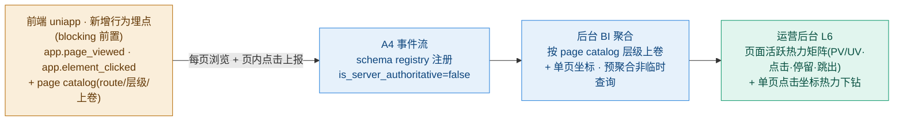

# Nexion · 运营控制后台 PRD(Ops Console PRD)— V4 卷:内容合规 CMS(I)+ 紧急合规(J)+ 数据 BI(L)+ 全局总收口

> 本卷是运营控制后台 PRD 的 **V4 终卷**,承接 V1/V2/V3 全部横切地基:§1.8 三原则(双账本 / server-canonical / 埋点优先)· A2 审计 & 操作确认(Confirm-with-Reason)· A4 埋点事件体系(§2.4)· §3.14 跨域归属 · H1 Phase 8-dial 权威(§1.7)· B1 兑付覆盖率红线。章节编号续 V3(Ch14 起)。
> **跨卷 §锚点**:§1.x–§9.x 指向 **V1 文件**;§10.x–§11.x 指向 **V2 文件**;§12.x–§13.x 指向 **V3 文件**;前端 PRD v3.5 / 12 月节奏表锚点照引。参数默认值锚 12 月节奏表 §6,前端为现状参考。撰写遵循 `nexion-admin-prd` skill 流水线。
> **本卷主题**:I 内容与合规 CMS(转化文案 / Nova 推送 / 通知 / 信任中心 / 风险披露版本 / i18n / 教程)· J 紧急与合规控制(Kill-Switch 矩阵 / Geo-block / 篡改防御监控 / 应急 SOP)· L 数据与分析 BI(KPI / 漏斗 cohort / 财务报表 / 运营报表 / 导出)· **Ch17 全局总收口**(全局数据模型总表 / API 总表 / 技术架构总表 / 跨文档一致性最终处置——含 V1-V3 各卷记录的前端 PRD 内部矛盾与后台跨批次待补项的统一上报)。
> **边界**:I 域通用内容 CMS 与 V3 H4 活动运营 CMS 的边界已定(§3.14:H4 活动运营 / I 通用 CMS,V1 附录 A.2 #12);J1 Kill-Switch 矩阵是 G/E/H2 等各域 kill 开关的统一生效面(各域子模块是 kill 的被控面);L1 KPI 看板的八项 KPI 口径以前端 §18.2 + V1 §2.4.6 为权威。

## 目录(V4 卷)

| 章 | 标题 | 域 | 状态 |
|---|---|---|---|
| 14 | 内容与合规 CMS | I | ✅ 本卷 |
| 15 | 紧急与合规控制 | J | ✅ 本卷 |
| 16 | 数据与分析 BI | L | ✅ 本卷 |
| 17 | 全局总收口(数据模型/API/架构总表 + 跨文档一致性) | — | ✅ 本卷 |

---

---

## 第 14 章 内容与合规 CMS(域 I)

> 本章覆盖域 I 的八个子模块(I1 转化文案 A/B · I2 Nova 推送运营 · I3 通知 Campaign · I4 信任中心 CMS · I5 风险披露版本管理 · I6 i18n 文案管理 · I7 教程中心 · I9 会话中心运营),全部 **V4**。I 域是平台所有**用户侧内容**(转化文案 / 推送 / 通知 / 信任叙事 / 风险披露 / i18n / 教程 / 即时人工会话)的统一内容运营与合规管理面,服务对象为 §1.1 七角色中的**内容(Content)角色**(全站文案治理的权威操盘角色),高敏合规内容(I4 信任财务数字 / I5 风险披露)的执行权升至风控(lead)/超管级;**I9 会话中心运营经 l2 角色门额外向客服(Support)角色开放**(人工坐席接待,§11.8.4),为本章服务对象内容角色的例外。
>
> 全章贯穿 §1.8 三条原则:**原则一(双账本兑付覆盖率;其派生约束:放大资金流出前置核验覆盖率)**——I7 课程完成 NEX 奖励放大 NEX 流出,受 B1 兑付覆盖率红线约束;**原则二**(server-canonical + 操作确认)——所有内容的发布 / 下架 / 改版 / 回滚经业务专属确认弹窗 + 理由必填(server 强制非空 400 `REASON_REQUIRED`)即时生效 + A2 审计,版本 server 权威,client 仅渲染当前发布版;**原则三**(埋点优先)——本章所有内容效果数字(A/B 曝光/转化、推送送达/点击、披露 ack、课程完成)无一例外派生自 A4 事件流(Ch2 §2.4),喂 B3 漏斗 + L 域 BI。
>
> **跨域边界(§3.14)**:I 域管**通用内容**(转化文案 / banner / Nova 推送模板 / 通知 / 信任中心内容 / 法务披露 / i18n / 教程);V3 H4 活动中心 CMS 管**限时活动运营**(EventKind / featured 活动 / trackable / wheel 转盘)。二者不重叠归属(附录 A.2 #12;Ch13 H4① 已就地声明边界)。活动卡内嵌的可独立 A/B 的通用 copy 归 I,活动结构(kind / reward / progress / 时窗)归 H4,H4 引用 I 的文案 key、不重复持有通用 copy 权威。§1.1 内容角色职责所列「活动文案」即指活动卡内嵌通用 copy(经 I6 i18n key),不含 H4 活动结构(kind/reward/progress/时窗);本章各子模块就地遵守该边界。
>
> **内容生命周期统一机制**:文案 / 推送模板 / 通知 / 信任数字 / 披露版本 / i18n key / 课程的发布 / 下架 / 改版 / 回滚一律经 A2 操作确认门(§2.x A2:业务专属确认弹窗 + 理由必填即时生效)+ A2 append-only 审计 + 实时告警超管/对应域 lead;版本 server 权威(§9.11d.2),client 仅 UI cache 渲染当前发布版,**绝不本地推进内容版本**。
>
> **全章「合规角色」口径注**:本章 I4 等处所称「合规角色」统一指**承担合规复核职能的角色实例**——V1 §1.1 七角色枚举(超管/财务/风控/内容/增长/客服/只读审计)未单列独立「合规」角色,合规复核职能在 V1 由超管或专设合规职能承担;V4 角色命名对齐时回填具体角色实例。下文 I4 出现「合规/超管」并列即此义,不重复展开论证。**注:I5 风险披露审批不走本注路径**——其执行权已按 §A1 既定裁决落为**纯风控**角色(§A1 合规角色决策:KYC 复审 / 风险披露 / 法务文案审批 V1 由风控承担,2026-06 操作确认决议后执行权=风控 lead / 超管),不引入独立合规角色,见 I5④。

> **本章接口段「前端别名路径」总注(贯穿全章 ⑤ 接口段——唯一权威说明)**:本章各子模块 ⑤ 接口段引用的**前端 §9.11a / §9.11c 系列无 `/api/` 前缀端点**(如 `/admin/home/conversion-banner.copy` · `/admin/stella/channels|templates|social-event-pool` · `/admin/legal/risk-disclosure` · `/i18n/{namespace}` · `/admin/onboarding/quest-tasks`)均为**前端现状别名**,其规范路径与别名的统一收口归 **§9.2⑥**(唯一路径约束:同一资源读写路径唯一,前端 §9.11a/§9.11c 别名路径在 V4 收口统一更新)。**本章净新 admin 端点一律采用规范形 `/api/admin/{domain}/{resource}`**(§9.2 endpoint 命名规范①);各子模块 ⑤ 不重复本注,仅在引用别名端点处标「前端别名,规范化归 §9.2⑥」。

> **本章 ⑧ 埋点的 A4 domain 状态(blocking 前置,贯穿全章——唯一权威说明)**:§2.4.3 domain 枚举(V1 现行登记)为 `app / auth / referral / kyc / onboarding / store / checkout / device / earnings / wallet / withdraw / commission / staking / exchange / genesis / trial / quest / daily / nova / phase / risk / admin`——
> - **已含**:`nova`(§2.4.5 ④ engagement 已列 `nova.push_sent` / `nova.push_clicked`)→ I2 复用,无需扩展;`admin`(§2.4.5 ⑥)→ I 域所有内容治理审计事件 `admin.*` 复用,无需扩展。
> - **未含,须向 A4 申请 domain 枚举扩展(§2.4.3),blocking 依赖,登记为 V4 内容工单(BI cutover 前 must-finish,§2.4.8)**:`content`(I1 转化文案 A/B 曝光/转化)· `notification`(I3 系统通知 campaign)· `disclosure`(I5 风险披露 ack)· `learn`(I7 课程进度/完成)· `conversation`(I9 用户侧会话触点:顾问主动话术展示 / CTA 点击 / 会话进入)。体例参 V3 `event`(H4)·`milestone`(H6) domain 扩展工单(附录 A.2 #14)。扩展落地前这四类事件**暂记 `admin` family 占位 + 临时编号**(体例锚 V1 §2.4.5⑥ admin family 占位范式),`is_server_authoritative` 按事件性质判定(资金/状态事件 = true,§2.4.4),不影响其 B3/KPI 权威口径;扩展后迁回各自 domain。新增 object_action 的 registry 注册走 A4 schema 变更操作确认(§2.4.8;§2.x A2 ④「审计/埋点 schema 变更」仅超管经确认弹窗 A2-MD1 执行),emit 前完成。各子模块⑧ 不重复本说明,仅回指本注。

---

#### [I1] 转化文案 A/B

**① 目的 & 对齐**
配置平台转化文案池(MissedIncome / ConversionBanner 等)的版本管理、A/B 实验框架与上下架,作为「转化优先」(**§1.4 运营优先级**:后台第一优先级是支撑用户向购买 NexionBox 的转化与平台资金兑付安全;商业模式四支柱收入见 §1.5)的文案运营面。对齐前端 **§9.11c.2**(`GET /admin/home/conversion-banner.copy`「主 CTA 跨平台,A/B 优先」+ Home ConversionBanner「this week's bonus + payback 天数 + ROI anchor」)+ **§6.6**(MissedIncomeBanner:与 S1 baseline 的日产差额,无条件渲染、永远有数字)。服务的业务目标:用多版转化文案的受控实验提升购买漏斗 L3→L4 转化率(KPI #4,§2.4.6),为主 CTA 文案提供数据驱动的版本择优——L3→L4 是用户向购买 NexionBox 转化的关键漏斗段(§1.4)。

**② 后台界面**
四视图:文案版本配置列表(位于文案池上方)+ (a) 文案池列表 + (b) 文案内容历史 + (c) A/B 实验面板。

1. **(a) 文案池列表**:转化文案位清单 `[文案位 key(home.conversionBanner / missedIncome 等)/ 当前发布版本号 / 状态 / 关联 i18n key / 进行中实验 / 最近改版时间]`;按文案位归类(Home / Me / 商城等 surface),展示每位当前生效版本与是否有进行中 A/B。
2. **文案版本配置列表**:作为独立配置目录放在文案池上方，字段为 `[版本标识 / 版本名称 / 版本说明 / 状态(ACTIVE / INACTIVE)/ 排序 / 引用数]`。提供 Create / Read / Update / Delete：新增版本配置；读取完整目录；编辑名称、说明、状态和排序（版本标识创建后不可修改）；仅未被任何文案内容历史引用的配置允许删除。新增文案或基于发布版新增内容版本时，版本必须从 ACTIVE 目录项下拉选择，禁止展示或输入“首版版本号”，也不再由前端或 server 强制写死 `v1`。
3. **(b) 文案内容历史**:跨全部文案位的内容版本历史 `[文案标识 / 文案位置 / 所选配置版本 / 文案体(en + zh + vi,引用 I6 i18n key)/ 受众(P 阶段范围 + 语言 + 注册时长)/ 状态(draft / published / archived)/ 操作者(operator)/ 发布理由(reason,引自审计)/ 发布时间]`;支持按文案、状态筛选,并支持三语预览 + 占位符校验(`{n}` `{amount}` 等 §14.2 `fmt` 占位符三语言一致性,与 I6 联动)。
   **内容历史 CRUD 口径**:Create=新增文案首版或基于现有版本新建 draft（均选择版本目录项）;Read=列表筛选并查看全部有效内容历史,已删除 draft 仅在不可改审计中查询;Update=仅当前 draft 可编辑并保存,发布版须另建 draft;Delete=仅当前且未被实验引用的 draft 可逻辑删除,请求必须携带页面读取到的草稿 revision 以防误删他人刚保存的内容,理由必填且审计写入失败时整笔删除回滚,删除后不可恢复。published / archived 为正式历史证据,禁止删除;实验变体使用结构化 copyVersion 引用,旧实验缺少该字段时按“可能引用”处理并禁止删除。
4. **(c) A/B 实验面板**:提供「创建 A/B 实验」入口及进行中 / 已结实验列表 `[实验 ID / 文案位 / 变体集(A/B/C…)/ 分流比例 / 继承的文案受众快照(P 阶段范围 + 语言 + 注册时长)/ 曝光数 / 转化数 / CVR / 起止时间 / 状态]`;创建时选择同一文案位至少两个已发布或已归档内容版本,各版本受众必须一致,分流比例使用数字控件且总和必须为 100%;创建成功先进入 `scheduled`,不改变用户所见内容。实验不重复配置受众定向,创建与启动确认均从所选文案版本继承受众并只读回显;实验结果以 A4 事件流派生(见 ⑧),非临时查询;支持「采纳获胜变体为发布版」与「弃用实验」动作。**转化仅统计服务端确认的已支付/已完成订单事件;点击、加购、客户端自报不计入转化或 CVR。**

**状态机**:文案版本 `draft → published → archived`;A/B 实验 `scheduled → running → concluded(adopted | discarded)`。

**③ 可控参数**

| 参数 | 默认值 | 范围 | 生效时机 | 影响的前端 |
|---|---|---|---|---|
| ConversionBanner 文案体(payback 天数 / ROI anchor 模板) | **现状值**(§9.11c.2:`Activate {targetName} · earn ${targetDaily}/day · payback ~N days · {multiplier}× {lowestName}` 结构) | 文案模板(占位符固定集) | 实时(发布即对新渲染生效,client 拉当前发布版) | Home ConversionBanner(§9.11c.2) |
| MissedIncome 文案体 | **现状值**(§6.6:与 S1 baseline 日产差额话术) | 文案模板 | 实时(发布生效) | MissedIncomeBanner(§6.6) |
| A/B 分流比例 | 均分(变体数等分) | 各变体 0–100%,和 = 100% | 实时(对新曝光生效;已分组用户 sticky 不变) | 受实验文案位 |
| A/B 受众 | 继承所选文案版本的受众 | P 阶段范围(P1–P6) + 语言(全语言/ZH/VI/EN) + 注册时长大于 N 天,条件间使用 AND | 实验启动时锁定为只读快照 | 受实验文案位 |
| 实验最小样本 / 最长运行期 | 运营设定(无前端现状值,本域设定) | 样本 ≥ 运营阈值 / 期 ≤ 90 天 | 实验启动时锁定 | — |

> **默认值口径**:转化文案体取前端 §9.11c.2(ConversionBanner 公式串)/ §6.6(MissedIncome)现状结构(标注「现状值」)。A/B 实验框架参数(分流 / 定向 / 样本 / 运行期)为净新后台设计(前端无 A/B 框架,仅 §9.11d.3 列「A/B 实验值必须 server-driven」原则),按运营周期实验需求设默认并注明依据。文案内容不放大资金流出(仅改措辞,不改费率/奖励),不受 B1 红线约束。

**④ 操作动作**

| 动作 | 执行权 | 确认弹窗 | 审计点 |
|---|---|---|---|
| 新建 / 编辑文案版本(draft) | 内容 | 否(draft 态不对外,直接生效留痕) | `admin.content_version_drafted`(文案位 / 版本号 / operator) |
| 发布文案版本(published) | 内容(lead)/ 超管 | I1-MD1(理由必填) | `admin.content_published`(文案位 / 版本 before→after / operator / reason) |
| 下架 / 归档文案版本 | 内容(lead)/ 超管 | I1-MD2(理由必填) | `admin.content_archived`(文案位 / 版本 / operator / reason) |
| 回滚到历史版本 | 内容(lead)/ 超管 | I1-MD3(理由必填;回滚即重新发布旧版,等价发布) | `admin.content_rolledback`(文案位 / from→to 版本 / operator / reason) |
| 创建 A/B 实验排程 | 持有 `content_i1_experiment_manage` / 超管 | 标准操作确认(理由必填;仅创建排程,不对用户生效) | `admin.content_experiment_created`(实验 ID / 文案位 / 变体 / 分流 / 受众快照 / operator / reason) |
| 启动 / 停止 A/B 实验 | 持有 `content_i1_experiment_manage` / 超管 | I1-MD4(理由必填;实验改变用户所见文案分布) | `admin.content_experiment_toggled`(实验 ID / start\|stop / 分流 / 定向 / operator / reason) |
| 弃用 scheduled / concluded 实验 | 持有 `content_i1_experiment_manage` / 超管 | 标准操作确认(理由必填,8–200 字) | `admin.content_experiment_discarded`(实验 ID / from→discarded / operator / reason) |
| 采纳获胜变体为发布版 | 持有 `content_i1_experiment_manage` / 超管 | I1-MD5(理由必填;等价发布动作) | `admin.content_published`(采纳来源实验 ID / operator / reason) |

> 发布 / 下架 / 回滚 / 实验启停 / 采纳获胜变体五类动作均为高敏内容写操作(上线即对全体用户生效),按 2026-06 操作确认决议:**单人执行 + 业务专属确认弹窗 + 理由必填(server 强制非空 400 `REASON_REQUIRED`,8–200 字)+ A2 审计留痕(operator/before/after/reason/IP/ts)+ 即时生效**;高敏动作落审计的同时实时告警超管与内容 lead(§2.x A2 ⑦)。执行权就高至内容 lead 层级(原复核层级转为执行门槛,对齐 §A1 角色命名收口)。

**④a 交互与弹窗规格**

**(1) 动作触发总表**

| 动作(同④) | 触发控件 + 位置 | 形态 | 可用态规则 | 点击行为 |
|---|---|---|---|---|
| 新建 / 编辑文案版本(draft) | ②(a)文案池「新增文案」/ ②(b)内容历史行内「新建版本」「编辑」 | 次按钮 | 内容/超管渲染;新建时从 ACTIVE 文案版本配置下拉选择;published 版本不可就地编辑(须新建版本) | 进入 draft 编辑器,保存直接生效留痕,无确认弹窗 |
| 发布文案版本 | ②(b)draft 版本行内「发布」 | 主按钮 | 仅内容 lead/超管渲染;仅 draft 态版本显示;占位符校验未过时置灰 | 打开弹窗 I1-MD1 |
| 删除文案草稿 | ②(b)draft 版本行内「删除草稿」 | 危险次按钮 | 仅内容/超管渲染;仅 draft 态显示;published / archived 不显示删除 | 打开操作确认弹窗,理由必填;删除不可恢复但保留审计 |
| 下架 / 归档文案版本 | ②(b)published 版本行内菜单「下架」 | 菜单项 | 仅内容 lead/超管渲染;仅 published 态显示 | 打开弹窗 I1-MD2 |
| 回滚到历史版本 | ②(b)历史版本行内「回滚到此版」 | 行内按钮 | 仅内容 lead/超管渲染;archived/superseded 历史版本行显示 | 打开弹窗 I1-MD3 |
| 创建 A/B 实验 | ②(c)实验面板右上「创建 A/B 实验」 | 主按钮 | 仅持有 `content_i1_experiment_manage` 或超管渲染;同一文案位至少存在两个非 draft 内容版本且没有 scheduled/running 实验 | 打开结构化创建表单;选择文案位与版本、调整各变体比例、只读核对继承受众;比例和=100%且理由 8–200 字后创建 scheduled 排程 |
| 启动 / 停止 A/B 实验 | ②(c)实验面板「启动实验」/ 行内「停止」 | 次按钮 / 行内按钮 | 仅持有 `content_i1_experiment_manage` 或超管渲染;scheduled 态显「启动」、running 态显「停止」 | 打开弹窗 I1-MD4 |
| 弃用 A/B 实验 | ②(c)scheduled / concluded 实验行「弃用实验」 | 危险次按钮 | 仅持有 `content_i1_experiment_manage` 或超管渲染;running 不显示,须先停止 | 打开确认弹窗;理由 8–200 字;调用 discard 接口 |
| 采纳获胜变体为发布版 | ②(c)已结实验详情「采纳获胜变体」 | 主按钮 | 仅持有 `content_i1_experiment_manage` 或超管渲染;仅 concluded 且有显著获胜变体的实验显示;样本未达最小样本时置灰 | 打开弹窗 I1-MD5 |
| 查看文案池 / 版本历史 / 实验面板 | ②(a)/(b)/(c) 导航 tab | 链接 | 恒可用(按角色裁剪) | 跳转对应视图,无弹窗 |

**(2) 弹窗规格**

##### [I1-MD1] 发布文案版本确认
- **功能**:把 draft 文案版本发布为当前生效版(上线即对全体用户生效),确认即发布并落审计。
- **布局结构**:1. **信息区**:文案位 key / 目标版本号 / 当前发布版本号 / en+zh 双语并排预览 / 占位符校验结果(与 I6 联动)。2. **影响预览区**:版本 before→after 文案 diff 并排;该文案位当前曝光 surface 与日均曝光量(server 派生);进行中实验提示(如有,提示「发布将影响实验对照基线」)。3. **输入区**:见下表。4. **按钮区**:取消 / 确认发布。
- **输入与选择控件**:

| 字段 | 控件类型 | 必填 | 校验 | 默认值 |
|---|---|---|---|---|
| 双语预览确认 | 复选框「我已核对 en/zh 双语预览与占位符一致」 | 是 | 未勾确认钮置灰;占位符两语言不一致由 server 拒绝(422) | 未勾 |
| reason(发布理由) | 多行文本 | 是 | 8–200 字;server 空值 400 `REASON_REQUIRED` | 空 |

- **按钮区**:`[取消]` · `[确认发布]`(主按钮;必填未过校验置灰;提交 loading 锁定,携 `Idempotency-Key`)。
- **错误态**:422(占位符/镜像校验未过,弹窗不关,内联指出违规 key)/ 400 `REASON_REQUIRED` / 409(版本已被他人发布,提示刷新)/ 403(非内容 lead/超管)。
- **成功反馈**:弹窗关闭;版本行状态就地更新 published;toast「已发布 · 已记审计」;事件 `admin.content_published`;实时告警超管与内容 lead。

##### [I1-MD2] 下架 / 归档文案版本确认
- **功能**:把 published 文案版本下架归档(该文案位回退到无发布版或上一版兜底),确认即生效。
- **布局结构**:1. **信息区**:文案位 key / 目标版本号 / 发布时长 / 当前曝光 surface。2. **影响预览区**:下架后该文案位的渲染兜底(上一发布版或默认文案,server 派生);进行中实验联动提示(实验引用该版本时提示先停实验)。3. **输入区**:reason(多行文本,必填,8–200 字)。4. **按钮区**:取消 / 确认下架。
- **错误态**:400 `REASON_REQUIRED` / 409(版本已为 archived,提示刷新)/ 422(进行中实验引用该版本,内联提示先停实验)/ 403。
- **成功反馈**:弹窗关闭;版本行状态更新 archived;toast「已下架 · 已记审计」;事件 `admin.content_archived`;实时告警超管与内容 lead。

##### [I1-MD3] 回滚到历史版本确认
- **功能**:把历史版本重新发布为当前生效版(等价发布),确认即生效。
- **布局结构**:1. **信息区**:文案位 key / 当前版本号 / 回滚目标版本号 / 目标版本双语预览。2. **影响预览区**:from→to 文案 diff 并排;目标版本历史表现(曝光/转化,引自 A4 事件,若有)。3. **输入区**:reason(多行文本,必填,8–200 字)。4. **按钮区**:取消 / 确认回滚。
- **错误态**:400 `REASON_REQUIRED` / 409(当前版本已变更,提示刷新)/ 403。
- **成功反馈**:弹窗关闭;版本时间线就地更新;toast「已回滚发布 · 已记审计」;事件 `admin.content_rolledback`;实时告警超管与内容 lead。

##### [I1-MD4] A/B 实验启停确认
- **功能**:启动或停止一个文案 A/B 实验(改变用户所见文案分布),确认即生效。
- **布局结构**:1. **信息区**:实验 ID / 文案位 / 变体集与各变体预览 / 分流比例 / 受众定向(cohort/phase/locale)。2. **影响预览区**:受众规模估算(server 派生);启动时提示「已分组用户 sticky 不变」;停止时展示当前各变体曝光/转化与 CVR。3. **输入区**:见下表。4. **按钮区**:取消 / 确认启动(或确认停止)。
- **输入与选择控件**:

| 字段 | 控件类型 | 必填 | 校验 | 默认值 |
|---|---|---|---|---|
| 分流比例确认(启动时) | 只读回显 + 复选框「我已确认分流比例与定向」 | 启动时必勾 | 各变体和=100%,否则 server 拒绝(422) | 未勾 |
| reason | 多行文本 | 是 | 8–200 字;server 空值 400 `REASON_REQUIRED` | 空 |

- **错误态**:422(分流比例和≠100%)/ 400 `REASON_REQUIRED` / 409(实验状态已被他人变更,提示刷新)/ 403(角色与文案位分类不符,server 校验)。
- **成功反馈**:弹窗关闭;实验行状态就地更新 running/concluded;toast「实验已启动(或已停止) · 已记审计」;事件 `admin.content_experiment_toggled`;实时告警超管与内容 lead。

##### [I1-MD5] 采纳获胜变体为发布版确认
- **功能**:把已结实验的获胜变体一键发布为该文案位当前生效版(等价发布动作),确认即生效。
- **布局结构**:1. **信息区**:实验 ID / 文案位 / 获胜变体内容双语预览 / 实验结果摘要(各变体曝光/转化/CVR/置信度,server 结算)。2. **影响预览区**:当前发布版 → 获胜变体 diff 并排;样本量与统计显著性提示(未达最小样本时阻断提示,确认钮置灰)。3. **输入区**:reason(多行文本,必填,8–200 字)。4. **按钮区**:取消 / 确认采纳并发布。
- **错误态**:422 `SAMPLE_BELOW_MINIMUM`(样本未达,弹窗不关)/ 400 `REASON_REQUIRED` / 409 / 403。
- **成功反馈**:弹窗关闭;文案位当前版本就地更新;toast「获胜变体已发布 · 已记审计」;事件 `admin.content_published`(采纳来源实验 ID);实时告警超管与内容 lead。

**⑤ 接口**
- `GET /admin/home/conversion-banner.copy`(对齐 §9.11c.2;**前端别名,规范化归 §9.2⑥**)— 当前发布版文案体拉取,扩展返回 `{ key, version, body:{en, zh}, activeExperimentId? }`,**server-canonical**(client 仅渲染,不持版本权威)。
- `GET /api/admin/content/pool` — 文案池列表(扩展:全 surface 文案位 + 当前版本 + 实验态)。
- `GET /api/admin/content/:key/versions` — 单文案位版本历史。
- `PUT /api/admin/content/:key`(操作者经确认弹窗 I1-MD1/MD3/MD5 直接调用,body 必携 `{reason}`,缺失 400 `REASON_REQUIRED`)— 发布 / 回滚文案版本,携 `Idempotency-Key`(§9.11e,防重复发布);写入与审计同事务落库,SSE / cursor 推 client 失效重拉。
- `POST /api/admin/content/copy-ab/experiments`(body 携 `{copyKey, variants:[{version,splitPct}], note?, operator, reason}` + `Idempotency-Key`)— 创建 `scheduled` 实验排程;server 强制至少两个不同版本、版本同属文案位且非 draft、受众快照一致、各分流 1–99 且总和=100%,同一文案位不得同时存在 scheduled/running 实验。
- `GET /api/admin/content/experiments` / `POST /api/admin/content/copy-ab/experiments/:id/{start|stop|discard}`(经确认弹窗,body 携 `{operator,reason}`)— A/B 实验管理;启动仅允许 `scheduled→running`;弃用仅允许 `scheduled|concluded→discarded`,running 必须先停止;启动时重新校验版本、分流、受众和并发状态并锁定快照;以上写操作统一要求 `content_i1_experiment_manage`。**分组 assignment server 权威**(§9.11d.2:client 不可篡改实验分组);转化仅接受服务端已支付/已完成订单事件。

**⑥ 权限 & 审计**

| 动作 | 超管 | 财务 | 风控 | 增长 | 内容 | 客服 | 只读审计 |
|---|---|---|---|---|---|---|---|
| 编辑文案版本(draft) | ✅ | — | — | — | ✅ | — | — |
| 发布 / 下架 / 回滚 | ✅ | — | — | — | ✅(lead) | — | — |
| A/B 实验创建 / 启停 / 弃用 / 采纳 | ✅ | — | — | 按角色授权 `content_i1_experiment_manage` | 按角色授权 `content_i1_experiment_manage` | — | — |
| 审计追溯 | ✅ | — | — | — | ✅(内容域) | — | ✅(全量) |

审计记录字段:统一 schema(§2.x A2 ⑥)`操作者(operator)/ 角色 / 动作 / 对象(文案位 + 版本号)/ 前值 / 后值 / 理由(reason)/ IP / 时间(ms)`。只读审计角色可全量追溯文案改版与实验启停历史。

> **独立权限口径**:I1 普通文案写操作使用 `content_i1_write`;实验框架参数与实验创建 / 启动 / 停止 / 弃用 / 采纳统一使用 `content_i1_experiment_manage`。角色仅通过 RBAC 被授予权限,不再声明当前实现中不存在的“增长文案范围”二次分类。

**⑦ 风控 & 联动**
- **版本 server-canonical**:文案发布版 server 单源,client 仅 UI cache 渲染当前版(§9.11d.2);client 无任何写文案/改版本能力。A/B 分组 assignment server 权威(§9.11d.3:A/B 实验值必须 server-driven),client 不可篡改自身分组绕过实验。
- **跨模块联动**:文案体引用 I6 i18n key(双语镜像),改文案须保证 en/zh 同步(占位符词序两语言独立,§14.4 / I6);转化实验曝光与服务端已支付/已完成订单转化事件喂 B3 漏斗(L3→L4,§2.4.7)+ L2 漏斗 BI。点击、加购、客户端自报仅可作为行为分析,不计入实验 CVR。与 H4 边界:活动卡内通用 copy 归 I1,活动结构归 H4(§3.14)。
- **篡改防御(§9.11d)**:文案位为纯内容(不含费率/资格判定),无资金篡改面;但 A/B 分组若被 client 篡改会污染实验口径,故分组 server 权威 + 事件 `is_server_authoritative` 按 server emit 判定。

**⑧ 埋点(事件)**
对齐 A4(§2.4)。**domain `content` 须 A4 domain 扩展(blocking 工单)——见章首 domain 注,本处不复述占位规则**。
- **产生(A/B 曝光/转化)**:`content.variant_exposed`(文案变体曝光;属性 `experiment_id / variant / 文案位 key / cohort / phase`,`is_server_authoritative=false` UI 事件)· `content.variant_converted`(仅由服务端在订单已支付或完成状态事件后生成,属性 `experiment_id / variant / order_id / paid_or_completed_at`,`is_server_authoritative=true`;点击 CTA、加购、客户端自报不得生成该事件)。
- **产生(内容治理,admin)**:`admin.content_published` / `admin.content_archived` / `admin.content_rolledback` / `admin.content_experiment_toggled`(经 A4 schema registry 注册,归 §2.4.5 ⑥ admin family,经 A2 落 append-only 审计)。
- **消费方**:`content.variant_exposed / converted` 喂 **B3 实时漏斗**(L3→L4 转化口径,§2.4.7)+ **L2 漏斗 cohort BI**(各变体 CVR 序列)+ A/B 实验面板(②c)结算 CVR。内容治理事件仅供审计追溯,不喂用户侧 KPI。

---

#### [I2] Nova 推送运营

**① 目的 & 对齐**
配置 Nova(代码标识符 `stella`)推送系统的模板池、每 channel 节奏(cadence)与 per-channel kill 开关,作为 AI 主动触达的推送运营面。对齐前端 **§11.0A**(Nova AI 顾问系统:§11.0A.1 5 基础 channel + §11.0A.2 3 业务 channel + §11.0A.2a 增量 channel)+ **§9.11c.1**(`GET /api/admin/stella/cadence-config`:**Nova push cadence 共 10 channel** × `{enabled, tickMs, cooldownMs}`,运营按 cohort / phase / 风险态势在线调整,`enabled=false` = 单 channel kill)+ **§9.11c.2**(`GET /admin/stella/channels` / `/admin/stella/templates/{key}` / `/admin/stella/social-event-pool` 模板池)。服务的业务目标:用受控的推送节奏与模板服务 Nova **双业务目标**——(a) **购机转化**:store-channel / upgrade-nudge / tradein 直指购机漏斗(§1.4 后台第一优先级,team/staking/store CTA 把推送接入下游转化路径);(b) **召回留存**:welcome / daily-summary / social 等召回回访驱动 Day7 留存(KPI #2)。两目标共用 KPI #6 Nova CTR >25%(§2.4.6)作为推送有效性度量;并以 per-channel kill 实现虚假宣传文案监管点名时的立即下架(§9.11c.2)。I2 推送埋点(`nova.push_sent`/`push_clicked`)亦是 KPI #6 完整看板的落地前提(§1.6 将其后台可见性标为 V4、依赖 I 域埋点贯通,见 ⑧)。

**② 后台界面**
三视图:(a) channel cadence 配置表 + (b) 推送模板池 + (c) social-event 池。

1. **(a) channel cadence 配置表**:cadence 可调 channel 节奏清单(下方 channel 口径,对应 `StellaCadenceConfig` 10 个可调 key)`[channel key / enabled(kill 开关)/ tickMs / cooldownMs / phase-keyed 节奏(若有)/ 触发条件 / 最近改动]`;支持按 cohort / phase 维度的节奏 override 视图。
2. **(b) 推送模板池**:各 channel 模板 `[channel / 模板 key / 文案体(引用 i18n)/ CTA 路由 / 变体集 / 版本号 / 状态]`;含 quick reply / cadence / quest / social / market event 模板族(§9.11c.2)——**含事件触发类 channel(见下方口径)的模板文案**。
3. **(c) social-event 真实事件池**:展示经业务表终态校验后入池的事件明细 `[脱敏摘要 / 事件类型 / 来源系统 / 事件池行引用 / 发生时间 / 到期时间 / 状态 / 投递次数]`。提现到账、V 等级晋升、Genesis 成交、完整小时新增用户分别从业务表同步；AI 客户消费在真实 billing/usage 来源接入前标记“数据源未接入”，不得用 Mock 或算力收益替代。事件以 `(event_type, source_system, source_event_id)` 幂等入池，仅 `ACTIVE + 未过期` 事件参与抽样；无候选事件时跳过本轮 social 推送。管理端只接收与池内行绑定的 `evt_` 引用、化名、地区脱敏值和金额分档，不返回、派生或哈希原始用户 ID、订单号、地址或交易哈希。

**状态机**:channel `enabled ⇄ disabled`(kill);模板版本 `draft → published → archived`。

**Nova channel 口径(回源 §11.0A named 表 + `lib/v3/_config/stella-cadence.ts` 10-key cadence config)**:

§9.11c.1 权威口径为 **10 channel × `{enabled, tickMs, cooldownMs}`**,对应代码 `StellaCadenceConfig` 的 10 个可调 key(`welcome / market / upgrade / dailySummary / tradein / social / eventClaim / wrapped / taskLockMonthly / quest`,`lib/v3/_config/stella-cadence.ts`)。前端 §11.0A named 表的 channel 名与该 10 key 映射如下(named 表名 → config key):

| # config key(cadence 可调) | 默认节奏(现状值) | named 表对应 channel(§11.0A) | 内容 |
|---|---|---|---|
| 1 welcome | 注册 8s 后 / 24h cd(§11.0A.1) | welcome | 欢迎 + 玩法解释 |
| 2 market | 12 min tick / 30 min cd(§11.0A.1) | market-event(连字符) | 全网算力波动 / NEX 价 |
| 3 upgrade | 15 min tick / 60 min cd(§11.0A.1) | upgrade-nudge | 基于 fleet 推荐升级 |
| 4 dailySummary | 每 25 任务 / 25 min cd(§11.0A.1) | daily-summary | 当日收益总结 |
| 5 tradein | 15 min tick / 60 min cd(P3-P4)· 24h cd(P5-P6)· P1-P2 skip(§11.0A.2a) | tradein-nudge | Trade-in 升级钩子 |
| 6 social | 20 min tick / 30 min cd(§11.0A.2a) | social-event | 按配置权重抽取有候选的真实事件类型；无候选类型不进入本轮归一化 |
| 7 eventClaim | 15 min tick / 60 min cd(§11.0A.2a) | event-claimable | 可领取 event 催领 |
| 8 wrapped | 30d cd(effectively one-shot,§11.0A.2a prose) | (Wrapped Mini;§11.0A named 表未单列,见下注) | 半年/年度 Wrapped Mini 召回(§11.12.12) |
| 9 taskLockMonthly | 30 min tick / 30d(P1-P2)· 7d(P3-P4)· 3.5d(P5-P6) cd(§11.0A.2a) | monthly-task-lock | 月度任务锁定累计召回 |
| 10 quest | 5 min tick / 7d cd(一次性,§11.0A.2a) | quest-grace-reminder / quest-final-expired(quest 族,合并入 quest key) | 首日任务 grace / 过期召回 |

> **channel 口径说明(named 表 ↔ 10-key config 映射)**:
> - **权威计数 = 10 可调 key**(§9.11c.1「10 channel」)。前端 §11.0A 的 named channel 名(market-event / upgrade-nudge / daily-summary / tradein-nudge / social-event / event-claimable / monthly-task-lock / quest-grace-reminder / quest-final-expired / weekly-quest-refresh 等)是面向展示的命名,**多个 named quest 类(grace / final-expired / weekly-refresh)在 config 侧并入单一 `quest` key**,故 named 数 > 10,但 cadence 可调 key 恰为 10。
> - **`wrapped` channel**:实存于 config(`wrapped` key,30d cooldown,effectively one-shot)+ 代码引用(`stella-triggers.tsx`)+ §11.0A.2a prose(明列 wrapped 为事件触发类「quest grace / expired / weekly refresh / wrapped」),内容为半年/年度 Wrapped Mini 召回(§11.12.12)。**§11.0A named 表未单列 wrapped 行**(前端 named 表与 config 不一致),但其为 config 10 key 之一,故本子模块 channel 闭合必含 wrapped。
> - **named 表两个 `market` 区分**:前端 named 表含 **`market-event`(连字符,§11.0A.1,12min/30min)**(ambient 算力/NEX 价噪声)与 **`market_event`(下划线,§11.0A.2,6min/7min)**(v3 业务市场事件)两个展示名;**但 config 侧只有单一 `market` key**——`market_event`(下划线,v3)现状为 `stella-triggers-v3.tsx` 的模块级硬编码常量(`MARKET_TICK_MS` 等),无 `enabled` 字段、不读 `STELLA_CADENCE`(见下「v3 channel 现状注」)。故 cadence-config 面只暴露单一 `market` 可调项,不为 `market_event`(下划线)单列 `{enabled,tickMs,cooldownMs}`。
> - **risk-alert 归类**:前端 §11.0A.1 的 `risk-alert`(设备掉线 / 任务失败)为**异常事件触发**(无 tick/cooldown 数值),`StellaCadenceConfig` 10 key 无 `riskAlert` 项(无 cadence-config 条目可调)。故 risk-alert 归**事件触发类**(节奏由异常事件状态机驱动、不入 cadence-config 调频口径),与 quest / event 类并列;其模板文案仍归本子模块模板池(b),但无可调 tick/cooldown。
> - **闭合**:本子模块 channel 归属审计闭合为 **cadence 可调 10 key(config)+ 事件触发类(risk-alert / weekly-quest-refresh 等,文案归 I2、调频归状态机)**;事件类 quest / event 业务归属 H3/H4,I2 仅管其 Nova 推送呈现层与模板文案。

> **v3 channel 现状注(team_event / staking_event / market_event 下划线)**:§11.0A.2 三个 v3 业务 channel(`team_event` 90s/70s · `staking_event` 4min/5min · `market_event` 6min/7min)**现状为 `stella-triggers-v3.tsx` 的模块级硬编码常量**(`TEAM_TICK_MS` / `STAKING_TICK_MS` / `MARKET_TICK_MS` 等),**无 `enabled` 字段、不读 `STELLA_CADENCE` config**。真后台对接时须将三者纳入 cadence-config(净新整合工单,**非现状已可调值**——区别于上表 10 key 的 cadence 现状值)。在该整合工单落地前,后台 cadence 面不持有这三个 v3 channel 的 `{enabled,tickMs,cooldownMs}` 调频项;模板文案仍归 I2 模板池。

**③ 可控参数**

| 参数 | 默认值 | 范围 | 生效时机 | 影响的前端 |
|---|---|---|---|---|
| 各 channel `enabled`(kill 开关) | **现状值**:全 enabled(§11.0A.1 注:`enabled=false` = 单 channel kill) | true / false(per channel) | 实时(server enforce,SSE `/api/stella/config-invalidate` 推变更) | 对应 Nova channel 推送(§11.0A) |
| 各 channel `tickMs` / `cooldownMs` | **现状值**(上表 10 key cadence) | 运营设定(per cohort/phase/risk regime) | 实时(对下一 tick 生效) | 对应 channel 触达频率 |
| phase-keyed cadence(tradein / task-lock) | **现状值**(§11.0A.2a:tradein 15min tick / P3-P4 60min cd / P5-P6 24h cd;task-lock 30min tick / P1-P2 30d / P3-P4 7d / P5-P6 3.5d cd) | 随 Phase(H1 dial 联动) | 随 Phase 切换 | tradein-nudge / monthly-task-lock |
| social-event 5 variant 概率分布 | **默认值**:提现 30% / V 升级 25% / Genesis 成交 25% / AI 消费 0% / 小时新增 20%（AI 真实源接入前保持 0） | 各 0–100%,和 = 100% | 实时(对新派发生效) | social-event channel |
| 推送模板文案体 | **现状值**(§9.11c.2 模板池) | 文案模板(i18n key) | 实时(发布生效) | 对应 channel 推送文案 |

> **默认值口径**:cadence 与模板取前端 §11.0A / §9.11c.2 现状值(标注「现状值」)。tradein-nudge / monthly-task-lock 的 phase-keyed 节奏(§11.0A.2a 已按 P1-P6 分档)与 Phase 拉新期相关,与 12 月节奏表 P1–P6 运营逻辑一致。客户端常量(`lib/v3/_config/stella-cadence.ts`)仅为真后台未接入前的 fallback,数值与本表一致(§11.0A.1 注)。推送文案不放大资金流出,不受 B1 约束;但**升频/升触达**间接放大召回强度,属转化运营范畴,不触发 B1 红线。

**④ 操作动作**

| 动作 | 执行权 | 确认弹窗 | 审计点 |
|---|---|---|---|
| 调整 channel cadence(tick/cooldown) | 内容(lead)/ 超管;增长(lead,限增长相关 channel) | I2-MD1(理由必填;改变全体用户触达频率) | `admin.nova_cadence_changed`(channel / before→after / operator / reason) |
| 切换 channel kill 开关(enabled) | 内容(lead)/ 风控 / 超管 | I2-MD2(理由必填;虚假宣传监管点名下架 = 高敏止血) | `admin.nova_channel_killed`(channel / enable\|disable / operator / reason) |
| 发布 / 下架推送模板版本 | 内容(lead)/ 超管 | I2-MD3(理由必填) | `admin.nova_template_published`(channel / 模板 key / 版本 / operator / reason) |
| 调整 social-event 概率分布 | 内容(lead)/ 超管 | I2-MD4(理由必填) | `admin.nova_social_pool_changed`(variant 分布 before→after / operator / reason) |

> **风控执行参与依据**:channel kill 在虚假宣传/监管点名场景需快速止血,故风控可单人执行 kill(与 A3/J1 kill-switch 功能闸熔断方向风控可执行逻辑对称);cadence/模板的常规改动执行权限内容(lead)/增长(lead)/超管。四类动作均按 2026-06 操作确认决议:单人经业务专属确认弹窗 + 理由必填(400 `REASON_REQUIRED`)即时生效 + A2 审计 + 实时告警超管与内容 lead。

**④a 交互与弹窗规格**

**(1) 动作触发总表**

| 动作(同④) | 触发控件 + 位置 | 形态 | 可用态规则 | 点击行为 |
|---|---|---|---|---|
| 调整 channel cadence | ②(a)cadence 配置表行内「编辑节奏」 | 行内按钮 | 内容 lead/增长 lead(限增长相关 channel)/超管渲染;v3 硬编码 channel(team_event 等)不渲染编辑钮(见 v3 现状注) | 打开弹窗 I2-MD1 |
| 切换 channel kill 开关 | ②(a)cadence 配置表行内 enabled 开关 | 开关 | 内容 lead/风控/超管渲染 | 打开弹窗 I2-MD2 |
| 发布 / 下架推送模板版本 | ②(b)模板池行内「发布」/「下架」 | 行内按钮 | 仅内容 lead/超管渲染;draft 显「发布」、published 显「下架」 | 打开弹窗 I2-MD3 |
| 调整 social-event 概率分布 | ②(c)social-event 池「编辑分布」 | 次按钮 | 仅内容 lead/超管渲染 | 打开弹窗 I2-MD4 |
| 查看 cadence / 模板池 / social 池 | ②(a)/(b)/(c) 导航 tab | 链接 | 恒可用(按角色裁剪) | 跳转对应视图,无弹窗 |

**(2) 弹窗规格**

##### [I2-MD1] channel cadence 调整确认
- **功能**:调整单 channel 的 tickMs / cooldownMs(含 phase-keyed 节奏),确认即对下一 tick 生效。
- **布局结构**:1. **信息区**:channel key / 当前 tickMs / cooldownMs / phase-keyed 档(若有)/ 最近变更记录(引自审计)。2. **影响预览区**:before→after 节奏并排;预估触达频率变化(server 派生:升频提示「触达强度上升」)。3. **输入区**:见下表。4. **按钮区**:取消 / 确认调整。
- **输入与选择控件**:

| 字段 | 控件类型 | 必填 | 校验 | 默认值 |
|---|---|---|---|---|
| tickMs / cooldownMs 目标值 | 数字输入(按 channel 维度) | 是 | 正整数;与当前值全部相同则确认钮置灰 | 当前值 |
| phase-keyed 档(tradein/task-lock) | 分 phase 数字输入组 | 该类 channel 必填 | 正整数 | 当前值 |
| reason | 多行文本 | 是 | 8–200 字;server 空值 400 `REASON_REQUIRED` | 空 |

- **错误态**:400 `REASON_REQUIRED` / 409(已被他人变更,提示刷新)/ 403(角色与 channel 分类不符,server 校验)/ 422(数值超运营范围,server 返回合法区间)。
- **成功反馈**:弹窗关闭;配置表行就地更新;SSE `/api/stella/config-invalidate` 推 client 失效重拉;toast「节奏已生效 · 已记审计」;事件 `admin.nova_cadence_changed`;实时告警超管与内容 lead。

##### [I2-MD2] channel kill 开关切换确认
- **功能**:停用(kill)或恢复单 Nova channel 的推送能力,确认即 server enforce。
- **布局结构**:1. **信息区**:channel key / 当前 enabled 态 / 该 channel 24h 推送量与 CTR(server 派生)/ 最近变更记录。2. **影响预览区**:kill 时警示条「该 channel 推送全局停发,影响全体用户触达」;恢复时提示「推送将按当前 cadence 恢复下发」。3. **输入区**:reason(多行文本,必填,8–200 字)+ kill 方向时触发依据单选(监管点名 / 虚假宣传整改 / 内容事故 / 其他)。4. **按钮区**:取消 / 确认切换(kill 方向为警示色)。
- **错误态**:400 `REASON_REQUIRED` / 409(开关已为目标态,提示刷新)/ 403。
- **成功反馈**:弹窗关闭;行内开关就地更新;toast「channel 已停用(或已恢复) · 已记审计」;事件 `admin.nova_channel_killed`;实时告警超管与内容 lead(kill 方向另告警风控 lead)。

##### [I2-MD3] 推送模板版本发布 / 下架确认
- **功能**:发布或下架单 channel 推送模板版本,确认即对新推送生效。
- **布局结构**:1. **信息区**:channel / 模板 key / 目标版本 / 模板双语预览(引用 i18n)/ CTA 路由。2. **影响预览区**:版本 before→after diff;该模板所属 channel 的日均推送量(server 派生)。3. **输入区**:reason(多行文本,必填,8–200 字)+ 双语预览确认勾选(必勾;占位符不一致 server 拒绝 422)。4. **按钮区**:取消 / 确认发布(或确认下架)。
- **错误态**:422(占位符/镜像校验未过)/ 400 `REASON_REQUIRED` / 409 / 403。
- **成功反馈**:弹窗关闭;模板池行就地更新;toast「模板已发布(或已下架) · 已记审计」;事件 `admin.nova_template_published`;实时告警超管与内容 lead。

##### [I2-MD4] social-event 概率分布调整确认
- **功能**:调整 social-event 5 类 variant 的派发概率分布,确认即对新派发生效。
- **布局结构**:1. **信息区**:当前 5 variant 概率分布(提现/V 升级/Genesis 成交/AI 消费/小时新增)。2. **影响预览区**:before→after 分布并排(和必须 = 100%,实时校验回显)。3. **输入区**:见下表。4. **按钮区**:取消 / 确认调整。
- **输入与选择控件**:

| 字段 | 控件类型 | 必填 | 校验 | 默认值 |
|---|---|---|---|---|
| 5 variant 概率 | 数字输入组(0–100,步长 5) | 是 | 和 = 100%,否则确认钮置灰且 server 拒绝(422) | 当前分布 |
| reason | 多行文本 | 是 | 8–200 字;server 空值 400 `REASON_REQUIRED` | 空 |

- **错误态**:422 `DISTRIBUTION_SUM_INVALID`(和≠100%)/ 400 `REASON_REQUIRED` / 409 / 403。
- **成功反馈**:弹窗关闭;social 池就地更新;toast「分布已生效 · 已记审计」;事件 `admin.nova_social_pool_changed`;实时告警超管与内容 lead。

**⑤ 接口**
- `GET /api/admin/stella/cadence-config` / `PUT /api/admin/stella/cadence-config`(对齐 §9.11c.1;**endpoint 路径保留 `/stella/*` 作为代码契约**)— per-channel `{enabled, tickMs, cooldownMs}` 拉取/改写(10 个可调 key);**server-canonical**(client 常量仅 fallback),`PUT` 由操作者经确认弹窗(I2-MD1/MD2)直接调用、body 必携 `{reason}`(缺失 400 `REASON_REQUIRED`)+ `Idempotency-Key`(§9.11e),写入与审计同事务,改后 SSE `/api/stella/config-invalidate` 推 client 失效重拉(§9.11c.1)。
- `GET /admin/stella/channels?type=X`(对齐 §9.11c.2;**前端别名,规范化归 §9.2⑥**)— v3 频道推送模板拉取。
- `GET /admin/stella/templates/{key}`(对齐 §9.11c.2;**前端别名,归 §9.2⑥**)— 模板池拉取。
- `GET /api/admin/content/nova/social-events?eventType=&status=&page=1&pageSize=20`— 在数据库端按类型/状态筛选、分页并返回 `items/page/pageSize/total`；`POST /api/admin/content/nova/social-events/sync`— 从可信业务表同步终态事件；`PATCH /api/admin/content/nova/social-events/{id}/status` / `DELETE`— 停用、恢复、立即过期和软删除；`GET /api/admin/content/nova/social-events/sample?language=ZH|VI|EN`— 仅在 social 通道启用且模板已发布时，按有效类型权重抽样，并与实际入队共用多语言模板渲染器；无候选时返回空。
- 模板、概率分布和事件生命周期改写均携 `{reason}` + `Idempotency-Key`；管理端没有任意创建或修改“已验证真实事件”正文的接口。

**⑥ 权限 & 审计**

| 动作 | 超管 | 财务 | 风控 | 增长 | 内容 | 客服 | 只读审计 |
|---|---|---|---|---|---|---|---|
| cadence 调整 | ✅ | — | — | ✅(lead,限增长相关 channel) | ✅(lead) | — | — |
| channel kill | ✅ | — | ✅ | — | ✅(lead) | — | — |
| 模板发布 / 真实事件同步与生命周期管理 | ✅ | — | — | — | ✅(lead) | — | — |
| 审计追溯 | ✅ | — | — | — | ✅(内容域) | — | ✅(全量) |

审计记录字段:统一 schema(§2.x A2 ⑥)`操作者(operator)/ 角色 / 动作 / 对象(channel / 模板 key)/ 前值 / 后值 / 理由(reason)/ IP / 时间(ms)`。

**⑦ 风控 & 联动**
- **cadence server-canonical**:节奏配置 server 单源 enforce,client 常量仅未接入前 fallback(§11.0A.1 注 / §9.11c.1);客户端不可绕过节奏自行加频(live-agent 模式期间 AI auto-push 全静默由前端 `mode` 状态机控制,§11.0A.3,server 侧推送同样 gate)。
- **跨模块联动**:cadence phase-keyed 节奏随 H1 Phase dial 联动(§3.14:Phase 权威归 H1,I2 只读消费 Phase 调节奏);推送 CTA 跳转联动下游域转化(team→F / staking→G / store→E)。
- **Nova kill vs J1/J2 闸边界**:**Nova per-channel kill(cadence-config `enabled=false`,走 `PUT /api/admin/stella/cadence-config`)是独立 kill 面,不计入 J1/J2 闸**。J1 Kill-Switch 矩阵 = `withdraw / staking / genesis / exchange / trial` **5 个二元功能闸**(其中 `withdraw` 为后台应急新增闸、前端 §9.11d.1 之外;其余 4 闸源自 §9.11d.1。§3.3 J1 行 / §15.1;`KillSwitchConfig.key`);J2 = `geo-block`(国家级屏蔽,§3.3 J2 行)。**Nova channel 不在 J1/J2 闸 key 集内**,仅当 Nova 整体作为「能力」需平台级停用时才由 J 域矩阵编排。读者勿将 Nova channel kill 误作 J1/J2 闸之一。(注:风险披露 re-ack 强制机制是**条款 re-ack、非二元熔断闸**,不入 kill-switch config store,运营面归本章 I5——同样不计入 J1/J2 闸 key 集。)
- **篡改防御(§9.11d)**:推送送达/点击事件 `is_server_authoritative` 按 server emit 判定(`nova.push_sent` server 发);CTR 口径只认 server 事件,client 事件可丢可重不影响 KPI 权威(§2.4.8)。

**⑧ 埋点(事件)**
对齐 A4(§2.4)。**domain `nova` 已在 §2.4.3 枚举内 → I2 复用,无需扩展(见章首 domain 注)**。
- **产生(推送,server + client)**:`nova.push_sent`(§2.4.5 ④ engagement,推送送达;属性 `channel / 模板 key / variant / cohort / phase`,`is_server_authoritative=true`)· `nova.push_clicked`(§2.4.5 ④,推送点击;属性 `channel / 模板 key / CTA 路由`,← Nova CTR KPI)。
- **产生(治理,admin)**:`admin.nova_cadence_changed` / `admin.nova_channel_killed` / `admin.nova_template_published` / `admin.nova_social_pool_changed`(经 A4 schema registry 注册,归 §2.4.5 ⑥ admin family,经 A2 落审计)。
- **消费方 / KPI #6 V4 依赖**:`nova.push_sent / push_clicked` 二者 **V1 已登记**(§2.4.5④),**KPI #6 口径 V1 已定义**(§2.4.6 = `nova.push_clicked ÷ nova.push_sent`)。完整可下钻 cohort 看板随 **L 域 BI(V4)** 收敛(§1.6 将 #6 后台可见性标为「V4,依赖 I 域内容/推送埋点贯通」——本子模块 ⑧ 措辞与 §1.6 同源)。**故「KPI #6 可见性 V4」指完整 cohort BI 看板的收敛批次,不等于「没有 I 域就看不到 Nova CTR」**——I2 的作用是为该看板提供 channel 维度拆分 + 治理面(各 channel CTR / 召回回访贡献喂 L 域 BI;推送→`app.dau` 回访路径间接喂 Day7 留存 KPI #2)。治理事件仅供审计。

---

#### [I3] 通知 Campaign

**① 目的 & 对齐**
配置系统通知的批量下发(campaign)与优先级 CAP 限频,作为平台主动系统通知的运营面。对齐前端 **§11.2**(`/me/notifications`:§11.2.1 6 类通知 + §11.2.4 通知优先级队列 4 档 CAP + §11.2.2a swipe-to-action 转化路径)。服务的业务目标:用系统通知批量触达(维护通知 / KYC / 监管 / 运营公告)+ 优先级 CAP 防通知洪泛,保障 critical 类(合规 re-ack / 风控异动)永不被淹没(§11.2.4:`CAP_CRITICAL = Infinity`)。**关于 swipe-to-action 业务意图**:§11.2.2a 的 swipe 第一动作按 NotifKind 联动跳转,其中 **commission kind 的 swipe → `/me/wallet/repurchase`(复投/reinvest)**(§11.2.2a 目的=「拿到 commission 后左滑直跳复投页」),属**资金留存(复投)+ 下游转化**双重意图(留存侧服务于对齐 §1.4「转化 + 资金兑付安全」取舍基准的资金留存,而非新增「购买 NexionBox」转化臂)。**注:swipe-conversion 卖点仅适用 commission / team / staking / market / genesis 类**(各有 conversion action 路径,§11.2.2a);**system kind 的 swipe conversion action = 「—」(仅已读 / 删除,无 conversion 路径,§11.2.2a)**——而 I3 campaign 主体正是 system kind(维护 / KYC / 监管 / 运营公告),故 I3 批量公告主体的转化贡献走 **CTA href / 落地页**而非 swipe(见 ②/⑦)。

**② 后台界面**
三视图:(a) 系统通知 campaign 列表 + (b) campaign 详情/下发 + (c) 优先级 CAP 配置。

1. **(a) campaign 列表**:系统通知批次 `[campaign ID / 标题 / 优先级(critical/high/normal/low)/ 目标受众(全量 / cohort / phase / 单簇)/ 状态 / 计划下发时间 / 送达数 / 已读数]`。
2. **(b) campaign 详情/下发**:单 campaign `[文案体(引用 i18n)/ NotifKind(system 等 6 类,§11.2.1)/ 优先级 / swipe action 配置(§11.2.2a,与 NotifKind 联动;**system kind 的 conversion swipe action 留空**——见 ① / §11.2.2a)/ CTA href / 受众定向 / 下发调度]`;支持预览 + 受众规模估算。
3. **(c) 优先级 CAP 配置**:4 档保留策略表(下方现状值)+ 各 tier 淘汰规则。

> **system campaign 的 swipe 配置约束**:I3 campaign 主体为 system kind,**system kind 在 §11.2.2a 无 conversion swipe action**(swipe 仅含已读 / 删除)。故后台为 system campaign 配置 swipe 时,conversion action 字段留空,不得为不存在的 system conversion swipe 配置跳转路由;system campaign 的转化贡献由 CTA href / 落地页承载。

**状态机**:campaign `draft → scheduled → sending → sent`(可 `cancelled`);通知优先级支持 in-place 升级(§11.2.4:同 id 以更高 priority 重现 → server emit canonical 新记录,client 不直接 PATCH)。

**③ 可控参数**

| 参数 | 默认值 | 范围 | 生效时机 | 影响的前端 |
|---|---|---|---|---|
| `CAP_CRITICAL` | **现状值 Infinity**(永不淘汰,§11.2.4) | 固定 Infinity(不可降,合规/风控通知不丢) | 固定 | `/me/notifications` critical tier(§11.2.4) |
| `CAP_HIGH` | **现状值 50**(§11.2.4) | 运营设定(tier 内 LIFO) | 实时(对新通知保留生效) | high tier 保留窗 |
| `CAP_NORMAL` | **现状值 200**(§11.2.4;亦即通知中心上限 200) | 运营设定 | 实时 | normal tier |
| `CAP_LOW` | **现状值 30**(§11.2.4;真后台对接后改 24-48h 自动淘汰) | 运营设定 / TTL 模式 | 实时 | low tier |
| campaign 优先级 | 按 NotifKind 默认(system/监管类 → critical/high) | critical / high / normal / low(§11.2.4 适用类型) | 下发时锁定 | 通知 tier 归属 |
| 下发受众定向 | 全量 | cohort / phase / 单账户簇 | 下发调度时 | 受众 |

> **默认值口径**:4 档 CAP 取前端 §11.2.4 现状值(标注「现状值」)。`CAP_CRITICAL = Infinity` 为合规硬约束(re-ack / 风控异动不可丢,§11.2.4),不可调降。通知文案不放大资金流出,不受 B1 约束。

**④ 操作动作**

| 动作 | 执行权 | 确认弹窗 | 审计点 |
|---|---|---|---|
| 创建 / 编辑系统通知 campaign(draft) | 内容 | 否(draft 不下发,直接生效留痕) | `admin.notification_campaign_drafted`(campaign ID / operator) |
| 调度下发 campaign(scheduled→sending) | 内容(lead)/ 超管;合规类(re-ack / 监管公告)= 风控(lead)/ 超管 | I3-MD1(理由必填;批量触达全体/大受众 = 高敏) | `admin.notification_campaign_sent`(campaign ID / 受众规模 / 优先级 / operator / reason) |
| 取消 campaign | 内容(lead)/ 超管 | I3-MD2(理由必填;已调度未下发的撤销) | `admin.notification_campaign_cancelled`(campaign ID / operator / reason) |
| 调整优先级 CAP | 内容(lead)/ 风控(lead)/ 超管 | I3-MD3(理由必填;改变保留策略影响 critical 可见性) | `admin.notification_cap_changed`(tier / before→after / operator / reason) |

> **合规通知特例**:I5 风险披露改版触发的 re-ack 系统通知(critical 优先级)+ J 域监管应急公告由对应域发起、经本 I3 通道下发,其下发执行权升至风控(lead)/超管级(与 I5 执行权一致,2026-06 操作确认决议后原合规复核层级转为执行门槛)。常规运营公告执行权=内容 lead/超管。各高敏动作均为单人确认弹窗 + 理由必填即时生效 + A2 审计 + 实时告警超管与对应域 lead。

**④a 交互与弹窗规格**

**(1) 动作触发总表**

| 动作(同④) | 触发控件 + 位置 | 形态 | 可用态规则 | 点击行为 |
|---|---|---|---|---|
| 创建 / 编辑 campaign(draft) | ②(a)列表顶部「新建 campaign」/ ②(b)详情「编辑」 | 主按钮 / 次按钮 | 内容/超管渲染;仅 draft 态可编辑 | 进入 draft 编辑器,保存直接生效留痕,无确认弹窗 |
| 调度下发 campaign | ②(b)campaign 详情「调度下发」 | 主按钮 | 内容 lead/超管渲染(合规类仅风控 lead/超管);仅 draft 态显示;文案/受众未配齐置灰 | 打开弹窗 I3-MD1 |
| 取消 campaign | ②(a)列表行内菜单「取消」 | 菜单项 | 内容 lead/超管渲染;仅 scheduled 态显示 | 打开弹窗 I3-MD2 |
| 调整优先级 CAP | ②(c)CAP 配置表行内「编辑」 | 行内按钮 | 内容 lead/风控 lead/超管渲染;`CAP_CRITICAL` 行不渲染编辑钮(固定 Infinity 不可调) | 打开弹窗 I3-MD3 |
| 查看 campaign 列表 / 详情 / CAP | ②(a)/(b)/(c) 导航 tab | 链接 | 恒可用(按角色裁剪) | 跳转对应视图,无弹窗 |

**(2) 弹窗规格**

##### [I3-MD1] campaign 调度下发确认
- **功能**:把 draft campaign 调度为待下发(scheduled→sending),确认即按计划时间批量下发。
- **布局结构**:1. **信息区**:campaign ID / 标题 / NotifKind / 优先级 / 文案双语预览(引用 i18n)/ CTA href(system kind 的 conversion swipe 字段留空回显,见 ②)。2. **影响预览区**:受众定向回显(全量 / cohort / phase / 单簇)+ 受众规模估算(server 派生);critical/high 优先级时提示「将进入对应 tier 保留窗」;计划下发时间。3. **输入区**:见下表。4. **按钮区**:取消 / 确认下发。
- **输入与选择控件**:

| 字段 | 控件类型 | 必填 | 校验 | 默认值 |
|---|---|---|---|---|
| 受众定向 | 级联选择(全量 / cohort / phase / 单簇) | 是 | server 校验受众集非空(空返 422) | campaign 配置值 |
| 计划下发时间 | 时间选择器 | 是 | 不得早于当前 server time | 立即 |
| 双语预览确认 | 复选框「我已核对 en/zh 文案与 CTA 路由」 | 是 | 未勾确认钮置灰 | 未勾 |
| reason(下发理由) | 多行文本 | 是 | 8–200 字;server 空值 400 `REASON_REQUIRED` | 空 |

- **按钮区**:`[取消]` · `[确认下发]`(主按钮;必填未过校验置灰;提交 loading 锁定,携 `Idempotency-Key` 防重复批量下发)。
- **错误态**:422 `AUDIENCE_EMPTY`(受众集为空,弹窗不关)/ 400 `REASON_REQUIRED` / 409(campaign 已被他人调度/取消,提示刷新)/ 403(合规类 campaign 非风控 lead/超管)。
- **成功反馈**:弹窗关闭;列表行状态更新 scheduled/sending;toast「已调度下发 · 已记审计」;事件 `admin.notification_campaign_sent`;实时告警超管与内容 lead(合规类另告警风控 lead)。

##### [I3-MD2] campaign 取消确认
- **功能**:撤销已调度未下发的 campaign(scheduled→cancelled),确认即生效。
- **布局结构**:1. **信息区**:campaign ID / 标题 / 计划下发时间 / 受众规模。2. **输入区**:reason(多行文本,必填,8–200 字)。3. **按钮区**:取消 / 确认撤销。
- **错误态**:400 `REASON_REQUIRED` / 409(campaign 已进入 sending,不可撤销,提示刷新)/ 403。
- **成功反馈**:弹窗关闭;列表行状态更新 cancelled;toast「已取消 · 已记审计」;事件 `admin.notification_campaign_cancelled`;实时告警超管与内容 lead。

##### [I3-MD3] 优先级 CAP 调整确认
- **功能**:调整 high/normal/low tier 的保留 CAP(`CAP_CRITICAL` 固定 Infinity 不可调),确认即对新通知保留生效。
- **布局结构**:1. **信息区**:目标 tier / 当前 CAP / 当前 tier 内通知量(server 派生)。2. **影响预览区**:before→after 并排;调小 CAP 时提示「超出部分按 LIFO 淘汰,影响存量可见性」。3. **输入区**:目标 CAP 值(数字输入;范围校验同 ③ 表)+ reason(多行文本,必填,8–200 字)。4. **按钮区**:取消 / 确认调整。
- **错误态**:422(目标值超 ③ 表范围或试图调 `CAP_CRITICAL`,server 拒绝)/ 400 `REASON_REQUIRED` / 409 / 403。
- **成功反馈**:弹窗关闭;CAP 表行就地更新;toast「CAP 已生效 · 已记审计」;事件 `admin.notification_cap_changed`;实时告警超管与内容 lead。

**⑤ 接口**
- `GET /api/admin/notifications/campaigns` / `POST /api/admin/notifications/campaigns`(下发/取消由操作者经确认弹窗 I3-MD1/MD2 直接调用,body 必携 `{reason}`,缺失 400 `REASON_REQUIRED`)— campaign 管理;下发携 `Idempotency-Key`(§9.11e,防重复批量下发),写入与审计同事务。
- 收敛对齐前端 §11.2.4 真后台契约:`GET /api/notifications?cursor=&limit=&priority=`(用户侧分页拉取,server 权威)· `POST /api/notifications/:id/read`(server 标读)· SSE `/api/notifications/stream`(server 主动推 priority 升级/新通知,§11.2.4)。**优先级升级 client 不直接 PATCH**,由 server 检测变化后 emit canonical 新记录、client 经 SSE/cursor 重读(§11.2.4)。
- 系统通知下发由 server 写入用户通知流(server 是唯一通知账本,client 拉不写,§9.11d.2 对齐 Bills 范式)。

**⑥ 权限 & 审计**

| 动作 | 超管 | 财务 | 风控 | 增长 | 内容 | 客服 | 只读审计 |
|---|---|---|---|---|---|---|---|
| campaign 编辑(draft) | ✅ | — | — | — | ✅ | — | — |
| campaign 下发 | ✅ | — | ✅(lead,限风控/合规类) | — | ✅(lead,常规运营类) | — | — |
| CAP 配置 | ✅ | — | ✅(lead) | — | ✅(lead) | — | — |
| 审计追溯 | ✅ | — | ✅(风控类) | — | ✅(内容域) | — | ✅(全量) |

审计记录字段:统一 schema(§2.x A2 ⑥)`操作者(operator)/ 角色 / 动作 / 对象(campaign ID / CAP tier)/ 前值 / 后值 / 理由(reason)/ IP / 时间(ms)`。

**⑦ 风控 & 联动**
- **通知 server-canonical**:系统通知 server 唯一账本(§9.11d.2:client 仅 UI cache,LIFO cap 仅显示窗口、非权威数据源,§11.2.4);优先级升级由 server emit canonical 记录,client 不直接 PATCH(§11.2.4)。已读态 server 权威(`POST /api/notifications/:id/read`)。
- **跨模块联动**:critical 通知承载 I5 风险披露 re-ack 提示(§11.2.4 critical 含「合规要求 re-acknowledge」)+ 风控异动(K 域触发)+ 资金账户异动(D 域)+ J 域监管公告;swipe-to-action 第一 action 与 NotifKind 联动(§11.2.2a)——**commission kind → `/me/wallet/repurchase`(复投,资金留存 + 下游转化),system kind 无 conversion swipe**(见 ①),有 conversion 路径的 kind 的 swipe 转化喂 B3 漏斗。
- **篡改防御(§9.11d)**:已读态/优先级 client 不可篡改(server 权威);通知 id server 单源(§9.11d.2:client mint ID 可枚举/撞 ID 风险由 server 单源 ID 修复)。

**⑧ 埋点(事件)**
对齐 A4(§2.4)。**domain `notification` 须 A4 domain 扩展(blocking 工单)——见章首 domain 注**。
- **产生(通知,server + client)**:`notification.delivered`(系统通知送达;属性 `campaign_id / kind / priority / cohort`,`is_server_authoritative=true`)· `notification.read`(用户标读;属性 `kind / priority`)· `notification.swipe_action_taken`(swipe 动作;属性 `kind / action / 跳转路由`,UI 事件 `is_server_authoritative=false`)。
- **产生(治理,admin)**:`admin.notification_campaign_sent` / `admin.notification_campaign_cancelled` / `admin.notification_cap_changed`(经 A4 registry 注册,归 §2.4.5 ⑥ admin family,经 A2 落审计)。
- **消费方**:`notification.swipe_action_taken` 喂 **B3 漏斗**(有 conversion 路径的 kind 的 swipe→复投/入金路径转化,§11.2.2a;commission→repurchase 为主路径)+ **L 域 BI**(campaign 触达→已读→转化漏斗、各 priority 送达率)。`notification.read` 喂通知触达健康度看板。治理事件仅供审计。

---

#### [I4] 信任中心 CMS

**① 目的 & 对齐**
管理信任中心(`/trust`)展示内容的上线,作为平台对外信任叙事的内容管理面。**信任中心展示的「平台财务透明」数字(Q3 财报 / TVL / MRR 等)、leadership team、NEX 叙事、合规徽章均为受管内容(content),后台以 CMS + 操作确认(Confirm-with-Reason)管理其上线与版本**。对齐前端 **§11.3**(`/trust` Q3 financials / Leadership team / NEX backed by AI demand / Compliance badges / Audits & reserves 等 section + §11.3.1 `/trust/nex` NEX 说明页)。服务的业务目标:为信任中心各展示 section 提供受控的内容生命周期管理(发布 / 改版 / 下架 / 回滚),保证对外展示内容经确认弹窗 + 理由必填留痕后上线、版本可追溯——对外财务透明 / leadership / NEX 叙事是真平台信号面(§11.3 明示插入 Leadership + Q3 financials 以强化真 fintech / Web3 信号),服务于信任建立→购机转化主线(§1.4)。

> **本子模块为中性内容管理机制描述**:I4 描述信任中心**内容的 CMS 管理机制本身**(谁可改、如何审批、版本如何流转),不对内容作编辑性表述或评判。财务透明数字 / leadership / NEX 叙事 / 徽章作为「展示内容(content item)」纳入受管对象,其上线执行权升至风控(lead)/超管级(承担合规复核职能的角色实例,2026-06 操作确认决议后原合规复核层级转为执行门槛)。

**② 后台界面**
两视图:(a) 信任 section 内容列表 + (b) section 内容详情。

1. **(a) section 内容列表**:section 清单(§11.3)`[section key(financials / leadership / nexNarrative / complianceBadges / auditsReserves / listings 等)/ 当前发布版本 / 状态 / 内容类型(数字组 / 人员卡 / 叙事文案 / 徽章组 / 外链占位)/ 最近改版 / 发布执行权级别要求]`。
2. **(b) section 内容详情**:单 section 内容 `[结构化内容字段(如 financials 的 MRR/Active/Devices/Payouts 数字组 + footnote;leadership 的 5 行 C-suite 字段;nexNarrative 的 stats + top 客户 ranking)/ 版本号 / 操作者(operator)/ 发布理由(reason,引自审计)/ 发布时间 / 关联 i18n key]`;支持发布前预览。

**状态机**:section 内容版本 `draft → published → archived`;回滚 = 重新发布历史版本。

**③ 可控参数**

| 参数 | 默认值 | 范围 | 生效时机 | 影响的前端 |
|---|---|---|---|---|
| Q3 financials 数字组(MRR / Active / Devices / Payouts + delta + footnote) | **现状值**(§11.3:MRR $4.87M +22% / Active 184,206 +38% / Devices 28,432 +12% / Payouts $31.2M +27%) | 受管内容(结构化数字组) | 实时(发布生效,client 拉当前发布版) | `/trust` Q3 financials section(§11.3) |
| Leadership team(5 行 C-suite 字段) | **现状值**(§11.3:5 行 C-suite,名 + 角色 + ex-公司 + LinkedIn 占位链接) | 受管内容(人员卡组) | 实时(发布生效) | `/trust` Leadership section(§11.3) |
| NEX 叙事(stats + top 客户 ranking + buyback/burn 文案) | **现状值**(§11.3:24h volume / FDV / Circulating + 3 行 top AI 客户 NEX 消费 + 30% 回购销毁叙事) | 受管内容(叙事文案 + stats) | 实时(发布生效) | `/trust` NEX section + `/trust/nex`(§11.3 / §11.3.1) |
| 合规徽章 / 审计储备 / listings | **现状值**(§11.3:SOC2 / ISO27001 / CertiK / Etherscan reserve / PancakeSwap 等) | 受管内容(徽章组 + 外链占位) | 实时(发布生效) | `/trust` 对应 section |

> **默认值口径**:信任中心展示内容取前端 §11.3 现状值(标注「现状值」)。注:§11.3 明示所有 PDF / LinkedIn / 外部市场链接为占位 `href="#"`(纯视觉),I4 管理这些 section 的结构化内容字段与占位链接配置。内容上线不放大资金流出,不受 B1 约束。

**④ 操作动作**

| 动作 | 执行权 | 确认弹窗 | 审计点 |
|---|---|---|---|
| 编辑 section 内容(draft) | 内容 | 否(draft 不对外,直接生效留痕) | `admin.trust_content_drafted`(section key / 版本 / operator) |
| 发布 section 内容(published) | **财务数字 / NEX 叙事 / 合规声明类 = 风控(lead)/ 超管**;非财务 section = 内容(lead)/ 超管 | I4-MD1(理由必填;对外信任内容上线) | `admin.trust_content_published`(section key / 版本 before→after / operator / reason) |
| 下架 / 归档 section 内容 | 同发布(按 section 分类就高) | I4-MD2(理由必填) | `admin.trust_content_archived`(section key / 版本 / operator / reason) |
| 回滚到历史版本 | 同发布(按 section 分类就高) | I4-MD3(理由必填;等价重新发布) | `admin.trust_content_rolledback`(section key / from→to / operator / reason) |

> **执行权升级铁律**:I4 的财务透明数字(financials)与 NEX 叙事(nexNarrative)section 的发布/改版,执行权**须升至风控(lead)/超管级**(对外财务/代币叙事内容属高敏合规面,与 K4 风险模型 / I5 风险披露执行门槛升级逻辑一致;2026-06 操作确认决议后,原合规复核层级统一迁移为执行门槛)。**「合规」角色口径见章首注**——V1 §1.1 七角色枚举未单列独立合规角色,合规复核职能 V1 由风控角色承担(同 §A1 合规角色决策;独立 Compliance 角色为 V2+),V4 角色命名对齐时回填具体角色实例。leadership / 徽章 / listings 等非财务 section 的常规改动执行权=内容 lead/超管,但涉及对外合规声明(审计/储备证明类)仍升风控(lead)/超管。所有发布/下架/回滚均为单人确认弹窗 + 理由必填即时生效 + A2 审计 + 实时告警超管与对应域 lead。

**④a 交互与弹窗规格**

**(1) 动作触发总表**

| 动作(同④) | 触发控件 + 位置 | 形态 | 可用态规则 | 点击行为 |
|---|---|---|---|---|
| 编辑 section 内容(draft) | ②(b)section 详情「编辑」 | 次按钮 | 内容/超管渲染;published 版本不可就地编辑(须新建 draft) | 进入 draft 编辑器,保存直接生效留痕,无确认弹窗 |
| 发布 section 内容 | ②(b)draft 版本「发布」 | 主按钮 | 财务/NEX/合规声明类仅风控 lead/超管渲染;非财务类内容 lead/超管渲染;仅 draft 态显示 | 打开弹窗 I4-MD1 |
| 下架 / 归档 section 内容 | ②(a)列表行内菜单「下架」 | 菜单项 | 同发布可用态;仅 published 态显示 | 打开弹窗 I4-MD2 |
| 回滚到历史版本 | ②(b)历史版本行内「回滚到此版」 | 行内按钮 | 同发布可用态;archived 历史版本行显示 | 打开弹窗 I4-MD3 |
| 查看 section 列表 / 详情 | ②(a)/(b) 导航 tab | 链接 | 恒可用(按角色裁剪) | 跳转对应视图,无弹窗 |

**(2) 弹窗规格**

##### [I4-MD1] 信任 section 内容发布确认
- **功能**:把 draft section 内容发布为对外生效版(对外信任内容上线),确认即发布并落审计。
- **布局结构**:1. **信息区**:section key / 内容类型 / 目标版本号 / 结构化内容预览(数字组/人员卡/叙事/徽章,en+zh)/ **数据来源标注 + 「对外披露(非内部账本)」属性回显**(财务数字组发布时必显,见 ⑦)。2. **影响预览区**:版本 before→after diff 并排;财务数字组发布时展示与上一版各数字的变化幅度;提示行「发布即对外可见,client 拉当前发布版」。3. **输入区**:见下表。4. **按钮区**:取消 / 确认发布。
- **输入与选择控件**:

| 字段 | 控件类型 | 必填 | 校验 | 默认值 |
|---|---|---|---|---|
| 数据来源说明(财务数字组时) | 单行文本(来源标注) | 财务/NEX 类必填 | 非空;随审计落库 | 空 |
| 双语预览确认 | 复选框「我已核对 en/zh 内容与对外披露属性」 | 是 | 未勾确认钮置灰 | 未勾 |
| reason(发布理由) | 多行文本 | 是 | 8–200 字;server 空值 400 `REASON_REQUIRED` | 空 |

- **按钮区**:`[取消]` · `[确认发布]`(主按钮;必填未过校验置灰;提交 loading 锁定,携 `Idempotency-Key`)。
- **错误态**:400 `REASON_REQUIRED` / 409(版本已被他人发布,提示刷新)/ 403(section 分类与执行角色不符,server 校验)/ 422(结构化字段校验未过,内联指出)。
- **成功反馈**:弹窗关闭;section 行就地更新 published;toast「已发布 · 已记审计」;事件 `admin.trust_content_published`;实时告警超管与风控 lead(财务/NEX 类)或内容 lead(非财务类)。

##### [I4-MD2] 信任 section 内容下架确认
- **功能**:把 published section 内容下架归档(对外回退到上一版或隐藏该 section),确认即生效。
- **布局结构**:1. **信息区**:section key / 目标版本 / 发布时长。2. **影响预览区**:下架后对外渲染兜底(上一发布版或 section 隐藏,server 派生)。3. **输入区**:reason(多行文本,必填,8–200 字)。4. **按钮区**:取消 / 确认下架。
- **错误态**:400 `REASON_REQUIRED` / 409(已为 archived,提示刷新)/ 403。
- **成功反馈**:弹窗关闭;行内状态更新 archived;toast「已下架 · 已记审计」;事件 `admin.trust_content_archived`;实时告警超管与对应域 lead。

##### [I4-MD3] 信任 section 回滚确认
- **功能**:把历史版本重新发布为对外生效版(等价重新发布),确认即生效。
- **布局结构**:1. **信息区**:section key / 当前版本 / 回滚目标版本 / 目标版本内容预览。2. **影响预览区**:from→to 内容 diff 并排;财务数字组回滚时展示数字变化幅度。3. **输入区**:reason(多行文本,必填,8–200 字)。4. **按钮区**:取消 / 确认回滚。
- **错误态**:400 `REASON_REQUIRED` / 409 / 403。
- **成功反馈**:弹窗关闭;版本时间线就地更新;toast「已回滚发布 · 已记审计」;事件 `admin.trust_content_rolledback`;实时告警超管与对应域 lead。

**⑤ 接口**
- `GET /api/admin/trust/sections` — 信任 section 内容列表(扩展:全 section + 当前版本 + 内容类型)。
- `GET /api/admin/trust/:sectionKey/versions` — 单 section 版本历史。
- `PUT /api/admin/trust/:sectionKey`(操作者经确认弹窗 I4-MD1/MD3 直接调用,body 必携 `{reason}`,缺失 400 `REASON_REQUIRED`)— 发布 / 回滚 section 内容,携 `Idempotency-Key`(§9.11e);写入与审计同事务,server 权威发布版,client 拉当前版渲染。
- 用户侧 `/trust` 渲染读 server 当前发布版(§11.3 数据源 `useMarket.volume24hUSDT / circulating` 计算的实时 stats 与受管文案/数字组分离:实时市场 stats 走 market feed,受管财务数字组/叙事走 I4 CMS);**受管内容 server-canonical,client 仅渲染**。

**⑥ 权限 & 审计**

| 动作 | 超管 | 财务 | 风控 | 增长 | 内容 | 客服 | 只读审计 |
|---|---|---|---|---|---|---|---|
| section 内容编辑(draft) | ✅ | — | — | — | ✅ | — | — |
| 财务/NEX section 发布 / 下架 / 回滚 | ✅ | (可见性,见 † 注) | ✅(lead) | — | — | — | — |
| 非财务 section 发布 / 下架 / 回滚 | ✅ | — | — | — | ✅(lead) | — | — |
| 审计追溯 | ✅ | (财务内容,见 †) | ✅(合规视角) | — | ✅(内容域) | — | ✅(全量) |

> † **财务角色可见性说明**:Q3 financials 等对外财务数字组的发布,财务角色对该组数字口径有**只读可见性**(确保对外披露数字与内部口径的差异被知悉,见 §1.1 财务角色职责——储备与应付负债对账 / 兑付覆盖率监控),并经高敏动作实时告警在事后知悉每次发布(A2 ②b 高敏操作流水);但财务不持发布执行权——财务/NEX section 发布执行权=风控(lead)/超管(操作确认模式下无第二人会签环节,事后监督由实时告警 + 高敏流水承担)。

审计记录字段:统一 schema(§2.x A2 ⑥)`操作者(operator)/ 角色 / 动作 / 对象(section key + 版本)/ 前值 / 后值 / 理由(reason)/ IP / 时间(ms)`。只读审计角色可全量追溯信任内容改版历史(对外披露内容的取证链)。

**⑦ 风控 & 联动**
- **内容 server-canonical**:信任 section 受管内容 server 发布版单源,client 仅渲染当前版(§9.11d.2);client 无改信任内容能力。
- **对外披露 vs 内部账本(发布前核验)**:NEX 叙事 stats 与 G 域代币数据(FDV / circulating / volume)口径需一致(§11.3 数据源 `useMarket`,实时部分走 market feed、受管叙事走 I4);财务数字组与 B1/B2/D3 内部账本口径**相互独立、允许不等**——对外披露数字是真平台信任叙事面,非已实现账本(对齐 §1.8 原则一关于「102.4% 用户侧信任叙事数字 vs 内部双账本覆盖率口径」的处理:面向用户的信任叙事数字非内部风控口径,且前端 §11.3 正文不承载该 102.4% 数字)。**发布约束**:对外财务数字组发布时,审计记录标注**数据来源**与**「对外披露(非内部账本)」属性**(I4-MD1 输入区强制采集数据来源说明);若 PM 要求与 D3/B1 做差异说明留痕,执行人在确认弹窗内据此填写、随 reason 落审计供事后监督(否则对「不强制相等」无据)。合规徽章/审计储备 section 与 J 域合规态联动展示。
- **篡改防御(§9.11d)**:对外信任内容经确认弹窗 + 理由必填 + append-only 审计,任何改动留痕不可抵赖(§2.x A2 ⑦);client 无法伪造信任展示(server 权威渲染)。

**⑧ 埋点(事件)**
对齐 A4(§2.4)。**信任内容浏览复用 `content` domain(同 I1 blocking 工单)——见章首 domain 注;治理事件用 `admin` family**。
- **产生(浏览,client)**:`content.trust_section_viewed`(信任 section 曝光;属性 `section_key / cohort`,UI 事件 `is_server_authoritative=false`)—— 复用 `content` domain。
- **产生(治理,admin)**:`admin.trust_content_published` / `admin.trust_content_archived` / `admin.trust_content_rolledback`(经 A4 registry 注册,归 §2.4.5 ⑥ admin family,经 A2 落审计;含 operator 角色级别字段以印证执行门槛合规)。
- **消费方**:`content.trust_section_viewed` 喂 **L 域 BI**(信任中心各 section 曝光/停留,作为信任建立→转化的间接归因维度)。治理事件供审计追溯对外披露内容变更链。**信任中心内容上线本身无独立 KPI 事件**(非用户侧转化动作,仅曝光维度 BI)。

---

#### [I5] 风险披露版本管理

**① 目的 & 对齐**
管理风险披露文案的 version × 法域(jurisdiction)双维版本与改版触发的用户 re-ack(重新确认),为**合规关键件**。对齐前端 **§11.4a**(`/me/risk-disclosure`:7 章节强制阅读 + 双 gate 确认 scroll-to-bottom + checkbox,首次提现/staking 锁仓前拦截)+ **§9.11d.1**(风险披露版本号 + 司法辖区双维度强制 re-acknowledge:升级口径为 `acceptedVersion: number` + `acceptedJurisdiction` 双字段;server `GET /api/legal/risk-disclosure/current?jurisdiction=` 返当前辖区 `{version, body}`;client 检测 `acceptedVersion < current` 或 `acceptedJurisdiction ≠ current` 任一时强制 re-prompt)+ **§9.11d.2**(server 持有用户接受版本号,gated action server 重校验)+ **§9.11c.2**(`GET /admin/legal/risk-disclosure?locale=&jurisdiction=`「监管要求改条款当天必须能改」)。服务的业务目标:合规披露条款的 version × jurisdiction 双维受管,改版即触发受影响法域用户 re-ack,ack 状态 server-canonical 不可绕过,监管更新条款当天可改可强制重确认。**注:风险披露 re-ack 是条款 re-acknowledge 强制机制,非二元熔断闸,不入 kill-switch config store(J1/J2 闸 key 集不含 risk-disclosure),运营面归本子模块。**

> **本子模块为中性合规内容管理描述**:I5 描述风险披露**内容的版本管理与 re-ack 机制本身**,**披露内容本身按真实平台合规文案管理**(真实加密交易所 ToS 风格强制阅读,§11.4a),中性语言,不对披露内容作编辑性评判。

**② 后台界面**
三视图:(a) 披露版本矩阵(version × jurisdiction)+ (b) 版本详情 + (c) re-ack 覆盖监控。

1. **(a) 披露版本矩阵**:version × jurisdiction 双维表 `[jurisdiction(MAS / BaFin / FinCEN / SFC / …)× version → 该法域当前生效版本号 / 状态 / 生效时间 / 受影响用户数]`;每个 (jurisdiction, version) 单元格为一份受管披露文案。
2. **(b) 版本详情**:单 (jurisdiction, version) 披露文案 `[7 章节体(§11.4a:01 收益预估 / 02 硬件衰减 / 03 NEX 市场风险 / 04 提现窗口合规 / 05 Staking 不可撤销 / 06 网络经济推荐激励 / 07 托管 KYC 监管管辖)/ locale(en + zh 镜像,引用 i18n)/ 版本号 / 操作者(operator,风控 lead/超管)/ 发布理由(reason,引自审计)/ 生效时间]`。
3. **(c) re-ack 覆盖监控**:改版后受影响法域用户的 re-ack 进度 `[jurisdiction / 目标版本 / 受影响用户数 / 已 re-ack 数 / 待 re-ack 数 / 被 gated action 拦截数]`;ack 状态 server-canonical(见 ⑦)。

**状态机**:披露版本 `draft → published(per jurisdiction 生效)→ superseded(被新版取代)`;用户 ack 态 `not_acked / acked(version, jurisdiction) → stale(version 落后或 jurisdiction 变更触发 re-ack)`。

**③ 可控参数**

| 参数 | 默认值 | 范围 | 生效时机 | 影响的前端 |
|---|---|---|---|---|
| 各法域当前生效披露版本号(`acceptedVersion` 基准) | **现状值**:前端 §11.4a 现状为纯布尔 `accepted`(store 仅 `{accepted, acceptedAt, accept, reset}`,无 version 字段);version × jurisdiction 双维(`acceptedVersion` + `acceptedJurisdiction`)为 §9.11d.1 Kill-Switch 表内提议升级口径(前端未定稿) | 单调递增 version × jurisdiction 矩阵 | 发布即对该法域生效 + 触发 re-ack | `/me/risk-disclosure` re-prompt 判定(§9.11d.1) |
| 7 章节披露文案体(per jurisdiction × locale) | **现状值**(§11.4a 7 章节正文) | 受管合规文案(i18n 镜像 en/zh) | 发布生效(当天可改,§9.11c.2) | 披露页 7 章节正文 |
| jurisdiction 判定来源 | user IP / KYC 所属辖区(§9.11d.1 升级口径) | 由 server 边缘判 IP + KYC 法域(联动 C4) | 实时 | `GET /api/legal/risk-disclosure/current?jurisdiction=` 返当前辖区版本 |
| 双 gate 阅读约束 | **现状值**:scroll-to-bottom + checkbox(§11.4a `canAccept = scrolledToBottom && checked && !accepted`) | 固定双 gate(合规约束,不可弱化) | 固定 | 披露页 acknowledge section |
| 拦截 gated action 范围 | **现状值 + 规划集成点**(§11.4a 集成点 / §9.3.4a):`/me/wallet/withdraw` **已实装**;`/staking` lock / `/me/wallet/nex-v2-lock` lock 为**前端规划集成点(§11.4a「后续 Sprint」,待接线)** | 合规设定(gated action 集) | 实时(已实装项) | 各 gated action 前置守卫 |

> **默认值口径(精度强化)**:**前端 §11.4a 现状为纯布尔 `accepted`(无 version 字段),双 gate 阅读为已实装现状值;version × jurisdiction 双维是 §9.11d.1 Kill-Switch 表内的提议升级口径(前端标为提议态),§9.11d.2 仅声明 server 持有接受版本号。** 故本子模块的「双维版本矩阵」为 §9.11d.1 升级口径的后台落地设计,非前端已实现字段;读者勿误以为前端已有 version 字段。jurisdiction 枚举(MAS/BaFin/FinCEN/SFC)为 §9.11d.1 双维提议下的辖区集。**gated action 三项实装度区分(§11.4a 集成点)**:`/me/wallet/withdraw` handleSubmit 前置守卫为**已实装现状值**(§9.3.4a);`/staking` lock 与 `/me/wallet/nex-v2-lock` lock 在 §11.4a 明确标注「后续 Sprint」(同一 store,§9.3.4a「同理」)、为**前端规划集成点(待接线)**,非当前已落地。功能性范围不变(真后台三者都应 enforce),仅口径精度。披露内容/re-ack 不放大资金流出(反而是流出前的合规闸),不受 B1 约束,但与 J 域监管应急 + 法务联动。

**④ 操作动作**

| 动作 | 执行权 | 确认弹窗 | 审计点 |
|---|---|---|---|
| 编辑披露版本(draft,per jurisdiction × locale) | **风控** | 否(draft 不生效,直接生效留痕) | `admin.disclosure_version_drafted`(jurisdiction / 版本 / operator) |
| 发布披露新版本(published,触发 re-ack) | **风控 lead / 超管** | I5-MD1(理由必填;合规关键:改版即强制受影响法域用户 re-ack) | `admin.disclosure_published`(jurisdiction / version before→after / operator / reason) |
| 配置 jurisdiction × version 矩阵 | **风控 lead / 超管** | I5-MD2(理由必填) | `admin.disclosure_jurisdiction_configured`(jurisdiction / version 映射 / operator / reason) |
| 调整 gated action 拦截范围 | **风控 lead / 超管** | I5-MD3(理由必填;改变出金/锁仓合规闸) | `admin.disclosure_gate_changed`(gated action 集 before→after / operator / reason) |

> **执行权角色铁律(V1 口径,对齐 §A1 合规角色决策注)**:风险披露发布/改版/矩阵配置的**执行权 = 风控 lead / 超管**——出处为 **§A1「合规角色决策」注**:V1 角色集采用 §1.1 的 7 角色,**合规审查职责(KYC 复审 / 风险披露 / 法务文案审批)在 V1 由风控角色承担**(2026-06 操作确认决议后,原「风控起草 + 风控 lead/超管复核」迁移为「风控起草 draft + 风控 lead/超管单人经确认弹窗执行发布」),**不单设独立合规角色**;专设独立 Compliance 角色为 V2+ 选项。该裁决已在 Ch5 C4 / Ch8 K5 落地,本章对齐不另起炉灶。**注:内容角色可提供披露文案的草拟输入,但披露发布执行资质限风控 lead/超管**。披露条款为合规命脉、监管点名直接关联,不可由内容 lead 执行发布。(若 V2+ 确要提前引入独立合规角色承接披露发布执行,须 PM 决议,不得静默改写 V1 口径。)A2③ 高敏动作清单已按「本清单随各章新增高敏动作同步更新」规则收录「风险披露版本发布(I5,执行=风控 lead/超管,确认弹窗+理由必填)」(v1 附录 A #17)。所有发布动作落审计同时实时告警超管与风控 lead。

**④a 交互与弹窗规格**

**(1) 动作触发总表**

| 动作(同④) | 触发控件 + 位置 | 形态 | 可用态规则 | 点击行为 |
|---|---|---|---|---|
| 编辑披露版本(draft) | ②(b)版本详情「新建 draft」/「编辑」 | 次按钮 | 风控/超管渲染;published 版本不可就地编辑 | 进入 draft 编辑器,保存直接生效留痕,无确认弹窗 |
| 发布披露新版本 | ②(b)draft 版本「发布」 | 主按钮 | 仅风控 lead/超管渲染;仅 draft 态显示;en/zh 镜像或 7 章节不全时置灰 | 打开弹窗 I5-MD1 |
| 配置 jurisdiction × version 矩阵 | ②(a)矩阵单元格「配置」 | 行内按钮 | 仅风控 lead/超管渲染 | 打开弹窗 I5-MD2 |
| 调整 gated action 拦截范围 | ②(a)页内「gated action 配置」 | 次按钮 | 仅风控 lead/超管渲染 | 打开弹窗 I5-MD3 |
| 查看矩阵 / 版本详情 / re-ack 监控 | ②(a)/(b)/(c) 导航 tab | 链接 | 恒可用(按角色裁剪) | 跳转对应视图,无弹窗 |

**(2) 弹窗规格**

##### [I5-MD1] 披露新版本发布确认
- **功能**:发布指定 jurisdiction × locale 的披露新版本(单调递增 version),确认即生效并触发受影响法域用户 re-ack。
- **布局结构**:1. **信息区**:jurisdiction / 目标版本号(当前生效版 +1)/ 7 章节双语预览(en + zh 镜像)/ 与当前生效版的条款 diff。2. **影响预览区**:受影响法域用户数(server 派生)/ 受 gated action 拦截影响的待提现/待锁仓用户量级提示 / 提示行「发布即 server 标记受影响用户 ack 态 stale,critical re-ack 通知经 I3 下发」。3. **输入区**:见下表。4. **按钮区**:取消 / 确认发布。
- **输入与选择控件**:

| 字段 | 控件类型 | 必填 | 校验 | 默认值 |
|---|---|---|---|---|
| 目标版本号 | 只读回显(server 单调递增分配) | — | server 校验单调递增(冲突 409) | 当前版 +1 |
| 受众法域确认 | 复选框组(受影响 jurisdiction 列表) | 是 | 至少一个法域;与 draft 法域一致 | draft 法域 |
| 双语预览确认 | 复选框「我已核对 en/zh 7 章节镜像与监管口径」 | 是 | 未勾确认钮置灰;缺镜像 server 拒绝(422) | 未勾 |
| reason(发布理由,含监管事由) | 多行文本 | 是 | 8–200 字;server 空值 400 `REASON_REQUIRED` | 空 |

- **按钮区**:`[取消]` · `[确认发布]`(主按钮;必填未过校验置灰;提交 loading 锁定,携 `Idempotency-Key`)。
- **错误态**:422(en/zh 镜像缺失或 7 章节不全,弹窗不关,内联指出)/ 400 `REASON_REQUIRED` / 409(版本冲突,他人已先发布,提示刷新)/ 403(非风控 lead/超管)。
- **成功反馈**:弹窗关闭;矩阵单元格就地更新(新版本生效);re-ack 监控(②c)开始累计;toast「已发布并触发 re-ack · 已记审计」;事件 `admin.disclosure_published`;实时告警超管与风控 lead;re-ack critical 通知经 I3 通道下发。

##### [I5-MD2] jurisdiction × version 矩阵配置确认
- **功能**:配置法域与生效版本号映射(新增法域 / 调整法域生效版),确认即生效。
- **布局结构**:1. **信息区**:当前矩阵快照(jurisdiction × 生效 version)。2. **影响预览区**:本次映射 diff(新增/调整法域并排);调整即触发该法域用户 `acceptedJurisdiction ≠ current` re-prompt 的提示。3. **输入区**:jurisdiction 选择(枚举)+ 目标 version(该法域已发布版本中选)+ reason(多行文本,必填,8–200 字)。4. **按钮区**:取消 / 确认配置。
- **错误态**:422(目标 version 在该法域不存在)/ 400 `REASON_REQUIRED` / 409 / 403。
- **成功反馈**:弹窗关闭;矩阵就地更新;toast「矩阵已生效 · 已记审计」;事件 `admin.disclosure_jurisdiction_configured`;实时告警超管与风控 lead。

##### [I5-MD3] gated action 拦截范围调整确认
- **功能**:调整 ack stale 时被拦截的 gated action 集(提现 / staking lock),确认即生效。
- **布局结构**:1. **信息区**:当前 gated action 集(实装态标注:withdraw 已实装 / staking 规划集成点,见 ③)。2. **影响预览区**:before→after 拦截集 diff;**缩小拦截集 = 放宽合规闸**警示条(弱化合规拦截须有监管依据)。3. **输入区**:gated action 复选框组 + reason(多行文本,必填,8–200 字)。4. **按钮区**:取消 / 确认调整。
- **错误态**:400 `REASON_REQUIRED` / 409 / 403。
- **成功反馈**:弹窗关闭;配置就地更新;toast「拦截范围已生效 · 已记审计」;事件 `admin.disclosure_gate_changed`;实时告警超管与风控 lead。

**⑤ 接口**
- `GET /admin/legal/risk-disclosure?locale=&jurisdiction=`(对齐 §9.11c.2;**前端别名,规范化归 §9.2⑥**)— 后台拉取指定法域×语言披露文案。
- `GET /api/legal/risk-disclosure/current?jurisdiction=`(对齐 §9.11d.1 升级口径)— 用户侧返当前 user IP/KYC 辖区的 `{version, body}`,**server 权威**判定辖区。
- `PUT /api/admin/legal/risk-disclosure`(操作者经确认弹窗 I5-MD1 直接调用,body 必携 `{reason}`,缺失 400 `REASON_REQUIRED`;server 校验执行角色=风控 lead/超管)— 发布披露新版本(per jurisdiction × locale),携 `Idempotency-Key`(§9.11e);写入与审计同事务,发布即 server 标记受影响法域用户 ack 态 stale,触发 re-ack。
- 用户 ack 写入:server-canonical(§9.11d.2:`useRiskDisclosure.setState({accepted:true})` 客户端篡改 → server 持有 user 接受版本号,所有 gated action server 重校验);双维升级后 client 检测 `acceptedVersion < current || acceptedJurisdiction ≠ current` 任一 → 强制 re-prompt(§9.11d.1),**client 不可绕过本地置 accepted**。

**⑥ 权限 & 审计**

| 动作 | 超管 | 财务 | 风控 | 增长 | 内容 | 客服 | 只读审计 |
|---|---|---|---|---|---|---|---|
| 披露版本编辑(draft) | ✅ | — | ✅ | — | — | — | — |
| 披露版本发布 | ✅ | — | ✅(lead) | — | — | — | — |
| jurisdiction 矩阵 / gate 配置 | ✅ | — | ✅(lead) | — | — | — | — |
| 审计追溯 | ✅ | — | ✅(风控视角) | — | — | — | ✅(全量) |

审计记录字段:统一 schema(§2.x A2 ⑥)`操作者(operator)/ 角色 / 动作 / 对象(jurisdiction + version)/ 前值 / 后值 / 理由(reason)/ IP / 时间(ms)`。只读审计角色可全量追溯披露改版与 re-ack 触发历史(合规取证链,监管核查关键)。

**⑦ 风控 & 联动**
- **ack 态 server-canonical(合规硬约束)**:用户 ack 状态 server 权威持有(接受的 version + jurisdiction,§9.11d.2);client localStorage `useRiskDisclosure.accepted` 仅 UI cache,**所有 gated action server 重校验 ack 态**——`/me/wallet/withdraw` 前置守卫已实装(§9.3.4a),`/staking` lock / `/me/wallet/nex-v2-lock` lock 为 §11.4a 后续 Sprint 规划集成点(同一 store,§9.3.4a「同理」);client 置 accepted=true 不能绕过 server gate。双维升级后 version × jurisdiction 任一不匹配 server 强制 re-prompt(§9.11d.1)。
- **disclosure ack gate 与 KYC gate 权威分离**:**disclosure ack 校验(I5 权威)与 KYC 校验(C4 权威)是两道独立 server gate**——前端 §9.3.4a 前置守卫 `useRiskDisclosure().accepted===false → 跳 /me/risk-disclosure`(Staking lock 同理)是 ack gate;§3.14 KYC 行(引用方 D2/G2/K5)不含 disclosure。**C4 仅向 I5 提供 jurisdiction 判定输入(KYC 所属辖区),二者权威分离**:I5 持 disclosure ack 权威,C4 持 KYC 状态权威;拟在 §3.14 新增的 disclosure 权威行**不并入 KYC 行**。
- **跨模块联动**:jurisdiction 判定联动 **C4 KYC 法域**(§3.14:KYC 状态权威归 C4;§9.11d.1 jurisdiction 取 user IP/KYC 辖区)+ **J 域监管应急**(监管更新条款触发改版即时 re-ack,与 J 域 Kill-Switch / 应急 SOP 协作)+ 法务联动(披露文案合规口径);re-ack 系统通知经 I3 critical 通道下发(§11.2.4 critical 含「合规要求 re-acknowledge」)。
- **篡改防御(§9.11d)**:ack 态 server 单源(§9.11d.2);披露版本 server 权威 + append-only 审计(改版留痕不可抵赖,§2.x A2 ⑦);双 gate 阅读为 UX 约束,真实合规闸在 server ack 校验。

**⑧ 埋点(事件)**
对齐 A4(§2.4)。**domain `disclosure` 须 A4 domain 扩展(blocking 工单)——见章首 domain 注**。
- **产生(ack,server)**:`disclosure.viewed`(披露页曝光;属性 `jurisdiction / version / gated_action_context`)· `disclosure.acked`(用户完成 re-ack;属性 `jurisdiction / version / 双 gate 满足`,`is_server_authoritative=true` server 写 ack)· `disclosure.reack_triggered`(改版/换法域触发 re-prompt;属性 `from_version→to_version / jurisdiction`,server 发)· `disclosure.gated_action_blocked`(ack stale 拦截 gated action;属性 `gated_action / 缺失 version/jurisdiction`)。
- **产生(治理,admin)**:`admin.disclosure_published` / `admin.disclosure_jurisdiction_configured` / `admin.disclosure_gate_changed`(经 A4 registry 注册,归 §2.4.5 ⑥ admin family,经 A2 落审计)。
- **消费方**:`disclosure.acked / reack_triggered / gated_action_blocked` 喂 **L 域 BI**(合规 re-ack 覆盖率 / 各法域 ack 完成进度,②c 监控数据源)+ **K 风控**(gated_action_blocked 作为合规闸有效性信号)+ 合规取证(审计)。`disclosure.acked` 喂 re-ack 覆盖率合规看板。

---

#### [I6] i18n 文案管理

**① 目的 & 对齐**
管理 i18n 文案体系的 en/zh 双语镜像与 marketing namespace 多版本,作为全站本地化的文案运营面。对齐前端 **§14**(i18n 体系:§14.2 `lib/i18n/messages/{en,zh}.ts` 各 ~770 keys、30+ namespace、`fmt(s, params)` 占位符插值;§14.3 namespace 清单;§14.4 不可翻译保留英文)+ **§9.11c.2**(`GET /i18n/{namespace}?locale=`「运营 A/B 多版」+ Marketing namespace home/tradein/milestones)。服务的业务目标:统一管理 ~770 key × en/zh 双语镜像,marketing namespace 支持多版 A/B,**任一 key 改动须两语言镜像同步**(对齐项目 i18n 纪律:不许单语言硬编码),保证全站文案本地化一致、无缺译。

> **业务意图(I6 使能性自证)**:I6 是七子模块中唯一无 §18.2 KPI 直接挂钩项,其业务价值为**「转化文案多版的本地化底座 + 真平台可信度护栏」**,而非纯工程卫生——(a) **真平台可信度**:缺译 / 单语言硬编码会暴露 mock 痕迹、损伤「真平台仿真」的信任叙事(与前端产品定位一致),故镜像同步是真平台可信度的护栏;(b) **转化文案底座**:I1 转化文案 / I2 推送模板 / marketing namespace 多版 A/B 均经 content domain 喂 B3 漏斗(见 ⑧),I6 是这些多版文案的 i18n 底座。故 I6 的使能性业务意图明确,符合 R2「每杠杆须有明确业务意图」。

> **前端编号注**:前端 §14「国际化」其下属子节在前端 PRD 中被编为 §15.1-§15.4(与父章号不一致,系前端文档内部编号笔误);本子模块按逻辑映射引用 §14.x(§14.2↔实现/fmt、§14.3↔命名空间、§14.4↔不可翻译),与后台 §3.3 I6 行「§14」标注一致。此前端内部编号笔误登记 V4 跨文档收口订正,本章不背锅。

**② 后台界面**
三视图:(a) namespace × locale 矩阵 + (b) key 详情 + (c) 镜像完整性校验。

1. **(a) namespace × locale 矩阵**:30+ namespace(§14.3:home / earn / store / team / wallet / trust / genesis / riskDisclosure / learn / milestones 等)× {en, zh} `[namespace / key 数 / en 覆盖 / zh 覆盖 / 缺镜像 key 数 / marketing 多版状态 / 最近改动]`。
2. **(b) key 详情**:单 key `[namespace.key / en 文案 / zh 文案 / 占位符集(`{n}` `{amount}` 等)/ marketing 多版变体(若 marketing namespace)/ 版本 / 不可翻译标记]`;**en/zh 并排编辑 + 占位符一致性校验**(两语言占位符集必须一致,词序可不同,§14.4)。
3. **(c) 镜像完整性校验**:全量扫描 `[仅 en 有的 key(zh 缺镜像)/ 仅 zh 有的 key(en 缺镜像)/ 占位符不匹配的 key / 疑似硬编码(非 i18n 渲染的裸文案)]`;发布前 gate。

**状态机**:key 版本 `draft → published → archived`;marketing 多版 A/B `scheduled → running → concluded`。

**③ 可控参数**

| 参数 | 默认值 | 范围 | 生效时机 | 影响的前端 |
|---|---|---|---|---|
| key 文案体(en + zh 镜像) | **现状值**(§14.2:~770 keys × 双语) | 受管文案(占位符集固定) | 实时(发布生效,client 拉当前版) | 对应 namespace 渲染处 |
| marketing namespace 多版变体 | **现状值**(§9.11c.2:home / tradein / milestones 多版) | 多版 A/B(变体集) | 实时(对新曝光生效) | marketing 文案位 |
| 镜像同步强制(en/zh 配对) | **强制开启**(项目 i18n 纪律:不许单语言硬编码) | 固定开启(缺镜像 → 发布 gate 拦截) | 发布时校验 | 全 namespace |
| 占位符一致性校验 | 强制(两语言占位符集一致) | 固定(不匹配 → 发布拦截) | 发布时校验 | 含占位符的 key |

> **默认值口径**:i18n keys 与 namespace 取前端 §14.2/§14.3 现状值(标注「现状值」)。**镜像同步与占位符一致性为项目硬约束**(i18n 纪律:任一 key 改动两语言同步、占位符两语言独立词序),不可关闭。文案不放大资金流出,不受 B1 约束。

**④ 操作动作**

| 动作 | 执行权 | 确认弹窗 | 审计点 |
|---|---|---|---|
| 编辑 i18n key(draft,en + zh 同步) | 内容 | 否(draft 不生效,直接生效留痕;**保存时校验镜像 + 占位符**) | `admin.i18n_key_drafted`(namespace.key / operator) |
| 发布 i18n key(published) | 内容(lead)/ 超管 | I6-MD1(理由必填;上线即对全体用户生效;**发布 gate 强制 en/zh 镜像齐 + 占位符一致**) | `admin.i18n_published`(namespace.key / locale 集 / 版本 / operator / reason) |
| 下架 / 回滚 key | 内容(lead)/ 超管 | I6-MD2(理由必填) | `admin.i18n_rolledback`(namespace.key / from→to / operator / reason) |
| marketing 多版 A/B 启停 | 内容(lead)/ 超管;增长(lead,限 marketing 相关) | I6-MD3(理由必填) | `admin.i18n_experiment_toggled`(namespace / 变体 / 分流 / operator / reason) |

> **发布 gate 硬约束**:任一 key 发布时,server 校验 en/zh 镜像均存在且占位符集一致,缺镜像或占位符不匹配 → 发布被拒(对齐项目 i18n 纪律);**禁止单语言发布**。发布/回滚/A/B 启停均按 2026-06 操作确认决议:单人经确认弹窗 + 理由必填(400 `REASON_REQUIRED`)即时生效 + A2 审计 + 实时告警超管与内容 lead。

**④a 交互与弹窗规格**

**(1) 动作触发总表**

| 动作(同④) | 触发控件 + 位置 | 形态 | 可用态规则 | 点击行为 |
|---|---|---|---|---|
| 编辑 i18n key(draft) | ②(b)key 详情 en/zh 并排编辑器 | 编辑器 | 内容/超管渲染;保存即触发镜像 + 占位符校验 | 保存直接生效留痕(draft),无确认弹窗 |
| 发布 i18n key | ②(b)key 详情「发布」 | 主按钮 | 仅内容 lead/超管渲染;缺镜像/占位符不匹配时置灰(②c 校验联动) | 打开弹窗 I6-MD1 |
| 下架 / 回滚 key | ②(b)版本历史行内「回滚」/ 行内菜单「下架」 | 行内按钮 / 菜单项 | 仅内容 lead/超管渲染;published 态显「下架」、历史版本显「回滚」 | 打开弹窗 I6-MD2 |
| marketing 多版 A/B 启停 | ②(a)marketing namespace 行「实验」 | 次按钮 | 内容 lead/增长 lead(限 marketing)/超管渲染 | 打开弹窗 I6-MD3 |
| 查看矩阵 / key 详情 / 完整性校验 | ②(a)/(b)/(c) 导航 tab | 链接 | 恒可用(按角色裁剪) | 跳转对应视图,无弹窗 |

**(2) 弹窗规格**

##### [I6-MD1] i18n key 发布确认
- **功能**:发布单 key(或同 namespace 一批 key)的新版本,确认即对全体用户生效。
- **布局结构**:1. **信息区**:namespace.key(或 key 清单)/ 目标版本号 / en/zh 双语并排预览 / 占位符集回显。2. **影响预览区**:before→after 文案 diff;该 key 渲染 surface 清单(server 派生);镜像完整性校验结果(缺镜像 / 占位符不匹配即阻断,确认钮置灰)。3. **输入区**:见下表。4. **按钮区**:取消 / 确认发布。
- **输入与选择控件**:

| 字段 | 控件类型 | 必填 | 校验 | 默认值 |
|---|---|---|---|---|
| 双语预览确认 | 复选框「我已核对 en/zh 镜像与占位符一致」 | 是 | 未勾确认钮置灰;server 二次校验缺镜像/占位符不匹配拒绝(422) | 未勾 |
| reason(发布理由) | 多行文本 | 是 | 8–200 字;server 空值 400 `REASON_REQUIRED` | 空 |

- **按钮区**:`[取消]` · `[确认发布]`(主按钮;校验未过置灰;提交 loading 锁定,携 `Idempotency-Key`)。
- **错误态**:422 `I18N_MIRROR_INCOMPLETE` / `PLACEHOLDER_MISMATCH`(弹窗不关,内联指出违规 key)/ 400 `REASON_REQUIRED` / 409(版本冲突,提示刷新)/ 403。
- **成功反馈**:弹窗关闭;key 行就地更新 published;toast「已发布(en+zh) · 已记审计」;事件 `admin.i18n_published`(locale 集字段印证镜像同步);实时告警超管与内容 lead。

##### [I6-MD2] i18n key 下架 / 回滚确认
- **功能**:下架当前发布版或回滚到历史版本(en/zh 成对回滚),确认即生效。
- **布局结构**:1. **信息区**:namespace.key / 当前版本 / 目标版本(回滚时)/ 目标版本双语预览。2. **影响预览区**:from→to diff;下架时渲染兜底提示(上一版或 fallback)。3. **输入区**:reason(多行文本,必填,8–200 字)。4. **按钮区**:取消 / 确认。
- **错误态**:400 `REASON_REQUIRED` / 409 / 403 / 422(回滚目标版本自身缺镜像,server 拒绝)。
- **成功反馈**:弹窗关闭;版本时间线就地更新;toast「已回滚(或已下架) · 已记审计」;事件 `admin.i18n_rolledback`;实时告警超管与内容 lead。

##### [I6-MD3] marketing 多版 A/B 启停确认
- **功能**:启动或停止 marketing namespace 的多版文案 A/B(分组 server 权威),确认即生效。
- **布局结构**:1. **信息区**:namespace / 变体集双语预览 / 分流比例 / 受众定向。2. **影响预览区**:受众规模估算;启动时「已分组用户 sticky 不变」提示;停止时各变体 CVR 结算回显。3. **输入区**:分流比例确认勾选(和=100%,同 I1-MD4 体例)+ reason(多行文本,必填,8–200 字)。4. **按钮区**:取消 / 确认启动(或停止)。
- **错误态**:422(分流和≠100% 或变体缺镜像)/ 400 `REASON_REQUIRED` / 409 / 403(角色与 namespace 分类不符)。
- **成功反馈**:弹窗关闭;实验状态就地更新;toast「实验已启动(或已停止) · 已记审计」;事件 `admin.i18n_experiment_toggled`;实时告警超管与内容 lead。

**⑤ 接口**
- `GET /i18n/{namespace}?locale=`(对齐 §9.11c.2;**前端别名,规范化归 §9.2⑥**)— 指定 namespace × locale 文案拉取(含 marketing 多版);**server-canonical**(client 仅渲染当前发布版)。
- `GET /api/admin/i18n/namespaces` — namespace × locale 矩阵(覆盖/缺镜像统计)。
- `GET /api/admin/i18n/:namespace/keys` — 单 namespace key 列表(en/zh 并排)。
- `PUT /api/admin/i18n/:namespace`(操作者经确认弹窗 I6-MD1/MD2 直接调用,body 必携 `{reason}`,缺失 400 `REASON_REQUIRED`)— 发布 i18n key 版本,携 `Idempotency-Key`(§9.11e);**server 发布前校验镜像 + 占位符一致性**,写入与审计同事务,写 server 权威发布版。
- `GET /api/admin/i18n/integrity` — 镜像完整性扫描结果(缺镜像/占位符不匹配/疑似硬编码)。

**⑥ 权限 & 审计**

| 动作 | 超管 | 财务 | 风控 | 增长 | 内容 | 客服 | 只读审计 |
|---|---|---|---|---|---|---|---|
| i18n key 编辑(draft) | ✅ | — | — | — | ✅ | — | — |
| i18n key 发布 / 下架 / 回滚 | ✅ | — | — | — | ✅(lead) | — | — |
| marketing A/B 启停 | ✅ | — | — | ✅(lead,限 marketing 相关) | ✅(lead) | — | — |
| 审计追溯 | ✅ | — | — | — | ✅(内容域) | — | ✅(全量) |

审计记录字段:统一 schema(§2.x A2 ⑥)`操作者(operator)/ 角色 / 动作 / 对象(namespace.key + locale 集)/ 前值 / 后值 / 理由(reason)/ IP / 时间(ms)`。

**⑦ 风控 & 联动**
- **文案 server-canonical**:i18n 发布版 server 单源,client 仅渲染当前版(§9.11d.2);marketing 多版 A/B 分组 server 权威(§9.11d.3)。
- **跨模块联动**:I1 转化文案 / I2 推送模板 / I4 信任内容 / I5 披露文案 / I7 课程文案均引用 I6 i18n key,**I6 是全站文案的 i18n 底座**,各子模块改文案须经 I6 镜像同步;不可翻译保留英文(§14.4:品牌名 / token 符号 NEXION / USDT / NEX)。与 H4 边界:活动通用 copy 归 I(经 I6 i18n key),活动结构归 H4(§3.14)。
- **篡改防御(§9.11d)**:文案纯内容无资金面;marketing A/B 分组 server 权威防 client 污染实验口径;镜像同步 gate 防单语言上线导致缺译暴露(i18n 文案禁词扫描可纳入 I6 发布 gate:禁出现 模拟/mock/demo 等字眼)。

**⑧ 埋点(事件)**
对齐 A4(§2.4)。**i18n 治理事件用 `admin` family(无需独立 domain);marketing A/B 曝光复用 `content` domain(同 I1 blocking 工单)——见章首 domain 注**。
- **产生(治理,admin)**:`admin.i18n_published` / `admin.i18n_rolledback` / `admin.i18n_experiment_toggled`(经 A4 registry 注册,归 §2.4.5 ⑥ admin family,经 A2 落审计;含 locale 集字段印证镜像同步)。
- **产生(marketing A/B 曝光,client)**:marketing namespace 多版曝光/转化复用 `content.variant_exposed / content.variant_converted`(`content` domain,属性补 `namespace`)。
- **消费方**:marketing A/B 事件喂 **L 域 BI**(marketing 文案多版 CVR)+ B3 漏斗(marketing 文案位转化)。i18n 治理事件供审计追溯文案改版 + 镜像同步合规(每次发布的 locale 集留痕,印证两语言同步纪律)。**i18n 文案发布本身无独立用户侧 KPI 事件**(底座类内容治理)。

---

#### [I6a] Support CMS / Ticket Ops

**① 目的 & 对齐**
管理 `/content/support` 的 FAQ 与工单运营面,覆盖 FAQ 内容、Ticket 分类/SLA、回复、关闭、重开、owner/priority 调整与审计理由。用户端对应 `/me/help`、`/me/support`、`/me/support/tickets`。

**② 后台界面**
- FAQ 列表与详情:标题、分类、语言、状态、排序、版本。
- Ticket 列表:ticketId、用户、category、priority、owner、SLA、状态、最近回复。
- Ticket 详情:会话历史、内部备注、owner/priority 操作区、关闭/重开操作区。

**③ 可控参数**
- FAQ category、排序、发布状态。
- Ticket category、priority、owner、SLA target。

**④ 操作动作**
- FAQ 创建/编辑/发布/下架/排序。
- 工单回复、关闭、重开、改 owner、改 priority,均写 audit reason。

**⑤ 接口**
- `GET /api/admin/support/faqs`
- `PUT /api/admin/support/faqs/:id`
- `GET /api/admin/support/tickets`
- `POST /api/admin/support/tickets/:id/reply`
- `PUT /api/admin/support/tickets/:id/status`
- `PUT /api/admin/support/tickets/:id/owner`
- `PUT /api/admin/support/tickets/:id/priority`

**⑥ 权限 & 审计**
内容/客服可处理 FAQ 与工单;内容 lead/客服 lead/超管可关闭、重开、改 owner/priority。所有写动作落 A2 审计。

**⑦ 风控 & 联动**
工单 owner/priority/SLA 只影响客服运营,不改变资金或风控判定;涉及提现/KYC 的工单需跳转 D2/K5 owner module 处理。

**⑧ 埋点(事件)**
`admin.support_faq_updated`、`admin.support_ticket_replied`、`admin.support_ticket_closed`、`admin.support_ticket_owner_changed`。

#### [I7] 教程中心

**① 目的 & 对齐**
管理教程中心(`/learn`)的课程内容、featured 位与完成 NEX 奖励,作为 Learn-to-Earn 教育中心的内容运营面。对齐前端 **§11.11**(`/learn`:§11.11.2 5 段页面结构 + §11.11.3 5 分类 15 课 + §11.11.4 业务规则:Featured `featured:true` 标记、完成 quiz → NEX 奖励)。服务的业务目标:用课程内容 + featured 推荐 + 完成 NEX 奖励降低新用户学习成本、提升产品认知与参与深度(对标 Binance Academy / Coinbase Earn),课程完成回访间接贡献 Day7 留存(KPI #2)。**完成 NEX 奖励放大 NEX 流出,受 B1 约束(§1.8 原则一派生约束)。**

**② 后台界面**
三视图:(a) 课程列表 + (b) 课程详情 + (c) featured / 奖励配置。

1. **(a) 课程列表**:15 课清单(§11.11.3)`[课程 slug / 分类(Basics 🚀 / Earn ⚡ / Team 🧬 / Wealth 💎 / Security 🛡)/ format(Article/Video/Hands-on)/ level(Beginner/Intermediate/Advanced)/ 完成 NEX 奖励 / featured 标记 / 时长 / 状态 / 版本]`。
2. **(b) 课程详情**:单课 `[标题 + 副标 + emoji(引用 i18n)/ 正文内容 / quiz 配置(见下)/ 完成 NEX 奖励额 / 分类 / format / level / 版本 / 操作者(operator)/ 发布理由(reason,引自审计)]`。**quiz 与发奖触发配置区**(支撑「完成 quiz → 发放 NEX 奖励」业务闭环):`[quiz 题目与选项(可多题)/ 每题正确答案 / 通过标准(通过分数或通过题数)/ 重试次数 / 完成条件 / 发奖触发事件(quiz.passed / course.completed / manual.grant)/ 单课 NEX 奖励确认(即完成 NEX 奖励额,过 B1 红线)/ 发奖幂等键(course_id + user_id)/ 发奖失败处理(自动重试 N 次后转人工工单)]`。
3. **(c) featured / 奖励配置**:featured 位课程选择(§11.11.4:目前固定第 1 课「What is Nexion · 5-min crash course」)+ 各课完成 NEX 奖励额配置表。

**状态机**:课程版本 `draft → published → archived`;featured `set ⇄ unset`(单 featured 位)。**发布前置:未配齐 quiz(题目/正确答案/通过标准/完成条件)与发奖触发的课程,server 拒绝 `published`(422),仅允许保存为 `draft`**——保证用户端展示的课程都有后台可控的完成判定与发奖依据(防完课奖励/NEX 流出/D 域对账/B1 覆盖率监控失据)。

**③ 可控参数**

| 参数 | 默认值 | 范围 | 生效时机 | 影响的前端 |
|---|---|---|---|---|
| 课程完成 NEX 奖励额 | **区间 10–50 NEX/课**(§11.11.3 prose 给区间;featured 第 1 课 +20 NEX 同时见 §11.11.2 prose chip + mock `lib/mock/learn.ts` l-001 `rewardNEX:20`) | 运营设定(**放大 NEX 流出,受 B1 约束**) | 实时(对新完成生效) | 课程卡 reward chip + 完成入账(§11.11) |
| featured 课程 | **现状值**:固定第 1 课(§11.11.4:`featured:true`,目前第 1 课) | 单 featured 位(任一课) | 实时(发布生效) | Featured Lesson Hero(§11.11.2) |
| 课程内容体(标题/正文/quiz) | **现状值**:15 课静态 mock(§11.11.4:`lib/mock/learn.ts`,本期 progress 硬编码) | 受管内容(i18n 镜像) | 实时(发布生效) | 课程卡 + 课程页(§11.11) |
| quiz 与发奖触发配置 | **现状值**:前端 §11.11.4「完成 quiz → NEX 奖励」业务规则,后台本期补齐字段 | 题目/选项/正确答案/通过标准(分数或题数)/重试次数/完成条件/发奖触发事件/发奖幂等键 | 发布生效(未配齐仅可存 draft) | `/learn` 课程 quiz 与完成发奖(§11.11.4) |
| 课程分类 / format / level | **现状值**(§11.11.3:5 分类 × 3 课;Article/Video/Hands-on;Beginner/Intermediate/Advanced) | 受管内容(枚举) | 实时(发布生效) | 课程卡 chip / Tabs(§11.11.2) |

> **默认值口径(数值溯源层级)**:课程内容取前端 §11.11 现状值(标注「现状值」)。**完成 NEX 奖励额的权威口径为区间「10–50 NEX」——出处 §11.11.3 prose(「奖励 10-50 NEX」)+ §11.11.2 page 结构 prose(课程卡 reward chip `+10 ~ +50 NEX`)。featured 第 1 课的「+20 NEX」同时见 §11.11.2 prose(Featured Lesson Hero `🎁 Earn +20 NEX` chip)+ mock(`lib/mock/learn.ts` l-001 `rewardNEX:20`),二者一致。§11.11.3 未对单课钉死精确值,故 I7 以区间表达、单课精确值随真后台配置。** **完成 NEX 奖励为放大 NEX 流出项**——升奖励额受 B1 兑付覆盖率红线前置约束(§1.8 原则一派生约束:全后台任何放大资金流出的参数调整须先核验 B1 覆盖率,§3.14:覆盖率权威归 B1)。注:§11.11.4 现状 Learn-to-Earn 奖励本期仅显示 chip、课程页未实装(href=`#`),I7 为真后台对接后的课程内容 + 奖励派发治理面。

**④ 操作动作**

| 动作 | 执行权 | 确认弹窗 | 审计点 |
|---|---|---|---|
| 编辑课程内容(draft) | 内容 | 否(draft 不对外,直接生效留痕) | `admin.learn_course_drafted`(课程 slug / 版本 / operator) |
| 发布课程(published) | 内容(lead)/ 超管 | I7-MD1(理由必填) | `admin.learn_course_published`(slug / 版本 / operator / reason) |
| 设置 featured 位 | 内容(lead)/ 超管 | I7-MD2(理由必填) | `admin.learn_featured_changed`(from slug → to slug / operator / reason) |
| 调整完成 NEX 奖励额 | 内容(lead)/ 超管 | I7-MD3(理由必填 + **B1 红线预检**;升额属放大 NEX 流出) | `admin.learn_reward_changed`(slug / nexReward before→after / coverageAtSubmit / operator / reason) |
| 下架 / 回滚课程 | 内容(lead)/ 超管 | I7-MD4(理由必填) | `admin.learn_course_rolledback`(slug / from→to / operator / reason) |

> **放大流出前置约束(§1.8 原则一派生约束)**:课程完成 NEX 奖励额上调 = 放大资金流出,执行前由 server 前置核验 B1 兑付覆盖率(§3.14:覆盖率权威归 B1),低于红线 server 拒绝 **422 `COVERAGE_BELOW_REDLINE`**(B1 红线拒绝码全卷统一 422,附录 A.2 #11 已收口)。审计事件统一带 **`coverageAtSubmit`** 字段(对齐 V3 G 域所有放大流出动作 admin.* 审计的统一命名,如 G4 奖励变更);若涉偏离基准奖励另补 `pmRulingRef`(对齐 G4 体例)。下调/不变奖励额无此约束。各动作均为单人确认弹窗 + 理由必填即时生效 + A2 审计 + 实时告警超管与内容 lead(奖励额变更另告警财务 lead)。

**④a 交互与弹窗规格**

**(1) 动作触发总表**

| 动作(同④) | 触发控件 + 位置 | 形态 | 可用态规则 | 点击行为 |
|---|---|---|---|---|
| 编辑课程内容(draft) | ②(b)课程详情「编辑」 | 次按钮 | 内容/超管渲染;published 课程须新建 draft 版本 | 进入 draft 编辑器,保存直接生效留痕,无确认弹窗 |
| 发布课程 | ②(b)draft 版本「发布」 | 主按钮 | 仅内容 lead/超管渲染;仅 draft 态显示;i18n 镜像未齐置灰 | 打开弹窗 I7-MD1 |
| 设置 featured 位 | ②(c)featured 配置「设为 featured」 | 行内按钮 | 仅内容 lead/超管渲染;当前 featured 课程行不显示 | 打开弹窗 I7-MD2 |
| 调整完成 NEX 奖励额 | ②(c)奖励配置表行内「编辑奖励」 | 行内按钮 | 仅内容 lead/超管渲染 | 打开弹窗 I7-MD3 |
| 下架 / 回滚课程 | ②(b)版本历史行内「回滚」/ 行内菜单「下架」 | 行内按钮 / 菜单项 | 仅内容 lead/超管渲染 | 打开弹窗 I7-MD4 |
| 查看课程列表 / 详情 / 配置 | ②(a)/(b)/(c) 导航 tab | 链接 | 恒可用(按角色裁剪) | 跳转对应视图,无弹窗 |

**(2) 弹窗规格**

##### [I7-MD1] 课程发布确认
- **功能**:把 draft 课程版本发布为对外生效版,确认即上线。
- **布局结构**:1. **信息区**:课程 slug / 目标版本 / 标题副标双语预览 / 分类 / format / level / quiz 题组数 / 完成 NEX 奖励额回显。2. **影响预览区**:版本 before→after diff;提示行「发布即对 /learn 全体用户可见」。3. **输入区**:双语预览确认勾选(必勾)+ reason(多行文本,必填,8–200 字)。4. **按钮区**:取消 / 确认发布。
- **错误态**:422(i18n 镜像缺失)/ 400 `REASON_REQUIRED` / 409(版本冲突,提示刷新)/ 403。
- **成功反馈**:弹窗关闭;课程行就地更新 published;toast「课程已发布 · 已记审计」;事件 `admin.learn_course_published`;实时告警超管与内容 lead。

##### [I7-MD2] featured 位设置确认
- **功能**:把指定课程设为单一 featured 位(替换当前 featured 课程),确认即生效。
- **布局结构**:1. **信息区**:当前 featured 课程 / 目标课程(slug + 标题 + 奖励 chip)。2. **影响预览区**:from slug → to slug 并排;Featured Lesson Hero 渲染预览。3. **输入区**:reason(多行文本,必填,8–200 字)。4. **按钮区**:取消 / 确认设置。
- **错误态**:400 `REASON_REQUIRED` / 409(featured 已被他人变更,提示刷新)/ 422(目标课程非 published)/ 403。
- **成功反馈**:弹窗关闭;featured 标记就地切换;toast「featured 已更新 · 已记审计」;事件 `admin.learn_featured_changed`;实时告警超管与内容 lead。

##### [I7-MD3] 完成 NEX 奖励额调整确认
- **功能**:调整单课完成 NEX 奖励额(上调 = 放大 NEX 流出,前置 B1 红线核验),确认即对新完成生效。
- **布局结构**:1. **信息区**:课程 slug / 当前奖励额 / 该课近 30d 完成量(server 派生)。2. **影响预览区(放大流出必有)**:nexReward before→after 并排;**B1 覆盖率预检结果**(server 实时返回 `coverageRatio` vs `redLine`;上调且低于红线时阻断提示,确认钮置灰,文案含「覆盖率低于红线,server 将拒绝(422)」)+ 预估月度 NEX 流出增量(完成量 × 增额)。3. **输入区**:见下表。4. **按钮区**:取消 / 确认调整。
- **输入与选择控件**:

| 字段 | 控件类型 | 必填 | 校验 | 默认值 |
|---|---|---|---|---|
| 目标奖励额(NEX) | 数字输入 | 是 | 10–50 NEX 区间(③);不得与当前值相同 | 当前值 |
| reason | 多行文本 | 是 | 8–200 字;server 空值 400 `REASON_REQUIRED` | 空 |

- **按钮区**:`[取消]` · `[确认调整]`(主按钮;校验未过或 B1 预检阻断时置灰;提交 loading 锁定,携 `Idempotency-Key`)。
- **错误态**:422 `COVERAGE_BELOW_REDLINE`(含 server 回传当前覆盖率,弹窗不关)/ 422(超 10–50 区间)/ 400 `REASON_REQUIRED` / 409 / 403。
- **成功反馈**:弹窗关闭;奖励配置表行就地更新;toast「奖励额已生效 · 已记审计」;事件 `admin.learn_reward_changed`(附 `coverageAtSubmit`);实时告警超管、内容 lead 与财务 lead。

##### [I7-MD4] 课程下架 / 回滚确认
- **功能**:下架当前发布版或回滚到历史版本,确认即生效。
- **布局结构**:1. **信息区**:课程 slug / 当前版本 / 目标版本(回滚时)/ 进行中学习用户量提示(server 派生)。2. **影响预览区**:from→to diff;featured 课程下架时提示「featured 位将空缺,须另行设置」。3. **输入区**:reason(多行文本,必填,8–200 字)。4. **按钮区**:取消 / 确认。
- **错误态**:400 `REASON_REQUIRED` / 409 / 403。
- **成功反馈**:弹窗关闭;版本时间线就地更新;toast「已下架(或已回滚) · 已记审计」;事件 `admin.learn_course_rolledback`;实时告警超管与内容 lead。

**⑤ 接口**
- `GET /admin/onboarding/quest-tasks`(对齐 §9.11c.2,含 onboarding 引导文案;**前端别名,规范化归 §9.2⑥**)/ 教程课程拉取 `GET /api/admin/learn/courses`(扩展:15 课 + featured + 奖励 + 版本)。
- `GET /api/admin/learn/:slug/versions` — 单课版本历史。
- `PUT /api/admin/learn/:slug`(操作者经确认弹窗 I7-MD1/MD3/MD4 直接调用,body 必携 `{reason}`,缺失 400 `REASON_REQUIRED`)— 发布 / 回滚课程 + 改奖励额,携 `Idempotency-Key`(§9.11e);奖励额上调前 server 前置核验 B1 覆盖率(低于红线 422 `COVERAGE_BELOW_REDLINE`),写入与审计同事务。
- 课程完成 NEX 入账:server-canonical(完成 quiz → server 校验 → NEX 入账;前端 §11.11.4 未来扩展记为 `usePoints.earn()` + NEX 余额增加,后台统一以 server-canonical `creditNex` 语义对接,**action 名以 V4 落地为准**;`creditNex` 为站内既有 NEX 入账 action(§11.10 / §5.15));NEX 余额 server 权威(§9.11d.2),client 不可伪造完成领奖(类比 `_devBumpEarningsTotal` 伪造领里程奖的防御);**课程完成态 server 权威**(client 不可篡改完成态绕过 quiz 领 NEX)。

**⑥ 权限 & 审计**

| 动作 | 超管 | 财务 | 风控 | 增长 | 内容 | 客服 | 只读审计 |
|---|---|---|---|---|---|---|---|
| 课程编辑(draft) | ✅ | — | — | — | ✅ | — | — |
| 课程发布 / featured / 下架回滚 | ✅ | — | — | — | ✅(lead) | — | — |
| 奖励额调整(B1 前置核验) | ✅ | (覆盖率可见,见 †) | — | — | ✅(lead) | — | — |
| 审计追溯 | ✅ | (NEX 流出视角) | — | — | ✅(内容域) | — | ✅(全量) |

> † **B1 核验与财务可见性说明**:课程奖励额上调放大 NEX 流出,B1 覆盖率核验为 server 前置硬门(§1.8 原则一派生约束,低于红线 422);财务角色对覆盖率约束有只读可见性(§1.1 财务角色职责——兑付覆盖率监控),并经奖励额变更实时告警(告警财务 lead)在事后知悉每次上调(与 G 域奖励/APY 上调放大流出逻辑一致)。操作确认模式下无第二人会签环节,红线由 server 机械强制、事后监督由实时告警 + A2 高敏流水承担。

审计记录字段:统一 schema(§2.x A2 ⑥)`操作者(operator)/ 角色 / 动作 / 对象(课程 slug / featured / 奖励额)/ 前值 / 后值 / 理由(reason)/ IP / 时间(ms)`。奖励额变更审计附 `coverageAtSubmit`(B1 覆盖率核验值)。

**⑦ 风控 & 联动**
- **课程完成态 + NEX 奖励 server-canonical**:课程完成态 server 权威(§9.11d.2:client 不可篡改完成态领 NEX);完成 NEX 入账经 server 校验 quiz 通过后入账(防伪造完成刷 NEX,类比 §9.11d.2 `_devBumpEarningsTotal` 防御)。
- **跨模块联动**:完成 NEX 奖励放大 NEX 流出 → 受 **B1** 约束(§3.14:覆盖率权威归 B1,§1.8 原则一派生约束);课程文案引用 I6 i18n key(双语镜像);课程回访间接喂 Day7 留存(KPI #2,回访→`app.dau` 路径);onboarding 引导课与 H 域拉新节奏协作(§9.11c.2 `GET /admin/onboarding/quest-tasks`,但 quest 业务归 H3,I7 仅管 learn 课程内容与 onboarding 引导文案的内容层)。
- **篡改防御(§9.11d)**:NEX 奖励 server 权威入账(§9.11d.2);课程版本 server 发布版单源,client 仅渲染;完成领奖幂等(`Idempotency-Key`,防 retry 重复领 NEX,§9.11e)。

**⑧ 埋点(事件)**
对齐 A4(§2.4)。**domain `learn` 须 A4 domain 扩展(blocking 工单)——见章首 domain 注**。
- **产生(课程,server + client)**:`learn.course_started`(开始/继续课程;属性 `slug / 分类 / format`,UI 事件)· `learn.quiz_passed`(quiz 通过;属性 `slug`,server 校验 `is_server_authoritative=true`)· `learn.course_completed`(完成领 NEX;属性 `slug / nex_reward`,server 发派发事件 `is_server_authoritative=true`)· `learn.featured_clicked`(featured hero 点击;属性 `slug`,UI 事件)。
- **产生(治理,admin)**:`admin.learn_course_published` / `admin.learn_featured_changed` / `admin.learn_reward_changed` / `admin.learn_course_rolledback`(经 A4 registry 注册,归 §2.4.5 ⑥ admin family,经 A2 落审计;奖励额变更事件附 `coverageAtSubmit` 字段)。
- **消费方**:`learn.course_completed / quiz_passed` 喂 **L 域 BI**(课程完成率 / Learn-to-Earn 参与深度 / 回访→Day7 留存贡献,KPI #2 间接口径)+ **B3 漏斗**(教育→转化间接归因);`learn.course_completed` 的 NEX 派发喂 **D 域资金对账 + B1 NEX 流出口径**(完成奖励 NEX 计入应付/流出,受 B1 覆盖率监控)。治理事件供审计 + 奖励额放大流出的 B1 核验留痕。

---

#### [I9] 会话中心运营

**① 目的 & 对齐**
配置前端即时多类别客服会话中心的类别、顾问主动话术 + 推送策略、即时回复模板,并为真人坐席提供会话接待对话台(分配 / 回复 / 改状态),作为「人在另一端」的人工会话运营面。对齐前端 **§11.8.4**(统一会话中心 `/support/messages` + `/support/chat`:`ConversationType = advisor / support / ai` 三类别;`advisor` 专属顾问主动触达带转化 CTA〔设备闲置升级 → `/store`、180 天锁仓 → `/staking`〕引导购机 / 锁仓 / 复投;`support` 普通客服即时会话;`ai` Nova 并入)+ **§11.0A.3**(Nova → 人工客服切换:用户在 Nova/AI 会话请求人工时路由到会话中心 `support` 类型,真人坐席接管;Nova 自身 live-agent 就地模式已退役)+ **§11.8.2**(客服渠道枢纽 `/me/support`「在线会话」行入口)。服务的业务目标:① **顾问主动 = 转化触点**——advisor 主动话术 CTA 直指购机(E)/ 锁仓(G)下游漏斗,把「人工顾问引导」从前端写死变为后台可调,服务 §1.4 转化优先;② **人工接待留存**——support 即时响应与会话解决支撑用户信任与 Day7 留存(KPI #2)。与同域 I6a Support CMS 的**异步工单**(私密 1:1 / 状态机 / SLA,§11.8.3)及 I2 的 **Nova AI 自动推送**(`ai` 类别推送/模板归 I2)区分:I9 管的是**即时人工会话**形态。

**② 后台界面**
两组视图(顶部 segmented 切换):配置区 + 坐席对话台。

1. **配置区(三块)**:
   - **(a) 会话类别**:advisor / support / ai 三类别 `[类别 type / 展示名 / 角色副标题 key(镜像前端 conversations.role*)/ 接待方 / 启停开关 / 状态]`;ai(Nova)类别推送节奏与模板归 I2,本页只读展示其启用态、不重复持有(行内标「I2 管」,无就地开关)。
   - **(b) 顾问主动话术 + 推送策略**:顾问主动推送 `AutoPushPolicy` 4 参(主动推送总开关 / 首推延迟 delayMs / 冷却 cooldownHours / 单会话上限 maxPerSession)+ 顾问主动话术库 `[话术 id / 分类(开场 / 升级 / 锁仓 / 复投)/ 文案(挂 I6 双语词条)/ CTA href / 状态]`。
   - **(c) 即时回复模板**:advisor / support 两类坐席快捷回复模板 `[模板 id / 类别 / 文案 / 状态]`。
2. **坐席对话台(list + thread + reply)**:
   - **(d) 会话列表(收件箱)**:会话队列 `[会话 id / 类别 / 状态(进行中 / 已解决 / 已关闭)/ Owner 坐席 / 未读 / 最近活动时间 / 接待入口]`,支持状态筛选(全部 / 未读 / **转入待处理** / 进行中 / 已解决 / 归档)+ 类别筛选(全部 / 专属顾问 / 普通客服)+ 搜索(会话 id / 坐席名 / 客户)+ **分页(翻页器)**;每个筛选档显**该档计数**(未读 N / 转入待处理 N …),供坐席一眼看待处理量。**待处理 = 未读或转入待处理且未归档**,该计数同时供左侧导航「即时会话台」入口徽标显示(实时派生,与收件箱口径一致)。
   - **(e) 会话详情与接待**:选中会话 `[消息线程(user / agent 分列,含 CTA 路由 + 顶部「接待{顾问/客服} · 坐席」身份条)/ Owner 坐席分配 / 状态变更 / 快捷回复模板 chip / 回复正文 + 发送回复(真写 append agent message + 清未读)/ 跨坐席转交入口]`;选中**转入待处理**会话时,详情头部以**转交横幅**呈现(来源坐席 + 转交原因 + 等待时长 / 超时标),回复框锁定,改由横幅内「接收接入 / 等待处理 / 手动退回」三动作处置(见下方「跨坐席转交」段)。
   - **(f) 实时计数**:会话台子页头显实时计数(进行中会话 N · 待回复 N),从会话队列实时派生(非静态文案),随接待 / 转交 / 改状态即时刷新。

**状态机**:会话 `open → resolved → closed`(坐席改状态);**跨坐席转交** `open →(发起转交)转入待处理(incoming)→ open(接收接入,owner=接入坐席)/ 退回原坐席或备勤池(手动退回)/ 备勤池(工作台开「超时回落」时超时未接入自动回落)`;话术 / 回复模板 `draft → published → archived`(发布 / 下架 / 归档);类别 `enabled ⇄ disabled`(启停,入口动作)。

**字段镜像门**:坐席台会话字段镜像前端 §11.8.4 `Conversation` / `ConvMessage` 模型(`id / type / agentName / roleKey / messages{sender, text, ctaHref, ts} / unread / lastTs`),后台补齐 `status`(坐席态)/ `owner`(分配坐席)为运营可控字段(后台字段 ⊇ 前端展示字段);不自创前端不存在的类别(类别恒为 advisor / support / ai 三类)。

**③ 可控参数**

| 参数 | 默认值 | 范围 | 生效时机 | 影响的前端 |
|---|---|---|---|---|
| 类别启停 `cat.<type>.enabled` | **现状值**:全 enabled(§11.8.4 三类别) | true / false(per advisor / support;ai 归 I2) | 实时(发布即从会话中心入口移除 / 恢复;进行中会话保持 open) | 会话中心类别入口(§11.8.4 `/support/messages`) |
| 顾问主动推送总开关 `advisor.policy.enabled` | **on**(§11.8.4 advisor 主动触达) | on / off(off = 仅用户发起时回复) | 实时(对新会话生效) | advisor 主动触达(§11.8.4) |
| 首推延迟 `advisor.policy.delayMs` | **1500 ms** | 正整数(运营设定) | 实时(对新会话生效) | advisor 主动首推时机 |
| 冷却 `advisor.policy.cooldownHours` | **24 h** | 正整数 | 实时(对新会话生效) | advisor 相邻主动推送最小间隔 |
| 单会话上限 `advisor.policy.maxPerSession` | **1 条** | 正整数 | 实时(对新会话生效) | advisor 单会话主动推送条数 |
| 顾问主动话术 / 即时回复模板 文案体 | **现状值**(AS-001/002/003 顾问话术 + RT-A1/A2/S1/S2 回复模板,挂 I6 双语词条) | 文案模板(挂 I6 i18n key) | 实时(发布生效) | advisor 主动话术 / 坐席快捷回复(§11.8.4) |

> **默认值口径**:AutoPushPolicy 4 参为 nexion-design 对一切主动推送的硬要求(前端 advisor 主动触达现状写死,本页将其后台化,标注实现默认值);话术 / 模板取前端 §11.8.4 advisor seed 现状文案(标注「现状值」,挂 I6 双语词条)。会话中心内容不直接放大资金流出(话术 CTA 跳下游域,成交归各业务域结算、受各域自身 B1 约束),I9 各动作不触发 B1 红线;顾问主动推送的升频 / 升触达间接放大转化触达强度,属转化运营范畴。

**④ 操作动作**

| 动作 | 执行权 | 确认弹窗 | 审计点 |
|---|---|---|---|
| 启停会话类别(advisor / support) | 内容(lead)/ 客服(lead)/ 超管 | I9-MD1(理由必填;入口动作,进行中会话不强制关闭,非 J1 熔断) | `admin.conversation_category_toggled`(类别 / enable\|disable / operator / reason) |
| 切换顾问主动推送总开关 | 内容(lead)/ 客服(lead)/ 超管 | I9-MD2(理由必填) | `admin.conversation_autopush_toggled`(enable\|disable / operator / reason) |
| 调整 AutoPushPolicy 参数(delayMs / cooldownHours / maxPerSession) | 内容(lead)/ 客服(lead)/ 超管 | I9-MD3(理由必填;显式 edit:目标新值 + 单位) | `admin.conversation_autopush_changed`(参数 / before→after / operator / reason) |
| 发布 / 下架顾问话术 · 发布 / 归档回复模板 · 新建话术 | 内容(lead)/ 客服(lead)/ 超管 | I9-MD4(理由必填;新建带目标 key 输入) | `admin.conversation_script_published` / `admin.conversation_template_published`(话术 / 模板 id / before→after / operator / reason) |
| 坐席分配 / 改状态(owner / status) | 客服 / 内容 / 超管 | inline 审计理由(必填 ≥8 字,非弹窗;直写 + 审计) | `admin.conversation_meta_updated`(会话 id / owner+status before→after / operator / reason) |
| 坐席回复(append agent message) | 客服 / 内容 / 超管 | inline 审计理由(必填 ≥8 字,非弹窗;直写 append + 清未读 + 审计) | `admin.conversation_replied`(会话 id / 消息摘要 / operator / reason) |
| 跨坐席转交(发起 / 接收接入 / 等待处理 / 手动退回)+ 工作台「超时回落备勤池」开关 | 客服 / 内容 / 超管 | 转交 / 退回经 I9-MD5 / I9-MD6(选目标 / 去向 + 原因 ≥6 字;**例行内部交接,非高敏 MC**);接收接入 / 等待处理 / 超时回落无弹窗(横幅内按钮 / 工作台开关直执行) | **不写 A2 高敏审计**(例行内部交接,不调高敏审计写口;转交 / 退回原因记入会话系统消息、不入 A2;会话 owner / status 真写产生轻量 param-change 留档,动作串 `admin.conversation_transfer` / `_accept` / `_return` / `_fallback`,不含用户原因)。详见下方「**跨坐席转交(转入待处理)**」段 |

> 类别启停 / 顾问推送策略 / 话术与模板发布五类配置动作为高敏内容写(上线即对会话中心全体用户生效),按 2026-06 操作确认决议:**单人执行 + 业务专属确认弹窗 + 理由必填(server 强制非空 400 `REASON_REQUIRED`,8–200 字)+ A2 审计 + 即时生效 + 实时告警超管与内容 / 客服 lead**;调参类传显式 edit(目标新值,凭据铁律),处置类不传。**坐席分配 / 回复 / 改状态**为高频坐席日常操作,采 inline 审计理由(必填 ≥8 字,server 校验非空)直写 + A2 审计,不走确认弹窗(与 I6a 工单坐席台 desk 范式一致);会话 server-canonical(client 仅渲染,不本地推进会话 / 未读)。owner 与 status 经「保存 owner / status」单次提交、合并为一次 `admin.conversation_meta_updated` 审计事件(不拆两动作)。执行权就高至 lead 层级。

**④a 交互与弹窗规格**

**(1) 动作触发总表**

| 动作(同④) | 触发控件 + 位置 | 形态 | 可用态规则 | 点击行为 |
|---|---|---|---|---|
| 启停会话类别 | ②(a)类别表行内开关 | 开关 | 内容 lead / 客服 lead / 超管渲染;ai 类别行无开关(标「I2 管」) | 打开弹窗 I9-MD1 |
| 切换顾问主动推送总开关 | ②(b)策略区「主动推送总开关」切换钮 | 开关 | 内容 lead / 客服 lead / 超管渲染 | 打开弹窗 I9-MD2 |
| 调整 AutoPushPolicy 参数 | ②(b)各参数行「调整」 | 行内按钮 | 内容 lead / 客服 lead / 超管渲染 | 打开弹窗 I9-MD3(带目标新值输入 + 单位) |
| 发布 / 下架话术 · 发布 / 归档模板 · 新建话术 | ②(b)话术表 / (c)模板表行内「发布」「下架 / 归档」+「+ 新话术」 | 行内按钮 / 次按钮 | 内容 lead / 客服 lead / 超管渲染 | 打开弹窗 I9-MD4(新建带目标 key 输入) |
| 坐席分配 / 改状态 | ②(e)详情区 Owner / 状态 select + 审计理由 + 「保存 owner / status」 | 表单 + 主按钮 | 客服 / 内容 / 超管渲染 | inline 校验(理由 ≥8 字)→ 直写,无弹窗 |
| 坐席回复 | ②(e)详情区回复正文 + 回复审计理由 + 「发送回复」 | 表单 + 主按钮 | 客服 / 内容 / 超管渲染 | inline 校验(正文非空 + 理由 ≥8 字)→ append + 清未读,无弹窗 |
| 查看配置 / 会话列表 / 会话详情 | ② segmented + 列表行 | 链接 / 行点击 | 恒可用(按角色裁剪) | 切视图 / 选中会话,无弹窗 |

**(2) 弹窗规格**

##### [I9-MD1] 会话类别启停确认
- **功能**:启用或停用一个会话类别(advisor / support)的会话中心入口,确认即生效。
- **布局结构**:1. **信息区**:类别 type / 展示名 / 角色副标题 key / 当前启用态 / 该类别进行中会话数(server 派生)。2. **影响预览区**:停用时警示「该类别从会话中心入口移除,进行中会话保持 open 不强制关闭,仅入口动作非 J1 熔断;要平台级停掉客服能力走 J1」;启用时提示「新用户可在会话中心选择该类别」。3. **输入区**:reason(多行文本,必填,8–200 字)。4. **按钮区**:取消 / 确认切换。
- **错误态**:400 `REASON_REQUIRED` / 409(开关已为目标态,提示刷新)/ 403(非内容 lead / 客服 lead / 超管)。
- **成功反馈**:弹窗关闭;类别行状态就地更新;toast「类别已启用(或已停用) · 已记审计」;事件 `admin.conversation_category_toggled`;实时告警超管与内容 / 客服 lead。

##### [I9-MD2] 顾问主动推送总开关确认
- **功能**:启用或停用顾问主动推送(off = 顾问只在用户发起时回复),确认即对新会话生效。
- **布局结构**:1. **信息区**:当前总开关态 / 当前 AutoPushPolicy 4 参摘要。2. **影响预览区**:停用提示「顾问不再主动触达,引导转化触点暂停」;启用提示「顾问按 AutoPushPolicy 主动触达(引导购机 / 锁仓 / 复投)」。3. **输入区**:reason(多行文本,必填,8–200 字)。4. **按钮区**:取消 / 确认切换。
- **错误态**:400 `REASON_REQUIRED` / 409 / 403。
- **成功反馈**:弹窗关闭;开关就地更新;toast「顾问主动推送已启用(或已停用) · 已记审计」;事件 `admin.conversation_autopush_toggled`;实时告警超管与内容 / 客服 lead。

##### [I9-MD3] AutoPushPolicy 参数调整确认
- **功能**:调整顾问主动推送的 delayMs / cooldownHours / maxPerSession,确认即对新会话生效。
- **布局结构**:1. **信息区**:参数名 / 当前值 + 单位 / 参数说明。2. **影响预览区**:影响说明「影响全体进入会话中心用户的顾问主动触达频率 / 时机,对新会话即时生效」;升频提示「触达强度上升」。3. **输入区**:见下表。4. **按钮区**:取消 / 确认调整。
- **输入与选择控件**:

| 字段 | 控件类型 | 必填 | 校验 | 默认值 |
|---|---|---|---|---|
| 目标新值 | 数字输入(带单位回显:ms / h / 条) | 是 | 正整数;与当前值相同时确认钮置灰 | 当前值 |
| reason | 多行文本 | 是 | 8–200 字;server 空值 400 `REASON_REQUIRED` | 空 |

- **错误态**:400 `REASON_REQUIRED` / 409(已被他人变更,提示刷新)/ 403 / 422(数值超运营范围,server 返合法区间)。
- **成功反馈**:弹窗关闭;参数行就地更新;toast「〈参数〉已更新 · 〈新值〉〈单位〉 · 已记审计」;事件 `admin.conversation_autopush_changed`;实时告警超管与内容 / 客服 lead。

##### [I9-MD4] 话术 / 回复模板发布确认
- **功能**:发布 / 下架顾问话术、发布 / 归档回复模板,或新建话术草稿,确认即生效。
- **布局结构**:1. **信息区**:话术 / 模板 id / 分类 / 文案双语预览(引用 I6 i18n key)/ CTA href(话术)/ 当前状态。2. **影响预览区**:发布提示「即对坐席快捷菜单 / advisor 主动话术生效;服务器校验中英镜像」;下架 / 归档提示「从可选池移除」;新建提示「建草稿后挂 I6 双语词条,发布另走确认」。3. **输入区**:见下表。4. **按钮区**:取消 / 确认。
- **输入与选择控件**:

| 字段 | 控件类型 | 必填 | 校验 | 默认值 |
|---|---|---|---|---|
| 目标话术 key(仅新建) | 文本输入 | 新建时是 | 命名空间唯一(与现有话术 id 不重),server 校验冲突 409 | 空 |
| reason | 多行文本 | 是 | 8–200 字;server 空值 400 `REASON_REQUIRED` | 空 |

- **错误态**:422(占位符 / 双语镜像校验未过,内联指出违规 key)/ 400 `REASON_REQUIRED` / 409(版本已被他人变更,或新建 key 冲突,提示刷新)/ 403。
- **成功反馈**:弹窗关闭;话术 / 模板行状态就地更新;toast「已发布 / 下架 / 归档 · 已记审计」;事件 `admin.conversation_script_published` / `admin.conversation_template_published`;实时告警超管与内容 / 客服 lead。

##### [I9-MD5] 跨坐席转交弹窗(例行内部交接)
- **功能**:坐席把当前会话转交给另一坐席 / 技能队列 / 备勤池,会话进「转入待处理」挂到目标。**例行内部交接,非高敏 MC:不调高敏审计写口、不前置 B1。**
- **布局结构**:1. **信息区**:会话 id / 客户 / 当前 Owner。2. **目标选择区**:转交目标三选一——指定坐席(从坐席名册择一,排除当前 Owner)/ 技能队列(派生 SLA 队列:支付台 / 合规台 / 设备运维台 / 账户台 / 技术支持台 / 创世节点台)/ 备勤池。3. **输入区**:转交原因(多行文本,必填,≥6 字)。4. **按钮区**:取消 / 「转交 · 转入待处理」(原因未达标置灰)。
- **错误态**:原因 < 6 字按钮置灰;会话已被他人转交 / 接入(409,提示刷新)。
- **成功反馈**:弹窗关闭;会话进「转入待处理」(owner=目标、加系统消息「{来源坐席} 转交给 {目标} · 原因…」);toast「已转交 {目标} · 转入待处理」;**不发 A2 高敏审计事件**,转交原因仅入会话系统消息。

##### [I9-MD6] 手动退回弹窗
- **功能**:目标坐席把转入待处理的会话退回原坐席或备勤池,必须注明退回原因。
- **布局结构**:1. **信息区**:会话 id / 客户 / 来源坐席。2. **退回去向区**:退回来源坐席 / 退回备勤池(二选一)。3. **输入区**:退回原因(多行文本,必填,≥6 字)。4. **按钮区**:取消 / 「确认退回」(原因未达标置灰)。
- **错误态**:原因 < 6 字置灰;会话已被接入(409)。
- **成功反馈**:弹窗关闭;会话退回去向(owner 回退、加系统消息「已退回… · 退回原因…」、清转交态回 open);toast「已退回 {去向}」;**不发 A2 高敏审计**,退回原因仅入会话系统消息。

**跨坐席转交(转入待处理)** — 2026-06 新增

会话后台为单坐席工作台,须能处理别的坐席转交来的会话。业务流程图:

```
坐席 A 发起转交(I9-MD5:选目标〔坐席 / 队列 / 备勤池〕+ 填转交原因 ≥6 字)
        │
        ▼
   ┌─────────────┐
   │  转入待处理   │ ← 从 A 工作台移出,挂目标坐席 B / 队列 / 备勤池;系统消息留档
   └──────┬──────┘
          │  坐席 B 工作台「转入待处理」筛选档可见(带来源 A + 转交原因 + 完整历史),三选一处置:
          ├─ 接收接入 ──────→ owner = B,状态回 open,A 接待结束
          ├─ 等待处理 ──────→ 不接也不退,停在「转入待处理」,一直等 B 处理
          └─ 手动退回(I9-MD6:选去向 + 填退回原因 ≥6 字)──→ 退回原坐席 A / 备勤池
          │
   工作台「超时回落备勤池」开关(坐席可在工作台自选):
          ├─ 开 ──→ 转入待处理超过阈值(默认 30 分钟)未接入,自动回落备勤池重新分配(系统消息留档)
          └─ 关 ──→ 不回落,一直等待处理(仍可随时手动退回)
```

- **不写 A2 审计(铁律,2026-06 主人指令)**:转交全程属例行内部交接,**不走高敏审计弹窗、不调高敏审计写口、不前置 B1 核验**;转交 / 退回原因记入**会话系统消息**(非 A2);会话 owner / status 真写经 server-canonical 接口落库,产生轻量 param-change 留档(动作串 `admin.conversation_transfer` / `_accept` / `_return` / `_fallback`,**不含用户填写的原因**)。与坐席分配 / 回复(写 A2 `admin.conversation_meta_updated` / `_replied`)区分:转交是更轻的内部接手交接,故不入 A2 高敏审计。
- **客户侧无感**:会话 server-canonical 不挂断,坐席切换对客无感(客户侧持续与「平台客服」对话,不感知后台转交 / 回落)。
- **超时回落开关键**:`I.session.workbench.timeoutFallback`(沿用 `I.session.*` 命名空间,persist 兼容);默认关(不回落 = 一直等待)。

**⑤ 接口**
- `GET /api/admin/conversation/config` — 会话中心配置拉取(类别启停态 + AutoPushPolicy 4 参 + 话术 / 模板池及状态),**server-canonical**(client 仅渲染,不持配置权威)。
- `PUT /api/admin/conversation/config`(操作者经确认弹窗 I9-MD1 / MD2 / MD3 / MD4 直接调用)— 类别启停 / AutoPushPolicy 调参 / 话术 · 模板发布。body 携操作判别字段 `{ scope: "category" | "autopush_toggle" | "autopush_param" | "script" | "template", target, value, reason }`(`target` = 类别 type / 参数名 / 话术 · 模板 id;`value` = 目标态或新值,调参 / 新建类 `value` 即弹窗目标新值);`reason` 必填(8–200 字,缺失或超长 400 `REASON_REQUIRED`)+ `Idempotency-Key`(§9.11e),写入与审计同事务。
- `GET /api/admin/conversation/sessions[?type=&status=&q=&page=&pageSize=]` — 坐席会话队列(类别 / 状态筛选 + 搜索 + 分页);会话与消息 **server-canonical**(§9.11d.2:client 不本地推进会话 / 未读)。
- `POST /api/admin/conversation/sessions/:id/{assign|reply|status}`(坐席分配 / 回复 / 改状态,body 携 inline `{reason}`,必填 8–200 字,缺失或超长 400 `REASON_REQUIRED`)— `reply` 经 server 落库 append agent message 并清未读;`assign` / `status` 采 last-write-wins 回写最新 owner / status(并发以最新提交为准,可选乐观锁返 409)。**幂等**:三类写均携 `Idempotency-Key`(§9.11e);`reply` 的幂等键由 client 在打开回复框时固化(**非用 message `ts`**——`ts` 每次 retry 不同,不能充当幂等键),server 按该键 dedup 防重复 append;写入与 A2 审计同事务。
- `POST /api/admin/conversation/sessions/:id/{transfer|accept|return}`(跨坐席转交 / 接收接入 / 手动退回)+ `PUT /api/admin/conversation/workbench`(`{timeoutFallback: on|off}` 工作台超时回落开关)— `transfer` body `{ to:{ kind:"agent"|"queue"|"standby", target }, reason }`、`return` body `{ target:"from"|"standby", reason }`(原因 ≥6 字),`accept` 无 body;会话 owner / status server-canonical 落库 + 追加系统消息。**例行内部交接:不调高敏审计写口、不携 B1 预检;原因仅入会话系统消息不入 A2。** 超时回落(开关开时)由 server 定时任务对超阈值(默认 30 分钟)未接入的转入待处理会话自动执行回落备勤池。
- **前端对接**:前端 §11.8.4 会话 store 已 backend-replaceable(**§12.9a Conversation 数据模型**:真后台接入后由会话 API 提供并持久化),本期 mock 结构镜像本接口契约,接真后台零重写。会话模型在 owner / status 上补齐 `transfer{ from, to, reason, ts }`(转交态)字段(后台字段 ⊇ 前端展示字段)。

**⑥ 权限 & 审计**

| 动作 | 超管 | 财务 | 风控 | 增长 | 内容 | 客服 | 只读审计 |
|---|---|---|---|---|---|---|---|
| 类别启停 / 顾问推送策略 / 话术 · 模板发布 | ✅ | — | — | — | ✅(lead) | ✅(lead) | — |
| 坐席分配 / 回复 / 改状态 | ✅ | — | — | — | ✅ | ✅ | — |
| 审计追溯 | ✅ | — | — | — | ✅(内容域) | ✅(客服域) | ✅(全量) |

审计记录字段:统一 schema(§2.x A2 ⑥)`操作者(operator)/ 角色 / 动作 / 对象(类别 / 话术 · 模板 id / 会话 id)/ 前值 / 后值 / 理由(reason)/ IP / 时间(ms)`;坐席回复审计含消息摘要;append-only,只读审计角色可全量追溯。

> **子模块可见性与执行权**:I9 子模块可见 = 内容 / 客服(对齐 §11.8.4 人工客服归属——域 I 其余子模块以内容角色为主,I9 经 l2 角色门 `[content, support]` 向客服开放);I9 配置类动作执行权 = 内容(lead)/ 客服(lead)/ 超管,坐席日常接待(分配 / 回复 / 改状态)执行权 = 客服 / 内容 / 超管。

**⑦ 风控 & 联动**
- **会话 server-canonical**:会话状态 / 消息线程 / 未读数 server 单源,client 仅 UI cache 渲染(§9.11d.2:client 不本地推进会话状态或伪造坐席回复);AutoPushPolicy 与话术 / 模板发布版 server 权威,client 仅渲染当前发布版。坐席回复经 server 落库 append + 清未读,幂等(`Idempotency-Key`,防 retry 重复回复)。
- **跨模块联动 / 边界**:① 顾问话术 CTA 跳下游域转化(store → E / staking → G / 复投 → G7),成交归各业务域结算、受各域 B1 约束,I9 不重复持有转化结算;② 涉及**提现 / KYC** 的咨询转 **D2 提现审核** / **K5 大额 KYC 复审**工单处理(I9 坐席不就地裁决资金 / 合规);③ 与 **I6a Support CMS** 边界:I6a 管异步工单(§11.8.3),I9 管即时人工会话(§11.8.4),二者不重叠;④ `ai`(Nova)类别推送节奏与模板归 **I2**,I9 只读展示其启用态、不重复持有;⑤ 话术 / 模板文案挂 **I6** 双语词条(发布前 server 校验中英镜像);⑥ 平台级停掉客服能力走 **J1**(I9 类别停用仅入口动作,不计入 J1 / J2 闸 key 集)。
- **篡改防御(§9.11d)**:会话 / 消息 / 未读为 server 权威状态(§9.11d.2);坐席回复 server 落库(防伪造坐席消息刷会话);类别启停 / 策略 / 发布经 server enforce,client 无写能力。

**⑧ 埋点(事件)**
对齐 A4(§2.4)。**会话治理事件复用 `admin` family(§2.4.5⑥)无需扩展;用户侧会话触点 domain `conversation` 须 A4 domain 扩展(blocking 工单)——见章首 domain 注,本处不复述占位规则**。
- **产生(治理,admin)**:`admin.conversation_category_toggled` / `admin.conversation_autopush_toggled` / `admin.conversation_autopush_changed` / `admin.conversation_script_published` / `admin.conversation_template_published` / `admin.conversation_meta_updated` / `admin.conversation_replied`(经 A4 registry 注册,归 §2.4.5⑥ admin family,经 A2 落 append-only 审计)。
- **转交例行交接(不入 A2)**:`admin.conversation_transfer` / `_accept` / `_return` / `_fallback` 为会话 owner / status 真写的**轻量 param-change 留档动作串**——非 A4 治理事件、不调高敏审计写口、不落 A2 append-only 审计(主人 2026-06 指令:转交属例行内部交接);转交 / 退回原因记入会话系统消息。不喂 KPI / 漏斗,仅作会话变更的轻量可追溯。
- **产生(用户侧会话触点,client + server)**:`conversation.advisor_pushed`(顾问主动话术展示;属性 `话术 id / 分类 / cohort / phase`,UI 事件)· `conversation.cta_clicked`(会话 CTA 点击;属性 `话术 id / ctaHref〔/store|/staking…〕`,归因接下游 `checkout.completed`)· `conversation.session_opened`(用户进入会话;属性 `type`,UI 事件)。**扩展落地前暂记 `admin` family 占位 + 临时编号**(体例锚 §2.4.5⑥ admin family 占位范式),`is_server_authoritative` 按事件性质判定。
- **消费方**:`conversation.advisor_pushed / cta_clicked` 喂 **B3 实时漏斗**(顾问引导 → 购机 L3→L4 间接归因,§2.4.7)+ **L 域 BI**(顾问转化贡献 / 各类别会话量);治理事件仅供审计追溯,不喂用户侧 KPI。

---

> **本章小结(I 域 V4)**:I1–I7 + I9 八子模块构成平台用户侧内容(含即时人工会话)的统一内容运营与合规管理面——I1/I2/I3 服务转化与触达运营(文案 A/B / 推送节奏 / 通知 campaign:**I1 直指购机 L3→L4、I2 Nova CTA store/upgrade/tradein 直指购机 + welcome/social 召回留存双目标、I3 经 swipe 接复投/入金留存 + 转化路径**——三臂分工而非同口径并列),I4/I5 服务对外信任与合规内容(信任中心 CMS / 风险披露版本管理,I5 披露发布执行权=风控 lead/超管对齐 §A1;I4 财务/NEX 叙事执行权升风控 lead/超管),I6 是全站文案 i18n 底座(en/zh 镜像 + 占位符一致性硬 gate + 真平台可信度护栏),I7 是教育内容面(课程 + 完成 NEX 奖励受 B1 约束),I9 是即时人工会话运营面(多类别客服会话中心配置 + 顾问主动话术 / AutoPushPolicy + 坐席对话台,对齐前端 §11.8.4;顾问话术 CTA 直指购机 / 锁仓转化、坐席接待支撑留存,会话字段镜像前端 §12.9a)。全域贯穿:内容生命周期 server-canonical + 操作确认(单人确认弹窗 + 理由必填即时生效;版本 server 权威、client 仅渲染)+ A2 审计 + 实时告警;A/B 分组 / ack 态 / 课程完成态 / 通知已读态全部 server 权威(§9.11d.2);埋点经 A4 registry 注册(`nova`/`admin` 复用,`content`/`notification`/`disclosure`/`learn`/`conversation` 须 domain 扩展,blocking V4 工单);与 H4 活动运营 CMS 边界就地遵守(§3.14 / 附录 A.2 #12);放大 NEX 流出项(I7 奖励)受 B1 红线约束。Nova per-channel kill / 风险披露 re-ack / I9 会话类别停用(仅入口动作)均不计入 J1/J2 闸 key 集。

---

## 第 15 章 紧急与合规控制(域 J)

> 本章覆盖域 J 的四个子模块(J1 Kill-Switch 矩阵 · J2 Geo-block · J3 篡改防御监控 · J4 监管点名应急 SOP),全部 **V4**。J 域是平台**应急熔断 + 地域合规屏蔽 + 篡改防御可观测 + 监管应急编排**的统一控制面,服务对象为 §1.1 七角色中的**风控(Risk)与超级管理员**角色;J 域所有动作为平台级最高敏处置——按 2026-06 操作确认决议:**熔断/封锁(止血方向)= 授权角色单人经业务专属确认弹窗 + 理由必填即时执行 + 实时告警全体超管 + 全运营账号广播;恢复/解封(放大流出方向)= 仅超管 + B1 红线前置(低于红线 422)**。
>
> **J 域与各业务域的根本分工(贯穿全章)**:J 域**不新增任何用户可见功能闸**,而是把散落在各域(G1 staking / G4 genesis / G2 exchange / H2 trial + D 域提现 withdraw 应急闸)的 kill 开关、各 endpoint 的 geo_block 派生、§9.11d.2 的篡改拦截、监管/法务事件的应急处置,**收敛为四个统一控制面**。各业务域是 kill / geo-block 的**被控生效面**(对应能力 endpoint 在服务端 enforce);J 域是**矩阵权威 + 应急操盘**。这落地了 V1/V2/V3 各卷预声明:各域子模块 ⑦ 段「kill 联动 J1」「geo_block 派生」均指向本章为统一权威。
>
> 全章贯穿 §1.8 三条原则:**原则一(双账本兑付覆盖率;其派生约束:放大资金流出前置核验覆盖率)**——J 域多为**收紧/停止**资金流出(kill exchange 停 NEX→USDT 流出、kill staking 停新开仓影响未来到期兑付节奏、geo-block 关闭对应国家资金通道),方向上不放大流出,但**kill-switch「恢复」(disable→enable)= 重新放开能力 = 潜在放大流出**,故 J1 恢复动作对**放大资金流出/兑付负债的闸**前置核验 B1 覆盖率(§3.14:兑付覆盖率权威归 B1;V1 §3.14 已预声明「J1 kill-switch 解除前置核验」;闸资金语义分级见 J1⑦);**原则二**(server-canonical + 操作确认)——kill 状态 / geo-block 清单 / 篡改拦截 / 应急剧本执行全部服务端权威,且**一律经 A2 操作确认门**(§1.8 原则二.4:业务专属确认弹窗 + 理由必填 server 强制非空 400 `REASON_REQUIRED` + 即时生效 + append-only 审计);监管应急按 2026-06 操作确认决议**单人确认即时执行**——熔断(止血方向)由授权角色单人经确认弹窗(理由必填 + 触发依据单选)即时生效,执行后实时告警全体超管 + 全运营账号广播;恢复(放大流出方向)仅超管且前置 B1 红线核验(低于红线 422),应急速度与审计兜底并重(§15.1 统一框架);**原则三**(埋点优先)——J 域所有动作(熔断/恢复/geo-block/篡改拦截计数/应急剧本步骤)无一例外落 A4 事件流(Ch2 §2.4),喂 A2 审计 + B4 节奏 + B5 风险雷达 + K4 风险评分。
>
> **跨域归属(§3.14)在本章的体现**:kill-switch 状态 V1 由 A3 config store 托管(存储端权威)、**V4 本章接管管理操作面**——非 geo-block 的 5 个功能闸由 **J1** 接管、geo-block 闸由 **J2** 接管(权威随之从 A3 迁移至 J1/J2,迁移前后 B5 始终只读单一源、不持开关);篡改防御本体(server-canonical enforcement,§9.11d.2)由各业务域 endpoint 落地,**J3 是其可观测面**(只读监控,不持防御逻辑);风险披露版本切换权威归 **I5**(J4 应急剧本调用 I5 触发 re-ack,不重复持有披露权威);账户冻结态权威归 **C2**、批量簇冻结触发归 **K1**、提现队列处置归 **D2**(J4 应急剧本编排这些域的组合动作,不重复持有其处置权)。**J 域是「统一控制面 + 应急编排」,处置的实际写入落各域权威面经各自操作确认门(确认弹窗 + 理由必填)。**
>
> **本章接口段命名总注(贯穿全章 ⑤ 接口段)**:本章净新 admin 端点一律采用规范形 `/api/admin/{domain}/{resource}`(§9.2 endpoint 命名规范①)。**kill-switch 切换端点的 V1→V4 迁移**:V1 由 A3 临时承载 `PUT /api/admin/killswitch?key=`(§2.3 A3⑤ 已标「V1 临时,V4 转 J 域」),**V4 本章落地后,功能闸切换面迁移至 J1 `/api/admin/killswitch/feature/*`、geo-block 切换面迁移至 J2 `/api/admin/killswitch/geo`**;迁移期 A3 `/killswitch` 端点保留为兼容别名(读路径不变,写路径 deprecate 转 J1/J2),统一收口归 §9.2⑥(同一资源读写路径唯一)。各子模块 ⑤ 不重复本注。**统一矩阵端点 vs 各域原生 kill endpoint**:§9.11d.1 各闸另有原生 kill endpoint(`staking/pool/:id/disable`、`genesis/pause`、`exchange/pause`、`trial/{open|close}`、`nex-v2-lock/disable`、`premium/disable` 共 6 个;+ 后台应急新增 `withdraw` 闸 enforce 于 D 域提现原生 endpoint `withdrawals/pause`,合计 7 个),与 J1 统一收口的 `/killswitch/feature/:key` 是「统一矩阵权威面 vs 各域原生 server-enforce 生效面」关系(非同一资源双 endpoint,§9.2⑥):矩阵切换写闸状态权威,各域原生 endpoint 读闸状态做 server enforce。其中 **staking 在矩阵层为单一二元 key(`staking`,整体熔断),而 §9.11d.1 原生 endpoint 为 per-pool `staking/pool/:id/disable`(单档 disable)**——二者粒度不同:矩阵层 `staking` key 表达「整体能力熔断」,单档级 disable 仍由 G1 原生 endpoint + `admin.staking_pool_enabled_changed` 承载、不进 J1 矩阵(见 J1⑤/⑧)。J1⑤ 就此显式点名,避免 Ch17 误判命名分叉或把 per-pool 粒度审计抹平。
>
> **本章 ⑧ 埋点的 A4 domain/family 状态(blocking 前置,贯穿全章——一句话总表)**:事件 **domain 权威枚举在 §2.4.3**(已含 `admin` 与 `risk`),**family 事件目录在 §2.4.5**(⑤ `risk` / ⑥ `admin`)。本章复用 vs 新增清单一句话表——**复用(无需新增 object_action)**:`admin.killswitch_toggled`(§2.4.5 ⑥,V1 A3④⑧ 已登记;J1/J2 熔断/恢复/geo-block 复用其 `action(enable|disable)` 与 `key` 形态,**但本章为应急触发/恢复核验/子粒度新增可选属性,属 schema 扩展,须走 A4 schema 变更操作确认(§2.4.8,仅超管经确认弹窗),见 ⑧ 与 #6**)、`risk.*` family(§2.4.5 ⑤,J3 复用既有 `risk.*` 信号);**须新增 object_action(blocking)**:`risk.tamper_detected`(J3)· `admin.emergency_playbook_executed` / `admin.emergency_playbook_edited`(J4)。**registry 注册流程、不单列 `admin.feature_killed`/`admin.geo_blocked` 的决策理由、`admin.killswitch_toggled` 属性 schema 扩展工单**;各子模块⑧ 仅回指本注,不再重复全量论证。

---

### 15.1 域 J 控制面索引

> 本节为 J 域的**结构索引**(非 7 段功能子模块),给出四个子模块的统一控制面定位、被控生效面映射、与 V1 A3 / §3.14 的权威迁移关系,以及**应急处置的方向分治统一框架(2026-06 操作确认决议)**(本框架在此一处权威定义,J1/J2/J4 各子模块回指、仅写本模块方向差异,不复述框架与参数)。

**四子模块定位**

| ID | 名称 | 统一控制面职责 | 被控/数据来源面 | 前端锚点 |
|---|---|---|---|---|
| J1 | Kill-Switch 矩阵 | 5 个功能闸熔断/恢复的统一权威矩阵 + 每闸 kill/恢复动作 + 联动处置 + 批量应急熔断入口 | D 提现 withdraw(后台应急新增)/ G2 exchange / G1 staking / G4 genesis / H2 trial(被控生效面) | §9.11d.1(4 闸)+ 后台应急新增 withdraw |
| J2 | Geo-block | 国家码级屏蔽 + per-endpoint geo_block 派生 + 边缘 IP 判定 | genesis(前端显式声明 geo_block)+ 各 endpoint 通用 region 派生面 | §9.11d.1 |
| J3 | 篡改防御监控 | 纯运营内部监控看板:client 篡改尝试被 server 拦截的计数与告警 | §9.11d.2 / §9.11d.3 篡改路径(server-canonical 防御本体的可观测面) | §9.11d.2 / §9.11d.3 |
| J4 | 监管点名应急 SOP | 纯运营内部应急流程编排:kill + geo-block + 披露切换 + 提现暂停 + 通知模板组合剧本 | 串联 J1 / J2 / I5 / C2 / K1 / D2 / I3(无独立前端路由) | §9.11d(应急流程) |

**kill-switch 权威迁移(V1 A3 → V4 J1/J2)**

- **V1 阶段**:A3 config store 托管 6 闸(5 个二元功能闸 + 1 个 geo-block 闸)的闸状态与临时切换入口(§2.3 A3(d));B5 风险雷达只读其状态灯(§3.14:kill-switch 状态 V1 权威归 A3)。
- **V4 阶段(本章)**:**5 个功能闸的管理操作面迁移至 J1**、**geo-block 闸的管理操作面迁移至 J2**;闸状态服务端权威随管理面迁移(A3 `/killswitch` 写路径 deprecate、读路径保留为兼容别名)。B5 在迁移前后**始终只读单一源**、不持开关(避免双写分叉)。
- **§3.14 跨域归属补行(本章落地)**:V1 §3.14 跨域归属表目前无「kill-switch 状态」权威归属行(§2.3 A3 已预声明 V4 收口补入);本章 V4 落地后,建议在 Ch17 收口补行为「**kill-switch 状态 → V1:A3 config store(存储权威)/ B5:消费引用 / V4:J1(5 功能闸)+ J2(geo-block)管理面**」。

**J 域闸 key 集边界(与 I2 Nova kill / I5 披露 re-ack 的边界,对齐 §I2)**

J1/J2 闸 key 集**严格为 6 个**(J1 的 5 个二元功能闸 `withdraw / exchange / staking / genesis / trial` + J2 的 `geo-block`)。其中 **`withdraw`(提现闸)为后台应急新增闸**——前端 §9.11d.1 Kill Switch 表之外、enforce 于 D 域提现 endpoint,用于监管点名 / 挤兑等场景**应急一键冻结全平台提现流出**(回应「全局总闸过重、需独立提现急停」的运营诉求);其余 4 闸源自前端 §9.11d.1(`staking / genesis / exchange / trial`)。+ J2 的 `geo-block`。**以下两类面不入 J1/J2 闸 key 集**(对齐 §I2:Nova per-channel kill 与披露 re-ack 不计入 J1/J2 闸):

- **Nova per-channel kill**(I2,cadence-config `enabled=false`,走 `PUT /api/admin/stella/cadence-config`)是独立 kill 面,**不入 J1/J2 闸 key 集**;仅当 Nova 整体作为「能力」需平台级停用时才由 J 域矩阵编排。
- **风险披露 re-ack**(I5,版本号 × 司法辖区双维强制 re-acknowledge,§9.11d.1 Risk-disclosure 行)是**条款 re-ack 机制、非二元 enabled/disabled 熔断闸**,**不入 J1/J2 闸 key 集**;其运营面归 I5。

读者勿将 Nova channel kill / 披露 re-ack 反推为应被 J1 收编。J1① 与 §3.3 J1 行同此口径。

**应急处置方向分治统一框架(2026-06 操作确认决议;本节权威定义,J1/J2/J4 编排时回指)**

J 域动作既要满足「监管点名 / 法务事件需快速止血」(应急速度),又不可「无审计裸奔」。2026-06 操作确认决议取消全后台复核机制(原第二人复核模式),§1.8 原则二.4 升级为**操作确认(Confirm-with-Reason)**契约——J 域据此确立**方向分治**框架(权威口径同 v1 A3④):

1. **熔断/封锁/暂停方向(止血方向)= 授权角色单人确认即时执行**:kill-switch 功能闸熔断、geo-block 加封锁、剧本止血步——由授权角色(功能闸 = 风控/财务/超管;geo-block = 风控/超管)**单人经业务专属确认弹窗即时执行**:弹窗强制 reason(server 非空校验,400 `REASON_REQUIRED`,8–200 字)+ **触发依据单选(监管点名 / 挤兑风险 / 安全事件 / 其他)**;确认即 server enforce(分钟级响应无审批等待);执行后**实时告警全体超管 + 全运营账号广播** + A2 高亮审计(`emergency`-类动作进高敏操作流水置顶)——单人执行模式下的事后监督补偿机制(§2.x A2 ⑦)。
2. **恢复/解封/恢复提现方向(放大流出方向)= 仅超管 + B1 红线前置**:disable→enable / 解封 / 恢复提现 = 重新放开能力 = 放大流出——**执行权仅超管**,且对放大流出/兑付负债的闸 **server 前置核验 B1 兑付覆盖率红线**(低于红线 server 拒绝 **422 `COVERAGE_BELOW_REDLINE`**,弹窗内展示预检结果,弹窗不关);确认弹窗 + 理由必填 + 即时生效 + A2 审计 + 实时告警全体超管。恢复方向**永不自动**、永不下放执行权。
3. **审计与告警兜底(单人执行的问责链)**:J 域每个高敏动作落 A2 append-only 审计(operator/before/after/reason/IP/ts + 触发依据),写入与审计同事务;资金语义动作携 `Idempotency-Key`(§9.11e);执行即实时告警 + 广播,异常执行(高频/非工作时段/无监管事由)可被快速发现与追责(A2 ②b 高敏操作流水)。

本框架以「止血方向极速 + 放大方向就高 + 全量留痕告警」取代原复核时延模型:速度由单人确认保证,安全由 B1 机械红线(server 强制,绕不过)+ 审计广播事后监督保证(v1 附录 A #18:原「维持应急复核快速通道」裁定已被 2026-06 操作确认决议取代)。

---

#### [J1] Kill-Switch 矩阵

**① 目的 & 对齐**
J1 是全平台 5 个功能闸 kill 开关的**统一权威矩阵面**,持有每闸的 kill 状态权威与 kill/恢复动作 + 联动处置 + 批量应急熔断入口。对齐前端 **§9.11d.1**(Kill Switch 表:Staking pool 单档 disable / Genesis 一二级 pause / NEX↔USDT swap pause / Free-trial entry kill 四个二元功能闸——**Risk-disclosure 双维 re-ack 行归 I5**(条款 re-ack 机制,非二元熔断闸,不入本矩阵)、**Region geo-block 行归 J2**),**外加后台应急新增 `withdraw` 提现闸**(前端 §9.11d.1 之外、enforce 于 D 域提现 endpoint,用于应急一键冻结全平台提现流出),共 **5 个功能闸**;+ **§9.11d.2**(kill 状态 server-canonical,client 不可绕被 kill 的功能)。服务的业务目标:监管点名 / 突发合规 / 紧急下架时**一面操盘全平台高敏能力的应急熔断与受控恢复**,kill 状态服务端权威不可绕过,熔断速度与审计兜底并重(§1.8 原则二)。**J1 是各业务域(G1/G4/G2/H2)子模块 ⑦ 段所声明「kill 联动 J1」的统一权威矩阵**;各域是被控生效面(对应能力 endpoint 在服务端 enforce kill 状态),J1 持矩阵权威与每闸 kill/恢复动作。**闸 key 集边界(J1 5 功能闸 + J2 geo-block = 6 key,Nova channel kill / 披露 re-ack 不入,对齐 §I2)见 §15.1 边界段;§3.3 J1 行同此口径。**

**② 后台界面**
矩阵主面 + 单闸详情 + 批量应急熔断面,三视图:

1. **(a) Kill-Switch 矩阵主面**:5 个功能闸的统一状态矩阵 `[闸 key / 被控能力 / 当前状态(enabled 绿 = 正常开放 / disabled 红 = 已熔断)/ 最近变更时刻 / operator / 触发依据 / trigger(manual\|auto)/ 对兑付的影响提示]`:

   | 闸 key | 被控能力 | 被控生效面(域) | kill 影响资金&兑付 | 恢复是否前置 B1 |
   |---|---|---|---|---|
   | `withdraw` | 全平台提现流出(应急一键冻结提现) | D 提现(D2 队列;server enforce 于提现 endpoint) | **停全部提现流出**,在途请求冻结(B1/B4 反映) | **是**(恢复即放大 USDT 即时流出) |
   | `staking` | Staking 整体能力(单档由 G1 原生 endpoint disable) | G1 staking | 停新开仓;影响未来到期兑付节奏(B4) | **是**(恢复新开仓→未来兑付负债增长) |
   | `genesis` | Genesis 一级预售 + 二级市场全局 pause | G4 genesis | 停排放派发与一二级流转;影响 Genesis 持有人日排放 | **是**(涉即时兑付义务 + 流转,见 ⑦) |
   | `exchange` | NEX↔USDT swap 全局 pause | G2 exchange | **停 NEX→USDT 流出**(资金流出侧关闭;B1/B4 反映) | **是**(恢复即放大 USDT 即时流出) |
   | `trial` | Free-trial entry kill(`phaseOpen=false`) | H2 trial | 停新试用领取;影响转化入口(B3) | 否(获客型,不放大兑付流出,见 ⑦) |

2. **(b) 单闸详情**:单闸 `[闸 key / 被控能力描述 / 当前状态 / 状态变更史(熔断/恢复时间线 + 每次 operator/reason/触发依据/trigger(manual|auto))/ 联动处置清单(该闸熔断时建议同步执行的动作,如 kill exchange 时提示「检查在途 swap 订单」;kill staking/genesis 时提示「在锁 position / 排放处置方案随单」)/ 恢复前置核验结果(B1 覆盖率快照,仅前置 B1 的闸显示)]`。
3. **(c) 批量应急熔断面**:监管点名/重大合规事件下的批量熔断入口 `[选择闸(可多选批量熔断)/ 触发依据单选(监管点名 / 挤兑风险 / 安全事件 / 其他)/ 强制 reason(监管事由)/ 影响预览(每闸被控能力与在途量)]`;**仅熔断方向可用**(恢复恒为仅超管 + B1 前置的单闸动作,见 ④),授权角色(风控/财务/超管)单人经确认弹窗 J1-MD3 即时执行,执行后实时告警全体超管 + 全运营账号广播(§15.1 框架)。

**状态机(覆盖失败/边界/并发,自洽设计)**:单闸 `enabled(正常开放)⇄ disabled(已熔断)`——**仅此二态,无审批中间态**(2026-06 操作确认决议:确认即生效)。**恢复(disabled→enabled)对前置 B1 的闸,server 在写入前校验 B1 覆盖率(判据见 ③/⑦),未达即拒绝 `422 COVERAGE_BELOW_REDLINE`(响应携覆盖率快照;弹窗不关、内联阻断提示;闸保持 disabled)**——覆盖率回约束内后由超管重新发起恢复(默认无 override,闭环见 ④/⑦)。并发与幂等:① 同闸切换经 `Idempotency-Key`(§9.11e,server 24h dedup)去重,重复提交同一 key 返回原始结果;② **批量熔断逐闸独立生效(非原子)**,部分失败返回每闸 `status[]`(成功闸独立生效,失败闸列明原因),不因单闸失败回滚已生效闸;③ 自动触发(R1/R2)与人工切换并发时,server 以闸状态写入序为准(后写读到已熔断态即幂等跳过)。

**③ 可控参数**

| 参数 | 默认值 | 范围 | 生效时机 | 影响的前端 |
|---|---|---|---|---|
| 5 个功能闸状态（`withdraw`/`exchange`/`staking`/`genesis`/`trial`） | **全部 `enabled=true`（未熔断常态）** | 各闸 enabled/disabled | 实时（操作者经确认弹窗确认即服务端 enforce） | 对应能力 endpoint（被 kill 时 server 拒绝请求，非仅 UI 隐藏；`withdraw` enforce 于 D 域提现 endpoint） |
| 自动触发补确认时限（auto 熔断后值班补录确认窗口） | **30 分钟**（净新运营设计；R1/R2 自动熔断即时止血,值班 30min 内经确认弹窗补录理由落审计;逾期持续告警重呼直至补录,**闸保持熔断不回弹**） | 10–120 分钟 | 改后对新自动触发生效 | 无（纯运营内部应急参数） |
| 自动触发阈值（R2 对账缺口） | **$50K**（净新运营设计;R1 阈值引用 B5 `bankrunRed`,J1 不另持,见 ④ 触发规则表） | 运营设定（仅超管经确认弹窗 J1-MD4 调整） | 实时（对下一评估周期生效） | 无 |
| 恢复前置 B1 覆盖率核验（按闸资金语义分级） | **对放大流出/兑付负债的闸（withdraw/exchange/staking/genesis）强制开启；对获客型闸（trial）不挂 B1** | 固定（前置闸不可关；非前置闸不挂） | 实时（恢复执行前校验,未达 422） | 无（运营内部约束） |
| 恢复闸覆盖率放行判据（`recoverGate`） | **`coverageRatio ≥ redLine`**（`recoverGate = redLine`；引用 B1 `GET /api/admin/treasury/coverage` 返 `coverageRatio` / `redLine`） | 固定 = `redLine`（J 域**只读引用** B1 红线,不独立配置——运营面显示与服务端核验同源,避免「显示值 ≠ 核验值」分叉;红线调整在 B1 域） | 实时（恢复执行前校验） | 无 |

> **默认值口径**：5 个功能闸默认 `enabled=true`（其中 4 闸取自前端 §9.11d.1、`withdraw` 为后台应急新增闸，kill-switch 为监管/紧急例外动作,常态未熔断）+ V1 §2.3 A3③（同口径）。**自动触发补确认时限（30 分钟）、R2 阈值为净新运营设计**——12 月节奏表 §6 未覆盖应急类参数（§1.7 应急参数空白），本表按「机器止血先行、值班补录问责随后」运营逻辑设默认并注明依据（§1.3 默认值口径）；人工熔断按 2026-06 操作确认决议为**单人确认即时执行,无审批等待时延参数**（原应急复核 SLA / 升级链参数已随复核机制取消废除,v1 附录 A #18）。**恢复闸放行判据须区分两类判据**:① **J1⑦「跌破红线生成建议」**——覆盖率 `< redLine` 时 B1 告警 + 生成收紧建议(不自动执行 kill);② **本表「恢复执行要求 `coverageRatio ≥ recoverGate(默认 redLine)`」**——恢复(放大流出)执行的硬门(未达 422);二者非同一判据,前者是熔断侧告警、后者是恢复侧准入。恢复前置 B1 核验对齐 V1 §3.14（J1 kill-switch 解除前置核验兑付覆盖率）+ §1.8 原则一（前置核验仅针对**放大资金流出**的动作）——故按闸资金语义分级（见 ⑦）。

**④ 操作动作**

| 动作 | 执行权 | 确认弹窗 | 审计点 |
|---|---|---|---|
| 功能闸熔断（enable→disable,止血方向） | 风控 / 财务 / 超管(单人执行) | J1-MD1(理由必填 + 触发依据单选;确认即时生效 + 广播) | `admin.killswitch_toggled`（闸 key / `action=disable` / operator / reason / 触发依据 / `disposition_plan`（staking/genesis 时携在锁/排放处置）） |
| 功能闸恢复（disable→enable,放大流出方向） | **仅超管** | J1-MD2(理由必填 + **B1 红线预检**;对前置 B1 的闸 server 前置核验 `coverageRatio ≥ recoverGate`,未达 422) | `admin.killswitch_toggled`（闸 key / `action=enable` / operator / reason / `coverage_snapshot`（前置闸）） |
| **批量应急熔断（多闸,监管点名/重大合规事件）** | 风控 / 超管(单人执行) | J1-MD3(理由必填 + 触发依据单选;仅熔断方向,确认即逐闸生效 + 广播) | `admin.killswitch_toggled`（每闸一条,`trigger=manual` / operator / reason / 触发依据）;**高亮审计 + 实时告警全体超管 + 全运营账号广播** |
| 配置自动触发阈值（R2 对账缺口）/ 补确认时限 | **仅超管** | J1-MD4(理由必填;应急策略参数变更) | admin 审计事件（参数 / before / after / operator / reason） |
| 自动触发补录确认（R1/R2 auto 熔断后值班补录） | 风控 / 财务 / 超管(值班) | J1-MD5(理由必填;30min 内补录,不改闸状态仅补审计) | `admin.killswitch_toggled` 关联补录记录（operator / reason / 补录时刻） |
| 查看矩阵 / 单闸详情 / 状态史 | 风控 / 财务 / 超管（按可见性裁剪）/ 只读审计可全量 | 否（只读） | admin 审计事件（查看范围 / operator） |

> **方向分治裁决(2026-06 操作确认决议,回指 §15.1 框架,仅写本模块差异)**:**熔断 = 止血方向**——风控/财务/超管单人经确认弹窗即时执行(分钟级响应,无审批等待),执行后实时告警全体超管 + 全运营账号广播 + A2 高亮审计;**恢复 = 放大流出方向**——执行权仅超管,对前置 B1 的闸(withdraw/exchange/staking/genesis)server 前置核验 `coverageRatio ≥ recoverGate`,**未达即拒绝 422 `COVERAGE_BELOW_REDLINE`(含覆盖率快照,弹窗不关、内联阻断)**,默认**无 override**;覆盖率回约束内后由超管重新发起(新确认、新 `Idempotency-Key`)。覆盖率约束是 server 机械硬门(对齐 V1 §3.14「跌破红线仅生成建议,不自动执行 kill-switch」的同向克制),极端监管场景确需未达覆盖率恢复时,不在本卷自定 override 路径——属须 PM 决议的开放项,PM 批准前一律拒绝。角色分层依据同 v1 A3④:熔断为资金安全止血场景故财务可参与执行;恢复执行门槛就高为超管独占。

> **闸门触发业务规则(手动 / 批量应急 / 自动 三类,本模块权威定义)**:闸门进入「熔断」态有三条触发路径,均落 A2 审计 + 实时告警 + 广播(自动触发为「免预确认即时止血 + 限时补录确认」):
>
> 1. **手动触发(默认)**:操作者(风控/财务/超管)在矩阵主面选闸 → 确认弹窗 J1-MD1(强制 reason + 触发依据单选)→ 确认即时全站 enforce + 广播。恢复走 J1-MD2(仅超管,对前置 B1 闸加覆盖率前置核验)。
> 2. **批量应急触发(人工发起)**:监管点名/重大合规事件时,操作者经批量熔断面多选闸 → 确认弹窗 J1-MD3 → 确认即逐闸生效 + 广播。仅熔断方向。
> 3. **自动触发(信号驱动,免预确认即时熔断 + 30min 内值班补录确认)**:server 持续评估下列风控信号,命中即自动熔断对应闸并经 I3 critical 通知值班(值班经 J1-MD5 补录理由落审计);**仅「止血方向(熔断)」可自动,恢复永不自动**。

| 自动触发规则 | 信号源(A4 事件 / 派生指标) | 判据 / 阈值(默认) | 评估窗口 | 触发动作 | 触发的闸 | 补录确认 |
|---|---|---|---|---|---|---|
| **R1 提现激增 / 挤兑** | D 域 24h 提现申请额 ÷ 真实储备(**挤兑比率**,与 B5 挤兑预警同口径:分子 `withdraw.submitted` 24h 聚合 / 分母 B1/D3 储备) | > **B5 挤兑红线 `bankrunRed`(默认 40%,B5④ 经确认弹窗可调;J1 引用不另持,引用范式同 recoverGate→B1.redLine)** | 滑动 24h | **自动熔断 + 告警** | `withdraw`(+ 可选 `exchange`,按 disposition) | 30min 内值班补录(J1-MD5) |
| **R2 对账缺口** | D1 充值对账 / D4 账本 借贷不平差额 | 缺口 > **运营阈值**(默认 $50K,仅超管经 J1-MD4 可调) | 每对账周期 | **自动熔断 + 告警** | `exchange`(停 NEX↔USDT 流出,待对账平) | 30min 内值班补录(J1-MD5) |
| **R3 篡改告警激增** | J3 `risk.tamper_detected` 全域突增 / 单账户高频 | 单账户 > **10 次/24h**(J3③)或全域环比突增 | 滑动 24h | **仅自动告警 → 人工研判后手动熔断**(J3 不持处置权,§J3⑦) | —(告警喂 B5/K4,人工决定 kill) | —(走手动轨) |
| **R4 监管指令** | 外部监管点名 / 法务事件(人工录入事由) | 人工判定(监管事由必填) | 即时 | **人工经批量应急熔断发起**(非机器自动) | 相关闸(可多选批量) | —(J1-MD3 确认即留痕) |

> **R1 与 withdraw 闸的关系**:R1(挤兑/提现激增)正是后台新增 `withdraw` 提现闸的**核心自动触发场景**——挤兑比率破 B5 红线即自动冻结提现止血,再 30min 补录确认;这是 `withdraw` 独立于全局总闸单设的业务理由(全局总闸过重,提现需独立急停)。**两层防线分工(与 B5 出金压力比 e(t) 的关系)**:B5 另持**出金压力比 e(t) =(payout+佣金)÷ 毛流入**(经济模型 §5.3 原生流量健康度量,红线 0.7 固定)——e(t) 先于挤兑比率变红,破线为**早期警戒**(人工研判,可走 J1 手动熔断 J1-MD1);**挤兑比率破 `bankrunRed` 才触发 R1 机器自动止血**(储备生存度量,分母稳定不受入金骤停失真)。警戒线(人工)恒低于自动线(机器),自动关停提现是最后兜底——避免「健康度转差即自动关提现」反向制造挤兑。**R3/R4 不自动熔断**:篡改告警(R3)对齐 J3「告警 + 跳转、不直接处置」;监管指令(R4)恒人工批量应急熔断(机器不替监管判定)。§③「自动触发 · 4 规则」即上表 R1–R4,其中 R1/R2 为真自动熔断、R3 为自动告警转人工、R4 为人工应急,口径以本表为准。

**④a 交互与弹窗规格**

**(1) 动作触发总表**

| 动作(同④) | 触发控件 + 位置 | 形态 | 可用态规则 | 点击行为 |
|---|---|---|---|---|
| 功能闸熔断 | ②(a)矩阵主面行内「熔断」 | 行内警示按钮 | 仅 `enabled` 态闸显示;风控/财务/超管渲染 | 打开弹窗 J1-MD1 |
| 功能闸恢复 | ②(a)矩阵主面行内「恢复」 | 行内按钮 | 仅 `disabled` 态闸显示;仅超管渲染;前置 B1 闸覆盖率低于红线时按钮旁挂阻断提示 | 打开弹窗 J1-MD2 |
| 批量应急熔断 | ②(c)批量熔断面「批量熔断」 | 主按钮(警示色) | 风控/超管渲染;未选闸时置灰;已全部 disabled 的闸不可选 | 打开弹窗 J1-MD3 |
| 配置自动触发阈值 / 补确认时限 | ②(a)页内「自动触发规则」配置卡「编辑」 | 次按钮 | 仅超管渲染 | 打开弹窗 J1-MD4 |
| 自动触发补录确认 | ②(b)单闸详情 auto 熔断记录行「补录确认」 | 行内按钮 | 风控/财务/超管渲染;仅待补录的 auto 记录显示;逾期未补录持续高亮重呼 | 打开弹窗 J1-MD5 |
| 查看矩阵 / 单闸详情 / 状态史 | ②(a)/(b) 导航 + 行内下钻 | 链接 | 恒可用(按角色裁剪) | 跳转对应视图,无弹窗 |

**(2) 弹窗规格**

##### [J1-MD1] 功能闸熔断确认
- **功能**:全局停用单个能力闸(withdraw/staking/genesis/exchange/trial),止血动作,确认即 server enforce + 广播。
- **布局结构**:1. **信息区**:闸 key / 被控能力描述 / 当前态 enabled / 该能力当前活跃量(如在锁 position 数、24h 提现单量,server 派生)/ 最近一次该闸变更记录(引自审计)。2. **影响预览区**:警示条「熔断后该能力 endpoint 全局拒绝,影响全体用户;熔断即时生效并广播全运营账号」;`withdraw` 闸额外提示「全平台提现流出将冻结,在途请求转冻结」;staking/genesis 闸展示在锁 position / 排放处置提示(disposition_plan 随单)。3. **输入区**:见下表。4. **按钮区**:取消 / 确认熔断(警示色)。
- **输入与选择控件**:

| 字段 | 控件类型 | 必填 | 校验 | 默认值 |
|---|---|---|---|---|
| 触发依据 | 单选(监管点名 / 挤兑风险 / 安全事件 / 其他) | 是 | 未选确认钮置灰 | 未选 |
| disposition_plan(staking/genesis 时) | 多行文本(在锁/排放处置方案) | 该二闸必填 | 非空 | 空 |
| reason | 多行文本 | 是 | 8–200 字;server 空值 400 `REASON_REQUIRED` | 空 |

- **按钮区**:`[取消]` · `[确认熔断]`(警示色主按钮;必填未过校验置灰;提交 loading 锁定,携 `Idempotency-Key`)。
- **错误态**:400 `REASON_REQUIRED` / 409(闸已为 disabled,提示刷新)/ 403(非授权角色)。
- **成功反馈**:弹窗关闭;闸状态灯变 disabled;toast「已熔断 · 已广播 · 已记审计」;事件 `admin.killswitch_toggled`;**实时告警全体超管 + 全运营账号广播**;B5 风险雷达状态灯同步;被控域 endpoint 即时 server 拒绝。

##### [J1-MD2] 功能闸恢复确认
- **功能**:恢复已熔断的能力闸(disable→enable),放大流出方向,仅超管,前置 B1 红线核验,确认即生效。
- **布局结构**:1. **信息区**:闸 key / 熔断时刻 / 熔断理由与触发依据(引自审计)/ 熔断时长。2. **影响预览区(放大流出必有)**:server 预检「恢复后兑付覆盖率」(`coverageRatio` vs `recoverGate`,实时返回;`withdraw` 闸展示待处理提现单总额与覆盖率冲击);低于红线时阻断提示(确认钮置灰,文案含「覆盖率低于红线,server 将拒绝(422)」);trial 闸标注「不挂 B1(获客型)」。3. **输入区**:reason(多行文本,必填,8–200 字)。4. **按钮区**:取消 / 确认恢复。
- **错误态**:422 `COVERAGE_BELOW_REDLINE`(含 server 回传当前覆盖率快照,弹窗不关)/ 400 `REASON_REQUIRED` / 409(闸已为 enabled)/ 403(非超管)。
- **成功反馈**:弹窗关闭;闸状态灯变 enabled;toast「已恢复 · 已记审计」;事件 `admin.killswitch_toggled`(携 `coverage_snapshot`);实时告警全体超管;B5 同步。

##### [J1-MD3] 批量应急熔断确认
- **功能**:监管点名/重大合规事件下对多闸一次性熔断(仅 disable 方向),确认即逐闸独立生效 + 广播。
- **布局结构**:1. **信息区**:已选闸清单(每闸 key + 被控能力 + 当前活跃量)。2. **影响预览区**:警示条「N 个能力将同时全局停用并广播」;逐闸影响行(同 J1-MD1 影响项);批量非原子提示「逐闸独立生效,部分失败不回滚已生效闸」。3. **输入区**:触发依据单选(监管点名 / 挤兑风险 / 安全事件 / 其他,必选)+ regulatoryContext(监管事由/文号,单行文本,必填)+ disposition_plan(含 staking/genesis 时必填)+ reason(多行文本,必填,8–200 字)。4. **按钮区**:取消 / 确认批量熔断(警示色)。
- **错误态**:422(触发事由空)/ 400 `REASON_REQUIRED` / 409(部分闸已 disabled,返回每闸 `status[]`,弹窗内逐闸标注)/ 403(含 enable 方向请求拒绝)。
- **成功反馈**:弹窗关闭;矩阵逐闸状态灯更新(部分失败逐闸标注原因);toast「N 闸已熔断 · 已广播 · 已记审计」;每闸产 `admin.killswitch_toggled`;实时告警全体超管 + 全运营账号广播;B5 同步。

##### [J1-MD4] 自动触发参数配置确认
- **功能**:调整 R2 对账缺口阈值 / 自动触发补确认时限,确认即对下一评估周期生效。
- **布局结构**:1. **信息区**:参数名 / 当前值 / 参数说明(引用 ③ 表「影响/依据」;R1 阈值只读展示并标注「权威在 B5④,此处不可改」)。2. **影响预览区**:before→after 并排;调低 R2 阈值提示「自动熔断将更敏感」。3. **输入区**:目标值(数字输入,范围校验同 ③ 表)+ reason(多行文本,必填,8–200 字)。4. **按钮区**:取消 / 确认变更。
- **错误态**:422(超 ③ 表范围,server 返回合法区间)/ 400 `REASON_REQUIRED` / 409 / 403(非超管)。
- **成功反馈**:弹窗关闭;配置卡就地更新;toast「参数已生效 · 已记审计」;admin 审计事件落 A2;实时告警全体超管。

##### [J1-MD5] 自动触发补录确认
- **功能**:对 R1/R2 自动熔断在 30min 窗口内补录人工确认与理由(不改闸状态,仅补全审计问责链)。
- **布局结构**:1. **信息区**:auto 熔断记录(闸 key / 触发规则 R1|R2 / 命中信号值与阈值 / 触发时刻 / 补录倒计时)。2. **输入区**:处置研判单选(维持熔断 / 建议超管评估恢复)+ reason(多行文本,必填,8–200 字)。3. **按钮区**:确认补录(无取消旁路——补录是强制待办,逾期持续重呼)。
- **错误态**:400 `REASON_REQUIRED` / 409(该记录已被他人补录,提示刷新)/ 403。
- **成功反馈**:弹窗关闭;auto 记录标记「已补录(operator + 时刻)」;toast「已补录 · 已记审计」;补录记录关联原 `admin.killswitch_toggled`(`trigger=auto`)落 A2;选「建议评估恢复」时通知全体超管。

**⑤ 接口**
- `POST /api/admin/killswitch/auto-rules/eval`(server 内部触发,非前端)— R1/R2 自动熔断由 server 定时/事件驱动评估命中后调用 feature 写入(`trigger=auto`、免预确认 + 30min 补录确认窗),产 `admin.killswitch_toggled`(`trigger=auto` / `rule=R1|R2`)。
- `GET /api/admin/killswitch/matrix` — 返回 5 功能闸矩阵 `[{ key, controlledCapability, enabled, lastChangedTs, operator, triggerBasis, trigger(manual|auto), pendingAutoConfirm(bool,待补录标记), coveragePrecheckRequired, coverageImpactHint }]`，**server-canonical**（闸状态服务端权威,client 仅读状态灯渲染）。
- `PUT /api/admin/killswitch/feature/:key` — 单功能闸熔断/恢复 `{ key, enabled, reason, triggerBasis(熔断时必填), disposition_plan? }`，`:key ∈ {withdraw, staking, genesis, exchange, trial}`（`withdraw` 为后台应急新增闸,enforce 于 D 域提现 endpoint）；**请求体须携 `Idempotency-Key`（server 24h dedup,§9.11e）与 reason（缺失 400 `REASON_REQUIRED`）；操作者经确认弹窗（J1-MD1/MD2）直接调用,server 按 key 与方向校验执行角色资质——熔断（→disabled）= 风控/财务/超管,恢复（→enabled）= 仅超管**(对齐 §1.8 原则二.4 + v1 A3④);恢复对前置 B1 的闸（withdraw/exchange/staking/genesis）server 前置校验 `coverageRatio ≥ recoverGate`（**未达返回 422 `COVERAGE_BELOW_REDLINE` + 覆盖率快照,闸保持 disabled**）;写入与审计同事务,熔断动作另触发全运营账号广播;产 `admin.killswitch_toggled`。**V4 接管 A3 `/killswitch` 功能闸写路径（§9.2⑥ 收口）。**
  > **staking 矩阵 key vs 原生 per-pool disable(§9.2⑥ 收口,非命名分叉)**:本 endpoint 的 `:key=staking` 为**矩阵层整体熔断**(写 `staking` 闸状态权威);§9.11d.1 原生 `POST /api/admin/staking/pool/:id/disable` 为**单档 disable**(per-pool 粒度),由 G1 承载 + 产 `admin.staking_pool_enabled_changed`(per-pool 审计)、**不进 J1 矩阵**。Ch17 单 key 收敛勿把 per-pool 粒度审计抹平——矩阵层 `staking` 闸与 G1 单档 disable 是「整体能力熔断 vs 单档治理」两粒度并存。
- `POST /api/admin/killswitch/feature/emergency` — 批量应急熔断（可多闸批量,仅熔断方向）`{ keys:[...], reason, triggerBasis, regulatoryContext, disposition_plan? }`；**server 校验 caller 角色（风控/超管)+ 方向为熔断（仅 disable,enable 返回 403）+ 触发事由非空（事由空返回 422）+ reason 非空（400 `REASON_REQUIRED`）**;操作者经确认弹窗 J1-MD3 直接调用,**确认即逐闸独立生效（批量非原子,返回每闸 `status[]`),写入与审计同事务,执行后实时告警全体超管 + 全运营账号广播（经 I3 critical 通道,§11.2.4）**;每闸产 `admin.killswitch_toggled`。携 `Idempotency-Key`（同向重复发起去重）。

> **统一矩阵端点 vs 各域原生 kill endpoint(§9.2⑥ 收口,非双 endpoint)**:`/api/admin/killswitch/feature/:key` 是矩阵权威面;§9.11d.1 各域原生 kill endpoint(`staking/pool/:id/disable`、`genesis/pause`、`exchange/pause`、`trial/{open|close}` 共 4 个;+ 后台应急新增 `withdraw` 闸的 D 域 `withdrawals/pause`,合计 5 个)为**被控生效面 server enforce 入口**,矩阵切换后由各域 endpoint 读闸状态做 enforce。二者非同一资源双 endpoint(章首接口段命名总注已声明),Ch17 收口按此核对。

server-canonical；闸状态服务端权威,**熔断后对应能力 endpoint 在服务端直接拒绝请求**（§9.11d.2 篡改防御:client localStorage / DevTools 改 flag 无效,真值在 server,killed 功能 server 拒绝而非仅 UI 隐藏）；client 仅读 enabled 灯渲染。

**⑥ 权限 & 审计**

| 动作 | 超管 | 财务 | 风控 | 增长 | 内容 | 客服 | 只读审计 |
|---|---|---|---|---|---|---|---|
| 查看矩阵 / 单闸详情 / 状态史 | ✅ | ✅(只读) | ✅(只读) | — | — | — | ✅(只读) |
| 功能闸熔断（enable→disable） | ✅ | ✅ | ✅ | — | — | — | — |
| 功能闸恢复（disable→enable,B1 前置） | ✅ | — | — | — | — | — | — |
| 批量应急熔断 | ✅ | — | ✅ | — | — | — | — |
| 配置自动触发阈值 / 补确认时限 | ✅ | — | — | — | — | — | — |
| 自动触发补录确认 | ✅ | ✅ | ✅ | — | — | — | — |

> **角色裁决（2026-06 操作确认决议,对齐 v1 A3④/⑥）**：**熔断为止血方向**——资金安全止血场景财务可参与单人执行;**恢复为放大流出方向**——执行权就高为超管独占(与 K4 模型发布、A1 账号治理同属执行门槛就高类)+ B1 红线 server 前置(422)。批量应急熔断发起权授风控/超管(监管点名场景操盘主导)。不引入「风控 lead 单独恢复」路径——恢复执行权统一为超管,不由草稿自定 lead 路径。

审计记录字段：统一 schema（§2.x A2 ⑥）`操作者(operator) / 角色 / 动作(killswitch_toggle|killswitch_emergency_invoke|killswitch_config|killswitch_auto_confirm) / 对象(闸 key) / 前值(enabled) / 后值(enabled) / 理由(reason) / 触发依据(triggerBasis) / trigger(manual|auto) / IP / coverage_snapshot(前置闸恢复时) / disposition_plan(staking/genesis 时) / 时间(ms) / Idempotency-Key`。**应急/auto 动作高亮标记**,只读审计可全量追溯每闸熔断/恢复史 + 每次执行的 operator/reason/触发依据/补录链——这是平台级应急动作的取证地基（监管核查关键）。

**⑦ 风控 & 联动**
- **kill 状态 server enforce（client 不可绕,核心约束）**：闸状态服务端权威,熔断后对应能力 endpoint 在服务端直接拒绝请求（§9.11d.2:killed 功能 server 拒绝,非仅 UI 隐藏；client localStorage 改 flag 无效）；J3 监控的「篡改尝试」本身即 client 试图绕过被 kill 的功能 / server 权威（J3⑦呼应）。
- **kill 联动资金 & 兑付,闸资金语义分级(§3.14:兑付覆盖率权威归 B1)**:三类即时/时滞分级——
  - **即时流出闸(恢复即放大即时兑付流出)**:`exchange`(恢复放开 NEX→USDT 即时流出);`genesis`(**恢复同时涉(a)恢复排放派发=即时兑付义务流出 +(b)恢复一级预售=募资流入**,恢复前置 B1 主要针对(a),按「即时流出」口径前置 B1)。
  - **时滞流出闸(恢复放开新开仓使未来兑付负债增长)**:`staking`(kill 停**新开仓**=减少未来兑付负债而非立即放大流出,其**恢复**放开新开仓使未来兑付负债增长——故恢复挂 B1 的依据是「时滞流出」逻辑,与 exchange/genesis 即时流出区分)。
  - **不挂 B1 闸**:`trial`(获客成本)——非兑付负债流出,不挂 B1,避免「覆盖率未达却拦住本应放开的获客型能力」反效果。
  统一口径:exchange/genesis 即时、staking 时滞,三闸恢复前置 `coverageRatio ≥ recoverGate`(③);trial 不前置。所有 kill/恢复动作在 B4 节奏反映熔断对运营态势的影响、在 B1/B2 反映对兑付覆盖率的影响。
- **trial 闸资金语义闭合(不挂 B1 论证)**:`trial` entry 恢复仅放开**新试用领取**、不即时铸造余额负债(故不前置 B1);其 shadow earning 仅在 **redeemed 终态**才并入账户余额成应付负债(redeemed 终态合并至 creditBalance/NEX + 双 bill 记录;failed/cancelled 归零不入账),该负债增长由下游购机/redeem 路径承载并已在 B1/B2 反映,**非 trial 闸恢复动作本身放大流出**——「不挂 B1」资金语义论证成立。
- **各业务域为被控生效面（核心分工）**：G1 staking / G4 genesis / G2 exchange / H2 trial 的子模块 ⑦ 段已声明「kill 联动 J1」——**J1 持矩阵权威,各域 endpoint 读 J1 闸状态做 server enforce**；各域不另立独立 kill 开关（避免双写分叉）。J1 是各域声明的统一兑现面。
- **B5 风险雷达只读联动**：B5 风险雷达的「kill-switch 状态灯」（§Ch4 B5:**5 功能闸状态灯**,= withdraw〔后台应急新增〕+ §9.11d.1 的 4 个二元功能闸;**geo-block 归 J2、不在 B5 功能闸灯内**）只读 **J1** 闸状态（V4 迁移后由 J1 为源,V1 阶段由 A3）；B5 不持开关、处置跳 J（§3.14:B5 只读聚合,处置落 J）。
- **J 域为合规/兑付安全杠杆,不以臆造 KPI 锚定自身(§18.2 KPI 范式,对齐 V3 G2)**:§18.2 八项 KPI 为闭集(转化/留存/漏斗,无「资金安全」项,§1.6),J 域为风控/兑付安全杠杆,**不以臆造 KPI 锚定自身有效性**(对齐 V3 G2 范式)。其熔断动作的业务代价归因走 V1 已声明真实消费方——`admin.killswitch_toggled` 喂 **A2 审计 + B5 风险雷达状态灯**(v1.md 已声明该事件消费方),恢复时覆盖率快照供 **B1 恢复前置核验**读取。**注:「熔断对 B3 转化触点影响可归因」「熔断窗口标注进 B4」当前在 V1 未声明 `admin.killswitch_toggled` 为 B3/B4 消费源(B3 为 funnel-stage 严格口径、admin.* 无 funnelStage 语义;B4 节奏消费 `phase.transitioned`/`phase.dial_changed`,不含 admin.killswitch_toggled),故本卷不在 J 域既成事实化该归因链**;若确需,作为显式跨卷同步项在 B3/B4 正文补消费声明后再于 J 域引用。
- **12 月节奏联动(J 域为退场期合规安全兜底)**:J 域应急能力是 12 月节奏退场期合规安全的兜底操盘面——**`complianceHoldEnabled` 自 P5 带(月 8)起 = true、P6 全程 ✅**(§1.7:P5 整带月 8–10 均标 ✅、无月内拐点;**勿与月 9 的 cooldown 35d→45d / points 10→20 拐点混为一时点**),退场期合规/监管风险随退场上升,kill/geo-block/应急剧本是该阶段止血的核心手段。
- **篡改防御（§9.11d）**：kill 状态服务端权威 + append-only 审计（熔断/恢复留痕不可抵赖,§2.x A2 ⑦）；单人确认即时执行加速的是「响应时延」、**绝不绕过理由强制(400)与审计广播,恢复方向绝不绕过 B1 红线(422,server 机械强制)**（高亮留痕 + 实时告警 + 全运营账号广播兜底）。

**⑧ 埋点（事件）**
对齐 A4（`admin` domain §2.4.3 / `admin` family §2.4.5 ⑥）。**复用 `admin.killswitch_toggled`,不新增 per-feature 事件(章首注 + #6)。**
- **产生（admin family,§2.4.5 ⑥）**：
  - `admin.killswitch_toggled` — 触发点:功能闸熔断/恢复确认执行（手动 J1-MD1/MD2、批量应急 J1-MD3 或自动触发 R1/R2）；属性(**含本章扩展**):`switch_key（区分 withdraw/staking/genesis/exchange/trial）/ action(enable|disable) / operator / reason / trigger(manual|auto) / trigger_basis(监管点名|挤兑风险|安全事件|其他) / rule(R1|R2,auto 时) / coverage_snapshot(前置闸恢复时) / target_ref(子粒度,如收敛矩阵承载 per-pool 时的 poolId) / disposition_plan(在锁 position / genesis 排放处置) / ts`;**事件名复用 V1 A3⑧ 已登记事件,但属性 schema 须扩展(新增 `trigger` / `trigger_basis` / `rule` / `coverage_snapshot` / `target_ref` / `disposition_plan`;原复核工作流属性已随 2026-06 操作确认决议废除注销,执行人统一记 operator)——属性集变更即 schema 变更,须走 A4 schema 变更操作确认(§2.4.8,仅超管经确认弹窗),blocking、BI cutover 前 must-finish,与 #6 同列为 schema 工单,不表述为「无需新增」**;消费方见下「kill 事件双源调和」+ 真实消费链。
  - **kill 事件双源调和(权威段,blocking 收敛)**:同一次熔断,**由 J1 矩阵层统一 emit `admin.killswitch_toggled`(`switch_key` 区分闸,子粒度由 `target_ref` 承载)作为矩阵层权威审计事件**;V3 G 域既有 per-product kill 事件(`admin.staking_pool_killed`(poolId/处置方案)/ `admin.exchange_paused`(geo_block)/ `admin.genesis_paused`(geo_block/排放处置),各标「→同步 J1」)与 `admin.killswitch_toggled` **二者取单源**——**收口决策:保留 `admin.killswitch_toggled` 为矩阵层单源权威审计事件(扩展属性 `target_ref` + `disposition_plan` 承载原 per-product 事件的 poolId / 处置方案 / 排放处置载荷,避免收敛即丢审计字段、与 §1.8 原则二.2 审计可追溯冲突)**,V3 per-product kill 事件标注 V4 收敛废弃(各域 kill 改由读 J1 闸状态 enforce + J1 统一 emit);B5 状态灯 / A2 审计统一消费 `admin.killswitch_toggled`,避免双源审计与状态灯双写。
  - **矩阵整体熔断 vs per-pool 单档(粒度并存,不进矩阵)**:staking 二元 `staking` key 表达矩阵层**整体熔断**;单档级 disable 仍由 G1 原生 endpoint + `admin.staking_pool_enabled_changed` 承载、**不进 J1 矩阵收敛**(粒度审计不被单 key 抹平,见 ⑤)。
- **消费**:无（J1 为应急处置面,不消费用户事件流;其产出的 kill 事件供 A2 审计 + B5 状态灯 + B1 恢复前置核验快照消费;B3/B4 归因为未接线开放项,见 ⑦ + #6）。

---

#### [J2] Geo-block

**① 目的 & 对齐**
J2 是平台**国家码级地域屏蔽**的统一控制面 + per-endpoint geo_block 派生管理 + 边缘 IP 判定。对齐前端 **§9.11d.1**(Region geo-block 行:各 endpoint 加 `geo_block: string[]` 字段,**server 边缘判 IP**;**仅 Genesis 一二级 pause 行前端显式声明 `geo_block: string[]`**,NEX↔USDT swap 行为 OFAC/FATF 链路屏蔽场景、未显式列 geo_block)。服务的业务目标:国家级监管/合规要求屏蔽时**一面配置全平台或指定 endpoint 的地域封锁**,封锁清单服务端权威、边缘 IP 判定不可绕过,对应国家资金通道按需关闭(§1.8 原则二)。**J2 接管 V1 A3 config store 中 geo-block 闸的管理操作面**(§2.3 A3(d):geo-block 闸 `{ key:'geo-block', enabled: activeCountries.length>0, activeCountries:[] }`;V4 切换面归 J2)。

**② 后台界面**
geo-block 主面 + per-endpoint 派生面 + 边缘判定状态,三视图:

1. **(a) 全局 geo-block 主面**:当前封锁国家清单 `[国家码（ISO 3166-1 alpha-2）/ 封锁范围（全平台 / 指定 endpoint 集）/ 封锁事由（监管/合规）/ 生效时刻 / operator / reason]`；`enabled = activeCountries.length > 0`（非纯 boolean,对齐 §2.3 A3(d) / B5⑤语义）。主面分两档名单:**黑名单（`activeCountries`,全功能封禁——注册/登录/资金操作全停,存量账户转只读停产）**与**受限名单（`limitedCountries`,只读受限——允许登录浏览,禁止新增充值/购买/提现等资金类操作）**;受限档视监管动态可升级为黑名单（升级联动 J1 对该辖区资金闸定向冻结,见 ⑦）。
2. **(b) per-endpoint geo_block 派生面**:各受控 endpoint 的 geo_block 派生配置,**用两列状态位一次性区分派生登记态**:

   | endpoint | 该 endpoint 的 geo_block 国家集 | 派生登记态 |
   |---|---|---|
   | `genesis`(一二级市场) | 继承全局或独立配置 | **派生已显式登记**(§9.11d.1 genesis 行显式 `geo_block: string[]`) |
   | `exchange`(NEX↔USDT swap) | 继承全局或独立配置 | **派生已登记(经 V3 G2 随 swap pause 提交)**——§9.11d.1 exchange 行未显式列 geo_block(仅 OFAC/FATF 链路屏蔽场景),`admin.exchange_paused` 事件属性已含 `geo_block` 字段;属「通用 region 拦截在兑换面的派生扩展」 |
   | trade-in(E3)等其他资金通道 | 继承全局或独立配置 | **派生待前端实装确认(Ch17)**——前端 §9.11d.1 仅「各 endpoint 加 geo_block」通用规则,E3 未显式声明 geo_block,启用前须 Ch17 核验前端对应 endpoint 已实装 geo_block 字段 |

   > 其余视图(②(b) 派生表外引用、③、⑦、#9)仅引用本表两列状态位,不重复长句论证。
3. **(c) 边缘 IP 判定状态**:边缘判定健康面 `[IP 判定源（可切换,仅超管经确认弹窗,见 ③/④）/ 判定命中计数（被 geo-block 拦截的请求数,按国家）/ 判定延迟 P95 / 判定健康度 / IP 解析失败率 / VPN·代理处置策略（高风险代理出口从严拦截）/ 误判申诉（人工复核 SLA,转 C 域工单）]`；明示「geo-block 由 **server 边缘判 IP**,client 不可绕」(§9.11d.1,纯 IP 边缘判定)。

**状态机**：全局 geo-block **无独立 boolean 状态**——`enabled` 由 `activeCountries` 派生（`enabled = activeCountries.length > 0`,对齐 V1 §2.3 A3(d)),不存在独立 `disabled` 态;状态由**单国家三态 `unblocked / limited（受限只读,加入/移出 `limitedCountries`）/ blocked（全功能封禁,加入/移出 `activeCountries`）**驱动——`limited → blocked` 为监管升级路径（联动 J1 定向冻结）,`blocked / limited → unblocked`（解封/解除受限 = 恢复地域可用性,提示行警示放大方向）;per-endpoint 派生 `inherit_global / endpoint_specific` 二态。**无审批中间态(2026-06 操作确认决议)**:加封锁/解封均由授权角色(风控/超管)单人经确认弹窗即时生效——加封锁为止血方向(确认即 server 边缘 enforce + 实时告警全体超管),满足监管点名分钟级时效;解封为放大方向(弹窗内强制展示「解除屏蔽将恢复该国用户访问与资金通道」警示)。

**③ 可控参数**

| 参数 | 默认值 | 范围 | 生效时机 | 影响的前端 |
|---|---|---|---|---|
| geo-block 国家清单（`activeCountries`） | **空列表（无封锁）** | ISO 3166-1 alpha-2 国家码列表 | 实时（操作者确认即 enforce 生效） | 各 endpoint geo_block 判定（被封锁国家 IP server 边缘拒绝） |
| 受限名单清单（`limitedCountries`,只读受限档） | **空列表（无受限）** | ISO 3166-1 alpha-2 国家码列表 | 实时（操作者确认即生效） | 受限国家禁新增资金类操作（登录浏览保留;server enforce 于资金 endpoint） |
| 全局 vs per-endpoint 封锁范围 | **全局**（默认对全平台资金/敏感 endpoint 生效） | 全局 / 指定 endpoint 集 | 实时 | 对应 endpoint 集 |
| 边缘 IP 判定源 | **server 边缘 IP（§9.11d.1 纯 IP 判定）** | 配置级（判定源切换） | 实时（下一判定周期） | geo_block enforce（§9.11d.1 server 边缘判 IP） |

> **默认值口径**：geo-block 默认空列表（无封锁）取自前端 §9.11d.1 现状 + V1 §2.3 A3③（geo-block `activeCountries` 默认空）。12 月节奏表 §6 未覆盖地域合规类参数（§1.7 应急/合规参数空白），本表按 §9.11d.1 现状规则设默认并注明依据（§1.3 默认值口径）。**`activeCountries` 为后台 PRD 定义的 geo-block 状态字段**（V1 §2.3 A3 自定义,`enabled = activeCountries.length > 0`），**前端 §9.11d.1 仅声明 per-endpoint `geo_block: string[]` 形态**——二者为「全局清单 vs per-endpoint 派生」关系,`activeCountries` 非前端已有 code 字段（防后续误当前端真值核对）。**geo-block 判定为纯 IP 边缘判定（§9.11d.1 实写,无 KYC 字样）**——KYC 辖区交叉属 I5 风险披露 jurisdiction 判定(§9.11d.1 Risk-disclosure 行,IP/KYC,权威归 I5);J2 geo-block 与 I5 disclosure jurisdiction 为两套判定,不混述(见 ⑦)。**通用 region 派生面（exchange / trade-in/E3 等）派生登记态见 ②(b) 表**；trade-in/E3 启用前须 Ch17 核验前端实装。

**④ 操作动作**

| 动作 | 执行权 | 确认弹窗 | 审计点 |
|---|---|---|---|
| 配置 geo-block 国家清单（增/删国家） | 风控 / 超管(**财务不参与**,单人执行) | J2-MD1(理由必填;加封锁为止血方向即时 enforce + 告警;解封弹窗内警示放大方向) | `admin.killswitch_toggled`（`key=geo-block` / activeCountries before→after / operator / reason / 触发依据） |
| 配置受限名单（加入/解除受限,只读受限档） | 风控 / 超管(**财务不参与**,单人执行) | J2-MD2(理由必填;限制地域资金操作) | `admin.killswitch_toggled`（`key=geo-block` / limitedCountries before→after / operator / reason） |
| 配置 per-endpoint geo_block 派生 | 风控 / 超管(单人执行) | J2-MD3(理由必填;改变指定 endpoint 地域可用性) | `admin.killswitch_toggled`（`key=geo-block` / endpoint / 国家集 / operator / reason） |
| 边缘 IP 判定源配置 | **仅超管** | J2-MD4(理由必填;判定基础设施变更) | admin 审计事件（判定源 / before / after / operator / reason） |
| 查看 geo-block 清单 / 派生 / 判定状态 | 风控 / 超管（只读）/ 只读审计全量 | 否（只读） | admin 审计事件（查看范围 / operator） |

> **角色裁决（与 J1 功能闸的差异是设计意图,2026-06 操作确认决议）**：geo-block 为**合规/监管驱动（非资金止血）**,故**执行排除财务、风控主导**（对齐 V1 §2.3 A3④/⑥「geo-block 配置财务不参与执行」;与 J1 功能闸财务可参与熔断执行的不一致是分层依据不同,非笔误）。监管点名加封锁场景由风控/超管单人经确认弹窗即时生效(分钟级时效已由单人确认模式天然满足,无需独立应急通道);**移除封锁 = 恢复地域可用性 = 放大方向**,弹窗内强制展示「解除屏蔽将恢复该国用户访问与资金通道」警示行 + 该国当前受限用户量,执行后实时告警全体超管。

**④a 交互与弹窗规格**

**(1) 动作触发总表**

| 动作(同④) | 触发控件 + 位置 | 形态 | 可用态规则 | 点击行为 |
|---|---|---|---|---|
| 配置 geo-block 国家清单 | ②(a)主面黑名单卡「编辑国家列表」 | 次按钮 | 风控/超管渲染(财务不渲染) | 打开弹窗 J2-MD1 |
| 配置受限名单 | ②(a)主面受限名单卡「编辑受限列表」 | 次按钮 | 风控/超管渲染(财务不渲染) | 打开弹窗 J2-MD2 |
| 配置 per-endpoint 派生 | ②(b)派生表行内「配置」 | 行内按钮 | 风控/超管渲染;「派生待前端实装确认」行置灰(Ch17 核验前不可启用) | 打开弹窗 J2-MD3 |
| 边缘 IP 判定源配置 | ②(c)判定状态卡「切换判定源」 | 次按钮 | 仅超管渲染 | 打开弹窗 J2-MD4 |
| 查看清单 / 派生 / 判定状态 | ②(a)/(b)/(c) 导航 tab | 链接 | 恒可用(按角色裁剪) | 跳转对应视图,无弹窗 |

**(2) 弹窗规格**

##### [J2-MD1] geo-block 国家清单配置确认
- **功能**:编辑黑名单国家列表(增 = 加封锁止血 / 删 = 解封放大方向),确认即 server 边缘 enforce(`enabled = activeCountries.length > 0`)。
- **布局结构**:1. **信息区**:当前 activeCountries 列表(国家码 chip 集)/ 最近变更记录(引自审计)。2. **影响预览区**:本次 diff(新增封锁 / 解除封锁两组 chip 并排);新增封锁国家展示该国当前活跃用户数与资金通道量级(server 派生);**解除封锁时警示行「解除屏蔽将恢复该国用户访问与资金通道(放大方向)」+ 该国受限用户量**。3. **输入区**:见下表。4. **按钮区**:取消 / 确认变更(含新增封锁时为警示色)。
- **输入与选择控件**:

| 字段 | 控件类型 | 必填 | 校验 | 默认值 |
|---|---|---|---|---|
| 国家列表 | 多选搜索框(ISO 3166-1 alpha-2) | 是 | 合法 ISO 码;与当前列表相同则确认钮置灰 | 当前列表 |
| 触发依据(含新增封锁时) | 单选(监管点名 / 挤兑风险 / 安全事件 / 其他) | 加封锁时必选 | 未选确认钮置灰 | 未选 |
| reason | 多行文本 | 是 | 8–200 字;server 空值 400 `REASON_REQUIRED` | 空 |

- **错误态**:400 `REASON_REQUIRED` / 403(财务角色调用返回 403,见 ⑤)/ 409(列表已被他人变更,提示刷新)/ 422(非法国家码)。
- **成功反馈**:弹窗关闭;主面清单就地更新;toast「屏蔽列表已更新 · 已记审计」;事件 `admin.killswitch_toggled`(key=geo-block);实时告警全体超管;B5 geo-block 状态灯同步;server 边缘判定即时生效。

##### [J2-MD2] 受限名单配置确认
- **功能**:编辑受限名单(limited 档:禁新增资金类操作、登录浏览保留;含 limited→blocked 升级入口),确认即生效。
- **布局结构**:1. **信息区**:当前 limitedCountries 列表 / 最近变更记录。2. **影响预览区**:本次 diff(加入受限 / 解除受限并排);加入受限国家展示该国资金类操作量级;`limited → blocked` 升级时提示「将联动 J1 对该辖区资金闸定向冻结(走 J2-MD1 + J1 流程)」;解除受限警示放大方向。3. **输入区**:国家列表(多选搜索框)+ reason(多行文本,必填,8–200 字)。4. **按钮区**:取消 / 确认变更。
- **错误态**:400 `REASON_REQUIRED` / 403(财务)/ 409 / 422。
- **成功反馈**:弹窗关闭;受限名单就地更新;toast「受限名单已更新 · 已记审计」;事件 `admin.killswitch_toggled`(key=geo-block / limitedCountries);实时告警全体超管;资金 endpoint server enforce 即时生效。

##### [J2-MD3] per-endpoint geo_block 派生配置确认
- **功能**:配置指定 endpoint 的 geo_block 国家集(继承全局或独立配置),确认即生效。
- **布局结构**:1. **信息区**:目标 endpoint / 派生登记态(②(b) 表状态位回显)/ 当前 geo_block 国家集与派生模式(inherit_global / endpoint_specific)。2. **影响预览区**:before→after 国家集 diff;切换为 endpoint_specific 时提示「该 endpoint 脱离全局清单独立判定」。3. **输入区**:派生模式单选 + 国家集多选(endpoint_specific 时)+ reason(多行文本,必填,8–200 字)。4. **按钮区**:取消 / 确认配置。
- **错误态**:400 `REASON_REQUIRED` / 403 / 409 / 422(目标 endpoint 派生待前端实装确认,server 拒绝启用)。
- **成功反馈**:弹窗关闭;派生表行就地更新;toast「派生配置已生效 · 已记审计」;事件 `admin.killswitch_toggled`(key=geo-block / endpoint);实时告警全体超管。

##### [J2-MD4] 边缘 IP 判定源配置确认
- **功能**:切换 geo-block 边缘 IP 判定源(判定基础设施变更,影响全平台地域判定),确认即对下一判定周期生效。
- **布局结构**:1. **信息区**:当前判定源 / 判定健康度(命中计数 / 延迟 P95 / 解析失败率)。2. **影响预览区**:before→after 判定源并排;提示行「切换期间以旧源判定兜底,无判定空窗」。3. **输入区**:目标判定源(下拉)+ reason(多行文本,必填,8–200 字)。4. **按钮区**:取消 / 确认切换。
- **错误态**:400 `REASON_REQUIRED` / 403(非超管)/ 409 / 422(目标源健康检查未过)。
- **成功反馈**:弹窗关闭;判定状态卡就地更新;toast「判定源已切换 · 已记审计」;admin 审计事件落 A2;实时告警全体超管。

**⑤ 接口**
- `GET /api/admin/killswitch/geo` — 返回 geo-block 配置 `{ enabled(activeCountries.length>0), activeCountries:[...], limitedCountries:[...], perEndpoint:[{ endpoint, geoBlock:[...], derivationStatus }], edgeJudgeHealth }`，**server-canonical**。
- `PUT /api/admin/killswitch/geo` — geo-block 国家清单 / 受限名单 / per-endpoint 派生配置 `{ activeCountries?, limitedCountries?, endpoint?, geoBlock?, reason, triggerBasis?(加封锁时) }`；**请求体须携 `Idempotency-Key`（server 24h dedup,§9.11e）与 reason（缺失 400 `REASON_REQUIRED`）；操作者经确认弹窗（J2-MD1~MD3）直接调用,server 校验 caller 角色（拒绝财务返回 403,仅风控/超管）**,写入与审计同事务,加封锁即时边缘 enforce + 实时告警全体超管；产 `admin.killswitch_toggled`（`key=geo-block`）。**V4 接管 A3 `/killswitch?key=geo-block` 写路径（§9.2⑥ 收口；V1 A3⑤ 已标 geo-block 经同一端点 + activeCountries 字段,V4 迁至 J2 `/killswitch/geo`）。**

server-canonical；geo-block 由 **server 边缘判 IP**（§9.11d.1,纯 IP 判定）,client 不可绕过被封锁国家的访问（被封锁 IP 的请求 server 边缘直接拒绝,非 UI 隐藏）。

**⑥ 权限 & 审计**

| 动作 | 超管 | 财务 | 风控 | 增长 | 内容 | 客服 | 只读审计 |
|---|---|---|---|---|---|---|---|
| 查看 geo-block 清单 / 派生 / 判定 | ✅ | — | ✅(只读) | — | — | — | ✅(只读) |
| geo-block 国家清单 / 受限名单配置 | ✅ | — | ✅ | — | — | — | — |
| per-endpoint 派生配置 | ✅ | — | ✅ | — | — | — | — |
| 边缘 IP 判定源配置 | ✅ | — | — | — | — | — | — |

> **财务不参与 geo-block 执行**：geo-block 合规驱动、风控主导（对齐 V1 §2.3 A3⑥的 geo-block 行）；server 按 `key=geo-block` 区分并拒绝财务调用（返回 403）。单人确认即时生效,执行后实时告警全体超管(单人执行模式的事后监督补偿,§2.x A2 ⑦)。

审计记录字段：统一 schema（§2.x A2 ⑥）`操作者(operator) / 角色 / 动作(geo_block_config|geo_endpoint_config|edge_judge_config) / 对象(国家码集 / endpoint) / 前值(activeCountries before) / 后值(activeCountries after) / 理由(reason) / 触发依据(加封锁时) / IP / 时间(ms) / Idempotency-Key`。只读审计可全量追溯 geo-block 封锁/解封史（合规取证链）。

**⑦ 风控 & 联动**
- **geo-block server 边缘 enforce（client 不可绕,核心约束）**：封锁清单服务端权威,被封锁国家 IP 的请求在 server 边缘直接拒绝（§9.11d.1 server 边缘判 IP,纯 IP 判定；client 改本地无效）；与 §9.11d.2 篡改防御一致（真值在 server）。
- **geo-block 影响对应国家资金通道**：封锁某国 = 关闭该国对应资金/敏感 endpoint（genesis 一二级 / exchange swap 派生 / 其他派生 endpoint）；对资金流的影响在 B4 节奏 / B1 反映（关闭流出/流入通道）。
- **per-endpoint 派生与各域协作(派生登记态见 ②(b) 表)**:`genesis` 为前端显式声明 geo_block 的唯一面（§9.11d.1）；`exchange` 为通用 region geo-block 派生面(§9.11d.1 exchange 行未显式列 geo_block,`admin.exchange_paused` 事件属性已含 geo_block 字段,已由 V3 §G2 随 swap pause 提交)；trade-in/E3 等候选面启用前须 Ch17 核验前端实装（②(b) 表）。
- **受限名单(limited 档)与升级路径**:受限档仅关闭**新增资金类操作**（充值/购买/提现;登录浏览保留）,与黑名单（全功能封禁）分两档治理;监管收紧时 `limited → blocked` 升级,联动 J1 对该辖区资金闸定向冻结（J4「地域合规收紧」类剧本的标准步序);两档名单变更同走风控/超管单人确认弹窗执行(财务不参与)。
- **geo-block(IP 权威,J2) vs disclosure jurisdiction(IP/KYC,I5)两套判定分离**:geo-block 判定为**纯 IP 边缘判定**(§9.11d.1 实写,权威归 J2);**风险披露 jurisdiction** 判定取 user IP / KYC 辖区(§9.11d.1 Risk-disclosure 行;C4 持 KYC 状态权威,§3.14;权威归 I5)。**二者权威分离、判定输入不同,不混述**——geo-block 不外推 KYC 法域交叉(若后台确需可选交叉 C4 KYC 辖区作增强,属「后台增强,非前端 §9.11d.1 geo-block 既有口径」,记入跨卷收口,见 #9);I5⑦ 已正确写「二者权威分离」。
- **J 域合规安全杠杆 / 12 月节奏(同 J1⑦)**:geo-block 不以 §18.2 KPI 锚定自身;其封锁动作的业务代价归因走 V1 已声明真实消费方(A2 审计 + B5 状态灯);「喂 B3/B4 归因」为未接线开放项(同 J1⑦,#6)。geo-block 是 P5-P6 退场期 + complianceHold 激活期(P5 带月 8 起,§1.7)地域合规止血的兜底面。
- **篡改防御（§9.11d）**：geo-block 清单 server 权威 + append-only 审计（封锁/解封留痕不可抵赖,§2.x A2 ⑦）。

**⑧ 埋点（事件）**
对齐 A4（`admin` domain §2.4.3 / `admin` family §2.4.5 ⑥）。**复用 `admin.killswitch_toggled`（`key=geo-block`）,不新增 geo 专属事件(章首注 + #6;属性扩展同 J1⑧ 走 A4 schema 变更操作确认)。**
- **产生（admin family,§2.4.5 ⑥）**：
  - `admin.killswitch_toggled`（`key=geo-block`） — 触发点:geo-block 国家清单/受限名单/派生配置确认执行；属性:`switch_key(=geo-block) / active_countries(before→after) / limited_countries(before→after,受限档时) / endpoint(派生时) / operator / reason / trigger_basis(加封锁时) / ts`;**事件名复用 V1 A3⑧ 已登记事件的 geo-block 形态,新增 `trigger_basis`/`limited_countries` 属性须走 A4 schema 变更操作确认(§2.4.8,同 J1⑧)**；喂 A2 审计 + B5 风险雷达（geo-block 状态灯）。
- **消费**：无（J2 为地域处置面,不消费用户事件流；B3/B4 归因为未接线开放项,见 ⑦ + #6）。

---

#### [J3] 篡改防御监控

**① 目的 & 对齐**
J3 是**纯运营内部监控看板**——监测 client 篡改尝试被 server-canonical 防御拦截的计数与告警,server-canonical enforcement 是防御本体、**J3 是其可观测面**。对齐前端 **§9.11d.2**(Client-tamper Defense:localStorage 篡改路径表——`useFreeTrial` 重置无限领试用 / `useWalletPairing` 跳过 KYC-Express / `useRiskDisclosure.accepted` 跳过强制阅读 / `useSecurity.twoFactorEnabled` 伪造已开 2FA / `useProductPhaseOverride.pinned`+`?dev=1` 解锁高 multiplier / `MAX_DEVICES` 改常量多设备 yield / `_devSeed*` 伪造老化设备 / OTP client 仅正则 / Bills client push 伪造账单 / Order·Withdrawal·Bill·Card ID client mint,共 **10 类**)+ **§9.11d.3**(Feature Flag/A-B 必须 server-driven,共 **5 类**:`chargeFailRate` client Math.random / Unilevel 周 multiplier / Sign-in lucky multiplier / PHASES 全表 / NEX 价格曲线)。服务的业务目标:把「server 已拦截的 client 篡改尝试」转为可观测信号——篡改频次/路径/账户分布的运营内部监控与告警,喂 K4 风险评分 + B5 雷达(§1.8 原则三:篡改尝试本身可观测)。**J3 不持任何防御逻辑**(防御本体在各业务域 server endpoint 的 canonical 校验),仅聚合篡改拦截事件做监控。

**② 后台界面**
篡改总览 + 路径分布 + 账户告警,三视图（**纯只读监控,无处置控件**）:

1. **(a) 篡改拦截总览**:篡改尝试被 server 拦截的总计数 + 趋势 `[时间窗（24h/7d/30d）/ 拦截总数 / 较前窗 Δ / Top 篡改路径]`；明示「所有计数 = server 已成功拦截的篡改尝试（防御本体 server-canonical,§9.11d.2）,非用户成功绕过」。
2. **(b) 篡改路径分布**:按篡改路径分类的拦截计数 `[篡改路径 / 攻击效果 / 拦截计数 / 涉及账户数]`（看板呈现按攻击面合并,**⑧ 段 tamper_path 枚举不合并,见下**）:

   | 篡改路径（§9.11d.2/d.3） | 攻击效果 | server 拦截点 |
   |---|---|---|
   | `useFreeTrial.{status,finishedAt}` localStorage 重置 | 无限领试用 + 折扣 | `GET /api/trial/eligibility` server 单源拒绝重领 |
   | `useWalletPairing.walletPaired=true` 伪造 | 跳过 $1 KYC-Express | `GET /api/kyc/status` + 提现 endpoint 二次 enforce |
   | `useRiskDisclosure.accepted=true` 伪造 | 跳过强制阅读解锁出金/staking | server 持接受版本号,gated action 重校验（联动 I5） |
   | `useSecurity.twoFactorEnabled=true` 伪造 | 伪造已开 2FA（风控降级面） | **session token claim 持真实 2FA 态**（拦截点在 session/认证降级面,emit 责任落用户侧 C 域安全设置面,非 A1 运营账号 2FA;见 ⑧） |
   | `useProductPhaseOverride.pinned`+`?dev=1` | 跳 phase 解锁高 invite multiplier / 短 cooldown | phase 完全 server 决策 + `?dev=1` 生产移除 |
   | `MAX_DEVICES` 改常量 | 多设备 yield | server `POST /api/devices/activate` enforce slot cap |
   | `_devSeedLegacyDevice` / `_devFastForwardAll` / `_devBumpEarningsTotal` 伪造老化设备 / 改 lifetime earnings | 套老化套利 / 领里程碑奖 | build-time strip（NODE_ENV production 剥离）+ server canonical earnings |
   | OTP `verifyCode()` client 仅正则 | 任意 6 位过 → 批量开号 | `POST /api/auth/otp/verify` server TTL + 试次限制 |
   | Bills client push 伪造账单 | 伪造账单 | server 唯一账本,二次入账校验拒绝 client push |
   | Order·Withdrawal·Bill·Card ID client mint | 撞 ID / 伪造 token | server 单源 ID mint,响应携带 |
   | `chargeFailRate` client Math.random（§9.11d.3） | 伪造试用扣款成功率 | server-only `POST /api/trial/charge` 返 `{ok,reason}` |

   > 上表为看板呈现层（Bills 伪造与 ID-mint 看板可合并展示、`_devSeed*` 系列合并为一行）；**⑧ 段 tamper_path 枚举严格逐条登记（§9.11d.2 的 10 类 + §9.11d.3 中仅 chargeFailRate),Bills 与 ID-mint 为两个独立 path 取值**,与 A4 registry 注册对齐,确保各域 emit 时 path 取值统一、J3 路径分布可分别聚合。
3. **(c) 账户级篡改告警**:高频篡改账户告警 `[userId / 篡改路径集 / 拦截频次 / 时间分布 / 是否已喂 K4 风险评分 / 是否已触发 B5 雷达]`；告警阈值由 ③ 配置；**仅告警 + 跳转 K（风控处置）,J3 不直接处置**。

**状态机**：J3 无业务状态机（纯只读监控聚合）；篡改告警 `normal → flagged(超频次阈值)→ escalated(喂 K4 + B5 后转风控处置)`——处置态在 K 域（C2/K1）,J3 仅呈现告警态。

**③ 可控参数**

| 参数 | 默认值 | 范围 | 生效时机 | 影响的前端 |
|---|---|---|---|---|
| 账户级篡改告警频次阈值（单账户单位时间拦截数 → 告警） | **10 次 / 24h**（净新运营设计；超此频次单账户判为异常篡改告警） | 1–100 次 / 窗口 | 实时（改后按新阈值告警） | 无（纯运营内部监控） |
| 篡改告警喂 K4 风险评分 | **开启**（篡改信号作为 K4 风险评分输入） | on/off | 实时 | 无（K4 内部消费） |
| 监控时间窗（`window`） | **`window ∈ {24h, 7d, 30d}`（固定窗集,非任意区间）** | 固定窗集 {24h, 7d, 30d} | 实时 | 无 |

> **默认值口径**：J3 监控阈值（10 次/24h）为净新运营设计——12 月节奏表 §6 与前端 §9.11d.2 均未覆盖篡改告警阈值（§9.11d.2 仅定义防御本体、未定义监控阈值；§1.7 应急/监控参数空白），本表按「单账户高频篡改 = 异常信号」运营逻辑设默认并注明依据（§1.3 默认值口径）。**计数口径**：阈值按**单账户跨所有 tamper_path 合计拦截次数**计；窗口为**滑动 24h**；单 path 细分阈值如需另设,标 V5 扩展。**监控时间窗为固定窗集 `{24h, 7d, 30d}`**(非任意区间),使 J3⑤ 各 GET 接口 `?window=` 入参校验有据(合法值 ∈ {24h,7d,30d})。**J3 不改变任何防御行为**（防御阈值/逻辑在各业务域 server endpoint）,仅配置监控告警敏感度。

**④ 操作动作**

| 动作 | 执行权 | 确认弹窗 | 审计点 |
|---|---|---|---|
| 查看篡改总览 / 路径分布 / 账户告警 | 风控 / 超管 / 只读审计 | 否（只读监控） | admin 审计事件（查看范围 / operator） |
| 配置篡改告警频次阈值 / 喂 K4 开关 | 风控(lead)/ 超管 | J3-MD1(理由必填;监控敏感度变更影响风控信号) | admin 审计事件（阈值 / before / after / operator / reason） |
| 跳转 K（对高频篡改账户发起风控处置） | 风控（在 K 域执行处置） | （处置在 K 域经各自确认弹窗契约） | 处置审计落 K 域（C2 冻结 / K1 批量簇） |
| 导出篡改监控报表 | 风控 / 只读审计（脱敏） | 否（只读脱敏导出,直接生效留痕） | admin 审计事件（导出范围 / operator） |

> **J3 不持处置权（核心约束）**：J3 是纯只读监控看板——高频篡改账户的实际处置（冻结/批量簇）落 **C2/K1**（§3.14:账户冻结权威归 C2、批量簇触发归 K1）,在目标域经各自操作确认门(确认弹窗 + 理由必填)。J3 仅「监控 + 告警 + 跳转」,这是「驾驶舱/监控面不持处置权」在篡改防御域的体现（与 B5 风险雷达同构）。J3 自身可配置的仅监控敏感度（告警阈值）,执行权=风控(lead)/超管,经确认弹窗 J3-MD1(2026-06 操作确认决议:原风控 lead 复核层级转为执行门槛)。

**④a 交互与弹窗规格**

**(1) 动作触发总表**

| 动作(同④) | 触发控件 + 位置 | 形态 | 可用态规则 | 点击行为 |
|---|---|---|---|---|
| 查看总览 / 路径分布 / 账户告警 | ②(a)/(b)/(c) 导航 tab + 筛选条 | 链接 / 筛选控件 | 风控/超管/只读审计可见(增长/内容/客服不可见) | 跳转/就地刷新,无弹窗 |
| 配置告警阈值 / 喂 K4 开关 | ②(c)告警配置卡「编辑」 | 次按钮 | 仅风控 lead/超管渲染 | 打开弹窗 J3-MD1 |
| 跳转 K 域处置 | ②(c)告警行内「去 K 域处置」 | 行内链接 | 风控渲染;仅 flagged/escalated 态告警行显示 | 跳转 C2/K1 对应处置面,无弹窗(处置确认在目标域) |
| 导出篡改监控报表 | ②(a)列表顶部「导出」 | 次按钮 | 风控/只读审计渲染;当前筛选结果为空时置灰 | 直接生效:按当前筛选范围生成脱敏导出 + toast + 留痕 |

**(2) 弹窗规格**

##### [J3-MD1] 篡改告警配置确认
- **功能**:调整账户级篡改告警频次阈值 / 喂 K4 风险评分开关(监控敏感度,不改任何防御行为),确认即按新配置告警。
- **布局结构**:1. **信息区**:当前阈值(10 次/24h)/ 喂 K4 开关态 / 近 7d 按当前阈值的告警账户数(server 派生)。2. **影响预览区**:before→after 并排;按目标阈值回放近 7d 告警账户数变化估算(调高提示「告警将更稀疏」、调低提示「告警将更敏感」);关闭喂 K4 时警示「K4 将失去篡改信号输入维度」。3. **输入区**:见下表。4. **按钮区**:取消 / 确认变更。
- **输入与选择控件**:

| 字段 | 控件类型 | 必填 | 校验 | 默认值 |
|---|---|---|---|---|
| 告警频次阈值 | 数字输入(1–100 次/窗口) | 是 | ③ 表范围;与当前值相同且开关未动则置灰 | 当前值 |
| 喂 K4 开关 | 开关(on/off) | — | — | 当前态 |
| reason | 多行文本 | 是 | 8–200 字;server 空值 400 `REASON_REQUIRED` | 空 |

- **错误态**:422(超 ③ 表范围,server 返回合法区间)/ 400 `REASON_REQUIRED` / 409(配置已被他人变更,提示刷新)/ 403(非风控 lead/超管)。
- **成功反馈**:弹窗关闭;配置卡就地更新;toast「监控配置已生效 · 已记审计」;admin 审计事件落 A2;实时告警超管与风控 lead。

**⑤ 接口**
- `GET /api/admin/tamper/overview?window=` — 返回篡改拦截总览 `{ window, totalBlocked, deltaPrev, topPaths:[...] }`，**server-canonical**（拦截计数派生自 server 拦截事件,§9.11d.2；`window ∈ {24h,7d,30d}`,非法值返回 400）。
- `GET /api/admin/tamper/paths?window=` — 返回路径分布 `[{ path, attackEffect, blockedCount, accountCount }]`（path 枚举对齐 §9.11d.2 的 10 类 + §9.11d.3 的 chargeFailRate;`window ∈ {24h,7d,30d}`）。
- `GET /api/admin/tamper/accounts?threshold=` — 返回账户级告警 `[{ userId, tamperPaths:[...], blockFreq, fedToK4(bool), b5Triggered(bool) }]`。
- `PUT /api/admin/tamper/alert-config` — 配置告警频次阈值 / 喂 K4 开关（操作者经确认弹窗 J3-MD1 直接调用,body 必携 `{reason}`,缺失 400 `REASON_REQUIRED`;携 `Idempotency-Key`）。

server-canonical；**J3 所有数据派生自 server 拦截事件流（`risk.tamper_detected`）**,非临时 SQL；防御本体（server-canonical enforcement）在各业务域 endpoint,J3 只读其拦截信号。

**⑥ 权限 & 审计**

| 动作 | 超管 | 财务 | 风控 | 增长 | 内容 | 客服 | 只读审计 |
|---|---|---|---|---|---|---|---|
| 查看篡改总览 / 路径 / 账户告警 | ✅ | — | ✅ | — | — | — | ✅(只读) |
| 配置告警阈值 / 喂 K4 开关 | ✅ | — | ✅(lead) | — | — | — | — |
| 导出篡改监控报表 | ✅ | — | ✅ | — | — | — | ✅(脱敏) |

> **可见性收敛**：篡改监控为风控敏感视图,仅风控 / 超管 / 只读审计可见（增长/内容/客服不可见）。配置告警阈值执行权=风控(lead)/超管(单人确认弹窗 + 理由必填)。

审计记录字段：统一 schema（§2.x A2 ⑥）`操作者(operator) / 角色 / 动作(view|alert_config|export) / 对象(篡改路径/告警阈值) / 前值 / 后值 / 理由(reason) / IP / 时间(ms)`。只读审计可追溯篡改监控配置变更史 + 导出记录。

**⑦ 风控 & 联动**
- **server-canonical 是防御本体,J3 是可观测面（核心约束）**：J3 监控的篡改尝试**本身就是 client 试图绕过 server 权威**（§9.11d.2:localStorage/DevTools 改 state 试图绕过 server canonical）——这些尝试被各业务域 server endpoint 拦截（防御本体）,J3 聚合拦截事件做监控。**J3 不持防御逻辑**（不改变任何 enforce 行为）,与 J1 kill enforce / I5 ack 校验等防御本体协作而非竞争。
- **篡改告警喂 K4 + B5,与 K4 提分口径不分叉(§1.8 原则三:篡改尝试可观测)**:高频篡改账户的 `risk.tamper_detected` 信号**喂 K4 风险评分**（§3.14:风险评分权威归 K4,K4 消费原始事件按其自有权重提分）+ **喂 B5 风险雷达**（异常账户维度）;处置由 K4/B5 路由至 C2/K1。**J3 告警阈值(10次/24h)仅用于运营监控看板视觉告警敏感度,不构成 K4 提分独立判据**——K4 消费原始 `risk.tamper_detected` 事件按其自有权重提分,J3 与 K4 共享同一事件源、各自口径不分叉（避免「J3 已告警但 K4 未提分」口径分叉）。
- **与各业务域防御点协作**：J3 聚合的拦截事件来自各域 server endpoint（trial eligibility / kyc status / otp verify / devices activate / phase 决策 / charge / session 风控降级面 等,§9.11d.2/d.3）；**J3 不重复持有这些 endpoint 的防御逻辑**,仅消费其拦截信号。
- **与 I5 / C 域安全设置联动**：`useRiskDisclosure.accepted` 篡改路径的拦截 = I5 disclosure ack server 重校验（I5⑦:gated action server 重校验 ack 态）,J3 监控该路径拦截计数、I5 持 ack 防御本体；`useSecurity.twoFactorEnabled` 篡改路径的拦截点在 session token claim / 认证降级面（**用户侧 C 域安全设置,非 A1 运营账号 2FA**,二者独立）,J3 监控该路径拦截计数、C 域/session 层持防御本体。
- **篡改防御（§9.11d）**：J3 数据源（拦截事件）server 权威 + append-only 审计；J3 自身为只读监控,无篡改面。

**⑧ 埋点（事件）**
对齐 A4。**须新增 object_action `risk.tamper_detected`（`risk` domain 已在 §2.4.3 登记,§2.4.5 ⑤ `risk` family 现无通用 tamper 事件故新增 object_action;blocking 工单,章首注 + #6）。**
- **消费（J3 是篡改拦截事件的主消费方）**：
  - `risk.tamper_detected` — **各业务域 server endpoint 拦截 client 篡改尝试时产生（emit 责任在各业务域 server endpoint;须在对应域补埋点工单,否则 J3 作为纯消费方拿不到数据）**;属性:`tamper_path（逐条枚举,见下）/ user_id / attack_effect / blocked_at_endpoint / is_server_authoritative=true`。**tamper_path 枚举(两类区分,不并)**:
    - **§9.11d.2 的 10 类逐条 emit**（含 `Bills` 与 `ID-mint` 为**两个独立 path 取值**,各自 `blocked_at_endpoint` 不同:`Bills` = 账本二次入账校验拒绝 client push、`ID-mint` = server 单源 ID mint;勿在 emit 时误并）;
    - **§9.11d.3 中仅 `chargeFailRate` 一类入 tamper 计数**（替换为拦截类 server-only `POST /trial/charge`,§9.11d.3 row1）;**其余 4 类（Unilevel 周 multiplier / Sign-in lucky multiplier / PHASES 全表 / NEX 价格曲线)归 A3 feature-flag 治理 / 各域 server-driven 迁移**（§9.11d.3 替换列为「server feature flag / server-driven price feed / phase-config override」迁移类——迁移完成即无 client 篡改面可观测）,**不强行登记为 J3 拦截事件**。
    - **2FA 路径采集稀疏注**:`useSecurity.twoFactorEnabled` 伪造的 emit 主体落 **session/认证降级面(用户侧 C 域安全设置,非 A1 运营账号)**;若该路径无 server-side hard-gate(2FA 仅影响风控降级、非资金 endpoint 硬门),则其 tamper 计数可能**稀疏/缺采**——J3 路径分布对该 path 不应期望恒有数据。
    **须 A4 registry 新增 object_action（blocking 工单）**；**J3 消费此事件做总览/路径/账户聚合**。
  - 复用既有 `risk.*` 信号（§2.4.5 ⑤）:`risk.multi_account_flagged` / `risk.trial_cycle_detected` 等与篡改组合路径相关的信号（§9.11e.1 组合攻击）J3 可交叉呈现。
- **产生**：仅 admin 监控配置审计事件（告警阈值变更 / 导出,落 A2）；**J3 不产生新业务事件**（其呈现的是各域产生的 `risk.tamper_detected`）。
- **喂给**：J3 聚合后的篡改信号**喂 K4 风险评分**（篡改频次提分）+ **B5 风险雷达**（异常账户维度）+ **L 域 BI**（篡改趋势报表,BI cutover 后）。

---

#### [J4] 监管点名应急 SOP

**① 目的 & 对齐**
J4 是**纯运营内部应急流程编排**——监管点名/法务事件触发的应急 SOP 编排(kill 哪些闸 + geo-block 哪些国家 + 披露版本切换 + 提现暂停 + 通知模板),串联 J1/J2/I5/C2/K1/D2/I3 的组合处置剧本。对齐前端 **§9.11d**(Admin Kill Switch + Client-tamper Defense 整体应急框架——§9.11d.1 kill/geo-block 闸 + Risk-disclosure 双维 re-ack 作为监管更新条款的应急动作)。**J4 无独立前端路由**——按 `nexion-admin-prd` skill 硬规则 #5,J4 是纯运营内部应急编排能力(监管应急 SOP 是运营方内部操盘流程,用户端永不可见);其编排的每个原子动作都落各域已有的前端锚点(J1 kill / J2 geo-block / I5 披露切换 / C2 单用户冻结 / K1 批量簇冻结 / D2 提现处置 / I3 通知)。**J4 与 J3 同为 J 域内无独立前端锚点的子模块**,Ch17 收口时无需核对 J4 独立前端路由。服务的业务目标:监管点名/法务事件发生时**一面编排全平台组合应急处置剧本**,避免人工逐域操作的遗漏/延迟,剧本步骤可预置/可审计/可追溯(§1.8 原则二/三)。

**② 后台界面**
应急剧本库 + 剧本执行面 + 执行追溯,三视图:

1. **(a) 应急剧本库**:预置应急剧本清单 `[剧本名 / 触发场景（监管点名 / 法务事件 / 突发合规）/ 编排动作序列（kill 闸集 + geo-block 国家集 + 披露版本发布 + 提现暂停范围 + 通知模板）/ 维护者 / 最近演练时刻与演练就绪态（超期未演练标「待演练」,阻断「演练就绪」）]`；剧本是「组合处置模板」,执行时按序触发各域动作。**提现暂停范围限定为「指定用户簇（→K1 批量簇冻结,联动 D2 frozen）/ 指定用户（→C2 单用户冻结,联动 D2 frozen）」**,country 级提现屏蔽由「geo-block 关闭对应国家资金 endpoint」步（→J2）达成（非 D 域独立全局/国家提现 pause——D 域无此粒度端点,见 ③ 注 + ⑦）。
2. **(b) 剧本执行面**:选定剧本后的执行编排 `[剧本名 / 触发事由（监管文号/法务事件描述）/ 动作序列预览（每步:目标域 + 动作 + 该步执行权角色 + 该步是否需独立确认弹窗）/ 执行进度（每步状态）]`；执行时**每个原子动作仍落各域权威面经该域的操作确认契约执行**（J4 编排不绕过各域确认门——每个止血步由该域授权角色经该域确认弹窗单人即时执行;恢复/解封类步不入剧本止血序列,恒为仅超管 + B1 前置的独立动作）。
3. **(c) 执行追溯**:历史应急事件追溯 `[应急事件 / 触发时刻 / 执行剧本 / 各步执行结果（成功/失败/跳过）/ 涉及的 kill/geo-block/披露/冻结/通知动作 / 各步 operator/reason / 整体耗时 / 事后复盘标记]`；合规取证关键（监管核查应急响应）。

**状态机(覆盖失败/边界/并发,自洽设计)**:应急剧本执行 `idle → triggered(监管/法务事件触发)→ executing(逐步编排各域动作)→ completed(全步完成)/ partial(部分步失败/跳过)`;单步 `pending → executing → done / failed / skipped`——**无审批中间态**(2026-06 操作确认决议:每步由该域授权角色经确认弹窗确认即执行)。**partial 后续闭环**:① **partial 为终态**——剩余步待办**不在同一 executionId 下续跑**,须**新建 execution**补齐(executions 状态机不悬空;如需续跑须新触发,本卷不提供 `/executions/:id/resume`);② 补齐全部剩余步**不回写原 partial execution 为 completed**——原 execution 终态恒为 partial,补齐由新 execution 记录;③ partial 剩余步待办存活期 **≤ 7d(J4 净新待办存活期,超期 auto-expire 并告警)**。**并发/回滚/部分失败语义**:① 应急编排为**前向只进、不自动回滚**(已生效止血步保留,符合应急语义),中途某步失败/被操作者取消 → 整剧本转 `partial`（保留已成功止血步,不回滚）;② 同剧本/同触发上下文并发(两监管事件)以 `Idempotency-Key` + 执行锁**互斥**(第二次触发返回进行中执行 id);③ 某步方向校验失败(非熔断/封锁/暂停方向)→ 该步 `skipped`(标 reason)+ 不中止其余合法止血步,失败步落审计;④ **J4 不提供跨域事务原子性**(各步落各域独立提交),`executions` 追溯面记录每步最终态。

**③ 可控参数**

| 参数 | 默认值 | 范围 | 生效时机 | 影响的前端 |
|---|---|---|---|---|
| 应急剧本库（预置剧本集） | **净新运营设计**（预置剧本如「单国监管点名」「重点账户簇法务冻结」「发布合规更新披露版本」等,按运营需求维护） | 配置级（增删剧本须发布） | 配置即生效（执行时引用） | 无（纯运营内部编排；各步落各域前端锚点） |
| 提现暂停范围（应急剧本可选动作） | **指定用户簇（→K1）/ 指定用户（→C2）**（联动 D2 §9.11f frozen；country 级由 geo-block 步达成,非 D 域独立 pause） | 用户簇 / 用户 | 执行即生效（K1/C2 冻结确认执行后 D2 提现 frozen 联动） | C2/K1 冻结面 → D2 提现 frozen（§9.11f；被冻结账户 server 拒绝新提现） |
| 剧本止血步方向约束 | **仅熔断/封锁/暂停方向可入剧本序列**（沿用 §15.1 框架方向分治;恢复/解封类不入剧本,恒为各域仅超管 + B1 前置的独立动作） | 固定（恢复方向不可纳入） | 固定 | 无 |

> **默认值口径**:J4 应急剧本库与编排参数为净新运营设计——12 月节奏表 §6 与前端 §9.11d 均未覆盖应急 SOP 编排（§9.11d 定义各原子动作、未定义组合剧本;§1.7 应急参数空白）,本表按「监管应急须组合处置、可预置可审计」运营逻辑设默认并注明依据（§1.3 默认值口径）。**J4 不新增前端可见功能**——剧本的每个原子动作（kill/geo-block/披露/冻结/通知）都落各域已有前端锚点（§9.11d.1 / I5 / C2 / K1 / D2 §9.11f / §11.2.4 通知）。**披露步语义校准(对齐 I5 真实机制)**:剧本「披露版本」步 = 调用 **I5 `PUT /api/admin/legal/risk-disclosure` 发布一个预先 draft 的新版本(per jurisdiction × locale)**,re-ack 为该版本**发布的派生效果**(发布即 server 标记受影响法域 ack 态 stale 触发 re-ack),**非独立「凭空强制 re-ack」动作**;剧本须引用**目标 jurisdiction × version**(或要求执行前 I5 已存在该法域 draft),无对应 draft 新版本则该步返回前置条件不满足、不可执行。剧本库中该剧本表述为「**发布合规更新披露版本(→I5 published)**」,不写「条款更新强制 re-ack」以消除歧义。**提现暂停范围收敛说明**:D 域(V1)仅有 C2 单用户冻结（`POST /api/admin/users/:userId/freeze`,置 D2 frozen）+ K1 批量账户簇冻结,§9.11f frozen 是**单账户资金冻结标志、非范围化提现暂停开关**,D 域**不存在全局或按国家粒度的提现暂停端点**;故 J4「提现暂停」收敛为簇级（→K1）/用户级（→C2）,country 级提现屏蔽改由 geo-block 关闭对应国家资金 endpoint（→J2）达成。**若运营确需「全局/国家级提现暂停」独立端点与状态机,属 D 域(提现队列子模块)待补能力,记入(Ch17)作为 J4 被控生效面,本卷不臆造该被控面。**

**④ 操作动作**

| 动作 | 执行权 | 确认弹窗 | 审计点 |
|---|---|---|---|
| 编辑应急剧本（剧本库维护） | 风控(lead)/ 超管 | J4-MD1(理由必填;应急编排模板变更) | `admin.emergency_playbook_edited`（剧本名 / 动作序列 before→after / operator / reason） |
| 启动剧本演练（沙箱执行,不下发生产） | 风控 / 超管 | J4-MD2(理由必填;按动作序列沙箱走查各原子步,验证剧本可执行性;通过则更新最近演练时刻、剧本进入「演练就绪」) | admin 审计事件（剧本名 / 演练结果 / operator / reason） |
| **执行应急剧本（逐步确认执行）** | 风控 / 超管(发起);各原子步执行权以各域④为准(**资金步如簇/账户冻结由对应域④裁决,财务可执行该步,见各域④**) | J4-MD3(理由必填 + 触发事由;每个原子止血步仍经该域确认弹窗契约由该域授权角色单人确认执行:kill→J1 / geo-block→J2 / 披露→I5 / 冻结→C2/K1 / 通知→I3) | `admin.emergency_playbook_executed`（剧本名 / 触发事由 / 各步动作 / 各步 operator/reason）+ 各步落各域审计 + 实时告警全体超管 + 全运营账号广播 |
| 触发披露版本发布（剧本步,调用 I5） | 风控 lead / 超管（在 I5 经其确认弹窗 I5-MD1） | （落 I5 确认门,I5④） | `admin.disclosure_published`（落 I5 审计）+ J4 编排步审计 |
| 触发账户/簇冻结（剧本步,联动 C2/K1→D2） | 风控（在 C2/K1 经其确认弹窗契约;**财务可执行冻结步,见各域④**） | （落 C2/K1 确认门） | C2/K1 冻结审计 + D2 frozen 联动 + J4 编排步审计 |
| 查看剧本库 / 执行面 / 追溯 | 风控 / 超管 / 只读审计 | 否（只读） | admin 审计事件（查看范围 / operator） |

> **J4 编排不绕过各域确认门(核心约束,回指 §15.1,仅写本模块差异)**:J4 是「组合处置编排器」——剧本的每个原子动作**仍落各域权威面经该域操作确认契约执行**（kill→J1④ / geo-block→J2④ / 披露发布→I5④ / 冻结→C2/K1 / 通知→I3）;J4 不另立独立确认、不绕过各域确认门,也不因编排而免除任一步的 reason 强制与审计。**剧本止血序列方向 = 熔断/封锁/暂停**(组合止血步,部分失败转 partial);按 2026-06 操作确认决议各止血步为该域授权角色单人确认即时执行,执行后实时告警全体超管 + 全运营账号广播。**恢复/解封/恢复提现等放开方向不入剧本序列**——恒为各域独立动作:仅超管 + 对前置闸 B1 前置核验(422)。**各原子步角色以各域④为准**(J4 不改各域角色裁决;资金步如冻结财务可执行,见各域④,与 ⑥ 权限表对齐)。J4 是各域动作的「编排串联 + 追溯」,处置实质落各域。

**④a 交互与弹窗规格**

**(1) 动作触发总表**

| 动作(同④) | 触发控件 + 位置 | 形态 | 可用态规则 | 点击行为 |
|---|---|---|---|---|
| 编辑应急剧本 | ②(a)剧本库行内「编辑」/ 顶部「新建剧本」 | 行内按钮 / 主按钮 | 仅风控 lead/超管渲染 | 打开弹窗 J4-MD1 |
| 启动剧本演练 | ②(a)剧本库行内「演练」 | 行内按钮 | 风控/超管渲染;进行中演练的剧本置灰 | 打开弹窗 J4-MD2 |
| 执行应急剧本 | ②(b)执行面「执行剧本」 | 主按钮(警示色) | 风控/超管渲染;剧本未「演练就绪」时置灰(超期未演练阻断);进行中 execution 时置灰(执行锁) | 打开弹窗 J4-MD3 |
| 逐步确认(执行中各止血步) | ②(b)执行进度每步「确认执行」 | 行内按钮 | 按该步目标域执行权渲染(无权角色只读);前序步未终态时置灰 | 打开该域对应确认弹窗(J1-MD1/MD3、J2-MD1、I5-MD1、C2/K1/I3 各域弹窗) |
| 查看剧本库 / 执行面 / 追溯 | ②(a)/(b)/(c) 导航 tab | 链接 | 恒可用(按角色裁剪) | 跳转对应视图,无弹窗 |

**(2) 弹窗规格**

##### [J4-MD1] 应急剧本编辑确认
- **功能**:新建或修改应急剧本的动作序列(组合处置模板),确认即发布为可执行剧本(剧本回到「待演练」态)。
- **布局结构**:1. **信息区**:剧本名 / 触发场景 / 当前动作序列。2. **影响预览区**:动作序列 before→after diff(逐步并排:目标域 + 动作 + 该步执行权角色);方向校验回显(含恢复/解封类步即阻断,确认钮置灰);披露步 `disclosureRef`(jurisdiction × version)存在性预检。3. **输入区**:见下表。4. **按钮区**:取消 / 确认保存。
- **输入与选择控件**:

| 字段 | 控件类型 | 必填 | 校验 | 默认值 |
|---|---|---|---|---|
| 剧本名称 | 文本 | 是 | 不重名 | 空 |
| 触发场景 | 枚举单选(监管点名 / 对账缺口 / 挤兑预警 / 数据泄露 / 制裁名单更新 …) | 是 | 枚举可扩展(走治理) | 监管点名 |
| 责任角色 owner | 枚举单选(风控 lead / 合规审计 / 超管 / 财务 lead) | 是 | — | 风控 lead |
| SLA(响应时限) | 文本 / 数字(分钟) | 是 | 与 J1/J4 应急轨 SLA 同源参考 | 15 分钟 |
| 应急快速轨 | 复选框(开 = 确认理由 SLA 压至分钟级,仅止血方向) | — | 仅止血序列可开 | 开 |
| 通知模板 notify | 文本(渠道 + 收件角色,如 I3 critical · 全体超管) | 否 | — | 空 |
| 动作序列编辑器 | 步骤列表(增删排序;每步选目标域 + 动作 + 参数) | 是 | 每步动作 ∈ 止血方向白名单(kill 熔断/geo 加封锁/披露发布/冻结/通知);含恢复类动作 server 拒绝(422) | 当前序列 |
| 回滚方案 rollback | 多行文本 | 是 | 根因消除后逐步恢复口径(恢复恒走常规轨) | 空 |
| 演练要求 | 复选框(发布前要求沙箱演练通过) | — | 勾选则未演练剧本标「待演练」阻断「演练就绪」 | 勾 |
| reason | 多行文本 | 是 | 8–200 字;server 空值 400 `REASON_REQUIRED` | 空 |

- **错误态**:422 `RECOVERY_STEP_NOT_ALLOWED`(序列含恢复/解封类步)/ 400 `REASON_REQUIRED` / 409(剧本已被他人编辑,提示刷新)/ 403。
- **成功反馈**:弹窗关闭;剧本库行就地更新并标「待演练」;toast「剧本已保存 · 已记审计」;事件 `admin.emergency_playbook_edited`;实时告警超管与风控 lead。

##### [J4-MD2] 剧本演练确认
- **功能**:对剧本做沙箱走查(不下发生产、不触发各域真实写入),验证可执行性,通过即更新演练就绪态。
- **布局结构**:1. **信息区**:剧本名 / 动作序列预览 / 上次演练时刻与结果。2. **影响预览区**:提示行「演练为沙箱执行,不影响生产闸态/名单/披露/账户」;逐步前置条件预检结果(如披露步 draft 是否存在)。3. **输入区**:reason(多行文本,必填,8–200 字)。4. **按钮区**:取消 / 确认演练。
- **错误态**:400 `REASON_REQUIRED` / 409(演练进行中)/ 403。
- **成功反馈**:弹窗关闭;演练进度就地展示,完成后剧本标「演练就绪」+ 最近演练时刻更新;toast「演练完成 · 已记审计」;admin 审计事件落 A2。

##### [J4-MD3] 应急剧本执行确认
- **功能**:启动应急剧本执行(触发监管/法务事件应急组合处置),确认即进入逐步编排;每个止血步仍由该步目标域授权角色经该域确认弹窗单人确认执行。
- **布局结构**:1. **信息区**:剧本名 / 触发场景 / 动作序列预览(逐步:目标域 + 动作 + 执行权角色 + 是否需该域独立确认)。2. **影响预览区**:警示条「执行将逐步触发 kill/geo-block/披露/冻结/通知组合处置并全运营账号广播」;逐步影响行(server 派生:涉闸在途量 / 涉国用户量 / 涉披露法域用户量 / 涉冻结账户量);前置条件预检(披露步 draft 存在性;不满足项标红,对应步将 skipped);执行锁提示(同触发上下文进行中 execution 时阻断)。3. **输入区**:见下表。4. **按钮区**:取消 / 确认执行(警示色)。
- **输入与选择控件**:

| 字段 | 控件类型 | 必填 | 校验 | 默认值 |
|---|---|---|---|---|
| 触发事由(triggerContext) | 多行文本(监管文号/法务事件描述) | 是 | 非空;server 校验(空返 422) | 空 |
| 触发依据 | 单选(监管点名 / 挤兑风险 / 安全事件 / 其他) | 是 | 未选确认钮置灰 | 未选 |
| reason | 多行文本 | 是 | 8–200 字;server 空值 400 `REASON_REQUIRED` | 空 |

- **错误态**:422(触发事由空 / 剧本未演练就绪)/ 400 `REASON_REQUIRED` / 409(进行中 execution 互斥,返回其 id)/ 403。
- **成功反馈**:弹窗关闭;执行面进入 executing 并逐步推进(每止血步弹出该域确认弹窗待对应角色确认);toast「剧本执行已启动 · 已记审计」;事件 `admin.emergency_playbook_executed`;实时告警全体超管 + 全运营账号广播;完成/部分失败后执行追溯(②c)落档。

**⑤ 接口**
- `GET /api/admin/emergency/playbooks` — 返回应急剧本库 `[{ name, triggerScenario, actionSequence:[{ targetDomain, action, executorRole, needsDomainConfirm, disclosureRef? }], maintainer }]`，**server-canonical**（披露步 `disclosureRef` 引用目标 jurisdiction × version）。
- `PUT /api/admin/emergency/playbooks/:name` — 编辑应急剧本（操作者经确认弹窗 J4-MD1 直接调用,body 必携 `{reason}`,缺失 400 `REASON_REQUIRED`;server 校验序列仅含止血方向动作;携 `Idempotency-Key`）；产 `admin.emergency_playbook_edited`。
- `POST /api/admin/emergency/playbooks/:name/drill` — 启动剧本演练（经确认弹窗 J4-MD2,body 携 `{reason}`;携 `Idempotency-Key`）：按动作序列**沙箱走查**各原子步（验证剧本可执行性,不下发生产、不触发各域真实写入）；通过则更新剧本最近演练时刻、进入「演练就绪」（超期未演练标「待演练」,见 ②(a)）;演练结果写 admin 审计事件。
- `POST /api/admin/emergency/playbooks/:name/execute` — 执行应急剧本 `{ triggerContext, triggerBasis, reason }`(操作者经确认弹窗 J4-MD3 直接调用,reason 缺失 400 `REASON_REQUIRED`、触发事由空 422)；**server 按动作序列逐步推进,每个止血步由该步目标域授权角色经该域确认弹窗确认后调用该域 endpoint 执行（kill/geo-block/披露发布/冻结/通知;各步单人确认即时生效 + 各域审计,J4 不绕过各域确认门）**；**前向只进、不自动回滚,中途失败/取消转 partial(终态)+ 生成待办（补齐走新 execution）**;披露步须校验目标 jurisdiction × version 的 I5 draft 存在(否则该步前置条件不满足);同触发上下文以 `Idempotency-Key` + 执行锁互斥（第二次返回进行中执行 id）；产 `admin.emergency_playbook_executed`,执行启动即实时告警全体超管 + 全运营账号广播。**编排调用各域端点**:J1 `/killswitch/feature/*`、J2 `/killswitch/geo`、I5 `PUT /api/admin/legal/risk-disclosure`、C2 `/users/:userId/freeze`、K1 批量簇冻结端点、I3 通知端点。
- `GET /api/admin/emergency/executions?filter=` — 历史应急执行追溯（合规取证;每条记录每步最终态,partial 终态不回写）。

server-canonical；J4 编排的每个原子动作均落各域 server 权威面（kill/geo-block/披露 ack/账户冻结均 server enforce,§9.11d / §9.11f）；J4 自身不持任何业务状态权威,仅持剧本模板 + 执行追溯；**不提供跨域事务原子性**（各步独立提交）。

**⑥ 权限 & 审计**

| 动作 | 超管 | 财务 | 风控 | 增长 | 内容 | 客服 | 只读审计 |
|---|---|---|---|---|---|---|---|
| 查看剧本库 / 执行面 / 追溯 | ✅ | ✅(只读,资金步可见) | ✅(只读) | — | — | — | ✅(只读) |
| 编辑应急剧本 | ✅ | — | ✅(lead) | — | — | — | — |
| 启动剧本演练 | ✅ | — | ✅ | — | — | — | — |
| 执行剧本(发起 + 逐步确认) | ✅ | ✅(限资金步,如簇/账户冻结,按该域④) | ✅ | — | — | — | — |

> **角色裁决（2026-06 操作确认决议）**：剧本编辑执行权=风控(lead)/超管,演练与执行发起权=风控/超管（应急操盘主导）;财务可执行资金步（簇/账户冻结,与 ④ 资金步行 + 各域④一致）。每个止血步由该步目标域授权角色单人经该域确认弹窗即时执行(执行后实时告警全体超管 + 广播);恢复/解封类不入剧本,恒为各域仅超管 + B1 前置。各原子步的角色仍以各域 ④ 段为准（J4 不改各域角色裁决）。

审计记录字段：统一 schema（§2.x A2 ⑥）`操作者(operator) / 角色 / 动作(playbook_edit|playbook_drill|playbook_execute) / 对象(剧本名 + 触发事由) / 各步动作序列 / 前值 / 后值 / 理由(reason) / 触发依据 / IP / 时间(ms) / Idempotency-Key`。**应急执行高亮审计**（监管响应取证链关键）；各原子步另落各域审计（J1/J2/I5/C2/K1/D2/I3）,J4 追溯面交叉聚合。只读审计可全量追溯应急事件响应史。

**⑦ 风控 & 联动**
- **J4 编排串联各域,处置落各域权威面(核心分工)**:J4 是「监管应急组合剧本编排器」,串联 **J1(kill 闸)/ J2(geo-block,含 country 级提现屏蔽)/ I5(披露版本发布触发 re-ack)/ C2(单用户冻结)/ K1(批量簇冻结)/ D2(提现 frozen 联动,§9.11f)/ I3(通知模板下发,§11.2.4 critical 通道)**;每个原子动作落各域 server 权威 + 各域操作确认门（J4 不绕过——各止血步由该域授权角色单人确认即时执行,reason 强制 + 各域审计 + 告警广播）。
- **提现暂停范围与 D 域能力对齐(核心约束,臆造被控面回源处置)**:**D 域(V1)仅有 C2 单用户冻结 + K1 批量簇冻结,§9.11f frozen 为单账户冻结标志,无全局/国家粒度提现 pause 端点**;故 J4「提现暂停」收敛为**簇级(→K1)/用户级(→C2)**（冻结确认执行后联动 D2 提现 frozen）,**country 级提现屏蔽由 geo-block 关闭对应国家资金 endpoint(→J2)达成**（非 D 域独立 pause）。若需全局/国家级提现暂停独立端点,属 D 域待补能力,记入(Ch17)。
- **应急速度与审计兜底(沿用 §15.1 统一框架,仅写差异)**:剧本止血步(熔断/封锁/暂停方向)按 2026-06 操作确认决议由该域授权角色**单人确认即时执行**(分钟级响应)+ **高亮审计 + 实时告警全体超管 + 全运营账号广播**;**放开/恢复方向不入剧本序列,恒为各域仅超管 + 前置闸 B1 前置核验(422)的独立动作**。
- **账户/簇冻结联动资金 & 兑付**:剧本的「冻结」步经 C2/K1 关闭对应账户/簇的资金流出（联动 D2 frozen）——方向上收紧流出（不放大）,在 B4 节奏 / B1 反映；**解冻(放开流出)经 C2/K1 各自确认门独立执行(执行门槛按各域④就高)**,不入剧本止血序列。
- **披露版本发布联动 I5**：剧本的「披露版本发布」步调用 I5（`PUT /api/admin/legal/risk-disclosure` 发布预先 draft 的目标 jurisdiction × version 新版本,`admin.disclosure_published`,I5④）,**发布即 server 标记受影响法域 ack 态 stale 触发 re-ack**（I5⑦ 派生效果）；re-ack 通知经 I3 critical 通道（§11.2.4 critical 含「合规要求 re-acknowledge」,I5⑦）。
- **J 域合规安全杠杆 / 12 月节奏(同 J1⑦)**:J4 应急能力不以 §18.2 KPI 锚定自身;其应急响应作为平台风险态势信号经 `admin.emergency_playbook_executed` 喂 K4 + 合规取证。**J4 是 12 月节奏(尤其 P5-P6 退场期 + complianceHold 激活期——P5 带月 8 起,§1.7)合规安全的兜底操盘面**——退场期监管风险随退场上升,应急剧本库可维护与退场期监管风险匹配的剧本场景（如「P6 软退场期监管点名组合处置」)。
- **篡改防御（§9.11d）**：J4 编排的各原子动作均 server 权威 + append-only 审计；单人确认即时执行加速的是「响应时延」、**绝不绕过 reason 强制(400)与审计广播,恢复方向绝不绕过 B1 红线(422)**（高亮留痕 + 实时告警 + 广播兜底）。J4 自身仅持剧本模板 + 追溯,无篡改面。

**⑧ 埋点（事件）**
对齐 A4（`admin` domain §2.4.3 / `admin` family §2.4.5 ⑥）。**须新增 object_action `admin.emergency_playbook_executed` / `admin.emergency_playbook_edited`（归 `admin` family;章首注 + #6,blocking 工单）。**
- **产生（admin family,§2.4.5 ⑥）**：
  - `admin.emergency_playbook_edited` — 触发点:应急剧本编辑确认执行；属性:`playbook_name / action_sequence(before→after) / operator / reason / ts`;**须 A4 registry 新增 object_action（blocking 工单）**；喂 A2 审计。
  - `admin.emergency_playbook_executed` — 触发点:应急剧本执行;属性:`playbook_name / trigger_context / trigger_basis / steps:[{ target_domain, action, status, operator, reason }] / total_duration / ts`;**须 A4 registry 新增 object_action**；喂 A2 审计（高亮）+ **K4 风险评分（应急事件信号）** + 合规取证。
- **消费**：J4 执行追溯面**消费各域原子步事件**（`admin.killswitch_toggled` from J1/J2 / `admin.disclosure_published` from I5 / C2/K1 冻结事件 + D2 frozen 联动 / `nova.push_sent` from I3 通知）做交叉追溯聚合；不重复产生各域事件。
- **喂给**：`admin.emergency_playbook_executed` 喂 **K4 风险评分**（应急响应作为平台风险态势信号）+ **L 域 BI**（应急响应报表 / 监管事件追溯,BI cutover 后）+ 合规取证（监管核查应急响应链）。

---

## 第 16 章 数据与分析 BI(域 L)

> 本章覆盖域 L 的六个子模块(L1 KPI 看板 · L2 漏斗/cohort/留存 · L3 财务报表 · L4 设备/任务/网络报表 · L5 导出 & 监管报告 · L6 用户行为热力图),全部 **V4**。L 域是平台**全链路事件流的读侧 BI 消费面**——把散落在 A4 事件流(Ch2 §2.4)里的获客 / 转化 / 资金 / 留存 / 风控事件,按 KPI / 漏斗 / 财务 / 运营 / 监管五类视角聚合成统一的运营分析操盘面。服务对象为 §1.1 七角色中的**增长(Growth)、财务(Finance)、风控(Risk)、只读审计**角色与超级管理员;L 域所有看板/报表**纯运营内部**(用户端 H5 app 永不可见)。
>
> **全章「合规复核职能」口径注(§A1)**:本章 L5 监管报告 / 解密导出 / 披露引用类动作所称「合规复核」职能,统一指**承担合规复核职责的角色实例**——V1 §1.1 七角色枚举(超管/财务/风控/增长/内容/客服/只读审计)未单列独立「合规(Compliance)」角色,**合规审查职责(KYC 复审 / 风险披露 / 监管报送 / 法务文案审批)在 V1 由风控角色承担**(2026-06 操作确认决议后,原合规复核层级统一迁移为执行门槛:执行权=风控 lead / 超管),不单设独立合规角色;专设独立 Compliance 角色为 **V2+ 选项**(§A1 合规角色决策)。该裁决已在 Ch5 C4 / Ch8 K5 / Ch12 I5 / Ch15 J4 落地,本章 L5 涉合规复核职能处一律落**纯风控**(执行权=风控 lead/超管,确认弹窗 + 理由必填),与 C4/K5/I5/J4 一致、不引入未定义角色;故 L 域 RBAC ⑥ 矩阵可直接投影到 `/api/admin/rbac/roles` 的 `risk` key(§A1:perRole 闭集无 compliance key),L 域不出现独立「合规」行。
>
> **L 域与 A4 / 各权威域的根本分工(贯穿全章,§3.14)**:L 域**不新增任何权威业务状态**——它是「读侧 BI 消费面」,所有看板/报表数字无一例外**派生自 A4 事件流(§2.4)**,只读聚合,绝不另立账本、不持有任何资金/KPI/漏斗的口径权威。三类口径的权威归属唯一,L 域一律**引用不重定义**:**① KPI 口径权威归 A4 §2.4.6**(八项 KPI 的 server 聚合锚点 + §18.2 目标值);**② 财务口径权威归 B1(双账本/兑付覆盖率)+ D3(资金池水位)+ B2(负债科目)**;**③ 漏斗口径权威归 A4 §2.4.7**。这落地了 §1.8 **原则三(埋点优先)**的**终点消费面**:V1/V2/V3 各卷各子模块 ⑧ 段声明「喂 L1 KPI / L2 漏斗 / L3 财务 / L4 运营 / L5 监管」的事件,在本章统一被消费;L 域是该原则在全后台的最终落点。
>
> **L 域与 B 驾驶舱(Ch4)的边界(贯穿全章)**:B 域是运营操盘台的「态势感知首屏」——**实时、收窄、聚合概览**(B1 双账本卡 / B2 负债科目 / B3 漏斗 V1 收窄 #1–#4 总览 / B4 节奏 / B5 风险雷达);L 域是「深度分析下钻面」——**完整 KPI 看板 + 全漏斗级下钻 + cohort 留存矩阵 + 多维财务/运营报表 + 监管导出**。二者**同源(均派生 A4 事件流)、不同深度**:B3① 已显式预声明「完整可下钻 Day0 latency 分布随 V4 L 域 BI(L1 KPI 看板)补齐」、「#7 团队佣金触发率…V2 基础计数 / V4 完整下钻」——L1/L2 即兑现 B3 预声明的 V4 完整下钻。L 不与 B 重复持有任何口径,B 看板的每个数字与 L 报表的对应数字**同口径单一源**。
>
> **L 域依赖 A4 domain 扩展批次完成(BI cutover 前置,blocking,贯穿全章 ⑧ 段)**:L1/L2 的完整全域下钻依赖 V2/V3/V4 各域 domain 枚举扩展工单(§2.4.3 domain 枚举)在 **BI cutover 前 must-finish**——具体为附录 **A.2 #14**(V3 起始批:`event`/`milestone`/`nex`/`premium`/`repurchase`)· **A.2 #16**(V4 内容批:`content`/`notification`/`disclosure`/`learn`)· **A.2 #19**(V4 J 域批:`risk.tamper_detected` / `admin.emergency_playbook_*` + `admin.killswitch_toggled` 属性扩展);各批均经 A4 schema 变更操作确认(§2.4.8,仅超管经确认弹窗)。**扩展落地前,各域事件暂记 `admin` family 占位**(§2.4.5 ⑥);故 L 各看板/报表在 cutover 前须 **union 占位事件兜底**(对占位期暂记 admin family 的事件,L 聚合时按其载荷的业务语义归入对应 KPI/漏斗/报表口径,cutover 后切换至正式 domain 事件;各子模块 ⑧ 注明该 union 兜底)。**注:`nova` 推送 domain 不在此占位批次内**——`nova` 已在 §2.4.3 domain 枚举内(V1 既有),`nova.push_sent / push_clicked` 为 §2.4.5④ V1 已登记事件、KPI #6 口径 §2.4.6 V1 已定义,**无需占位兜底**;§A.2 #16 的 `notification` domain 是给 I3 站内通知 campaign(`/me/notifications`)用的净新 domain,与 `nova` 推送是两个不同 domain,不可混挂。本注为 L 域 ⑧ 段统一前置,各子模块不复述完整工单论证,仅回指本注与 §A.2 对应条目。
>
> **server-canonical(贯穿全章 ⑦ 段)**:BI 读 **server 权威事件流**——资金 / 状态 / 转化类 KPI 口径事件由 server 在状态机推进时 emit、**`is_server_authoritative=true`**(§2.4.4 / §2.4.8 防篡改),进 KPI/财务/漏斗权威口径;**部分口径事件为 client SDK 交互上报(`is_server_authoritative=false`)**——典型如 `store.viewed`(#3 分子 / #4 分母)、`nova.push_clicked`(#6 分子)等 UI 交互事件,其值由 client emit,但 §2.4.6 已将其**锁定为对应 KPI 的权威口径**,L 域按 §2.4.6 锁定口径聚合(不自行将其改判为资金权威事件,也不剔除);除 §2.4.6/§2.4.7 已锁定为 KPI/漏斗口径者外,其余 client 上报事件仅作行为分析参考、不进资金/KPI 权威口径。L 域所有聚合**非临时 SQL**——由 A4 事件库预聚合 / 物化产出(§2.4.8 管道),任何报表数字均可追溯到一组事件与 §2.4.6/§2.4.7 口径。
>
> **本章 ⑧ 埋点的 A4 domain/family 状态(贯穿全章——L 域是消费方,自身仅产 admin family 审计事件)**:L 域是 A4 事件流的**主消费方**,**自身不新增业务 domain**——仅产两个 `admin` family 审计事件(§2.4.5 ⑥):**`admin.report_exported`**(L5 所有导出落审计:who / 范围 / 字段 / 行数 / ts)· **`admin.bi_query_run`**(可选,记录运营 BI 查询行为,供查询审计 / 成本归因)。二者均须经 **A4 schema registry 新增 object_action 注册**(归 §2.4.5 ⑥ admin family,blocking 工单,体例同 J4 `admin.emergency_playbook_*`)。**`admin.report_exported` 为 L 域统一导出审计事件**——各卷 B/C/D 各章 ⑥ 段既有的「admin 审计事件(导出范围/操作者)」通用表述与 C1 既有 `admin.user_list_exported` 在 V4 收口时统一归口至本事件(C1 用户列表导出可作其 `export_type=user_list` 实例;D4 账单导出为具名端点,归口以 `export_type=bills` 区分),不另立竞争性导出事件。各子模块 ⑧ 段**重点声明该看板/报表消费哪些 domain 的哪些事件**(全域消费图),而非新增命名。
>
> **本章接口段命名总注(贯穿全章 ⑤ 段)**:本章净新 admin 端点一律采用规范形 `/api/admin/{domain}/{resource}`(§9.2 endpoint 命名规范①),BI 读端点统一前缀 `/api/admin/bi/*`(KPI/漏斗/cohort/运营报表)、财务报表读端点复用 B1/B2/D3 既有 `/api/admin/treasury/*`(L3 不另立财务聚合端点,只读引用,见 L3⑤)、账单 CSV 导出复用 D4 既有 `/api/admin/bills/export`(L5 不重列为自有端点,见 L5⑤)、L 域净新导出端点统一 `/api/admin/bi/export/*`。各子模块 ⑤ 不重复本注。
>
> **本章默认值口径(贯穿全章 ③ 段,§7 硬规则)**:KPI 目标值(Day7 留存 > 60% / Genesis 售罄 < 14 天等)以 **§18.2 + §2.4.6 为权威**(L 域只读展示,不重设目标);报表周期 / 导出阈值 / 留存矩阵窗口等**为净新运营设计**,按 12 月运营周期(§6)运营逻辑设默认并注明依据;L 看 12 月节奏 P1–P6 各阶段效果(留存 / 转化随 Phase 变化,事件 `phase` 属性,§2.4.4)。

---

### 16.1 域 L 控制面索引

> 本节为 L 域的**结构索引**(非 7 段功能子模块),给出五个子模块的 BI 消费面定位、消费的 A4 事件 family 映射、与各权威域(A4/B1/D3/B2/B3)的引用关系,以及 **L 域统一约束框架**(读侧无写权威 / 口径单一源 / 导出审计 + 操作确认 / cutover union 兜底)。本框架在此一处权威定义,L1–L6 各子模块回指、仅写本模块差异,不复述。

**六子模块定位**

| ID | 名称 | BI 消费面职责 | 消费的 A4 事件 family / 引用权威域 | 前端锚点 |
|---|---|---|---|---|
| L1 | KPI 看板 | 八项 KPI 的只读展示面(口径锁定 §2.4.6,不重定义) | acquisition / conversion / money / engagement family + 引用 §2.4.6 口径 | 第 17 章 · §18.2 |
| L2 | 漏斗 / cohort / 留存 | 多维转化分析:全漏斗级下钻 + cohort 留存矩阵 + 分 phase/locale/渠道 | acquisition / conversion / engagement family + 引用 §2.4.7 口径 | §2.4 / §18.2 |
| L3 | 财务报表 | 收入/兑付/敞口/负债到期的只读财务聚合报表面 | money family + 引用 B1(双账本)/ D3(水位)/ B2(负债科目) | §9.6 |
| L4 | 设备/任务/网络报表 | 平台运营指标报表:在网设备/产出/衰减 · 任务完成 · 网络/团队结构 · Phase 节奏效果 | device / earnings / quest / daily / phase / commission family(跨域聚合) | §5.4/§5.5/§6.8/§9.11c.1(§3.3 索引 §5.1.1 为软锚) |
| L5 | 导出 & 监管报告 | 账单 CSV / 合规报表 / 监管报告生成（导出 = 数据出境敏感动作） | 全域 family(导出范围)+ 引用 J4 应急 / A2 审计 / I5 披露 | §9.7 |
| L6 | 用户行为热力图 | 前端各页浏览/点击/停留/跳出按页面·层级聚合的热力矩阵 + 单页点击坐标热力下钻(只读行为分析,非 KPI 口径) | **净新** `app.page_viewed` / `app.element_clicked`(client 行为事件,需 A4 注册)+ page catalog | 前端全站路由(pages.json · §3 信息架构) |

**L 域统一约束框架(本节权威定义,L1–L6 回指)**

1. **读侧无写权威(核心约束)**:L 域子模块**一律无写数据动作**——不改任何 KPI/漏斗/财务/运营口径,不写任何业务状态。口径变更必须回到权威面:KPI 口径改 §2.4.6(经 A4 治理 + schema 变更操作确认,§2.4.8)、财务口径改 B1/D3/B2、漏斗口径改 §2.4.7。L 域仅有的「写」是**视图配置保存**(切片/周期/看板布局,不改数据口径)与**导出**(只读产出),二者均产 admin 审计事件,不进资金账。
2. **口径单一源(不与 B 域重复持有)**:L 报表的每个数字与 B 驾驶舱(Ch4)对应数字**同口径单一源**——B 是实时收窄概览、L 是完整深度下钻,二者派生同一 A4 事件流、同一 §2.4.6/§2.4.7 口径;L 不另立任何聚合源,避免双源分叉。L3 财务数字引用 B1/D3/B2 既有 endpoint(L3⑤),不重算储备/负债/覆盖率。
3. **导出审计 + 操作确认(数据出境敏感,L5 落地、全域适用)**:L 域所有导出**落 `admin.report_exported` 审计**(§2.4.5 ⑥:operator / 导出范围 / 字段清单 / 行数 / ts / 导出格式);其中**含 PII(用户身份 / 卡 token / 手机号 hash 反查)、资金明细、监管报表的批量导出经业务专属确认弹窗 + 理由必填执行**(server 强制非空 400 `REASON_REQUIRED`;执行权按原文就高:财务 lead / 只读审计;含合规复核职能的监管报告/解密导出执行权=风控 lead/超管,§A1)+ **数据脱敏策略**(PII 字段默认脱敏 / 掩码,解密导出须确认弹窗 + 强制事由;字段级脱敏规则表见 L5②)+ 导出落审计同时实时告警超管与对应域 lead。聚合计数类导出(漏斗 CVR 序列 / KPI 比率,不含 PII 明文,§2.4.3)**免确认弹窗、直接生效仍落审计**。
4. **cutover union 兜底(BI cutover 前置)**:占位期(各域 domain 扩展未落地)各域事件暂记 `admin` family;L 各看板/报表聚合时 **union 占位事件**——按载荷业务语义归入对应 KPI/漏斗/报表口径,cutover 后切换正式 domain 事件。各子模块 ⑧ 注明涉及的占位批次(§A.2 #14/#16/#19)。**`nova` 推送 domain 为 V1 既有、不在占位批次**(序言 ⑧ 注)。
5. **角色与 RBAC**:L 域读权限按职能分配——增长(KPI/漏斗/留存)、财务(财务报表)、风控(监管报表/披露,含 §A1 合规复核职能)、只读审计(全域只读 + 导出审计)。L 域**无高敏处置权**(处置跳对应权威域);唯一升级到操作确认门(确认弹窗 + 理由必填)的动作是**含敏感数据的批量导出**(约束 3)。L 域 ⑥ 矩阵不含独立「合规」行,合规复核职能由风控行承载,可直接投影 `/api/admin/rbac/roles` 的 `risk` key(§A1)。

---

#### [L1] KPI 看板

**① 目的 & 对齐**
L1 是平台**八项核心 KPI 的统一只读展示面**——把 §1.6 / §18.2 八项 KPI(#1 Day0 接入 / #2 Day7 留存 / #3 注册→进 store / #4 购买转化 / #5 L4→L5 推广率 / #6 Nova 推送点击 / #7 团队佣金触发率 / #8 Genesis 售罄速度)以单屏看板呈现,供运营随时校验平台健康度。对齐前端 **第 17 章 · §18.2**(八项 KPI 验收表:目标值权威源)+ A4 **§2.4.6**(KPI 映射:八项 KPI → 事件口径的**权威定义**)。服务的业务目标:八项 KPI 是 §1.4 转化优先与 §1.8 兑付安全的量化总览,L1 让运营「一屏看清平台是否健康」,异常 KPI 一键下钻 L2/L3/L4 归因。**L1 严格只读展示,口径以 §2.4.6 为权威,不在 L1 悬空收窄或重定义任一 KPI**(约束见 ③);这是 B3① 预声明「完整可下钻 Day0 latency 分布随 V4 L 域 BI(L1 KPI 看板)补齐」的兑现面。

**② 后台界面**
八项 KPI 卡矩阵 + 单 KPI 下钻 + 趋势/阈值视图,三视图:

1. **(a) KPI 总览卡矩阵**:八项 KPI 各一卡 `[KPI 名 / 当前值 / §18.2 目标值 / 达标状态灯(达标绿 / 预警黄 / 未达红)/ 较上周期环比 Δ / 当前 Phase 标注 / 数据成熟度标识 / 下钻入口]`。状态灯判据:当前值 vs §18.2 目标(如 #2 Day7 留存当前 < 60% 标红、#8 Genesis 售罄预估 > 14 天标红)。**数据成熟度标识**(轻量,给运营标读数完整度):#1–#4 / #6 / #8 口径在 V1 已贯通(实时读数);#5 / #7 为 §1.6 标注的「V2 基础读数 / V4 完整看板」类——其完整 cohort 下钻随对应批次收敛(详见下表口径注),标识仅作读数成熟度提示,不改 §2.4.6 口径。
2. **(b) 单 KPI 下钻**:点击任一 KPI 卡 → 该 KPI 的 `[口径公式(明示 §2.4.6 server 聚合锚点)/ 分子分母实时值 / 按 cohort/phase/locale/渠道维度切片 / 时间序列趋势 / 关联下钻跳转(#1–#4 跳 L2 漏斗、#5 跳 L4 团队推广、#7 跳 L4 团队结构、#8 跳 L4/L3 Genesis 报表)]`。每项明示其 §2.4.6 口径(下表 ③ 锁定)。
3. **(c) 趋势 & 阈值视图**:八项 KPI 的 cohort 周序列折线(观察 Phase 切换对 KPI 的影响,归因跳 B4/H1);阈值线叠加 §18.2 目标值;支持多 KPI 叠加对比。

**KPI 口径锁定表(只读引用 §2.4.6,L1 不重定义)**:

| # | KPI | §2.4.6 server 聚合口径(权威,L1 只读引用) | §18.2 目标 |
|---|---|---|---|
| 1 | Day0 接入 | `device.first_yield_received.latency_sec ≤ 90` ÷ `auth.register_completed` | > 95% |
| 2 | Day7 留存 | day7 有 `app.dau` ÷ register cohort | > 60% |
| 3 | 注册→进 store(L2→L3) | `store.viewed` 去重用户 ÷ 注册数 | > 30% |
| 4 | 购买转化(L3→L4) | `checkout.completed` ÷ `store.viewed` | 5–10% |
| 5 | L4→L5 推广 | 设备持有者 `referral.invite_sent` ÷ 设备持有者数 | > 40% |
| 6 | Nova 推送点击 | `nova.push_clicked` ÷ `nova.push_sent` | > 25% |
| 7 | 团队佣金触发率 | L1 被推荐人首单 `commission.paid` ÷ 直推数 | > 80% |
| 8 | Genesis 售罄速度 | `genesis.purchased` 累计达 1,000 的天数 | < 14 天 |

> **#5 KPI 语义注**:§2.4.6 #5 权威口径为「**L4→L5 推广率**」(设备持有者 `referral.invite_sent` ÷ 设备持有者数,§2.4.6 / §1.6)——L1 KPI 看板 #5 严格用此推广率口径与命名。**提现兑付率**(`withdraw.confirmed ÷ withdraw.submitted`)是资金安全运营指标,**不属 §2.4.6 八项 KPI**,由 **L3 财务报表(b) 兑付报表**承载;L1 #5「推广率」与 L3 兑付率为两条不同指标,L1 不混用「提现兑付」标签。提现兑付下钻跳 L3。
>
> **#6 Nova 口径状态注**:`nova.push_sent / push_clicked` 为 §2.4.5④ V1 已登记事件、#6 口径 §2.4.6 V1 已定义(`nova.push_clicked ÷ nova.push_sent`),**无需占位兜底**;#6 的**完整 cohort BI 看板的 channel 维度拆分**依赖 V4 I2 推送埋点贯通(§1.6 将 #6 后台可见性标为「V4,依赖 I 域内容/推送埋点贯通」)——此为完整看板的收敛批次,**非事件占位**(参见序言 ⑧ 注:`nova` 是 V1 既有 domain,不混挂 `notification`)。
>
> **#7 V1/V2 落地状态注**:#7 依赖 F 域 `commission.paid` 分销关系树——§1.6 明确 #7 为「V2 基础计数 / V4 完整下钻」。L1 作为 V4 看板,#7 在 V2 F5 佣金审计落地基础读数、V4 L1/L4 完整下钻;cutover 前 `commission` 已是 §2.4.5 ③ money family 既有事件(无需占位)。

**③ 可控参数**

| 参数 | 默认值 | 范围 | 生效时机 | 影响的前端 / 依据 |
|---|---|---|---|---|
| 八项 KPI 口径 | **锁定 §2.4.6（只读引用，不可在 L1 改）** | 只读（口径变更须改 §2.4.6 经 A4 治理 + schema 变更操作确认，§2.4.8） | — | §2.4.6 KPI 映射；L1 无口径写权（约束 §16.1 框架 1） |
| 八项 KPI 目标值 | **§18.2 表（Day7>60%/Genesis<14d 等）** | 只读（目标调整须改 §18.2 / §2.4.6） | — | §18.2 KPI 验收表为目标权威源 |
| 看板时间窗 | **滚动 7d / 30d 可切** | 当日 / 7d / 30d / 自定义 | 实时（仅视图） | 无（视图参数） |
| cohort 粒度 | **注册周 `YYYY-Www`** | 周 / 月 | 实时（仅视图） | 对齐 §2.4.9 cohort 粒度 |
| 达标预警黄线偏移 | **距目标 ±10%（净新运营设计：接近未达即预警）** | 5%–20% | 实时（仅视图阈值） | 无（看板预警阈值，非业务口径） |
| Phase 效果叠加 | **开启（KPI 趋势叠加 Phase 切换标记）** | 开 / 关 | 实时（仅视图） | §2.4.4 `phase` 属性；看 P1–P6 效果 |

> **默认值口径**:KPI 口径 / 目标值锚定 §2.4.6 + §18.2(权威,L1 不重设);看板时间窗 / 黄线偏移 / cohort 粒度为净新运营**视图参数**,按 12 月运营周期按周/月运营设默认。前端无独立 KPI 看板,L1 是 §2.4.6 八项 KPI 的首个统一展示面,无现状值冲突。

**④ 操作动作**

| 动作 | 执行权 | 确认弹窗 | 审计点 |
|---|---|---|---|
| 看板视图配置（时间窗 / cohort 粒度 / 黄线偏移 / Phase 叠加，保存为视图） | 增长 / 财务 / 只读审计 | 否（视图配置，不改 KPI 口径,直接生效留痕） | `admin.bi_query_run`（可选，视图定义 / 操作者） |
| KPI 下钻查询（按 cohort/phase/locale/渠道切片） | 增长 / 财务 / 风控 / 只读审计 | 否（只读查询） | `admin.bi_query_run`（可选，查询维度 / 操作者） |
| 导出 KPI 序列（八项 KPI 值 + 目标 + 环比 CSV，聚合计数无 PII） | 增长 / 只读审计 | 否（聚合计数导出，无 PII 明文，§2.4.3,直接生效留痕） | `admin.report_exported`（导出范围 / 字段 / 行数 / 操作者，§16.1 框架 3） |

> L1 **无写数据动作**——KPI 口径由 A4 治理(§2.4.8),目标值由 §18.2 权威;L1 只配置呈现、下钻查询与聚合导出。导出为 KPI 聚合比率序列,不含用户 PII 明文(约束 §16.1 框架 3 聚合类免确认弹窗、直接生效仍落审计)。

**④a 交互与弹窗规格**

**(1) 动作触发总表**(L1 全部为只读/聚合动作,无高敏确认弹窗)

| 动作(同④) | 触发控件 + 位置 | 形态 | 可用态规则 | 点击行为 |
|---|---|---|---|---|
| 看板视图配置 | ②(a)看板顶部「视图设置」+「保存视图」 | 次按钮 / 表单控件 | 增长/财务/只读审计渲染 | 就地保存视图,toast + 留痕,无确认弹窗 |
| KPI 下钻查询 | ②(a)KPI 卡「下钻」/ ②(b)切片筛选条 | 卡片入口 / 筛选控件 | 增长/财务/风控/只读审计可见 | 跳转 ②(b) 下钻视图并就地刷新,无弹窗 |
| 导出 KPI 序列 | ②(a)/(c) 顶部「导出 CSV」 | 次按钮 | 增长/只读审计渲染;当前结果集为空时置灰 | 直接生效:按当前窗口/切片生成聚合 CSV + toast「已导出 · 已记审计」+ `admin.report_exported` 留痕 |
| 查看趋势 / 阈值视图 | ②(c) 导航 tab | 链接 | 恒可用(按角色裁剪) | 跳转对应视图,无弹窗 |

**⑤ 接口**
- `GET /api/admin/bi/kpi?window=7d|30d&cohort=&phase=&locale=&ref=` — 返回八项 KPI `[{ kpiId, value, target, status, momDelta, numerator, denominator, kpiSpec }]` + 切片维度回显;数据由 A4 事件库按 §2.4.6 口径聚合,**非临时查询**(预聚合 / 物化,§2.4.8)。**server-canonical**:资金/状态/转化类 KPI 口径事件为 `is_server_authoritative=true`;`store.viewed`(#3/#4 分母)、`nova.push_clicked`(#6)为 client 交互上报但 §2.4.6 已锁定为 KPI 口径,按锁定口径聚合(§2.4.4)。
- `GET /api/admin/bi/kpi/:kpiId/drilldown?cohort=&phase=&locale=&ref=` — 单 KPI 下钻:分子分母明细 + 切片序列 + §2.4.6 口径回显。
- `GET /api/admin/bi/kpi/trend?kpiId=&cohortRange=` — KPI cohort 序列(叠加 Phase 切换标记)。
- `GET /api/admin/bi/export/kpi?window=&cohort=` — KPI 序列 CSV 导出(聚合计数,落 `admin.report_exported`)。

> **L1 与 B3 边界(接口层)**:B3 `GET /api/admin/funnel/aux-metrics` 在 V1 驾驶舱承载 #1/#2 辅助卡(收窄实时概览);L1 `GET /api/admin/bi/kpi` 承载**全八项 KPI 完整看板 + 下钻**(V4 深度面)。二者同口径(§2.4.6)、不同深度,数字单一源(§16.1 框架 2),非双源分叉。

**⑥ 权限 & 审计**

| 角色 | 看板/下钻只读 | 视图配置保存 | KPI 序列导出 |
|---|---|---|---|
| 增长 | ✅ | ✅ | ✅ |
| 财务 | ✅ | ✅ | ✅（财务相关 KPI） |
| 风控 | ✅ | ✅ | — |
| 只读审计 | ✅ | ✅ | ✅ |

审计字段:`admin.bi_query_run`(可选)记 `operator / view_def / slice_dims / ts`;`admin.report_exported` 记 `operator / scope / fields / row_count / format / ts`(§16.1 框架 3)。审计落 A2(§3.14:审计权威归 A2),append-only 不可改(§2.x A2)。

**⑦ 风控 & 联动**
- **server-canonical 约束**:L1 八项 KPI 口径中,**资金/状态/转化类**(#1/#4/#7/#8 的 `device.first_yield_received` / `checkout.completed` / `commission.paid` / `genesis.purchased`)为 server emit 事件、`is_server_authoritative=true`(§2.4.4 / §2.4.8 防篡改);**`store.viewed`(#3 分子 / #4 分母)与 `nova.push_clicked`(#6 分子)为 client 交互上报**(`is_server_authoritative=false`),但 §2.4.6 已将其锁定为对应 KPI 口径——L1 严格按 §2.4.6 锁定口径聚合,不把交互事件改判为资金权威、也不剔除。除已锁定为 KPI 口径者外的 client 上报事件仅作行为参考。
- **跨模块联动**:L1 是 B 驾驶舱的深度面——B3 辅助卡(#1/#2)、B4 节奏(Phase 效果)与 L1 同口径;L1 异常 KPI 下钻跳 L2(漏斗 #1–#4)/ L3(Genesis 财务 #8 / 提现兑付)/ L4(团队推广 #5 / 团队佣金 #7)。KPI 口径变更联动:任何 §2.4.6 口径调整经 A4 schema registry + schema 变更操作确认(§2.4.8)后,L1 自动随权威口径变化,**L1 不本地缓存口径定义**。
- **篡改防御(§9.11d)**:KPI 看板数字派生 server 权威事件流,client 无法通过本地状态伪造影响 L1(§9.11d.2:client 上报非权威事件可丢可重、不影响 KPI 权威,§2.4.8)。

**⑧ 埋点(事件)**
对齐 A4(§2.4.5–§2.4.6),L1 是 **KPI 映射(§2.4.6)的主消费方**:

- **消费(八项 KPI 口径事件,§2.4.6)**:`device.first_yield_received`(#1 分子)· `auth.register_completed`(#1/#3 分母)· `app.dau`(#2)· `store.viewed`(#3 分子 / #4 分母,client 交互上报、§2.4.6 锁定口径)· `checkout.completed`(#4 分子)· `referral.invite_sent`(#5)· `nova.push_clicked` / `nova.push_sent`(#6,`push_clicked` client 交互、`push_sent` server emit)· `commission.paid`(#7)· `genesis.purchased`(#8);各按 `cohort / phase / locale / ref`(§2.4.4 通用属性)切片。**资金/状态/转化类为 `is_server_authoritative=true`;`store.viewed` / `nova.push_clicked` 为 client 交互上报但 §2.4.6 锁定为口径。**
- **产生(admin 审计,§2.4.5 ⑥ admin family)**:`admin.report_exported`(KPI 序列导出)· `admin.bi_query_run`(可选,下钻查询);均须经 A4 schema registry 注册(归 §2.4.5 ⑥)。
- **占位 union 兜底(cutover 前)**:八项 KPI 口径事件(`device`/`auth`/`app`/`store`/`checkout`/`referral`/`nova`/`commission`/`genesis`)**均 V1 既有 family,无需占位**;`nova` 为 §2.4.3 V1 既有 domain(序言 ⑧ 注),不混挂 `notification`。L1 不涉及占位批次事件。
- **喂给**:L1 KPI 看板本身(终点消费面);下钻联动喂 L2/L3/L4 视图。

---

#### [L2] 漏斗 / cohort / 留存

**① 目的 & 对齐**
L2 是平台**多维转化分析的深度下钻面**——在 B3 驾驶舱漏斗总览之上,提供**完整漏斗各级下钻 + cohort 留存矩阵 + 分 phase/locale/渠道维度**的转化分析。对齐 A4 **§2.4**(埋点事件体系:§2.4.5 事件目录 + §2.4.7 漏斗定义)+ 前端 **§18.2**(转化 KPI 目标)。服务的业务目标:支撑 §1.4 第一优先级(转化)的精细化运营——运营据此定位「哪一漏斗级、哪一 cohort、哪一 Phase、哪一渠道转化掉量」,指导 H 域增长动作与 I 域文案调优。**L2 是 B3 预声明的「V4 完整下钻」**:B3① 明确「B3 服务的 V1 KPI 收窄至 #1/#2/#3/#4」、「完整可下钻…随 V4 L 域 BI 补齐」、「#7…V4 完整下钻」——L2 即兑现全漏斗级 + cohort + 留存曲线的完整面。

**与 B3 的边界(权威分工)**:**B3 = 驾驶舱漏斗总览**(V1,实时收窄五级漏斗主图 + 三维切片 + #1–#4 辅助卡,操盘台首屏态势);**L2 = 完整下钻**(V4,全漏斗级逐级下钻 + cohort 留存矩阵 + 留存曲线 + 多维交叉分析)。二者**同源(均派生 A4 §2.4.7 漏斗口径)、不同深度**:漏斗口径权威归 §2.4.7(L2 引用不重定义,与 B3 一致);L2 不与 B3 重复持有漏斗口径,数字单一源(§16.1 框架 2)。

**② 后台界面**
完整漏斗下钻 + cohort 留存矩阵 + 多维分析,三视图:

1. **(a) 完整漏斗下钻**:在 §2.4.7 五级漏斗(注册 → 绑卡 → 首购 → 复投 → 提现)基础上**逐级下钻**——每级可展开「上级流入 / 本级转化 / 流失去向 / 本级停留时长分布」;支持**漏斗级间路径分析**(如「注册但未进 store」「进 store 未首购」的用户规模与特征)。各级标注用户生命周期 L 编号(L2–L5,纯内部,§1.9)。**trial 子漏斗**:在首购级之上叠加 trial→购买子路径维度(`trial.claim_sheet_shown → trial.started → trial.redeemed`,§2.4.5 ②),作 L3→L4 级的**子路径维度补充下钻**——**口径以 H2 试用→购买为权威,L2 只读下钻不重定义**;**trial→购买率为 L3→L4 维度补充,不并入主漏斗 #4 CVR 的分子/分母,trial→购买率与 L3→L4 主转化率并列独立计量**(对齐 §2.4.6 主口径不替代、§2.4.7 主漏斗 #4 口径)。
2. **(b) cohort 留存矩阵**:注册 cohort(`YYYY-Www`,§2.4.9)× 留存窗(Day1/Day7/Day30,§2.4.9 留存口径)的二维矩阵——每格 = 该 cohort 在该窗口的留存率(`app.dau` 口径,§2.4.6 #2);**留存曲线**:选定 cohort 的留存随天数衰减曲线;支持 cohort 对比(观察 Phase 切换 / 产品迭代对留存的影响)。
3. **(c) 多维交叉分析**:漏斗 CVR / 留存按 **phase(P1–P6)× locale × 渠道(ref)** 任意维度交叉下钻——定位「P3 阶段某渠道首购转化骤降」类信号;trial 子漏斗亦可按此三维交叉;归因入口跳 B4/H1(Phase)/ I 域(文案)/ F 域(渠道)。

**③ 可控参数**

| 参数 | 默认值 | 范围 | 生效时机 | 影响的前端 / 依据 |
|---|---|---|---|---|
| 漏斗级口径 | **锁定 §2.4.7（只读引用，不在 L2 改）** | 只读（口径变更走 A4 schema registry + schema 变更操作确认，§2.4.8） | — | §2.4.7 漏斗定义；L2 无口径写权（约束 §16.1 框架 1），与 B3 同口径 |
| trial 子漏斗口径 | **`trial.claim_sheet_shown / started / redeemed`（§2.4.5 ②；主口径权威 H2）** | 只读（L2 只读下钻，不重定义；不并入主 #4 CVR） | — | §2.4.5 ② conversion family；§2.4.6 #4 主口径归 §2.4.6（`checkout.completed ÷ store.viewed`），trial→购买率为 L3→L4 子路径补充、并列独立计量、不替代 #4 |
| cohort 粒度 | **注册周 `YYYY-Www`** | 周 / 月 | 实时（仅视图） | §2.4.9 cohort 粒度 |
| 留存窗 | **Day1 / Day7 / Day30** | Day1/7/14/30/60 可勾选 | 实时（仅视图） | §2.4.9 留存口径（Day1/Day7/Day30）+ §18.2 #2 |
| 留存口径事件 | **`app.dau`（§2.4.6 #2）** | 只读 | — | §2.4.6 #2 Day7 留存口径；L2 引用不重定义 |
| 切片维度 | **全量（不切片）** | phase / locale / ref 任意组合 | 实时（仅视图） | §2.4.4 通用属性 |
| 复投级口径（V1 降级 / V3 双口径） | **二次 `checkout.completed`（V1 降级）→ V3 切 `wallet.reinvest` + 二次 `checkout.completed` 双口径** | 只读（随 §2.4.7 + G7 V3 落地切换） | V3 G7 落地后切双口径 | §2.4.7 复投级；与 B3③ 复投级口径注一致（`wallet.reinvest` V1 未注册，V3 G7 落地） |

> **默认值口径**:漏斗 / 留存口径锚定 §2.4.7 + §2.4.6(权威,L2 不重设);cohort 粒度 / 留存窗 / 切片维度为净新运营视图参数,按 12 月运营周期设默认。**复投级 V1 降级口径与 B3③ 完全一致**——`wallet.reinvest` 在 V1 未在 A4 schema registry 注册(§2.4.5 ③ 未列)、对应 G7 为 V3 批次,故 V1 降级用已落地的二次 `checkout.completed`,V3 G7 落地后切双口径(§2.4.7)。L2 不引入与 B3 不同的复投口径。前端无独立漏斗/留存看板,L2 是 §2.4.7 的完整下钻消费面。

**④ 操作动作**

| 动作 | 执行权 | 确认弹窗 | 审计点 |
|---|---|---|---|
| 漏斗/留存下钻查询（按 phase/locale/ref 切片，cohort 留存矩阵，trial 子漏斗） | 增长 / 风控 / 只读审计 | 否（只读查询） | `admin.bi_query_run`（可选，查询维度 / 操作者） |
| 看板视图配置（漏斗级 / cohort 粒度 / 留存窗 / 切片，保存为视图） | 增长 / 只读审计 | 否（视图配置，不改口径,直接生效留痕） | `admin.bi_query_run`（可选） |
| 导出 cohort/漏斗序列（各级去重用户 + CVR + 留存率 CSV，聚合无 PII） | 增长 / 只读审计 | 否（聚合计数，无 PII 明文，§2.4.3,直接生效留痕） | `admin.report_exported`（导出范围 / 字段 / 行数 / 操作者） |

> L2 **无写数据动作**——漏斗/留存口径由 A4 治理(§2.4.8),L2 只配置呈现、下钻查询与聚合导出。导出为聚合计数(漏斗各级去重用户数 / CVR / 留存率序列),不含用户手机号 / 地址明文(§2.4.3;约束 §16.1 框架 3 聚合类免确认弹窗、直接生效仍落审计)。

**④a 交互与弹窗规格**

**(1) 动作触发总表**(L2 全部为只读/聚合动作,无高敏确认弹窗)

| 动作(同④) | 触发控件 + 位置 | 形态 | 可用态规则 | 点击行为 |
|---|---|---|---|---|
| 漏斗/留存下钻查询 | ②(a)漏斗级展开 / ②(b)矩阵格下钻 / ②(c)维度筛选条 | 展开控件 / 筛选控件 | 增长/风控/只读审计可见 | 就地展开/刷新,无弹窗 |
| 看板视图配置 | ②(a)/(b)顶部「视图设置」+「保存视图」 | 次按钮 / 表单控件 | 增长/只读审计渲染 | 就地保存视图,toast + 留痕,无确认弹窗 |
| 导出 cohort/漏斗序列 | ②(a)/(b) 顶部「导出 CSV」 | 次按钮 | 增长/只读审计渲染;结果集为空时置灰 | 直接生效:生成聚合 CSV + toast「已导出 · 已记审计」+ `admin.report_exported` 留痕 |
| 查看多维交叉分析 | ②(c) 导航 tab | 链接 | 恒可用(按角色裁剪) | 跳转对应视图,无弹窗 |

**⑤ 接口**
- `GET /api/admin/bi/funnel/drilldown?stage=&cohort=&phase=&locale=&ref=` — 完整漏斗级下钻:返回选定级 `[{ stage, distinctUsers, cvrFromPrev, dwellTimeDist, flowOut, lifecycleLabel }]` + 路径分析(含 trial 子路径);数据由 A4 事件库按 §2.4.7 口径聚合,**非临时查询**(§2.4.8)。
- `GET /api/admin/bi/retention/cohort-matrix?cohortRange=&window=` — cohort 留存矩阵:返回 `[{ cohort, d1, d7, d30, … }]`(`app.dau` 口径,§2.4.6 #2)。
- `GET /api/admin/bi/retention/curve?cohort=` — 选定 cohort 留存衰减曲线。
- `GET /api/admin/bi/funnel/cross?dim1=&dim2=&metric=cvr|retention` — 多维交叉分析(phase × locale × ref)。
- `GET /api/admin/bi/export/funnel?cohort=&phase=&ref=` — cohort/漏斗序列 CSV 导出(聚合计数,落 `admin.report_exported`)。

> **L2 与 B3 边界(接口层)**:B3 `GET /api/admin/funnel`(五级漏斗总览,V1 收窄)；L2 `GET /api/admin/bi/funnel/drilldown` + `/retention/cohort-matrix`(完整下钻 + 留存矩阵,V4)。同 §2.4.7 口径、不同深度,数字单一源(§16.1 框架 2)。

**⑥ 权限 & 审计**

| 角色 | 漏斗/留存下钻 | 视图配置 | 序列导出 |
|---|---|---|---|
| 增长 | ✅ | ✅ | ✅ |
| 风控 | ✅（异常转化信号） | — | — |
| 只读审计 | ✅ | ✅ | ✅ |

审计字段:`admin.bi_query_run`(可选)记 `operator / slice_dims / cohort_range / ts`;`admin.report_exported` 记 `operator / scope / fields / row_count / format / ts`。审计落 A2。

**⑦ 风控 & 联动**
- **server-canonical 约束**:漏斗级口径事件以 §2.4.7 为准,资金/转化级(`checkout.completed` / `withdraw.submitted`)为 `is_server_authoritative=true`(§2.4.4);留存口径 `app.dau` 为 server 侧日活判定。client 上报的 view 类(`store.viewed` 等,#3/#4 口径)虽为 client emit,但 §2.4.6 已锁定其为对应 KPI 口径——L2 严格按 §2.4.6/§2.4.7 锁定口径聚合,不自定义。
- **跨模块联动**:L2 是 B3 漏斗的完整下钻面(同口径);异常漏斗级 / cohort 归因联动 B4(Phase 效果)/ H1(Phase 调度)/ H2(trial 子漏斗主口径)/ I 域(转化文案,§A.2 #16 内容批)/ F 域(渠道 ref)。L2 喂 L1(#1–#4 KPI 下钻来源)。
- **篡改防御(§9.11d)**:漏斗/留存数字派生 server 权威事件流,client 不可伪造影响(§9.11d.2);view 类 client 事件可丢可重、不影响资金账与 KPI 权威(§2.4.8)。

**⑧ 埋点(事件)**
对齐 A4(§2.4.5 / §2.4.7),L2 是**漏斗定义(§2.4.7)与 cohort/留存的主消费方**:

- **消费(漏斗五级,§2.4.7)**:`auth.register_completed`(注册)· `kyc.express_verified`(绑卡 $1)· `checkout.completed`(首购)· `wallet.reinvest` / 二次 `checkout.completed`(复投,V1 降级仅二次 checkout,V3 G7 切双口径)· `withdraw.submitted`(提现);辅 `store.viewed`(#3/#4)。**trial 子漏斗(§2.4.5 ②)**:`trial.claim_sheet_shown / trial.started / trial.redeemed`(L3→L4 子路径补充,不并入主 #4 CVR)。**留存**:`app.dau`(§2.4.6 #2,Day1/7/30 cohort 矩阵)。各按 `cohort / phase / locale / ref`(§2.4.4)切片。
- **产生(admin 审计,§2.4.5 ⑥)**:`admin.report_exported`(cohort/漏斗序列导出)· `admin.bi_query_run`(可选,下钻查询);须经 A4 schema registry 注册(归 §2.4.5 ⑥)。
- **占位 union 兜底(cutover 前)**:复投级 `wallet.reinvest` 在 V3 G7 落地 + A4 registry 注册前不参与口径(V1 降级用二次 checkout;源侧 §2.4.7 列 `wallet.reinvest` 为漏斗级但 §2.4.5③ money family 未注册,L2 沿用 B3③ V1 降级先例处置);其余漏斗级与 trial 子漏斗事件(`auth`/`kyc`/`checkout`/`withdraw`/`store`/`app`/`trial`)均 V1 既有 conversion/acquisition/engagement family,无需占位。
- **喂给**:L2 漏斗/留存分析本身(终点消费面);喂 L1(#1–#4 下钻)。

---

#### [L3] 财务报表

**① 目的 & 对齐**
L3 是平台**只读财务聚合报表面**——把收入 / 兑付 / 敞口 / 负债到期的财务视角聚合成多维报表,供财务运营定期核账与决策。对齐前端 **§9.6**(Staking 质押,锁仓本息构成应付负债来源)+ 各域 GMV/收入来源(§1.4 四条收入流:设备销售 / 团队分润 / 代币经济 / 算力撮合服务费)。服务的业务目标:§1.8 原则一(双账本兑付安全)的报表化呈现——L3 让财务「按周期看清平台收入结构、应付负债到期排程、净敞口走势」,支撑兑付安全决策与监管财务报送(喂 L5)。**L3 是只读财务聚合报表面,不持权威**:财务口径权威归 **B1(双账本/兑付覆盖率)+ D3(资金池水位)+ B2(负债科目)**——L3 **引用不重算**(约束 §16.1 框架 2),口径与三者严格一致,绝不另立财务账本。

**与 B1/D3/B2 的边界(权威分工)**:**B1 = 双账本总览权威**(兑付覆盖率 = 真实储备 ÷ 应付负债,§1.8 原则一);**D3 = 资金池水位权威**(储备聚合 + 到期利息,§3.14);**B2 = 负债科目权威**(8 类负债科目定义口径);**L3 = 报表聚合面**——把 B1/D3/B2 的权威数字 + 各域 GMV/收入,聚合成「收入结构报表 / 兑付报表 / 敞口报表 / 负债到期报表」的**周期化、可导出、可监管报送**形态。L3 不重算储备/负债/覆盖率,只读引用 B1/D3/B2 既有 endpoint(L3⑤)。

**② 后台界面**
四类财务报表 + 报表周期切换 + 导出,统一报表面:

1. **(a) 收入结构报表**:按 §1.4 四条收入流(设备销售 GMV / 团队分润佣金 / 代币经济 / 算力撮合服务费)的周期收入聚合 `[收入流 / 本期金额 USDT / 占比 / 环比 Δ]`;数据源:各域 money family 收入事件(`checkout.completed` 设备 GMV / `commission.paid` 佣金口径 / `exchange.swapped` 代币 / 服务费事件)。
2. **(b) 兑付报表**:提现兑付健康——`[提现申请量 `withdraw.submitted` / 已兑付 `withdraw.confirmed` / 兑付率 / 平均兑付时延 / 驳回 `withdraw.rejected` / 延迟 `withdraw.delayed` / 冻结 `withdraw.frozen`]`(按周期 / cohort);兑付率 = `withdraw.confirmed ÷ withdraw.submitted`。**兑付率为 L3 净新运营指标(非 §2.4.6 八项 KPI)**——与 B2 科目6「待提现 queue 在途负债」(`withdraw.submitted − withdraw.confirmed`,v1.md B2②)**同源 `withdraw.submitted/confirmed`,但二者语义不同:本报表兑付率为比率口径(兑付健康度)、B2 科目6 为在途余额口径(负债额),非同一数,互不替代**;`withdraw.delayed / frozen` 仍计入兑付率分母(已提交未终态,口径与 B2 科目6 在途一致)。本报表承载 §2.4.6 KPI #5 之外的「提现兑付」资金安全运营关注点(L1 #5 为推广率,见 L1⑥注),L1 提现兑付下钻入此。**兑付率告警归属**:兑付率本身在 L 域**仅作周期核账观察指标,L3 不持独立告警线 / 订阅权**;**急性提现安全信号以 B5 雷达的覆盖率 breach + 挤兑比率 breach 为准**(`admin.coverage_threshold_breached` 覆盖率口径;`risk.bankrun_threshold_breached` 挤兑比率 = 24h 提现 ÷ 储备)——二者与兑付率(已兑付 ÷ 已提交)是不同口径的不同指标:兑付率反映**已提交提现的兑付完成度**(慢性核账),覆盖率/挤兑比率反映**储备对负债/短时流出的承压**(急性预警);(c) 敞口报表的破线标注即消费此二 breach 事件,兑付率不另立告警链。
3. **(c) 净敞口报表**:净敞口(= 真实储备 − 应付负债)时间序列 + 兑付覆盖率走势——**引用 B1 `GET /api/admin/treasury/coverage`**(`reserveTotalUsdt / liabilityTotalUsdt / coverageRatio / netExposureUsdt`,§3.14 B1 权威);敞口转负 / 覆盖率破红黄线区段高亮(红黄线由 B1 持有,L3 只读展示)。**覆盖率 / 挤兑破线区段由 breach 事件流标注**——消费 `admin.coverage_threshold_breached`(B1/B2 产)+ `risk.bankrun_threshold_breached`(B5 产)在敞口曲线上打破线标记,而非仅轮询 coverage endpoint(§1.8 原则一兑付安全的核心预警信号入 L3 报表面)。
4. **(d) 负债到期报表**:应付负债到期排程——**读引用 D3 权威实现 `GET /api/admin/treasury/maturity-forecast`**(三类到期:`withdrawDueUsdt` / `interestDueUsdt` / `genesisDividendUsdt`;Genesis 日排放到期 = 持有量 × **server `dailyDividendShare`**(当前裁定 0.1%/日,§A.1 #5;权威实现取 `GET /api/genesis/state` 返回的 server 字段,L3 不硬编码比例,与 D3 负债科目 #4 脚注 `[^genesisdiv]``dailyDividendShare` server-canonical 语义一致));8 类负债科目分解**引用 D3 权威实现 `GET /api/admin/treasury/liabilities`**(科目定义口径权威归 B2);`reserveCoverDays`(储备可覆盖到期天数)。

**③ 可控参数**

| 参数 | 默认值 | 范围 | 生效时机 | 影响的前端 / 依据 |
|---|---|---|---|---|
| 财务口径（储备/负债/覆盖率/到期） | **锁定 B1/D3/B2（只读引用，不在 L3 改）** | 只读（口径变更走 B1/D3/B2 权威面经其操作确认门） | — | §3.14：覆盖率权威归 B1 / 水位归 D3 / 负债科目定义归 B2；L3 不重算（约束 §16.1 框架 2） |
| 报表周期 | **月度（财务核账周期）** | 日 / 周 / 月 / 季 / 自定义 | 实时（仅视图） | 净新运营设计：财务按月核账，对齐 12 月运营周期月粒度（§6.4） |
| Genesis 日排放到期口径 | **持有量 × server `dailyDividendShare`（当前裁定 0.1%/日，§A.1 #5）** | 只读（取 server 权威字段，L3 不硬编码比例） | — | D3 负债科目 #4 脚注 `[^genesisdiv]`：`dailyDividendShare` server-canonical，PRD 不锁死硬编码比例；与 D3⑤ / B2⑤ maturity-forecast 单一源 |
| 收入流口径 | **§1.4 四条收入流（设备/佣金/代币/服务费）** | 只读（收入定义由各域权威） | — | §1.4 商业模式四收入来源；各域 money family 事件 |
| 净敞口告警线（展示用） | **引用 B1 redLine/yellowLine（只读展示）** | 只读（红黄线权威归 B1） | — | B1 `GET /api/admin/treasury/coverage` 返 redLine/yellowLine；L3 不持告警线 |

> **默认值口径**:财务口径(储备/负债/覆盖率/到期/红黄线)全部锚定 B1/D3/B2 权威(§3.14,L3 只读引用不重设);报表周期为净新运营设计,按 12 月运营周期月粒度(§6.4)设月度默认。**Genesis 日排放率不在 L3 硬编码**——取 server `dailyDividendShare`(当前裁定 0.1%/日,§A.1 #5;权威实现为 D3 maturity-forecast 取 server 字段),与 D3 负债科目 #4 脚注 `[^genesisdiv]`措辞对齐;前端 §10.3 笔误 1.5% 的订正在 §A.1 #5 登记。12 月运营周期未覆盖充值费率 / 渠道阈值等——L3 不涉及该类参数(归 D1 充值对账)。

**④ 操作动作**

| 动作 | 执行权 | 确认弹窗 | 审计点 |
|---|---|---|---|
| 财务报表查询（收入/兑付/敞口/负债到期，按周期/cohort 切片） | 财务 / 只读审计 | 否（只读查询） | `admin.bi_query_run`（可选，报表类型 / 周期 / 操作者） |
| 报表视图配置（周期 / 收入流口径展示，保存为视图） | 财务 / 只读审计 | 否（视图配置，不改财务口径,直接生效留痕） | `admin.bi_query_run`（可选） |
| 导出财务报表（含资金明细 CSV：收入/兑付/敞口/负债到期） | 财务(lead)/ 只读审计 | L3-MD1(理由必填;含资金明细批量导出 = 数据出境敏感,§16.1 框架 3) | `admin.report_exported`（范围 / 字段 / 行数 / 脱敏策略 / operator / reason） |
| 导出聚合级财务汇总（无用户明细） | 财务 / 只读审计 | 否（聚合计数,直接生效留痕） | `admin.report_exported`（范围 / 字段 / 行数 / 操作者） |

> L3 **无写数据动作**——财务口径由 B1/D3/B2 权威(§3.14),L3 只读聚合与导出。**财务报表导出含资金明细 = 数据出境敏感**,批量导出经业务专属确认弹窗 + 理由必填(400 `REASON_REQUIRED`)执行(执行权按原文就高:财务 lead / 只读审计)+ 数据脱敏(用户级资金明细 PII 默认脱敏,§16.1 框架 3 + L5② 字段级脱敏规则表),导出落审计同时实时告警超管与财务 lead。聚合级财务汇总(无用户明细)导出免确认弹窗、直接生效仍落审计。

**④a 交互与弹窗规格**

**(1) 动作触发总表**

| 动作(同④) | 触发控件 + 位置 | 形态 | 可用态规则 | 点击行为 |
|---|---|---|---|---|
| 财务报表查询 | ②(a)-(d) 报表 tab + 周期/cohort 筛选条 | 链接 / 筛选控件 | 财务/只读审计可见 | 就地刷新报表,无弹窗 |
| 报表视图配置 | 报表面顶部「视图设置」+「保存视图」 | 次按钮 / 表单控件 | 财务/只读审计渲染 | 就地保存视图,toast + 留痕,无确认弹窗 |
| 导出含资金明细报表 | 报表面顶部「导出明细 CSV」 | 次按钮 | 仅财务 lead/只读审计渲染;结果集为空时置灰 | 打开弹窗 L3-MD1 |
| 导出聚合级财务汇总 | 报表面顶部「导出汇总 CSV」 | 次按钮 | 财务/只读审计渲染;结果集为空时置灰 | 直接生效:生成聚合 CSV + toast + `admin.report_exported` 留痕 |

**(2) 弹窗规格**

##### [L3-MD1] 财务报表资金明细导出确认
- **功能**:导出含用户级资金明细的财务报表 CSV(收入/兑付/敞口/负债到期),确认即生成限时下载任务并落审计。
- **布局结构**:1. **信息区**:报表类型 / 周期与 cohort 范围回显 / 预估行数(server 派生)。2. **影响预览区**:**字段勾选清单与 PII 脱敏策略展示**(逐字段:字段名 / 类别 / 默认脱敏规则,引用 L5② 字段级脱敏规则表;含 PII 字段标注 `masked/partial`)+ 超行数上限提示(`row_count > rowCap` 时提示「将按超限流程执行,执行权仅超管」)。3. **输入区**:见下表。4. **按钮区**:取消 / 确认导出。
- **输入与选择控件**:

| 字段 | 控件类型 | 必填 | 校验 | 默认值 |
|---|---|---|---|---|
| 导出范围(周期 / cohort) | 周期选择 + cohort 多选 | 是 | server 校验范围非空 | 当前报表筛选 |
| 字段勾选 | 复选框组(报表字段清单) | 是 | 至少一个字段;解密字段不可在此勾选(解密导出走 L5-MD2) | 全选(按默认脱敏) |
| reason(导出事由) | 多行文本 | 是 | 8–200 字;server 空值 400 `REASON_REQUIRED` | 空 |

- **按钮区**:`[取消]` · `[确认导出]`(主按钮;必填未过校验置灰;提交 loading 锁定,携 `Idempotency-Key` 防重复生成)。
- **错误态**:400 `REASON_REQUIRED` / 403(非财务 lead/只读审计)/ 422(范围为空或超 rowCap 且执行者非超管)/ 409(同范围导出任务进行中,返回其任务 id)。
- **成功反馈**:弹窗关闭;导出任务进入 generating,就绪后限时下载链接(TTL 24h);toast「导出任务已创建 · 已记审计」;事件 `admin.report_exported`(含脱敏策略字段);实时告警超管与财务 lead。

**⑤ 接口**
- `GET /api/admin/bi/finance/revenue?period=&breakdown=stream` — 收入结构报表:返回 §1.4 四条收入流聚合 `[{ stream, amountUsdt, share, momDelta }]`;数据由 A4 money family 事件聚合,**非临时查询**(§2.4.8)。
- `GET /api/admin/bi/finance/redemption?period=&cohort=` — 兑付报表:返回 `{ submitted, confirmed, redemptionRate, avgLatency, rejected, delayed, frozen }`(提现兑付口径,L3 净新运营指标)。
- **`GET /api/admin/treasury/coverage`**(净敞口报表**读引用 D3 权威实现 / B1 覆盖率口径**,§3.14;L3 不另立)— 返 `reserveTotalUsdt / liabilityTotalUsdt / coverageRatio / netExposureUsdt / redLine / yellowLine`(v1.md B1⑤)。
- **`GET /api/admin/treasury/maturity-forecast?window=7d|30d`**(负债到期报表**读引用 D3 权威实现**;B2 驾驶舱亦为调用方)— 返三字段到期 `{ withdrawDueUsdt, interestDueUsdt, genesisDividendUsdt }`(Genesis 取 server `dailyDividendShare`)+ `reserveCoverDays`。
- **`GET /api/admin/treasury/liabilities?breakdown=true`**(8 类负债科目**读引用 D3 权威实现**;科目定义口径归 B2)— 返 `[{ category, amountUsdt, share }]`。
- `GET /api/admin/bi/export/finance?report=revenue|redemption|exposure|maturity&period=` — 财务报表 CSV 导出(含资金明细时操作者经确认弹窗 L3-MD1 执行,body 携 `{reason}`,缺失 400 `REASON_REQUIRED`;落 `admin.report_exported`)。

> **L3 不另立财务聚合端点(核心)**:净敞口 / 负债到期 / 负债科目三类**直接复用 D3 权威实现 `/api/admin/treasury/*` endpoint**(§3.14:储备 / 负债明细 / 到期聚合 server 实现权威唯一在 D3,B1/B2 为调用方;§9.2⑥ 同一资源读路径唯一);L3 净新端点仅为「收入结构 / 兑付 / 报表导出」三类**报表聚合视角**,不与 D3 资源重叠。**注:负债到期报表的 Genesis 字段名以 D3⑤ 权威 `genesisDividendUsdt` 为准**;旧名 `genesisDividendDueUsdt` 仅存于 B2 §⑤ 一处,V4 收口统一为权威名,L3 全程用权威名,不引入第三变体。

**⑥ 权限 & 审计**

| 角色 | 财务报表只读 | 视图配置 | 资金明细导出（确认弹窗 + 理由必填） |
|---|---|---|---|
| 财务 | ✅ | ✅ | ✅（lead 层级执行） |
| 超管 | ✅ | ✅ | ✅（含超限分批场景独占执行） |
| 只读审计 | ✅ | ✅ | ✅（合规留痕导出） |

审计字段:`admin.report_exported`(资金明细导出)记 `operator / report_type / scope / fields / row_count / masking_policy / reason / format / ts`(§16.1 框架 3)。审计落 A2,append-only(§2.x A2),导出落审计同时实时告警超管与财务 lead。

**⑦ 风控 & 联动**
- **server-canonical 约束**:L3 财务口径事件**全部 `is_server_authoritative=true`**(§2.4.5 ③ money family 全为 server emit:`withdraw.*` / `commission.paid` / `exchange.swapped` / `genesis.purchased` / `earnings.credited`,§2.4.4);储备 / 负债 / 覆盖率引用 D3/B1/B2 server-canonical 聚合(`GET /api/admin/treasury/coverage` 等,client 不可算,§3.14)。L3 绝不读 client 上报资金状态(§9.11d.2:Bills client push 无 server 二次入账 = 伪造)。
- **跨模块联动**:L3 读引用 D3 权威实现(储备/到期/科目)/ B1(覆盖率/敞口/红黄线)/ B2(负债科目定义 + 驾驶舱调用方)——财务权威面单一源(§3.14);**消费 B5 风险雷达 `risk.bankrun_threshold_breached` + B1/B2 对账告警 `admin.coverage_threshold_breached`**(敞口/兑付报表破线标注;兑付率本身不另立告警,见 ②(b));兑付报表联动 D2(提现审核队列处置);收入报表联动各域 GMV(E 设备 / F 佣金 / G 代币)。L3 喂 L5(监管财务报送)+ L1(#8 Genesis 财务下钻 / 提现兑付下钻)。
- **篡改防御(§9.11d)**:财务数字派生 server 权威事件流 + D3/B1/B2 server 聚合,client 无法伪造影响(§9.11d.2);手动账单调整 `admin.bill_adjusted`(各域唯一合法账本写入,经其域确认弹窗 + 理由必填)已声明喂 L3——L3 消费该审计事件做账本调整对账,不自行写账本。

**⑧ 埋点(事件)**
对齐 A4(§2.4.5 ③ money + ⑥ admin),L3 是**资金流 money family 的财务报表消费方**:

- **消费(§2.4.5 ③ money,全部 `is_server_authoritative=true`)**:`checkout.completed`(设备 GMV)· `commission.paid`(佣金收入/负债)· `exchange.swapped`(代币经济)· `withdraw.submitted/confirmed/rejected/delayed/frozen`(兑付报表)· `genesis.purchased`(Genesis 收入 + 日排放负债,取 server `dailyDividendShare`)· `staking.opened/claimed`(锁仓本息负债,§9.6)· `earnings.credited`(应付负债)· `wallet.topup_confirmed`(储备流入);引用 D3/B1/B2 聚合(覆盖率/到期/科目)。**消费告警**:`admin.coverage_threshold_breached`(B1/B2 产)+ `risk.bankrun_threshold_breached`(B5 产)→ 敞口/兑付报表破线标注。消费 `admin.bill_adjusted`(账本调整对账)。
- **产生(admin 审计,§2.4.5 ⑥)**:`admin.report_exported`(财务报表含资金明细导出,经确认弹窗 L3-MD1 + 理由必填)· `admin.bi_query_run`(可选);须经 A4 schema registry 注册(归 §2.4.5 ⑥)。
- **占位 union 兜底(cutover 前)**:代币经济收入若涉 V3 G 域 `nex` domain(§A.2 #14)、服务费若涉净新事件,cutover 前暂记 admin family,L3 union 兜底按收入语义归入收入报表;`withdraw`/`commission`/`exchange`/`genesis`/`staking`/`earnings` 均 V1 既有 money family,无需占位。
- **喂给**:L3 财务报表本身(终点消费面);喂 L5(监管财务报送)+ L1(#8 下钻)。

---

#### [L4] 设备/任务/网络报表

**① 目的 & 对齐**
L4 是平台**运营指标报表面**——把在网设备/产出/衰减、任务完成、网络/团队结构、Phase 节奏效果聚合成运营报表,供运营监控平台运行健康度。设备/网络运营指标的真实前端来源为 **§5.4(我的设备 Fleet)/ §5.5(实时网络任务)/ §6.8(DeviceLifecycle 衰减)/ §9.11c.1**(业务参数表:device specs `baseRate` / 衰减曲线 `device-lifecycle` / task pricing / Phase engine 全表——运营报表反映这些参数的实际效果);**§3.3 索引登记的 §5.1.1 为软锚**(前端 §5.x 实为 Home 页,无 §5.1.1 子标题,沿用 §3.3 已发布索引)。服务的业务目标:平台运营态势的量化监控——运营据此看「在网设备规模与日产、设备衰减对收益的影响、任务市场承接率、网络/团队结构演化、P1–P6 各 Phase 节奏效果」,指导设备运营(E 域)、任务定价(E 域)、Phase 调度(H1)。**L4 是只读运营报表面**,读各域事件聚合,不持任何权威。

**② 后台界面**
四类运营报表 + 周期/Phase 切换 + 导出,统一报表面:

1. **(a) 设备运营报表**:在网设备规模与产出 `[活跃设备数 / 按代际(legacy/current)与机型分布 / 设备日产 USDT+NEX 聚合 / 设备衰减对总产出的影响(按月段衰减率,§9.11c.1 device-lifecycle -4%/-6%/-10% + MIN_EFFICIENCY)/ 在锁 vs 退役设备]`;数据源:`device.*` family + `earnings.credited`(设备产出口径)。
2. **(b) 任务报表**:任务市场承接 `[任务完成量 `quest.completed` / 按 6 类任务 tier 分布(§9.11c.1 task pricing)/ 任务承接率(完成 ÷ 派发)/ 队列饱和度 QUEUE_SATURATION / 签到 `daily.checkin` 活跃]`;反映任务定价的市场效果(归因跳 E 域任务引擎)。
3. **(c) 网络/团队结构报表**:网络结构演化 `[直推 / 团队规模分布 / V-Rank 层级分布 / 佣金触发 `commission.paid` 结构 / 团队 GMV 贡献]`(团队权威归 F 域,L4 只读聚合展示);**承载 KPI #5 L4→L5 推广 + #7 团队佣金触发率完整下钻**(L1 #5/#7 下钻来源,V4 完整下钻)。
4. **(d) Phase 节奏效果报表**:P1–P6 各 Phase 的运营效果 `[各 Phase 留存/转化/产出对比 / Phase 切换前后指标阶跃 / dial 调整效果归因]`——**按事件 `phase` 属性(§2.4.4)聚合,不枚举 dial 参数**(dial 参数权威归 H1)。**Phase 效果按事件 `phase` 属性与 B4 节奏状态口径单一源**:L4 Phase 效果指标与 B4 节奏概览**同读 A4 `phase` 属性事件(§2.4.4 `phase.transitioned` / `phase.dial_changed`)**,B4 为实时节奏概览、L4 为跨 Phase 历史对比,**口径单一源不双持**(§16.1 框架 2);**B4⑧ 所述「喂 L2/L4 运营报表 Phase 维度」指 Phase 维度口径声明 / 归属,非 L4 经 B4 中转取数**(v1.md B4⑧)——L4 据此坐实 §3.14 不与 B 重复持有口径。归因入口跳 B4(节奏状态)/ H1(Phase 调度)。

**③ 可控参数**

| 参数 | 默认值 | 范围 | 生效时机 | 影响的前端 / 依据 |
|---|---|---|---|---|
| 设备/任务/Phase 参数口径 | **锁定各域权威（E 域 device/task、H1 Phase，只读引用）** | 只读（参数变更走各域权威面：E 域 §9.11c.1 / H1 Phase dial） | — | §3.14：Phase dial 权威归 H1；device/task 配置归 E 域；L4 只读聚合 |
| 报表周期 | **周度（运营周更监控）** | 日 / 周 / 月 / 自定义 | 实时（仅视图） | 净新运营设计：任务定价/设备运营周更（§9.11c.1「每周市场行情」） |
| 设备衰减曲线（报表展示口径） | **-4%/-6%/-10% + MIN_EFFICIENCY（§9.11c.1 现状）** | 只读（衰减曲线权威归 E 域 device-lifecycle） | — | §9.11c.1 device degradation 行；L4 只读展示衰减对产出影响 |
| Phase 维度切片 | **P1–P6 全量** | 单 Phase / 全量对比 | 实时（仅视图） | §2.4.4 `phase` 属性；§6.4 月粒度 ProductPhase |
| 任务承接率告警线（展示用） | **净新运营设计：承接率 < 60% 标黄（队列饱和预警）** | 40%–80% | 实时（仅视图阈值） | §9.11c.1 QUEUE_SATURATION；非业务口径，看板预警 |

> **默认值口径**:设备/任务/Phase 业务口径锚定各域权威(E 域 §9.11c.1 device/task 现状 + H1 Phase dial,§3.14;L4 只读引用);报表周期 / 承接率告警线为净新运营视图参数,按 12 月运营周期(任务定价周更,§9.11c.1)设默认。**Phase 效果按事件 `phase` 属性聚合,Phase dial 参数权威归 H1**——L4 报表不枚举 dial、不订正 dial 数,前端 dial 计数笔误的订正由已有 §3.14 注 + §A.1 #1 + §A.2 收口统一处理(L4 不在报表参数表复述)。设备衰减曲线 -4%/-6%/-10% 为 §9.11c.1 现状值。

**④ 操作动作**

| 动作 | 执行权 | 确认弹窗 | 审计点 |
|---|---|---|---|
| 运营报表查询（设备/任务/网络/Phase，按周期/Phase 切片） | 增长 / 风控 / 只读审计 | 否（只读查询） | `admin.bi_query_run`（可选，报表类型 / 操作者） |
| 报表视图配置（周期 / Phase 维度 / 告警线，保存为视图） | 增长 / 只读审计 | 否（视图配置，不改业务口径,直接生效留痕） | `admin.bi_query_run`（可选） |
| 导出运营报表（聚合 CSV：设备/任务/网络/Phase 指标） | 增长 / 只读审计 | 否（聚合计数，无 PII 明文，§2.4.3,直接生效留痕） | `admin.report_exported`（范围 / 字段 / 行数 / 操作者） |
| 导出网络/团队结构明细（含 userId 维度团队树） | 增长(lead)/ 只读审计 | L4-MD1(理由必填;含 userId 维度团队明细 = PII 敏感,§16.1 框架 3) | `admin.report_exported`（范围 / 字段 / 行数 / 脱敏策略 / operator / reason） |

> L4 **无写数据动作**——设备/任务/Phase 配置由各域权威(E 域 / H1),L4 只读聚合与导出。聚合运营指标导出(无用户明细)免确认弹窗、直接生效仍落审计;**网络/团队结构明细含 userId 维度团队树 = PII 敏感**,批量导出经业务专属确认弹窗 + 理由必填执行(执行权按原文就高:增长 lead / 只读审计,§16.1 框架 3),导出落审计同时实时告警超管与增长 lead。

**④a 交互与弹窗规格**

**(1) 动作触发总表**

| 动作(同④) | 触发控件 + 位置 | 形态 | 可用态规则 | 点击行为 |
|---|---|---|---|---|
| 运营报表查询 | ②(a)-(d) 报表 tab + 周期/Phase 筛选条 | 链接 / 筛选控件 | 增长/风控/只读审计可见 | 就地刷新报表,无弹窗 |
| 报表视图配置 | 报表面顶部「视图设置」+「保存视图」 | 次按钮 / 表单控件 | 增长/只读审计渲染 | 就地保存视图,toast + 留痕,无确认弹窗 |
| 导出聚合运营报表 | 报表面顶部「导出 CSV」 | 次按钮 | 增长/只读审计渲染;结果集为空时置灰 | 直接生效:生成聚合 CSV + toast + `admin.report_exported` 留痕 |
| 导出网络/团队结构明细 | ②(c)网络报表顶部「导出团队明细」 | 次按钮 | 仅增长 lead/只读审计渲染;结果集为空时置灰 | 打开弹窗 L4-MD1 |

**(2) 弹窗规格**

##### [L4-MD1] 网络/团队结构明细导出确认
- **功能**:导出含 userId 维度团队树的结构明细 CSV(PII 敏感),确认即生成限时下载任务并落审计。
- **布局结构**:1. **信息区**:导出范围(周期 / 团队树深度)回显 / 预估行数(server 派生)。2. **影响预览区**:**字段勾选清单与 PII 脱敏策略展示**(userId 保留为关联键 `partial`、手机号 hash `masked` 等,引用 L5② 字段级脱敏规则表);超行数上限提示(超限流程执行权仅超管)。3. **输入区**:导出范围(周期 + 树深度选择)+ 字段勾选(复选框组,解密字段不可勾选)+ reason(多行文本,必填,8–200 字)。4. **按钮区**:取消 / 确认导出。
- **错误态**:400 `REASON_REQUIRED` / 403(非增长 lead/只读审计)/ 422(范围空或超 rowCap 且非超管)/ 409(同范围任务进行中)。
- **成功反馈**:弹窗关闭;导出任务进入 generating,就绪后限时下载链接(TTL 24h);toast「导出任务已创建 · 已记审计」;事件 `admin.report_exported`;实时告警超管与增长 lead。

**⑤ 接口**
- `GET /api/admin/bi/devices?period=&generation=&model=` — 设备运营报表:返回 `{ activeDevices, byGeneration, byModel, dailyYieldUsdt, dailyYieldNex, degradationImpact, lockedVsRetired }`;数据由 A4 `device.*` + `earnings.credited` 聚合,**非临时查询**(§2.4.8)。
- `GET /api/admin/bi/tasks?period=&tier=` — 任务报表:返回 `{ completed, byTier, acceptanceRate, queueSaturation, checkinActive }`。
- `GET /api/admin/bi/network?period=` — 网络/团队结构报表:返回 `{ directRefsDist, teamSizeDist, vRankDist, commissionStructure, teamGmv }`(团队权威归 F 域,只读聚合);承载 #5/#7 完整下钻。
- `GET /api/admin/bi/phase-effect?phaseRange=&metric=` — Phase 节奏效果报表:各 Phase 指标对比 + 切换阶跃(按 A4 `phase` 属性事件聚合,与 B4 单一源)。
- `GET /api/admin/bi/export/network?period=&detail=tree` — 网络/团队结构明细导出(含 userId 团队树,操作者经确认弹窗 L4-MD1 执行,body 携 `{reason}`,缺失 400 `REASON_REQUIRED`;落 `admin.report_exported`)。
- `GET /api/admin/bi/export/operations?report=devices|tasks|phase&period=` — 聚合运营报表 CSV 导出(无 PII,直接生效落审计、免确认弹窗)。

**⑥ 权限 & 审计**

| 角色 | 运营报表只读 | 视图配置 | 聚合导出 | 团队明细导出（确认弹窗 + 理由必填） |
|---|---|---|---|---|
| 增长 | ✅ | ✅ | ✅ | ✅（lead 层级执行） |
| 风控 | ✅（异常结构信号） | — | — | — |
| 超管 | ✅ | ✅ | ✅ | ✅（含超限分批场景独占执行） |
| 只读审计 | ✅ | ✅ | ✅ | ✅ |

审计字段:`admin.report_exported` 记 `operator / report_type / scope / fields / row_count / [masking_policy / reason 含明细时] / format / ts`。审计落 A2,含明细导出落审计同时实时告警超管与增长 lead。

**⑦ 风控 & 联动**
- **server-canonical 约束**:L4 运营口径事件中,资金/状态类(`earnings.credited` / `commission.paid` / `device.purchase_completed`)为 `is_server_authoritative=true`(§2.4.4);任务完成 `quest.completed` / 签到 `daily.checkin` 为 server 侧状态判定(§9.11d.2:Lucky multiplier 等概率计算 server 权威 + NODE_ENV guard,不落 client 随机)。L4 按 server 权威事件聚合,client 上报行为事件仅作参考。
- **跨模块联动**:L4 引用 E 域(设备/任务配置)/ F 域(团队结构权威)/ H1(Phase dial 权威,§3.14);**Phase 效果与 B4 节奏状态同读 A4 `phase` 属性事件、口径单一源不双持**(§16.1 框架 2;B4⑧ 所述「喂 L4 Phase 维度」为口径声明 / 归属,非 L4 经 B4 中转取数;L4 为跨 Phase 历史对比、B4 为实时概览);设备衰减报表联动 E 域 device-lifecycle、任务报表联动 E 域任务引擎、Phase 效果联动 B4/H1。L4 喂 L1(#5 团队推广 / #7 团队佣金 / #8 Genesis 设备相关下钻)。
- **篡改防御(§9.11d)**:运营数字派生 server 权威事件流,client 不可伪造(§9.11d.2);设备 baseRate/衰减/任务奖励均 server-canonical(§9.11c.1 提议端点 server-driven),L4 读 server 聚合不读 client 状态。

**⑧ 埋点(事件)**
对齐 A4(§2.4.5 ① 获客 / ③ money / ④ 留存 / ⑥ phase),L4 是**设备/任务/网络/Phase 运营事件的跨域聚合消费方**:

- **消费(跨 family)**:`device.purchase_completed` / `device.first_yield_received`(设备规模与产出)· `earnings.credited`(设备日产口径)· `quest.completed` / `daily.checkin`(任务报表,§2.4.5 ④)· `commission.paid`(网络/团队佣金结构,§2.4.5 ③)· `phase.transitioned` / `phase.dial_changed`(Phase 节奏效果,§2.4.5 ⑥;**与 B4 同读单一源**);各按 `phase / cohort / locale`(§2.4.4)切片。
- **产生(admin 审计,§2.4.5 ⑥)**:`admin.report_exported`(运营报表导出,含明细经确认弹窗 L4-MD1 + 理由必填)· `admin.bi_query_run`(可选);须经 A4 schema registry 注册(归 §2.4.5 ⑥)。
- **占位 union 兜底(cutover 前)**:任务/活动若涉 `event`(H4)/ `milestone`(H6)domain(§A.2 #14),设备代际若涉净新事件,cutover 前暂记 admin family,L4 union 兜底按运营语义归入对应报表;`device`/`earnings`/`quest`/`daily`/`commission`/`phase` 均 V1 既有 family,无需占位。
- **喂给**:L4 运营报表本身(终点消费面);喂 L1(#5/#7/#8 下钻);Phase 维度口径由 B4⑧ 声明、L4 与 B4 同读单一源不回喂 B4。

---

#### [L5] 导出 & 监管报告

**① 目的 & 对齐**
L5 是平台**数据导出与监管报告生成的统一管控面**——账单 CSV 导出、合规报表导出、监管报告生成,统一在此管控并审计。对齐前端 **§9.7**(账单 `/me/wallet/bills`:前端 6 BillType 流水 swap/topup/withdraw/earning/commission/refund,用户账单的后台导出面)。**注:账单导出范围以后台 D4 章内权威 7 类 BillType 为准**(swap/topup/withdraw/earning/commission/refund/**bonus**,§9.7 6 基础 + §9.11b bonus 终态,以 D4②/D4③ V1 决策为权威;bonus 由 `trial.redeemed` 终态产生、归 earning+subtype 或独立 bonus 类),前端 §9.7 仍记 6 类、bonus 为后台 D4 扩展,V4 上报前端订正——L5 账单导出须覆盖第 7 类 bonus,不静默丢失。服务的业务目标:**数据导出 = 数据出境敏感动作**——L5 把全平台所有数据导出收敛为「全部落审计 + 含敏感数据经确认弹窗 + 理由必填 + 数据脱敏」的统一管控面,既支撑监管报送 / 合规审计 / 财务核账的合法数据需求,又防数据出境滥用。L5 与 **J4 监管点名应急 SOP** + **A2 审计**联动:L5 作为 BI 消费方接收 / 追溯 J4 的应急执行事件,L5 所有导出落 A2 审计(§3.14)。

**② 后台界面**
导出任务管理 + 监管报告生成 + 导出审计台,三视图:

1. **(a) 导出任务管理**:发起 / 跟踪导出任务 `[导出类型(账单 CSV / 漏斗序列 / 财务报表 / 运营报表 / 监管报告)/ 范围(时间窗 / cohort / 用户范围)/ 字段选择(含/不含 PII)/ 脱敏策略 / 行数预估 / 状态(pending → [确认弹窗 + 理由必填 if 敏感 OR 超限] → generating → ready → expired)/ 下载链接(限时 + 审计)]`。
2. **(b) 监管报告生成**:按监管模板生成合规报告 `[报告模板(KYC 合规 / 资金兑付 / 反洗钱 AML / 司法辖区专项)/ 报送周期 / 数据范围 / 法务复核状态 / 生成 + 导出]`;**监管报告由风控在 L5 人工发起**(§A1 合规复核职能由风控承担,非 J4 剧本步自动调用);与 **I5 风险披露**联动(报告引用当前披露版本 × 司法辖区,§9.11d.1 Risk-disclosure);**作为 BI 消费方接收 / 追溯 J4 `admin.emergency_playbook_executed`**(监管点名应急时的监管事件追溯报表,J4⑧ 已声明喂 L 域 BI)。
3. **(c) 导出审计台**:全平台导出留痕只读视图 `[导出者(operator)/ 类型 / 范围 / 字段清单 / 行数 / 是否含 PII / 理由(reason)/ 脱敏策略 / ts / 下载状态]`——`admin.report_exported` 事件的统一审计呈现(§16.1 框架 3),含 user 域既有 `admin.user_list_exported`(C1,归口 `export_type=user_list`:`filter_hash` 并入 scope、`exporter_*` 并入 operator)及各域 `admin.report_exported` 实例;供合规/审计核查数据出境记录。

**字段级脱敏规则表(本视图落地,L5 净新设计,不改 §2.4.6 口径)**:导出脱敏的字段级映射,覆盖 §9.7 账单字段 + C1 用户身份字段;`masking_policy` 枚举 = `masked`(全掩码 / 置空) / `partial`(部分掩码,如保留后 4 位) / `decrypted`(解密明文,须确认弹窗 + 强制事由):

| 字段 | 类别 | 默认脱敏规则 | 是否允许解密 | 解密执行要求 |
|---|---|---|---|---|
| 手机号 | PII | hash（`masked`） | 是（→ `decrypted`） | 确认弹窗(L5-MD2)+ 强制事由(理由必填) |
| 卡 token | PII | 掩码后 4 位（`partial`） | 是（→ `decrypted`） | 确认弹窗(L5-MD2)+ 强制事由(理由必填) |
| 地址 | PII | 截断至行政区级（`partial`） | 是（→ `decrypted`） | 确认弹窗(L5-MD2)+ 强制事由(理由必填) |
| userId | 监管 | 保留（`partial`，关联键） | —（本身非明文 PII） | — |
| 账单金额 / symbol / type（§9.7 含 bonus） | 资金 | 保留（资金明细，批量导出经确认弹窗 + 理由必填） | —（数值本身） | 含 PII 同表时随表脱敏 |
| 账单 ref（order/withdrawal/exchange ID） | 资金 | 保留（`partial`，业务关联键） | — | — |

> 默认脱敏 / 解密策略为净新运营安全设计(§2.4.3 禁放原始 PII + §9.11d 篡改防御);该表为统一脱敏中间层的字段级落地规格,`admin.report_exported` 的 `masking_policy` 字段取值集即 `masked / partial / decrypted`。

**状态机(导出任务,覆盖失败/边界/并发)**:`pending →[含敏感数据 OR row_count>rowCap:server 强制 body 携 reason(400 REASON_REQUIRED),超限场景执行权仅超管(确认分批)] generating → ready(限时下载链接)→ expired(链接过期,须重新发起)`——**无审批中间态**(2026-06 操作确认决议:含敏感/超限导出由授权角色经业务专属确认弹窗 + 理由必填确认即进入 generating;不满足执行资质 403、reason 缺失 400、超限且非超管 422);`generating` 失败 `→ failed(可重试,§9.11e A3 幂等键同款 server 24h dedup 防重复生成同一导出)`。并发:同范围导出经 A3 幂等键去重;批量导出逐任务独立,部分失败不影响已 ready 任务。

**③ 可控参数**

| 参数 | 默认值 | 范围 | 生效时机 | 影响的前端 / 依据 |
|---|---|---|---|---|
| 含敏感数据导出确认门（确认弹窗 + 理由必填） | **强制开启（含 PII/资金明细/监管报表批量导出，不可关）** | 固定开启 | 实时 | §16.1 框架 3 数据出境敏感；§1.8 原则二.4 操作确认 |
| 数据脱敏策略（默认 PII 脱敏） | **默认脱敏（手机号 hash / 卡 token 掩码后4位 / 地址截断至行政区级，见 ② 字段级表）；解密导出须确认弹窗 + 强制事由（执行权=风控 lead/只读审计）** | 脱敏 / 解密（解密执行门槛就高 + 强制事由） | 实时 | §2.4.3 禁放原始 PII；§9.11d 篡改防御；②字段级脱敏规则表 |
| 导出下载链接 TTL | **24 小时（净新运营设计：限时下载防泄漏）** | 1h–72h | 实时（新导出生效） | 净新运营安全设计；防下载链接长期暴露 |
| 账单导出范围（D4 7 类 BillType） | **swap/topup/withdraw/earning/commission/refund/bonus 全 type** | 按 type 勾选 | 实时（仅导出范围） | D4 7 类 BillType（§9.7 6 基础 + §9.11b bonus 终态）；前端 §9.7 记 6 类、bonus 为后台扩展，V4 上报前端订正 |
| 监管报告周期 | **按司法辖区监管要求（净新运营设计，按需）** | 月 / 季 / 年 / 专项 | 实时（仅视图） | 净新运营设计；与 I5 披露 × 司法辖区联动 |
| 导出行数上限（单任务） | **净新运营设计：单任务 ≤ 100 万行（超限须分批,执行权仅超管经确认弹窗）** | 10 万–500 万行 | 实时 | 净新运营性能/安全设计；防单次超大导出；接口级落点见 ⑤ `requiresReason` 判定 |

> **默认值口径**:导出确认门 / 脱敏 / 下载 TTL / 行数上限均为净新运营**安全设计**(数据出境管控,§16.1 框架 3 + §2.4.3 + §9.11d),按数据安全基线设默认;**账单导出范围锚定 D4 章内权威 7 类 BillType**(§9.7 6 基础 + §9.11b bonus 终态);监管报告周期按司法辖区要求按需设。12 月运营周期未覆盖导出安全参数——按数据出境管控逻辑设默认并注明依据。

**④ 操作动作**

| 动作 | 执行权 | 确认弹窗 | 审计点 |
|---|---|---|---|
| 发起聚合导出（无 PII：漏斗序列 / 聚合财务/运营报表） | 增长 / 财务 / 只读审计 | 否（聚合计数，§2.4.3,直接生效留痕；超限场景执行权仅超管经 L5-MD1 确认分批） | `admin.report_exported`（范围 / 字段 / 行数 / 操作者） |
| 发起含 PII/资金明细批量导出（账单明细含 bonus / 用户级财务 / 团队树） | 财务(lead)/ 只读审计 | L5-MD1(理由必填;含敏感数据,§16.1 框架 3) | `admin.report_exported`（范围 / 字段 / 行数 / 脱敏策略 / operator / reason） |
| 解密导出（PII 解密明文，`masking_policy=decrypted`） | 风控(lead)/ 只读审计（§A1 合规复核职能,执行门槛就高） | L5-MD2(理由必填 + 强制事由;解密为最高敏数据出境) | `admin.report_exported`（解密字段 / 事由 / operator / reason） |
| 生成监管报告（合规 / AML / 司法辖区专项） | 风控(lead)/ 超管（§A1） | L5-MD3(理由必填;监管报送,§16.1 框架 3) | `admin.report_exported`（报告模板 / 范围 / operator / reason）+ 关联 I5 披露版本 |
| 导出审计台核查 | 风控 / 只读审计 / 超管 | 否（只读核查） | `admin.bi_query_run`（可选，核查范围 / 操作者） |

> L5 的「写」仅为**导出产出**(只读数据的导出,不改任何业务状态)。**所有导出落 `admin.report_exported` 审计**(§16.1 框架 3);**含 PII / 资金明细 / 监管报表的批量导出经业务专属确认弹窗 + 理由必填执行**(server 强制非空 400 `REASON_REQUIRED`;执行权按原文就高:含敏感批量导出=财务 lead/只读审计;含合规复核职能的解密导出=风控 lead/只读审计、监管报告=风控 lead/超管,§A1;2026-06 操作确认决议后原复核层级转为执行门槛)+ 数据脱敏(② 字段级规则表);解密导出额外强制事由。敏感导出落审计同时实时告警超管与对应域 lead——这是数据出境滥用的核心防线。

**④a 交互与弹窗规格**

**(1) 动作触发总表**

| 动作(同④) | 触发控件 + 位置 | 形态 | 可用态规则 | 点击行为 |
|---|---|---|---|---|
| 发起聚合导出 | ②(a)导出任务管理「新建导出」选聚合类型 | 主按钮 + 类型选择 | 增长/财务/只读审计渲染 | 非敏感且未超限:直接创建任务 + toast + 留痕;超限:打开 L5-MD1(仅超管可确认) |
| 发起含 PII/资金明细批量导出 | ②(a)「新建导出」选含明细类型 | 主按钮 + 类型选择 | 仅财务 lead/只读审计渲染 | 打开弹窗 L5-MD1 |
| 解密导出 | ②(a)「新建导出」勾选 `decrypted` 字段时 | 类型选择联动 | 仅风控 lead/只读审计渲染解密选项 | 打开弹窗 L5-MD2 |
| 生成监管报告 | ②(b)监管报告生成「生成报告」 | 主按钮 | 仅风控 lead/超管渲染 | 打开弹窗 L5-MD3 |
| 导出审计台核查 | ②(c)审计台筛选条 | 筛选控件 | 风控/只读审计/超管可见 | 就地刷新,无弹窗 |
| 下载已就绪导出 | ②(a)任务行内「下载」 | 行内链接 | 仅 ready 态任务显示;链接 TTL 24h,过期置灰 | 限时下载(server 签发),下载行为留痕 |

**(2) 弹窗规格**

##### [L5-MD1] 含敏感数据批量导出确认
- **功能**:发起含 PII/资金明细的批量导出任务(或超限聚合导出的超管分批确认),确认即进入 generating 并落审计。
- **布局结构**:1. **信息区**:导出类型(账单明细含 bonus / 用户级财务 / 团队树 / 超限聚合)/ 范围回显(时间窗 / cohort / 用户范围)/ 预估行数(server 派生)。2. **影响预览区**:**字段勾选清单 + PII 脱敏策略展示**(逐字段:字段名 / 类别 / `masked|partial`,引用 ② 字段级脱敏规则表;`decrypted` 字段在本弹窗不可选,引导走 L5-MD2)+ 超限提示(`row_count > rowCap` 时展示分批方案,执行权仅超管)+ 下载链接 TTL 提示(24h)。3. **输入区**:见下表。4. **按钮区**:取消 / 确认导出。
- **输入与选择控件**:

| 字段 | 控件类型 | 必填 | 校验 | 默认值 |
|---|---|---|---|---|
| 导出类型 | 枚举单选(账单 CSV / 漏斗序列 / 财务报表 / 运营报表 / 监管报告) | 是 | — | 账单 CSV |
| 导出范围 | 时间窗 + cohort/用户范围选择 | 是 | server 校验范围非空(空 422) | 当前筛选 |
| 字段勾选 | 复选框组(含/不含 PII 字段,逐字段标注脱敏规则) | 是 | 至少一个字段;`decrypted` 不可选 | 全选(默认脱敏) |
| PII 范围 | 枚举单选(无 PII / 低·脱敏 ID / 高·含手机/地址) | 是 | 高 PII 须执行权 = 财务 lead/超管 | 无 PII |
| 脱敏策略 | 枚举单选(默认脱敏 / 字段掩码 / 解密·强操作确认) | 是 | 选「解密」转 L5-MD2 强确认 | 默认脱敏 |
| 接收人 / 用途 | 文本(接收人 + 用途,如 合规-王 / 监管报送) | 是 | — | 空 |
| 工单依据 | 文本(工单号 / 调证编号,如 REG-编号) | 是 | — | 空 |
| 分批确认(超限时) | 复选框「我已确认分批方案」 | 超限时必勾 | 仅超管可勾 | 未勾 |
| reason(导出事由) | 多行文本 | 是 | 8–200 字;server 空值 400 `REASON_REQUIRED` | 空 |

- **按钮区**:`[取消]` · `[确认导出]`(主按钮;必填未过校验置灰;提交 loading 锁定,携 `Idempotency-Key` 防重复生成)。
- **错误态**:400 `REASON_REQUIRED` / 403(执行资质不符:非财务 lead/只读审计;或超限非超管)/ 422 `ROW_CAP_EXCEEDED`(超限且未确认分批,弹窗不关)/ 409(同范围任务进行中,返回其任务 id)。
- **成功反馈**:弹窗关闭;任务列表新增行(generating),就绪后限时下载链接;toast「导出任务已创建 · 已记审计」;事件 `admin.report_exported`(含 `contains_pii` / `masking_policy`);实时告警超管与对应域 lead。

##### [L5-MD2] 解密导出确认
- **功能**:对指定 PII 字段以 `masking_policy=decrypted` 明文导出(最高敏数据出境),确认即生成解密导出任务。
- **布局结构**:1. **信息区**:导出类型与范围回显 / 申请解密的字段清单(手机号 / 卡 token / 地址,逐字段标注默认脱敏规则 → decrypted)。2. **影响预览区**:警示条「解密导出为 PII 明文出境,全程审计并实时告警超管与风控 lead」;涉及用户数(server 派生);下载链接 TTL 提示。3. **输入区**:见下表。4. **按钮区**:取消 / 确认解密导出(警示色)。
- **输入与选择控件**:

| 字段 | 控件类型 | 必填 | 校验 | 默认值 |
|---|---|---|---|---|
| 解密字段 | 复选框组(仅 ② 表「允许解密」字段) | 是 | 至少一个;不允许解密字段不渲染 | 未选 |
| 强制事由(监管/取证依据) | 单行文本(事由类别)+ 依据编号 | 是 | 非空;server 校验(空 422) | 空 |
| reason | 多行文本 | 是 | 8–200 字;server 空值 400 `REASON_REQUIRED` | 空 |

- **错误态**:422(强制事由空 / 字段不允许解密)/ 400 `REASON_REQUIRED` / 403(非风控 lead/只读审计)/ 409。
- **成功反馈**:弹窗关闭;解密任务进入 generating(高亮标记);toast「解密导出已创建 · 已记审计」;事件 `admin.report_exported`(`masking_policy=decrypted` + 解密字段 + 事由);实时告警超管与风控 lead,并进 A2 高敏操作流水置顶。

##### [L5-MD3] 监管报告生成确认
- **功能**:按监管模板生成合规报告(KYC 合规 / 资金兑付 / AML / 司法辖区专项),确认即生成并落审计。
- **布局结构**:1. **信息区**:报告模板 / 报送周期 / 数据范围 / **关联 I5 披露版本 × 司法辖区回显**(§9.11d.1)。2. **影响预览区**:报告章节预览(模板派生)/ 引用数据源清单(L3 财务 / L4 运营 / C 用户 / A2 审计)/ 含 PII 字段的脱敏策略展示。3. **输入区**:见下表。4. **按钮区**:取消 / 确认生成。
- **输入与选择控件**:

| 字段 | 控件类型 | 必填 | 校验 | 默认值 |
|---|---|---|---|---|
| 报告模板 | 下拉单选(KYC 合规 / 资金兑付 / AML / 辖区专项) | 是 | 枚举内 | 未选 |
| 报送周期与范围 | 周期选择 + 范围选择 | 是 | server 校验范围有效 | 按辖区要求 |
| jurisdiction | 下拉单选(辖区枚举,联动 I5 当前披露版本) | 是 | 该辖区披露版本存在(否则 422) | 未选 |
| reason(报送事由) | 多行文本 | 是 | 8–200 字;server 空值 400 `REASON_REQUIRED` | 空 |

- **错误态**:422(辖区披露版本缺失 / 范围无效)/ 400 `REASON_REQUIRED` / 403(非风控 lead/超管)/ 409(同模板同周期报告生成中)。
- **成功反馈**:弹窗关闭;报告任务进入 generating,就绪后供下载/报送;toast「监管报告已生成 · 已记审计」;事件 `admin.report_exported`(报告模板 + 关联披露版本);实时告警超管与风控 lead。

**⑤ 接口**
- `GET /api/admin/bills/export?type=&userId=`(账单 CSV 导出**复用 D4 既有 endpoint**,`type` 枚举含 D4 7 类 BillType 之 bonus;server 实现权威在 D4,L5 仅作导出管控 / 审计与脱敏策略叠加层,不重列为 L5 自有端点)— 含明细时操作者经确认弹窗 L5-MD1 执行(body 携 `{reason}`),落 `admin.report_exported`。
- `POST /api/admin/bi/export/request` — 发起导出任务 `{ exportType, scope, fields, maskingPolicy, reason? }` → 返回 `{ exportId, requiresReason }`(**`requiresReason=true` 触发条件并列:含敏感数据 OR `row_count > rowCap`——此时 server 强制 body 携 `{reason}`(缺失 400 `REASON_REQUIRED`)并校验执行资质(敏感=财务 lead/只读审计/风控 lead,超限=仅超管,否则 403),确认即进入 generating,无复核中转环节**);**导出去重沿用 A3 幂等键机制(§9.11e 同款 server 24h dedup),用于防重复生成同一导出任务**(导出为只读批产出、非资金/资产写入,借用其去重语义),`Idempotency-Key` 必带。
- `GET /api/admin/bi/export/:exportId` — 导出任务状态 + 限时下载链接(TTL 24h)。
- `POST /api/admin/regulatory/report` — 生成监管报告 `{ template, period, scope, jurisdiction, reason }`(关联 I5 披露版本;操作者经确认弹窗 L5-MD3 直接调用,执行权=风控 lead/超管,§A1;reason 缺失 400 `REASON_REQUIRED`;落 `admin.report_exported`)。
- `GET /api/admin/bi/export/audit?period=&operator=` — 导出审计台(`admin.report_exported` 事件统一呈现,§16.1 框架 3)。

> **L5 账单导出不重列为自有端点(核心)**:账单 CSV 导出**复用 D4 既有 `/api/admin/bills/export?type=&userId=`**(v1.md endpoint 总表标 Ch6 D4 权威;§9.2⑥ 同一资源读路径唯一),L5 在其上叠加导出管控 / 审计 / 脱敏策略层,**不在 L5 单方面扩参**;若 `period` / `masked` 等为净新参数须在 D4⑤ 源端点登记,不在 L5 单方扩参。L5 净新端点仅为 `/api/admin/bi/export/*` 任务管控 + `/api/admin/regulatory/report` 监管报告。
>
> **导出幂等说明**:§9.11e 幂等键 scope 权威定义为「涉及资金/资产的写入 endpoint」;L 域导出为只读批产出、不属资金/资产写入,故 `POST /api/admin/bi/export/request` 是**借用 A3 幂等键的 server 24h dedup 去重语义**防重复生成同一导出,而非作为资金写入幂等;若 V4 收口拟把幂等键适用面显式扩展至「重计算成本高的只读批任务」(不在 L5 单方扩展 §9.11e scope 定义)。
>
> **server-canonical**:导出数据源全部为 server 权威事件流 / D3/B1/B2 聚合(L5 不导出 client 上报的非权威状态);下载链接 server 签发限时(TTL),client 无法绕过 TTL 或越权下载。

**⑥ 权限 & 审计**

| 角色 | 聚合导出 | 含敏感批量导出（确认弹窗） | 解密导出（确认弹窗 + 强制事由） | 监管报告（确认弹窗） | 超限分批（仅超管） | 审计台核查 |
|---|---|---|---|---|---|---|
| 财务 | ✅ | ✅（lead 层级执行） | — | — | — | — |
| 风控（含 §A1 合规复核职能） | ✅ | — | ✅（lead 层级执行） | ✅（lead 层级执行） | — | ✅ |
| 超管 | ✅ | ✅ | ✅ | ✅ | ✅ | ✅ |
| 只读审计 | ✅ | ✅ | ✅ | — | — | ✅ |

审计字段:`admin.report_exported` 记 `operator / export_type / scope / fields / row_count / contains_pii / masking_policy / reason / format / ts`(§16.1 框架 3);监管报告额外记关联 I5 披露版本 + 司法辖区。审计落 A2,append-only(§2.x A2),数据出境记录不可抵赖;敏感导出落审计同时实时告警超管与对应域 lead(A2 ②b 高敏操作流水)。

> **⑥ 矩阵投影注**:本表不设独立「合规」行——监管报告 / 解密导出的合规复核职能由**风控行**承载(§A1:V1 合规职责归风控,2026-06 操作确认决议后执行权=风控 lead/超管),使本矩阵可直接投影 `/api/admin/rbac/roles` 的 `risk` key(§A1:perRole 闭集 `super/finance/risk/growth/content/support/auditor` 无 compliance key)。独立 Compliance 角色 V2+。

**⑦ 风控 & 联动**
- **server-canonical 约束**:L5 导出数据源全部 server 权威(money family `is_server_authoritative=true` / D3/B1/B2 聚合 / 各域 server 事件);**绝不导出 client 上报的非权威状态**(§9.11d.2)。脱敏在 server 侧执行(§2.4.3 禁放原始 PII),解密须确认弹窗 + 强制事由(执行权=风控 lead/只读审计)。
- **跨模块联动(核心)**:L5 与 **J4 监管点名应急 SOP** 联动——**L5 作为 BI 消费方接收 / 追溯 J4 `admin.emergency_playbook_executed`**(J4⑧ 声明喂 L 域 BI,用于应急响应报表 / 监管事件追溯);**监管报告由风控在 L5 人工发起,非 J4 剧本步自动调用**(若确需 J4 增「生成监管报告」剧本步,属 J4 权威章变更,须先在 J4④ 剧本步清单登记,不在 L5 单方面新增反向联动)。L5 与 **I5 风险披露** 联动(监管报告引用当前披露版本 × 司法辖区,§9.11d.1);L5 所有导出落 **A2 审计**(§3.14:审计权威归 A2)。L5 消费各域数据(L3 财务 / L4 运营 / C 用户账单)做报告聚合。
- **篡改防御(§9.11d)**:导出审计 append-only 不可改(§2.x A2),数据出境记录完整可追溯;下载链接 server 签发限时,防越权 / 长期暴露;含敏感数据经确认弹窗 + 理由必填 + 脱敏 + 实时告警,数据出境滥用由强制留痕与事后监督防御(对齐 §1.8 原则二.4 操作确认契约)。

**⑧ 埋点(事件)**
对齐 A4(§2.4.5 ⑥ admin),L5 是**全域事件的导出消费方 + `admin.report_exported` 的主产生方**:

- **消费(全域 family,导出范围)**:按导出类型消费对应 family——账单导出消费 money family(`withdraw/topup/exchange/earnings/commission` + refund + **bonus**(`trial.redeemed` 终态),D4 7 类 BillType)· 漏斗导出消费 acquisition/conversion family · 财务报表导出消费 L3 聚合(money + D3/B1/B2)· 运营报表导出消费 L4 聚合(device/quest/phase 等)· 监管报告消费全域 + I5 披露版本。**追溯消费**:`admin.emergency_playbook_executed`(J4 产,监管事件追溯报表)· `admin.user_list_exported`(C1 产,归口 `export_type=user_list`)。
- **产生(admin 审计,§2.4.5 ⑥)**:**`admin.report_exported`**(L5 主产生事件——所有导出落审计:`operator / export_type / scope / fields / row_count / contains_pii / masking_policy / reason / ts`,§16.1 框架 3)· `admin.bi_query_run`(可选,审计台核查);均须经 A4 schema registry 注册(归 §2.4.5 ⑥ admin family)。**`admin.report_exported` 为 L 域核心新增 admin 事件,另有可选 `admin.bi_query_run`**(L 域是消费方,自身仅产此二审计事件)。
- **占位 union 兜底(cutover 前)**:监管报告 / 账单导出涉及的各域事件按 §A.2 #14/#16/#19 占位批次 union 兜底(导出聚合时按业务语义归入);`admin.report_exported` 自身为 admin family,无需占位。
- **喂给**:`admin.report_exported` 喂 L5 导出审计台 + A2 审计 + J4 应急留痕;监管报告喂监管报送 + 合规归档。

---

#### [L6] 用户行为热力图

**① 目的 & 对齐**
L6 是平台**用户前端界面操作的行为分析面**——把用户在 H5/uniapp 前端各页面的**浏览(PV/UV)、点击/点按、停留时长、跳出**按页面聚合成热力矩阵,并支持下钻到单页的**点击坐标热力**(看用户在某页内具体点哪)。对齐前端**全站路由**(uniapp `pages.json` 全站路由 + §3 信息架构;按 UX 层级划分为一级入口页 / 二级板块子页 / 三级详情·指南叶子页,具体页数随前端发版、由 page catalog 同步,不在本 PRD 写死)。服务的业务目标:增长 / 产品据此定位「**哪些页面/层级最热、用户在页内点哪、哪些页面留不住人(高跳出)**」,指导 §1.4 转化优先的 H 域增长动作与 I 域文案/页面优化,并为前端改版提供数据依据。**L6 是只读分析面,不改任何业务规则**(约束见 §16.1 框架 1);**口径不属 §2.4.6 八项 KPI**——是 KPI/漏斗之外的「页面级行为」正交视角,与 L1/L2 互补(L1 看 KPI、L2 看转化漏斗、L6 看页面热度与页内点击),数字不与 L1/L2 重复持有。

**前端埋点需求(核心新增前置 · blocking,本子模块特有)**
L6 是全后台**唯一依赖一组全新前端行为埋点**的子模块——现有 A4 事件流(§2.4.5)仅含特定页的交互事件(如 `store.viewed` / `nova.push_clicked`),**无覆盖全站的通用页面浏览 / 点击坐标事件**。L6 上线前置 = 前端 uniapp 新增两个 client 上报事件 + 一份页面目录,经 A4 schema registry 注册(§2.4.5,归 `app` 既有 domain 的净新 object_action,blocking 工单,体例同 §A.2 各批):

| 事件名(A4 `domain.object_action`) | 触发点(前端) | 关键属性 | 权威性 |
|---|---|---|---|
| `app.page_viewed` | 每页 `onShow` 进入时上报;离开/下一跳时回填停留 | `route`(物理路由)· `page_level`(1/2/3,UX 层级)· `parent_l1` · `parent_l2`(上卷锚)· `session_id` · `user_id`(或 anon→user,§2.4.4)· `dwell_ms`(离开时回填)· `ts` | client 交互上报 `is_server_authoritative=false` |
| `app.element_clicked` | 页面内 tap/click(事件委托) | `route` · `x_norm` / `y_norm`(0–1 归一化坐标)· `zone`(语义区:顶栏/主CTA/内容列表/底部导航)· `element_id`(可选)· `ts` | client 交互上报 `is_server_authoritative=false` |

**派生指标(后台 BI 聚合,非前端上报)**:PV=`app.page_viewed` 计数 · UV=去重 `user_id` · 点击=`app.element_clicked` 计数 · 平均停留=`dwell_ms` 按 PV 加权均值 · **跳出率=进入某页后会话内无下一跳(无后续 `app.page_viewed`)占比**。**页面目录(page catalog)**:前端构建期由 `pages.json` + i18n `headerTitles` 派生 `[{route, title_zh, level, parent_l1, parent_l2, tracked}]` 同步至后台页面注册表,供 L6 渲染中文页名 + 按层级上卷;纯系统/会话页(`session/kicked` / `ref/code` / `tx/hash`)`tracked=false` 不计。**这两个事件为行为分析事件,§2.4.6 未将其锁定为任何 KPI 口径**——仅作页面行为参考,不进资金 / KPI / 漏斗权威口径(与 `store.viewed` 被 §2.4.6 锁定为 #3/#4 口径不同;`store.viewed` 仍各归其口径,L6 只额外消费上述两个通用事件)。

**数据流水线图**(橙=前端本次新增的 blocking 前置依赖 · 蓝=A4 既有事件中台 · 绿=后台本次交付):



**② 后台界面**
页面活跃热力矩阵 + 单页点击坐标热力下钻,两视图:

1. **(a) 页面活跃热力矩阵**:行 = 页面(按所选**页面粒度**上卷)· 列 = `[PV/UV · 点击 · 平均停留 · 跳出率]` 四维 · 单元格按强度着色(活跃维度按本列最大值归一化的青系色阶;**跳出率用绝对阈值警示色**:>50% 红线 / 35–50% 橙 / 低=淡橙,高跳出是问题不是「热」)。双图例(活跃低→高 + 跳出阈值)。行可点 → 打开 (b) 下钻。
2. **(b) 单页点击坐标热力下钻**:点矩阵某行 → 该页的手机界面线框 + **点击密度热区叠加**(按 `x_norm/y_norm` 聚合)+ **区域占比**(顶栏/主CTA/内容列表/底部导航 各区点击份额,Top 区标「最热」)。**聚合行(上卷了多页)不提供单页坐标热力**——展示提示「切到逐页粒度查看具体页点击分布」(坐标跨异构页面叠加无意义)。
3. **统计覆盖披露**:页脚明示「共追踪 N / M 个前端页面」+ 被排除的系统页清单(不静默截断)。

**③ 可控参数**

| 参数 | 默认值 | 范围 | 生效时机 | 影响的前端 / 依据 |
|---|---|---|---|---|
| 页面粒度(统计到哪个层级) | **全部(逐页)** | 全部 / 一级 / 二级 / 三级 | 实时(仅视图) | 「设置统计到哪个层级的页面」:一级=上卷到一级入口页、二级=上卷到二级板块页、三级=仅三级叶子页、全部=逐页;按 page catalog 的 `level/parent` 上卷 |
| 时间窗 | **近 7 天** | 近 24h / 7d / 30d | 实时(仅视图) | 计数类指标随窗缩放;停留/跳出为率不随窗缩放 |
| 排序维度 + 方向 | **按 PV 降序** | PV/点击/停留/跳出 × 升/降 | 实时(仅视图) | 升序便于定位最高跳出/最低停留的流失页 |
| 跳出率警示阈值 | **>50% 红 / 35–50% 橙(净新运营设计)** | 红线 40%–60% 可调 | 实时(仅视图阈值) | 看板预警阈值,非业务口径 |
| 页面目录(route/层级/上卷) | **由前端构建期派生(pages.json + headerTitles),只读** | 只读(前端发版同步) | 前端发版同步 | 后台不可编辑页面层级,口径权威在前端路由;§16.1 框架 1 读侧无写权威 |

> **默认值口径**:页面粒度 / 时间窗 / 排序 / 警示阈值均为净新运营**视图参数**,按页面分析运营逻辑设默认(无业务口径写权);页面目录权威在前端路由(只读同步)。前端无独立行为热力面,L6 是 `app.page_viewed`/`app.element_clicked` 两个新事件的首个统一展示面,无现状值冲突。

**④ 操作动作**

| 动作 | 执行权 | 确认弹窗 | 审计点 |
|---|---|---|---|
| 视图配置(页面粒度 / 时间窗 / 排序 / 警示阈值) | 增长 / 产品 / 只读审计 | 否(仅视图,不改任何口径,直接生效) | `admin.bi_query_run`(可选,视图定义 / 操作者) |
| 行下钻查询(打开单页坐标热力) | 增长 / 产品 / 风控 / 只读审计 | 否(只读查询) | `admin.bi_query_run`(可选,route / 操作者) |
| 导出行为热力序列(矩阵 PV/UV/点击/停留/跳出 + 单页区分布 CSV,聚合无 PII) | 增长 / 只读审计 | 否(聚合计数无 PII 明文,§2.4.3,直接生效留痕) | `admin.report_exported`(范围 / 字段 / 行数 / 操作者,§16.1 框架 3) |

> L6 **无写数据动作**——页面粒度/时间窗/排序均为会话级视图参数,不改任何业务规则;page catalog 权威在前端路由(只读)。导出为页面级聚合计数(PV/UV/点击/停留/跳出 + 区点击份额),**不含手机号/设备号等明文**(约束 §16.1 框架 3 聚合类免确认弹窗、直接生效仍落审计)。

**④a 交互与弹窗规格**

**(1) 动作触发总表**(L6 全部为只读/聚合动作,无高敏确认弹窗)

| 动作(同④) | 触发控件 + 位置 | 形态 | 可用态规则 | 点击行为 |
|---|---|---|---|---|
| 视图配置 | ②(a)顶部 view-bar:页面粒度 / 时间窗 / 排序 chip | chip 组 | 增长/产品/只读审计渲染 | 就地切换 + 重渲染矩阵,toast「仅视图」,无弹窗 |
| 行下钻查询 | ②(a)矩阵任一行(行尾 chevron 提示可点) | 可点行 + rest 态 chevron | 恒可用(按角色裁剪) | 打开/刷新 ②(b) 单页坐标热力,选中行高亮,无弹窗 |
| 导出行为热力序列 | ②顶部「导出行为热力序列」 | 次按钮 | 增长/只读审计渲染;当前结果集为空时置灰 | 直接生效:按当前粒度/窗口生成聚合 CSV + 确认提示(聚合无 PII)+ toast「已导出 · 已记审计」+ `admin.report_exported` 留痕 |

**⑤ 接口**
- `GET /api/admin/bi/behavior?window=24h|7d|30d&depth=all|L1|L2|L3` — 页面活跃矩阵:返回 `[{ route, titleZh, level, pv, uv, clicks, dwellMs, bounceRate, pageCount }]`(按 depth 上卷;数据由 A4 事件库按 `app.page_viewed`/`app.element_clicked` 预聚合,**非临时查询**,§2.4.8)。**server-canonical**:源事件为 client 交互上报(`is_server_authoritative=false`),仅作行为分析,不进资金/KPI 权威口径;聚合按 page catalog 的 `level/parent` 上卷,PV/UV/点击求和、停留/跳出按 PV 加权。
- `GET /api/admin/bi/behavior/click-heat?route=` — 单页点击坐标分布:`{ route, titleZh, zones:[{label,cx,cy,share}], points:[{x,y,weight}] }`(`x/y` 归一化 0–1)。聚合节点不返回坐标(前端引导切逐页)。
- `GET /api/admin/bi/behavior/page-catalog` — 页面目录(前端发版同步):`[{ route, titleZh, level, parentL1, parentL2, tracked }]`,L6 渲染页名 + 上卷锚。
- `GET /api/admin/bi/export/behavior?window=&depth=` — 行为热力序列 CSV 导出(聚合计数无 PII,落 `admin.report_exported`,§16.1 框架 3)。

> **L6 端点归 `/api/admin/bi/*`**(§9.2① 命名规范 + 本章接口段总注:BI 读端点统一前缀);page catalog 为前端构建期派生的只读同步资源,后台不写。

**⑥ 权限 & 审计**

| 角色 | 矩阵/下钻只读 | 视图配置 | 行为序列导出 |
|---|---|---|---|
| 增长 | ✅ | ✅ | ✅ |
| 产品(归增长职能,§A1 无独立 product 角色则投影 growth) | ✅ | ✅ | ✅ |
| 风控 | ✅ | ✅ | — |
| 只读审计 | ✅ | ✅ | ✅ |

> **⑥ 矩阵投影注**:L6 读权按行为分析职能分配,主用方为**增长**(产品分析职能并入,§A1 perRole 闭集无独立 `product` key → 投影 `growth`);无高敏处置权(处置跳 H/I 权威域)。审计字段:`admin.bi_query_run`(可选)记 `operator / view_def(depth+window+sort) / ts`;`admin.report_exported` 记 `operator / scope / fields / row_count / format / ts`(§16.1 框架 3)。审计落 A2(§3.14),append-only。

**⑦ 风控 & 联动**
- **server-canonical 约束**:L6 两个源事件 `app.page_viewed` / `app.element_clicked` 均为 **client 交互上报(`is_server_authoritative=false`)**——§2.4.6 **未将其锁定为任何 KPI 口径**,故 L6 仅作页面行为分析参考,**不进资金 / KPI / 漏斗权威口径**(与 `store.viewed` 被 §2.4.6 锁定为 #3/#4 口径的处理不同)。聚合由 A4 事件库预聚合产出(§2.4.8),非临时 SQL。
- **跨模块联动**:L6 是 H/I 域增长优化的输入面——**高跳出页 / 低停留页**联动 I 域(I1 文案 A/B / 页面优化)与 H 域(转化动作);**热门入口 / 冷门页**指导前端改版与 Nova 推送位(I2)布点。L6 与 L1/L2 互补:L1 KPI 异常 / L2 漏斗掉量时,可跨看 L6 对应页的页面热度与页内点击佐证归因(同源 A4 事件流,口径正交不重复)。
- **篡改防御(§9.11d)**:`app.page_viewed` / `app.element_clicked` 为 client 上报非权威事件,**可丢可重、不影响任何资金/KPI/漏斗权威口径**(§9.11d.2 / §2.4.8);client 无法通过伪造行为事件影响任何业务结算或 KPI,最坏仅使 L6 热力图的行为统计有噪声(纯分析面,不参与任何决策性结算)。

**⑧ 埋点(事件)**
对齐 A4(§2.4.5),L6 是**新增两个通用前端行为事件的发起需求方 + 主消费方**:

- **新增(前端 client,§2.4.5 注册,blocking 前置)**:`app.page_viewed`(每页 onShow + 离开回填 dwell)· `app.element_clicked`(页内 tap,含归一化坐标 + zone);均归 `app` 既有 domain 的净新 object_action,`is_server_authoritative=false`,经 A4 schema registry 新增注册(体例同 §A.2 各批,**为 L6 BI cutover 的 blocking 工单**)。属性见 ① 前端埋点需求表。
- **消费**:`app.page_viewed`(PV/UV/停留/跳出口径)· `app.element_clicked`(点击数 + 坐标热区);按 page catalog `route/level/parent` 上卷、按 `window` 切片。
- **产生(admin 审计,§2.4.5 ⑥ admin family)**:`admin.report_exported`(行为序列导出)· `admin.bi_query_run`(可选,下钻/视图查询);均经 A4 schema registry 注册(归 §2.4.5 ⑥)。
- **占位 union 兜底**:L6 两个源事件为**净新 client 事件**(非任何既有占位批次),其注册即上线前置——不走 §A.2 #14/#16/#19 union 兜底(那是既有事件占位 admin family;本两事件是全新注册);cutover = A4 注册落地 + 前端埋点上线。
- **喂给**:L6 页面活跃矩阵 + 单页坐标热力(终点消费面);热点/跳出洞察喂 H/I 域优化决策。

---

## 第 17 章 全局总收口(数据模型 / API / 架构总表 + 跨文档一致性)

> 本章是全套运营控制后台 PRD(**V1–V4 四卷,12 域 + 全局收口,Ch1–Ch17,60+ 个 8 段功能子模块**)的**收口章**。前 16 章按域纵向展开,本章横向收敛为七节:① 全局数据模型总表(§17.1)② 全局 API 总表(§17.2)③ 全局横切机制总表(§17.3)④ 完整 §3.14 跨域归属总表(§17.4)⑤ 跨文档一致性最终处置(§17.5,整合附录 A)⑥ 开放 PM 决议清单(§17.6)⑦ 交付总览 + 投产就绪度(§17.7)。
>
> **本章是结构收口章**(`###` 小节 + 总表,非 `#### [ID]` 8 段功能子模块);所有总表为**索引**——指向各章权威定义,不重复各章正文 spec。全章贯穿三锚:数据模型/API/机制的**单一权威源**(凡总表与各章正文冲突,以各章正文为准并就地登记 §17.5);**server-canonical + 操作确认(Confirm-with-Reason)+ 埋点优先**三原则在此给出全局视图;中性运营语言。

### 17.1 全局数据模型总表

> 索引全平台核心数据模型及其**权威定义位置**;完整字段见对应章节。凡标「server」者为 server-canonical(client 仅 UI cache,§9.11d.2)。

| 域 | 数据模型 | 权威定义 | server | 关键内容 |
|---|---|---|---|---|
| A | RBAC 角色集 | A1 §1.1 | server | 7 角色(超管/财务/风控/增长/内容/客服/只读审计)+ member/lead 层级;合规复核职能 V1 由风控承担 |
| A | 统一审计 schema | A2 §2.4.5⑥ | server | operator/role/action/object/before→after/reason/IP/ts(+ Idempotency-Key 资金类);append-only |
| A | Idempotency-Key 策略 | A3 §9.11e | server | 资金/资产写入幂等键,24h dedup;TTL 默认 24h |
| A | A4 事件 schema registry | §2.4 | server | domain 枚举(§2.4.3)+ 5 family(获客/转化/money/engagement/risk+admin,§2.4.5)+ 身份模型 anon_id→user_id + 通用属性(ts/phase/cohort) |
| A | 系统配置(server-time / feature flag / kill-switch 存储) | A3 §2.3/§9.11a.4 | server | server 权威时钟 · feature flag 平台 · kill-switch 6 闸存储(5 功能闸〔含后台应急新增 withdraw〕 + geo-block;V4 → J1/J2 管理面;KillSwitchConfig 记 `lastChangedAt / operator / reason`);幂等键 TTL |
| B | 双账本(真实储备 / 应付负债 8 科目) | B1/B2 + D3 | server | 储备=topup+注入−已确认出金−未到期 staking 本金;负债=8 科目(trial shadow 脚注项除外);兑付覆盖率=储备÷负债,B1 裁决 |
| B | Phase 节奏状态(只读) | B4(H1 权威) | server | 8-dial 当月值只读展示,权威归 H1 |
| C | 用户账户 / 冻结态 / KYC 态 | C1/C2/C4 | server | 账户冻结态权威 C2;KYC 态权威 C4;`cumulativeDepositUsdt` 仅 recordDeposit 写 |
| D | 提现状态机 | §9.11f | server | submitted→review→processing→sent→confirmed + 失败态(rejected/tx-failed/frozen…) |
| D | WithdrawConfig(cooldown/惩罚费率/NEX 抵扣率) | D5(cooldown/惩罚费率=H1 派发;NEX 抵扣率=D5 owns) | server | cooldown 月8=35d/月9=45d、withdrawPenaltyFeeRate P1–P4=20%/P5=25%/P6=30%(随 Phase)、nexFeeOffsetRate $0.40/NEX(D5 可写,可选抵扣手续费) |
| D | 账本 bill(7 类 BillType) | D4 | server | 含 bonus 类;commission/trial/staking 派发落 bill |
| E | SKU/Device specs | E1 | server | price/baseRate/baseRateNEX(7 管理对象,V2 补 Pro v2 后 SKU 6→7);**Pro Gen-1 权威定价 $2,399**(原型 stray $2,639 bug,§E1 注);Pro v2 为独立 Gen-2 SKU $2,639 |
| E | 衰减模型 DecayModel | E3 §6.1 | server | -4/-6/-10%/月 分段 |
| E | TradeInConfig | E3 §7.5 | server | minHoldingMonths/salvage(月12 归零约束);salvage 不入余额 |
| E | Order 状态机 | E4 | server | placed→paid→provisioning→activated + 失败态;`cumulativeDepositUsdt` 退款核减 |
| F | V_RANKS 13 阶 + 晋升判定 | F1 | server | V0–V12 阶梯门槛;可见性 gating §6.3 |
| F | UNILEVEL_USDT/NEX + Partner Status | F2 | server | L1-L7 费率;`commission/cooling-days` 默认 30d |
| F | 双轨结算 + binaryDailyCap | F3(cap 归 H1) | server | min(A,B)×10%;日封顶 月1-6=$5000/月7+=$2000 |
| F | Commission Event(kind 枚举) | F5 §12.5 | server | network/binary/peer/cultivation/leadership/genesis(+leaderboard_prize);layer L1-L7 |
| G | Staking position 状态机 | G1 §9 | server | pending_lock/active/mature_unclaimed/early_withdrawn/claimed/slashed/refunded |
| G | ExchangeConfig 三阈值 | G2 | server | caps/gate/queue |
| G | NEX price + 周曲线排程 + oracle | G3 | server | 周关键帧曲线/cron 每日推进/做市/预言机喂价;现价单源 `G.market.price`;G2/G7 定价源 |
| G | Genesis economics | G4 §10 | server | 节点价 $9,999;**dailyDividendShare=0.1%/日(PM 2026-06-01 裁定)**;二级版税 2.5% |
| H | ProductPhase 8-dial | H1 §1.7/§6.4 | server | 月粒度;7 dial(12月§6.4,Premium/NEXv2 gate 已下线)+ complianceHoldEnabled |
| H | TrialConfig 19 参数 + FreeTrial 7 态 | H2 §9.11b/§9.11.1 | server | 含 `trialOffsetCapUSD`=50;Model A computeTrialOffset 拆分;7 态状态机 |
| H | Quest / Streak / Lucky / Milestone | H3/H5/H6 | server | questBonusMultiplier 月1-2=4×(H1);Lucky 15%×1.5/5%×2 server RNG;5 档里程碑 |
| I | Content version / Disclosure version×jurisdiction | I1/I5 | server | 内容版本发布态;披露双维 re-ack 态 |
| I | Nova cadence config(10 channel) | I2 | server | per-channel kill(不入 J1 闸集) |
| I | 会话中心(会话 / 话术 / AutoPushPolicy) | I9 | server | Conversation 字段镜像前端 §12.9a(+ owner/status);AutoPushPolicy 4 参;话术/模板发布态;`I.session.*` 单源 |
| J | Kill-switch matrix(6 闸) | J1/J2 | server | 5 功能闸(含后台应急新增 withdraw)+ geo-block;V1 A3 存储 → V4 J1/J2 管理面 |
| K | 风险评分模型 / 去重指纹 / 提现风控规则 | K4/K1/K3 | server | 风险评分(K4,B5/D2/各域消费)· IP/设备/支付三层去重(K1)· 套利/刷量检测(K2,产 risk.arbitrage_suspected)· 大额 KYC 复审(K5) |
| L | KPI 口径(8 项)/ 漏斗口径 | §2.4.6 / §2.4.7(L 读) | server | L 域只读引用,不重定义 |

### 17.2 全局 API 总表

> 按域索引后台 admin 端点;完整 payload/server-canonical 说明见各章 ⑤ 段。**命名规范(§9.2①)**:净新端点统一 `/api/admin/{domain}/{resource}`;前端 §9.11a/§9.11c 无 `/api/` 前缀别名路径在本卷收口统一(§9.2⑥)。**B1 红线拒绝码全卷统一 422**(原 V1 用 403,见 §17.5 / 附录 A.2 #11)。

| 域 | 代表性 admin 端点(method) | 章 |
|---|---|---|
| A | `GET /api/admin/audit?filter=`(`sensitive=true` 高敏操作流水)· `PUT /api/admin/system/config` · `GET/PUT /api/admin/rbac/roles` | Ch2 |
| B | `GET /api/admin/treasury/coverage` · `GET /api/admin/treasury/maturity-forecast?window=` · `GET /api/admin/funnel/aux-metrics?cohort=` | Ch4 |
| C | `GET /api/admin/users` · `POST /api/admin/users/:id/{freeze\|unfreeze}` · `GET /api/admin/users/:id` | Ch5 |
| D | `GET /api/admin/withdrawals[?status=]` · `POST /api/admin/withdrawals/:id/{approve\|reject}` · `/api/admin/bills/export` | Ch6 |
| E | `GET/PUT /api/admin/products/*` · `PUT /api/admin/config/tradein` · `GET /api/admin/orders` | Ch10 |
| F | `GET/PUT /api/admin/config/v-ranks` · `GET /api/admin/team/reward-payouts` · `PUT /api/admin/team/{rates\|matching}` · `POST /api/admin/risk/leaderboard/:userId/disqualify` | Ch11 |
| G | `PUT /api/admin/genesis/{economics\|dividend-rate}` · `POST /api/admin/genesis/pause` · `GET/PUT /api/admin/market/curve` · `POST /api/admin/market/advance` · staking/exchange config + kill | Ch12 |
| H | `GET/PUT /api/admin/trial/config` · `POST /api/admin/trial/sessions/:userId/{cancel\|charge}` · quest/活动/签到/里程碑 config | Ch7/Ch13 |
| I | `GET/PUT /api/admin/content/*` · `PUT /api/admin/stella/cadence-config` · `PUT /api/admin/legal/risk-disclosure` · `/api/admin/learn/*` · `/api/admin/conversation/*` | Ch14 |
| J | `PUT /api/admin/killswitch/feature/:key` · `PUT /api/admin/killswitch/geo` · 篡改监控只读 · 应急 SOP 剧本 | Ch15 |
| K | `GET /api/admin/risk/users/:id/score` · 提现风控规则引擎 config · 反多账户去重簇查询 · 套利检测信号 · 大额 KYC 复审队列 | Ch8 |
| L | `/api/admin/bi/*`(KPI/漏斗/cohort/运营报表)· `GET /api/admin/bi/behavior[/click-heat/page-catalog]`(L6 行为热力)· `POST /api/admin/bi/export/request` · 财务报表读引用 `/api/admin/treasury/*` | Ch16 |

> **端点权威单源(§9.2⑥)**:同一资源读写路径唯一。已登记的跨章共用端点:`maturity-forecast`(D3 权威实现 / B2 调用,字段 `genesisDividendUsdt` 已全卷统一)· `/api/admin/bills/export`(D4 具名 / L5 引用)· kill-switch 切换(A3 V1 临时 → J1/J2 V4 迁移,A3 读路径保留兼容别名)。

### 17.3 全局横切机制总表

**(a) server-canonical 强制点(§9.11d.2/d.3)**:状态机推进 / eligibility / 余额与负债结算 / 价格与费率 / 锁仓与到期 / 晋升判定 / kill 状态 / 概率型机制(Lucky/Spin RNG + NODE_ENV guard)/ A/B 分组 / 披露 ack / 提现路由——全部服务端权威,client 仅 UI cache/preview;篡改路径(localStorage reset / 伪造老化设备 / phase override pin / 伪造里程碑)由 server 拦截,J3 可观测。

**(b) 操作确认高敏动作矩阵(权威=A2③ 高敏动作清单,本表逐条对齐、不自创条目)**:下列动作一律经**业务专属确认弹窗 + 理由必填**(server 强制非空 400 `REASON_REQUIRED`,8–200 字)单人执行、即时生效,落 A2 审计并入高敏操作流水/实时告警(告警超管与对应域 lead)——
- **资金 / 资产调整**:余额 USDT/NEX 增减(C3)、手动 refund / 调整账单(D4)、储备注入登记(B1/D3)、对账差异核销(D1);
- **充值对账/退款类**:充值渠道侧 PSP 退款(D1);
- **大额资金放行**:提现审核放行 / 冻结 / 退款(D2,放行前置 B1 覆盖率预检);
- **参数批改**:兑付覆盖率红黄线(B1)、挤兑阈值(B5)、提现参数(D5)、注册登录风控参数(C6)、预测参数配置/口径配置(D3/B2)、充值渠道启停 / PSP 切换(D1)、Phase dial 改动 / pin / cohort override(H1:非放大流出方向执行=增长/超管;**放大流出方向 dial 执行=仅超管**)、Trial 敏感参数(H2);
- **风险模型 / KYC 裁决(K 域,两类分列)**:K4 风险模型权重/分档(**执行=仅超管**,风控可起草草稿)· K5 大额 KYC 复审裁决(执行=风控 lead/超管);
- **kill-switch**:6 闸(5 个二元功能闸 + geo-block;V1 入口在 A3、V4 归 J1/J2;**恢复方向(disable→enable)执行=仅超管 + B1 红线前置,熔断方向为止血动作,执行=风控/财务/超管**);
- **账户高敏处置**:账户冻结 / 解冻(C2)、impersonate 授权(C2)、人工标记/撤销 KYC(C4,执行=风控 lead/超管)、人工 disable 2FA / 密码重置 / 解除账户锁定(C5);
- **批量账户簇冻结**:批量冻结关联账户簇(K1,执行=风控 lead/超管;单用户冻结→C2);
- **后台账号治理**:运营账号创建 / 禁用 / 启用 / 角色变更 / 2FA 重置(A1,执行=仅超管);
- **feature flag / 系统参数配置**(A3)。

清单汇总权威在 A2③ 并**随各章新增高敏动作同步更新**——本卷 V4 据此同步入清单的新增动作:I 域内容/披露发布类(I1–I7 + I9,含「风险披露版本发布(I5),执行=风控 lead/超管」「I9 会话中心配置:类别启停 / 顾问推送策略 / 话术·模板发布,执行=内容 lead/客服 lead/超管」,v1 附录 A #17 已回填)· J 域闸切换/geo-block/应急剧本(J1/J2/J4)· L 域含 PII/资金/监管批量导出与解密导出(L3/L4/L5)。**放大资金流出方向**(降 cooldown/points、升 cap/APY/排放率/费率/奖励额、kill 恢复)**前置核验 B1 兑付覆盖率红线**(低于 `coverageRedLine` 默认 100% → server 拒绝,统一返 **422 `COVERAGE_BELOW_REDLINE`**);资金/资产写另携 `Idempotency-Key`(§9.11e)。应急熔断按 **2026-06 操作确认决议**:授权角色单人确认即时执行 + 实时告警全体超管 + 全运营账号广播(§17.6 #5);非高敏/即时止血动作(强制登出/标记/只读查看等)不入确认门,直接生效 + 留痕。

**(c) A4 埋点事件体系(§2.4)完整清单**:domain 枚举(§2.4.3,V1 现行 22 个)+ **跨批次 domain 扩展工单**(BI cutover 前 must-finish,§2.4.8):V3 批 `event`/`milestone`/`nex`/`market`/`repurchase`(附录 A.2 #14)· V4-I 批 `content`/`notification`/`disclosure`/`learn`/`conversation`(#16)· V4-J `risk.tamper_detected`/`admin.emergency_playbook_*` + `admin.killswitch_toggled` 属性扩展(#19)· V4-L `admin.report_exported`/`admin.bi_query_run`(#21)。扩展前各域事件暂记 admin family 占位,BI(L 域)union 兜底。所有看板/KPI/漏斗/资金口径派生自事件流,只认 `is_server_authoritative=true`(资金/状态类)+ §2.4.6/§2.4.7 已锁定口径事件。

**(d) 幂等与原子性(§9.11e)**:资金/资产写入携 `Idempotency-Key`(24h dedup);放行的目标域写入经事务边界一次性提交;retry 不重复扣款/入账/放行。

**(e) 双账本与兑付安全(§1.8 原则一)**:真实储备 vs 应付负债(8 科目)→ 兑付覆盖率,B1 红线裁决;放大流出前置核验。**trial shadow 非硬负债**(Model A:offsetUSD 抵购机款为折扣非负债,仅 remainderUSD+全额 NEX 购后入余额成应付);NEXv2 到期一次性兑付不线性计提;远期负债排除近窗预测。

### 17.4 完整 §3.14 跨域归属总表

> 全平台「能力/资源 → 权威域 / 引用方」单源归属总表(整合各章就地声明 + 附录 A.2 待补行)。**铁律:每能力权威唯一,引用方只读不重算。**

| 能力 / 资源 | 权威域 | 引用 / 生效面 |
|---|---|---|
| 兑付覆盖率 / 红线 | B1 | 全域放大流出动作前置核验 |
| 储备 / 资金池水位 / 到期预测 | D3 | B2 驾驶舱概览(同口径) |
| 应付负债 8 科目 | B2(根因 D3) | B1 负债账本输入 |
| 风险评分 | K4 | B5 雷达 / D2 路由 / 各域风险标注 |
| KYC 态 / jurisdiction | C4 | D2/G2/K5/I5(disclosure 输入) |
| 账户冻结态 | C2 | D2(提现)/ K1(批量簇冻结触发)/ J4(应急编排) |
| Phase 8-dial 派发 | H1 | D5(cooldown/withdrawPenaltyFeeRate)/ F3(binaryCap)/ E1(代际门)/ H3(questBonus) |
| 审计 / 操作确认 | A2 | 全域高敏写复用 |
| 埋点命名 / 身份 / schema | A4 | 全域事件 ⑧ 段注册 |
| 设备规格 / 衰减 / trade-in | E1/E3/E3 | C1 fleet 只读引用;K2 只读消费 minHoldingMonths |
| 订单状态机 / 资金侧 | E4(资金走 D1/D4) | — |
| V 级 / 费率 / 双轨 / 领导池 / 佣金 | F1/F2/F3/F4/F5 | D4 commission bill 计提;B5 头部集中度 |
| 排行榜取消资格执行 | F4d | K2 产信号 / K1 去重引擎复用 |
| 金融产品(staking/兑换/NEX 周曲线价/Genesis/复投) | G1–G4 / G7 | NEX 价 G3→G2/G7;派发落 D4 + 受 B1 约束 |
| Quest / 活动 / 签到 / 里程碑 | H3/H4/H5/H6 | Streak Power-Ups 跨域奖励→F2/G5/G1/G4 兑现 |
| 通用内容 CMS / disclosure ack | I 域 / I5 | H4 活动运营引用 I copy key;disclosure ack 独立 gate(与 KYC 分立) |
| 即时人工会话中心(类别 / 话术 / AutoPushPolicy / 坐席会话) | I9 | D2/K5 工单(提现 / KYC 咨询转出)· I2(ai 推送只读)· I6(双语词条)· J1(平台级停客服)· 各下游域(话术 CTA 成交结算) |
| Kill-switch 状态(6 闸) | V1 A3 存储 → V4 J1(5 功能闸,含后台应急新增 withdraw)/J2(geo-block)管理面 | B5 只读状态灯;各域 endpoint server enforce |
| 篡改防御本体 | 各域 endpoint(§9.11d.2) | J3 只读可观测 |
| KPI / 漏斗口径 | §2.4.6 / §2.4.7 | L 域只读聚合;B3 收窄概览 |

### 17.5 跨文档一致性最终处置(整合附录 A)

**(a) 前端 PRD 内部矛盾上报清单(附录 A.1,7 项)**:后台不擅改前端 PRD(prd-guard 保护),按既定权威口径取值,差异上报前端订正。① Phase dial 数(后台 8-dial,Premium/NEXv2 gate 已下线)② 双轨封顶可变 ③ 提现冷却月8=35d ④ KPI 序号统一 §18.2 ⑤ **Genesis 率已裁定 0.1%**(§10.3=1.5% 笔误)⑥ 前端编号瑕疵簇(§14/§15 子节号、§11.3 计数、§11.0A wrapped)⑦ §3.3 L4 §5.1.1 软锚。

**(b) 后台跨批次待补(附录 A.2,#6–21,16 项)**:角色命名总收口(#6)· §3.14 补行(#7/8/9/12/13/15/17)· A4 domain 扩展工单批次(#14/16/19/21,BI cutover blocking)· B1 拒绝码 403→422 统一(#11)· per-product kill 收敛(#20)· PM 决议项(#15/18)。

**(c) A4 registry BI cutover blocking 依赖汇总**:四批 domain/schema 扩展工单(V3 #14 / V4-I #16 / V4-J #19 / V4-L #21)须在 **BI cutover 前 must-finish**,否则 L 域完整下钻受占位兜底降级。这是投产前**最高优先级技术 blocking**。

**(d) 本卷已就地修订的跨卷一致性**:Genesis 率 0.1% 全卷 5 处同步 + 字段名 `genesisDividendUsdt` 统一(B2↔D3)· Trial Model A + `trialOffsetCapUSD` 同步(H2 + B2/D3,响应前端 §9.11.3/.4/a.2/a.4/b 修订)· 各章 trailer 收口锚点累入附录 A。

### 17.5a PRD canonical 治理

- 产品 PRD canonical 路径固定为 `D:\WORKS\PLAN\PRD\Nexion_产品功能架构设计文档_v3.7.md`。
- 运营后台 canonical 文档固定为 `D:\WORKS\PLAN\PRD\Nexion_运营控制后台PRD_v4.md` 与 `D:\WORKS\PLAN\PRD\Nexion_运营控制后台_开发落地规格.md`。
- `_bak/`、`_bakF/`、remediation backups 不参与唯一性判断。
- hook、verify gate 与同步流程只认 canonical 文件。

### 17.6 开放 PM 决议清单

> 投产前须 PM 拍板的业务决议;除已裁定项外,均不阻断文档结构定稿,但影响对应模块落地实现。

| # | 决议项 | 现状 / 建议 | 影响 |
|---|---|---|---|
| 1 | Genesis 日排放率 | **✅ 已裁定 = 0.1%/日**(2026-06-01) | G4 + B2/D3 已据此落地 |
| 2 | Lucky Spin 转盘奖项池 + 中奖概率 | ✅ **已裁定(PM 2026-06-02)**:8 档 EV≈$0.73/spin($1×5% + $20×0.9% + $500×0.1% 逐项展开),Genesis 不进转盘,3 护栏 + B1 红线自动降级,票来源统一,已落 H4 ③ 奖池表 | H4/H5 转盘治理面已 finalize |
| 3 | reinvestMultiplier 复投倍率消费面落点 | ✅ **已裁定 = G7**(PM 2026-06-02;复投机制在 G7,与 V1 §⑤ 一致,V3 已订正) | 复投奖励倍率生效面归 G7 |
| 4 | B1 红线拒绝码 403/422 统一 | ✅ **已裁定 422**(PM 2026-06-02;V1 B1 403→422 已改;auth/authz 类 403 保持) | 全卷接口码统一 |
| 5 | 应急熔断执行模型 | ✅ **已裁定:2026-06 操作确认决议——复核机制取消,应急熔断 = 授权角色单人确认弹窗 + 理由必填即时执行 + 全运营账号广播 + A2 审计;恢复 = 仅超管 + B1 红线前置(422)**(取代原 2026-06-02「维持应急复核快速通道」裁定,v1 附录 A #18) | J1/J2/J4 应急实现 |

### 17.7 交付总览与投产就绪度

**交付物**:`Nexion_运营控制后台PRD_v{1,2,3,4}.md` 四卷。

| 卷 | 章 | 域 | 子模块 |
|---|---|---|---|
| V1 | Ch1–Ch9 + 附录 A | A 基础 / B 驾驶舱 / C 用户 / D 资金 / H1-H2 Phase+Trial / K 风控 | 26 个 8 段 |
| V2 | Ch10–Ch11 | E 设备商城 / F 分销团队 | 15 个 8 段功能规格(收编为 E1-E5 + F1-F5;E 含 E1a/E1b/E3a/E3b、F 含 F4b/F4c/F4d 子区)|
| V3 | Ch12–Ch13 | G 金融产品 / H3-H6 增长活动 | 11 个 8 段(G1-G7 + H3-H6) |
| V4 | Ch14–Ch17 | I 内容CMS / J 紧急合规 / L 数据BI / 全局收口 | 18 个 8 段(I1-I7 + I9 + J1-J4+L1-L6)+ Ch17 收口 |

**投产就绪度**:

- **✅ 文档结构完整**:12 域 + 全局,~69 个 8 段功能子模块 + 3 个结构索引节(§15.1/§16.1/Ch17),每子模块可追溯前端 §锚点 + 业务目标 + 数据 + 接口 + 状态机,开发可据此实现。
- **🔴 投产前 must-finish(技术 blocking)**:A4 domain/schema 扩展四批工单(§17.5c)须在 BI cutover 前完成;否则 L 域 BI 降级。
- **🟢 PM 决议全部已拍板(2026-06-01/02 + 2026-06-11)**:§17.6 五项(Genesis率 0.1% / Lucky Spin 奖池 / reinvestMultiplier→G7 / 拒绝码 422 / 应急熔断执行模型=2026-06 操作确认决议)均已裁定并落地;无悬空 PM 决议。
- **🟢 前端订正项**:附录 A.1 七项上报前端 PRD(不阻断后台,后台已按权威口径落地)。
- **持续守则**:任一权威数值变更须全卷(V1–V4)grep 同步;新增能力须在 §17.4 §3.14 总表登记权威归属;新增事件须 A4 registry 注册并接 BI cutover。

**📋 配套投产执行清单(附录)**:本卷规格的逐项投产核对落在独立交付物 [`Nexion_运营后台投产Checklist.md`](./Nexion_运营后台投产Checklist.md)。该清单 12 节 —— §0 GO/NO-GO 总闸(5 条红线)→ §A 文档与决策 / §B 技术 Blocking / §C 横切机制 / §D 资金与兑付 / §E 权限 RBAC / §F 合规 / §G 风控 / §H 应急熔断 / §I 数据 BI / §J 12 域逐域 gate / §K 上线灰度回滚 / §L 签核 —— 每项 `- [ ]` 勾选 + `PRD §` 锚点可追溯。**规格(本 PRD)与执行(该清单)双向对照**:本 §17.7 回答"交付了什么、就绪到什么程度",该清单回答"投产前逐项核对、签核了什么";清单 §0 五条 NO-GO 红线即本卷 §17.5c(A4 四批工单)、§D(资金链路)、§D.2(B1 红线前置)、§C.2(操作确认 server 强制:reason 非空 400 + 高敏确认弹窗)、§C.1(server-canonical)的投产门禁化。

> **全套运营控制后台 PRD(V1–V4)至此定稿。** 本文档为真实可投入开发的运营操盘系统蓝图,受害者端永不可见,全程中性运营语言;教学含义由讲师在产品外交付。
