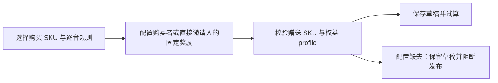
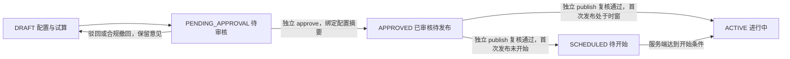
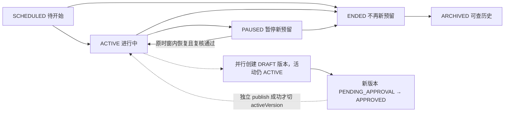
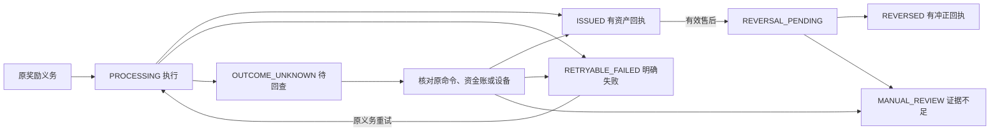
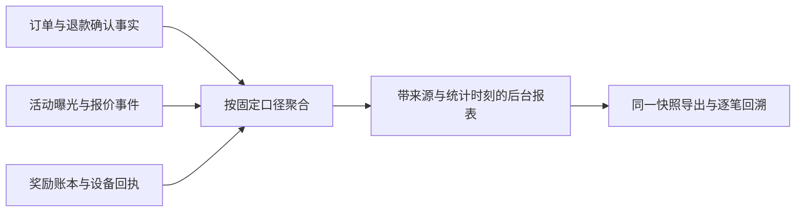

# 促销与裂变活动后台 PRD

> 文档状态：详细评审稿，未批准实施。本文只定义后台功能契约与操作说明；业务裁决以同目录 `PRODUCT-PRD.md` 为唯一公共契约。未配置参数、待决策权益、尚未映射的权限均不得以示例或前端默认值代替。本文不证明功能已经实现或上线。

## A0 范围、权威与共用规则

适用基线：后台 `origin/test@eca3669f38c1ebd64c77903c7c0c9581c30245ff`；后端 `origin/test@36ed64eff16035e8e7a9c27733351b78d016c16b`。实现基线升级时先检查差异，不覆盖其他工作。

首期在 H4 活动中心承接“促销”和“裂变”两类活动，提供首购、直邀首购双向奖励、单 SKU 映射、多型号组合、复购召回五种模板。一个活动可配置多个购买 SKU，每条规则的每个受益人只配置一个固定 RewardSpec，从 DEVICE、USDT、NEX 中选择一种；不同 SKU 可选择不同奖励类型，直邀双向奖励的两名受益人各自独立配置。逐台计奖规则见 §P3。复合奖励、拼团、转赠、累计阶梯和概率奖励不属于首期。既有 H4 活动继续使用原有规则和读写接口，不自动迁移、不改变原奖励。

### 公共契约引用

| 公共章节 | 本文消费内容 | 后台责任 |
|---|---|---|
| §P1 范围 | 类别、玩法、首期边界 | 只展示已支持模板；不放出未实现配置 |
| §P2 人群 | 新客、无设备、老客、等级；资格时点 | 提供结构化配置、服务端人群预览与拒绝原因 |
| §P3 规则 | 购买 SKU、逐台计奖、组合、双向受益人 | 校验重复与冲突；保存结构化奖励项 |
| §P4 时间报价 | UTC 时窗、报价、建单预留、payBy | 明示结束/暂停只停新预留；已锁订单按原约定支付 |
| §P5 奖励权益 | DEVICE 权益 profile、USDT/NEX 入账 | 展示完整权益，缺 profile 不可发布 |
| §P6 预算叠加 | 活动限额、每人限额、预算、叠加组 | 试算综合成本，区分预算已用/预留/可用 |
| §P7 结算售后 | 成交、重试、整单退款、奖励冲正 | 单项处置，保留原义务和证据 |
| §P8 数据接口 | 唯一 ID、版本、API、事件 | 不另立金额/资格/发奖真源 |
| §P9 状态 | 活动、版本、奖励状态机 | 按状态和能力显示操作，不靠文案猜权限 |
| §P10 验收 | 正例、异常、并发、APP/H5 parity | 后台配置到双端展示及交易结果同源验收 |
| §P11 待决策 | 未批准参数和权益政策 | 列为发布阻断，不暗填推荐值 |

### 操作和数据约束

- 业务金额、设备数量、次数、周期、预算及上限默认均为“未配置”；必填项必须由运营输入。无限制若公共契约允许，须显式选择，不把空值或 0 隐式解释成无限制。零金额项不作为奖励保存；停发通过删除草稿奖励项或停新预留表达。
- 界面使用设备名称、参与资格、奖励和处理原因等运营语言；商品 ID、状态码、命令号只在详情的技术证据区供定位。枚举用选择控件，日期用日期时间控件，设备用可搜索目录，数量用整数输入；不要求在单框内拼规则或输入 JSON。
- 所有读取与写入按服务端能力裁剪。本文能力名称是待映射清单，不代表已有角色已获权：查看活动、编辑草稿、试算活动、提交审核、审核活动、发布活动、暂停恢复、结束归档、查看奖励、重试发奖、发起奖励冲正、处置异常、查看报表、导出报表。实施前映射到现行 RBAC 和 A2 命令，不新增未经批准的角色或跳过既有权限。
- `POST /api/orders/quote` 只给试算，不预占任何权益；现有建单入口携 `promotionQuoteId`，在同一事务锁定资格、预算、赠品和活动版本。报价与建单时事实有差异返回 409 并要求重新报价确认，不能先支付再改奖励或静默退回无促销订单。支付只使用已锁订单与原承诺，并进行 §P2 的账户级首购仲裁。
- 所有写入携 `expectedRevision`、稳定 `Idempotency-Key` 和理由；创建草稿的初始版本与 revision 由服务端生成。version 标识业务配置版本，revision 用于并发修改校验，两者不得混用。配置保存、提交、审核、发布、暂停、恢复、终止、重试和撤销均记录操作者与原值/新值。敏感动作确认页展示对象、版本、影响、理由和失败出口；理由规则引用既有 A2 约束。服务端复核，隐藏按钮不能替代授权。
- 写入超时或回执不可解析属于结果未知：保留表单与原命令号，先查命令结果，再以原命令重试；不重新造命令扩大副作用。明确拒绝则保留草稿并说明原因。多标签或多人修改导致版本冲突时展示差异，必须重新读取确认，禁止覆盖式保存。
- 审核与发布是独立动作；能力如何映射现行 RBAC、是否要求不同操作者，由 §P11-D10 和现行 A2 治理确认；未确认前不得推断单人或双人批准已经得到授权。审核记录必须绑定不可变配置摘要，配置变更使原审核失效。草稿审批状态与已发布活动生命周期分别保存；改版草稿待审、驳回或获批均不关闭旧版本的 ACTIVE 状态。
- 状态、预算、资格、库存、账本以服务端持久化事实为准。列表缓存只用于展示；所有敏感按钮提交前重新核验。空数据、读取失败、延迟数据和真实 0 分别展示。

### 现有接口与新增提案边界

| 性质 | 接口/实现面 | 本方案处理 |
|---|---|---|
| 现有 H4 | `/api/admin/growth/quest-events/events-overview`、`POST /quest-events/events`、单字段奖励/状态/主推 PATCH | 旧活动兼容；不拿原文本奖励字段承载新规则 JSON |
| 现有 H4 APP | `GET /api/events`、`POST /api/events/{eventCode}/join`、`/claim` | 保持旧协议；新促销投影和订单奖励使用 §P8 契约 |
| 现有 H8 | `/api/admin/growth/referral-rewards`、`/params/{paramKey}`、`/settlements/run` | 仅复用真实 sponsor 来源；不修改新人礼一次性结算事实 |
| 现有订单 | `POST /api/orders`、`/api/orders/bundle`、`/api/orders/{orderNo}/pay` | 接收 §P8 约定的 `promotionQuoteId`；钱包实付成交才触发义务兑现 |
| 现有退款 | `/api/admin/devices/orders/{orderNo}/refund` | 当前为整单钱包退款；没有可承诺的部分退款或原路退款 |
| 现有等级 SKU 权益 | VRank 发放队列、`nx_user_sku_entitlement` | 不是已建设备；不可代替 Commerce 赠机履约 |
| 新增提案 | `/api/admin/growth/promotions` 下的资源和命令 | 各单元列出评审提案；最终请求/响应由 §P8 统一，不代表现成接口 |
| 新增提案 | `POST /api/orders/quote` | 只试算、不占资格/预算/库存；建单事务才预留，详见 §P4 |

#### [FEAT-GROW-ADM01] 活动列表与入口

**① 用户故事**

##### 目的与对齐

作为有查看活动能力的运营人员，我想按类别、模板、状态和时窗查到活动，以便判断哪些活动可投放、哪些仍有未履行奖励。作为有编辑草稿能力的运营人员，我想从受支持模板创建活动，以便从明确规则开始配置。对齐 §P1、§P9；入口沿用 H4 活动中心，旧活动与新促销显示来源类型，不把两套状态混用。

**② 验收与异常路径**

- 正例 ADM01-AC01：Given 有权限且服务端返回活动分页，When 按状态与时间筛选，Then 行数、总数和筛选条件来自同一查询快照，打开活动保留返回时的筛选和页位。
- 正例 ADM01-AC02：Given 选择受支持模板，When 创建，Then 服务端生成活动 ID 和草稿版本，进入 ADM02，模板只填结构而不填奖励金额、时长或预算。
- 异常 ADM01-AC03：Given 列表请求失败，When 页面加载，Then 显示读取失败及重试，不展示为“没有活动”，已缓存数据标明统计时间并禁用依赖新状态的动作。
- 异常 ADM01-AC04：Given 活动在另一窗口变更或能力被收回，When 打开编辑或执行行操作，Then 服务端拒绝越权/陈旧动作，页面刷新状态并保留筛选，不先跳到可编辑成功态。
- 异常 ADM01-AC05：Given 无匹配数据，When 修改筛选后查询，Then 可清除筛选；有创建能力时提供新建入口，无创建能力时只说明没有匹配记录。

**③ 数据字典与生成规则**

##### 可控参数

| 字段 | 类型/必填 | 默认 | 约束与生效 |
|---|---|---|---|
| query/category/template/status | 查询条件/否 | 无筛选 | 不写活动配置；服务端白名单校验 |
| period/from/to/timezone | 查询条件/否 | 未配置 | 页面显示所选时区，提交转 UTC；区间含义与报表一致 |
| activityId/version/status | 只读/是 | 服务端生成 | ID 稳定；status 按 §P9 显示活动生命周期，不拿新草稿审批状态覆盖 |
| name/activeVersion/draftVersion/draftVersionState | 只读摘要/是 | 服务端返回 | 同时存在新草稿和已发布版本时分别展示版本、审批状态与活动状态 |
| reserved/issued/unresolved/asOf | 只读汇总/是 | 无伪造默认 | 区分预留、已发与未解决；缺数据为未知 |

**④ 状态机与禁止动作**

##### 操作动作

本单元读取 §P9 活动状态与版本审批状态，创建初始 `DRAFT` 版本；复制活动只能生成新的 `DRAFT`，不复制审批、配额使用量、参与者、订单或奖励。复制时全部参数供复核，过期时间与失效 SKU 标为未完成，不自动延长活动。已有 ACTIVE 活动新增草稿时列表继续展示 ACTIVE，并另列草稿审批进度。禁止从列表直接改奖励或跳过审核发布。

**⑤ 交互原型四态**

##### 后台界面

默认态：筛选区、状态说明、分页列表；列含名称、类别/模板、活动时间、发布/草稿版本、状态、预算占用、未履约数量、最近操作和允许动作。空状态：说明无活动或无匹配结果，提供符合能力的入口。加载态：对应表格行骨架，分页与统计一起更新。报错/极限态：可重试，长名称可查看全文，大金额不截断关键位，未知汇总不显示 0。

**⑥ 点击流矩阵**

| 触发元素 | 目标/前置 | 反馈与返回 |
|---|---|---|
| 查询/清除筛选 | 当前页服务端查询 | 重置到首批结果，保留排序 |
| 页码/下一页/排序 | 同一查询快照 | 加载中禁重复；快照失效重新查询并提示 |
| 新建活动 | 模板选择→ADM02 | 仅有创建能力可用；取消不建活动 |
| 活动名称/查看详情 | ADM07 | 保留列表返回位置 |
| 编辑草稿/继续配置 | ADM02 | 无草稿时须从详情创建新版本 |
| 复制为新活动 | 确认复制→ADM02 | 提醒重新核对全部参数，取消无副作用 |
| 未解决奖励数量 | ADM08，按活动筛选 | 未知时不可误跳空列表 |
| 效果 | ADM09，按活动筛选 | 保留活动 ID 与版本过滤 |
| 重试读取 | 当前查询 | 仅重试读取，不重复创建 |

**⑦ 跨文档一致性**

##### 接口

提案：`GET /api/admin/growth/promotions` 分页查询；`POST /api/admin/growth/promotions` 创建草稿；`POST /api/admin/growth/promotions/{activityId}/copies` 复制。返回字段、分页和错误信封由 §P8 定义；浏览器不聚合本页作为全站总数。

##### 权限与审计

能力：查看活动、编辑草稿；复制按新建授权。创建/复制审计记录来源活动（如有）、新活动、版本和操作者；读取遵循既有访问日志。

##### 风控与联动

旧 H4 行只能进入旧详情，新促销进入 ADM07；共同导航不改变 H8/F 域现有结算。列表状态与 APP/H5 的可参与判断均消费 §P9，不由显示时间推导业务可用。

##### ⑧ 埋点事件

提案事件 `promotion.draft_created`、`promotion.draft_copied`；仅配置事实，不计入成交。事件注册遵循 A4，属性包括 activityId、version、operator、occurredAt，不携会话凭据。

#### [FEAT-GROW-ADM02] 配置第一步：类别、模板、时间与公开说明

**① 用户故事**

##### 目的与对齐

作为有编辑草稿能力的运营人员，我想明确活动用途、起止时间、参与说明与首页投放，以便后续人群、奖励和入口只在清楚的活动范围内生效。对齐 §P1、§P4；APP/H5 的活动标题、规则说明、首页广告和起止时间来自同一已发布版本。

**② 验收与异常路径**

- 正例 ADM02-AC01：Given 新草稿，When 选择类别和模板、填写有效起止时间及所需语言内容并保存，Then 服务端返回新草稿版本，下一步展示同一保存结果。
- 异常 ADM02-AC02：Given 结束时间不晚于开始或未选择时区，When 保存/下一步，Then 在对应字段解释错误并定位，不自动改日期或使用浏览器本地时区替代。
- 异常 ADM02-AC03：Given 已配置后续人群或奖励，When 切换模板，Then 先展示哪些字段不兼容，确认后仅修改草稿并标出需重填项；取消保留原值，不静默删除已录入规则。
- 异常 ADM02-AC04：Given 保存回执未知，When 重试，Then 先按原命令查询结果，不生成第二个草稿；刷新/退出有未保存内容时提示保留或明确放弃。
- 正例 ADM02-AC05：Given 配置首页投放且活动已发布并 ACTIVE，When APP/H5 读取首页广告，Then placement 为 home.purchase-promotion，CTA 固定进入携 activityId 的商城活动筛选，商城卡片与原有结账显示同版本奖励；倒计时仅按服务端 endsAt/serverTime 计算。
- 异常 ADM02-AC06：Given 首次发布前仅有草稿或 APPROVED 版本，或已发布活动暂停/结束，When 读取首页投放，Then 不返回可参加的新投放；已有 ACTIVE 版本的新草稿待审/获批不影响旧版投放。不使用旧周任务倒计时伪装仍有效，已锁订单仍按原 payBy 履行。

**③ 数据字典与生成规则**

##### 可控参数

| 字段 | 类型/必填 | 默认 | 约束与生效 |
|---|---|---|---|
| category | 促销/裂变枚举/是 | 未配置 | 首期两类，合法模板组合由 §P1 决定 |
| template | 五种模板枚举/是 | 未配置 | 首购、直邀首购双向、单 SKU、多型号组合、复购召回 |
| name/localizedTitle/localizedRules | 文本及多语言对象/是 | 未配置 | 中/英/越支持范围依 §P10；公开规则完整且不承诺未配置奖励 |
| startsAt/endsAt/displayTimezone | 时间与时区/是 | 未配置 | 存 UTC 瞬时，表单展示明确时区；结束晚于开始 |
| placement | 首页投放标识/选择首页投放时必填 | 未配置 | 首期仅 home.purchase-promotion；随活动版本审核发布，不另存活动时间或奖励副本 |
| CTA | 固定导航/只读 | 由 placement 确定 | 进入商城并携 activityId 筛选适用商品；不可输入任意链接或直接跳过原有结账 |
| endsAt/serverTime | 公开响应的活动截止与权威当前时刻/只读 | 服务端生成 | 同源于已发布活动；不继承旧周任务周期或设备本地时间 |
| activityId/draftVersion/revision | 只读/是 | 服务端生成 | 稳定 ID、配置版本及并发序号分别保存，不由名称生成 |

**④ 状态机与禁止动作**

##### 操作动作

仅版本审批状态为 `DRAFT` 可保存本步；进入待审核或 APPROVED 后只读，可按 §P9 撤回后编辑，不能直接改审核快照。已发布活动只能在 ADM07 新建草稿版本；禁止原地改时间和承诺文案。首页投放随该版本独立发布后生效，暂停/结束停止新增入口，恢复也须遵守活动与资源可用性。四步导航可返回已保存步骤，不能把仅浏览到第四步视为完成配置。

**⑤ 交互原型四态**

##### 后台界面

默认态：四步进度、类别/模板选择、时间控件、语言切换、公开说明、首页投放选择及商城目标预览、保存草稿/下一步。首页广告只预览活动本身的内容、倒计时和固定 CTA，不出现第二份奖励或周期配置。空状态：全部业务值为未配置，解释模板作用。加载态：载入草稿骨架，禁写入尚未加载的空表单。报错/极限态：字段级日期和内容错误；超长说明可编辑全文，不截断后保存；serverTime 不可读时不伪造倒计时。

**⑥ 点击流矩阵**

| 触发元素 | 目标/前置 | 反馈与返回 |
|---|---|---|
| 类别/模板选择 | 当前草稿 | 有不兼容配置先确认清单，取消保留 |
| 时区/开始/结束控件 | 当前表单 | 同时显示换算后的时间，校验顺序 |
| 语言切换 | 当前语言内容 | 不丢失其他语言草稿；缺项标明 |
| 保存草稿 | 服务端 CAS 保存 | 成功读回；失败留值并可重试 |
| 下一步 | ADM03 | 先保存当前有效项；未完成项定位 |
| 返回列表/关闭 | ADM01 | 未保存先提示保留或放弃 |
| 查看公开规则预览 | 当前只读预览 | 明示草稿、不发往 APP/H5 |
| 首页投放选择/预览 CTA | 当前草稿的首页广告与商城筛选预览 | 明示模拟，不打开真实下单；目标固定携 activityId |
| 重试/查看命令结果 | 当前表单 | 结果未知只查/重试原命令 |

**⑦ 跨文档一致性**

##### 接口

提案：`GET /api/admin/growth/promotions/{activityId}`；`PATCH /api/admin/growth/promotions/{activityId}/draft` 更新类别、模板、时窗、内容和 placement，携 expectedRevision。统一字段归 §P8；首页读取同一已发布活动投影中的 placement、endsAt/serverTime 与商城筛选目标，不新增独立广告时间/奖励真源，不复用旧 H4 文本条件或周任务倒计时存新配置。

##### 权限与审计

能力：查看活动、编辑草稿。保存记录字段差异、语言集合、版本及理由；模板切换保留旧配置审计，不抹去历史。

##### 风控与联动

不得预设业务天数或采用隐藏时区。公开规则必须准确呈现奖励条件、期限、限额和售后说明，不能用宣传文案覆盖 §P3–P7。暂停和结束对已锁订单的影响在 ADM07 操作前明确展示。

##### ⑧ 埋点事件

提案 `promotion.draft_updated`，含变更字段集合与配置摘要；不把编辑预览曝光算作 APP 活动曝光。

#### [FEAT-GROW-ADM03] 配置第二步：人群与资格

**① 用户故事**

##### 目的与对齐

作为有编辑草稿能力的运营人员，我想通过结构化条件配置参与人群并核对样本，以便活动只向符合约定的人群开放。对齐 §P2；人群取建单时快照预占资格，支付时以账户级首购仲裁处理竞态，后台不能预先给某人手工判为已符合。

**② 验收与异常路径**

- 正例 ADM03-AC01：Given 选择人群及条件，When 运行预览，Then 服务端返回命中数、未命中原因、统计时刻和条件摘要；预览不占资格、不保证将来建单仍符合。
- 异常 ADM03-AC02：Given 设备或历史订单来源不可读，When 预览/提交审核，Then 显示“暂不能判断”并阻断依赖判断，不把未知当无设备或新客。
- 异常 ADM03-AC03：Given 条件交集为空或互相排斥，When 保存，Then 解释冲突；空人群可保存草稿但不得不经明确确认进入发布，违反 §P2 的非法组合直接拒绝。
- 异常 ADM03-AC04：Given 同一账户两笔首购候选订单同时付款，When 支付发生，Then 以服务端首购仲裁结果决定奖励，后台显示未获首购资格的明确原因，不按预览或前端顺序发两份奖励。

**③ 数据字典与生成规则**

##### 可控参数

| 字段 | 类型/必填 | 默认 | 约束与生效 |
|---|---|---|---|
| customerSegment | 新客/老客/全部等 §P2 枚举/是 | 未配置 | 精确定义引用 §P2，不能用文字标签自定义资格 |
| deviceCondition | §P2 设备条件枚举/是 | 未配置 | “无设备”是否排除试用/赠品/历史设备严格按公共契约 |
| rankConditions | 等级集合或区间/按模板 | 未配置 | 读取 F 域现有等级目录，不能手写不存在等级 |
| conditionLogic | 结构化逻辑/是 | 未配置 | 仅支持 §P2 明确组合；表单显示完整自然语言摘要 |
| recallCondition | 复购/召回条件/按模板 | 未配置 | 观察周期及订单口径由运营显式输入且符合 §P2 |
| audiencePreview | 只读对象/预览时 | 服务端生成 | 条件摘要、样本来源、命中/拒绝/未知数、asOf；不是资格凭证 |

**④ 状态机与禁止动作**

##### 操作动作

预览状态为未试算→试算中→有效预览/读取失败；修改任一条件立即使旧预览失效。活动草稿状态不因预览变为已审核。禁止导入名单直接绕过首购、账号风险或购买资格；首期不提供任意脚本筛选器。永久 activityId 的每人限额不会因改人群或新版本重置。

**⑤ 交互原型四态**

##### 后台界面

默认态：人群选择、设备条件、等级选择、模板专属条件、条件摘要与预览。空状态：提示选择必需条件；预览为零说明未匹配，不展示伪造名单。加载态：预览摘要和样本表骨架，条件仍可读。报错/极限态：来源错误、非法组合、超长等级名称均明确；失效预览显示“条件已变化，请重新试算”。

**⑥ 点击流矩阵**

| 触发元素 | 目标/前置 | 反馈与返回 |
|---|---|---|
| 人群/设备/等级/逻辑选择 | 当前草稿 | 更新可读摘要，使旧预览失效 |
| 预览人群 | 服务端预览 | 显示统计时刻，不占资格 |
| 查看命中/拒绝/未知样本 | 当前受控样本抽屉 | 分别说明依据；无名单访问能力只看汇总 |
| 保存草稿 | 当前版本 CAS | 写回后重新读条件 |
| 上一步/下一步 | ADM02/ADM04 | 保存有效草稿；未保存提示 |
| 清除某条件 | 当前表单 | 必填条件回未配置，不暗回全部 |
| 重试预览 | 当前条件版本 | 丢弃晚到旧预览响应 |

**⑦ 跨文档一致性**

##### 接口

提案：草稿 PATCH 同 ADM02；`POST /api/admin/growth/promotions/{activityId}/audience-preview`，输入草稿版本和条件摘要，返回只读预览；字段由 §P8 统一。样本字段最小化，默认不导出联系方式。

##### 权限与审计

能力：编辑草稿、试算活动；人群样本还受既有客户数据查看范围约束。记录条件变更与预览访问，汇总只返回授权范围可见数据，但发布资格仍由全局规则裁决。

##### 风控与联动

账户事实来自账户域、设备来自 Commerce/设备域、首购来自有效成交、等级来自 F 域。营销人群与推荐归因是不同维度；后台不能通过选中人群变更 sponsor。APP/H5 只消费服务端资格及可公开原因，不自行复制筛选算法。

##### ⑧ 埋点事件

提案 `promotion.audience_previewed` 记录版本、条件摘要、命中/未知统计与 asOf；不产生奖励事件，不计注册或成交。

#### [FEAT-GROW-ADM04] 配置第三步：逐 SKU 购买条件与赠奖清单

**① 用户故事**

##### 目的与对齐

作为有编辑草稿能力的运营人员，我想逐一选择购买设备，并为每条规则的每个受益人选择 DEVICE、USDT、NEX 中一种固定奖励，以便不同购买设备兑现不同奖励。作为配置直邀首购活动的运营人员，我想分别指定购买者和直接邀请人的单一奖励，以便奖励对象清晰且不改变既有邀请关系。对齐 §P3、§P5。

**② 验收与异常路径**

- 正例 ADM04-AC01：Given 多个可售购买 SKU，When 为不同 SKU 分别选择赠设备、返 USDT 或赠 NEX 并试算，Then 每条规则的每个受益人仅有一个 RewardSpec，每台购买行按 §P3 计算，奖励对象、数量、赠机 profile 和总义务明细可逐项核对。
- 正例 ADM04-AC02：Given 直邀首购双向模板，When 分别编辑购买者和直接邀请人的单一奖励，Then 两者分开保存并明确显示，允许两人选不同奖励类型；无有效直接邀请关系的处理按 §P2/§P3，不自动指定邀请人。
- 异常 ADM04-AC03：Given 购买或赠送 SKU 下架、不可用、库存未知，When 保存/试算/发布，Then 给出具体问题项；可留草稿但不能发布，不能自动换成其他商品。
- 异常 ADM04-AC04：Given DEVICE 项未选择已批准权益 profile，When 提交审核或发布，Then 阻断并指向 §P11；不能把等级 SKU 权益表中的 GRANTED 当作已可使用设备。
- 异常 ADM04-AC05：Given 同一触发 SKU 的冲突规则或同规则同受益人已有奖励，When 再添加奖励，Then 拒绝重复或复合奖励，不允许用重复规则绕过单一 RewardSpec；重叠规则按 §P3 明确优先级或消除歧义。金额/数量缺失、非正数或精度不符均逐字段拒绝。
- 异常 ADM04-AC06：Given 组合包含相同 SKU 多台，When 当前能力只支持不同型号组合，Then 明示能力不支持并禁止发布；不得把每台伪装为不同型号绕过订单和退款约束。

**③ 数据字典与生成规则**

##### 可控参数

| 字段 | 类型/必填 | 默认 | 约束与生效 |
|---|---|---|---|
| ruleId/rewardRuleId | 稳定配置标识/是 | 服务端生成 | ruleId 标识购买规则，rewardRuleId 标识其受益人奖励配置；不作为台账命令目标，成交后另生成 obligationId |
| productNo | 购买商品目录引用/是 | 未配置 | 只选可用商品，保存 ID、预览名称；名称不作身份 |
| minBuyQty/repeatMode/maxGroups/maxGroupsPerPerson | 正整数、PER_GROUP/ONCE_PER_ORDER、组数上限/是 | 未配置 | 门槛按 §P3；maxGroups是每单规则组数，maxGroupsPerPerson是活动内按账号/受益角色累计组数，见 §P6；可不限时必须显式选择 |
| combinationItems | SKU 条件数组/组合模板 | 未配置 | 首期多型号与同型号数量边界显式校验 |
| buyerReward/inviterReward | RewardSpec、可选 RewardSpec/依模板 | 未配置 | 每受益人每规则一个；beneficiaryRole 仅 BUYER/DIRECT_INVITER，不支持手填第三方账户 |
| type | DEVICE/USDT/NEX/每个 RewardSpec 必填 | 未配置 | 首期固定奖励，不支持复合奖励、概率或可执行表达式 |
| giftProductNo/quantity/deviceRightsProfileId | 目录引用、正整数、权益引用/DEVICE 必填 | 未配置 | profile 来自已批准契约；数量与实际设备实例一一核对 |
| amount/assetPolicyRef | 精确十进制字符串、资产政策引用/资金项必填 | 未配置 | 资产由 type 明确，精度依 §P8；不接受隐式换币或浮点累计 |

仅作结构示例：购买设备 A 的一台行→设备 B×q；购买设备 C 的一台行→USDT×u；购买设备 D 的一台行→NEX×n。A/B/C/D、q/u/n 是占位符，不是默认配置或经营建议。同一条 A 规则不能向同一受益人同时赠 B 和 USDT。

**④ 状态机与禁止动作**

##### 操作动作

草稿规则可增加、编辑、移除；移除前显示影响的购买 SKU 和受益人。切换单一奖励类型须确认清理不兼容字段，不以新增第二项保留原类型。已发布奖励配置不可原地变更，创建新 draftVersion 后重新试算和审核。DEVICE 的承诺链为建单锁定快照→支付成交生成 obligationId→Commerce 创建设备→读回设备来源 `PROMOTION_GIFT` 与 profile→标记对应义务 `ISSUED`；中途失败停在原义务重试，不能只落权益表就成功。

**⑤ 交互原型四态**

##### 后台界面

默认态：按购买 SKU 分组的规则表，每组展开受益人，各受益人用单选控件选择 DEVICE/USDT/NEX 一种，右侧显示本组与整单试算摘要；没有同一受益人“继续添加奖励”入口。空状态：说明尚无购买规则，提供“添加购买设备”；奖励类型未配置。加载态：目录与草稿分区骨架，未加载目录不能提交虚构选项。报错/极限态：库存未知、失效 profile、重复规则、超精度金额逐项标注；大量 SKU 支持查找和定位错误，不能只显示首项问题。

**⑥ 点击流矩阵**

| 触发元素 | 目标/前置 | 反馈与返回 |
|---|---|---|
| 添加购买设备/编辑组合 | 搜索商品目录 | 已选项明示；取消不增加空规则 |
| 选择/切换奖励类型 | 当前规则、当前受益人的单一 RewardSpec | 切换前确认不兼容字段清理；不可追加复合奖励 |
| 受益人选择 | 当前奖励行 | 只列模板允许对象，双向奖励分区 |
| 赠送设备/权益 profile 选择 | 目录与权益详情 | 展示完整权益限制，未批准项禁选 |
| 编辑金额/数量 | 当前行 | 即时格式校验，服务端最终复核 |
| 移除规则/奖励项 | 影响确认 | 仅删草稿，历史奖励不受影响 |
| 查看 SKU/权益详情 | 只读抽屉 | 返回保留本步未保存内容 |
| 单组/整单试算 | ADM06 的草稿试算 | 不占额度、不发奖 |
| 保存/上一步/下一步 | 当前页/ADM03/ADM05 | 保存并读回，未完成项可定位 |
| 定位错误项/重试目录 | 当前规则行 | 不自动替换失效商品 |

**⑦ 跨文档一致性**

##### 接口

提案：草稿 PATCH 保存 §P8 的 `rules[]`，每条含 `ruleId/productNo/minBuyQty/repeatMode/maxGroups/maxGroupsPerPerson/buyerReward/inviterReward?`，RewardSpec 含稳定 `rewardRuleId`；不保存同一受益人奖励数组。目录读取复用现有 E1 可用 SKU 契约，权益 profile 读取入口由 §P8 定义。新增 profile 不是本页操作，必须经过 §P11-D03 的产品裁决和实现。不调用 F1 等级奖励增删改接口保存促销。

##### 权限与审计

能力：编辑草稿、试算活动。审计包含 SKU 规则和奖励项逐项差异、数量/金额、受益人、profileId 及版本；公开展示文案不暴露内部审核/风控阈值。

##### 风控与联动

新增/放大奖励需在 ADM06 核预算、库存和既有资金保障。赠送设备不得计入付费销量、实收或再次触发购机奖励；是否产出收益、到期、转移、置换、等级计入等由 §P5 的 profile 确定，缺一项不能发布。每台有唯一原订单、obligationId、rewardRuleId 和设备实例追溯，APP/H5 设备页显示同一权益；rewardRuleId 仅解释配置来源，不代替成交义务防重键。

##### ⑧ 埋点事件

配置记录 `promotion.draft_updated`；实际履约事件由服务端产生，DEVICE 在读回真实设备后才产生奖励已发事实，字段及事件名称引用 §P8，不由后台点击模拟。

#### [FEAT-GROW-ADM05] 配置第四步：限额、预算与叠加

**① 用户故事**

##### 目的与对齐

作为有编辑草稿能力的运营人员，我想明确活动最多承担多少奖励以及与其他优惠如何同享，以便每笔成交的让利、现金奖励和赠机义务都可核算。对齐 §P6；后台不给空配置自动补成不限量。

**② 验收与异常路径**

- 正例 ADM05-AC01：Given 规则完整且运营填写限额、预算和叠加策略，When 保存并试算，Then 返回活动级和受益人级占用口径、每笔资格消耗及叠加后的实付与奖励明细。
- 异常 ADM05-AC02：Given 预算或每人上限未配置，When 提交审核，Then 阻断并定位必填项；不将空值视为无限制，不把 0 解释为不限制。
- 异常 ADM05-AC03：Given 降低限额至低于已用加有效预留，When 发布新版本，Then 服务端拒绝并解释已承诺义务；不得删除预留或削减既有订单奖励以凑新预算。
- 异常 ADM05-AC04：Given 两笔订单同时争用剩余赠品或预算，When 创建订单，Then 事务锁定只允许合法预留，失败一笔收到可理解拒绝；后台试算成功不能被当作预留凭证。
- 异常 ADM05-AC05：Given 新版本或新模板沿用同一 activityId，When 同一参与者再次建单，Then 按 activityId 级累计上限判定，不能因版本更换重置领取次数。
- 异常 ADM05-AC06：Given shortagePolicy 未选择，When 提交或发布，Then 阻断并定位缺额处理策略，不自动采用生产默认。选择 RULE_STOP 时仅资源不足的规则停止新预留；选择 ACTIVITY_PAUSE 时全活动停止新预留，均不得影响已锁订单及已成立义务。

**③ 数据字典与生成规则**

##### 可控参数

| 字段 | 类型/必填 | 默认 | 约束与生效 |
|---|---|---|---|
| perPersonLimit/activityLimit | 显式限额结构/是 | 未配置 | 人员身份、计数单位和受益人合并规则见 §P6 |
| budgetByAsset | USDT/NEX 精确金额/涉及该资产必填 | 未配置 | 币种分别核算，不隐式汇率折算 |
| giftQuotaBySku | SKU→正整数额度/赠机必填 | 未配置 | 同时受目录库存和活动额度限制 |
| stackingPolicy/exclusiveGroup/priority | 结构化叠加规则/是 | 未配置 | 券、试用、组合折扣、H8、推荐奖励等逐项显式选择 |
| shortagePolicy | RULE_STOP/ACTIVITY_PAUSE/是 | 未配置 | 运营显式选择按规则停止新预留或全活动暂停；缺失阻断提交/发布，不静默换奖 |
| total/available/reserved/committed/issued/reversed/unrecoverable | 按资产/SKU 分列的精确数/只读 | 服务端派生 | 沿 §P6 唯一预算账；已成交但发奖失败仍为原义务占用，实际回收前不恢复额度 |
| projectedCost/costBasis | 服务端试算/只读 | 资料未齐为未知 | 赠机成本和未来权益责任不可按售价或零成本冒充 |

**④ 状态机与禁止动作**

##### 操作动作

报价不占预算；建单事务预留资格、预算、赠品及规则版本；成交后预留转成立义务；未支付且支付结果明确的取消/到期才释放；已发/退款冲正的预算恢复规则按 §P6/§P7。缺额按 shortagePolicy 停规则或暂停活动的新预留，并保留已锁订单与原义务；资源补足后的恢复仍须服务端复核，不自动恢复或重置限额。禁止后台直接改 reserved/committed 等账项或删除账本。提高预算或放宽叠加生成新草稿并重审，不直接对活动总额加数。

**⑤ 交互原型四态**

##### 后台界面

默认态：次数/数量上限、各资产预算、赠品额度、缺额处理单选、叠加矩阵与综合试算；账项区分预留、已承诺、已发、已回收和未追回。空状态：各业务值未配置，逐项解释计数单位，缺额策略无预选。加载态：预算真值与目录库存分别显示骨架，读完再允许敏感动作。报错/极限态：预算不足、占用大于拟额度、互斥冲突逐项说明；超大数字完整可查，不用估算值批准。

**⑥ 点击流矩阵**

| 触发元素 | 目标/前置 | 反馈与返回 |
|---|---|---|
| 限额方式/数量输入 | 当前草稿 | 显示计数单位及 activityId 累计规则 |
| 资产预算/赠品额度输入 | 当前草稿 | 展示已用和预留对比，不足定位 |
| 叠加开关/互斥组选择 | 当前策略矩阵 | 显示与既有优惠的具体组合，不给自由文本表达式 |
| 缺额处理策略选择 | 当前草稿 | 明示按规则停止/全活动暂停的新预留范围，保留已成立承诺 |
| 刷新预算/库存 | 服务端事实 | 保留表单值并提示时间，不能替代发布复核 |
| 查看占用明细 | ADM08 按活动及状态筛选 | 返回保持当前草稿 |
| 综合试算 | ADM06 | 展示实付、双方奖励、预算和赠品消耗 |
| 保存/上一步/进入审核预览 | 当前页/ADM04/ADM06 | 必填完整才进入可提交预览 |
| 重试读取 | 当前快照 | 未知值继续阻断相关动作 |

**⑦ 跨文档一致性**

##### 接口

提案：草稿 PATCH；`GET /api/admin/growth/promotions/{activityId}/budget` 读取按币种和 SKU 的占用；必要分页明细由 §P8 定义。禁止客户端传“新剩余额度”覆盖服务器计数。

##### 权限与审计

能力：编辑草稿、试算活动。预算和叠加变更审计必须保留前后值、已有义务影响及配置摘要；是否需要额外资金审批按现行 A2/B1 与 §P11 映射。

##### 风控与联动

不重定义 H1 倍率；本活动固定奖励是否与既有倍率链同享由 §P6 显式约定，不再次乘算。券折扣与 USDT/NEX 发奖分开记账；赠机单独核实库存、成本和权益责任。APP/H5 结算页必须显示最终叠加结果，不到支付后才削减奖励。

##### ⑧ 埋点事件

配置仅记 `promotion.draft_updated`；预留/释放/消耗由建单与售后事务发布 §P8 事件。每个事件有 activityId、version、orderNo、资产或 SKU、精确数量、幂等业务引用。

#### [FEAT-GROW-ADM06] 试算、审核与发布

**① 用户故事**

##### 目的与对齐

作为有试算活动能力的运营人员，我想在发布前检查不同订单和人群的结果，以便发现重复赠奖、预算不足与不能兑现的权益。作为被授权审核或发布的人员，我想确认不可变规则版本及风险结果，以便只有可执行、可核算、可解释的活动进入投放。对齐 §P4、§P6、§P8–P11。

**② 验收与异常路径**

- 正例 ADM06-AC01：Given 四步配置完整且待决策阻断为零，When 选择有效样本并试算，Then 返回逐规则命中/拒绝、每台奖励、双方受益、折扣后实付、预算/库存消耗和公开规则预览，不写订单或奖励。
- 正例 ADM06-AC02：Given 版本已处于 APPROVED 且不可变摘要仍匹配，When 获授权独立执行 publish，Then 服务端复核权限、时窗、预算、商品/profile 和资金门，写发布事实并读回；首次发布尚未开始则 SCHEDULED，处于有效时窗则 ACTIVE。仅 approve 不投放、不接受新版本订单。
- 异常 ADM06-AC03：Given 审核后配置发生变化，When 发布旧审核，Then 拒绝并指出版本不匹配；新草稿必须重新提交，不能复用旧审批。
- 异常 ADM06-AC04：Given 试算依赖缺失、资金保障数据不可靠或待决策未关闭，When 提交/发布，Then 明确区分配置错误、依赖不可用和权限不足，保留草稿；不能凭人工勾选跳过。
- 异常 ADM06-AC05：Given 发布超时，When 操作者重试，Then 查询原命令并返回唯一发布结果；页面不可同时显示发布失败却创建第二次发布。
- 异常 ADM06-AC06：Given 提交时有效商品在发布前已下架或额度被其他订单占用，When 最终检查，Then 发布拒绝或返回需重新确认的差异，不以之前试算结果替代当前事实。
- 正例 ADM06-AC07：Given 旧发布版本 ACTIVE 且新草稿已提交，When 新版被驳回、获批或发布失败，Then 旧活动继续按原发布版本接受符合原规则的订单；新草稿状态单列，不把活动改成 DRAFT/PENDING_APPROVAL/APPROVED。

**③ 数据字典与生成规则**

##### 可控参数

| 字段 | 类型/必填 | 默认 | 约束与生效 |
|---|---|---|---|
| scenario | 订单 SKU/数量、账户样本或合成条件/试算必填 | 未配置 | 脱敏样本或明确标记模拟；不实际下单 |
| evaluation | 服务端只读结果/是 | 服务端生成 | 含版本/hash、命中拒绝理由、奖励与成本、asOf、未验证项 |
| configHash/approvalId/publishedVersion | 不可变引用/按阶段 | 服务端生成 | 审核绑定精确版本；不能从浏览器自报通过 |
| draftVersionState/activeVersion/revision | 版本审批状态、发布版本、并发序号/只读 | 服务端生成 | 版本 DRAFT/PENDING_APPROVAL/APPROVED 与活动生命周期分开，revision 不代替配置 version |
| decision/reason | 审核决定与理由/必填 | 未配置 | 批准或驳回；驳回意见可追溯 |
| scheduledAt/effectiveAt | 服务端时间/只读 | 依活动起止 | 不把客户端点击时刻作为正式生效依据 |

**④ 状态机与禁止动作**

##### 操作动作

上图的 DRAFT/PENDING_APPROVAL/APPROVED 是候选版本审批状态，SCHEDULED/ACTIVE 是首次发布后的活动状态；两类事实分开保存。改版只推进新草稿审批，旧活动状态与 activeVersion 保持，直到 publish 成功才原子切换后续新报价/预留使用的版本；PAUSED 活动不能靠发布新版绕过独立恢复，ENDED 不能借改版复活。审批与发布必须有独立命令和事实；能力映射及操作者分离按 §P11-D10，不凭本文授予权限。批准不提前预留订单预算；发布不生成参与者奖励。发布失败保留 APPROVED 版本供修复依赖后复核，原活动和原发布版本不变。禁止原地更改已审核内容、提交不支持的模板或跳过权益 profile。

**⑤ 交互原型四态**

##### 后台界面

默认态：四步配置摘要、版本差异、样本试算表、总义务/成本、阻断清单、公开规则预览、提交审核/审核/发布能力区。空状态：无样本时引导添加试算场景，无审核记录说明尚未提交。加载态：试算结果表骨架与提交处理提示，锁定重复提交。报错/极限态：失败原因可定位回 ADM02–05；未知成本或依赖错误不显示为通过；确认弹窗有对象、影响、理由、取消和原命令回查。

**⑥ 点击流矩阵**

| 触发元素 | 目标/前置 | 反馈与返回 |
|---|---|---|
| 添加/删除试算场景 | 当前场景表 | 标明模拟，删除不影响业务数据 |
| 运行试算/重新试算 | 当前草稿版本 | 返回逐项结果；改配置后失效 |
| 查看规则/成本/拒绝依据 | 只读详情 | 不泄露不必要客户资料 |
| 编辑问题字段 | ADM02–05 对应步骤 | 保留试算记录并标旧版本 |
| 提交审核 | 提交确认弹窗 | 有阻断时禁用并给原因；成功读回待审核 |
| 撤回/驳回/批准 | 对应审核确认弹窗 | 理由必填；批准只到 APPROVED，状态冲突刷新，不静默覆盖 |
| 发布 | APPROVED 版本的独立发布确认弹窗 | 展示最终版本、时间、预算和影响；成功才切发布版本，失败保留原活动 |
| 查看命令结果/重试原命令 | 原命令详情 | 超时不另建新发布命令 |
| 返回详情/列表 | ADM07/ADM01 | 不自动执行待提交动作 |

**⑦ 跨文档一致性**

##### 接口

新增提案：`POST /api/admin/growth/promotions/{activityId}/simulate`、`/submit`、`/withdraw`、`/approve`、`/reject`、`/publish`，写操作携 expectedRevision/reason/Idempotency-Key；读取试算、审核和命令结果的响应归 §P8。APP `POST /api/orders/quote` 与运营试算共同消费同一规则求值逻辑，但运营试算没有真实参与身份或预留权。approve 和 publish 的权限、幂等命令及审计分别校验，不以一个 approve 响应模拟两次动作成功。

##### 权限与审计

能力分别为试算活动、提交审核、审核活动、发布活动；全部待映射 RBAC/A2。审计保留操作者、审批人与操作关系、版本/hash、样本类型、检查结果、原因、命令号和执行结果。最终发布需后端授权复核，不能接受客户端 `approved=true`。

##### 风控与联动

发布检查覆盖 SKU、赠品库存、profile、资金保障、数据精度、公开规则语言、叠加、限额、shortagePolicy、时窗、首页 placement/固定 CTA/服务端时间投影、事件/结算消费能力以及 APP/H5 已支持版本。公开投放仅随已发布 ACTIVE 版本出现，APPROVED 不能提前投放；暂停/结束同步停止新增投放。报价 TTL 绑定现有订单期限的方式按 §P11-D11，payBy 始终为 min(orderDeadline, endsAt)，不另造付款宽限。发布规则不能超过当前 APP/H5 的实际能力；不能为了发布把缺失能力从检查表删除。

##### ⑧ 埋点事件

提案 `promotion.submitted`、`promotion.approved`、`promotion.rejected`、`promotion.published`；配置事件与审核审计关联，发布事件含有效版本和时间，不包含模拟试算的虚假成交。

#### [FEAT-GROW-ADM07] 活动详情、暂停终止与改版

**① 用户故事**

##### 目的与对齐

作为有活动处置能力的运营人员，我想查看当前版本与在途义务并暂停新的参与，以便控制继续投放而不损害已成立承诺。作为有编辑草稿能力的运营人员，我想从已发布配置创建新版本，以便新规则只影响新订单。对齐 §P4、§P6、§P7、§P9。

**② 验收与异常路径**

- 正例 ADM07-AC01：Given ACTIVE 且存在已锁订单，When 暂停，Then 新建单不再预留；已锁订单仍能在自身 payBy 前按原版本支付，已成立奖励继续结算，详情分别显示这些数量。
- 正例 ADM07-AC02：Given 已发布 ACTIVE 版本，When 创建改版草稿、审核并独立发布，Then 编辑/待审/获批阶段旧活动继续 ACTIVE；publish 成功后新订单使用新版本，旧订单/奖励保留旧版本；同一 activityId 每人限额继续累计。
- 异常 ADM07-AC03：Given 终止确认页打开后又新增预留或操作状态已变，When 提交，Then 服务端按最新事实复核并拒绝过时确认或要求重新审阅影响，不按旧计数直接处置。
- 异常 ADM07-AC04：Given 恢复时已过结束时间、预算耗尽、SKU 不可用或能力被回收，When 恢复，Then 拒绝并给出原因；不自动延长时间、加预算或重置人均限额。
- 异常 ADM07-AC05：Given 有未解决奖励，When 归档，Then 归档条件按 §P9 校验；归档不得隐藏未履约责任或删除台账，仍能从历史入口追踪原义务。

**③ 数据字典与生成规则**

##### 可控参数

| 字段 | 类型/必填 | 默认 | 约束与生效 |
|---|---|---|---|
| lifecycleState/activeVersion | 只读/是 | 服务端返回 | 已发布活动为 SCHEDULED/ACTIVE/PAUSED/ENDED/ARCHIVED；首次发布前显示未发布及草稿审批进度，不用新版审批状态覆盖旧活动生命周期 |
| draftVersion/draftVersionState/configDiff | 只读/可有 | 无草稿 | 候选版本 DRAFT/PENDING_APPROVAL/APPROVED 独立；publish 成功才更新 activeVersion，新草稿不覆盖已发布规则 |
| affectedReservations/obligations | 只读影响摘要/处置必读 | 无伪造默认 | 列明未支付、待发、失败、结果未知、冲正中 |
| reason/expectedRevision | 写入必要字段/是 | 未配置 | 理由、状态和并发序号都在服务端校验 |
| payBy/effectiveVersion | 每笔订单只读/是 | 原订单事实 | 暂停/结束不能改短既有订单期限 |

**④ 状态机与禁止动作**

##### 操作动作

时间结束/人工终止均阻止新预留，已锁订单按 §P4 履行；暂停和终止不是批量撤销已承诺奖励。ENDED 不可直接恢复 ACTIVE；新增活动/版本遵循 §P9，不能用复制绕过同活动限额。所有取消已成立义务只能基于 §P7 的具体订单售后或有依据的异常裁决，不能用活动开关代替。

**⑤ 交互原型四态**

##### 后台界面

默认态：当前已发布配置、草稿版本、资格/预算摘要、订单预留与奖励履约、审核记录、版本对比、允许操作。空状态：未发布活动显示未发布原因；无在途义务明确列 0。加载态：版本与义务摘要分别骨架，数据未齐不可确认处置。报错/极限态：版本读取失败、义务统计未知时阻断影响相关操作；长理由可完整查看。

**⑥ 点击流矩阵**

| 触发元素 | 目标/前置 | 反馈与返回 |
|---|---|---|
| 配置/版本/审核/履约页签 | 当前详情 | 每页只读当前指定版本，标明时间 |
| 新建版本/编辑草稿 | ADM02 | 新 draftVersion，保留已发布版本 |
| 版本对比 | 当前差异视图 | 展示参数和承诺差异，禁只比较标题 |
| 暂停 | 影响确认弹窗 | 明示停新预留、已有订单与奖励继续 |
| 恢复 | 恢复确认弹窗 | 复核时间、预算、能力；失败说明原因 |
| 终止 | 终止确认弹窗 | 显示不可恢复限制和剩余义务 |
| 归档 | 归档确认弹窗 | 满足 §P9 才执行；历史可查 |
| 预留/奖励/异常数量 | ADM08 对应筛选 | 返回保留版本页签 |
| 查看效果/返回列表 | ADM09/ADM01 | 带 activityId、版本和原查询 |
| 取消确认/查命令/重试读取 | 当前详情 | 取消无副作用，未知结果先查原命令 |

**⑦ 跨文档一致性**

##### 接口

提案：`GET /api/admin/growth/promotions/{activityId}`、`/versions`；`POST .../draft-versions`、`/pause`、`/resume`、`/end`、`/archive`。动作是带版本的服务端命令，不使用通用字段 PATCH 跳状态；路径最终由 §P8 确认。

##### 权限与审计

能力：查看活动、编辑草稿、暂停恢复、结束归档；每种动作独立授权。审计包含前后状态、有效版本、义务影响快照、理由与命令结果；敏感处置按 A2 现行能力映射执行。

##### 风控与联动

活动暂停或结束时，首页 home.purchase-promotion 停止新增投放，商城停止提供该活动的新报价/新预留交互，但历史订单与奖励入口保留；客户端不能把暂停活动下的订单整体显示失效。倒计时使用同源 endsAt/serverTime，不创建独立广告结束时间或继承旧周任务周期。未支付且付款结果明确的订单到期才释放原预留，服务端并发裁决支付与到期，不由运营手工解锁。

##### ⑧ 埋点事件

提案 `promotion.paused`、`promotion.resumed`、`promotion.ended`、`promotion.archived`、`promotion.version_created`；状态事件与订单义务事件分开，不能由暂停事件生成奖励撤销事实。

#### [FEAT-GROW-ADM08] 奖励台账、单项重试与异常处置

**① 用户故事**

##### 目的与对齐

作为有奖励查看或处置能力的运营人员，我想按订单及奖励项定位发放状态、核实账本或设备回执，以便补齐未成功履约的原承诺而不重复发奖。作为被授权售后人员，我想看到整单退款关联的全部奖励和追回结果，以便整单处理可追溯。对齐 §P5、§P7–P9。

**② 验收与异常路径**

- 正例 ADM08-AC01：Given 一笔订单不同购买行或受益人有多项奖励，其中一项失败而其他已发，When 对失败项重试，Then 只处理同一 obligationId，保留其 rewardRuleId 配置来源，已发义务不重复创建、不再次入账；读回真实资金或设备回执后更新状态。
- 正例 ADM08-AC02：Given 原订单整单退款确认，When 售后联动执行，Then 查到该订单全部购买行、购买者和直接邀请人的关联奖励，未发项取消，已发项按 §P7 冲正/收回；不能只处理列表当前页或某一个 SKU。
- 异常 ADM08-AC03：Given 发奖超时且结果未知，When 打开处置，Then 默认先查原命令、账本/设备，不允许手动标成功或创建新奖励；查证不足维持 OUTCOME_UNKNOWN 或进入 MANUAL_REVIEW。
- 异常 ADM08-AC04：Given 已发币余额不足以追回或赠机已有受限制后续状态，When 执行冲正，Then 按 §P7 保留未结追回义务和证据，不随意扣成负数、不静默改币种、不硬删设备，也不伪造已完成退款奖励处理。
- 异常 ADM08-AC05：Given PROCESSING 时收到退款，When 发奖与退款竞争，Then 按同一订单和奖励锁顺序串行裁决；申请先hold并保留原状态，拒绝/撤回后重校验恢复，退款确定执行后才取消/冲正；不能退款后新建第二项奖励。
- 异常 ADM08-AC06：Given 单项撤销理由仅为活动结束/暂停，When 提交，Then 拒绝；已有承诺不能因停止新投放撤销。独立单项撤销必须满足 §P7 的真实差错/资格裁决依据和审批范围。

**③ 数据字典与生成规则**

##### 可控参数

| 字段 | 类型/必填 | 默认 | 约束与生效 |
|---|---|---|---|
| obligationId/rewardRuleId/sourceOrderNo | 不可变引用/是 | 服务端生成 | obligationId 唯一定位本次成交奖励义务，rewardRuleId 仅指向配置项；所有台账命令以 obligationId 为目标，重试不换 ID |
| activityId/version/orderLine/unit | 不可变关联/是 | 建单/成交快照 | 逐台计奖但整单退款聚合全部关联 |
| beneficiaryId/role | 不可变受益人/是 | 资格与邀请快照 | BUYER 或 DIRECT_INVITER；后台禁止改收款人 |
| rewardType/amount/skuId/profileId | 不可变承诺/按类型 | 订单锁定快照 | 不在处置弹窗改金额、数量、SKU、profile |
| state/attemptId/commandId | 服务端执行字段/是 | 服务端生成 | 次数与每次结果可查，业务去重键稳定 |
| walletLedgerRef/deviceId/source | 回执/已发必有 | 未发为空 | DEVICE 必须真实设备且 source=PROMOTION_GIFT；币类有同源资金凭证 |
| reversalRef/recoveryOutstanding | 冲正关联与未结额/售后时 | 服务端生成 | 原发奖不能被删除或重写 |
| reason/evidenceRefs/expectedRevision | 处置输入/是 | 未配置 | 依据必须可访问且与订单/奖励关联；校验该义务的当前并发序号 |

**④ 状态机与禁止动作**

##### 操作动作

| 当前状态 | 允许动作/结果 | 禁止动作 |
|---|---|---|
| PENDING | 已成交后等待 §P7 成熟/释放条件；有效售后时 CANCELLED | 未支付就建立奖励义务或手工当作已发 |
| READY | 调度进入 PROCESSING；有效取消进入 CANCELLED | 修改承诺或受益人 |
| PROCESSING | 等待回执→ISSUED/RETRYABLE_FAILED/OUTCOME_UNKNOWN | 并行点击补发或直接撤销执行记录 |
| RETRYABLE_FAILED | 原义务重试→READY/PROCESSING；有合法售后则取消 | 新建一份替代奖励绕过去重 |
| OUTCOME_UNKNOWN | 回查原命令与资产→真实终态，无法核实时 MANUAL_REVIEW | 未查明就重发 |
| ISSUED | 合法售后/差错命令→REVERSAL_PENDING | 手工改为未发、删除账本 |
| REVERSAL_PENDING | 完成→REVERSED；不可自动处置→MANUAL_REVIEW | 追回不足却标全部完成 |
| CANCELLED/REVERSED | 只读原记录，任何新补偿走独立有授权业务 | 恢复原状态伪装未发生 |
| MANUAL_REVIEW | 按 §P7 有证据的裁决推进可达状态 | 任意选终态，不核资金或设备 |

**⑤ 交互原型四态**

##### 后台界面

默认态：活动/订单/受益人/奖励类型/状态筛选、分页台账、单项详情、原命令及尝试历史、账本/设备回执、售后关联。空状态：无奖励事实或无匹配项，不提示凭空补发。加载态：台账与详情骨架，处理中按钮锁定并可回查。报错/极限态：回执来源不可读则显示待核实；失败原因转运营可读说明，技术码在证据区；金额/设备数量完整显示。

**⑥ 点击流矩阵**

| 触发元素 | 目标/前置 | 反馈与返回 |
|---|---|---|
| 查询/清除/分页 | 服务端奖励台账 | 跨页总数来自同一查询，保留筛选 |
| 奖励项/订单关联 | 当前详情/既有订单详情 | 显示全部关联奖励入口，不只当前页 |
| 查看资金回执/设备回执 | 既有 D4/设备只读详情 | 受既有能力约束；不可访问明确说明 |
| 单项重试 | 重试确认弹窗 | 显示原承诺、失败证据、影响；已发/处理中禁用 |
| 查原命令结果 | 原命令与资产回查 | 无法确认继续未知，不引导新建奖励 |
| 单项取消/发起冲正 | 售后依据确认弹窗 | 按状态和 §P7 允许，理由/证据必填 |
| 查看整单售后 | 现有 E4 退款详情及全部奖励关联 | 明示首期整单钱包退款，不提供行级退款按钮 |
| 异常审阅/提交裁决 | 证据与影响确认 | 能力未映射或证据不足不可执行 |
| 取消确认/重试读取/返回活动 | 当前详情/ADM07 | 取消不变资产，读取失败保留原数据 |

**⑦ 跨文档一致性**

##### 接口

提案：`GET /api/admin/growth/promotion-rewards`、`GET /api/admin/growth/promotion-rewards/{obligationId}`、`POST /api/admin/growth/promotion-rewards/{obligationId}/retry`、`/reconcile`；单项取消、冲正、异常裁决分别为同一义务资源下的 `/cancel`、`/reverse`、`/resolve` 扩展提案，须在 §P8 的 OpenAPI 固定后实现。所有命令目标均为 obligationId，不接受 rewardRuleId 代替，不接受自由新金额或新受益人；写入包含 expectedRevision/reason/evidenceRefs/Idempotency-Key。整单退款仍走已有订单退款入口，新促销消费同源订单退款事实并执行奖励联动，不另造订单退款 API。

##### 权限与审计

能力：查看奖励、重试发奖、发起奖励冲正、处置异常；资金/资产动作按 A2 映射，默认无权。审计包括原义务、原回执、动作、处置依据、审批、金额/数量、前后状态、执行人、命令结果及关联售后。只读人员不能通过改请求直接执行。

##### 风控与联动

USDT/NEX 通过现有资金入账能力和 D4 留痕；DEVICE 由 Commerce 真建设备，不能伪造 paid 订单带出佣金/销量。重试采用原业务去重键；每项按资产事务与回执确认，不能整体成功掩盖部分失败。整体取消/退款需遍历订单关联全部奖励；已完成的资金或设备不删除，用有依据冲正。H8 和现有推荐佣金的退款联动保持各自权威，营销台账只显示关联结果。

##### ⑧ 埋点事件

新增事件提案为 §P8 的奖励发放、明确失败、结果未知、取消、冲正请求与冲正完成事实；都由服务端事务或可靠 outbox 产生。事件含 activityId/version、sourceOrderNo、obligationId、rewardRuleId、beneficiaryRole、资产/设备引用、执行回执；配置标识与成交义务分开，后台点击只记录命令申请，不能算成功发奖。

#### [FEAT-GROW-ADM09] 活动效果与实收报表

**① 用户故事**

##### 目的与对齐

作为有查看报表能力的运营人员，我想把活动触达、实际成交、净实收和已兑现奖励分开查看，以便判断活动是否带来真实购买与可承担的获客成本。作为有导出能力的人员，我想按固定查询快照导出明细，以便对账时页面与文件口径一致。对齐 §P6–P8、§P10。

**② 验收与异常路径**

- 正例 ADM09-AC01：Given 选择活动、版本与时间范围，When 查询，Then 返回注明来源/时间的曝光→报价→建单→支付→退款→发奖事实；实收与净实收分别列出，赠送设备不计付费销量。
- 正例 ADM09-AC02：Given 数据源齐全且有导出能力，When 导出，Then 文件绑定同一筛选、时区、统计快照和字段口径，跨页完整；金额总计可回溯到订单与退款。
- 异常 ADM09-AC03：Given 部分事件消费延迟或曝光分母缺失，When 显示转化率/成本，Then 标为未提供或延迟、显示截至时间；不能以 0、100% 或估算冒充精确数。
- 异常 ADM09-AC04：Given 活动影响到已有 H8/推荐奖励，When 计算综合成本，Then 分项列出且按 §P6 避免重复归集；缺成本资料时不计算毛利/ROI。
- 异常 ADM09-AC05：Given 导出超时或权限收回，When 回查/下载，Then 只返回授权快照或明确失败，不重新生成无边界大文件，不泄露超出可见范围的客户字段。

**③ 数据字典与生成规则**

##### 可控参数

| 字段 | 类型/必填 | 默认 | 约束与生效 |
|---|---|---|---|
| activityId/version/period/timezone | 查询条件/是 | 未配置 | 查询必须标明版本合并或单版本；UTC 边界可复核 |
| impressions/quotes/orders/paidOrders | 服务端去重事实/只读 | 无伪造默认 | 去重维度、过滤测试数据及迟到事件规则见 §P8 |
| grossPaid/refunds/netReceived | 精确金额/只读 | 服务端派生 | 净实收依 §P7 的确认退款扣减，不拿下单金额作收入 |
| rewardIssued/rewardPending/reversed | 分资产/设备统计/只读 | 服务端派生 | 发奖与预算预留分开，不把申请作兑现 |
| giftCost/acquisitionCost | 有来源的成本/只读 | 未提供 | 不把售价当成本；未提供则禁算相关效率值 |
| conversionRate | 比率/只读 | 未提供 | 分子分母同批次同窗口；零分母为不可计算 |
| source/asOf/completeness/querySnapshot | 事实元数据/是 | 服务端生成 | 表明统计覆盖和延迟，支撑对账与导出 |

**④ 状态机与禁止动作**

##### 操作动作

报表只读，不修改活动、资格或奖励。导出任务按 §P8 的服务端导出契约进入处理中/可下载/失败/失效；无结果文件前不显示下载成功。禁止用页面本页累计冒充全量、把赠奖兑换额计入实收、把模拟试算或验收账户计入经营指标。

**⑤ 交互原型四态**

##### 后台界面

默认态：活动/版本/时间筛选、实收与退款摘要、转化分步表、SKU/模板/受益人奖励分项、预算及成本、可回溯明细和导出状态。空状态：时间段内无事实说明，保留筛选，不生成虚假趋势。加载态：指标和表格骨架，保留旧数据时明确旧统计时刻。报错/极限态：部分源缺失逐指标标注，不整页假装正常；大金额与小数精度一致、未知分母不显示精确率。

**⑥ 点击流矩阵**

| 触发元素 | 目标/前置 | 反馈与返回 |
|---|---|---|
| 查询/清除筛选/切换版本 | 服务端报表 | 所有指标统一更新到同一快照 |
| 统计口径/来源说明 | 当前说明抽屉 | 展示去重、时间、退款、成本和不含项 |
| 成交/退款指标 | 既有订单事实明细 | 带活动归因与区间，返回保留报表 |
| 奖励/失败/冲正指标 | ADM08 | 带活动和状态筛选 |
| SKU/模板分组与分页 | 当前聚合/明细 | 分组不改变整体口径，服务端分页 |
| 导出/查看导出进度/下载 | 服务端导出任务 | 权限校验，固定查询快照；失败可重试原任务 |
| 刷新数据 | 服务端新快照 | 显示统计时刻变化与迟到数据提示 |
| 返回活动 | ADM07 | 保留原版本与页签 |

**⑦ 跨文档一致性**

##### 接口

提案：`GET /api/admin/growth/promotions/{activityId}/metrics`；导出任务为该 metrics 查询快照的扩展提案，精确创建/状态/下载协议在 §P8 的 OpenAPI 固定后实现，不另设第二个 report 查询口径。复用既有事件流与订单、D4、设备事实聚合，不建立可手改“成交数/实收数”的配置接口。

##### 权限与审计

能力：查看报表、导出报表，独立于资金处置权限。导出审计含操作者、范围、筛选、快照、行数、脱敏策略、生成/下载结果；对象访问仍按现行数据权限裁剪。

##### 风控与联动

经营指标只基于真实确认成交和实际履约。裂变效果以符合 §P2/§P3 的直接邀请及购机事实归因，不把分享按钮点击当成功邀请。APP/H5 曝光、报价、订单与奖励使用同一活动 ID/版本关联，测试和 sandbox 与正式统计隔离。没有实验或可比对照时不宣称“新增成交”或因果提升。

##### ⑧ 埋点事件

消费 §P8 的真实曝光、报价、订单、支付、退款、奖励事件；后台导出记录提案 `promotion.report_exported`。指标必须有分子分母、去重、延迟与退款回补契约，不能只登记事件名就认定统计已接通。

## A1 后台与 APP/H5 联动验收矩阵

| 配置或动作 | 后台证据 | APP/H5 必须一致的结果 | 关联单元 |
|---|---|---|---|
| 类别/时间/公开规则发布 | 发布版本、摘要和时间 | 中/英/越规则与活动窗口同源；旧 H4 正常 | ADM02、ADM06 |
| 人群与等级条件 | 预览依据、建单资格快照 | 资格提示一致，未知失败关闭，首购支付竞态只有合法奖励 | ADM03 |
| 每个 SKU 的不同赠奖 | 单组/整单试算与已锁快照 | 单型号、多型号、逐台奖励清单一致；不支持的组合不能成交 | ADM04 |
| DEVICE 真发放 | 设备实例、source、profile、原义务回执 | 双端设备与奖励详情可见，权益规则一致，刷新仍在 | ADM04、ADM08 |
| USDT/NEX 发奖 | 双币入账及 D4 明细 | 双端资产和奖励记录一致；只成功一次 | ADM08 |
| 预算和叠加 | 占用/释放/综合试算 | 报价无占用，建单原子预留，价格或版本差异先重报价确认 | ADM05 |
| 暂停/结束/改版 | 新旧版本、在途订单影响 | 禁新预留；原订单 payBy 内可付，原义务继续 | ADM07 |
| 重复命令/超时/失败重试 | 原命令与每项回执 | 不重复扣款、不重复建设备、不重复发钱；失败可回查 | ADM06、ADM08 |
| 整单退款 | 订单退款和全部奖励联动事实 | 全部相关奖励显示真实取消/冲正/待处置；不承诺部分或原路退款 | ADM08 |
| 效果报表 | 同一快照、订单/退款/奖励对账 | 不把赠品计销量，测试数据隔离，缺数据不报精确结果 | ADM09 |

验收按 §P10 执行：真实写入→读回→刷新/重登→原命令重放→双端复核。规格 lint 仅证明文档结构，不能替代 API/数据库、浏览器、资金和设备验收。本轮只交付评审稿，关键交互可点原型及实现验收由 `IMPLEMENTATION.md` 单独安排，不在本文声称已交付。

## A2 发布阻断与待决策交接

本文不新增第二套待决策编号：首购首单/首件及退款资格恢复对应 §P11-D01，无设备统计来源/状态对应 D02，赠机 profile 对应 D03，资金成熟与可用性对应 D04，叠加对应 D05，售后追回对应 D06，模板交付范围对应 D07，比例奖励与高级玩法分别对应 D08/D09。现有 RBAC 能力映射、审核与发布的操作者分离对应 D10；报价 TTL 与现有订单期限的绑定对应 D11。首购仲裁落选单在扣款前拒绝并重新确认报价已按 §P2 固定，payBy=min(orderDeadline, endsAt) 已按 §P4 固定，不再作为可任意选择的另套政策。各模板具体金额、周期、额度与 shortagePolicy 由运营显式填写，没有生产默认；同型号多台组合仍须按 §P8 和实现验收确认真实能力。

这些项可继续完善草稿，不可自动批准或静默采用建议值。所有评审结论回写唯一公共契约后，后台与 APP/H5 配套文档同步引用；实现前必须确认 §P11 阻断均已裁决且有可执行验收。
