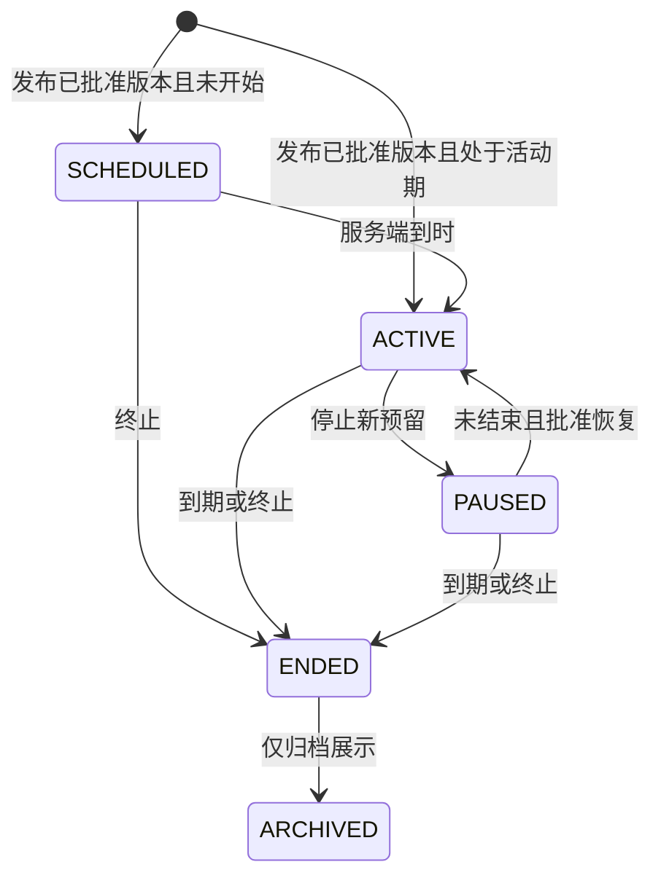

# 购机促销与成交裂变产品 PRD

版本：R1 实施契约 1.0。范围：运营后台、正式 APP、H5、服务端、订单、钱包与设备履约。状态：已获准按 R1 范围实施；不代表空缺业务政策已获批准、功能已通过验收或活动已在生产启用。

本文是该跨端功能包的唯一业务契约。后台操作见 [ADMIN-PRD](ADMIN-PRD.md)，移动端见 [APP-H5-PRD](APP-H5-PRD.md)，执行步骤见 [IMPLEMENTATION](IMPLEMENTATION.md)，关键交互见 [设计原型](../../design/growth-promotions/index.html)。功能包归活动中心所属 PC 仓；APP/H5 接入时引用同一契约，不另复制金额、人群和结算规则。

## P1 目的、需求来源与范围

### P1.1 已确认需求

| ID | 必须满足的需求 | 对应契约 |
|---|---|---|
| REQ-01 | 活动支持促销与裂变类别 | P3、后台 ADM01–02 |
| REQ-02 | 买设备赠设备、返 USDT、赠 NEX | P3、P5 |
| REQ-03 | 新注册、无设备、老客、等级等人群可配 | P2 |
| REQ-04 | 活动开始结束时间可配 | P4 |
| REQ-05 | 指定购买型号对应指定赠送型号，如 A→B、D→C | P3.2 |
| REQ-06 | 同一活动多个购买型号逐项设置不同赠送类型 | P3.2–3.3 |
| REQ-07 | 补充获客、裂变、提高成交与复购的玩法 | P3.1 |
| REQ-08 | 详细后台与 APP 产品设计及适合 Codex 的实施步骤 | 两端配套 PRD、IMPLEMENTATION |
| REQ-09 | APP复用当前组件、样式和交互元素，保持现有页面风格一致 | APP规格；当前样式接入决定 |
| REQ-10 | 先分析现有首页、商城和下单页面，再设计；首页广告进入商城、商品卡体现活动、下单展示赠品 | APP既有链路、设计CURRENT-PAGES |
| REQ-11 | 取消/返回离开时提供真实活动信息的挽留弹窗，并可确认退出 | P4.3；APP APP09 |
| REQ-12 | APP/H5每页截图验证，至少两名独立agent审查功能、UX和现有风格一致性；PC保留像素审查；不达标持续返修复审 | IMPLEMENTATION页面验收硬门 |

上述为主人已确认的需求。其余标为“建议基线”的口径尚待产品确认；P11 未确认项不得被开发者自行变成生产默认值。

### P1.2 产品目标与不变量

目标是提高有效首购、直接邀请成交、多设备购买和复购，并能核算新增成交与全部履约成本。活动以真实购机订单为触发，不把充值、页面访问、点击分享当作购机完成，不承诺设备回报或代币升值。

不变量：服务端裁定资格与金额；同一义务只发一次；暂停/结束不抹去既有承诺；不得超发已预留的奖励；USDT/NEX 分币记账；赠送设备不得假装已建成；APP/H5 同一订单同一结果；未知状态不显示成功或零；既有商品、订单和钱包政策不被活动暗中改写。

### P1.3 交付分期

| 阶段 | 功能 | 发布边界 |
|---|---|---|
| R1 核心 | 逐型号买赠/返币；首购；直接邀请首购双向礼；多型号组合；复购/召回；后台人群、预算、审批、试算、台账与报表 | 覆盖 REQ-01–06；固定奖励；每个受奖对象每条规则选择一种奖励；不设实际金额默认值 |
| R2 扩展 | 满额阶梯、直邀成交阶梯、升级加购 | 在 R1 账本稳定后单独验收；不改变 R1 已承诺订单 |
| R3 扩展 | 买赠分享、双人拼购、购买者自选奖励或复合奖励 | 涉及新权益归属/成团/选奖协议，完成相应产品决定后才启用 |

分期是实施建议，不是缩减已确认需求。R2/R3 的功能契约见 P3.1，入口在未交付前隐藏，不显示可参与。既有活动类型、邀请基础奖励、佣金算法、提现规则、原生手机绑定权限、支付通道和官网均不在本次变更范围。

## P2 人群与参加资格

### P2.1 条件字典

| 条件 | 定义与取值 | 权威来源/默认 |
|---|---|---|
| 注册时间 | 注册时刻与资格判断时刻的间隔；可填最小/最大完整天数，最小≤最大 | 账户注册事实；未选择则不限 |
| 购机历史 | ANY / NEVER_PAID / HAS_VALID_PURCHASE | 订单；首购建议指从未成功支付购机订单，付后退款不自动恢复；未付款取消不算 |
| 当前设备 | ANY / NONE / HAS_QUALIFYING_DEVICE | 设备；需指定纳入统计的来源与状态，不用页面设备卡片数量推导 |
| 等级 | 具体等级集合 | 当前等级目录；多选 OR；未知等级拒绝资格判断而非按最低级 |
| 最近购机 | 距最近有效购机的天数区间 | 订单；无购机历史不能伪装为无限天，单独选“从未购机” |
| 市场 | 已有可运营市场集合 | 既有市场可用性；活动不能放开平台已禁止的市场 |
| 邀请关系 | 有/无直接邀请者；裂变另配置邀请者人群 | 服务端已验证 sponsor 关系；前端参数不能覆盖 |

同一字段的多选为 OR，不同字段为 AND。首期不提供任意嵌套条件表达式。后台必须用选择器、复选、数值范围表达，不让运营输入 JSON 或内部枚举。

“新客”只是展示名称，保存时必须选择“新注册”或“从未购机”的真实条件。老客使用有效购机历史，不仅按注册年龄判断。无设备默认建议统计当前已生效且可使用的正式购买及正式赠送设备，排除手机本体、体验额度、已撤销/到期设备；最终统计集合由 P11-D02 决定并版本化。

### P2.2 判断时点与限次

1. 浏览/试算时只给资格预估。建单由服务端读取人群事实、等级、邀请关系，生成资格快照并预占名额。
2. 支付事务核对账户、订单、资格预占与首购事实。等级按建单快照兑现；首购必须在支付时仍满足。若另一笔先支付使首购失效，本单在扣款前拒绝，并要求重新确认普通报价，不自动按无赠奖金额扣款。
3. 同一账户 APP/H5 并发首购、跨活动首购、同活动改版本均共用账号级仲裁。活动每人次数按 activityId 累计，不能换版本重置。
4. 默认建议“首购一次”覆盖首笔合格订单，订单中符合条件的每个购买项按规则计奖；是否仅限首件由 P11-D01 确认。规则另设每人赠奖台数，避免一次资格变成无上限奖励。
5. 邀请者与被邀请者可有不同条件；被邀请者不能是邀请者本人。共用 IP 等信号只触发既有核查流程，不单凭其自动认定作弊。
6. 全量退款后的资格/计数恢复必须遵照 P11-D01；预算只有在奖励义务真正撤销、资产真正回收后才能恢复可用额度。

## P3 玩法与逐型号赠奖

### P3.1 模板契约

| 模板 | 触发与受益人 | 参数与进度 | 失败/退款与验收要点 |
|---|---|---|---|
| SKU_GIFT 购机赠礼（R1） | 买指定型号，购买者获指定设备/币 | SKU、每组购买数量、计奖方式、奖励类型数量、限次 | 购买项逐项绑定；赠品无库存不允许按该承诺建单；整单退款撤销全部关联义务 |
| FIRST_PURCHASE 首购礼（R1） | 首笔合格支付订单，购买者获奖 | NEVER_PAID + 可选注册天数 | 并发仅一笔占首购；取消未付不消耗资格；付后退款是否恢复按 D01 |
| DIRECT_REFERRAL 双向礼（R1） | 直接邀请者带来的合格首购；双方独立获奖 | 双方人群、各自奖励、被邀者首购一次、邀请者上限 | 每个受益人单独义务；一方失败不重复发另一方；无 sponsor 不能临时填入抢归属 |
| MULTI_PRODUCT 多设备组合（R1） | 同单多个指定型号；各行独立赠奖 | 指定集合及各型号最低数量；满足全部/任一显式选择 | 组合资格按完整订单判，赠奖按行记；与组合折扣是否同享必须选择 |
| REPURCHASE 复购/召回（R1） | 有有效购机历史，再买指定型号 | 最短购机间隔、最长购机间隔（可不设）、人群、每人次数 | 时间参数无默认；间隔上下限都按最近一次有效购机计算，可仅设下限，上限不能小于下限；不另取登录沉默事实；取消/退款订单不算有效历史；不能拆同一单重复计次数 |
| SPEND_TIER 满额阶梯（R2） | 单笔符合条件的净实付达档；购买者获奖 | 门槛升序、档位奖励、最高档模式、可计金额来源 | 默认只取最高档；整单退款全部撤销；部分退款能力未交付前不开放部分退款入口 |
| REFERRAL_TIER 直邀阶梯（R2） | 活动期若干不同直接好友完成合格首购；邀请者获奖 | 唯一好友计数、档位奖励、每档仅一次/最高档补差二选一 | 退款回退有效计数；未兑现高档取消，已发低档不得重复；跨币种/设备档位不得自动“补差”，只能明确逐档一次或同资产补差 |
| UPGRADE_ADDON 升级加购（R2） | 已持指定设备，再支付购买指定型号 | 持有条件、目标型号、符合条件新增实付、奖励 | 引用既有置换合同；抵扣额不算新增实付；不在活动内发明设备回购价 |
| GIFT_TO_FRIEND 买赠分享（R3） | 购机人获得未领取赠品资格，可指派合格好友领取 | 领取时限、受领人条件、可指派次数、设备权益 profile | 未领取前不建设备；不转移已绑定设备，不改写 sponsor；到期释放未成立资格；原购机退款须冻结未领资格，已领走售后处置 |
| GROUP_PURCHASE 双人拼购（R3） | 两人各自下单支付，达成后各获额外赠奖 | 人数固定模板为2、截止、合格SKU、成员唯一性 | D09须选择“按原价买仅额外礼条件成立”或“成团才成交”，两者不得混用；未成团按事前合同退出，不自动改价/扣款 |

限时、限量、等级专享、地区专享只是模板上的筛选条件。活动“促销/裂变”是运营分类；兼容现有 discount/referral 展示类型，新增行为用模板标识，不改旧活动的结算语义。

### P3.2 购买规则与奖励

一条规则包含：稳定 ruleId、购买 productNo、minBuyQty、repeatMode（PER_GROUP/ONCE_PER_ORDER）、最大计奖组数、购买者奖励、可选邀请者奖励、适用模板约束。

每个受益人奖励首期是一个 RewardSpec：DEVICE（giftProductNo、quantity、deviceRightsProfileId）或 USDT/NEX（FIXED、amount、assetPolicyRef）。不同购买 SKU 可选择不同类型；活动内不能将一个全局 rewardAmount 套给全部设备。

| 示例购买规则 | 购买数量 | 获奖对象 | 奖励 | 重复方式 |
|---|---:|---|---|---|
| A | 1 | 购买者 | B × 1 | 每组 |
| D | 1 | 购买者 | C × 1 | 每组 |
| E | 1 | 购买者 | 20 USDT | 每组 |
| F | 1 | 购买者 | 1000 NEX | 每组 |

以上全部为验收样例，不是平台商品名称、真实售价或奖励政策。配置可使用真实商品选择器替换。买 A×2+D×1+E×1，在所有限额允许时应获 B×2+C×1+20 USDT。

### P3.3 计算与金额

- PER_GROUP：候选组数=floor(合格购买数量/minBuyQty)；ONCE_PER_ORDER：满足门槛则1否则0。最终组数受单条、每人、每单、活动剩余上限限制；试算明确展示获得数量，不隐藏限额截断。minBuyQty、各上限为正整数，合法最大值由现有商品/下单能力约束，不写死新业务上限。
- 同一活动同一 SKU 与人群发生重叠规则时，发布前必须消除歧义或显式优先级；同一购买单位不能被互斥规则重复消耗。
- 订单实付使用订单权威金额，赠品标价、运算估值、充值额和未使用抵扣不算实付。券与组合折扣分摊后才确定合格行金额；分摊尾差按稳定订单行序号分配，行合计必须等于订单金额。
- 金额与币量在接口使用十进制定点字符串；精度、最小单位从既有资产目录读取，超精度配置拒绝而非静默四舍五入。库存和设备数量为整数。
- R1 固定 USDT/NEX 数量。按实付比例返 USDT/NEX 是后续选项，需 rate、cap、计奖资金来源、NEX价源和锁价时点；未确认前不显示比例控件。
- 赠品不贡献成交额、不触发购机返奖、不产生新的购买佣金、不用于再次凑单达标；设备运行后的其他权益由 P5 指定，不能从“零价”擅自推导。

## P4 活动时间、试算、报价与支付

### P4.1 时间规则

所有比较采用服务端 UTC 时刻，后台可选择显示时区并保存 IANA 时区标识。有效区间为 [startsAt, endsAt)，开始包含、结束不包含。预告展示不等于可建单。

试算可在活动进行中获取，但只有成功建单预留后才构成限时承诺。订单 payBy=min(现有订单付款截止、活动 endsAt)。界面同时显示活动结束和本单付款截止，不按设备本地时间判资格。

暂停/人工结束不再接受新的预留；已有预留可在原 payBy 前履行。异常风控导致已有订单必须停止支付时，须通过既有订单安全处置、原因及通知完成，不靠改活动状态暗中撤销。

### P4.2 预览与正式预留的区别

| 阶段 | 内容 | 是否占用/是否承诺 |
|---|---|---|
| 活动详情、试算 quote | 服务端按当前版本计算价格与预计赠奖，返回 quoteId/expiresAt；expiresAt=min(当前时间+已批准quoteTTL, endsAt) | 不占名额、预算、赠品；必须写“预计” |
| 建单 | 校验 quote 未过期及版本/库存/资格；事务锁定购买与赠品库存、活动额度和资格；保存完整订单快照 | 正式限时预留；任何一项失败整体不建立承诺 |
| 支付 | 只读取已锁快照；验证截止、首购仲裁与余额，再按既有钱包支付事务扣款 | 成交后预算由预留转为已承诺，生成奖励义务 |
| 取消/过期 | 未扣款且支付结果明确失败或未发生 | 释放预留，保留订单与操作记录 |
| 支付结果未知 | 重试原命令/读回原订单；不可另建一笔付款 | 核账前不按普通未付超时释放 |

建单时任一事实与试算不同，返回需重新报价的冲突，展示变化并由购买者重新确认；不得静默减少奖励。支付网络超时不等于付款失败。正式链目前为钱包支付；HDPay 充值回调仅充值，不能直接触发购机奖励。

活动截止后才到达的通知，按支付事务权威 paidAt 认定；若权威时间在截止前且支付已提交，必须兑现。若发生截止后异常扣款，进入原单对账与既有退款/履约处置，不能把收款和撤奖都当成功。

### P4.3 现有购买链路与离开挽留

主路径固定为现有首页推广轮播→现有商城活动商品→现有商品详情或直接购买→现有结账步骤→订单结果。规则详情仅作辅助，不增加独立营销结账系统，也不强制先进入活动详情页。首页推广复用现有轮播布局能力，但营销数据来自活动服务，不将购机促销伪装为现有每周任务。

商城保留全部商品浏览与卡片原有点击语义，活动入口可带activityId过滤/定位，明确显示活动范围和“查看全部商品”。商品卡显示实际匹配的赠奖摘要；结账在现有商品及实付信息之后加入逐项赠奖和到账条件，奖励不从应付金额里再减一次。

| 离开场景 | 行为与文案基线 |
|---|---|
| 未建单、有合格选购项，主动离开结账 | 单次确认，五秒内可读懂；仅标题、一句真实限时赠礼提示和“继续购买 / 退出”。赠礼明细及截止时间保留在下单页；ESC/遮罩关闭弹窗并留在原页 |
| 已建单未支付，主动离开页面 | 一句说明赠礼仍限时预留及退出不取消订单，按钮同上；真实付款截止留在下单页，不提前释放预留 |
| 明确点击取消待支付订单 | 合并到既有取消确认：“取消后将释放本单预留的「{奖励摘要}」，此订单将无法继续支付。是否取消订单？”按钮“保留订单 / 取消订单”；仅服务端确认取消后回退 |
| 确认步骤返回上一结账步骤 | 原地回退且保留选择，不触发营销挽留 |
| 支付处理中/结果未知/已有票据 | 既有支付安全与票据恢复优先，不用营销弹窗遮盖；离页后仍可查询原单 |
| 无奖励/已结束且无预留/无权威时间 | 不显示虚假买赠或紧迫文案；按普通返回或必要的未保存提醒 |

一次离页尝试至多一个提示；选择继续购买后，不在同一未变化报价会话反复骚扰。明确退出后执行原目标跳转；深链无前页时回商城；选购内容在现有会话缓存范围保留，返回后重新试算，不能宣称永久锁定优惠。刷新、关闭浏览器/系统进程不承诺可拦截，不使用循环history阻止退出。倒计时由服务端endsAt/payBy推导，重进不能重置；“买一赠一”只在真实1台对应1台设备规则成立时使用，混合返币写具体奖励。

## P5 奖励资产与赠送设备权益

### P5.1 资金奖励

USDT/NEX 分别产生奖励义务、钱包记账和审计事实。引用现有资产释放策略 assetPolicyRef，记录待审核/待生效/可用等归属，不直接写余额。可提现性、可用于购机范围、手续费及限制须在活动详情和结账前可见；仅抵扣用途的资金不得宣传为可提现返现。

同一笔活动允许 E 发 USDT、F 发 NEX；不要求每条规则强制双币，也不能影响既有推荐奖励的币种规则。发奖数额不会因活动后来改价、改版本、结束而重算。

### P5.2 设备奖励

deviceRightsProfileId 引用经确认且版本固定的赠品设备权益，最少包含：实际赠送型号、启用方式、生效与到期、能否运行任务、任务及收益规则引用、是否计入设备持有/等级、是否支持置换或转赠、售后撤销方式。

赠送设备由 Commerce 的正式设备发放边界创建 nx_user_device，来源明确为 PROMOTION_GIFT，关联义务、原订单和实际赠送型号；创建成功并回读设备后才显示“已到账”。当前 V-Rank SKU 发放只产生权益，不可直接当作设备已可使用。

设备赠品的价格记零，不以商品标价生成可退本金；原订单退款权利仍遵照原交易合同。因权益 profile 未确认、赠品已使用或存在后续收入导致无法自动回收时，标 MANUAL_REVIEW，不能凭空扣除正常钱包余额。

R1 建议发放后直接出现在已有“我的设备”，不另设激活任务、再邀请或二次充值才能领取的隐藏条件。若选择需要领取的权益模式，必须改动本契约、移动端文案和验收，不能用相同“送设备”名称偷换结果。

## P6 预算、限额与活动叠加

### P6.1 预算账

分别跟踪每种资产/SKU的 total、available、reserved、committed、issued、reversed、unrecoverable。可用余额依据真实发放和回收计算，不因标记“退款中”就恢复预算。设备预算同时校验实际库存或发放配额及权益生命周期成本。

每个 activityId × 资产/SKU 单独守恒，不跨币种相加。total为已批准总额度；reserved为未付有效订单的预留存量；committed为已付但尚未发放或取消的义务存量（含核账未知项）；issued为累计确认发放总量；reversed为已确认回收且实际可再次使用的累计额度。available = total − reserved − committed − issued + reversed，必须≥0。unrecoverable是issued−reversed中已确认无法收回的子集，只作损失披露，不能再扣一次预算；处理中冲正不计reversed。设备撤销但不可重发的配额不算回收，库存另以商品库存事实约束。

建单available→reserved；支付reserved→committed；发放成功committed→issued；未支付取消/明确到期释放reserved；已付未发且确定退款执行后减少committed；已发且真实回收增加reversed。每次转换原子更新，重复命令不重复转账；预算不足拒绝增加承诺。后续提高/降低total通过新审批版本，不重置已发生的各账项。

原子操作最少覆盖：购买库存、赠品库存、每人名额、活动名额、USDT/NEX额度、报价与订单事实。仅剩一份赠品时两个并发订单只能一个获得正式承诺。缺额策略 shortagePolicy 必须选择 RULE_STOP（只停止资源不足的规则）或 ACTIVITY_PAUSE（停止全活动新预留），前者允许无资源冲突且额度充足的规则继续；不得静默替换奖品。

资金计划包含既有叠加奖励及设备后续履约责任。增加预算不能直接绕过现有资金安全校验；用新的审批版本。资金政策不允许兑现时停止新增承诺并处理既有义务，不暗中更换币种。

### P6.2 叠加表（建议基线，D05确认后生效）

限额计数采用以下明确单位，不把次数、台数和币量混用：

| 参数 | 键与计数单位 | 占用/释放 |
|---|---|---|
| perPersonLimit | activityId × accountId × beneficiaryRole 的合格订单数；购买者与直接邀请者分别计数，同订单多行只算一次 | 建单预留一次，支付转已用；明确未付取消/过期释放；退款后是否恢复已用次数按D01 |
| activityLimit | activityId 的合格订单数；同订单有双方奖励仍只算一次 | 与上述订单时点一致，版本变化不重置 |
| PurchaseRule.maxGroups | 同订单内该ruleId的最大计奖组数 | 报价时截断候选组数；不得把它展示为订单参与次数 |
| PurchaseRule.maxGroupsPerPerson | activityId × ruleId × accountId × beneficiaryRole 跨订单累计的计奖组数 | 建单按实际承诺组数预留，支付转已用；未付释放；付后退款恢复按D01 |
| budgets与赠品库存 | 每资产币量或每SKU设备台数 | 依P6.1独立占用，不能用订单次数代替币量或台数 |

次数上限达到时不允许该角色产生新的活动承诺；同一订单未达上限的另一角色可按已发布规则独立获奖，报价明确显示双方各自结果，不能把一方不合格冒充双方获奖。maxGroupsPerPerson作用在组数，不对已报价的单个RewardSpec再私自减半。组数上限截断应在报价说明实际可得，资源不足则重新报价或拒绝建单，不在支付/发奖时砍已锁承诺。可选上限要显式“无限制”，不能用空值/0代替；活动总预算和发布必需限额仍须完整配置。

| 组合 | 建议 | 必须展示/验证 |
|---|---|---|
| 同活动不同购买项 | 允许各自获奖 | 汇总与逐项明细一致 |
| 同一购买项多个促销 | 同互斥组仅一个，明确优先级 | 不能按无法比较的设备和代币价值自动选“最优” |
| 促销+优惠券/组合折扣 | 默认不额外叠加，允许经配置启用 | 按折后实付试算全部成本 |
| 促销+已有基础邀请/佣金 | 不修改既有合同；新增活动是否允许在该场景投放须明确 | 基础费用纳入活动成本；不将拒绝活动改成拒发既有奖励 |
| 新活动双向礼+H8新人礼 | 明确允许/互斥/仅购买者活动礼 | 不复用H8唯一结算键，不因新活动补算所有历史邀请 |
| 试用转正/置换订单 | R1仅在契约明确支持后纳入，否则结账前明示不适用 | 赠品与抵扣不计实付；不改变原生手机权限 |

预算不足不能只靠按钮禁用防护，服务端须在建单、支付确认与发奖时维护同一额度事实。客户端传入的奖励数量、等级、邀请者、预算值均不可信。

## P7 成交、自动发奖与售后

### P7.1 成交及奖励义务

以权威订单支付成功为触发。在支付事务中保存订单赠奖快照并写可靠事件；通过现有 outbox/消费者恢复能力交接发奖。异步消费者必须回查订单，不仅相信事件中的客户端字段。

每个“活动×订单行×受益人×奖励规则×计奖单位”生成唯一 obligationId。配置版本保存在义务快照中，不用新版本绕过唯一性。多台设备可拆为单位义务或带原子累计计数的义务，但实际资产创建键须能逐台防重。

自动发奖条件是 paid + 订单满足发布时约定的 settlementPolicyRef + 未退款/未冻结。成熟条件引用已有订单/资产合同；禁止臆造7天等等待期。R1无“再次点击领取”要求。处理顺序不影响结果，失败部分可恢复。

### P7.2 整单退款边界

当前后端已有整单钱包退款，未提供本方案需要的部分退款或原支付渠道退款能力。R1沿用整单钱包退款，逐行记奖仅用于追踪与防重，不在APP新增部分退款承诺。

退款申请/执行与发奖按原订单串行仲裁。申请进入受理时先设 refundHold，保留原奖励状态和预算，暂不产生不可逆的撤奖终态；申请被拒绝或撤回后解除该申请对应hold，并重新核验成熟及其他冻结条件后从原状态继续。不存在已确认退款执行事实时，不能因申请曾经出现便永久取消奖励。

退款确定执行后：未发义务转 CANCELLED；发放结果未知先核账；已发义务转 REVERSAL_PENDING，按资产原流水和设备来源追回。退款执行结果未知时保留hold，先查原退款，不恢复发奖；恢复规则不能将已CANCELLED/REVERSED义务复活。退款和撤奖可以有可见的分别处理状态，但不得在未核实全部结果前报“全部处理完成”。

| 情形 | 处理 |
|---|---|
| 未支付取消/过期 | 无奖励义务；释放明确未成交的预留 |
| 已支付、奖励未发 | 申请阶段仅hold；原单退款确定执行后取消所有受益人的相关义务 |
| USDT/NEX已发且可冲正 | 引用原奖励记账，在现有授权退款流程内产生唯一冲正记录 |
| 奖励已使用/转出、余额不足 | 进入待核对；展示受影响金额；按D06确定的售后合同处置，不默认扣其他资产或凭空造负余额 |
| 设备已发 | 撤销本次来源设备需保留审计；已运行权益或后续收益按D03/D06处理，不能一并无依据清零 |
| 部分奖励成功 | 已成功项不重发；逐项取消/冲正；聚合状态保持部分处理 |

订单本金退款不得因系统发奖故障无限搁置。合法售后条件、可抵扣方式及无法追回损失承担由 D06 明示；系统异常不能自动改写该政策。

### P7.3 运营恢复

RETRYABLE_FAILED 可重试原义务；OUTCOME_UNKNOWN 必须先查原命令和原资产流水；ISSUED 不允许“补发同一奖励”。额外补偿是独立审批单，记录理由和上限，不能修改原记录装作一次发放。审计同时保留操作者、审批人、版本、命令号、前后状态、关联订单和原资产流水。

## P8 数据模型与接口契约

### P8.1 核心对象（拟新增，服务端权威）

| 对象 | 关键字段/类型 | 生成规则与约束 |
|---|---|---|
| Promotion | activityId:string、category:PROMOTION/REFERRAL、template:string、status、activeVersion:int、startsAt/endsAt:UTC、displayTimezone、localizedContent、placement、minimumClientCapabilities | ID服务端生成；activityId跨改版稳定；旧H4 eventCode唯一关联；首页投放home.purchase-promotion固定导向现有商城，响应另含权威serverTime |
| PromotionVersion | version:int、draftVersionState、audience、rules[]、limits、budgets[]、shortagePolicy、stackingPolicy、settlementPolicyRef、asset/devicePolicyRefs、decisionRefs、revision、approvedBy/At、publishedBy/At | 发布版本不可编辑；原始合同可审计；决策缺失不可发布；草稿审批状态独立于已生效活动 |
| AudienceSnapshot | accountId、registeredAt、purchaseFactVersion、deviceFactVersion、rank、sponsorId、evaluatedAt、matchedConditionIds | 不向购买者暴露内部风控算法；后台仅授权角色可查 |
| PurchaseRule | ruleId、productNo、minBuyQty:int、repeatMode、maxGroups、maxGroupsPerPerson、buyerReward、inviterReward?、priority | 稳定ID；购买与赠送SKU不同字段；上限单位按P6；活动内冲突必须可裁决 |
| RewardSpec | rewardRuleId、beneficiaryRole、type、amount:string?、giftProductNo?、quantity:int?、policyRef | type决定必填字段；无隐式汇率；金额正数，DEVICE必须rightsProfile |
| PromotionQuote | quoteId、expiresAt、quoteHash、items[]、prices、eligibility、expectedRewards[]、policyVersions | 只试算；不预留；客户端只缓存展示 |
| OrderPromotionSnapshot | orderNo、orderLineId、activityId/version、ruleId、beneficiaryId、quantity、rewardSnapshot、qualification、payBy、reservationIds | 正式建单时锁定；支付与取消必须用此事实 |
| RewardObligation | obligationId、orderNo/orderLineId、activityId/version、beneficiaryId、rewardRuleId、unitSeq、status、refundHold/refundRequestId、originalLedgerNo/deviceId、lastCommandId、retryReason、timestamps | 唯一性不依赖客户端UUID；关联原金额和原SKU；hold不代替原状态；不可跨账户读写 |
| PromotionReservation | reservationId、activityId、accountId、orderNo、assetOrSku、quantityOrAmount、expiresAt、state | RESERVED/COMMITTED/RELEASED；结果未知不可按普通过期释放 |
| RewardReversal | reversalId、obligationId、refundNo、amount/quantity、state、originalPostingNo、reason | 同原义务和退款唯一，重复事件返回原结果 |
| PromotionMetrics | period/timezone、currency、paidOrders、netOrderPaid、externalInflow、rewardIssued/reversed/unrecoverable、giftCost、attributionCoverage | 无数据/不支持不表示0；数量与金额单位不混加 |

示例payload只用于联调fixture；生产ID、审核身份、资格和币量全部由服务端生成/校验。数据库表名与具体迁移号在实施S1固定，不在客户端使用表名。

### P8.2 现有事实与拟新增接口

| 类型 | 方法/路径 | 契约 |
|---|---|---|
| 已有 | GET /api/events；POST /api/events/{eventCode}/join、claim | 保留旧活动；不能拿旧单项领取键发多项购机奖励 |
| 已有 | POST /api/orders；POST /api/orders/bundle；POST /api/orders/{orderNo}/pay | 单品quantity已有；bundle目前不同productNos；钱包pay为正式成交 |
| 已有 | POST/PATCH /api/admin/devices/orders/{orderNo}/refund | 整单钱包退款；不声称已支持部分/原路退款 |
| 提案 | GET /api/promotions；GET /api/promotions/{activityId} | 返回活动合同、适用商品、真实资格摘要；匿名只读公开规则，个性化数据须登录 |
| 提案 | POST /api/orders/quote | 入参items[{productNo,quantity}]、voucherId?、活动选择；返回报价、人群结果、预计奖励、版本及有效期；无写预算副作用 |
| 扩展提案 | POST /api/orders 或 /bundle 的 promotionQuoteId | 建单必须重校验并占用；bundle支持items[]，与旧productNos[]互斥；客户端不得指定奖励和受益人 |
| 提案 | GET /api/promotion-rewards；GET /api/promotion-rewards/{obligationId} | 当前账户奖励列表/详情、状态、关联订单/设备/资金流水；游标分页 |
| 提案 | GET /api/promotions/{activityId}/referral-progress | 当前邀请者的合格成交与自己的奖励，不暴露好友付款金额/身份详情 |
| 提案 | /api/admin/growth/promotions 及 /{activityId}/draft、simulate、submit、approve、reject、publish、pause、resume、end、versions | 新增后台域；写操作含expectedRevision、reason、Idempotency-Key，审批及发布权限服务端检查 |
| 提案 | POST /api/admin/growth/promotions/{activityId}/copies、audience-preview | 前者只复制配置到未发布草稿，不复制账本/名额；后者只读人群预估，不占资源或输出未授权个人信息 |
| 提案 | /api/admin/growth/promotion-rewards 及 /{obligationId}/reconcile、retry | 查台账、核账、重试原义务；不提供任意改余额/改为成功 |
| 提案 | GET /api/admin/growth/promotions/{activityId}/metrics | 以订单/外部入金/奖励及退款事实派生；币种与范围齐全 |

所有提案接口在 S1 写入精确 OpenAPI 和请求响应实例后才能用于产品实现。400配置错误、401未登录、403无权限、409版本/资格/库存冲突、422业务约束拒绝、503暂不可用均映射为可理解文案；工程码保留日志，APP不直接展示。

同命令同key同payload返回原结果；同key不同payload拒绝；网络未知保持原key并读回。接口失败不可回退为本地成功。既有客户端不传新增字段仍按旧订单合同运行；新活动依赖最低客户端能力，不支持逐项奖励的旧客户端只能展示活动说明，不可承诺后继续无赠奖结账。

## P9 状态机与禁止动作

草稿版本审批与已发布活动是两个状态对象。draftVersionState 为 DRAFT → PENDING_APPROVAL → APPROVED；驳回回 DRAFT。修改已批准但未发布版本会撤销其批准并回 DRAFT。APPROVED 之后仍须单独执行 publish；审批与发布角色映射按 D10 确认，不允许客户端把“审核通过”当成“已上线”。

ARCHIVED不删除账本或阻止既有义务处理。拒绝：未审核/未发布直接ACTIVE；结束后直接恢复原版本；直接修改已发布奖励；减少预算至已占用/已承诺以下；将审批意见或失败记录覆盖删除。首次发布前 activeVersion 为空，列表显示草稿的审批状态。已有 ACTIVE 活动新建草稿时，旧 activeVersion 和活动状态继续有效，不随草稿待审变成下线；新版本正式发布后才切换新报价/预留。暂停中的活动发布新版本不会自动恢复，恢复需独立授权。

奖励项状态：PENDING（等待条件）→READY→PROCESSING→ISSUED；PROCESSING→RETRYABLE_FAILED（确认未发）或OUTCOME_UNKNOWN（结果未知）；前者重试回READY，后者核账后转ISSUED/READY/MANUAL_REVIEW。退款申请先附加hold而不改变终态；未发且退款确定执行→CANCELLED；ISSUED且退款确定执行→REVERSAL_PENDING→REVERSED或MANUAL_REVIEW。

禁止：OUTCOME_UNKNOWN直接新发；ISSUED重复转READY；有效refundHold或确定退款执行后新发；CANCELLED/REVERSED复活；把一项成功当成整单成功。展示聚合态由各义务派生，允许“部分到账/部分待核对”，不创建另一个可随意修改的总成功标志。

## P10 验收、指标与非功能要求

#### [FEAT-GROW-CORE01] 购机赠奖与成交裂变闭环

**① 用户故事**

作为运营负责人，我想按人群和购买型号配置有预算约束的赠奖，以便以可核算成本促进真实成交。作为购买者，我想在付款前知道每台设备的奖励和到账条件，以便据此决定购买。作为直接邀请者，我想查看合格成交带来的本人奖励进度，以便核对承诺是否兑现。

**② 验收（Given / When / Then）**

| ID | Given 前置 | When 动作 | Then 可证伪结果 |
|---|---|---|---|
| AC-01 | A→B、D→C、E→20USDT、F→1000NEX，额度够 | 建单并支付A×2+D+E+F | 4个购买行，奖励B×2+C+20USDT+1000NEX，关联受益人和版本正确 |
| AC-02 | 首购资格同一账户 | APP/H5并发支付两笔 | 最多一笔享首购；另一笔不被静默扣款成普通订单 |
| AC-03 | 同活动版本1已预留 | 发布版本2并暂停活动 | 原订单payBy前可按版本1支付；新订单不能取得旧预留 |
| AC-04 | 活动已结束、此前已支付且奖励待生效 | 成熟任务执行 | 按原承诺发奖，可在订单及奖励页回读 |
| AC-05 | USDT、NEX、设备多项义务 | 重复投递同一成交与发奖命令 | 无重复余额/设备；刷新后仍是同一流水和设备ID |
| AC-06 | 赠品仅剩1份（异常） | 两个账号并发建单 | 仅一个预留成功；另一个明确库存不足，购买库存/钱包均无半写 |
| AC-07 | 试算有效但建单前奖励版本变化（异常） | 确认建单 | 409要求新报价，展示差异；无订单扣款或隐藏替换奖励 |
| AC-08 | 支付请求超时但事务已提交（异常） | 返回页刷新并重试 | 查询原订单成功，只有一次扣款与一组义务，不另建支付 |
| AC-09 | 一项已发、一项确认失败、一项结果未知（异常） | 运营重试 | 仅确认失败项重试；未知先核账；已发不重复 |
| AC-10 | 已支付整单退款（异常） | 退款执行与发奖并发 | 按同订单仲裁，退款确定执行后未发取消、已发冲正/待核对；没有退款后新增赠奖 |
| AC-11 | 现金已转出或赠品已使用（异常） | 执行撤奖 | 标明待核对及原奖励，不凭空造负余额或扣无关资产 |
| AC-12 | 缺失权益profile/结算政策/预算（异常） | 提交发布 | 明确缺项并拒绝发布；不得默认补值 |
| AC-13 | 无权限账号或篡改beneficiaryId（异常） | 写规则/读他人义务 | 服务端拒绝；无跨账号资产或隐私泄漏 |
| AC-14 | 邀请双方且一方到账失败（异常） | 退款/恢复顺序互换 | 各自原义务闭环；不重复发成功方，不改sponsor |
| AC-15 | 折扣券与组合折扣及旧邀请奖并存 | 试算并成交 | 以选定叠加表裁决；实际成本与展示相符，无旧奖励算法变更 |
| AC-16 | 赠机执行成功 | 查询我的设备、刷新、查询台账 | 真实deviceId、来源及权益一致；不能只有SKU权益记录 |
| AC-17 | 无数据/服务不可用（异常） | 打开活动与报表 | 空态与错误态区分，未知金额不显示0；有重试和返回 |
| AC-18 | 活动期边界、服务器/设备时区不同 | startsAt或endsAt精确支付 | 开始包含结束不包含，采用权威事务时间 |
| AC-19 | 旧客户端和非促销旧活动 | 普通购买/旧领取 | 原有合同不变；不支持新奖励显示的客户端不进入含新承诺的支付 |
| AC-20 | zh/en/vi、APP/H5、320/390/430px、后台桌面 | 同一订单流程 | 金额、权益、状态一致，交互无截断/死按钮，H5不获得原生手机能力 |
| AC-21 | 首页具有有效促销推广且已有新人/每周任务 | 点击推广进入商城 | 保留原任务，携活动范围；商品卡奖励与结账快照一致，不新增营销结账页 |
| AC-22 | 合格未支付结账、有真实奖励/截止 | 点击顶部返回/取消离页 | 只出现一次挽留；继续购买保留输入，确认退出回原目标；无虚假倒计时 |
| AC-23 | 待支付订单已有奖励预留（异常） | 离页，再进入订单；另执行明确取消 | 离页不撤订单；取消成功才释放；未知结果先核账，不因挽留增加重复支付 |
| AC-24 | APP/H5当前组件与逐页运行截图；PC固定稿与运行截图 | 至少两名未参与该页面实现的独立agent分别审查 | APP/H5各自检查功能、UX和风格一致性，PC提交像素差异及操作验收；任一未通过即返修，两名重新审查同一新快照 |
| AC-25 | 退款申请受理后被拒绝/撤回（异常） | 清除原申请hold并到达成熟条件 | 从保留状态重校验恢复；不产生CANCELLED复活或重复到账；预算只作合法状态转换 |

异常验收必须在隔离资源执行，不用真实客户资产制造退款或并发。R2/R3上线前为各模板新增同等级验收，不复用R1绿灯。

**③ 数据字典**

P8为唯一字段定义，P3给金额计算，P5给资产语义。ID与状态服务端权威，客户端不生成业务结算号。任何脚本fixture都显式标为测试来源，禁止作为生产结算依据。

**④ 状态机**

采用P9活动/奖励状态及P4预留状态，退款仅沿P7。支付、订单、奖励是不同对象，不能把活动ENDED映射为奖励CANCELLED。

**⑤ 交互原型与四态**

默认：逐项显示合格商品与奖励。空：无活动/无奖励分别说明并给商城或返回入口。加载：占位骨架保留信息层级，禁重复提交。报错：保留已填内容，解释不可参加、报价变化、库存不足、网络未知，并提供重试/查询原单/返回。可点击原型是设计样例，不连接真实服务；正式验收必须另测真实持久化。

**⑥ 点击流**

| 触发 | 目标 | 反馈/恢复 |
|---|---|---|
| 后台新建 | ADMIN ADM02–05 | 校验并保存草稿；返回保留已填 |
| 试算/提交 | ADMIN ADM06 | 预计结果/冲突；审批前不生效 |
| 首页推广→商城购买 | APP APP01–04 | 复用首页轮播、商城商品卡与原结账；选设备→试算→确认正式建单 |
| 未付结账主动离开 | APP APP09 | 挽留只确认离页；继续保留输入，退出保留已建订单；明确取消另走原订单合同 |
| 支付/查询原单 | APP APP05 | 真实订单结果；失败重试原命令 |
| 查看奖励/设备/账单 | APP APP06–07 | 对应本人真实对象；不能跳空详情 |
| 邀请分享 | APP APP08 | 系统分享或复制结果；不把分享成功当成交 |
| 后台核账/重试 | ADMIN ADM08 | 只作用原义务，保留审计 |

**⑦ 一致性、指标与非功能**

业务合同由本文管理；后台和APP以FEAT ID引用。正式实现要校验字段、i18n键、接口与状态映射一致。APP/H5同轮同步；后台未经授权不能查看额外客户信息。

指标至少包括有效首购人数、直接邀请合格成交人数、合格订单实付减退款、外部入金及外部流出、USDT/NEX发放与冲正、赠品实际成本、未追回损失、预算使用、逐项失败与恢复时长。订单钱包扣款不是第二次外部入金；充值不直接等于营业收入；赠品标价不是成交额；NEX数量与估值分别展示。所谓增量须有可比对照或注明仅观察值，不伪造增长效果。

查询分页沿项目现行标准；关键写操作可重放、并发一致、资金精度守恒。性能目标沿现有接口SLO，S0若无现行目标须单独定量验收，不能杜撰生产性能。日志不记录完整凭据、钱包秘密、好友私密购买详情。监控区分报价失败、预留失衡、义务延迟、未知结果和冲正失败，不用一个“发奖失败数”吞掉原因。

## P11 待确认决策与启用条件

| ID | 业务决定 | 建议基线 | 未确认的影响 |
|---|---|---|---|
| D01 | 首购按首单还是首件；退款是否恢复资格 | 首笔合格订单；各项受独立上限约束；已付款退款不自动恢复 | 阻断首购、双向首购活动发布 |
| D02 | 无设备纳入哪些来源/状态 | 正式购买及已生效赠品；排除手机、体验、撤销和到期 | 阻断该人群活动发布 |
| D03 | 赠品设备是否与普通设备同权益 | 优先引用现有可兑现权益profile，并明示差异；必须落真实设备 | 阻断所有DEVICE奖励发布 |
| D04 | 奖励成熟、可用、可提现政策 | 复用既有订单与资产合同；不新增隐蔽锁定期 | 阻断对应资金奖励发布 |
| D05 | 与券、组合优惠、H8及现有奖励如何叠加 | 同项促销互斥；其他组合明确选定并计全成本 | 阻断冲突场景发布 |
| D06 | 已用奖励的售后追回、损失承担 | 不默认扣无关资产；按明示售后合同处理 | 阻断可发生该情况的活动发布 |
| D07 | R1/R2/R3先后范围 | R1先验收；扩展单独开关 | 不阻断文档评审，阻断未经选择的模板开发启用 |
| D08 | 比例返NEX的价源/锁价/上限 | R1只固定数量 | 阻断比例模式 |
| D09 | 拼团失败和转赠归属合同 | 分别确认后启用；不复用普通买赠名称掩盖条件 | 阻断R3模板 |
| D10 | 编辑、审批、发布及资金恢复的角色映射 | 分离审批与发布动作；敏感自审限制沿既有权限政策，明确授权角色 | 阻断生产发布/重试权限启用 |
| D11 | 报价有效期与订单付款时限 | 配置报价有效期；payBy不晚于既有订单期限和活动结束；报价不占额 | 阻断报价/建单线上启用，不用示例分钟数充当正式值 |

本表是产品待决定清单，不是开发默认配置。发布前必须有对应批准版本、有效预算和真实权益引用。可先开发数据结构、校验、测试fixture和不可发布的草稿流程；任何涉及未知政策的生产执行分支保持拒绝。

## 附录：当前源码基线与差异

| 工程 | 固定远端基线 | 已核事实 |
|---|---|---|
| PC | nexion-frontend-pc/test `eca3669f38c1ebd64c77903c7c0c9581c30245ff` | H4创建为单reward文本及condition；多SKU结构和独立义务尚需扩展 |
| APP | nexion-frontend-uniapp/test `e7f471b69d3d12b68ce1328c2bdab9938b1d0304` | 正式remoteApiEnabled=true；单项活动奖励；单品quantity已有 |
| H5 | nexion-frontend-prototype/H5 `e4a7ce33377128bd12491dbee02b8f7ebba2112d` | 来源pin匹配上述APP；手机权限边界保留 |
| 服务端 | nexion-backend/test `36ed64eff16035e8e7a9c27733351b78d016c16b` | 钱包支付购机、整单钱包退款、SKU权益未直接创建设备 |

关键实现位置：PC `app/components/domain-views/h-tabs/h3-quest-events.tsx`、`lib/admin/h-client.ts`；APP `src/api/events-api.ts`、`order-api.ts`、`bundle-order-api.ts`、`src/lib/order-line-items.ts`；服务端 `commerce/application/AppOrderCommandService.java`、`shared/canonical/AppBundleOrderService.java`、`device/application/OpsDeviceService.java`、`growth/application/AppGrowthEngagementService.java`、`OpsReferralRewardService.java`、`team/application/VRankSkuFulfillmentService.java`（Java路径前缀见实施方案）。源码基线不代表生产已启用；开工必须重新fetch比较。
