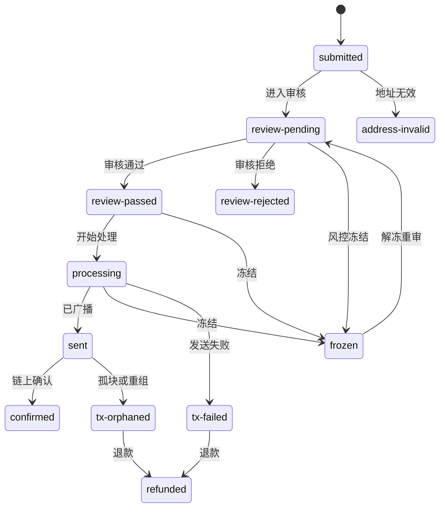
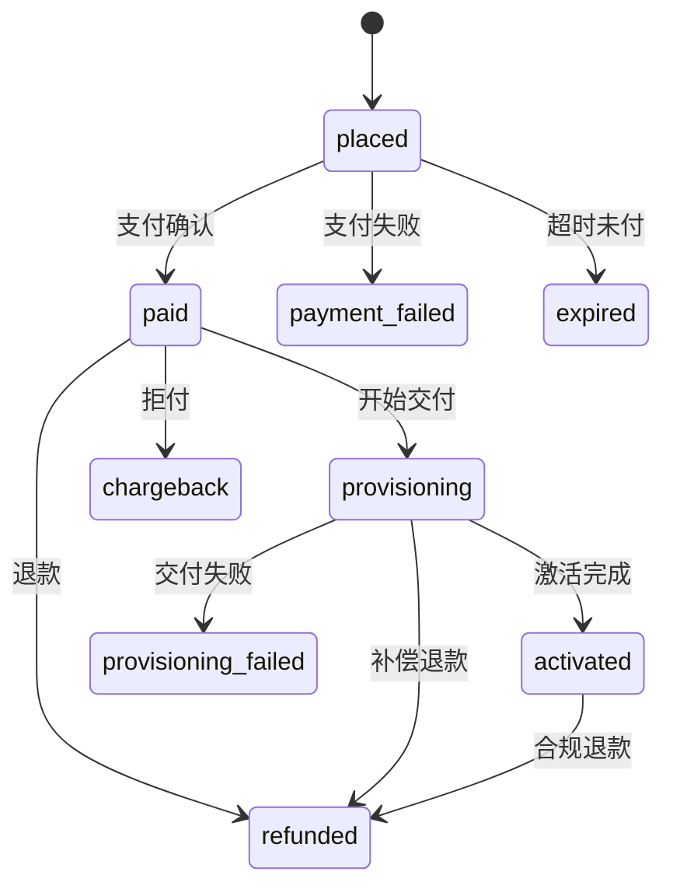

# Nexion 业务规则与状态机总表 v1.0

> **现行裁决(2026-08-07)**:全项目已取消 KYC、钱包配对、C4 与 K5；本文相关旧字段、门禁、用例、权限或流程仅保留为历史基线，不得作为现行实现、运营或验收依据。

> 状态：Baseline Draft（可作为权限矩阵与验收用例的输入，不代表所有待决项已定版）
>
> 编制日期：2026-08-04
>
> 覆盖范围：PC 运营后台、App、后端服务
>
> 变更性质：业务规则资产整理，不修改产品功能、接口或数据库

## 1. CAPABILITY：这份文档解决什么问题

本文件把散落在 PRD、开发落地规格、产品更新日志、前后端实现和历史验收资料中的业务规则，收敛为一套可执行的业务对象、状态、动作、禁止项和异常恢复基线。

它主要服务于三类工作：

1. 产品和研发判断“某个对象现在是什么状态、还能做什么”。
2. 权限设计判断“哪个角色可在什么状态下执行哪个动作”。
3. 验收设计判断“正常路径、非法路径、失败路径和恢复路径分别如何验证”。

本文件不把页面文案、前端本地状态或 mock 定时器当成业务真相。业务状态一律以后端持久化结果为权威，页面只展示后端快照并提交业务命令。

## 2. 证据等级与裁决规则

### 2.1 规则标签

| 标签 | 含义 | 使用方式 |
|---|---|---|
| `FIXED` | 多份材料一致、跨实现长期稳定的业务不变量 | 可直接进入接口合同、权限矩阵和验收用例 |
| `VERIFIED` | 已由当前实现或 2026-07-29 全量验收确认 | 当前版本按此执行；后续变更必须显式记录 |
| `OPEN` | 材料互相冲突、枚举不完整或业务口径未定 | 不得自行补全；进入待决事项 |
| `LEGACY` | 已退役或只存在于旧材料中的能力 | 不得从旧页面、旧接口或旧状态重新激活 |

### 2.2 真源优先级

出现冲突时按以下顺序取证，但不能用高优先级材料“抹掉”已发现的冲突：

1. 有日期且已验收的产品更新日志与当前后端持久化行为。
2. 当前前后端合同、枚举、Service 状态迁移和数据库约束。
3. 开发落地规格。
4. 旧版 PRD、操作矩阵快照和高保真原型。
5. App/PC mock、本地缓存、演示计时器仅用于理解交互，不作为业务状态真源。

主要证据：

- [PC 开发落地规格](../Nexion_运营控制后台_开发落地规格.md)
- [后台产品更新日志](../../后台产品更新日志.md)
- 当前后端域合同：`D:\workspace\nexion-backend\docs\ops-console-domain-contracts.md`
- `D:\workspace\NX1.0\PRD\NexGrid_APP端开发落地规格.md`
- `D:\workspace\NX1.0\docs\业务流程说明.md`
- 当前后端 Service、状态常量和迁移策略

`docs/OPS-ACTIONS-MATRIX.md` 是历史快照；当前控制清单以 `docs/ops-actions.manifest.json` 为准。

## 3. CONSTRAINTS：全局业务不变量

### 3.1 状态与数据权威

| 编号 | 固定规则 | 禁止行为 |
|---|---|---|
| INV-001 | 账户、资金、订单、设备、风控、活动和开关状态以后端持久化快照为唯一权威 | 用 localStorage、Pinia、页面计时器或 URL 参数推进业务状态 |
| INV-002 | 业务 ID、版本号、服务端时间和金额精度由后端生成或裁决 | 客户端伪造 ID、用本机时间判断到期、用浮点数结算金额 |
| INV-003 | 枚举值是接口合同；展示文案与枚举值分离 | 以中文按钮文案或颜色反推后台状态 |
| INV-004 | 连续值保持为数值和阈值，不人为包装成状态机 | 把覆盖率、风险分、效率曲线或价格点当作离散状态保存 |

### 3.2 写操作与并发

| 编号 | 固定规则 | 失败关闭要求 |
|---|---|---|
| INV-010 | 高风险写操作必须同时满足精确权限、明确原因、服务端校验和审计落库 | 缺少任一条件时不执行业务副作用 |
| INV-011 | 资金与状态迁移命令使用稳定的 `Idempotency-Key`；同一键在约定窗口内返回同一结果 | 结果未知时不得换新键再次提交 |
| INV-012 | 易并发对象使用 `expectedVersion`/CAS；版本不一致返回冲突并重新读取 | 客户端不得覆盖较新的服务器状态 |
| INV-013 | 非法迁移返回冲突类错误；字段校验返回 400/422；权限不足返回 403 | 不得返回“成功”后静默忽略命令 |
| INV-014 | 增加平台资金流出或负债的动作必须通过 B1 覆盖率/资金安全守卫 | 守卫不可用时一律失败关闭 |
| INV-015 | 关键业务写、审计与必要的 outbox 事件位于同一可靠提交边界 | 业务成功但审计/事件永久缺失 |

### 3.3 资金与不可变记录

| 编号 | 固定规则 |
|---|---|
| INV-020 | 余额变化只能通过账本事件产生；纠错使用冲正/补偿，不删除或篡改原流水 |
| INV-021 | `cumulativeDepositUsdt` 只由 D1 真实入金链路写入；退款、拒付按正式账务规则回冲 |
| INV-022 | 以旧换新抵扣额只抵扣订单，不直接变成可提现余额 |
| INV-023 | Trial 的 shadow/reward 展示不是已确认平台负债；只有正式兑现后才进入真实资产 |
| INV-024 | 审计、命令记录和关键版本记录追加写；回滚通过新版本或补偿命令表达 |

### 3.4 配置与生效边界

| 编号 | 固定规则 |
|---|---|
| INV-030 | 配置草稿、已发布版本和运行中实例必须区分；新配置默认只影响规则明确覆盖的对象 |
| INV-031 | Kill-Switch、地区门禁、资格门禁和风控门禁优先于普通业务操作 |
| INV-032 | 依赖服务、权限结果或门禁结果不可确定时，不自动降级到更宽松路径 |
| INV-033 | 已退役产品不得因旧配置、旧路由或旧 API 重新出现在可售/可用状态 |

## 4. IMPLEMENTATION CONTRACT：通用命令闭环

所有可变业务对象的操作按同一个闭环执行：

1. 从可见入口读取服务端快照、当前状态、版本和允许动作。
2. 页面只展示当前状态允许的动作；后端仍需再次校验，不能信任按钮是否隐藏。
3. 操作员填写必要参数和原因；高风险动作完成明确确认。
4. 客户端提交精确权限上下文、对象 ID、期望版本和稳定幂等键。
5. 后端在同一业务边界内校验权限、门禁、状态迁移、版本和业务约束。
6. 后端提交业务数据、审计和必要的 outbox，再返回新的服务端快照。
7. 客户端用返回快照刷新页面；不自行假定下一状态。
8. 超时或断网时先查询命令/对象结果；只有确认原命令未受理后才允许使用新键重试。

### 4.1 通用异常恢复表

| 场景 | 页面动作 | 后端要求 | 业务结果 |
|---|---|---|---|
| 401 | 引导重新登录，保留未提交输入但不自动重放 | 不产生副作用 | 登录后重新读取快照 |
| 403 | 显示无权执行，不切换本地状态 | 记录必要的拒绝审计 | 状态不变 |
| 404 | 提示对象不存在或已不可见 | 不泄露越权对象信息 | 返回列表并刷新 |
| 409/CAS | 提示数据已变化并刷新 | 返回当前版本/可重试信息 | 用户基于新快照重新决定 |
| 422 | 显示具体字段或业务规则错误 | 不产生部分副作用 | 修正输入后可重试 |
| 500 | 显示失败，不宣称成功 | 原子回滚或进入明确的可对账状态 | 查询后再决定是否重试 |
| 超时/断网 | 标记“结果待确认”，禁止换键连点 | 幂等查询或命令状态可追踪 | 查明原结果后继续 |
| 畸形 200 | 不更新业务状态，按协议错误处理 | 修复合同，不能靠前端宽松解析掩盖 | 保持旧快照并告警 |

## 5. 当前模块覆盖与状态机总索引

### 5.1 75 个现行模块覆盖

范围以 `lib/nav/console-nav.ts` 为准。不是每个页面都应拥有状态机：查询、指标和不可变账本优先建模为读模型或事实流；只有存在离散状态和合法迁移的业务对象才进入状态机索引。

| 域 | 现行模块 | 数量 | 主要建模方式 |
|---|---|---:|---|
| A 平台基础 | A1–A8 | 8 | 账户/授权关系、版本化配置、追加写审计与事件 |
| B 总览驾驶舱 | B1–B5 | 5 | 跨域派生读模型、指标快照和阈值告警，不另造业务状态 |
| C 用户与账户 | C1–C6 | 6 | 用户账户、资产调整、KYC、会话与注册风控状态 |
| D 资金与财务 | D1–D6 | 6 | 支付/提现状态机、不可变账本、资金指标和版本化参数 |
| E 设备与商城 | E1–E6 | 6 | SKU、订单、设备生命周期；任务/算力配置按版本生效 |
| F 分销与团队 | F1–F5 | 5 | 等级、佣金事件与结算事实；费率/池参数按版本生效 |
| G 金融产品 | G1、G2、G3、G4、G7 | 5 | 仓位、兑换、引擎和资产归属状态；G5/G6 保持退役 |
| H 增长与节奏 | H1–H5、H7、H8 | 7 | Trial、任务、活动、券和结算事实；H1 是版本化节奏配置 |
| I 内容与合规 | I1–I6 | 6 | 内容/模板/披露版本、渠道开关、Campaign 和用户确认 |
| J 紧急与合规控制 | J1–J4 | 4 | 门禁、名单、告警与有步骤证据的应急执行 |
| K 风控与反作弊 | K1–K6 | 6 | 风险处置、规则、复审、Janus；K4 分数是连续值 |
| L 数据与分析 | L1–L6 | 6 | 派生读模型与导出任务；不得反向成为业务权威 |
| M 客服中心 | M1–M5 | 5 | 工单、会话、知识/话术版本与 SLA 配置 |
| **合计** | **A–M** | **75** | **离散状态、不可变事实、连续值、版本化配置四类分治** |

### 5.2 状态机索引

| 编号 | 域 | 业务对象 | 基线结论 | 等级 |
|---|---|---|---|---|
| SM-A01 | A | 运营员账户与会话 | 启用/停用可确认；完整会话状态待补齐 | `OPEN` |
| SM-C01 | C2 | 用户账户 | 正常与冻结/解冻由服务端控制，写操作受 CAS 保护 | `VERIFIED` |
| SM-C02 | C3 | 资产调整单 | 待复核、通过、拒绝、暂停形成独立审批对象 | `VERIFIED` |
| SM-C03 | C4/K5 | KYC 用户态与审核态 | 审核期间冻结依赖动作；命名映射待统一 | `OPEN` |
| SM-D01 | D1 | 入金/VietQR 支付意图与对账 | 九个 canonical 状态、回单分类和原子入账已落地 | `VERIFIED` |
| SM-D02 | D2 | 提现 | 12 状态主链、异常链和退款链已定义 | `FIXED` |
| SM-E01 | E1 | SKU | `pending/on/off` 与软删除边界已由当前后端固定 | `VERIFIED` |
| SM-E02 | E3 | 设备 | 配置、激活、在线、离线、回收与恢复受设备归属约束 | `VERIFIED` |
| SM-E03 | E4 | 订单 | 下单、支付、交付、激活、失败、退款/拒付主链已定义 | `OPEN` |
| SM-F01 | F1 | V 等级 | V0→V12 逐阶评估；是否永久保护由运行时配置决定 | `VERIFIED` |
| SM-F02 | F5 | 佣金事件与用户佣金处置 | 冷却、解锁、提现、撤销、冻结及暂停处置已落地 | `VERIFIED` |
| SM-G01 | G1/G7 | 质押/回购仓位 | 锁定、到期、领取、提前退出、罚没与退款链已定义 | `FIXED` |
| SM-G02 | G2 | 兑换请求 | 门禁、排队、成交、取消形成命令状态 | `FIXED` |
| SM-G03 | G3 | 价格引擎 | `running ⇄ paused`；价格本身是连续值 | `FIXED` |
| SM-G04 | G4 | Genesis 资产 | `minted → held → listed → sold` | `FIXED` |
| SM-H01 | H2 | Trial | idle、active、grace、extended、redeemed、failed、cancelled | `FIXED` |
| SM-H02 | H3 | Day-One Quest | active、grace、expired、claimed | `FIXED` |
| SM-H03 | H4 | 活动与用户参与 | 活动周期与用户参与状态分离 | `FIXED` |
| SM-H04 | H5 | 签到、里程碑与触发器 | 触发不可重复；跨域事务边界待补齐 | `OPEN` |
| SM-H05 | H7 | 代金券定义与用户券 | 定义 active/paused；用户券 AVAILABLE/USED/REVOKED | `VERIFIED` |
| SM-H06 | H8 | 新人礼与邀请奖励结算 | 待结算资格由事实派生，SETTLED 是不可变结果 | `VERIFIED` |
| SM-I01 | I1/I2/I4/I6 | 内容/模板 | 草稿、发布、归档；历史版本不可覆盖 | `FIXED` |
| SM-I02 | I3 | 消息活动 | draft、scheduled、sending、sent/cancelled | `FIXED` |
| SM-I03 | I5 | 披露与确认 | 披露版本与用户确认状态分离 | `FIXED` |
| SM-J01 | J1 | 门禁/Kill-Switch | enabled 与 disabled 双向切换，变更需高风险守卫 | `FIXED` |
| SM-J02 | J3 | 篡改告警 | normal、flagged、escalated | `FIXED` |
| SM-J03 | J4 | 应急 Playbook 执行 | 前向步骤、局部失败、补偿/回滚分离 | `VERIFIED` |
| SM-K01 | K1 | 多账户集群 | 检测、标记、冻结、释放、清除 | `FIXED` |
| SM-K02 | K3 | 风控规则 | draft、active、paused、archived | `FIXED` |
| SM-K03 | K6 | Janus 设备决策 | 12 状态，按显式迁移策略执行 | `VERIFIED` |
| SM-K04 | K6 | Janus 策略 | draft、active、paused、archived | `VERIFIED` |
| SM-L01 | L5 | 报表导出 | 生成、敏感确认、就绪、下载 | `VERIFIED` |
| SM-M01 | M2 | 工单 | OPEN、IN_PROGRESS、PENDING_USER、RESOLVED、CLOSED | `VERIFIED` |
| SM-M02 | M3 | 客服会话 | OPEN、TRANSFERRED、RESOLVED、CLOSED | `VERIFIED` |

## 6. 关键状态机详表

### 6.1 SM-D01 VietQR 支付意图与对账

**canonical intent 状态：** `AWAITING_PAYMENT`、`RECEIPT_REVIEW`、`CREDITED`、`EXPIRED`、`MISMATCH_REVIEW`、`LATE_REVIEW`、`CANCELLED`、`RETURN_PENDING`、`RETURNED`。

| 起点/场景 | 后继 | 规则 |
|---|---|---|
| 创建成功 | `AWAITING_PAYMENT` | 锁定收款账户、汇率版本、应付 VND、附言和过期时间 |
| `AWAITING_PAYMENT` 超时 | `EXPIRED` | 由服务端时间推进；App 倒计时只展示 |
| `AWAITING_PAYMENT` 用户取消 | `CANCELLED` | 必须携带版本和稳定幂等键；其他状态不可取消 |
| 准时且金额匹配的回单 | `RECEIPT_REVIEW` | 银行流水号和证据编号唯一，登记不等于入账 |
| 金额超容差 | `MISMATCH_REVIEW` | 人工只能在证据完整后裁决 |
| 超过宽限期或原 intent 已被占用 | `LATE_REVIEW` | 禁止复用旧锁价直接入账 |
| 合法复核通过 | `CREDITED` | intent、钱包、累计入金、D4 账本和对账单原子收敛 |
| 合法复核退回 | `RETURNED` | 原 intent 不回退；退回事实和证据保留 |
| `RETURN_PENDING` | `RETURNED` | 状态已进入数据库约束；进入待退回的唯一命令 Owner 仍见 `OPEN-007` |

第二笔补充回单必须作为独立 LATE 证据处理，不能复活已成功、已取消或已进入复核的 intent。账户停用或日实收超限时，剩余未付款 intent 关闭，页面不得回退演示二维码或 mock 成功态。

### 6.2 SM-D02 提现

**状态：** `submitted`、`review-pending`、`review-passed`、`review-rejected`、`address-invalid`、`processing`、`sent`、`confirmed`、`tx-failed`、`tx-orphaned`、`refunded`、`frozen`。

| 状态/场景 | 允许动作 | 禁止动作 | 恢复或补偿 |
|---|---|---|---|
| `submitted` | 地址检查、进入审核 | 直接标记 confirmed | 地址无效进入 `address-invalid` |
| `review-pending` | 通过、拒绝、冻结 | 未审核直接发送 | 审核超时保持原态并告警，不伪造失败 |
| `review-passed` | 进入 processing、冻结 | 重复扣款 | 幂等执行；CAS 冲突后刷新 |
| `processing/sent` | 查询链上结果、必要时冻结 | 用新幂等键重复广播 | 失败进入 `tx-failed`，链重组进入 `tx-orphaned` |
| `confirmed` | 查询、审计 | 删除、回退成 processing | 后续纠错走独立补偿账务 |
| 异常态 | 对账、进入 refunded | 修改原始流水掩盖失败 | 退款生成反向账本事件 |

KYC 待审核、地区限制、风险门禁或覆盖率守卫不通过时，提现不得继续。`approved` 与 `review-passed` 的历史命名映射见 `OPEN-002`。

### 6.3 SM-E01 SKU

当前后端状态为 `pending`、`on`、`off`，删除使用独立软删除事实：

| 状态/动作 | 规则 |
|---|---|
| `pending` | 新建或待生效；未通过上架守卫时不能变成 `on` |
| `on` | App/订单等消费者可见；进入 `on` 前检查完整性、关联配置和上架门禁 |
| `off` | 不再接受新购买；已有订单、设备、券和奖励引用保留历史可解释性 |
| 软删除 | 删除前检查关联完整性；若原状态为 `on`，必须发布下架事件；不得物理抹除历史订单引用 |

状态更新受 A2 对象锁、幂等键和必达审计保护。相同状态重复提交可返回当前快照，但不能重复发布生命周期事件。

### 6.4 SM-E03 订单

**状态基线：** `placed`、`paid`、`payment_failed`、`expired`、`provisioning`、`activated`、`provisioning_failed`、`refunded`、`chargeback`；当前后端还出现 `cancelled`，需在 `OPEN-002` 统一。

| 业务约束 | 规则 |
|---|---|
| 支付 | 只有受信支付回调/对账结果能把订单变为 `paid`，页面跳转不能 |
| 库存 | 下单与扣减/预占必须有明确事务或补偿边界，重复回调不能重复扣减 |
| 交付 | `paid` 后才能 provisioning；交付失败不能假装 activated |
| 退款 | 退款使用正式账务和库存补偿，不删除订单；以旧换新抵扣不进入余额 |
| 终态 | `payment_failed`/`expired` 后重新购买应创建新订单，不复活旧订单 |
| 时间 | 订单过期窗口尚未形成唯一口径，见 `OPEN-003` |

### 6.5 SM-C02 资产调整单

**当前实现状态：** `PENDING`、`PENDING_REVIEW`、`APPROVED`、`REJECTED`、`SUSPENDED`。

| 当前状态 | 允许动作 | 守卫 | 终点 |
|---|---|---|---|
| `PENDING/PENDING_REVIEW/SUSPENDED` | 复核通过、拒绝；按合同恢复或继续复核 | 提交人与复核人隔离口径见 `OPEN-001`；精确权限、原因、幂等、覆盖率 | `APPROVED` 或 `REJECTED` |
| `APPROVED` | 查询、必要时发起独立冲正 | 不得再次入账 | 原单不改，冲正生成新事件 |
| `REJECTED` | 查询、重新发起新调整单 | 不得改成 APPROVED | 新业务原因使用新对象 |

批准动作只能产生一次账本副作用；重复审批、网络重试和按钮连点必须返回同一业务结果。

### 6.6 SM-C03 KYC 审核

**审核态：** `triggered → in-review → passed | rejected`。

**用户展示态：** 当前材料混用 `verified`、`unverified`、`in-review` 等命名，映射待统一。

| 场景 | 规则 |
|---|---|
| 进入 `in-review` | 冻结依赖 KYC 的提现/高风险动作，不影响无需 KYC 的只读能力 |
| `passed` | 更新用户 KYC 快照并解除仅由本次 KYC 触发的冻结 |
| `rejected` | 保持受限；需要退款的业务进入各自补偿链，不直接改余额 |
| 重复用户/合并审核 | 必须保留来源、决定与审计，不覆盖历史证据 |

### 6.7 SM-F01 V 等级

V0 至 V12 是有序等级，当前后端按规则快照逐阶评估，每个触发事件最多前进一步，避免跨级漏发奖励和漏写审计。

| 配置/动作 | 规则 |
|---|---|
| 自动评估 | 从当前服务端等级和当前配置重新计算，不相信前端传入的目标等级 |
| `vRankPermanent=true` | 达标后不自动降级；账号正式销户是产品规格中的明确例外 |
| `vRankPermanent=false` | 允许按当前规则重新评估到较低等级；因此“永久等级”不是无条件系统不变量 |
| 人工覆盖 | 目标必须是 V0–V12，理由、权限、幂等和审计必填；审批拓扑见 `OPEN-001` |
| 奖励 | 每次真实阶变只发对应一阶奖励；重复事件和重放不得重复派发 |

### 6.8 SM-F02 佣金事件与用户佣金处置

**佣金事件展示状态：** `cooling`、`unlocked`、`withdrawn`、`reversed`、`frozen`。

| 起点/对象 | 允许动作 | 结果 |
|---|---|---|
| `cooling/unlocked` 等未终结佣金事件 | 有退款证据时撤销 | 原事件 `reversed`，账本写反向事件 |
| `reversed/rejected/rollback` 原事件 | 按原因补发 | 创建新的 cooling 事件，不复活原事件 |
| 用户×佣金类型 `ACTIVE` | 暂停 | 处置变为 `SUSPENDED`，开放佣金事件进入 `frozen` |
| 用户×佣金类型 `SUSPENDED` | 恢复 | 处置回到 `ACTIVE`；符合条件的冻结事件按合同解锁 |

暂停用户佣金资格与撤销单笔佣金是两个对象；任何纠错都不能修改原始订单、退款证据或历史账本。

### 6.9 SM-G01 质押与回购仓位

| 状态 | 合法后继 | 说明 |
|---|---|---|
| `pending_lock` | `active`、`refunded` | 锁定失败必须退款/释放，不留半锁定资产 |
| `active` | `mature_unclaimed`、`early_withdrawn`、`slashed` | Kill-Switch/风控守卫优先于领取和提前退出 |
| `mature_unclaimed` | `claimed`、`slashed` | 领取幂等；不可重复结算 |
| `claimed/early_withdrawn/refunded/slashed` | 无 | 终态；纠错走新补偿记录 |

G7 回购复用该仓位模型，期限和提前退出规则作为产品参数，不另造一套冲突状态机。

### 6.10 SM-H01 Trial

**状态：** `idle`、`active`、`grace`、`extended`、`redeemed`、`failed`、`cancelled`。

| 状态 | 允许动作 | 禁止动作 | 恢复路径 |
|---|---|---|---|
| `idle` | 符合资格时启动 | 客户端自行激活 | 后端资格不明则保持 idle |
| `active` | 展示进度、按规则进入 grace/extended/redeemed | 把 shadow 当余额提现 | 服务端时钟推进 |
| `grace` | 兑现、延期、失败/取消 | 客户端倒计时直接结算 | 查询服务端截止时间 |
| `extended` | 继续进度、兑现、失败/取消 | 无限本地续期 | 延期次数与范围由服务端配置 |
| `redeemed` | 查询结果 | 重复兑现 | 幂等返回既有结果 |
| `failed/cancelled` | 查询、新资格可创建新周期 | 复活旧周期 | 新周期使用新业务 ID |

运行中 Trial 是否受后来发布的配置影响尚未统一，见 `OPEN-005`。

### 6.11 SM-H03 活动与参与

活动定义和用户参与是两个对象，不能合并为一个状态字段：

| 对象 | 状态链 |
|---|---|
| 活动 | `upcoming → ongoing → ended` |
| 用户参与 | `not_joined → joined → done → claimed` |

活动结束不等于所有用户奖励自动 claimed。领取必须校验资格、活动版本、幂等键和账本结果。

### 6.12 SM-H05 代金券定义与用户券

代金券定义与发给用户的券是两个对象：

| 对象 | 状态/迁移 | 关键约束 |
|---|---|---|
| 代金券定义 | `active` ⇄ `paused`，另有软删除事实 | active 之前校验时间窗、额度、适用 SKU、人群和领取入口；版本更新使用 CAS |
| 用户券 | 未领取 → `AVAILABLE` | 领取资格、发行上限和用户幂等同时通过后创建 |
| 用户券 | `AVAILABLE → USED` | 必须与订单折扣和订单写处于同一可靠边界 |
| 用户券 | `AVAILABLE → REVOKED` | 只撤销未使用券；已使用券不能靠撤销改写订单 |

代金券暂停或软删除只阻止后续领取/使用范围，不抹除已使用记录。E1 SKU 下架后，H7 必须按适用范围失败关闭，不能自动把券扩展到其他 SKU。

### 6.13 SM-H06 新人礼与邀请奖励结算

H8 不应伪造一个持久化的“待结算状态”：待处理集合由用户注册时间、有效邀请关系、配置生效时间、K1/K2 风险和“尚无 settlement”共同派生。合法执行后原子创建 `SETTLED` 事实。

| 阶段 | 规则 |
|---|---|
| 资格计算 | 邀请双方有效、邀请关系非自指、注册时间不早于配置生效时间、风险门禁通过 |
| 批次确认 | 固定 H1 倍率、H8 配置版本、金额、锁定方式、数量上限、原因和幂等键 |
| 结算 | settlement、双方钱包、D4 账本、审计和 outbox 同一事务；B1 前后双重守卫 |
| 重放 | 同一被邀请用户只能存在一个有效 settlement；相同命令返回既有结果 |
| 失败 | 任一钱包、账本、审计、事件或结算后 B1 守卫失败，整批回滚 |

历史邀请不追溯补发；修改配置只影响明确生效时间之后且尚未结算的资格。

### 6.14 SM-I01/SM-I03 内容、披露与用户确认

| 对象 | 状态链 | 关键不变量 |
|---|---|---|
| 普通内容/模板 | `draft → published → archived` | 发布后编辑产生新版本，不覆盖已发布证据 |
| Nova 渠道 | `enabled ⇄ disabled` | 渠道开关与消息模板版本分离；禁用后不得新发，但保留历史送达事实 |
| 披露 | `draft → published → superseded` | 新版本替代旧版本，但旧版本保留 |
| 用户确认 | `not_acked → acked → stale` | 必须记录用户确认的具体披露版本 |
| 实验 | `scheduled → running → concluded`，结论为 adopted/discarded | 结论与内容发布是两个动作 |
| 消息活动 | `draft → scheduled → sending → sent`；允许按规则进入 `cancelled` | sending 后取消只能阻止未发送部分，不能撤回已发送事实 |

内容“回滚”必须发布一个明确的新版本或重新激活经允许的历史版本引用，不能改写用户当时看到的内容。

### 6.15 SM-J03 应急 Playbook

Playbook 执行是一次独立的、有版本的命令实例：

| 阶段 | 规则 |
|---|---|
| 启动前 | 固定 playbook 版本、目标范围、执行人、原因、期望版本和全局锁 |
| 执行中 | 步骤前向推进；每步独立记录开始、成功、失败和副作用 |
| 局部失败 | 停止后续危险步骤，标记部分完成，不把整次执行伪装成未执行 |
| 恢复 | 按已成功步骤生成补偿/回滚计划；补偿本身也是新命令并写审计 |
| 结束 | 释放锁，保留前后快照、步骤证据和最终状态 |

### 6.16 SM-K01 多账户集群

合法迁移：

- `detected → flagged → frozen`
- `flagged/frozen → released`
- `detected → cleared`

释放只解除当前集群处置，不删除历史检测证据。冻结和释放必须同时记录目标账号集合、规则版本、原因和操作员。

### 6.17 SM-K02 风控规则

合法迁移：`draft → active`、`active ⇄ paused`、`paused → archived`。

`archived` 是终态，不得恢复。需要复用旧规则时复制为新的 draft，并保留来源版本。规则发布不得追溯改写历史风险决定。

### 6.18 SM-K03 Janus 设备决策

**状态全集：** `NEW`、`OBSERVING`、`RECOMMENDED`、`HIT`、`ACTIVATED`、`ENV_FILTERED`、`MANUAL_HOLD`、`MANUAL_FORCED`、`BLOCKED`、`STALE`、`RESET`、`ERROR`。

| 起点 | 合法后继 |
|---|---|
| `NEW` | `OBSERVING`、`ENV_FILTERED`、`MANUAL_HOLD`、`MANUAL_FORCED` |
| `OBSERVING` | `RECOMMENDED`、`ENV_FILTERED`、`MANUAL_FORCED`、`BLOCKED` |
| `RECOMMENDED` | `MANUAL_FORCED`、`HIT`、`ENV_FILTERED`、`MANUAL_HOLD`、`BLOCKED` |
| `HIT` | `ACTIVATED`、`ENV_FILTERED`、`MANUAL_HOLD`、`RESET` |
| `ACTIVATED` | `RESET`、`ENV_FILTERED`、`BLOCKED` |
| `ENV_FILTERED` | `OBSERVING`、`RECOMMENDED`、`MANUAL_FORCED`、`BLOCKED` |
| `MANUAL_HOLD` | `OBSERVING`、`RECOMMENDED`、`MANUAL_FORCED` |
| `MANUAL_FORCED` | `RESET`、`BLOCKED` |
| `BLOCKED` | `OBSERVING`、`MANUAL_FORCED` |
| `STALE` | `MANUAL_FORCED` |
| `RESET` | `OBSERVING` |
| `ERROR` | `OBSERVING` |

额外守卫：

- 需要远端目标的迁移，未提供目标时拒绝。
- 高风险强制动作必须二次明确确认并保存原因。
- `BLOCKED → MANUAL_FORCED` 禁止批量执行。
- 策略生命周期为 `draft → active ⇄ paused → archived`，归档不可恢复。
- 设备命令发布状态与设备决策状态是两个对象，不得用“命令已发布”冒充“设备已切换”。
- App Store/分发合规结论不在本状态机内，见 `OPEN-010`。

### 6.19 SM-L01 报表导出

| 命令 | 前置状态 | 后继状态 |
|---|---|---|
| GENERATE/RERUN（普通） | 合法查询条件 | `READY` |
| GENERATE/RERUN（敏感） | 合法查询条件 | `PENDING_CONFIRM` 或 `PENDING_SPLIT_CONFIRM` |
| APPROVE | 待确认状态 | `READY` |
| DOWNLOAD | `READY` | 保持 `READY`，新增下载审计 |

敏感报表不得通过直接 URL 或隐藏按钮绕过确认。文件生成成功与下载授权成功是两个独立事实。

### 6.20 SM-M01 客服工单

当前后端状态为 `OPEN`、`IN_PROGRESS`、`PENDING_USER`、`RESOLVED`、`CLOSED`：

| 起点 | 合法后继 |
|---|---|
| `OPEN` | `IN_PROGRESS`、`PENDING_USER`、`RESOLVED`、`CLOSED` |
| `IN_PROGRESS` | `OPEN`、`PENDING_USER`、`RESOLVED`、`CLOSED` |
| `PENDING_USER` | `OPEN`、`IN_PROGRESS`、`RESOLVED`、`CLOSED` |
| `RESOLVED` | `OPEN`、`PENDING_USER`、`CLOSED` |
| `CLOSED` | `OPEN` |

工单状态、归档标记、负责人、优先级和 SLA 计时是不同字段。关闭不自动等于物理归档；重开必须保留原解决、关闭、归档和 SLA 历史。状态写使用版本与幂等约束，已经归档的工单不能被普通状态命令静默改写。

### 6.21 SM-M02 客服会话

当前实现状态：`OPEN`、`TRANSFERRED`、`RESOLVED`、`CLOSED`。

| 起点 | 后继 | 说明 |
|---|---|---|
| `OPEN` | `TRANSFERRED` | 转交使用 CAS，保存来源队列和目标队列 |
| `TRANSFERRED` | `TRANSFERRED` | 可等待/再次转交，但必须增加版本 |
| `TRANSFERRED` | `OPEN` | 被新处理人接回开放态 |
| `OPEN` | `RESOLVED` | 记录解决摘要 |
| `RESOLVED` | `CLOSED` | 关闭后不再追加普通会话消息 |

并发转交只有一个版本能成功；冲突方刷新后重新选择，不能最后写入者覆盖前一位操作员。

## 7. 其他业务对象规则

### 7.1 运营员账户与用户账户

- 运营员账户至少区分 enabled/disabled；停用后新会话必须拒绝，既有会话的撤销时效需在 `OPEN-008` 明确。
- 用户冻结是服务端状态；冻结不等于销户，也不能删除余额、订单或审计。
- 冻结/解冻使用 CAS，保存原因、操作者和前后快照。
- 菜单可见、页面可访问、按钮可点、API 可调用和数据可见是五层独立权限，前端隐藏不能替代后端鉴权。

### 7.2 设备生命周期

- 设备归属、激活和运行状态由后端控制；`purchasedAt` 等历史事实不可覆盖。
- 回收态可按当前合同恢复到 offline，再经过合法链路重新上线；不可直接从 recycled 伪造成 online。
- 设备效率、在线贡献和退化曲线是连续值，不建立额外离散状态。
- App 断网只影响展示与上报，不得在本地创造服务端“在线”或奖励结算事实。

### 7.3 V 等级

- V0 至 V12 由累计真实入金等正式规则自动评定，每个触发事件最多推进一级，不能跳级漏发奖励。
- `vRankPermanent=true` 时已取得等级不自动降级，账号正式销户是规格中的明确例外；配置为 false 时允许按后端评估结果降低，因此“永久”不是无条件不变量。
- 人工覆盖与当前审批拓扑存在材料冲突，必须遵守 `OPEN-001` 的最终裁决。
- 退款/拒付通过正式账务口径影响评估输入，不得用人工改历史流水制造升级或降级。

### 7.4 连续值与派生视图

以下对象不是状态机：

| 对象 | 正确建模方式 |
|---|---|
| B1 覆盖率 | 时间点数值 + 计算口径 + 阈值告警 |
| B5 运营指标 | 指标快照 + 统计窗口 |
| E3 效率/退化 | 连续曲线 + 采样时间 |
| G3 市场价格 | 价格点/蜡烛图 + 引擎 running/paused |
| K4 风险分 | 分数 + 模型/规则版本 + 阈值决定 |
| H1 阶段盘面 | 配置版本 + 生效区间；只有发布流程可另设状态 |

### 7.5 已退役能力

- G5 Premium Subscription 与 G6 NEX v2 按当前产品口径标为 `LEGACY`。
- 旧页面、旧状态、旧定时任务、旧数据库记录可用于历史查询和迁移，但不得成为新订单、新入口或新权益的来源。
- 若未来重新启用，必须作为新能力重新立项、定义合同和完成全量验收，不能直接取消隐藏标记。

## 8. NON-GOALS：本文件不处理什么

1. 不规定页面布局、按钮颜色、选择器或高保真稿细节。
2. 不替代 API OpenAPI、DTO、数据库迁移或权限矩阵。
3. 不在证据不足时虚构 A1 会话撤销、H5 跨域事务边界或其他待决对象的状态。
4. 不决定 App 的商店上架、C2/H5 加载或 Janus 变体是否合规；该问题进入“应用商店合规材料”。
5. 不把历史 mock 的自动计时、自动成功或本地缓存迁移到正式业务实现。
6. 不改变现有代码、配置、数据库、测试数据或产品更新日志。

## 9. OPEN QUESTIONS：待产品、架构与合规共同裁决

| 编号 | 待决问题 | 当前证据/冲突 | 阻塞范围 | 建议裁决产物 |
|---|---|---|---|---|
| OPEN-001 | 高风险操作采用直接确认还是 maker/checker？ | 旧规格倾向精确权限+明确确认；最新验收已验证 A2/C3/F/H 等 maker/checker 流程 | 权限矩阵、资产调整、配置发布、等级覆盖 | 形成统一审批分级表：金额/风险阈值、提交人隔离、应急越权路径 |
| OPEN-002 | KYC、提现、订单的规范枚举和旧值映射是什么？ | `verified/passed`、`approved/review-passed`、订单 `cancelled` 是否正式值存在差异 | API、DTO、报表、验收断言 | 发布唯一枚举表及兼容迁移期限 |
| OPEN-003 | 未支付订单过期窗口和续时规则是什么？ | 当前材料无唯一时长和锁库存口径 | E4、库存、支付回调 | 按 SKU/地区定义超时、释放库存与迟到回调处理 |
| OPEN-004 | 退款/拒付对 `cumulativeDepositUsdt` 的唯一写入 Owner 是谁？ | 规则要求回冲，但服务归属不够明确 | D1、F1、账本 | 指定账本事件、消费者和重放规则 |
| OPEN-005 | 新 Trial 配置是否影响运行中实例？ | mock 与服务端配置语义可能不同 | H2、App 倒计时、奖励 | 明确快照型或动态型；建议实例启动时固化规则版本 |
| OPEN-006 | 里程碑“达成+发奖+通知”的事务边界是什么？ | 状态存在，跨域一致性边界未闭合 | H5、资产、消息、outbox | 定义唯一事件 ID、账本幂等键与通知重放策略 |
| OPEN-007 | D1 `RETURN_PENDING` 由哪个命令进入、由哪个服务完成？ | 九个 intent 枚举已固定，但当前状态约束不足以证明待退回的唯一写入 Owner | D1、财务报表、异常对账 | 指定进入条件、执行服务、重试策略和 `RETURNED` 对账证据 |
| OPEN-008 | 运营员停用后，已有会话、MFA 和 API Token 何时失效？ | enabled/disabled 明确，撤销传播时效未统一 | A1/A3、全后台安全 | 明确强制下线 SLA、Token 黑名单和失败关闭策略 |
| OPEN-009 | J1 变更是否保留 proposal 状态机？ | 旧材料存在提案流，当前门禁又可直接 enabled/disabled | J1、A2 审计、应急操作 | 按普通变更/紧急变更分别裁决审批链 |
| OPEN-010 | K6/Janus 在公开商店分发中的允许边界是什么？ | 技术状态机不能替代 Apple/Google 合规结论 | K6、App 发布、隐私披露 | 在第 10 项“应用商店合规材料”中单独形成结论，不由 C2 技术能力推导 |

在待决项裁决前，可先执行所有 `FIXED` 不变量和失败关闭规则；涉及待决枚举或审批拓扑的开发不得靠前端兼容猜测完成。

## 10. HANDOFF：后续资产如何使用

### 10.1 输入给“PC 权限矩阵”

每个可变对象按以下维度展开：

- 角色 × 菜单可见 × 页面访问 × 按钮动作 × API 权限 × 数据范围。
- 每个动作绑定允许的起始状态、精确权限、是否需要原因、是否需要复核、是否需要 CAS/幂等和审计事件。
- `OPEN-001`、`OPEN-008`、`OPEN-009` 未裁决的单元格必须标 `TBD`，不能默认放行。

### 10.2 输入给“验收用例库”

每个状态机至少生成：

1. 一条完整主生命周期。
2. 每条非法反向/跨级迁移用例。
3. 401/403/404/409/422/500、断网、超时和畸形 200 用例。
4. 重复提交、相同幂等键、不同幂等键和双运营员 CAS 冲突用例。
5. 刷新、退出重登、换设备后仍以服务端状态为准的用例。
6. 业务表、账本、审计、outbox 和跨域消费者的一致性核对。

### 10.3 变更治理

- 新增状态必须同时更新状态机、API 合同、数据库约束、权限矩阵、审计字典和验收用例。
- 删除/合并状态必须给出旧值迁移、历史查询和消费者兼容方案。
- 状态显示文案可独立多语言化，但不得改变枚举语义。
- 产品更新日志记录真实生效的规则变化；仅整理本文档不冒充产品功能更新。

## 11. 完成定义

本基线达到以下条件后可从 Baseline Draft 升级为 Approved：

- `OPEN-001`、`OPEN-002`、`OPEN-007`、`OPEN-008`、`OPEN-009` 完成裁决。
- A1 会话撤销、H5 跨域事务边界与 `OPEN-007` 的待退回 Owner 完成裁决。
- PC、App、后端对相同对象使用相同的规范枚举或有明确兼容映射。
- 每个高风险动作都有权限、原因、幂等/CAS、审计、失败关闭和补偿路径。
- 权限矩阵和业务语言验收用例已引用本文档中的状态机编号。
