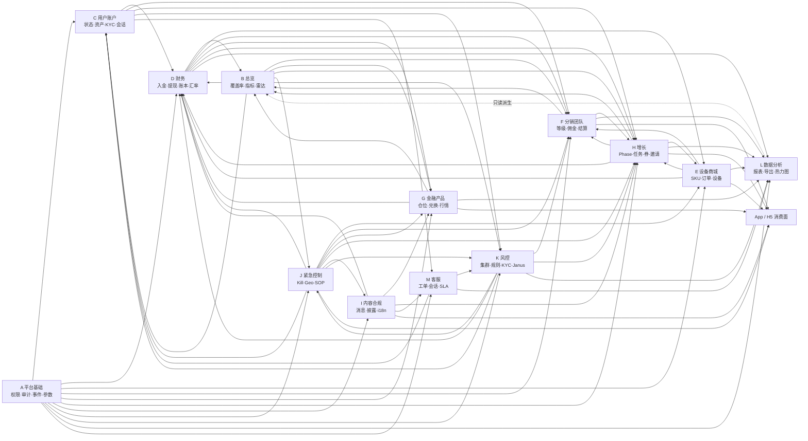
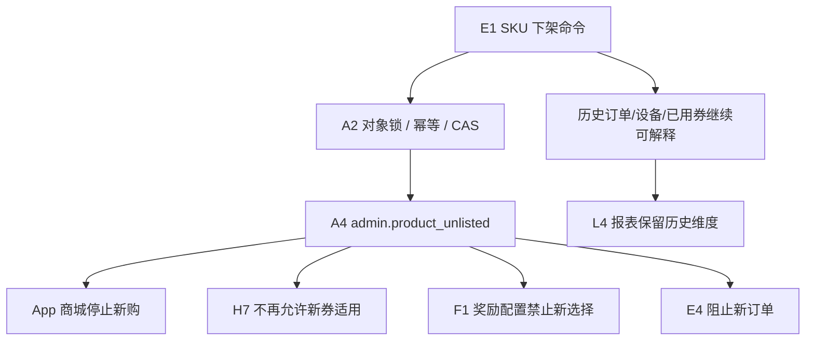

# Nexion 跨域影响图 v1.0

> **现行裁决(2026-08-07)**:全项目已取消 KYC、钱包配对、C4 与 K5；本文相关旧字段、门禁、用例、权限或流程仅保留为历史基线，不得作为现行实现、运营或验收依据。

> 状态：Change Impact Baseline
>
> 编制日期：2026-08-04

## 1. CAPABILITY

本文件回答“改动一个业务对象，会影响哪些后台模块、后端消费者、App 页面、账本、审计和验收范围”。它用于需求评审、缺陷修复、配置发布和回滚前的影响扩圈，避免只修当前页面而遗漏下游。

## 2. CONSTRAINTS

- 跨域传递使用 canonical ID、版本和 schema revision，不用展示名称关联。
- 业务写、审计和必要 outbox 处于可靠提交边界；消费者可重放且幂等。
- 派生域只能读取，不反向覆盖 Owner 域。
- 依赖失败时失败关闭；不得回退 mock、旧缓存或兄弟模块默认值。
- 变更触及共享配置、权限、事件 schema、账本或 App 公共投影时，验收范围自动扩到所有消费者。
- 回滚创建新版本、补偿命令或反向账本，不覆盖历史事实。

## 3. 域级全景图

箭头表示“源域事实或守卫会影响目标域”，不是目标域可以反写源域。L 和大部分 B 页面是读模型，不能成为业务状态 Owner。

## 4. 关键对象影响清单

| 影响 ID | Owner/对象 | 直接消费者 | 间接消费者 | 变更或失败时必须验证 |
|---|---|---|---|---|
| IMP-001 | A1/A6/A7/A8 RBAC | 全部 PC API、菜单、页面 | 验收账号、审计取证 | 旧 session 撤销、菜单等集、直接 URL/API 403、数据范围 |
| IMP-002 | A2 操作确认/执行门槛 | C3、D、E、F、H、I、J、K、L | A4、对象锁、幂等记录 | 发起/执行身份、对象锁、同键重放、失败审计、锁清理 |
| IMP-003 | A3/A5 共享配置 | 所有配置消费者 | B/L 指标、App 公共投影 | 版本、Owner、影响预览、旧实例策略、恢复值 |
| IMP-004 | A4 事件 schema/outbox | 全事件消费者 | B/L/K/J 投影 | revision 兼容、重放、死信、消费回执、无重复副作用 |
| IMP-005 | B1 覆盖率/红线 | C3、D2/D5、F、G、H8、J1 恢复、K5 通过 | B2/L3、告警 | 变更前后快照、守卫失败关闭、资金动作无部分执行 |
| IMP-006 | C2 账户冻结/解冻 | D2、G2、H2/H8、K、M | App 登录后能力、L 用户口径 | 各消费者同步受限/恢复，余额订单不删除，CAS 冲突 |
| IMP-007 | C3 资产调整 | D4 钱包账本、B1 | F1 累计口径、L3 报表 | 原子入账、冲正、幂等、覆盖率、审计/outbox |
| IMP-008 | C4 KYC 状态 | D2、G1/G2、I5 门禁、K5 | M 工单、L5 监管报告、App | K5 触发不提前改态、裁决条件回写、资金门禁 |
| IMP-009 | D1 真实入金/cumulativeDeposit | C1、F1、B1、D4 | H8 资格、L1/L3 | intent/回单/钱包/累计入金/账本原子；退款拒付回冲 |
| IMP-010 | D2 提现状态 | C 画像、K3/K4/K5、D4 | B1/B2、L3、App tracking | 12 状态迁移、链上异常、退款补偿、风险门禁 |
| IMP-011 | D4 账本 | B1/B2、C3、D/L 报表 | F/G/H 奖励与财务对账 | 不可变、借贷闭合、业务 ID 唯一、冲正新事件 |
| IMP-012 | D6 汇率/quoteVersion | D1、E4、G2 | B/L 报表、App 金额展示 | 旧交易锁价不变、新交易新版本、时区/精度 |
| IMP-013 | E1 SKU 上下架/删除 | E4 订单、H7 适用券、F1 奖励 SKU | E3 Trade-in、App 商城、L4 | 下架阻止新购、历史引用保留、关联保护、事件消费 |
| IMP-014 | E4 订单 | D4、E3 设备、H7 券 | F 业绩/佣金、B/L、App | 支付/交付/退款/库存/券/设备同一闭环 |
| IMP-015 | E3 设备生命周期 | App 设备页、E2/E5 | L4、B 指标、Trade-in | 归属、状态单向、回收恢复、在线事实不由 App 伪造 |
| IMP-016 | F1 V-Rank | F2/F4/F5、App 团队 | H 奖励、L 指标 | 逐阶、永久保护配置、奖励一次、退款输入口径 |
| IMP-017 | F5 佣金事件 | D4、C 资产、App 钱包 | B/L、用户佣金处置 | cooling/unlocked/withdrawn/reversed/frozen、补发新事件 |
| IMP-018 | G1/G7 仓位 | D4、B1、App | L3、I5 门禁 | 锁定、领取、提前退出、罚没、Kill 竞态、幂等 |
| IMP-019 | G3 行情/价格点 | G2、B/L、App | D6 估值、K4 | 引擎状态与价格值分离，暂停/恢复，旧价格不改 |
| IMP-020 | H1 Phase/dial | B4、D5、F3、G7、H2/H3/H8 | App 节奏和奖励展示、L | 单一写源、版本、运行实例边界、消费者同版本 |
| IMP-021 | H7 代金券 | E1 SKU、E4 订单、App | F1/H 活动、L | active/paused、AVAILABLE/USED/REVOKED、订单原子折扣 |
| IMP-022 | H8 邀请 settlement | D4、B1、K1/K2 | C/F/L、App | 风险过滤、配置快照、双方钱包、唯一结算、整批回滚 |
| IMP-023 | I3 消息 Campaign | Nova 通道、用户通知偏好 | J 告警、K5、M | 已发送事实、取消未发送部分、频控、重试去重 |
| IMP-024 | I5 披露版本/ack | D2、G1/G2、App | K5、L5 监管证据 | 版本绑定、stale、重新确认、辖区门禁 |
| IMP-025 | I6 i18n 发布 | PC、App、M5、通知模板 | 商店文案、验收快照 | zh/en/vi 占位符等集、禁词、fallback、版本 |
| IMP-026 | J1 Kill-Switch | C/D/E/F/G/H/I/K、App | B/L、客服告警 | 关停优先、恢复守卫、5 闸消费者、无旧缓存绕过 |
| IMP-027 | J2 Geo-block | 登录、支付、内容、Janus | App 路由、L 辖区报表 | blocked/limited、边缘源、旧页面并发、失败关闭 |
| IMP-028 | J4 Playbook | 所有目标域 | A2/A4、B/L、外部依赖 | 版本、全局锁、步骤证据、PARTIAL、补偿、回滚原子性 |
| IMP-029 | K1/K2 风险处置 | C2、D2、H8、F4 | J/B/L、App | 信号与处分分离、簇终态、冻结联动、释放不删证据 |
| IMP-030 | K3/K4/K5 | D2、C4 | B5、L、M 告警 | provider 失败关闭、分数版本、KYC 合并工单、CAS |
| IMP-031 | K6 Janus 策略/命令 | App 原生壳/设备 ACK | J2 地区、A4、L | reported/desired/command 分离、目标目录、过期、ACK |
| IMP-032 | L3/L5 导出 | MinIO、A2、I5 辖区 | 审计/监管交付 | 生成/批准/READY/下载、脱敏、到期、对象清理 |
| IMP-033 | M2/M3 工单会话 | C 用户、K5、M1/M4 | L 客服指标、I3 通知 | 状态/CAS、队列范围、SLA、转交、关闭/重开历史 |

## 5. 典型变更扩圈

### 5.1 SKU 下架

最小回归：E1、E4、H7、F1、App 商城、A2/A4、L4。若删除而非下架，再增加关联完整性、软删除和恢复策略验证。

### 5.2 提现参数或风控规则变更

最小回归：D5/K3 → D2 新请求 → K4 分数/K5 KYC → B1 覆盖率 → D4 账本 → App 提现资格与 tracking → L3。运行中提现是否使用旧快照必须按合同明确，不得混用。

### 5.3 H1 倍率变更

最小回归：H1 版本、B4 镜像、H3 任务、H8 邀请、G7 复投、F3 结算、App 展示、A2/A4。已开始实例按状态机 `OPEN-005` 裁决处理。

### 5.4 K1 冻结与释放

最小回归：K1 incident、C2 账户、D2 提现、H8 邀请、K2 信号、B5/L 风险投影、App 受限反馈。释放不得删除 incident，也不得自动补发冻结期奖励。

### 5.5 I5 披露发布

最小回归：I5 版本和辖区、用户 ack stale、App 重新确认、D2/G1/G2 门禁、I3 通知、L5 监管证据。旧确认不得自动迁移到新版本。

## 6. 变更分级与最低回归范围

| 级别 | 条件 | 最低回归 |
|---|---|---|
| T0 全局 | RBAC、A2/A4、B1、J1/J4、账本公共合同 | A–M 75 模块导航/权限终验 + 所有直接消费者 |
| T1 跨资金/身份 | 余额、支付、提现、KYC、风控、奖励、订单 | Owner 全模块 + 所有直接/间接消费者 + App |
| T2 跨域配置 | H1、SKU、i18n、披露、汇率、Janus 目标 | Owner + 直接消费者 + 版本/缓存/回滚 |
| T3 域内状态 | 工单、内容、设备单对象、普通配置 | 整个模块 + A2/A4 + 相邻状态消费者 |
| T4 纯展示 | 布局、文案且不改业务含义 | 当前页面、响应式、多语言、可访问性 |

## 7. 变更闭环清单

每个需求、缺陷或配置变更必须回答：

1. 谁是唯一 Owner？canonical ID、状态和版本是什么？
2. 哪些同步调用、事件消费者、定时任务、报表和 App 页面读取它？
3. 失败时是回滚、重试、对账、补偿还是人工接管？
4. 幂等键、CAS、账本、审计和 outbox 的边界在哪里？
5. 旧对象、运行中实例和历史报表使用旧版本还是新版本？
6. Kill、Geo、KYC、风险、B1 和披露门禁谁优先？
7. 回滚是否会覆盖历史事实？若会，方案不通过。
8. 最小回归范围是否按 T0–T4 扩圈？
9. 测试夹具和全局锁如何恢复？

## 8. NON-GOALS / OPEN QUESTIONS

- 本图不替代代码级调用图；它描述业务责任和验收边界。
- `OPEN-001` 审批拓扑、`OPEN-003` 订单过期、`OPEN-005` Trial 配置和 `OPEN-007` D1 待退回 Owner 裁决后，需要更新相应影响链。
- 外部 PSP、银行、链节点、消息提供商和 Apple/Google 审核属于外部依赖，具体 SLA 在 SOP 与合规材料中定义。

## 9. HANDOFF

需求单和缺陷台账至少填写一个 `IMP-*` 和一个变更级别。没有影响 ID 的跨域改动不得直接进入开发；无法判断 Owner 时先回到状态机总表裁决。
