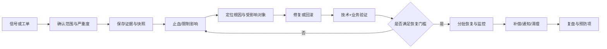

# NEXION 运营与故障 SOP v1

> **现行裁决(2026-08-07)**:全项目已取消 KYC、钱包配对、C4 与 K5；本文相关旧字段、门禁、用例、权限或流程仅保留为历史基线，不得作为现行实现、运营或验收依据。

> 目标：把“发现异常”闭环到止血、恢复、补偿、验证、复盘与防复发。本文不绑定页面选择器或某台服务器，可在底层改造期间稳定复用。
> 范围：发布/回滚、充值、提现、设备、客服、内容配置、第三方依赖、安全与隐私事件。
> 原则：先保护用户资产和证据，再恢复服务；未知结果不当失败处理；恢复放开必须比止血更谨慎。

## 1. 统一事件机制

### 1.1 严重度

| 级别 | 判定 | 首响目标 | 升级 | 示例 |
|---|---|---|---|---|
| SEV-0 | 资产持续错误增减、密钥泄露、全站不可用、正在发生的数据外泄或监管要求立即处置 | 5 分钟 | 立即通知 Incident Commander（IC）、技术/安全/业务负责人 | 账本重复入账、提现被绕过、管理员令牌泄露 |
| SEV-1 | 核心能力大面积不可用或结果未知，存在资产/合规风险但已止血 | 10 分钟 | 15 分钟内建战情组 | 登录大面积失败、提现队列停滞、KYC 全部失败 |
| SEV-2 | 单域明显退化，有替代路径或只影响部分用户 | 30 分钟 | 业务 Owner + 当班工程 | 推送延迟、某 SKU 无法下单 |
| SEV-3 | 低影响缺陷、文案/展示偏差、单用户可恢复问题 | 1 个工作日 | 正常缺陷队列 | 列表错位、非关键翻译错误 |

计时从第一条可信信号开始。SLA 目标需管理层确认，本文数值是运营基线而非法定承诺。

### 1.2 角色

| 角色 | 唯一职责 |
|---|---|
| IC | 决定严重度、止血范围、恢复门槛和对外节奏；不亲自沉入排障细节 |
| 技术负责人 | 建立时间线、定位变更/依赖、执行技术修复与验证 |
| 业务 Owner | 判断业务正确性、受影响对象、补偿与跨域影响 |
| 安全/隐私负责人 | 处理凭据、攻击、个人数据、取证、通知与监管路径 |
| 客服负责人 | 统一用户话术、工单标签、受影响名单和主动通知 |
| 记录员 | 记录每个判断、动作、证据、操作者、时间、结果和待办 |

一人可兼任多个角色，但 SEV-0/1 至少由 IC 与执行人两人协作。高敏 PC 动作仍按权限矩阵执行；止血动作可由授权角色单人确认并立即生效，恢复/解封仅按更高权限和前置指标执行。

### 1.3 统一闭环

所有事件必须有：`INC-YYYYMMDD-NNN`、开始/发现/止血/恢复时间、影响对象查询、操作理由、A2 审计或命令证据、指标截图/查询、用户话术版本、复盘 Owner 与到期日。

## 2. 通用动作规则

### 2.1 止血前的最小证据

- 当前版本：PC Build ID、App version/build、后端 commit/JAR hash、数据库 migration 版本、配置版本。
- 当前状态：核心指标、错误率、队列深度、受影响对象样本、最近 30 分钟高敏审计和部署/配置变更。
- 请求链：request/trace ID、幂等键、业务单号、外部渠道引用；秘密字段先脱敏。
- 数据快照：只读查询结果和时间点；禁止为“重试”先改状态或删幂等记录。

### 2.2 结果未知铁律

超时、断网或 5xx 只说明客户端未收到可信终态，不等于服务端未执行。处理顺序：

1. 以业务单号/幂等键查内部权威记录；
2. 查 outbox/消费者/支付、银行或链上渠道状态；
3. 若仍未知，标记 `RESULT_UNKNOWN` 并阻止同意图重复写；
4. 由对账/补偿流程决定继续、回滚或人工复核；
5. 用户侧显示“结果待确认”，给查询入口，不显示“失败请重试”。

### 2.3 恢复门槛

- 根因已解释所有主要信号，或已有安全可控的临时绕行；“重启后好了”不够。
- 定向合同、类型/单测、关键 E2E 与真实依赖检查通过。
- 受影响数据已分类：正确、可自动补偿、需人工复核、无法判断。
- 恢复动作不会绕过 B1 覆盖率、KYC、风险披露、地域、权限、幂等/CAS 等硬闸。
- 分批恢复有观察窗和自动回退阈值；恢复后 A2/A4/告警链完整。

## 3. SOP-01 发布与回滚

### 触发

计划发布、紧急修复、配置/schema/SDK 变更，或上线后关键指标越界。

### 发布前

1. 冻结候选并记录三端 commit/dirty、构建 ID、JAR/包 hash、迁移和配置 diff。
2. 从跨域影响图确定 T0–T4 回归范围；公共 BFF、认证、账本、事件 schema 默认扩大一档。
3. 数据迁移必须向前兼容旧应用/旧服务；不可逆迁移先完成备份与恢复演练。
4. 验证登录、侧栏、核心读写、401/403、幂等、审计/outbox、监控和回滚包。
5. 明确上线 Owner、观察指标、暂停阈值、回滚决策人和用户通知草稿。

### 执行

1. 低风险窗口开始，先灰度内部/小流量；逐步放量。
2. 每阶段核对错误率、延迟、业务成功率、账本差异、队列积压和客户端版本分布。
3. 任一资产一致性、权限绕过、schema 不兼容信号立即暂停并按 SEV-0/1 处理。

### 回滚

1. 先阻止新写入或切安全降级，不在持续写入时盲目回滚 schema。
2. 回滚应用/配置到已锁定版本；数据库按演练方案前滚修复或兼容回退，禁止手工删生产记录。
3. 清理/重放 outbox 前先按业务键去重；逐条证明不会重复入账或通知。
4. 重新执行发布门禁的完整锁定范围，再分批恢复。

### 完成证明

版本一致、观察窗无越界、业务对账为零差异或有已批准差异单、回滚能力仍可用、变更记录和用户影响结论已归档。

## 4. SOP-02 充值未到账/重复到账

### 分诊字段

用户号、资产/网络、金额、内部充值单号、渠道/银行引用、交易哈希、发起时间、显示状态；禁止索要密码、私钥、助记词或完整卡号。

### 处理

1. 查内部充值单、账本、渠道/链上终态、确认数、outbox 与入账消费者。
2. **外部未成功**：说明渠道状态与下一步，不做内部补账。
3. **外部成功、内部无单**：建立异常单，按唯一外部引用创建/恢复处理；禁止直接改余额。
4. **内部有单、未入账**：检查状态机与事件消费，使用受控补偿/重放，幂等键沿用原业务意图。
5. **重复到账**：立即暂停同来源自动入账，锁定重复记录证据；通过正式资产调整流程纠正，不直接 SQL 扣余额。
6. 对同窗口同渠道批量检索，确认是否系统性事件并升级严重度。

### 验证

外部金额 = 充值单 = 账本分录 = 用户可用余额变化；A2/A4 可追溯；同引用重放不再变余额；用户收到一致终态。

## 5. SOP-03 提现卡住/重复提交/错付风险

### 立即动作

1. 若出现错付、绕过审核、重复出款或账本失配，立即暂停相关资产/网络提现；保存队列与覆盖率快照。
2. 若只是单笔超时，不扩大为全局停机；先将单笔置于结果待确认路径并防重复。

### 分阶段处理

| 权威阶段 | 检查 | 可执行动作 |
|---|---|---|
| 待审核 | KYC、披露、地域、风险、额度、余额冻结 | 补资料、人工复核、拒绝并解冻；不得绕闸批准 |
| 已批准待执行 | 账本预留、幂等键、队列/outbox | 恢复消费者或受控重放；同键不产生第二笔 |
| 渠道处理中 | 渠道引用、链上广播、结果查询 | 等待/轮询；未知时禁止再次出款 |
| 已完成 | 渠道终态、账本结算、用户状态 | 对账；不允许回到处理中 |
| 失败/取消 | 明确失败证据、余额释放 | 幂等释放预留；用户重新发起必须是新意图/新键 |

### 恢复

对受影响队列先离线分类，再小批恢复；每批核对覆盖率、成功率、重复引用、账本差异和失败原因分布。全量恢复须超管授权并满足 B1 红线。

## 6. SOP-04 设备解绑/离线/能力校准异常

1. 区分登录设备、收益设备、库存设备；不要因“手机离线”误解绑业务设备。
2. 核对用户号、设备业务 ID、安装 deviceId、最近心跳、任务/订单/试用/以旧换新占用和解绑状态机。
3. 运行中任务不可强制无证据解绑；先停止新任务，等待/终止当前任务并结算，再进入解绑。
4. 新设备重校准异常时保存原 baseline、信号来源、App 版本和计算版本；不得手工把分数改到预期值。
5. 若设备型号/能力信号不可读，执行 fail-low 或明确降级，不能默认旗舰值；客户端信号不能作为唯一反作弊裁决。
6. 解绑后核对库存归属、任务停止、收益停止、试用/订单关系、会话是否独立保留，以及事件/审计。

用户话术必须区分“设备解绑”“登录会话撤销”“账户冻结”，不能互相替代。

## 7. SOP-05 客服升级与跨域转单

### L1 首次受理

1. 记录用户可提供的业务编号、时间、现象、截图和已尝试动作；不让用户重复提交资金动作。
2. 用固定标签分流：`AUTH`、`KYC`、`DEPOSIT`、`WITHDRAWAL`、`ORDER`、`DEVICE`、`REFERRAL`、`RISK_APPEAL`、`PRIVACY`、`SECURITY`。
3. 明确下一次更新时间；未知就说未知，不承诺审核/到账结果。

### 升级规则

| 类型 | 目标域 | 必带证据 | 客服禁止动作 |
|---|---|---|---|
| 登录/会话/MFA | C5/A | 会话号、设备名、错误时间/码 | 索要验证码/恢复码、替用户关闭 MFA |
| KYC | C4/K5 | KYC 单号、状态、供应商引用 | 接收证件到私人渠道、保证通过 |
| 充值/提现 | D/K | 业务单号、资产网络、渠道引用 | 手工改余额、让用户盲目重试 |
| 订单/设备 | E | 订单/SKU/设备 ID、状态时间线 | 删除历史订单、跨状态强改 |
| 风控申诉 | K | 决定号、理由码、用户证据 | 暴露阈值、给犯罪定性 |
| 隐私请求 | 隐私负责人/C | 请求号、地域、请求范围 | 在普通工单附件导出全量数据 |
| 安全事件 | 安全负责人 | 时间、账号、可疑行为；秘密走安全渠道 | 在会话中复制 token/密钥 |

### 完成

目标域写清权威结论、证据引用、可公开说明与后续动作；客服向用户同步同一版本结论，工单关闭理由不得只写“已处理”。

## 8. SOP-06 配置/内容误发布

1. 冻结目标配置/内容的继续编辑，记录当前 published 版本、上一版本、受众、开始时间和操作者审计。
2. 判断影响方向：是否放大资金流出、绕过合规、扩大受众或只是展示错误；前四类按 SEV-0/1。
3. 使用正式回滚/停用动作恢复上一已验证版本，不直接改数据库版本号。
4. 对已经消费旧版本的 App、缓存、推送、活动、订单和事件做影响查询；回滚配置不自动撤销已产生业务事实。
5. 校验三语言、占位符、法域、受众、客户端刷新/重登、A2 审计与 A4 事件。
6. 若内容已对外形成错误承诺，由法务/内容 Owner 决定更正通知与证据保留。

## 9. SOP-07 Kill-Switch / 地域限制启停

### 熔断

授权风险角色/超管选择明确 key、范围、触发依据和理由，保存 before 快照后立即执行；核对各业务 endpoint 服务端实际拒绝、App/PC 解释一致、在途业务按预设策略处理，并实时通知全体超管/运营。

### 恢复

1. 根因与受影响对象已确认，补偿/对账达到恢复门槛。
2. 仅超管执行；涉及资金流出的能力先查 B1 兑付覆盖率和关联风险指标。
3. 小范围/单 key 恢复，禁止“一键全开”；验证真实写路径而非只看开关 UI。
4. 观察窗内出现错误率、账本、风控或地域异常即重新熔断。

地域限制变更还须核对 KYC 法域、IP 推导、缓存、在途订单/提现和用户通知；不能只改列表而漏掉服务端 enforce。

## 10. SOP-08 第三方依赖故障

适用于 KYC、支付/银行、链节点、MinIO、Redis、消息、推送、短信/邮件。

1. 用本方探针和业务样本确认，不只依赖供应商状态页；记录供应商事件号。
2. 切断会产生重复/错账的自动重试，保留带幂等键的待处理任务。
3. 启用明示降级：只读、排队、改用备用渠道或暂时不可用；不得用 mock 成功替代真实结果。
4. 供应商恢复后先查询原请求终态，再决定重放；禁止把所有超时请求当失败重发。
5. 分批清理积压，监控成功率、延迟、重复外部引用、账本差异和用户通知。
6. 复盘供应商 SLA、容量、熔断、备用方案、数据删除与安全通知履约。

## 11. SOP-09 安全或个人数据事件

1. **控制影响**：撤销受影响会话/密钥、隔离入口、冻结可疑高敏动作；不要破坏证据。
2. **保全证据**：时间同步、访问/审计/网络日志、版本与配置、受影响字段和对象；用受限存储并计算 hash。
3. **定界**：数据类别、人数/地域、是否可识别、是否被读取/改写/导出、攻击持续时间和第三方涉及情况。
4. **修复**：关闭根因、轮换秘密、补权限/输入/依赖缺陷，验证其他相同模式。
5. **通知决策**：由安全与法务依据适用法律/合同判断监管、用户、商店和合作方通知内容及时限；不得由工程自行承诺“无影响”。
6. **恢复与监控**：分批开放，监控账户接管、异常提现、数据下载和相同 IOC。
7. **长期项**：删除暴露数据副本、供应商追责、DPIA/威胁模型更新、测试与告警固化。

## 12. SOP-10 监控误报/漏报与数据口径异常

1. 区分“产品坏了”和“测量坏了”：用业务表/真实请求交叉核验，不用同一数据源自证。
2. 若指标可能掩盖资产/安全问题，按真实故障上调严重度，先采用保守止血。
3. 找到事件 schema、采集、传输、消费、聚合、时区、去重或看板中的断点。
4. 修复后回放一小段有界事件；先证明幂等，再扩大，不污染权威业务账本。
5. 修正历史报表须标注重算区间、算法版本和影响，不静默改历史数字。

## 13. 对外沟通模板

### 首次通知

> 我们在 `{发现时间/时区}` 发现 `{能力}` 出现异常，可能影响 `{用户可感知范围}`。我们已采取 `{止血动作}`，正在确认受影响记录。请勿重复 `{资金/高敏动作}`；下一次更新时间为 `{时间}`。

### 恢复通知

> `{能力}` 已于 `{恢复时间/时区}` 恢复。我们已核对 `{验证范围}`；涉及个别记录的用户将通过 `{渠道}` 收到处理结果。若你的 `{业务单号}` 状态仍异常，请通过 `{入口}` 联系并提供业务单号，不要提供密码、验证码或私钥。

不得在定界前使用“无人受影响”“数据绝对安全”“资金一定到账”等表述。

## 14. 复盘与关闭门禁

- [ ] 事件时间线包含发现前最后正常点、所有高敏动作和恢复观察窗。
- [ ] 根因使用可证伪的因果链，不以“人为失误”作为终点。
- [ ] 受影响对象由可重复查询生成，并完成对账/补偿/用户通知。
- [ ] 临时止血有撤销条件和 Owner，不成为永久隐藏配置。
- [ ] 修复含同类模式横向扫描、合同/单测/E2E、监控和演练。
- [ ] 每个行动项有 Owner、截止日期、验证方式和逾期升级人。
- [ ] A2/A4、工单、证据、清理与隐私保存期一致。
- [ ] IC 明确签发关闭；“错误率下降”本身不等于事件结束。

## 15. 待决问题

| ID | 必须确定 | Owner |
|---|---|---|
| SOP-OQ-01 | 7×24 当班表、IC/安全/法务/客服升级联系方式 | 管理层 |
| SOP-OQ-02 | 各严重度正式首响、更新、恢复和复盘 SLA | 运营/技术 |
| SOP-OQ-03 | 生产发布灰度比例、观察窗与自动回退阈值 | SRE/架构 |
| SOP-OQ-04 | 各资金渠道、KYC、链节点、推送供应商状态页与事件接口 | 采购/各域 |
| SOP-OQ-05 | 用户补偿权限、预算、账务科目和审批边界 | 财务/法务 |
| SOP-OQ-06 | 个人数据/安全事件适用法域的通知时限与模板 | 法务/安全 |
