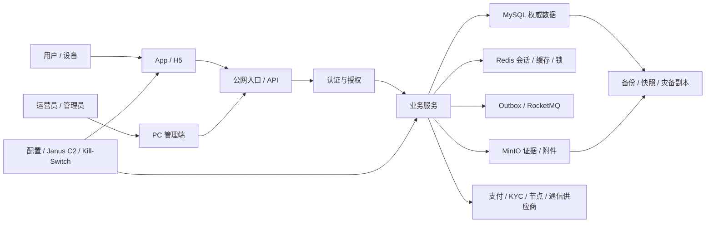

# NEXION 威胁模型与滥用案例库 v1

> **现行裁决(2026-08-07)**:全项目已取消 KYC、钱包配对、C4 与 K5；本文相关旧字段、门禁、用例、权限或流程仅保留为历史基线，不得作为现行实现、运营或验收依据。

> 文档状态：安全设计与验收基线  
> 范围：App/H5、PC 管理端、后端、MySQL、Redis、MinIO、RocketMQ/outbox、供应商、钱包/支付、远程配置与运维。  
> 方法：以资产和信任边界为起点，结合 STRIDE、业务滥用、墨菲定律与“结果未知”场景；“已有控制”只表示代码/文档存在该意图，必须以当前候选测试证明。

## 1. 安全目标与资产

| 资产 | 安全目标 | 最坏后果 |
|---|---|---|
| 用户/管理员身份、会话、MFA | 只有真实主体能以最小权限操作，可快速吊销 | 账号接管、内部越权、批量资产损失 |
| 账本、充值、提现、支付、订单 | 完整、精确、幂等、可对账、结果未知不重复 | 重复扣款/转账、负余额、资金丢失 |
| KYC、证件、生物、风险结论 | 最小化、机密、可解释、可申诉、受控保留 | 身份泄露、歧视、误冻、监管事件 |
| 配置、Kill-Switch、Geo、声明 | 真实、版本化、权限分离、快速收紧、安全恢复 | 高风险功能误开、地区违规、审核欺骗 |
| SKU、设备、任务、奖励、佣金 | 资格与交付可证实、无刷量、无虚假收益 | 欺诈、误导营销、资金池失控 |
| 审计、outbox、证据 | 不可抵赖、可关联、秘密过滤、可恢复 | 无法归因、漏通知、泄密、伪造通过 |
| 代码、制品、密钥、供应链 | 可复现、签名、最小访问、秘密不落库/日志 | 后门、制品替换、全系统失陷 |

## 2. 信任边界

每条箭头都是不可信输入边界；即使来源是内部服务、缓存、管理员或供应商，也必须鉴权、校验 schema、限制作用域、记录版本并处理重复/乱序/超时。

## 3. 攻击者与假设

- 未认证外部攻击者、撞库/自动化机器人、恶意注册者、多账号套利者。
- 被接管的普通用户、越权客服/运营员、恶意或被入侵的管理员/服务账号。
- 被入侵或失误的供应商、SDK、CI/CD、依赖包、对象存储或消息消费者。
- 知道业务规则并利用并发、精度、时区、重试、退款、链重组和状态不一致的人。
- 误配置、网络分区、时钟漂移、容量耗尽与人的错误视为必然发生，不依赖“没人会这么做”。

## 4. 威胁与滥用案例

严重度：P0 可导致批量资产/身份/合规灾难；P1 重大单体或广泛业务；P2 有限影响；P3 纵深防御。残余风险在控制实测前均不得写“低”。

### 4.1 身份、会话与权限

| ID | 威胁/滥用 | 攻击路径 | 必需控制 | 验证 | P/Owner |
|---|---|---|---|---|---|
| THR-001 | 撞库接管用户 | 批量用户名/密码尝试 | 强哈希、账号+IP+设备限速、分级锁、异常通知、MFA | 分布式低速撞库与锁定恢复 | P0/Auth |
| THR-002 | OTP 爆破/短信轰炸 | 重放、并发请求、猜码 | 单用途、短 TTL、一次性、计数原子、发送/验证双限速 | 并发 100 次、旧码、跨用途复用 | P1/Auth |
| THR-003 | Refresh Token 复用 | 窃取旧 Token 后并发兑换 | Token 族轮换、复用即全族吊销、设备通知 | 新旧 Token 同时兑换 | P0/Auth |
| THR-004 | 管理员禁用后旧会话继续有效 | 只改账号状态不撤 Token/缓存 | 即时吊销、权限缓存失效、每次高风险写检查状态 | 禁用前 Token 访问菜单/API/数据 | P0/平台 |
| THR-005 | MFA 降级/恢复被社工 | 客服凭截图关闭 MFA | 强验证、恢复冷却、双人复核候选、全会话通知 | 冒充用户请求恢复 | P0/Security |
| THR-006 | IDOR/BOLA | 改 userId/orderNo/ticketNo 读取或写他人对象 | 服务端主体/数据作用域校验、不可猜业务号不是防线 | 横向遍历所有对象 API | P0/各域 |
| THR-007 | 隐藏菜单但直接 API 越权 | 低权限角色调用写接口 | 菜单/路由/按钮/API/数据五层 RBAC，默认拒绝 | 角色矩阵 401/403/404/数据越界 | P0/平台 |
| THR-008 | 角色提升/权限缓存脏读 | 修改角色后缓存仍保留旧授权 | 权限版本、缓存失效、关键写实时检查、审计 | 授权/撤权并发与多实例 | P0/平台 |
| THR-009 | CSRF/跨站写操作 | Cookie 会话被恶意站点利用 | SameSite/Secure/HttpOnly、Origin/CSRF 验证、无 GET 写 | 跨站表单/fetch 与缺 Token | P1/前后端 |
| THR-010 | XSS 窃取会话/代操作 | 工单、内容、昵称、富文本注入 | 输出编码、HTML 白名单、CSP、HttpOnly、上传隔离 | 存储/反射/DOM XSS 语料 | P0/内容 |

### 4.2 API、输入、文件与秘密

| ID | 威胁/滥用 | 攻击路径 | 必需控制 | 验证 | P/Owner |
|---|---|---|---|---|---|
| THR-011 | SQL/查询注入 | 搜索、导出、排序、JSON 拼接到 SQL | 参数化、排序/列白名单、最小 DB 权限 | 注入语料、二阶注入 | P0/后端 |
| THR-012 | 批量赋值越权 | 请求体注入 status/role/balance/userId | 专用 DTO、字段白名单、服务端派生 | 添加隐藏字段与未知字段 | P0/后端 |
| THR-013 | 畸形 200 被当成功 | 供应商/后端缺字段、错类型、未知枚举 | 响应 schema、业务不变量、失败关闭、隔离 | 200 空体/HTML/错精度/未知状态 | P0/全域 |
| THR-014 | 错误信息泄密 | 返回堆栈、SQL、内部路径、供应商原文 | 用户错误码与内部错误分层、trace ID、日志脱敏 | 触发 4xx/5xx 并扫描响应 | P1/后端 |
| THR-015 | 文件上传恶意内容 | 双扩展、伪 MIME、超大文件、SVG/HTML、压缩炸弹 | 大小/类型/扩展/内容检测、随机对象名、隔离域、不可执行 | 绕过语料与下载 Content-Disposition | P1/内容 |
| THR-016 | SSRF/开放重定向 | 头像、回调、checkout URL、Webhook 由用户控制 | 域名/协议白名单、DNS/IP 重绑定防护、禁止内网、签名回调 | 127.0.0.1、metadata、重绑定 | P0/后端 |
| THR-017 | 秘密硬编码/落日志 | 配置、仓库、trace、raw callback 含凭证 | 密钥管理、扫描、轮换、日志过滤、最小权限 | 仓库/制品/日志/历史扫描 | P0/Security |
| THR-018 | CORS/安全头放宽 | 任意 Origin 携带凭证、无 CSP/frame 防护 | 精确 Origin、HTTPS、CSP、frame-ancestors、HSTS | 预检/凭证/嵌入测试 | P1/平台 |

### 4.3 资金、支付、账本与链上

| ID | 威胁/滥用 | 攻击路径 | 必需控制 | 验证 | P/Owner |
|---|---|---|---|---|---|
| THR-019 | 重复支付/重复入账 | 回调重放、用户重复提交、消费者重复 | 业务唯一键、Webhook event 幂等、账本唯一约束、对账 | 同载荷/不同载荷幂等键、重复回调 | P0/财务 |
| THR-020 | 结果未知导致重复提现 | 超时后自动重试/客服建议再提 | 意图 ID、权威查询、状态 UNKNOWN、冻结重复广播 | 断网发生在供应商已接收之后 | P0/财务 |
| THR-021 | 负余额/并发双花 | 两请求同时读余额再扣 | DB 原子条件更新/锁、账本事务、精度约束 | 并发 N 笔刚好/超过余额 | P0/财务 |
| THR-022 | 金额/费用精度套利 | float、舍入方向、币种小数混用 | Decimal、资产 scale、明确舍入、前后端同公式/服务端权威 | 边界小数、极值、多币种 | P0/财务 |
| THR-023 | Webhook 伪造/重放 | 猜地址、旧签名、时间窗无限 | 签名、时间/nonce、密钥轮换、IP 不是唯一控制、权威查询 | 篡改、旧事件、乱序、双密钥窗口 | P0/支付 |
| THR-024 | 充值假确认/链重组 | 0 确认、错误网络、重组后仍入账 | 网络/资产/地址校验、确认策略、重组处理、账本补偿 | 测试网/同 hash 异链/重组 | P0/财务 |
| THR-025 | 提现地址被替换 | XSS、账号接管、客服改绑、剪贴板欺骗 | 强认证、地址白名单/冷却、完整确认页、进行中意图不可变 | 换绑后旧/新意图、Unicode 地址显示 | P0/财务 |
| THR-026 | 风控决定与提现错配 | 使用旧 decisionId 或他人决定 | 绑定 user/biz/amount/版本/TTL，提交时再校验 | 重用/换金额/换地址/过期决定 | P0/风控 |
| THR-027 | 账本与业务表双写部分成功 | 订单成功但账本失败，或反之 | 同事务/事务 outbox、补偿、每日对账 | DB/消息/依赖逐点失败 | P0/财务 |
| THR-028 | 退款/拒付后奖励不回滚 | 先发等级/佣金后支付逆转 | 事件化负向事实、负债追踪、规则版本、对账 | 退款、部分退款、拒付、已花奖励 | P0/财务/增长 |
| THR-029 | 行情/预言机操纵 | 单源、过期价、配置人为曲线 | 合格多源、时间戳、偏差/熔断、不可人工造价、审计 | 源分叉、过期、极端跳变 | P0/金融产品 |
| THR-030 | 私钥/签名基础设施失陷 | 单人导出、热钱包过大、盲签 | HSM/MPC、阈值签名、额度、地址策略、职责分离、应急迁移 | 密钥轮换/灾备/拒签演练 | P0/Security/财务 |

### 4.4 KYC、隐私、设备与业务滥用

| ID | 威胁/滥用 | 攻击路径 | 必需控制 | 验证 | P/Owner |
|---|---|---|---|---|---|
| THR-031 | KYC 证件/生物数据泄露 | 原件进工单、日志、对象公开 URL、供应商滥用 | 供应商最小化、受控引用、加密、字段权限、删除回执 | 导出/日志/对象 ACL/删除 E2E | P0/KYC |
| THR-032 | KYC 双权威绕过 | 改 `nx_user.kyc_status` 绕过 profile | `nx_kyc_profile` 唯一权威、投影一致性、状态机 CAS | 两表冲突与未知状态 | P0/KYC |
| THR-033 | 自动风控歧视/不可申诉 | 国家/设备/代理变量造成不利决定 | 目的限定、特征审查、分群误差、原因码、人工复核 | 分群回放和申诉闭环 | P1/风控/隐私 |
| THR-034 | 持久设备指纹违规拼接 | IMEI/广告 ID/指纹与身份跨模式关联 | 最小/可重置标识、同意、用途隔离、删除、商店申报 | SDK/网络抓包/删除后重识别 | P0/App/隐私 |
| THR-035 | 多账号/设备伪造刷奖励 | 模拟器、重置 ID、推荐环、并发领取 | 服务端资格、设备/账号/支付图谱、预算上限、人工申诉 | 环形推荐、同设备多号、竞态 | P1/增长 |
| THR-036 | 虚假在线/算力遥测 | 客户端伪造心跳/TOPS/任务完成 | 服务端挑战/交付回执、反重放、合理性校验、非权威展示 | 改包、加速时钟、重放心跳 | P1/设备 |
| THR-037 | 库存/限量虚假或超卖 | 客户端库存、并发预留、失败不释放 | DB 原子预留、订单超时补偿、权威库存、审计 | 最后一件并发、支付超时 | P1/商城 |
| THR-038 | 置换导致未结任务/收益丢失 | 强制下架时跨域状态未闭合 | 影响预览、对象锁、结算/补偿、二次确认、全域重跑 | 任务中/广播中/退款中置换 | P0/设备/财务 |
| THR-039 | 客服社工与越权补偿 | 冒充用户、客服看全量数据/直接加钱 | 强认证、数据作用域、补偿额度/审批、字段遮罩、QA | 跨用户查询、超额度、同人审批 | P0/客服 |
| THR-040 | 账号删除只冻结不删除 | 主库标记，SDK/对象/供应商仍保留 | 数据清单、异步删除状态机、合法例外、回执、重试 | 全链路删除与恢复不可见 | P1/隐私 |

### 4.5 管理、配置、消息、供应链与 Janus/C2

| ID | 威胁/滥用 | 攻击路径 | 必需控制 | 验证 | P/Owner |
|---|---|---|---|---|---|
| THR-041 | 并发覆盖配置 | 两管理员基于旧值保存 | CAS/expectedVersion、409、全局锁只限必要单例 | 双运营员并发不同值 | P1/平台 |
| THR-042 | Kill-Switch 被误恢复/永久遗忘 | 布尔值无原因/TTL/方向权限 | 方向型 RBAC、控制对象、告警、到期复核、恢复 maker/checker | 收紧/恢复/过期/角色测试 | P0/应急 |
| THR-043 | Geo 只隐藏 UI | 直接 API、旧 App、供应商仍可处理 | 商店/注册/API/支付/内容/客服多层 Geo，失败关闭 | VPN、旧版本、直接 API、缓存 | P0/法务/平台 |
| THR-044 | Outbox 重复/乱序/丢失 | 重试、消费者宕机、schema 变化 | eventId 去重、对象版本/顺序、schema registry、DLQ、重放 | 重复/乱序/缺口/未知 revision | P0/平台 |
| THR-045 | 审计被篡改或泄密 | 管理员改日志、detailJson 存 Token | 追加写/限制更新、完整性、远端备份、字段过滤、访问审计 | 修改/删除/秘密扫描 | P0/Security |
| THR-046 | 供应商/SDK 扩大数据用途 | SDK 更新新增域名/标识符/训练 | 版本锁、SBOM、网络清单、DPA、变更评审、Kill-Switch | 构建差异、运行抓包、供应商事件 | P0/隐私 |
| THR-047 | CI/CD 或制品被替换 | 依赖投毒、未签名制品、构建机密钥泄露 | 锁文件、依赖审计、最小 CI、制品签名/SBOM、双人发布 | 从 clean checkout 复现与签名校验 | P0/Security |
| THR-048 | Janus/C2 审核后变脸 | 远程开未审金融页面/下载代码 | 功能白名单、签名配置、包内能力清单、商店披露、服务端市场门禁 | 审核/生产配置 diff、旧包、离线失败 | P0/App/法务 |
| THR-049 | C2 配置劫持/回滚攻击 | MITM、旧签名配置、DNS/证书异常 | TLS pinning 评估、配置签名、版本单调、过期、回滚白名单、安全默认；每个 key 绑定功能 ID、客户端最小/最大版本、市场、审批、签名 hash、到期日，服务端拒绝未知 key/value | 篡改、重放旧版本、未知键值、时钟偏差 | P0/App/Security |
| THR-050 | 远程 H5 获取过度原生能力 | JS bridge 暴露设备/文件/钱包/定位 | 最小 bridge、Origin/方法/参数白名单、逐次权限、无秘密返回 | 恶意 Origin、iframe、导航、参数 fuzz | P0/App |
| THR-051 | 任务/在线/设备资源换取加密资产 | 签到、邀请下载、社交分享、持续在线、手机算力触发 NEX/USDT 或可兑换奖励 | 任务×奖励强制矩阵；服务端按商店/市场硬阻断；设备端加密挖矿与商店禁止的任务发币直接移除，不以免责声明/C2/Geo 绕过 | 枚举所有任务、奖励资产、兑换/转让路径、旧 App 和远程内容 | P0/App/增长/法务 |
| THR-052 | 备份泄露、删除未传播或恢复造成状态倒退 | 备份密钥共用、越权恢复、已删除 KYC 被恢复、旧账本覆盖新事实 | 备份/副本清单、独立密钥与最小权限、恢复双人审批、删除保留规则、隔离恢复演练；恢复后重放增量并全量对账 | 备份读取、账号删除后恢复、旧快照恢复、账本/outbox 顺序核对 | P0/平台/隐私/财务 |

## 5. 滥用链与优先防御

### 链 A：账号接管 → 地址换绑 → 提现

`撞库/OTP` → `建立新会话` → `关闭 MFA` → `换绑地址` → `通过旧风险决定` → `提现`。  
必须在每一段独立阻断，且近期改密/MFA/地址变更应提高提现风险；不能只依赖登录成功。

### 链 B：虚假支付 → 奖励/等级 → 退款/拒付

`伪造/重放回调` → `订单成功` → `奖励/佣金/等级发放` → `资产被转出` → `拒付`。  
必须验签、权威查询、延迟高风险奖励、绑定可逆负债，并让负向事件跨域回滚。

### 链 C：配置越权 → 地区开放 → 误导声明

`获取低权限运营账号` → `直接 API 改 Geo/Kill-Switch/价格` → `旧缓存继续宽松` → `App 显示 APY/上所/奖励`。  
必须五层 RBAC、方向权限、CAS、配置 schema、服务端市场门禁和声明 ID，UI 配置不能决定法律准入。

### 链 D：Janus 白壳 → C2 变脸 → H5 Bridge

`白壳获审` → `远程配置切换` → `加载未审 H5` → `调用原生设备/钱包能力`。  
该链属于禁止设计；技术签名无法把审核欺骗变成合规。

## 6. 安全验证门禁

- Secrets：源码、Git 历史、构建制品、日志、trace、错误、对象元数据无密码/Token/私钥/OTP。
- Input：API/文件/富文本/URL/排序/导出使用白名单 schema；SQL 参数化；错误不泄露内部细节。
- AuthN/Z：Token 安全存储、轮换/吊销、MFA、五层 RBAC、对象/数据作用域、CSRF/CORS/CSP。
- Abuse：账号/IP/设备/业务对象分层限速；关键写入预算/限额与异常告警。
- Asset：Decimal、幂等、CAS、事务/outbox、未知结果、链重组、对账和负余额防线。
- Privacy：SDK/域名/字段/跨境/删除真实抓包和端到端验证，不只看隐私政策。
- Supply chain：锁文件、SBOM、漏洞与许可证、制品签名、clean build、生产密钥最小权限。
- Resilience：依赖超时、Redis/MySQL/MinIO/MQ/供应商区域故障、磁盘满、时钟漂移和恢复演练。

## 7. 残余风险与关闭规则

每条 `THR-001`–`THR-052` 必须补充：当前控制证据、缺陷 ID、测试 Run ID、发生概率先验、观测数据、残余影响、风险接受人和到期日。没有实测证据时残余风险至少为“未评估”，不得凭设计文档降为低。

风险只可通过以下方式关闭：消除功能、降低范围、实现并验证控制、转移给经尽调/合同覆盖的供应商，或由有权限的业务/安全/法务负责人限期接受。免责声明、客服解释、隐藏按钮和“概率很低”不构成关闭。
