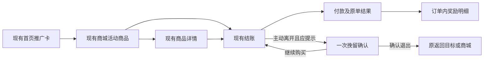

# 现有页面分析与设计接入依据

原接线分析范围为正式APP `nexion-frontend-uniapp/test@e7f471b69d3d12b68ce1328c2bdab9938b1d0304`，当时H5同步来源pin匹配该提交。该提交是历史定位证据，当前实施快照见 [EXECUTION-BASELINE.md](EXECUTION-BASELINE.md)。APP/H5沿当前APP组件与样式接入，历史概念图、独立画板和原型只供业务参考。

证据类型：原源码逐路径阅读；仓内历史截图仅作辅助，部分被里程碑弹窗遮盖，不作为当前页面运行通过证据。正式APP/H5的通过状态以本轮源目录、代码快照及逐页运行截图/操作记录为准；设计原型运行证据不能替代产品运行证据。

| 现有面 | 当前事实 | 本次接入 |
|---|---|---|
| 首页 `src/pages/index/index.vue` | GreetingHeader/TechMoneyCard之后是TrialGhostSlot、手机提醒、home-task-carousel；轮播有新人任务与ConversionBanner；后续为LiveFeed/学习/快捷入口/设备等 | 只在现有轮播增加受活动资格控制的购机广告条目；原快捷入口保持原样，无新快捷网格；不替换资产信息、手机提醒和任务，无活动不占空白 |
| 首页 `src/components/home/conversion-banner.vue` | 现有周任务卡，managed position=`home.conversion-banner`，使用weeklyQuest.snapshot.promoBanner和actionRoute；已有nx-glass-action | 复用展示结构和交互材质，营销读模型独立来自活动服务；不得写成每周任务数据。广告CTA指向带活动上下文的现有商城 |
| 商城 `src/pages/store/store.vue` | 现有商品目录、商品卡以及既有组合入口 | 保留目录，活动上下文提供显式筛选/定位和清除；不能仅靠前端筛选宣称合格 |
| 商品卡 `src/components/store/product-card.vue` | 方形商品图、名称/原商品内容、价格+购买按钮；卡体goDetail，onBuy阻止冒泡进checkout；nx-glass-card实际按共享CSS是扁平内容面 | 在名称/价格相邻区域加入一行赠奖摘要和规则入口；复用现有内容面及按钮，保持原事件语义 |
| 商品详情 `src/pages/store/detail.vue` | 既有商品信息与购买入口 | 追加该SKU实际活动及权益说明；继续进入原checkout，不另造促销详情代替商品详情 |
| 下单 `src/pages/store/checkout.vue` | AppChassis外壳，select-payment/confirm/awaiting/confirmed/activating/live等状态；需区分正式remote分支与遗留模拟分支；不能从文件头注释判断真实支付链 | 现有确认内容加入购机项→赠奖项，实付保持独立；付款前形成服务端快照；结果显示订单与奖励各自状态 |
| 返回 `app-chassis.vue`/`lib/route.ts` | 顶栏经navBack离开，checkout.cancelCheckout也有直接navBack；无已覆盖所有入口的通用离页守卫 | 页面级统一requestLeave意图，接顶栏返回/显式退出/相关路由切换；保持深链fallback和订单读回；不泛改全站返回 |
| 现有票据取消/支付 | 已有票据取消确认和离页保留/恢复能力 | 原交易确认优先；促销文案并入必要确认，不能一串弹两次；不以营销返回销毁活票 |
| 通用确认 `src/components/global-ui.vue` | nx-glass-sheet、确认队列、按钮键盘语义、useDialogA11y | 复用可访问性和弹层能力；如果需调整按钮只对本功能明确适用，不无依据重写全站资金确认 |
| 奖励记录 `src/pages/me/rewards.vue`、`rewards-list.vue` | 原个人中心入口进入奖励类别汇总，分类记录沿 `cat` 参数读取 | 保留优惠券/USDT/NEX，第四类活动奖励进入 `/pages/me/rewards-list?cat=promotion`；旧events奖励页仅兼容包装，复用同一列表，不加平行Me入口 |
| 共享样式 `src/styles/glass-surfaces.css` | nx-glass-action/hero/sheet；静态卡片扁平；交互装饰层按压、reduced-motion/transparency/forced-colors回退 | 沿现有按钮、弹层与内容样式，保持原可访问回退；不为旧稿的材质或坐标改动AppChassis/QuickActionRow |

接入限制需特别保留：原 CanonicalPromoBanner 的 countdownDays/countdownHours 不能替代权威 endsAt/serverTime；新促销必须从活动服务提供真实时间，不能用旧周任务倒计时拼出结束时间。当前APP导航、商品购买和确认按钮的既有表现是复用依据，不要求为旧画板重造材质。

结账确认区当前数量展示为1，详情页的数量也不能假定已经贯通至结账。此次多设备赠礼需同时补齐详情/组合→报价→建单→展示的数量合同；正式能力须由服务端统一校验。

## 主交互链

运行验证必须检查：首页新广告处于原轮播且原快捷入口保持原样；现有商品卡赠奖信息与购买动作可用；原结账显示赠品与实付；退出确认使用真实期限；既有奖励记录第四类别可达。每完成一页保存本页截图并实际操作。常规商品、不合格人群、结束、预算不足、支付未知及可访问回退分别覆盖，不重新创建APP设计画板。

## 文案基线

- 首页：规则确为1台送1台时用“购机赠礼 · 买 A 赠 B”；混合活动用“指定设备购机赠礼”。CTA“查看活动商品”。
- 商品卡：“购买本款，可获赠 B × 1”或“符合条件可返 20 USDT（示例）”；只有资格已确认才省略“符合条件”。
- 下单：“本单活动奖励”；每个购买项下列实际赠品、币量及到账条件，不能写成已到账。
- 未建单退出：“本次选购预计可获赠「B × 1」。活动将于{时间+时区}结束。是否离开下单页？”
- 已建单退出：“本单奖励已预留至{付款截止}。退出后可在订单中继续支付，逾期订单将关闭。”
- 挽留按钮：“继续购买”“确认退出”。两者均可正常聚焦/操作，不能把退出做成不易发现的文字或二次劝留。

所有示例文案应以真实数据插值并同步zh/en/vi；不展示虚假库存、重置倒计时、确定收益或不真实的资格。实际文案及动态分支以PRD P4.3和APP规格为准。
