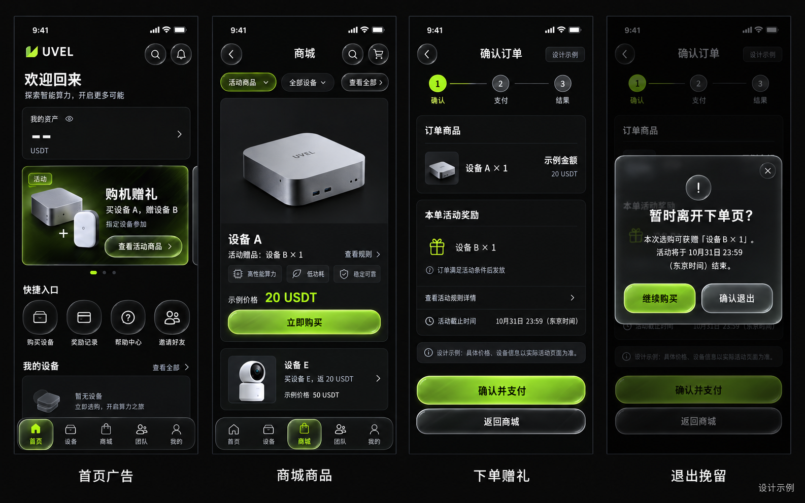
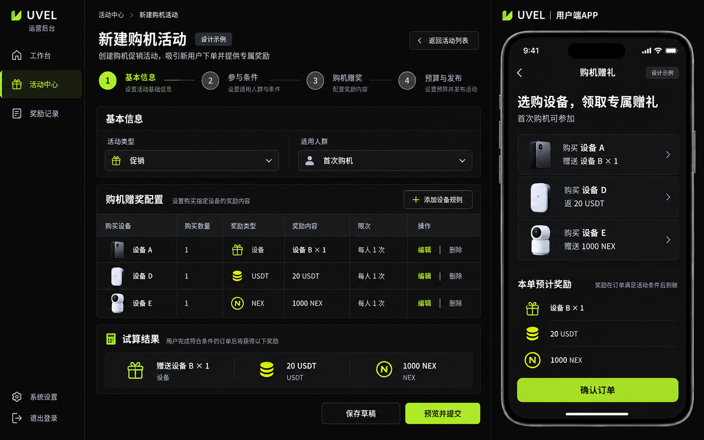

# 促销与裂变交互设计

本目录承载APP接入依据、历史原型与PC设计，业务契约留在[产品PRD](../../PRD/growth-promotions/PRODUCT-PRD.md)。APP/H5视觉依据唯一取当前APP组件、样式token与实际页面；历史APP稿只供业务流程参考。范围与证据关联见[当前决定](APP-SCOPE-DECISION-20261008.md)。

## APP接入范围与素材

首页只在现有轮播增加购机赠礼广告条目，保留原快捷入口；个人中心保留原奖励记录入口，在既有类别汇总增加第四类“活动奖励”，进入 `/pages/me/rewards-list?cat=promotion`。旧 `/pages/events/promotion-rewards` 仅兼容已有链接，不形成平行入口。AppChassis、QuickActionRow及原首页内容保持当前工程接入方式，不按旧画板坐标扩改。

参考图保留原始像素，作为既有轮播广告背景；标题、适用SKU、对应奖励及按钮文案使用真实可配置数据覆盖。图中“买设备A，赠送设备B”等样例文字不构成实际活动规则。其SHA-256记录在当前范围决定中。

## 历史方向稿与业务参考

`concept-app-flow-v2.png` 保留购机业务参考：首页广告点击至商城，商品卡显示逐SKU奖励，原结账显示赠品，离开时出现一次挽留。其布局、shell、快捷网格、按钮材质与独立奖励入口不作为APP视觉要求。图片中的型号、金额、结束日期、产品外观及文字均为设计样例；正式内容由商品和活动配置供给。

`concept-admin-app.png` 保留后台四步配置探索；其中APP独立活动页不作为购机主链或视觉基准。两张历史图的源文件分别为exec-c40a430d-d6dc-47bf-8b52-ae361a7de715.png与exec-feb55d59-a03c-41ee-86e8-47b3a8408e78.png；本次范围决定不要求重新生图。PC既有设计与像素验收范围保留。

## 当前APP元素复用

- 沿当前APP共享组件、颜色、字体、商品图比例和页面层级增加信息；不从旧方向稿引入新主题或布局。
- 购买、继续、返回与退出确认复用当前按钮和对话框样式，保持文字可读、触控目标、键盘焦点、减少动效/透明与强对比回退；不要求额外还原旧稿的Liquid Glass材质。
- 首页广告复用现有轮播，奖励类别复用现有类别汇总与分类记录页；静态商品、规则和奖励正文沿现有内容面，不再套一层装饰卡。
- 新主链不增加必须经过的营销详情页；活动规则可由现有卡片/结账打开辅助说明。原商品详情和购买事件含义不变。
- 挽留主按钮“继续购买”，次按钮“确认退出”；两者同样可发现、可键盘操作。未建单说明活动真实结束时间，已建单说明本单预留截止及订单恢复入口；取消订单另有明确后果。

## 原型与当前验收

[打开交互原型](index.html)。原型为无后端的设计演示，数据及支付均明确标为样例；浏览器刷新不代表订单持久化。其运行检查与截图存于evidence，只证明演示可操作。

每完成一个受影响页面，立即保存当前实现的运行截图，实际操作检查数据来源、加载/空/错/禁用、返回、刷新和必要的失败恢复。至少两名未参与页面实现的独立agent分别审查功能、UX与现有APP一致性，两份报告绑定最终同一快照，修正后两路复验。运行服务源目录、代码hash、URL、平台、语言、主题、视口和测试数据类型必须可定位；真机未验证项单列。

历史 `app-r1-20261007-v2` 的HTML、runtime、checker、素材、清单与report均保留。旧报告是独立设计导出，实际记录2,560组合与827张截图，826等旧计数也不能充当产品验收。保存的旧source见 `evidence/app-r1-design/v2-source/`；不重写旧报告的PASS，不重新导出旧画板，也不使用其1px几何误差要求扩大APP改动。

样例文案与API数据冲突时，先纠正样例，不修改资产合同迎合图片。当前APP验收见[实施计划§5.1](../../PRD/growth-promotions/IMPLEMENTATION.md#51-apph5逐页运行截图与功能审查)，PC继续按§5.2的既有像素门执行。
