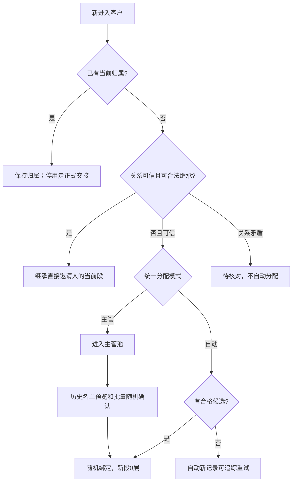

# 客服增强数据与接口契约

来源：[ASSESSMENT §1](ASSESSMENT.md#1-已确认决定) D01–D06/P01–P03；未覆盖内容继承[现行契约 C1–C6](../support-redesign-20260929/CONTRACTS.md)。本文是本轮字段和接口唯一权威；业务入口见 SPEC，验收见 ACCEPTANCE。下列标记“扩展/新增”的接口尚未实现，不能报已上线。

## C1 不变量、权限和兼容

- 每客至多一个 ACTIVE assignment，由现有 active_user_id 唯一索引和客户锁保证。邀请关系、财务、服务归属、维护偏好分开；只改明确选中客户，已有下级不动。
- 先读取真实归属，再尝试有效直接邀请继承，再对真正无顾问者执行单一 `unboundAssignmentMode`。已绑定顾问离线、忙碌、停用均不是无顾问；停用由主管正式转绑。
- 发送者永远是认证的当前有效顾问。主管/超管仅审阅，兼任顾问时只向自身当前客户发送；旧 M1/M3/M5、工单、REST、WS、SSE、成功命令回放不能绕行。
- 转绑同事务关闭旧维护周期，旧顾问立即失去消息、详情、360、标签备注、附件、工单私聊副本、批次敏感结果和实时事件访问；客户端清缓存/草稿/blob，下一次请求重新鉴权。历史作者和业绩不改。
- 本人客服资料读授权不能推导出全局 360 模块或资金/冻结/重置密码写权限。动作能力单独按原模块权限计算，执行回到原模块并再次鉴权，现有确认/理由/审计门继续执行。
- 原类型 `kind=TEXT/IMAGE`、`intent=SERVICE/MAINTENANCE`、`replyTargets`、封装 `code/message/data`、分页/游标和 command key 保留。旧 TEXT/SERVICE、unknown authorConfidence 保留；未知枚举显式协议失败，不伪填 TEXT。
- 现行未回复保护不减少：客户新消息尚未处理时禁止关闭、归档（含批量）或转工单；合法回复提交并处理对应游标后才按原操作权限继续。旧入口、REST/WS及批量路径都走此门，群发replyTargets为空不能帮助绕过。
- 归档为独立维度：新增conversation.archived:boolean（新会话false），投影到DTO/列表/计数，使用现有conversation.version CAS；archive/unarchive不改变status，撤销归档不能把CLOSED改成可发送段。现有MybatisConversationRepository.archive实际写CLOSED/RESOLVED，故须修底层而非只恢复按钮。迁移保留原status，有可靠既有归档审计证据才回填archived，否则默认false并保留原历史，不能仅凭CLOSED推断归档。P1负责字段/迁移/mapper/DTO/筛选/计数和未回复guard，P3消费；P2重跑关闭/归档/转工单保护。
- 无配置值不写 30/7/2 等样例。D/M/W 和继承 mode/L 不改变，新增分配选项与继承选项是两个不同维度。

| 能力 | 当前顾问 | 主管/超管 | 客户本人 |
|---|---|---|---|
| 私聊/服务资料/服务360 | 仅本人当前客户 | 按现行审阅范围 | 仅自己的对客信息 |
| 服务/维护群发、停止/恢复维护、标签备注编辑 | 当前客户 + 原动作权限 | 审阅不授编辑/代发 | 无内部资料 |
| 模式修改 | 无 | 仅超管 | 无 |
| 历史池随机/手工分配/正式转绑 | 无 | 主管及超管 + 原分配权限 | 无 |
| 创建账号/改头像 | 沿用账号创建权限；头像写仅超管 | 超管 + 原账号权限 | 只读顾问头像 |
| 资金/账户操作 | 必须另有原模块动作授权 | 必须另有原模块动作授权 | 原客户端业务 |

## C2 分配

### 数据字典

所有新增 id、时间、操作者、版本由服务端生成；前端只能缓存。数字 ID 沿用现有安全整数契约，前端本地以 string 保存，wire conversion 超安全范围拒绝，后续 bigint 升级不能默默截断。

| 对象/字段 | 类型/默认 | 生成规则和约束 |
|---|---|---|
| SupportRules.unboundAssignmentMode | `AUTO_RANDOM / SUPERVISOR`；兼容初始 `SUPERVISOR` | 保留旧全部入主管池行为；超管显式保存才启用自动，不新增按入池原因的设置 |
| SupportRules.version / modeEffectiveAt | 沿用 Long version；UTC时间 | 修改模式与版本/CAS/审计同事务；modeEffectiveAt 标记本次启用，不能仅以池时间猜可自动重试 |
| Assignment.source | 现有 MANUAL/INHERITED/MIGRATED + `RANDOM` | RANDOM 的 root=customerId、depth=0、parentAssignmentId=null；允许同一顾问再次抽中，仍创建新段 |
| BindingPool.autoEligible / autoRuleVersion | boolean / Long?；旧行 false/null | 只有进入时处于 AUTO_RANDOM 且已确认无归属/无关系矛盾的新记录可 true；历史池不因开关变 true |
| BindingPool.autoAttemptState | `NONE / WAITING_CANDIDATE / PAUSED / ASSIGNED` | 原 reason 保留；尝试次数、lastAttemptAt、nextAttemptAt?、lastOutcome、operationId 可回查；主管模式暂停未提交任务 |
| RandomPreview | id、actorId、customers:[id,poolVersion]、count、excluded、rulesVersion、expiresAt | 服务端固定确认名单；排除已绑定/待核对者，过期或名单/版本变化须重新预览 |
| RandomResult | operationId；每客 id、status、assignmentId?、agentAdminId?、outcome | status=`ASSIGNED / NO_CANDIDATE / CONFLICT / SKIPPED`；真实逐客结果，不承诺整批全成功 |

### 状态和事务

候选为真实 adminId 去重且满足现有有效账号、客服角色、专属坐席资格；等概率抽取，不按在线/忙碌或会话并发上限过滤，不额外造绑定人数上限。超限可抽到原顾问。规则未配置不能继承，但真正无归属仍可按分配模式处理；重复/孤儿/疑似环继续待核对，不能随机掩盖。

沿用客户锁、候选资格重验和唯一约束；随机/主管分配并发只能一个提交。规则修改与未提交自动任务按可验证顺序线性化：任务提交点须读取锁定的最新模式/版本，改主管模式先提交后不得再自动绑定。自动重试只对原 `autoEligible` 的未绑定新记录执行；重新启用不吸纳历史主管池，重试过程不重新选已绑定客户。注册成功不得因无候选被拒绝。

随机写命令复用已存在 `AdminIdempotencyService.executeRetained/recoveryResult`，成功结果持久保留；预览/操作结果需保存原冻结名单、请求摘要和逐客结果，绑定历史保存operationId。永久不重复的依据是这些持久记录及归属唯一约束，不能靠普通命令TTL。PROCESSING过期转UNKNOWN时必须查真实归属/结果，不能重新抽签。批量历史确认固定集合，逐客事务记录partial；重复原key只查询/恢复尚未确认提交项，不改原已提交结果；不得假报整批原子或隐含后代。锁顺序复用 SupportBindingService，实施须以 DB 并发测试证明不引入客户/规则/顾问反序死锁。

## C3 资料、金额与360

### 统一可用性

每个新资料分组使用 `{status: READY|UNKNOWN|FORBIDDEN|ERROR, data, evaluatedAt, errorHint?}`。READY 中真实金额 0/空列表合法；其它 status 的金额/评级用 null。ERROR 保留独立重试，FORBIDDEN 不泄漏隐藏值，UNKNOWN 为未采集/无可信来源。不允许 catch→0、未知→中风险、停用→高风险；与现有 activity UNKNOWN 和 completeness 并存，不能用一个全局 available 抹掉局部失败。

| 分组 | 数据及来源 | 约束 |
|---|---|---|
| identity | customerId/userNo/nickname/avatar、等级、phoneMasked、region、registeredAt、lastLoginAt | 复用客户资料；注册、最近登录、lastEffectiveAt 分开，电话脱敏；客户头像无客服代改权限 |
| finance.byCurrency[] | currency、creditedDepositTotal、depositRefundTotal、successfulWithdrawalPrincipalTotal、successfulWithdrawalFeeTotal、successfulWithdrawalNetTotal、processingWithdrawalPrincipalTotal、balance、availableBalance? | 全历史，不按最近20/30笔、客户端分页或展示条数求和；金额 decimal string，不经 Number 浮点加和，不混币、不猜汇率 |
| finance.recentFlows | records/total/pageNum/pageSize | 与累计独立分页；时间范围仅影响列表，不能默改全历史累计；每笔本金/费/到账/状态/币种可回查 |
| devices | records/total、在网情况/算力/闲置情况及各自 status | 不用一次固定200条当全集；缺在线信号 UNKNOWN，不猜0 |
| risk | level、serviceExplanation、evaluatedAt、source | 可信风险投影；无评级 UNKNOWN；模型/案件正文/安全会话仍需原专项字段权限 |
| annotations | systemTags只读、customTags、notes:[id,text,authorId,authorName,createdAt] | 复用原持久化增删；按当前归属及动作权限编辑，标签/备注永不进入对客消息 |
| service | 当前顾问、assignmentState、会话状态、账户活跃/沉睡/未知、maintenanceEnabled、lastEffectiveAt、nextMaintenanceAt、最近服务、工单/历史数量 | 全部保留现有 C4 定义；维护历史按 cycles/executions 独立分页 |

充值成功是权威充值订单/账本实际入账成功，不是创建订单额或回调声称成功。聚合按唯一财务事实去重；退款独立累计，已成功充值退款后不反写原累计。提现成功按已完成权威订单本金，费用、实际到账单列；拒绝/失败/撤销不入成功，处理中另列。P1 阶段须给出现有 nx_deposit_order / nx_withdrawal_order 与权威账本的真实字段、状态映射及多币 SQL/对账例；发现来源不能证明实际入账或退款时返回 UNKNOWN，不用猜测金额补齐。聚合与近期清单读取一致水位/evaluatedAt，避免无解释的账实差。

回源已确认的源字段（不是本轮聚合已实现声明）：

| 财务事实 | 现有来源/判据 | 本轮查询必须保留的限制 |
|---|---|---|
| 链/银行充值 | nx_deposit_order.user_id/deposit_no/asset/amount/ledger_id/credited_at；现有confirmed筛选为CONFIRMED/CREDITED/SUCCESS；nx_wallet_ledger同user/biz_no/asset、IN/SUCCESS且原入账记录匹配 | 单有成功订单标签无账本则ABNORMAL，不计真实入账；全历史原始成功事实去重，不能退款后状态变化使原累计缩水 |
| 卡充值 | nx_payment_record.user_id/payment_no/order_no/wallet_ledger_id/amount_usdt/payment_status；原查询兼容nx_topup_card_admission和防重复订单 | 实际成功CARD_TOPUP账本按l.asset/l.amount，而不是支付currency配amount_usdt；未结算admission不计；与deposit重复仅计一次；手续费/付款总额不计入实际入账 |
| 充值退款 | 原D1 chargeback/recovery可区分recoveredAmount/feeBufferDeducted等 | 回收扣款不自动等于对外退款；P1须核定真实退款事实与币种，无可信源的depositRefundTotal为UNKNOWN，不能把“非成功”订单都当退款 |
| 成功提现 | nx_withdrawal_order.user_id/withdrawal_no/asset/amount/status/completed_at；现有SUCCESS兼容映射CONFIRMED；d2_actual_fee/d2_net_receive已有 | 成功本金用amount；fee与d2_actual_fee的兼容、网络费用和d2_net_receive须按真实已结算契约核定，旧缺字段不猜净额；非成功终态不计；处理中不能仅用“所有非终态”猜集合 |

P1应枚举所有现行充值渠道与提现状态，沿用真实成功账本/订单关系聚合，不新增资金写入。卡付款币种与实际入账币种不一致的样本、相同充值跨表重复、已入账后退款/拒付及缺账本均必须进入F01/F03/F04反例。

详情扩展为本人服务资料，新增 `/customers/{customerId}/360` 提供同一授权下完整服务视图与 `actions` 原模块能力；不用“给 service_m3_read 顺便发全局 users 读权”。详情、360、导出（如既有）、工单和缓存每次对象鉴权，source private content 继续继承 R08。

## C4 头像

唯一权威是 admin 账号 ID 对应的 `avatarAssetId`（持久资源键）和 `avatarVersion`。账号、坐席、顾问、消息作者只投影，不加可写 seat avatar。客户头像沿用客户资料。支持上传/预览/取消；本期不增加未经确认的“没有头像不能创建账号/启用坐席”硬门，既有账号继续姓名占位，由超管补齐。

账号创建请求扩展 optional avatarAssetId；更新头像通过超管原账号 profile 动作，使用现有 string `expectedVersion`、reason、key；沿用账号创建/密码流程，不记录凭据。上传复用 ObjectStorageService 和现有媒体校验服务的存储能力，在账号权限下新增专用上传入口，不能给客服 device_e1_write。服务端解码/重编码 JPEG/PNG、去EXIF，拒脚本/SVG/远程URL，大小/像素/TTL取真实存储策略，未配置明确失败，不能猜生产数值。

上传 READY→账号确认提交 ATTACHED；上传/替换失败保留原头像，取消不改账号。资源标识可以公开投影，privateObjectKey/bucket不得出现在对客响应；取图需服务端受控头像读取授权或现有可证明安全的头像策略。账号头像是对客展示资料，不复用单客私聊 attachmentId，也不扩大私聊附件可见范围。更换版本刷新后各处一致；沿用现有 `senderId/authorConfidence`（不是另造senderAdminId），仅VERIFIED的真实顾问作者可投影对应头像；作者不可信则占位，不能用“当前顾问头像”盖掉全部历史。正式客户端现有解析会丢senderId/authorConfidence，P4必须补解析保留。

头像替换兼容原账号profile更新语义：不改变username/displayName/email/role等原值，省略avatarAssetId表示头像不变，本期null不作为删除头像命令。现有profile缺username/displayName会拒绝、省略email会清空；后台头像编辑提交需带完整当前资料，后端头像差异必须进入同一版本CAS/更新，不能被原“资料无变化”提前返回吞掉。avatar-only成功须增加版本且其它字段逐一不变；失败全部保留。

## C5 群发、SKU及跳转

人工批次只向本人当前客户逐个写1v1；不建立群聊、定时营销服务或新微服务。复用 Spring 应用内可恢复执行与现有命令/审计，不靠浏览器循环保存进度。

| 对象 | 字段 | 规则 |
|---|---|---|
| SelectionPreview | selectionId、actorId、filters、customers:[id,expectedAssignmentId]、excluded:[id,reason]、count、evaluatedAt、expiresAt | 单选/本页/跨页显式选择；“全筛选”由服务端授权冻结名单，排除两种用途下的 maintenanceEnabled=false；新增匹配客户不自动追加 |
| Filters | accountState、maintenanceState、level、tagIds、registeredFrom/To、activityFrom/To、deposit/withdrawalMin/Max + currency、includeUnknown | UTC界限明确；金额是P03对应累计，非净额或近30笔；按分组可用性处理，不把未知纳入“0金额” |
| BulkJob | batchId、actorId、selectionId、intent、content、kind、skuId?、linkTarget?、assetId?、createdAt、state、counts、version、key | intent必填 SERVICE/MAINTENANCE；actor认证取，确认内容不可被重试换载荷；counts加和必须等于冻结人数 |
| BulkRecipient | batchId/customerId唯一、expectedAssignmentId、clientMessageId、state、resultCertainty、messageId?、conversationNo?、failureCode?、retryable、attempts | state=PENDING/SENT/FAILED/SKIPPED/CANCELLED；resultCertainty=KNOWN/UNKNOWN，超时未查明保留PENDING+UNKNOWN并显示“结果待核实”，不能映射FAILED；稳定消息id由batch/customer派生并永久去重，SENT必须真落库 |
| BulkAttachment | assetId（批次暂存）→逐客 attachmentId | 一次上传多次受控引用：每客单独附件记录/授权；可共用底层存储字节，不可共用原单客私有URL |
| Message 扩展 | kind保留TEXT/IMAGE，新增 SKU/LINK；skuId?、linkTarget? | SKU保留真实id+发送时名称快照；跳转使用枚举有效目标/结构参数，不接受 javascript/任意外链/内部管理路由 |

最小消息 schema：TEXT 用 content；IMAGE 用 attachmentId；SKU 用 skuId（服务端验证在售及读取内容）；LINK 用 linkTarget `{type,params}`（仅当前已启用入口白名单）；intent/clientMessageId/assignmentId共用旧消息权威链。聊天窗口传输扩字段也须扩HTTP/WS解析与相同写事务，不用旧推送API旁路。旧商城/锁仓/创世文字或链接保留可读，只对可识别且当前合法的目标导航；失效显示不可用，原文不删；不猜停用SKU可购买。

状态：DRAFT（尚未提交）→QUEUED→RUNNING→COMPLETED；取消命令只取消尚未提交消息项，最终批次 CANCELLED；COMPLETED 可有 FAILED/SKIPPED，是“执行结束”而非全成功。存在PENDING+UNKNOWN时不能宣布终态，必须先查稳定messageId/逐客事务事实；已落库归SENT，确认未提交才允许恢复。每个发送事务在同一客户锁内重验归属/资格/维护开启/附件能力/SKU有效性和取消状态；成功同事务消息+收件箱+逐客 SENT+维护execution（仅MAINTENANCE）提交。取消与发送并发以提交点线性化，已 SENT 不回滚；进程中断恢复不能重复发，SENT与消息需可对账。部分失败重试沿用原batch/客户集合/内容/clientMessageId，先查未知结果；已成功、已转绑、不再维护、已取消不发。

最小实现是任务头+逐客项两表和应用内DB定时扫描、逐客短事务，不需首版租约/MQ/通用job框架。任务actorId落库，执行时按数据库真实资格/原grant鉴权，不能保存token或伪造长期SecurityContext。复用 `SupportHumanMessageService.prepare/committed` 和 `OpsConversationService.initiateWithMessageId/replyWithMessageId`；现有 `OpsConversationController.publishAfterCommit` 的提交后广播须抽取复用，群发成功也进入双端实时通路。I3 campaign虽有扫描恢复但整批通知事务没有逐客项/发送中取消，不可直接替代私聊群发。自动无候选只是业务等待，不能消耗通用outbox异常默认重试预算。普通命令TTL/过期UNKNOWN、批次持久结果、永久clientMessageId去重是三个不同保证。

SERVICE 不记维护。MAINTENANCE 每条成功人工消息才记执行，后续新的有效活动才成功，沿用 baseline/停止/转绑状态机。群发 `replyTargets=[]`，不自动清已有待回复；主动求助后的普通单客回复不受“停止主动维护”阻拦。

## C6 接口目录与回源证据

后台前缀 `/api/admin/content`（B）；账号 `/api/admin/platform`（A）；客户端 `/api/app/support`（F）。所有返回沿用 ApiResult，不新造HTTP封装。写入要求 Idempotency-Key（现有8–128）+理由（高敏按原门）+预期版本/归属；错误沿用401/403/404/409/422/413/415/429/503，界面说明下一步，不暴露内部码。

| 方法/路径 | 基线事实与目标输入/输出 | 权限 |
|---|---|---|
| B GET/PUT `/support-agents/rules` | 已有D/M/W/mode/L+version；扩展 unboundAssignmentMode；PUT保留expectedVersion/reason，不丢旧字段 | 主管读，超管写 |
| B GET `/support-agents/binding-pool` | 已有pageNum/pageSize/keyword/reason；扩展自动尝试状态/来源及分页 | 主管 |
| B POST `/support-agents/assignments/random-preview` | 新增 customers:[id,poolVersion]或明确全筛选；返RandomPreview | 主管 |
| B POST `/support-agents/assignments/random` | 新增previewId、expectedRulesVersion、reason；key；返RandomResult | 主管 |
| B GET `/support-workbench/commands/{key}` | 已有主体隔离结果恢复；扩展random/bulk结果，失权字段重新过滤 | 原写主体 + 当前读权 |
| B GET `/support-workbench/customers/{id}`、`/customers`、`/overview` | 已有归属、活动、维护、原子概览；扩详情分组/筛选，保持pagination/completeness/snapshot语义 | 本人/主管审阅 |
| B GET `/support-workbench/customers/{id}/360` | 新增C3全服务资料+独立actions；不得透传全局360全权限 | 本人/主管审阅 |
| B GET `/support-workbench/customers/{id}/flows`、`/devices` | 新增独立分页，返records/total/pageNum/pageSize+source status；金额币种/状态筛选 | 本人/主管审阅 |
| B POST/DELETE `/conversations/{no}/customer-tags`；POST `/customer-notes`、DELETE `/customer-notes/{noteId}` | 已有tags/notes持久化方法；复用原DTO与版本规则，保留作者/时间，强化对象权限 | 当前顾问 + 原编辑权限 |
| B GET `/support-workbench/skus` | 已有DeviceSkuQueryRequest→PageResult<DeviceSkuView>；复用搜索，过滤下架，提交再验 | 原service_m1/m3读 |
| B POST `/conversations`、`/{no}/replies`；WS同命令 | 已有create(userId/openingText)、reply(body)、kind/intent/attachmentId/clientMessageId/expectedAssignmentId/replyTargets；扩SKU/LINK | 仅当前顾问 |
| B PATCH `/conversations/{no}/archive`、`/archive/batch` | 路径已有，扩独立archived字段/DTO/CAS/筛选计数；保留原权限与未回复guard，不改status/历史/待办/归属 | 原动作 + 对象权 |
| B POST `/support-workbench/bulk/preview` | 新增filters/customerIds/excludedIds/selectionMode，返SelectionPreview | 当前顾问 |
| B POST `/support-workbench/bulk` | 新增selectionId、intent、kind/content/skuId/linkTarget/assetId、reason；key；返持久化BulkJob | 当前顾问 |
| B GET `/support-workbench/bulk`、`/{batchId}`、`/{batchId}/recipients` | 新增分页批次/逐客结果；敏感名单逐次授权，转绑后可保留本人汇总计数但屏蔽失权客详情 | 发起顾问；主管审阅无代发 |
| B POST `/support-workbench/bulk/{batchId}/cancel`、`/retry` | 新增expectedVersion/reason；key；cancel未发项，retry仅未成功且仍合格项 | 发起顾问 |
| B POST `/support-workbench/bulk/attachments` | 新增multipart file/clientUploadId；key；返批次READY资产，不给客间共享读取URL | 发起顾问 |
| A POST `/accounts`；PATCH `/accounts/{accountId}/profile` | 已有账号创建/资料更新；扩optional avatarAssetId（创建）、avatarAssetId（替换）与响应avatarVersion，不动用户名/密码契约 | 原账号权限；头像写超管 |
| A POST `/accounts/avatar-assets` | 新增multipart file/clientUploadId；key；复用ObjectStorageService，返assetId/status/previewRef | 超管 + 原账号权限 |
| A GET `/accounts/{accountId}/avatar`；F GET `/advisor/avatar/{adminId}` | 新增受控头像字节读取，版本缓存按策略；不返回bucket/objectKey；F只可见当前/自身历史可信作者 | 账号读权 / 客户自己的私聊 |
| F GET `/advisor`；GET `/conversations/{no}` | 已有assignmentId/currentAdvisorId/currentAdvisorName/assignmentState/availability；增currentAdvisorAvatar及消息senderAvatar `{assetId,version}`，SKU/LINK payload | token客户本人 |

avatar ref 由账号权威派生，顾问更换不改旧作者；读取头像采用当前/历史可见作者授权。旧服务响应缺新增头像字段合法占位；收到新消息kind但缺必需payload显式报协议错误，保持原输入和可重试，不静默丢消息。

回源固定：后台747d957 `lib/admin/m-support-client.ts`、`m3-dedicated-chat.tsx`；后端968fbdcf `SupportBindingService`、`SupportWorkbenchController`、`OpsSupportWorkbenchController`、`OpsSupportAgentController`、`OpsConversationController`、`ContentConversationMessageView`、`ConversationReplyRequest`、`OpsUser360Service`、`OpsAdminAccountController`及账号DTO、`OpsMediaController`/`ObjectStorageService`；正式客户端origin/test cd3b599f `src/api/support-api.ts`，与指定a90d7d40客服相关接口相同。现有通用media上传需要device_e1_write，不能直接作为账号头像权限入口。具体财务成功字段/退款来源及新增消息/批次表由P1/P2交付真实映射，未映射保持UNKNOWN。

## C7 隔离迁移和交接

只提供增量迁移、隔离 dry-run/二跑及回滚说明，不运行生产SQL。旧池autoEligible=false，旧消息TEXT/SERVICE，旧账号avatar=null，不伪造维护执行/风险/历史作者；现有归属、历史会话、邀请财务记录不删。回滚需先停新增写能力，不能恢复旧权限旁路；保留已发送消息/批次结果和原账号头像。P1先固定共享DTO/鉴权/消息扩展，P2再消费，重叠文件串行；三仓最终以实际合入SHA和同一隔离服务验收，单仓静态绿不代表跨端已可用。
