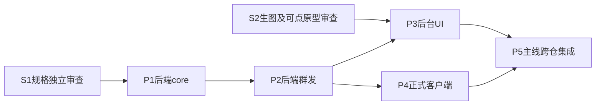

# 客服增强分仓实施计划

业务范围已由主人确认；本阶段交付规格，不启动产品实施。规格阶段只写本目录，不写产品代码或docs/design。阶段会话/独立审查统一GPT-6.1 Sol xhigh，任何spawn显式fork_turns="none"并在message完整提供上下文；各实施方不是独自在代码库，保留其它任务改动。

## 固定仓与输入

| 阶段 | 实际repo / branch / base | 执行者和产物 |
|---|---|---|
| S1规格 | D:/WORKS/PLAN/.wt/cs-enhance-spec-20261001-admin；codex/cs-enhance-spec-20261001；747d95796dd233a67a57ce614581ee6023673f43 | 本规格会话；本目录正式文档+分仓计划 |
| S2设计（同步进行） | D:/WORKS/PLAN/.wt/cs-enhance-design-20261001-admin；主线管理 | 设计会话；docs/design/support-enhancements-20261001 生图/校正/可点关键流/独立审查 |
| P1后端分配+资料+头像+共享消息契约 | D:/WORKS/PLAN/.wt/cs-enhance-core-20261001-backend；codex/cs-enhance-core-20261001；968fbdcfbbbd2a583d4015661b613a23cfd6e954 | 后端core会话；接口/真实财务状态映射/对象授权/头像/迁移/共享SKU和LINK校验与提交后广播 |
| P2后端群发 | 与P1同repo/branch，必须在P1验收后串行 | 后端bulk阶段；任务头+逐客项、DB扫描/逐客事务、图片授权、取消/恢复/结果接口 |
| P3后台UI | D:/WORKS/PLAN/.wt/cs-enhance-ui-20261001-admin；codex/cs-enhance-ui-20261001；747d95796dd233a67a57ce614581ee6023673f43 | 后台UI会话；工作台/M3/360/分配设置/账号头像接入与旧能力恢复 |
| P4正式客户端 | D:/WORKS/PLAN/.wt/cs-enhance-client-20261001-app；detached HEAD；a90d7d4035245b91c44f2bf5d9f8632605cc3d30 | 正式客户端会话；头像/作者、SKU/LINK、图片/失败恢复及必要语言，不创建codex分支 |
| P5最终集成 | 主线消费通过的三仓commit，集成脚本归P3实际repo | 协调主线；实际SHA、同一隔离服务、全部AC、原AC01–14、三仓质量门/独立审查/同步 |

远端：backend=agentabatiuo572-byte/nexion-backend/test；后台=agentabatiuo572-byte/nexion-frontend-pc/test；正式客户端=agentabatiuo572-byte/nexion-frontend-uniapp/test。2026-10-01规格fetch时客户端origin/test为cd3b599f；指定P4实际树仍a90d7d40，计划不漂移base。消费/最终集成前fetch比较并保留远端新增提交，不因快照不同回退。

inputs固定为本目录ASSESSMENT、SPEC、CONTRACTS、ACCEPTANCE及现行support-redesign文档、实际package/pom和共享接口源码。JSON相对路径均按JSON所在目录解析。设计目录在S2实际交付/审查后才可作为P3可消费输入；P3启动前用新任务id修订计划列入实际设计文件和哈希，保留旧计划/状态，不用尚不存在图片充普通文件输入。

## 依赖与文件所有权

P1/P2同后端树、共享SupportBinding/Ownership/HumanMessage/Workbench服务、mapper/DTO、OpsConversationService/Controller、migration及tests，禁止并行写；P1先验收commit，P2同阶段树在其上继续，P2改共享契约后core证据须重开并重跑。P3/P4在P1/P2交付后可并行，因为不同repo；P3尚须等S2生图/原型独立审查。P1和S2可并行，P1不能用未验收设计作为产品规则。

| 责任 | 允许文件 | 必须串行/复核点 |
|---|---|---|
| P1分配 | content/application/SupportBinding*、SupportOwnership*、content/{domain,dto,mapper,web}对应规则/归属文件；注册调用点；对应测试/隔离迁移 | 同客锁、最新mode、候选、autoEligible、历史池预览、retained结果 |
| P1资料/头像 | user服务/mapper/360资料查询；finance只读聚合；platform账号dto/service/controller，auth/AdminEntity+AdminMapper及platform/AdminAccountState投影；media/shared存储复用；对应测试 | 头像唯一存真实admin账号，不另造seat存储；只读服务资料，动作权分开；不改结算公式/生产权限；avatar-only不清email |
| P1共享消息 | content消息dto/domain/mapper/prepare/committed、OpsConversation服务/controller/realtime及客户端协议输出 | 定义SKU/LINK/头像字段、可信senderId、广播；新增archived独立字段及可靠审计迁移、列表筛选计数、原status不变和未回复guard；P2不得另造旁路 |
| P2群发 | content批次服务/mapper/controller/DTO/DB扫描与两表迁移；SupportHumanMessage/Attachment/Conversation必要共享改动；对应测试/runtime脚本 | 逐客事务、真实actor权限、取消锁序、UNKNOWN先查、图片逐客授权；改共享文件重验P1 |
| P3后台 | lib/admin/m-support-*及m-client、M域现有state/realtime、m-tabs/data/types/M1/M3/m5-service-rules和样式、客服scope360入口；a1-client及a1-accounts；api代理；tests/scripts | 不顺带改全局RBAC/客户全局360权；不恢复旧发送API；独立审每页面 |
| P4客户端 | src/api/support-api.ts、src/domain/support.ts、现有support/advisor页面和必要store/API适配、相关i18n/测试/scripts | 保留a90d7d40顾问重试入口/头像取消修复及远端新增WIP；不扩大网站/其它业务 |
| P5主线 | 已验收commit消费；授权内集成测试/runtime脚本；阶段证据 | 集成需要产品修补时回最早对应阶段reopen，不静默越scope修其它仓 |

上述目录是定位范围，不授予随意整域重构。JSON给机器scope（真实已有文件/glob及拟新增runtime生产器）；启动阶段时核定实际最小写清单，特别是P3账号组件不能借头像扩大整个platform。

## 机器计划及检查的真实边界

- backend.plan.json：core→bulk→仓内integration；admin.plan.json：ui→仓内integration；client.plan.json：client→仓内integration；integration.plan.json：主线重新跑三仓现有质量门→跨仓runtime+独立coverageReview。
- repo/base/原始来源/scope和已有命令已回源核对。外部阶段依赖不是同repo的dependsOn，必须由主线检查S1/S2/P1/P2当前commit、审查报告、runtime报告及契约快照后才init/start相应计划；禁止JSON“deps=[]”被解释为可提前实施。
- P3/P4和P5消费实际产物前以新task id修订计划inputs：列入被消费commit/文件清单、真实runtime和独立review普通文件；设计输入同理。当前尚未交付的报告不编造。P5生产器开始/结束以及独立review/finish前核对三仓完整snapshot/HEAD（含未忽略新文件），与实际运行记录一致；任一仓变更须reopen并重跑。单repo WORKFLOW_SNAPSHOT_HASH不自动覆盖其它仓未列入inputs的文件，不能声称机器已保护全三仓；此核对由主线执行并留证。
- 现有可执行门：backend Maven test；后台node scripts/verify.mjs（full）；客户端node scripts/verify-chain.mjs --full和原Git提交候选门。Windows Maven以pwsh.exe调用已存在mvn.cmd且原样传播退出码；不直接spawn .cmd，不绕hook。
- 新增强runtime生产器**尚未存在，当前为待实现检查，不是已通过门**：后端 `scripts/support-enhancements-runtime.mjs`（core/bulk/integration）、后台 `scripts/support-enhancements-runtime.mjs`（ui/integration）、客户端同名（client/integration），主线后台 `scripts/support-enhancements-cross-runtime.mjs`（integration）。精确命令已写入JSON；文件不存在会失败。各实施阶段必须在自身scope内补实际生产器、核验argv/环境/输出，再run；禁止只输出绿JSON、空测试、硬编码pass或用旧场景报告填新AC。
- runtime record必须实际执行场景，并由运行器环境绑定taskId/stepId/checkId/runId/repo/snapshotHash；报告at/verdict/mode/treeMoved/capability及requiredChecks逐项非空证据满足task-workflow。脚本须先验证隔离地址/库/用户，不能猜端口或改现有服务；缺APP实机、财务映射、设计稿或后端依赖写unverified并失败，不假绿。
- 新runtime生产器统一接受JSON中的--phase/--plan/--report，按当前step映射场景而非靠硬编码数量通过；最终生产器同时执行新77项及原AC01–14，原超层分配要求按D01/P01/P02更新，其余继续有效。旧报告不得直接改key/id变成本轮证据。
- JSON里的产品验收对应ACCEPTANCE原始ID；机器项同计划唯一，各repo集成重跑自身步骤checks，再运行独立integration。主线最终报告必须覆盖全部77项和原AC01–14，不把本文件/JSON可解析或spec-lint通过当功能通过。
- P5实际requiredChecks为91项（77新增清单+14 legacy-AC），各项独立pass/fail/unverified，不以X05一条summary代替旧14项。原AC02超层处理按本轮确认D01/P01/P02改为统一模式，其它旧边界继续测。
- 分仓条目只验本阶段义务：core-V04验证账号/坐席/顾问/消息API投影同资源版本及HTTP刷新读回，不要求尚未启动的P3/P4界面；后台和客户端分别验自身视觉/交互，P5再完整证明V04三端一致。其它跨阶段条目同理，不把局部API通过记为整个原始AC通过，也不等未启动下游造成循环依赖。最终integration的77项仍是完整原GWT，未删减。
- 当前S1只做spec-lint --strict、真实loadPlan/schema/source/base/scope解析、跨文档字段/覆盖核对和只读独立审查；不init/start/run产品计划，不启动服务或执行产品测试/迁移。计划runtime缺件已明示，不伪造check结果。

## 每阶段逐步验收和交接

P1：先真实字段/状态映射与权限→分配和自动新池边界→资料全历史聚合及局部可用性→账号头像及SKU/LINK共享链→独立archived字段、可靠历史回填及旧分页/计数/CAS；单元/原回归+隔离MySQL并发/持久化+资料接口证据+只读独立审查。A/F/V及R资料字段都要真回读。无候选扫描复用池字段；不新增outbox业务重试上限。

P2：消费P1已验接口→冻结圈选→批次/逐客持久化→消息/维护同事务及广播→取消/UNKNOWN/重启恢复→逐客图片授权。B01–B13和X01重点，保留原未回复保护，成功/失败/跳过/取消与未知计数可对账。新增两表即够，不建立MQ或通用调度系统。

P3：消费S2审过生图/原型与P1/P2真实接口→恢复R01–R35→分配设置/历史池→群发→账号头像/客服360。每页面独立人工友好审查，真写回读刷新、设计截图对照、两用途及多币/分页/窄屏/键盘/减少动画/权限/失败完整；无权入口有说明、不能只toast。

P4：消费实际后端消息/头像/附件接口→保留并解析senderId/authorConfidence→头像和SKU/LINK→当前两人工入口/历史/失败恢复与必要语言。实际实现通路为src/pages/support/chat.vue/messages.vue、src/components/support/conversation-thread.vue/thread-types.ts和src/store/conversations.ts，语言为src/i18n/messages/{en,zh,vi}.ts，不虚构src/pages/me/advisor.vue或src/stores。H5/APP分开记结果；APP未测不能借H5绿替代。保持现有clientMessageId、分页、dismissal、已读与原头像取消/重试能力。

P5：fetch并核定三仓目标集成提交，保留其它远端提交；同一隔离DB/服务/存储下逐项AC/原AC验证，旧路径REST/WS/SSE/工单私聊/附件/360/成功回放全扫；将每项绑定角色/场景/实际SHA及证据。独立审查从原需求重建应有清单，主线回源P0/P1。done-review六维全部产品范围核验后才宣布功能完成。

交接必含：commit/tree、实际scope、命令及失败日志、migration dry-run/二跑、财务真实状态映射、接口payload、runtime报告、独立review、未测项/恢复入口；不得只报tests数量。流程记录放仓外C:/Users/jason/.codex/workflow-runs/support-enhancements-20261001，各计划不同子目录，不保存token/手机号原文/图片私有URL。

## 提交和同步

S1规格审查/检查通过后只push `origin HEAD:refs/heads/codex/cs-enhance-spec-20261001`。P1/P2后端仅push阶段 `codex/cs-enhance-core-20261001`；P3后台仅push `codex/cs-enhance-ui-20261001`；P4遵循正式仓AGENTS，在detached树暂存精确任务改动后跑full verify/候选门、commit交主线，不建逃生分支或自行覆盖test。主线审查和最终集成后统一同步指定test。Git身份统一fakerli998877-ship-it及325914866+fakerli998877-ship-it@users.noreply.github.com；push前fetch比较，禁强推、--no-verify、绕quality gate。当前既有33029/5180/18129运行目录/服务不改，不部署生产、不运行生产迁移。

产品尚未实现/运行验收，S1交付只证明规格有来源、清单完整、计划可解析；需要后续阶段的真实证据才能证明功能正确。
