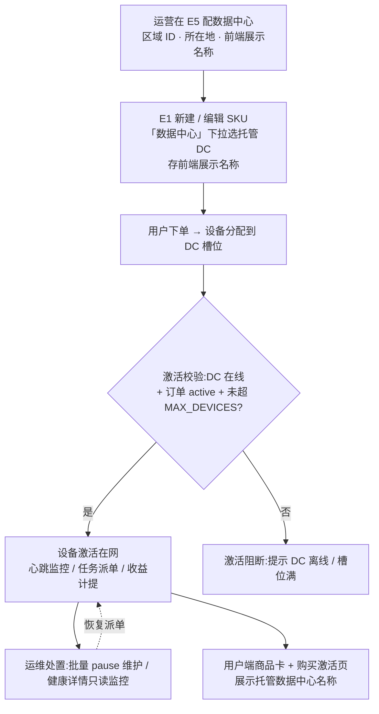

# Nexion 运营后台 · 产品更新日志

> **范围**：运营控制后台（`Nexion-admin-prototype`，dev :3002）的功能更新。前端（uniapp）日志在 `Nexion-uniapp/docs/前端产品更新日志.md`。
> **目的**：对齐产品进度——每次的新增 / 修改 / 移除功能记录在此。
> **图标**：🆕 新增 · ✏️ 修改 · 🗑️ 移除。**格式**：标题 → 概述 → 要点 → 入口 → PRD 章节。**顺序**：最新在上。
> **维护**：后台功能任务收尾在最上方当天日期下追加一条；纯 UI / 文案打磨可省略或合并记录。

---

## 2026-08-06

### ✏️ 全站 a11y 债务清偿:小按钮触达高度 / 暗淡徽章对比度 / 表单组标题语义

**概述**:清偿 2026-06-22 记账的三项全站级无障碍债务(主人拍板专项处理)。

**✏️ 修改**:
- 全部 10 个域的表格行小按钮(l-btn.sm)补最小高度 24px(WCAG 2.2 触达目标),实测 27.25px,视觉密度不变;
- 全部 9 个域的暗淡徽章(bdg.dim)前景升档,对比度实测 3.9→10.14(达标线 4.5);
- 确认弹窗业务表单 43 处组标题从空悬 label(假标签语义)改为呈现性元素,样式不变;包裹控件的合法 label 与带 htmlFor 的标签未触碰。

**入口**:全站表格行按钮 / 状态徽章 / 操作确认弹窗业务表单|**PRD 章节**:无(纯 a11y 质量修复)。

### ✏️ 全后台高敏提交:失败归类统一 + 换人不再串命令号

**概述**:上一条把 F 域接上了稳定命令号,这次把同一套保障推平到全后台。核心是修掉三类会导致**重复打款 / 重复放行**的情形:同一笔操作在服务器出错后被当成两笔、换操作员后新人复用了前人的提交凭据、以及浏览器存储不可用时防重复整体失效。

**✏️ 修改**:
- **失败归类统一**:此前各域对「服务器 5xx」的判断不一致,有的当确定失败(丢弃提交凭据 → 重试变成第二笔),有的当结果未知(保留凭据)。现在全后台同一口径:**只有服务端明确拒绝(4xx / 业务码非 0)才算确定失败**;服务器 5xx、网络中断、响应读不出来一律按「结果未知」保留凭据,原样重试由后端识别为同一笔。覆盖 A1/A2/A3/B2/B3/B5/D/I/J/K/K6/用户 360 共 12 个域。
- **三个域补上网络中断的兜底**:B2/B3/B5 此前断网时抛出的是未包装的原始错误,会被当成「确定失败」而丢弃凭据——而断网恰恰是最典型的「结果未知」。
- **失败提示与实际行为对齐**:资金域(D 域、用户 360)在服务器 5xx 时凭据其实已保住,提示却仍说「失败」,会引导操作员重做一遍;现在统一显示「结果未知,可原样重试」。
- **换操作员不再串号**:同一台电脑同一个标签页换人登录后,新操作员此前会复用前一位留下的提交凭据(导致新人的操作被当成重复而被吞掉、审计还记在前人名下)。现在按账号身份识别,**换人才清、同一个人会话断开重连不清**(清了会让他的重试变成新的一笔)。
- **存储不可用时的降级**:浏览器隐私模式或存储写满时,提交凭据改为退到本页内存,同一次会话内重试仍是同一笔(刷新会丢,控制台有一次告警)。
- **有效期改为从首次提交起算的 24 小时硬上限**,不再每次重试都续期——续期会让本地记录活得比后端的去重窗口还久,给出虚假的「会被去重」信心。

**入口**:无新增界面。影响所有带二次确认的高敏操作(打款、放行提现、风控处置、参数调整等)在**提交出错后**的提示与重试行为。

**PRD 章节**:`运营控制后台_开发落地规格` §0.4(Idempotency-Key 24h 去重,后端固定不变量)。

---
### ✏️ 佣金、设备商城、邀请发奖:提交结果未知时不再重复执行

**概述**:运营提交高敏动作后如果遇到网络中断或后台超时,屏幕只显示失败,但这笔操作**可能已经生效**。此前运营再点一次会带一个全新的请求标识,后台认不出是同一笔,于是真的执行第二次——佣金重发、双轨结算、订单退款、邀请发奖都在这条路上。本次把三个域的请求标识改为跨刷新保留,同一笔重试由后台识别去重。

**✏️ 修改**:
- **F 佣金域**(冲正 / 批量重发 / 暂停发放 / 异常阈值 / 双轨结算 / V-Rank 门槛与奖励增删改,共 9 个动作):请求标识改为按「动作 + 目标对象 + 提交内容」保留,刷新页面后原样重试仍是同一笔;网关超时、回执读不出、后台明确声明结果未知等情形一律保留标识供重试,后台明确拒绝(如参数不合法)才作废。
- **E 设备与商城域**(全部 28 个待确认动作):同上,并且提交结果未知时哪怕关掉又重开确认框、刷新整页,重试仍被识别为同一笔。
- **H 邀请发奖**(发奖参数调整、执行真实结算):同上,参数调整额外带版本号——基于旧数据的提交会被识别为新意图而非重试。
- **错误提示**:结果未知时不再显示「操作失败,请检查输入内容后重试」——那句会诱导运营改内容重提,而改内容恰恰会生成新标识、真的再执行一次。现在提示改为「结果暂不确定,可能已经生效;请先到审计记录核对,再决定是否保留原输入重试」,并显示本次的请求标识供核对。
- 会话过期时的自动登出恢复(此前在某些错误页格式下会卡在已登录假象)。

**入口**:团队与佣金 F1/F3/F5 各页 · 设备与商城 E1–E6 各页 · 增长运营 H8 邀请奖励页。
**PRD 章节**:无产品规则变化,不涉及 PRD 修订。
### 🆕 法币提现参数(D7):银行卡(越南盾)提现通道的后台配置面

**概述**:包 B(FEAT-PAYOUT-VND01 银行卡法币提现轨)的后台单元 [FEAT-VND01b] 落地。D 域新增 L2 模块「法币提现参数」,集中管理法币出金的双向牌价点差、报价时效、费率限额与通道总开关。按方案 B(2026-08-06 拍板)实现为本地假数据配置面:不连真接口、不碰既有 D5/D6 真后端页面一行,配置记在本页(浏览器本地持久),接真后端时数据层整块替换、页面零改。

**🆕 新增**:
- 双向牌价:基准价只读快照(权威在 D6)+ 买入/卖出点差独立可配 + 双向派生牌价与价差幅度实时预览(充值取买入、提现取卖出);
- 出金报价有效期(1-60 分钟)与人工审核后重报价偏差确认阈值(0-10%);
- 法币提现费率(百分比 + 最低收费 + 单笔封顶)与单笔上下限,与 USDT 侧网络确认费(D5)两套参数各自独立;
- 通道总开关(首发默认关闭),启停均需超级管理员确认;停用不影响在途单;
- 全部调整走确认弹窗(前后值 diff + 必填理由 8-200 字)并落本页生效历史;价差倒挂默认拒绝,仅超级管理员可走「风险声明 + 指定短语二次确认 + 理由」三段式强制保存,倒挂状态下停用通道等止血动作不受阻;
- 并发保护:同参数被其他运营员先改时,后提交方被拒并提示取最新值重填。

**入口**:资金与财务 → 法币提现参数(/finance/payout-vnd)|**PRD 章节**:后台 PRD D 域待补条目(规格源 `PRD/specs/FEAT-PAYOUT-VND01-bank-payout-rail.md` [FEAT-VND01b],同步随实现批次收口)。

### 🆕 恢复三条中间挡位:G4 阶梯档位定价 / F5 单笔佣金冻结·提前解锁·解冻 / K1 收益释放参数

**概述**:对照旧原型逐动作核对,三条曾被静默削减的「中间挡位」能力搬回后台,并按现行范式重接(确认弹窗 + 理由必填 + 审计 + 幂等;双签不回流):创世节点从「只剩一口价」恢复多档递进定价管理;单笔佣金在不可逆撤销之外恢复可逆的「先按住观察」三动作;簇风控在整簇冻结之外恢复独立的收益放行细调参数面。

**🆕 新增 / ✏️ 修改**:
- **G4 阶梯档位定价**:档位表格的增开 / 编辑 / 删除,区间连续性与「末档总量 ≥ 已售」由服务端权威校验,整表版本号并发保护(两运营员同时改档,后提交的一方会被明确拒绝而不是悄悄覆盖);档位在场时「一级单价」参数只读、标「按阶梯派生」,调价唯一入口 = 档位卡(档位缺席时单价照常可调);服务端未下发 / 数据坏形时卡片不提供任何操作入口(宁缺勿假)。
- **F5 单笔佣金冻结 / 提前解锁 / 解冻**:冷却中的佣金可「冻结」(先按住观察,不动本金,可随时解冻)或「提前解锁」(跳过剩余冷却直接进可提余额,放大资金流出有警示);已冻结可「解冻」;与不可逆撤销(红冲)分层——调查未定先按住,坐实套利才红冲。走 A2 票执行,服务端按状态版本变更(并发处置互踩会被拒绝)。
- **K1 收益释放参数**:七参数独立调整面(正常释放槽位 / 待审起点 / 冻结建议线 / 观察窗口 / 在线证明时长 / 释放模式 / 首号绑定),与整簇冻结分开;达冻结建议线仅生成人工冻结建议、不自动锁收益;审核中的收益不随时间自动放行(只认在线证明达标 / 人工放行);可枚举值走下拉不手输;后端未下发时卡片不提供编辑入口。
- 三条各配独立契约测试挂入 `npm run verify` 齿轮,并逐判据红测(注坏必红、还原复绿);提交结果未知(断网 / 5xx)时三处均保留命令号可安全原样重试,不重复生效。

**入口**:G 域 → 创世节点(阶梯档位定价卡)| F 域 → 佣金事件审计(流水行内)| K 域 → 反多账户(收益释放参数卡)|**PRD 章节**:v3 [G4] / v2 [F5] / v1 [K1] 三卷已同步(新增弹窗 G4-MD5 / F5-MD5 / K1-MD4,F5 状态机 mermaid 已嵌 ②)。

### ✏️ F 域高敏提交:结果未知后重试不再重复下单

**概述**:F 域(分销与团队)的高敏提交入口此前每次提交都新铸幂等命令号,提交结果未知(网络中断 / 服务器 5xx)后重试会被后端当成新提案,造成重复下单。本次接入稳定命令号:同一笔操作原样重试复用同一命令号,后端按既有 24h 幂等契约识别为同一笔。

**✏️ 修改**:
- 覆盖五类动作:F 域参数调整、F1 晋降级、F1 佣金重发 / 冲正、F4 池结算、F5 佣金事件处置——提交结果未知后原样重试不再重复生效;若修改了输入内容(如理由改字)再提交,视为新操作换新命令号。
- 结果未知时的提示话术更诚实:不再显示「提交失败」(该笔可能已生效,谎报失败会诱导操作员换渠道重做造成重复动作),改为明示命令号已保留、可安全原样重试。
- 新增 F pending-store 契约测试(4/4)挂入 `npm run verify` 齿轮。

**入口**:F 域 → V-Rank 晋升 / 池·配额·大使·榜 / 佣金事件审计各高敏动作|**PRD 章节**:A2(24h 幂等契约既有,本次为客户端接线,PRD 无需变更)。

## 2026-08-05

### 🆕 对外公布数据（H9）

**概述**：前端首页「网络脉搏」那三格此前是写死的——平台设备数、注册用户数、名次口径全在代码里，运营想换个数就得发版。新增 H 域第 9 个模块，把这些对外公布的数收进一张可配的表。

- **可配 7 项 + 1 张表**：设备总数、在线设备占比、在线数展示浮动幅度、注册用户基数、注册用户月增长率、虚拟人口，以及把用户算力换算成百分位的「算力分位表」（至少 2 档，算力从小到大、累计占比只增不减且不超过 100%）。推算起点只读，改了注册用户基数时由服务端自动重置。
- **改设备总数先看影响**：设备总数同时是介绍页 / 信任页 / 全球网格 / 分享海报的共同来源，改它会连带改掉对外公布的日支付额、每秒支付流和本月累计。页面在保存前把「当前生效 → 保存后」逐项算给运营看，确认弹窗里再警示一次。
- **写入链**：7 项与分位表**整组原子保存**——确认弹窗给前后值对照 + 理由必填（≥8 字）→ 带配置版本 CAS 与幂等键提交 → 服务端落审计；任一项不合法整组不落库，保存失败明确报「没生效、没落审计」并可原样重试——值、版本、理由都没变时重试用的是同一个幂等键（存在会话里，刷新页面也还是它），服务端不会重复落账。虚拟人口填 0 会单独警示名次分母变小。
- **一个参数一个名字**：虚拟人口在表单标签、统计卡副标、确认弹窗警示三处用同一个称呼，不用委婉说法（规格明令）。
- **机器门**：新增跨仓 parity 哨兵（`scripts/h9-public-stats-parity.mjs`，已挂 verify）——前端 `PublicStatsConfig` 与后台字段集合双向相等、每个字段都有运营控制项、取值域与默认种子值与规格逐字段相等（前端注释里的域也比）、分位表档数与档位下限只随规格与前端（后台不许自己写更严的限制，否则一张合法的表会把整页锁成不可保存）、新模块的接线位与面板样式作用域齐全；15 例双向红测（改坏必红 + 还原必绿 + 文件字节还原一致）。

**入口**：增长与运营节奏 → 对外公布数据（`/growth/public-stats`）｜**规格**：`PRD/specs/FEAT-HOME02-network-pulse-configurable.md` [FEAT-HOME02b]｜**PRD**：后台 §H 待随批次收口同步。
## 2026-08-02

### ✏️ PC 管理端 A–M 全量并行验收 Final19 闭环

**概述**：以 `lib/nav/console-nav.ts` 为唯一范围真源，完成 A–M 13 域、75 模块的分阶段 Owner 初审与轮换非 Owner 对抗复审，并在 Final19 锁定候选上完成统一首入、逐页刷新和退出重登终验。域级签发链跨 Final13–Final19，未把 Final16 失败候选或 Final17 预检冒充最终结论。

**✏️ 修改**：

- E1 不再直接挂载持久化过期 MinIO presign，改为认证 preview-url 动态刷新并失败关闭。
- L3 修正 `momDelta=-100` 合法边界；改用仅受 `bi_l3_read` 控制的专用聚合端点，在单一 `REPEATABLE_READ` 事务取得资金快照，未扩大 D3/B2 通用 Treasury 权限。
- M3 SSE 在认证后立即发送 `: ready` 首帧，发送失败时注销并关闭；真实浏览器首帧由约 25 秒降至 Owner 296.2 ms、非 Owner 5.9 ms。
- Final75 请求证据按请求发起时的模块阶段归因；M1 在头像完成加载后再按真实用户节奏离开，导航取消仍只允许同阶段、同方法、同路径替代成功响应。

**验证口径**：

- Final19 PC Build `cIXso0KJblmHHCLNiokFZ`，后端 JAR SHA-256 `8166F07E…57F6`。
- 后端 `mvn clean package` 3015 项、0 failure、0 error、5 skipped；PC 合同 1005/1005、TypeScript、`verify` 18/18、生产构建全部通过。
- 13 域 Owner 初审均 >96、非 Owner 复审均 >98；最终首轮 75/75、刷新 75/75、退出重登 75/75，pageerror、非预期 console、管理接口异常、真实 request failure、未配对导航取消均为 0。
- 未关闭产品缺陷 `P0/P1/P2/P3 = 0/0/0/0`。

**清理**：验收账号、角色、会话、MFA、幂等记录、可变工单、对象锁、Redis 13/14 和两个专用 MinIO bucket 已清理；不可变审计 15,759 条、outbox 512 条保留并导出哈希。子库 31 条 M1 配置已恢复原值，但因缺少原备注完整快照保留 Run 标记备注并单列清单。

**入口**：PC 管理端 A–M 全部侧栏模块｜**总报告**：`docs/验收报告/PC管理端全量验收-20260729-114336/PC管理端A-M全量验收总报告.md`｜**缺陷台账**：`docs/验收报告/PC管理端全量验收-20260729-114336/缺陷台账.md`。

## 2026-07-29

### ✏️ PC 管理端 A–M 真实后端全量验收与缺陷闭环

**概述**：按 `lib/nav/console-nav.ts` 的 13 个域、75 个模块完成 Owner 与非 Owner 双轨验收，并在同一最终候选执行可见侧栏首轮、逐模块刷新、退出重登后三轮统一锁定。验收全程使用真实 PC、后端、隔离 MySQL/Redis/MinIO 与必要 App 消费链，不使用 mock 成功态、localStorage 权威数据或 DOM 直改。

**✏️ 修改**：
- A–M 各域完成页面/动作、数据溯源、五层权限、异常响应、幂等/CAS、双运营员并发、A2/A4/outbox 与跨域调用链闭环；13 份 Owner 报告和 13 份轮换复审报告全部通过。
- 修复本轮发现的权威协议、失败关闭、稳定幂等键、精确权限、事务/CAS、跨域投影和审计事件问题；最终补闭环 A5 `G.staking.*` owner 路由、K2/E3 风险等级 `4→3` 合法化、L4 团队树导出 `admin.report_exported`。
- 最终 75 模块 r8 为首轮 `75/75`、刷新 `75/75`、退出重登 `75/75`；pageerror、console error、admin 4xx/5xx 和 admin request failure 均为 0。
- 最终质量门：后端 Maven 2839 项（0 失败/0 错误/2 跳过），PC `npm run verify` 18/18 与生产构建 20/20，App 54 文件/242 项、类型检查和 H5 构建全部通过。
- 隔离账号、角色、会话、MFA、幂等记录、Redis DB14、MinIO bucket 和调试视频/临时截图已清理；不可变 A2/A4/outbox 证据按审计边界保留。

**验收结论**：13/13 域、75/75 模块通过；缺陷台账 93 项全部关闭，未关闭 P0/P1/P2/P3 为 `0/0/0/0`。最终 PC Build `HciWo04kGu-p9BzkRAqW4`，后端 JAR SHA-256 `F1DF1420…A260`。

**入口**：PC 管理端 A–M 全部侧栏模块｜**总报告**：`docs/验收报告/PC管理端全量验收-20260728-151023/PC管理端A-M全量验收总报告.md`｜**缺陷台账**：`docs/验收报告/PC管理端全量验收-20260728-151023/缺陷台账.md`。

## 2026-07-28

### ✏️ I6 草稿原子 CAS 与 I1–I6 失败关闭复审闭环

**概述**：I 域非 Owner 全量复审修复了 I6 两名内容运营员从同一草稿快照并发编辑时双方都成功、后一份文案静默覆盖前一份的问题，并在最终候选重新验收 I1–I6 的权限、故障恢复和跨端消费。内容主流程继续使用真实后端、数据库和 App 语言包，不引入 mock 或本地权威态。

**✏️ 修改**：
- I6 草稿每次成功编辑生成新的单调版本；旧草稿通过 `id + DRAFT + 未删除` 数据库条件更新原子退役，受影响行不是 1 时明确返回 409，禁止旧快照无条件更新。
- Repository 增加成功推进和竞争失败棘轮，Service 增加版本冲突 409 映射棘轮；双运营员同一 v1 并发最终严格为一方 200、一方 409。
- I6 真实贯通可见建稿、同载荷幂等回放、同键异载荷/陈旧 CAS 拒绝、v2/v3 发布、App 匿名语言包切换、归档下线、历史 v2 回滚生成 v4 和再次归档。
- I1–I6 重新完成 readonly/no-write/no-menu 五层权限、畸形 200、500、网络结果未知、401/404、刷新和退出重登；I3/I4/I5 旧 503 自动化断言同步到当前模块化错误文案。
- I6 可变夹具 message/version/idempotency、A2 待审和对象锁全部清零；红灯与最终链的不可变审计/outbox 按验收要求保留。

**验证口径**：最终 PC Build `yscCV52TBV-tx4G22DXJz`、后端 JAR `2B96413C…1EF2` 下，I 域合同 `119/119`、五层权限 `3/3`、畸形 200 `6/6`、可见主流程/恢复 `10/10`、500/结果未知/401/404 `13/13`、I6 原子 CAS `1/1`、I6 生命周期 `1/1`；后端定向 `94/94`、全量 `2838/2838`。`I-003` 与 `I-AUTO-001` 全部关闭，I 域未关闭 P0/P1/P2/P3 为 `0/0/0/0`。

**入口**：I 域 → I1/I2/I3/I4/I5/I6｜**报告**：`docs/验收报告/PC管理端全量验收-20260728-151023/I域-非Owner复审-H.md`｜**缺陷台账**：`docs/验收报告/PC管理端全量验收-20260728-151023/缺陷台账.md`。

### ✏️ E3 对象锁、A2 未知结果与 E6 批量审批闭环

**概述**：E 域非 Owner 全量复审修复了 E3 页面别名与后端 canonical key 不一致导致的 A2 对象锁绕过、A2 结果未知被泛化为普通失败，以及合法 E6 maker 无法提交实际批量配置三项问题。E1–E6 继续使用真实后端、数据库和 App 公共配置投影，不引入 mock 或本地权威态。

**✏️ 修改**：
- E3 单字段和批量 A2 target 统一使用 canonical 配置键；pending 期间直接写稳定 409，自审 403，独立 checker 批准、前向和恢复闭环。
- A2 客户端统一识别网络中断、未知结果机器码和畸形成功；确认弹窗持久保留原值、理由及命令号，同载荷重试复用同一 key，避免重复高敏动作。
- E6 后端新增 `e6_compute_config_batch` delegated 映射，按 `ComputeConfigRegistry` 白名单校验并排序 values，要求请求 targets 与逐对象 canonical targets 全等；未知、空批量、重复或跨域 target 均失败关闭。
- E6 最小 maker 与两个独立 checker 完成同键重放、异载荷 409 和 `[200,409]` CAS 竞争；A2/A4、PC 与 App 公共投影同步变化并精确恢复。
- 四个隔离账号、两个角色、71 条验收幂等和 Redis 会话键已精确清零；E pending、活动对象锁和 marker 配置残留均为 0，不可变审计/outbox 保留。

**验证口径**：最终 PC Build `G_xqr1e1jOiGdjdxUT076`、后端 JAR `A952148D…B037` 下，E1–E6 可见入口、刷新和退出重登完整通过；五层权限 `3/3`、E3 对抗轨 `2/2`、E6 最小 maker/checker `1/1`、最终候选定向 PC 合同 `30/30`、扩大合同 `70/70`、App 测试 `15/15`，PC TypeScript 与 App type-check 通过。`E-006/E-007/E-008/E-AUTO-001` 全部关闭，E 域未关闭 P0/P1/P2/P3 为 `0/0/0/0`。

**入口**：E 域 → E1/E2/E3/E4/E5/E6｜**报告**：`docs/验收报告/PC管理端全量验收-20260728-151023/E域-非Owner复审-D.md`｜**缺陷台账**：`docs/验收报告/PC管理端全量验收-20260728-151023/缺陷台账.md`。

### ✏️ C2/C3/C5 失败关闭、冲正幂等与 C6 并发恢复闭环

**概述**：C 域全量验收修复了 C2 把畸形 HTTP 200 当作空数据并保留危险写入口、C5 并发 effect 擦除总览错误，以及 C3 已成功冲正无法用原幂等键安全回放三项问题。C1–C6 继续以真实后端、数据库和跨域事实为准，不引入 mock 或本地权威态。

**✏️ 修改**：
- C2 overview 增加严格运行时协议；协议不可信时只保留错误与真实重试，统一隐藏数据和冻结、名单、模拟登录等写入口。
- C5 空搜索只清除用户检索错误，不再覆盖总览或操作错误；畸形 200、503、timeout 均清空不可信快照并冻结写入口。
- C3 把“已冲正”状态守卫移入幂等 supplier；同键同载荷优先回放成功结果，同键异载荷与新键重复冲正仍分别 409。
- C2、C3、C6 均以两个独立运营员验证同键重放、异载荷拒绝和并发唯一成功；C3 贯通 D4/A2/A4/outbox/consumer，C6 按现行合同写 A2 且不生产 A4。
- C2 用户状态、C3 钱包和 C6 短锁配置均精确恢复；本轮 C2/C3/C6 幂等及 C3 业务链残留为 0。

**验证口径**：最终 PC Build `G_xqr1e1jOiGdjdxUT076`、后端 JAR `A952148D…B037` 下，C1–C6 可见侧栏、刷新、返回、退出重登及跨域终局短锁定 `1/1`；C2 可逆写/CAS `2/2`、C3 资金全链 `1/1`、C6 全局配置全链 `1/1`、C2/C5 合同 `21/21`、TypeScript 通过。`C-001/C-002/C-003` 与 `C-AUTO-002`–`C-AUTO-006` 全部关闭，C 域未关闭产品缺陷为 0。

**入口**：C 域 → C1/C2/C3/C4/C5/C6｜**报告**：`docs/验收报告/PC管理端全量验收-20260728-151023/C域-非Owner复审-B.md`｜**缺陷台账**：`docs/验收报告/PC管理端全量验收-20260728-151023/缺陷台账.md`。

### ✏️ K1–K6 风控全链、K3 unknown 同键恢复与 C1 总览代理闭环

**概述**：K 域全量验收完成多账户、套利、提现规则、风险评分、KYC 复审和 Janus 六模块真实调用链。修复 K3 写式 dry-run 遇到畸形 HTTP 200 时丢失原幂等键，以及 C1 总览请求被 PC 白名单代理误拒绝的问题；主流程继续以真实后端、专用数据库和当前 App 事实为准，不引入 mock 成功态。

**✏️ 修改**：
- K3 dry-run 将畸形成功响应统一收敛为结果未知，保留原载荷、原 `stableCommandKey`、对话和持久告警；同键真实重试返回 `COMPLETED` 后才清除。
- C1 PC 代理显式补齐 `/api/admin/users/overview` 映射，继续白名单转发，不开放任意路径透传。
- K3 隔离用户补齐 D4 权威 USDT/NEX 双资产 opening 账本；两笔真实提现贯通 D2、K3、K4、K5、A4/outbox、B1、B5 和 C1。
- 高风险 guard 先证明 B1 覆盖红线下开闸返回 422，再以唯一可删除储备夹具真实开闸；结束时真实关闸并恢复 J1/B1。
- 验收登录 helper 按后端 TOTP anti-replay counter 棘轮等待，不以固定睡眠或重复验证码绕过 MFA。
- K3 结束后 J1 11 行快照哈希完全一致；储备、用户、钱包、KYC、session、提现、双资产账本、风险/KYC 夹具、临时规则、账号/角色、幂等、审计/outbox 测试残留均为 0。

**验证口径**：最终 PC Build `zCif7saxOJ0oXACiaV4BV`、后端 JAR `DCA3841B…208F` 下，K1 `1/1`、K2 `6/6`、K3 `6/6`、K4 `1/1`、K5 `4/4`、K6 `4/4`；K3 合同 `14/14`、C1 代理合同 `7/7`、TypeScript 通过。`K-001/K-002/K-003` 和 `K-AUTO-001`–`K-AUTO-010` 全部关闭，K 域未关闭 P0/P1/P2/P3 为 `0/0/0/0`。

**入口**：K 域 → K1/K2/K3/K4/K5/K6｜**报告**：`docs/验收报告/PC管理端全量验收-20260728-151023/K域-Owner.md`｜**缺陷台账**：`docs/验收报告/PC管理端全量验收-20260728-151023/缺陷台账.md`。

### ✏️ L4 自定义周期与 L6 行为热力聚合修复及全链验收

**概述**：L 域全量验收修复了 L4 自定义周期在日期未填写时提前请求并清空权威报表，以及 L6 活动聚合字段顺序错位导致 `pageCount=0`、整页失败关闭的问题。L1–L6 继续使用真实后端、数据库与 App 行为事实，不引入 mock 或本地权威态。

**✏️ 修改**：
- L4 把筛选草稿和已提交查询分离；自定义起止日期不完整时保留当前权威快照、不请求后端，开始日期晚于结束日期时明确阻止提交。
- L6 后端活动聚合 SELECT 顺序与 Java record 统一为 `dwellMs、bounceRate、pageCount`；PC 继续严格拒绝 `pageCount < 1` 的畸形 200。
- 最小权限 Owner、readonly、no-write、no-menu 四账号完成菜单、路由、按钮、接口、数据五层权限；无菜单账号直接读取和写入均 403。
- L3 敏感明细由独立 maker/checker 完成同键重放、同键异载荷、自批拒绝和双 Checker CAS 竞争；唯一批准后只允许令牌化脱敏 CSV 下载。
- L6 从可见侧栏强制完成空态、恢复有数据筛选、单页坐标热力和真实 CSV 导出；审计 `48425` 与 outbox `8634` 以资源 `L6-23CD2A8C` 对齐。
- 15 个报告、15 个 MinIO 对象、12 个下载授权和 20 条验收幂等记录已精确清零；不可变审计/outbox 保留，复审权限账号按统一计划暂存。

**验证口径**：最终 PC Build `FL6den7TMkSYQjxGFfpkR`、后端 JAR SHA-256 `DCA3841B0099723B0C1BE49A703681FEF276F4C691BCBC8B914C11F18589208F` 下，L1 `6/6`、L2 `5/5`、L3 `4/4`、L4 `4/4`、L5 `2/2`、L6 最终强制导出 `1/1`、五层权限 `3/3`、Owner 全入口锁定 `1/1`、maker/checker `1/1`、L 合同 `52/52`、受影响 App 行为分析合同 `6/6`、后端 Mapper 合同 `1/1`。`L-001/L-002` 及验收载具项全部关闭，L 域未关闭产品缺陷为 0。

**入口**：L 域 → L1/L2/L3/L4/L5/L6｜**报告**：`docs/验收报告/PC管理端全量验收-20260728-151023/L域-Owner.md`｜**缺陷台账**：`docs/验收报告/PC管理端全量验收-20260728-151023/缺陷台账.md`。

### ✏️ J4 回滚事务与 J1/A4 双向事件闭环

**概述**：J 域全量验收修复了两个相邻的应急回滚问题：B1 覆盖红线拒绝会把预期 422 冒泡成未知 500；J4 恢复 Genesis 后又漏发 J1/A4 恢复事件。现在 J4 的 claim、J1 恢复和回滚元数据在独立新事务中完成，J1 关闭与恢复统一走同一审计/广播边界。

**✏️ 修改**：
- J4 rollback 使用 `REQUIRES_NEW`；B1 覆盖不足稳定返回 `422 COVERAGE_BELOW_REDLINE`，不污染 ownership、回滚状态或后续同 execution 重试。
- J1 提取统一 linked-domain 变更记录；J4 恢复成功时同步写入 `J1_LINKED_DOMAIN_GATE_CHANGED` 并发布 `J1_KILLSWITCH_CHANGED`，关闭与恢复各一条。
- J4 自定义剧本编号同时查看活动和软删除行，不再复用仍受唯一键约束的历史编号。
- 最终隔离链使用独立 maker/checker 完成提案、执行、低覆盖拒绝、临时 reserve 达标、同 execution 回滚和刷新重登；reserve、SOP、execution、A2 工单/锁与验收幂等均精确清零，不可变审计/outbox 保留。

**验证口径**：最终 PC Build `FL6den7TMkSYQjxGFfpkR`、后端 JAR `DCA3841B…208F` 下，J1–J4 4/4 通过；J 静态合同 74/74、J-002/J-003 定向测试 2/2；execution `SOP-CUSTOM-10-9245E8BD` 真实完成 422→200，J1 审计 `47102/47488` 与 outbox `8611/8625` 对称覆盖关闭/恢复；Genesis 最终 `enabled=true/emergency=false`，资金基线 `2 行/净额 0`。

**入口**：J 域 → J1/J2/J3/J4｜**报告**：`docs/验收报告/PC管理端全量验收-20260728-151023/J域-Owner.md`｜**缺陷台账**：`docs/验收报告/PC管理端全量验收-20260728-151023/缺陷台账.md`。

### ✏️ F1–F5 权威快照、命令幂等、精确权限与 A2 配置审批链闭环

**概述**：F 域全量验收与非 Owner 复审修复了五个总览把畸形 HTTP 200 当成空数据、只读运营仍能看到高敏写入口、合法 F maker 无法创建配置提案、F1/F2/F3 命令未持久绑定幂等载荷，以及共享配置端点漏判 F1 key 权限五类问题。V-Rank、费率、双轨结算、领导池和佣金审计现在统一以“运行时协议通过的服务端快照 + 当前 session 精确权限 + 载荷绑定幂等”为可写前提，不引入 mock 成功态。

**✏️ 修改**：
- F1–F5 overview 增加严格运行时协议；字段缺失、类型错误、500 或结果未知均清空旧快照、隐藏写入口并保留真实重新加载，不再补零或伪装合法空态。
- F 域上下文接入当前 session authority；F1 常规配置/永久保护/人工晋升/补发/冲正，F2 费率/政策，F3 配置/匹配/暂停，F4 常规/资金池/大使/榜单，F5 阈值/处置/驳回按 22 个后端权限点逐动作守卫。
- A2 回放权限补齐 `f_config`、`f_ui_config`、`f_unilevel_rule`，按配置 key 和 sourceDomain 单源映射；合法 F maker 可创建提案，跨域 D maker 与未知 key 继续 403 失败关闭。
- 独立 maker/checker 对 `F.prize.name` 完成真实前向、批准、恢复、同键同载荷、同键异载荷、对象锁和 approve/reject 并发；原值精确恢复，F pending、活动锁和验收幂等记录均为 0。
- F1 门槛/奖励增删改、F1–F4 多态配置和 F3 结算统一接入持久幂等服务，以 SHA-256 绑定规范载荷；同键同载荷精确回放，同键异载荷 409，新 key 仍受业务 mutex/CAS 约束。
- 共享配置端点允许 `network_f1_write` 进入，但最终由 service 对 `F.prize.name`、`F.vrank.titles`、`F.vrank.leadership.*`、`F.fulfillment.V1–V12.*` 精确裁决；F2–F5 writer 不得改 F1 key，F1 writer 不得改其他域 key，未知 key 失败关闭。
- 非 Owner 在最终候选真实验证 F1/F2 配置幂等、F3 结算幂等、F4 A2 强制门和 F5 缺失事件保护；配置原值恢复，四个权限夹具清除 MFA/角色/会话并停用，测试 mutex、业务、账本、outbox 和幂等残留均为 0。

**验证口径**：最终候选 Build `nXIUnp090z-thvAfE4RAj`、后端 JAR `D99C951B…BD2CB` 下，F1–F5 锁定范围经首轮 `14/15` 后对唯一认证载具波动使用全新上下文完整重跑 `1/1` 通过；F1/F2 幂等 `1/1`、F3 `1/1`、F4/F5 `1/1`、跨域权限攻击 `1/1`、权限夹具清理 `1/1`、F 合同 `36/36`、后端 F 权限定向测试 `80/80`。`F-001`–`F-005` 全部关闭，F 域未关闭 P0/P1/P2/P3 为 `0/0/0/0`。

**入口**：F 域 → F1/F2/F3/F4/F5｜**报告**：`docs/验收报告/PC管理端全量验收-20260728-151023/F域-Owner.md`、`F域-非Owner复审-E.md`｜**缺陷台账**：`docs/验收报告/PC管理端全量验收-20260728-151023/缺陷台账.md`。

### ✏️ H1–H8 权限失败关闭与真实邀请奖励全链验收

**概述**：H 域全量验收修复了只读运营员仍能看到 H1–H7 写入口的问题，并以独立账号、真实 Chromium、双运营员并发和 H8 高风险隔离夹具重新验证 Phase、试用、任务、活动、签到、代金券和邀请奖励。主流程继续以 PC、后端和当前 App 的服务端事实为准，不引入 mock 成功态。

**✏️ 修改**：
- H 域页面上下文统一读取当前 session authority；H1 普通写/PIN/撤销、H2 参数/取消/扣款、H3、H4 普通写/奖池、H5 和 H7 写入口分别使用精确权限，非按钮交互区同步守卫。
- H1–H8 的畸形 200、500 和 timeout 均清空不可确认快照、隐藏写入口并保留真实重试；readonly/no-write/no-menu 三账号覆盖菜单、路由、按钮、接口和数据五层权限。
- H3 双运营员同基线并发稳定得到一笔成功和一笔 `QUEST_CONFIG_STALE`；H4 在无既有主推活动的基线下也可完成进行中活动的主推可逆切换、刷新核对和陈旧写拒绝。
- H8 使用独立 maker/checker 完成真实 A2 批准与唯一结算：新用户入账 0.015 USDT + 0.015 NEX，邀请人入账 0.015 NEX，D4 三笔账本、H3 完成事实、A2 审计和 A4 outbox 一致；直接绕过 A2 返回 409。
- H8 用户/KYC/钱包/账本/结算/储备金/H3/K4 派生数据及 H1–H7 验收幂等记录已精确清理为 0；原配置、H4 主推和储备金净额全部恢复，A2/A4 不可变证据保留。

**验证口径**：最终候选 Build `4QKkqEM_9AH1_6bkQWmha` 下，H1 `4/4`、H2 `4/4`、H3 `2/2`、H4 `2/2`、H5/H7 `2/2`、H8 `2/2`、权限轨 `3/3`、跨域 finance 只读 `1/1`、七模块三类读取故障 `21/21`；H Owner/权限合同 `29/29`、前置合同 `54/54`、受影响 App 合同 `41/41`、TypeScript 通过。`H-001` 已关闭，H 域未关闭缺陷与业务/幂等残留均为 0。

**入口**：H 域 → H1/H2/H3/H4/H5/H7/H8｜**报告**：`docs/验收报告/PC管理端全量验收-20260728-151023/H域-Owner.md`｜**缺陷台账**：`docs/验收报告/PC管理端全量验收-20260728-151023/缺陷台账.md`。

### ✏️ M2/M3/M4 失败关闭、M3 转交 CAS 与 M5 多语发布闭环

**概述**：M 域全量验收补齐客服台首次加载失败关闭和九类 SLA 权威基线，并修复即时会话把“转入待处理”的服务端 `TRANSFERRED` 状态错误降为 `OPEN` 后提交 CAS 的问题。话术与模板继续执行 I6 中英越发布门，不以 mock 或本地成功态绕过。

**✏️ 修改**：
- M2/M3/M4 只有在对应后端快照明确可用且运行时协议通过后才开放写入口；加载、畸形 200、503 和未知结果均隐藏写控件并保留可恢复提示。
- M4 物化九类 SLA 单一基线，migration 和启动补缺幂等且不覆盖已有运营配置；FAQ/SLA 写入继续使用最新 CAS。
- M3 的 wait、accept、return、fallback 四类 transfer decision 显式使用服务端 `TRANSFERRED` 期望状态，避免视图态 `open + transfer` 丢失权威状态而稳定 409。
- M5 草稿发布必须先存在 I6 中英越 published 镜像；M3 只消费已发布模板，模板归档后从会话台移除。
- 验收中断产生的账号、坐席、会话、工单、模板和多语镜像已按 API 状态机精确终态化；非 Owner 复审夹具单独保留。

**验证口径**：最终候选 Build `4QKkqEM_9AH1_6bkQWmha` 下，M1 `1/1`、M2/M3 `2/2`、M3 `1/1`、M4 `2/2`、M5 `1/1`、权限轨 `3/3`、M 域静态合同 `62/62` 通过；M3 transfer decision 棘轮合同 16/16。精确清理后目标账号、坐席、会话、话术/模板及关联 I6 active 残留均为 0。

**入口**：M 域 → M1–M5｜**报告**：`docs/验收报告/PC管理端全量验收-20260728-151023/M域-Owner.md`｜**缺陷台账**：`docs/验收报告/PC管理端全量验收-20260728-151023/缺陷台账.md`。

### ✏️ E1/E3/E4/E5/E6 权威快照失败关闭与五层权限收敛

**概述**：E 域全量验收发现，E1/E4/E5/E6 会把结构不完整的 HTTP 200 当成合法空数据，E3 又会向只读运营员显示参数调整入口。现已把页面可写性统一绑定到“精确权限 + 已通过运行时协议的服务端快照”，协议歧义时清空旧数据并失败关闭。

**✏️ 修改**：
- E1 严格校验 SKU 分页及阶段/上架门；E4 严格校验订单分页与身份；E5 对设备分页、全网概览和数据中心执行同快照校验；E6 深度校验 domain、来源、下载配置及唯一 G1–G6 六档显卡。
- 任一响应畸形时不再补零或混用旧数据，只显示模块错误与真实重新加载出口；E1 新增 SKU、阶段、上架门等入口同时关闭。
- E3 单字段和多字段“调整”统一要求 `device_e3_write`，与菜单、路由、接口和数据权限保持一致；增加权限棘轮合同。
- E6 以独立 maker/checker 完成双语文案临时写入、A2 批准、A4/outbox 核对和原始快照精确恢复，证明版本链可追溯、可回滚。

**验证口径**：最终候选 Build `4QKkqEM_9AH1_6bkQWmha` 下，E1–E6 Owner 短重跑 12/12；readonly/no-write/no-menu 三账号五层权限 3/3；E3 独立重跑 3/3；E1/E4/E5/E6 畸形 200 与真实恢复全部通过；运行时合同、E3 棘轮合同和 TypeScript 通过。E6 两张 A2 工单均 approved，配置已精确恢复，相关 pending 为 0。

**入口**：E 域 → E1–E6｜**报告**：`docs/验收报告/PC管理端全量验收-20260728-151023/E域-Owner.md`｜**缺陷台账**：`docs/验收报告/PC管理端全量验收-20260728-151023/缺陷台账.md`。

### ✏️ 高保真 b2e0a24 / 3c72116 真实语义合并与 D1、B4/App 闭环

**概述**：将高保真 `rhythm-configurable` 分支两次更新按真实业务合同合入 PC、后端与当前 App `NX1.0`。本次不是跨仓照搬提交：Card 上限、充值轨、TRC20/提现只读、存储键和覆盖门均接到真实代码与真实后端；高保真 mock 回包、免登录和本地成功态被明确隔离。

**✏️ 修改**：
- D1 统一五条现役充值轨；Card 单笔 30–5000 USD、费率 3.5%，VietQR 单笔上限 5000 USD；Card 上限使用真实 RBAC、CAS 和幂等命令。
- 未知结果保存唯一 `commandKey` 和完整请求胶囊，跨刷新/重登向运营员显示同号重试入口；既有 unknown 在服务端返回“请求仍处理中”或认证失败时也不丢失胶囊；读取端、BFF 和后端统一执行严格边界与失败关闭。
- 新 migration 只补缺失通道，保留存量配置值、启停态和删除态，并退役旧 BTC/ETH。
- 跨仓路径解析器使用显式 `D:\workspace\NX1.0`；存储键哨兵以当前 App 的 `nexgrid-*` 为权威真值。
- App remote 冷启动完全忽略旧持久认证态并稳定跳转登录；凭证保持内存安全边界，刷新后通过真实登录恢复。Card 未接真实命令时不挂载 mock 表单，提现地址只读；地址换绑因尚无新地址所有权证明链而在 remote 明确下线，入口禁用、直达页只提示联系客服，不回退到 mock。
- M9/M10 的闭环结论改由 PC、后端、App 共 24 个真实文件的棘轮覆盖门守护。

**验证口径**：PC `verify` 18/18 及生产构建通过；后端全量 2817 项（0 失败、0 错误、2 跳过）与 D1 定向测试通过；App 54 文件 242/242、类型检查和 H5 构建通过；最终全锁定 Playwright 4/4，覆盖刷新、退出重登、unknown→409 后第三次同号同请求体重试、PC B4、remote Card 失败关闭、提现地址不可手输、换绑入口/直达页安全下线、App Janus/Security/KYC 与 PC 对应域真实 API，mock 成功响应 0、页面脚本错误 0；一次性真实用户及其会话/KYC/Janus 数据已清理并复查为 0。

**入口**：D 域 → D1；App Home → Me → Top-up / Withdraw / Wallet address rebind｜**报告**：`docs/验收报告/高保真合并-D1-验收报告-20260728.md`、`docs/验收报告/高保真合并-B4-App跨仓-验收报告-20260728.md`｜**缺陷记录**：`docs/验收报告/高保真b2e0a24-3c72116合并缺陷记录-20260728.md`。

## 2026-07-27

### ✅ PC 管理端 A–M 共 75 模块统一部署与终验闭环

**概述**：在各模块 owner 修复完成后，统一应用 26 个新增 migration，串行构建后端、PC 和当前 App，并按《页面业务逻辑通顺性验收方法》从真实可见入口完成首次用户走查、刷新、退出重登、跨域调用与非 owner 墨菲复审。对抗复审新增的 C1 脱敏风险、App 匿名请求风暴，以及终局延迟观察发现的 SSE 断开异常处理问题均已完成根修复，246 个唯一缺陷全部关闭。

**✏️ 修改**：
- 修复 support schema 每请求重复 DDL/backfill 引发的并发死锁，改为进程内成功一次后不再重复初始化。
- 修复 L3 流式文件的返回泛型与 Spring Security ASYNC continuation 二次鉴权，保留原始请求完整鉴权，令牌 CSV 下载不再出现 500 或已提交响应后的 403/ERROR。
- 修复 C5 `countSessions` MyBatis 重载 statement 冲突，用户范围分页计数使用独立 `countSessionsByUser` 权威 SQL。
- 修复 C1 非规范手机号脱敏边界：后端只输出规范 `3****4` 或 `null`，PC BFF 同时执行递归失败关闭，避免历史脏值或短号向运营端传播。
- 修复 App 匿名账户重绑的 401 反馈环：无 access token 时不再读取 V-Rank、VietQR 和账户佣金事实，认证后复用单次 in-flight 请求，消除每 2.5 秒 604 次请求的资源风暴。
- 修复 M3 SSE 客户端断开后的二次异常：已提交/ASYNC 流响应不再被全局异常处理器改写成 JSON 500，普通未提交 I/O 故障继续按脱敏 500 失败关闭。
- 修复 F5 精确 RBAC、F3 下一周期生效文案、G3 B1 覆盖率语义、A2 哨兵、L5 PRD owner 路径，以及 L1/L6 migration 与 E1 Mapper 启动兼容问题。
- 增加 75 模块统一 Playwright：每个侧栏入口均执行首轮、刷新、退出重登，独立监听脚本错误与 `/api/admin/*` 5xx；增加重点模块权限、未知结果、幂等/CAS、失败关闭及跨域 owner 套件。

**验证口径**：后端 `mvn clean package` 2811 项（0 失败、0 错误、2 跳过）；PC 根合同 678/678、`verify`、生产构建、owner review 8/8；当前 App 50 文件 233/233、类型检查与 H5 构建；26 个 migration 首次执行及幂等重跑均 26/26；最终 75 模块+C1+L3 锁定浏览器 6/6，重点 owner 浏览器 46 通过、1 个 J4 破坏性隔离夹具用例按安全前置条件跳过；A–D、E–I、J–M 三组非 owner 复审全部通过；浏览器结束后额外等待 40 秒覆盖 SSE 延迟心跳，最终后端运行日志 0 ERROR、0 `HttpMessageNotWritableException`、0 deadlock、0 5xx。

**入口**：A1–M5 全部 75 个现行侧栏模块｜**总报告**：`docs/验收报告/PC管理端全面测试总验收报告-20260727.md`｜**缺陷台账**：`docs/验收报告/PC管理端全面测试缺陷记录-20260726.md`。

### ✏️ M4 知识库严格协议、FAQ/SLA 并发与 A2/A4 闭环

**概述**：M4 全面复验发现，畸形 knowledge 200 会变成可写空视图，FAQ 与 SLA 缺少双运营员 CAS，理由边界及 A2/A4 治理链也不完整。现已把可见版本、失败关闭、必达审计和 canonical FAQ 事件收敛到同一事务链。

**✏️ 修改**：
- PC 整体校验 FAQ、九类 SLA、目录数组、唯一 ID、版本与时间；任一歧义令 M4 不可用并关闭写入口。
- FAQ 编辑/状态/删除携 `expectedStatus+expectedVersion`；SLA migration 290 增加 version，所有更新以单条 SQL CAS 裁决并发。
- FAQ/SLA 理由统一 8–200 字；A2 改必达，注册并事务内发布 A4 `admin.support_faq_updated`。
- M1 继续消费同一后端 SLA 权威矩阵；M2 工单详情由服务端按当前规则版本派生首响/解决 deadline 与 overdue，缺规则失败关闭。
- 同键重试、刷新与重登不依赖本地业务真值或浏览器时钟裁决。

**验证口径**：旧运行态 M4 FAQ 生命周期、未知结果重试、SLA→M1、503、刷新重登 Playwright 1/1；M4 合同 11/11 与两仓 diff check 通过。按统一约束未执行 migration 290、未部署新 8110/3002；TypeScript/Maven 分别被 M2/M3 并行签名与非 M4 Java 编译错误阻断，统一收敛后须补双运营员、畸形 200、A2/A4 与 M1/M2 deadline/overdue 终验。

**入口**：`/service/kb-sla`（M4）｜关联：M1/M2、I6、A2/A4/A8｜ **报告**：`docs/验收报告/PC全面测试-20260726/M4.md`。

### ✏️ L6 当前 App 埋点、严格行为协议与 A2/A4 导出闭环

**概述**：L6 全面复验发现，当前交付 App `NX1.0` 没有生产页面浏览/元素点击事实，页面目录也已落后于 pages.json；后端会把缺失时间和非法筛选静默回退，PC 又会把畸形 200 补成零并在空结果时开放导出。现已把 App→后端→PC 和 L6→L5/A2/A4 收敛成一条隐私最小化、失败关闭的行为分析链。

**✏️ 修改**：
- AppChassis 全局产生 `app.page_viewed` 与 `app.element_clicked`：show/hide 使用同一 clientEventId 回填停留时间，点击只上传去查询参数的路由、归一化坐标、区域和受控 elementId，不采集可见文本。
- 新增 clientEventId 唯一幂等边界；重复 page view 只回填 dwell，不重复 PV/outbox；缺失/过期/乱序时间、未知 route/window/depth/sort、坐标/区域冲突均失败关闭。
- 页面目录升级到 `pages-i18n-20260727`，补齐当前构建新增 14 页并退役已删除 5 页；行为事件保持 A4 `is_server_authoritative=0`，不得进入资金、KPI 或风控权威事实。
- PC 整体校验目录、PV/UV、点击、停留、跳出、趋势、坐标、时区与质量元数据；脏 200 或刷新失败清空当前结果、提供重新加载并禁用导出，空集合同样不可导出。
- 明确 `UTC+08:00`、clientEventId 去重和迟到下一查询口径，新增“点击 / 页面曝光 PV”CTR；非空 CSV 导出同时写 A2 与 A4 `admin.report_exported`。

**验证口径**：App L6 Vitest 6/6、App/PC TypeScript、PC/跨仓合同 8/8 和三仓 diff check 通过。当前旧 3002 首次用户可从侧栏进入 L6，并真实复现“空结果仍可导出”的修前缺陷，trace 已保留；按统一约束未运行 Maven、未执行 L6 hardening migration、未重启 8110/3002/H5，因此统一部署后仍须完成 App 真事件、重复/乱序、畸形 200、权限/刷新重登、A2/A4 和清洁夹具全量终验。

**入口**：`/analytics/behavior-heatmap`（L6）｜关联：当前 App、A2/A4、L5、L1/L2/L3/K4｜ **报告**：`docs/验收报告/PC全面测试-20260726/L6.md`。

### ✏️ L5 MinIO 快照、流式下载与治理事实闭环

**概述**：L5 全面复验发现，既有聚合与监管报表虽然可从页面创建、下载并在重登后回读，但 CSV 正文仍保存在 MySQL 并以 `byte[]` 整体下载；通用 CSV 缺少公式防护，监管角色下载权限、多会话令牌和 A4 数据出境事实也不完整。现已把不可变快照、下载授权和治理追溯收敛到同一条失败关闭链。

**✏️ 修改**：
- 新报告把 CSV 权威文件写入 MinIO `bi-reports/*.csv`，MySQL 只保存对象键、大小、哈希和内容类型；事务回滚清理对象，下载改为 `StreamingResponseBody`，旧数据库快照仅只读兼容。
- 新增 actor-bound 多下载授权表；每次签发独立保存 report、token hash、管理员和 TTL，新令牌不再覆盖其他有效会话，泄漏或跨账号使用失败关闭。
- 监管生成角色可到达令牌/下载端点，服务层仍按报表类型二次校验；通用聚合、监管和 D4 三条 CSV 生产链统一阻断含前导空白的 `=+-@` 与 CR/LF 公式载荷。
- migration 289 注册 A4 `admin.report_exported`；普通聚合创建、敏感快照批准、I5 监管报告和 D4 七类账单导出均在原事务发布 canonical 出境事实，schema/outbox 失败即回滚。
- L5 总览增加 `domain=L5`、`serverCanonical=true`、完整状态枚举、来源和分页任务的深层运行时协议；畸形成功响应会清空旧快照、隐藏所有权威写入口并只保留重新读取，不再显示伪造的 0。

**验证口径**：锁定 Build `q2cNmpfQ_JFRzTMXb2oiR`、JAR `199B656A…97F9D` 上，首次用户从可见侧栏完成四类聚合、D4 七账单、四监管模板、MinIO 下载、刷新重登和匿名失败关闭 Playwright 2/2；畸形 200、500、readonly/no-write/no-menu 均失败关闭。四聚合、D4 与四监管 A2/A4/outbox 全部注册且服务端权威，业务、artifact、grant、幂等、outbox、MinIO 和 Redis 测试残留为 0。

**入口**：`/analytics/export`（L5）｜关联：L1–L4、D4、I5、J4、A2/A4、MinIO｜ **报告**：`docs/验收报告/PC全面测试-20260726/L5.md`。

### ✏️ L3 兑付发生期、失败关闭与脱敏明细审批闭环

**概述**：L3 全面复验发现，页面已有四类财务报表，但 D2 没有真实 CONFIRMED 生产者，兑付仍按订单当前态/创建期统计；畸形财务响应会被补成 0，自然月上期也可能错位；资金明细则停在“暂不可导出”。现已把 D2、A4、L3、D4、L5 和 A2 串成同一条可验证链。

**✏️ 修改**：
- D2 新增唯一服务端 `SENT→CONFIRMED` CAS：链上哈希必填、不可变且单提现唯一，状态写入、A2 必达审计与 A4 `withdraw.confirmed` 同事务；outbox 调度及 D2 durable consumer 同步接通。
- L3 兑付五类计数全部按 A4 `event_ts` 发生期去重，平均耗时按最早 submitted event 到 confirmed event；日/周/月/季上期按自然日历平移，并返回服务器时区。
- PC 在格式化前整体校验四条收入、A4 兑付源、B1 覆盖/净敞口、九项硬负债、7/30 连续排程与跨源合计；缺字段、负数、断档或来源不一致时整页失败关闭并禁用导出。
- L3 增加脱敏资金明细申请：`bi_l3_export_detail` 专权、8–200 字原因、当前周期、字段白名单、10 万行上限、用户编码强制脱敏和 CSV 公式保护；创建时固化快照，L5 专权审批后再签发 24 小时下载令牌，明文/解密始终阻断。

**验证口径**：L3 PC 合同 10/10、TypeScript、Playwright 修后套件发现 4/4 与两仓 diff check 通过；后端补齐 L3、D2/A4、敏感导出及 outbox 调度单测。按统一串行约束未运行 Maven、未重启 8110/3002；统一迁移和部署后必须从可见入口重跑四类报表、跨月确认、畸形 200、明细审批下载、刷新与重新登录，全部通过后才可转最终验收。

**入口**：`/analytics/financial`（L3）→ `/analytics/export`（L5）｜关联：D2/D3/D4、A2/A4/A8、B1/B2/D6｜ **报告**：`docs/验收报告/PC全面测试-20260726/L3.md`。

### ✏️ L4 四类运营报表的权威归因、失败关闭与窗口一致性闭环

**概述**：L4 全面验收发现，旧实现会把畸形 HTTP 200 响应补成可信的零值；非法周期、Phase 和自定义日期会静默回退；F2 佣金又把接收人当作被推荐用户，导致网络触发率失真。现已把设备、任务、网络、Phase 四类报表统一到严格的服务器权威事实和同一时间窗口。

**✏️ 修改**：
- PC 对完整字段、非负安全整数、百分比、任务单调性、P1–P6 切片、历史桶、质量元数据和实时快照做整体协议校验；任一歧义整页失败关闭，不再把坏值转成 0 或开放导出。
- 服务端拒绝未知 period/Phase、非 custom 携带日期、坏日期、倒置/未来/超 399 天范围；业务时区固定 `UTC+08:00`，迟到事实在下一查询纳入。
- L1/L4 A4 查询同步兼容 canonical snake/camel 载荷并投影 `sourceUserId`；两处佣金触发率都只用 F2 network 佣金的触发用户匹配直推用户，不再用佣金接收人误配，L4 来源缺失时保持不可计算。
- 权威事实按 `event_id` 去重，Phase 单切片只返回该 Phase，转化台阶不跨空 Phase 桥接；历史设备、任务、直推按业务键去重。
- 团队树导出的日/周/月改为与页面相同的滚动 24 小时/7 天/30 天，继续保留 8–200 字理由、部分隐藏、24 小时下载令牌、高风险审计和幂等重放；成功链在同一事务发布 canonical A4 `admin.report_exported`，事件发布失败则 report、artifact 和审计整体回滚。

**验证口径**：锁定 Build `q2cNmpfQ_JFRzTMXb2oiR`、JAR `199B656A…97F9D` 上，首次用户四报表、真实周期/Phase、保存视图、团队树导出/下载、重复意图、自定义空态、畸形 200、500/503 恢复和聚合导出 Playwright 4/4；两个独立团队树命令分别只有 `1 idem + 1 report + 1 artifact + 1 A4`，同键同载荷重放不新增 report/MinIO/A4，同键异载荷 409。L4/L5/L6 定向合同 29/29、TypeScript 和 diff check 通过，测试 mutable 残留为 0。

**入口**：`/analytics/operations`（L4）｜ **报告**：`docs/验收报告/PC全面测试-20260726/L4.md`。

### ✏️ L2 真实切片、动态交叉矩阵与失败关闭导出闭环

**概述**：L2 全面验收发现，旧页面的 Phase/locale/渠道“切片”只改变本地视图，后端读接口仍返回全量；交叉矩阵还硬编码四种语言/四个渠道，畸形 200 响应可错误开放导出。现已把注册 cohort actor 集、四个真实读端点、创建时导出快照与 PC 严格响应协议合并成同一闭环。

**✏️ 修改**：
- cohort/Phase/locale/ref 先筛选注册 actor，再以同一用户和严格事件顺序计算注册→KYC→首购→复投→提现；无匹配切片明确不可用，不泄漏全量数据。
- 阶段下钻、留存窗、单 cohort 曲线和交叉指标接入真实接口；留存支持 Day1/7/14/30/60 和周/月 cohort，业务时区固定 `UTC+08:00`，迟到事件在下一查询纳入。
- trial 子漏斗只消费 A4 已注册且服务器权威事件；locale 动态发现并覆盖 `vi`，渠道/Phase 行不再静默截断。
- 当前筛选进入报表 scope、CSV、行数、审计和幂等 hash；创建时快照同时含五级漏斗与 cohort 留存，仍为无 PII 聚合数据。
- PC 对五级顺序、人数单调、百分比、cohort/曲线、动态矩阵和 quality 做整体校验；畸形详细响应或不完整 fallback 整体失败关闭并禁用导出。

**验证口径**：L2 PC/跨仓合同 13/13、TypeScript、Java 分析器 UTF-8 定向编译与两仓 diff check 通过；当前旧 3002 的可执行首次用户/合法空 cohort/503 恢复/刷新/匿名权限分支 4/4 通过，并保留畸形 200 导出失败开放的修前 trace。按统一约束未运行 Maven、未重启 8110/3002；统一部署后必须重跑完整 5/5 浏览器套件，畸形 200 时导出禁用后才可最终通过。

**入口**：`/analytics/funnel-cohort`（L2）｜ **报告**：`docs/验收报告/PC全面测试-20260726/L2.md`。

### ✏️ K6 Janus C2 当前 App 调用链与批准目标消费闭环

**概述**：K6 全面验收发现，当前 App `NX1.0` 未接入 Janus App API；同时待执行命令只携批准目标三元组，没有把经消费时再次校验的实际 URL 交给 App，导致 PC 策略即使发布也不能形成真实接管闭环。现已补齐当前 App、后端消费边界和可重复验收载具。

**✏️ 修改**：
- 当前 App 接入真实 report/pending/ack，按用户隔离稳定上报和 ACK，严格消费十二态及 `remoteUrlKey + remoteTargetVersion + remoteTargetCatalogVersion + remoteTargetUrl` 四字段。
- 后端在 App 拉取待执行远程命令时再次读取精确目标版本，核对 ACTIVE、允许来源与网络安全条件；不可用返回 `JANUS_REMOTE_TARGET_UNAVAILABLE`，非远程命令夹带目标返回 `JANUS_REMOTE_TARGET_UNEXPECTED`。
- K6 真实 Playwright 不再假定数据库必有名为 `promo` 的目标；批准目录合法为空时使用 `MANUAL_HOLD` 完成报告→策略→命令→ACK 主链，远程目标精确消费由跨仓合同和统一部署夹具单独锁定。
- 保留权限、CAS、并发幂等、同键异载荷、未知结果稳定重试、503/畸形响应失败关闭、审计导出、刷新重登和数据清理。

**验证口径**：当前 3002/8110 真实 Chromium 4/4 通过，K6 跨仓合同 16/16，App Janus Vitest 18/18 且目标文件覆盖率语句/行 96.47%、分支 84.84%、函数 90.47%（远程运行时 100%），App TypeScript 与三仓 diff check 通过。按统一约束未重启 8110/3002/H5、未运行 Maven；新候选包部署后必须补活动批准目标的真实跳转与 ACK 终验。

**入口**：`/risk/janus-c2`（K6）｜ **报告**：`docs/验收报告/PC全面测试-20260726/K6.md`。

### ✏️ K4 风险模型跨字段互锁、下游失败关闭与 B5/J1 单源闭环

**概述**：K4 对抗验收发现，PC 没有约束“自动升级线不得低于高风险下限”，历史脏模型还可能继续进入 C1/D2；跨域进入 B5 时，又因 J1 某一缺省闸行被 B5 解释成来源不可用而整页 503。现已把编辑、权威读取、下游评分消费和 J1/B5 缺省语义统一成一套可验证闭环。

**✏️ 修改**：
- K4 编辑器新增自动升级线与高风险下限互锁；矛盾值立即显示原因并禁用保存，客户端也拒绝解析这种权威响应。
- 后端当前风险分读取对升级线低于 70 或低于高风险下限的活动模型失败关闭，C1/D2 不再消费矛盾模型。
- K4 真实浏览器终验覆盖六维权重、24 项子分映射、草稿/发布/恢复、分片重算、人工覆盖/回归、版本 CAS、同键异载荷、批量上限、匿名权限、D2/B5、刷新与重新登录；D2 合法空队列不再被自动化误报。
- B5 五闸读取复用 J1 canonical 缺省规则：缺行按 enabled 展示并标记 `defaulted`，显式非法值仍 503，既不静默猜测非法值，也不把同一 J1 真值解释成相反结果。

**验证口径**：K4 PC 合同 12/12、PC TypeScript 与两仓 diff check 通过；旧 3002/8110 的真实浏览器已完成 K4 写入、幂等/CAS、恢复清理、D2/B5/刷新重登前置走查，并准确捕获 B5 503。按统一串行约束未运行 Maven、未重启 8110/3002；统一部署后必须执行新增“升级线互锁 + 脏权威模型故障注入 + B5/SSE 无 5xx”的完整 Playwright，并由非 Owner Agent 复审后才可改为最终通过。

**入口**：`/risk/scoring`（K4）｜ **报告**：`docs/验收报告/PC全面测试-20260726/K4.md`。

### ✏️ K1 三层证据、注册 IP 硬门禁与新人礼阻断闭环

**概述**：K1 对抗验收发现，PC 虽展示 IP、设备、支付工具三层与服务端阈值，聚类后端却只消费设备指纹，真实注册也没有执行同 IP 24 小时上限，H8 新人礼在部分调用模式下仍可能越过当前风险簇。现已把证据生产者、K1 裁决、用户入口和奖励资金入口接成同一条失败关闭链。

**✏️ 修改**：
- 聚类读模型从已消费注册 OTP 读取 24 小时 IP，从风险决策读取真实设备指纹，从绑定银行卡读取支付工具 token；支付展示只暴露品牌和尾号，禁止用 BIN 误判同一支付工具。
- K1 用户节点改为投影真实 sponsor、已结算新人礼和钱包累计入金；钱包累计字段不可用时只汇总已成功的 USDT 入账台账，不把未知结果伪装成零。
- 注册事务在创建身份前锁定并读取 K1 `maxSignupPerIp24h`；OTP IP 缺失、未知、配置缺失或越界均失败关闭，达到上限返回 `USER_REGISTRATION_K1_IP_LIMIT`。单一参数行锁同时串行化不同命令键的并发注册。
- H8 新人礼/邀请奖励只要命中 K1 `detected`、`flagged` 或 `frozen` 任一活动风险簇就禁止结算，不再由可选 `holdRisky` 模式决定是否拦截；误判解除后才可进入既有幂等结算。
- PC 移除“跨模块验收补齐”的未完成提示，明确注册 IP、设备、支付与邀请奖励均按服务端事实裁决；A2、C2、K4、J3、H8、A4 的权限、CAS、幂等和不可变事件路径保持原权威边界。

**验证口径**：K1/C6/B5 PC 合同 30/30、PC TypeScript、MySQL 8 三层聚类 SQL 与注册参数行锁/24h 计数只读探针通过；当前 3002 首次用户可见登录/侧栏、匿名读写 401、三维筛选、503 隐藏旧数据与写入口、恢复、刷新和退出重登 Playwright 1/1。按统一串行约束未运行 Maven、未重启 8110/3002；统一部署后补真实双账号 IP/设备/支付夹具、并发注册上限和 H8 钱包零副作用终验。

**入口**：`/risk/multi-account`（K1）｜ **报告**：`docs/验收报告/PC全面测试-20260726/K1.md`。

### ✏️ J3 试用篡改拒绝事件补链

**概述**：J3 对抗审查发现，H2 真实试用生命周期接管资格与扣款路由后，两类客户端篡改虽然返回服务器 409，但没有进入 J3/K4/B5，而覆盖看板仍声称 11/11。现已把真实控制器拒绝重新接入 server-only 篡改事件链。

**✏️ 修改**：
- 试用资格的客户端状态与 H2 服务器权威状态冲突时，真实控制器发布 `free_trial_state`，不再只返回失败响应。
- 客户端提交扣款成功结果或失败率时，真实控制器复用 `TRIAL_CHARGE` 持久幂等范围发布 `charge_fail_rate`；同一请求编号重试不重复计数，也不会进入 H2 钱包、D4 或设备结算。
- 新增控制器单测与 PC 跨仓合同，防止只测试已退出真实路由的旧 service 而再次出现替身通过。

**验证口径**：J3 首次用户真实 Playwright 1/1（可见侧栏、窗口/刷新、配置改动与恢复、导出、503 失败关闭、退出重登、匿名写 401），PC J3 合同 17/17，相关 diff check 通过。按统一串行约束未运行 Maven、未重启 8110；统一部署后补真实 App USER 两类拒绝、零业务副作用、J3/K4/B5 与消费回执终验。

**入口**：`/emergency/tamper`（J3）｜ **报告**：`docs/验收报告/PC全面测试-20260726/J3.md`。

### ✏️ J2 受限地区真实资金入口与 App 提示闭环

**概述**：J2 修复后台已把国家设为只读受限、但真实 App 质押/复投/试用及奖励入口仍可绕过的问题，并统一登录和各资金入口的地区限制提示；PC 控制面继续保持服务端权威、失败关闭、刷新重登和故障恢复。

**✏️ 修改**：
- J2 显式业务路由表补齐真实 `/api/stakes`、`/api/repurchase`、trial 资金动作，以及 quest/event/points/earnings/voucher 奖励动作；受限国家在边缘过滤器进入业务服务前统一返回 `GEO_LIMITED`。
- 试用取消作为风险收缩动作保持可用；开始、收费、延长和提前购买继续受限，避免为了限制新增资金动作反而阻断用户停止未来扣费。
- App 新增统一地区策略错误翻译，覆盖全局封禁、只读受限、功能入口封禁及 IP/边缘来源无法安全确认；登录、注册、提现、兑换、质押、Genesis、复投、试用、签到和活动均使用中/英/越可理解提示，不再向用户暴露 `GEO_*` 技术码。
- J2 跨仓合同锁定真实 Controller 路径、非资金动作不误拦和 App 可见入口提示，避免后台列表“看似生效”但域外入口未裁决。

**验证口径**：J2 PC/跨仓合同 18/18、App 地区错误及资金 API 定向 39/39、PC TypeScript、App `vue-tsc --noEmit` 通过；真实 Chromium 从登录和侧栏进入、弹窗校验、刷新重登 1/1，503 失败关闭与恢复 1/1，未登录 J2 API 返回 401。按统一串行约束未运行 Maven、未重启 8110/3002/H5；统一部署后补可信边缘 IP 下 limited 国家逐入口零副作用终验。

**入口**：`/emergency/geo-block`（J2）｜ **报告**：`docs/验收报告/PC全面测试-20260726/J2.md`。

### ✏️ J1 五闸真实用户入口、状态传播与并发闭环

**概述**：J1 修复 withdraw/trial 在 PC 显示已关停但真实 App 用户入口仍可提交、App 不知闸状态，以及应急 SLA/自动阈值可被双运营员陈旧页面覆盖的问题；同时把 Genesis 恢复按 PRD 纠正为即时资金影响。

**✏️ 修改**：
- D2 用户提现事务在任何 KYC、风控、钱包、订单、D4/A4 副作用前读取 J1 withdraw 闸；policy 把 J1 状态投影给 App，App 严格解析并在关停时禁用提交。
- H2 用户 start 在任何 claim 写入前读取 J1 trial 闸；state 投影 `trialGateEnabled` 且关停时 `canStart=false`，存量取消/结算不被错误封死。
- J1 应急 SLA 和 R2 阈值写入携可见 `expectedValue`；后端使用数据库 CAS，缺基线、陈旧页、并发输家与同值均失败关闭并记录失败审计。
- Genesis 的恢复影响由 `delayed` 纠正为 `immediate`，继续强制 B1 红线并在确认窗按即时排放/交易风险展示。

**验证口径**：J1 跨仓合同 15/15、J2 16/16、D2/G1/G2/G4/H2/A2/A4/J4 59/59、PC TypeScript、App withdrawal/trial 9/9 与 App type-check 通过；首次用户真实 Playwright 按可见入口完整重跑 4/4。按统一串行约束未运行 Maven、未重启 8110/3002/H5；统一部署后补五闸真实用户入口、批量原子回滚和双运营员 CAS 终验。

**入口**：`/emergency/kill-switch`（J1）｜ **报告**：`docs/验收报告/PC全面测试-20260726/J1.md`。

### ✏️ I4 信任中心服务端单源、并发与恢复闭环

**概述**：I4 修复 PC 六版块发布只停留在管理端而 App `/trust` 继续展示硬编码原型事实，以及发布、回滚、下架和草稿在双运营员/响应丢失场景下可能陈旧覆盖或重复执行的问题。PC、后端、App 曝光和 A2/A4 现统一围绕同一当前发布版。

**✏️ 修改**：
- App 新增匿名 Trust API 严格协议，`/trust` 只渲染服务端当前发布版并按中/越/英选择字段；加载失败、协议异常和真空态显式区分，禁止用本地旧数字或文案冒充当前事实。
- App 对每个可见版块上报 `content.trust_section_viewed`；外链只允许 HTTPS，内部链接只允许受控 `/pages/*` 路由。
- PC 草稿增改携当前 section version/status，删除携 draft revision；发布、回滚、下架的 A2 命令固化页面可见 version/status。
- A2 提案按人工命令指纹保留稳定 command key；响应未知时不关闭确认窗，同输入重试不会重复建票。
- 后端六类 I4 写入接入持久幂等；事务内对 section/version `FOR UPDATE` 并执行快照 CAS，陈旧或缺失快照在内容、审计和 outbox 前失败关闭。
- App 不再以本地元数据覆盖 CMS 发布字段；原生端 HTTPS CTA 使用 `plus.runtime.openURL`，打开失败显式提示。
- I4 版本表、section 和治理 outbox 的操作归属统一取认证身份，不再信任请求体 operator。
- 已归档版块可用其当前历史发布版“恢复上线”；已发布状态重复发布同版本仍按非法转换拒绝，避免下架后无历史版本可选而永久隐藏。

**验证口径**：PC 旧运行态首次用户侧栏进入 I4、六版块/七版本读取基线 2/2 通过；App Trust API 3/3、App 全量 `vue-tsc --noEmit`、PC TypeScript、I4 跨三仓合同 3/3 通过；独立非所有者 Agent 修后复审确认 P0/P1/P2/P3 均为 0，评分 99.2。按统一串行约束未运行 Maven、未重启 8110/3002/5174；统一部署后补双运营员 CAS、断网同键重放、归档恢复与 H5/原生 App 终验。

**入口**：`/content/trust`（I4）｜ **用户端**：`/pages/trust/trust` ｜ **报告**：`docs/验收报告/PC全面测试-20260726/I4.md`。

### ✏️ I1 转化文案 PC→App→订单归因与并发闭环

**概述**：I1 修复 PC 发布/实验只停留在管理端、App 首页不消费受管文案，以及文案换版和实验框架可被陈旧页面覆盖的问题。文案位置、服务端分桶、App 三语展示、首曝、已支付订单转化和 A4 现形成同一条可验证链。

**✏️ 修改**：
- 新增登录用户按位置读取受管文案接口；位置必须唯一命中一个发布版本，零匹配 404、多匹配 409，禁止猜测“最新文案”。
- App remote 首页 `home.conversion-banner` 接入严格 I1 API/store，按当前中/英/越语言显示服务端选定版本；实验 assignment、首曝和 QA data 标识均来自服务端，退出/换账号会清空旧副本。
- 真实订单回读只提交服务端 paid/provisioning/activated orderNo；后端重新校验用户归属和支付/完成事实后幂等记 conversion/A4，客户端点击或自报金额不计入。
- 草稿、发布、回滚、下架统一增加 copy revision CAS；回滚/下架同时比较当前版本，陈旧页面统一 `409 COPY_REVISION_CONFLICT`。
- 实验框架参数携 `expectedValue`，事务内行锁比较；陈旧值统一 `409 COPY_FRAMEWORK_VALUE_CONFLICT`，理由规则统一为 8–200 字。

**验证口径**：当前 PC 首次用户登录/侧栏/I1/刷新/重登 Playwright `1/1`；PC 本域及跨仓合同 `32/32`、App I1 API/store `6/6`、App `vue-tsc --noEmit` 通过。按统一串行约束未运行 Maven、未重启 8110/3002，App H5 当前未启动；统一部署后补真实三语展示、稳定分组/首曝、已支付订单归因和双运营员 CAS 终验。

**入口**：`/content/copy-ab`（I1）｜ **报告**：`docs/验收报告/PC管理端全面测试-20260726/I1.md`。

### ✏️ H8 新人礼/邀请奖励跨端真值与 A2 结算硬门禁

**概述**：H8 修复 App remote 模式继续显示原型奖励、直接结算接口可绕过 A2 双人审批，以及风控暂缓统计包含已结算关系的问题。PC、公开 App/H5 投影、H1 倍率、A2、钱包与 D4/A4 现按同一条服务端链闭环。

**✏️ 修改**：
- 新增登录前只读 `/api/config/referral-rewards`，向 App/H5 下发 H1 当月倍率生效后的真实新人/邀请人奖励、锁定模式和权威 sponsor 来源；remote 初始化、协议异常或刷新失败时奖励清零，不回退 `DEFAULT_PLATFORM_CONFIG`。
- H8 真实结算服务强制只接受 `A2ReplayContext` 批准回放；持权限主体直调也返回 `A2_CONFIRMATION_REQUIRED`，不会锁批次、写钱包或台账。
- A2 提案固化 H8 version、H1 月份和完整奖励 SHA-256 快照；批准回放在 H8 mutex 内重算 CAS，期间任一 H8/H1 变化均拒绝旧工单并要求重新提案，不能“审批旧金额、实际发新金额”。
- 所有有效奖励统一 `HALF_UP` 到六位并采用后端/PC/App 一致的 `999999999.000000` 产品上限；邀请人基础值按 H1 最大 4× 前置限制为 `249999999.750000`，超限在进入公开投影或资金事务前失败关闭。
- App remote 注册新增真实 OTP→`nx_user` 事务：邀请码只在创建身份时解析并固化为 `sponsor_user_id/sponsor_code`，初始化安全态和钱包后签发真实 session；不再运行本地 sponsorship、礼包、钱包或账单假写。
- A2 工单摘要直接记录三项批准金额；PC 移除未使用的直接结算 helper。注册 OTP 同时按手机号与 IP 限流，注册响应未知时 App 通过真实密码登录回读恢复，避免重复建号或改写 sponsor。
- 风控暂缓只统计尚未发奖且非自邀请的风险关系；PC 对 overview 执行运行时严格解析，错误态隐藏写入口，状态本地化并增加 A2/A4/D4 联动核对入口。

**验证口径**：PC 首次用户 Playwright 可见入口/刷新/重登/401/404 为 1/1，通过且有截图与 trace；H8 跨仓合同 6/6、H 域 H8 子集 7/7、PC TypeScript、App API/store 23/23、App `vue-tsc --noEmit` 通过；非 Owner 第二轮复审 99/100。按统一串行约束未运行 Maven、未重启 8110/3002，App H5 当前未启动；统一部署后补真实 OTP 注册、A2 快照冲突/双人审批、钱包/D4/A4 与 App 展示终验。

**入口**：`/growth/referral-rewards`（H8）｜ **报告**：`docs/验收报告/PC全面测试-20260726/H8.md`。

### ✏️ H5 签到 NEX、连签状态机与跨端真值闭环

**概述**：H5 修复产品已下线积分但签到服务仍写 POINTS、App remote 仍用 localStorage/客户端随机数本地派奖，以及 PC 里程碑/Power-Up 用显示序号写库且无 CAS 的问题。签到、里程碑、Saver、Power-Up 与榜单现统一以服务端为权威。

**✏️ 修改**：
- 签到按越南业务时区原子增加 NEX 钱包并写 D4 ledger；Day-3/7 从 POINTS 迁为 NEX，A4 `daily.checkin` 契约同步改为 NEX 字段。
- App remote 只调用严格 `/api/points/*`，服务端返回日期、重置时刻、连签、里程碑、Saver、Power-Up 和脱敏榜单；所有写命令保留稳定幂等键并在未知结果后回读对账，本地 RNG/铸币仅限显式 mock。
- PC 连签与 Power-Up 改用稳定数据库 id；规则/奖励/Power-Up 携当前值并用 SQL CAS，Power-Up 天数和备注合并为单次原子更新，陈旧页面统一失败关闭。
- 新增服务端 Saver 消耗/恢复和 Power-Up 激活/徽章状态机，强审计并发布 `daily.streak_restored`、`daily.power_up_activated`。

**验证口径**：PC H5 合同 3/3、PC TypeScript、App H5 API/store 7/7、App `vue-tsc --noEmit`、迁移事务内干跑与回滚通过；首次用户 PC 浏览器 1/1。按统一串行约束未运行 Maven、未重启 8110/3002，App H5 当前连接被拒绝，统一部署后补真实账号完整终验。

**入口**：`/growth/daily`（H5）｜ **报告**：`docs/验收报告/PC全面测试-20260726/H5.md`。

### ✏️ H3 任务引擎 PC→服务端→App 真值闭环

**概述**：H3 修复管理端多数配置按钮固定 422、任务奖励按自增序号定位、无并发 CAS，以及 App remote 模式本地完成任务和本地派奖的问题。任务定义、用户进度、H1 倍率和首页转化卡现统一来自服务端真值。

**✏️ 修改**：
- 任务和月度挑战按稳定业务 code 更新；全部 H3 配置写入携当前值，在 durable 行锁与同一事务内完成 CAS、B1 红线和强审计，同值与陈旧页面失败关闭。
- 暂停的首页转化卡仍可在 PC 读取并重新上架；首日窗口、三段奖励和周冠军摘要改读同一配置真源；GET 失败提供可见重试。
- 新增登录用户任务状态接口；App remote 首页和任务页只读 canonical 任务/促销并调用原子领取，本地路由完成、localStorage 进度和本地钱包加款全部关闭。

**验证口径**：PC H3 合同 3/3、PC TypeScript、App Quest API/store 7/7、App `vue-tsc --noEmit`、首次用户 Playwright 入口/刷新重登 2/2 通过；按统一串行约束未运行 Maven、未重启 8110/3002，部署后补真实任务事件→领取→D4/A2/A4 全链终验。

**入口**：`/growth/quest`（H3）｜ **报告**：`docs/验收报告/PC全面测试-20260726/H3.md`。

### ✏️ G2 App 真实兑换与手续费 30/70 资金闭环

**概述**：G2 修复 App 生产模式本地报价/localStorage 风控/本地扣款假成交，统一接入服务端 G3 报价、G2 caps/费率、C4/K5 KYC、J2 地域、真实钱包/订单/队列；即时与队列成交的非零手续费新增 30% NEX 回购销毁池、70% D1 `fee_buffer` 原子分配。

**✏️ 修改**：
- App remote 只调用真实 `GET/POST /api/exchange` 与取消接口，严格解析 canonical 响应并保留稳定幂等键；mock 本地写仅限显式 mock 模式。
- 新增回购销毁池账户/流水和不可变手续费分配表；双账户 CAS 或任一流水失败时成交事务回滚。
- PC 排队取消文案纠正为“排队阶段未扣余额；取消只终止后续成交”。

**验证口径**：App Vitest 4/4、App type-check、PC 合同 3/3、PC TypeScript、G2 owner Playwright 1/1、刷新重登 surface 1/1 通过；按统一串行约束未运行 Maven、未重启 8110/3002，部署后补真实用户五链资金终验。

**入口**：`/finance-products/exchange`（G2）｜ **报告**：`docs/验收报告/PC全面测试-20260726/G2.md`。

## 2026-07-26

### ✏️ E4 设备订单状态证据门与跨端 canonical 闭环

**概述**：E4 人工推进不再能凭运营点击生成支付或激活事实。placed→paid 必须已有 D1/D4 结算，paid→provisioning 必须已有结算资金、设备与数据中心，provisioning→activated 必须已有 E5 设备激活时间；任何证据缺失都由后端失败关闭，PC 仅解释原因，不提供可绕过按钮。

**✏️ 修改**：
- E4 列表增加订单号、用户、SKU、设备关键词搜索，订单年龄改为分钟/小时/天。
- 详情增加 A2 审计、A4 事件和 D4 账本入口；三段状态门使用稳定错误码。
- App remote 普通购买改为服务器生成 pending 订单，十种 canonical 状态完整保留，客户端不再本地扣款、造单、造设备或自动激活。

**验证口径**：PC E4 合同 4/4、PC TypeScript、App E4 Vitest 10/10、App `vue-tsc` 已通过；后端定向测试和 3002/8110 运行态复验按共享 Maven 串行约束纳入统一验收。

**入口**：`/devices/orders`（E4）｜ **报告**：`docs/验收报告/PC全面测试-20260726/E4.md`。

### 🆕 D1 VietQR 与 App 二期打通（真实回单登记、证据链与原子入账）

**概述**：D1 已与 App 的 VietQR canonical intent 共用同一套后端事实。App 下单即生成 `APP-{intentNo}` 在途投影；财务可在既有 D1 页面登记带唯一银行流水号和证据编号的真实回单，服务端按附言、收款账户、金额容差和到账时间分类，复核后将 intent、对账单、钱包、累计入金、D4 ledger 和账户日累计原子收敛。

**🆕 新增 / ✏️ 修改**：
- 新增受 `finance_d1_bank_reconcile` 保护的“登记银行回单”入口；页面不允许指定入账用户，用户归属只认 canonical intent。
- 精确回单进入已匹配队列；无附言进入孤儿队列；金额/账户不符进入差额队列；过期后到账进入迟到队列。
- 所有登记、匹配、按实收核销和退回都要求真实 `paymentReference` 与 `evidenceRef`，并写入高风险审计。
- 普通匹配强制同一收款账户、金额在 D1 容差内；USDT 折算只使用付款单锁价，拒绝巨额错配和可变回单牌价。
- 首笔精确回单登记即把 intent 推进到不可取消/不可过期的 `RECEIPT_REVIEW`；是否迟到只认银行 `receivedAt`，不认财务点击时间，登记后的容差调整也不反向卡死既有匹配。
- 唯一银行流水登记成功时即记录账户当日物理实收；超日限额会熔断账户并停止新单路由，但不阻止已到账资金结算。所有 OPEN 真实回单（含 MATCHED）进入 D3 待核实入金。
- 已成功、已取消或已进入复核的 intent 收到第二笔新流水时，作为独立 LATE 补充回单只允许登记退回，禁止复用过期锁价补入账，原 intent 永不回退。账户停用或日实收超限熔断会取消该账户其余未付款 intent 并关闭在途投影。
- 银行到账时间改为带时区偏移的绝对时间契约；PC 无偏移输入固定按越南 UTC+7 解释，后端统一换算后分类，并以越南业务日累计实收。附言直连与 ORPHAN 手工匹配均禁止把历史流水追溯绑定到到账后才创建的 intent；未绑定 ORPHAN 的退回不得夹带目标用户或 intent，只有匹配入账可建立归属；可入账金额继续受 D1 单笔上限约束。
- App 刷新/重登可读取等待、复核、成功、过期和退款终态；remote 失败不回退 mock，正式 QR 未接入前不展示演示二维码。

**验证口径**：Java 单元/SQL 合同/架构测试、MySQL 8 真实跨端集成（App 创建 → PC 在途 → 回单登记占用 → 取消拒绝 → 精确入账 → 终态补充回单独立处置 → App 终态）、重复结算唯一性、强制账本冲突回滚和真实 Spring `@Transactional` 代理整体回滚；PC D1/D6 合同与 Next.js production build；App Vitest、TypeScript 与 remote H5 production build。

**入口**：`/finance/recon` → 银行转账（VietQR）对账 → 登记银行回单｜ **规格**：`docs/PRD/specs/PAY-VIETQR-APP-PC-INTEGRATION-SRS-v1.md`。

## 2026-07-25

### 🆕 高保真 D/H/K/M 域同步、真实接口与 RBAC 闭环

**概述**：按高保真变更范围把 D 域 VietQR/资金池/汇率牌价、H8 邀请奖励、K1 风险阈值/K6 Janus 目标目录、M3 会话超时策略及关联页面同步到 PC 管理后台。新增和变化的业务全部接入真实后端、MySQL、Redis、不可变审计、事件和 RBAC，不使用 mock、localStorage 或静态目标回退；四个变化域均完成首次用户真实浏览器初审和非 Owner 墨菲复审。

**🆕 新增 / ✏️ 修改**：
- D1 增加 VietQR 五视图、银行账户、轮换/熔断、人工匹配、按实收核销和登记退回；敏感账号加密落库且页面只显示尾四位。D3 增加第九类“待核实入金”，D6 增加 VND/USDT 基准价、点差、锁价窗口、服务端派生报价、CAS/幂等与历史。
- H8 参数写入增加六位小数、服务端版本和 CAS；结果未知保留表单及同一命令键；422 拒绝进入独立审计事务。邀请结算继续由 H1 倍率、K1/K2 风险、A2 复核、钱包和 D4 台账共同裁决。
- K1 风险展示统一消费当前后端阈值；K6 增加真实且不可变的受批准远端目标目录，策略、手工操作和命令精确绑定目标键、目标版本及目录版本，并对不安全地址和目标漂移失败关闭。
- M3 增加真实超时策略 GET/PUT 与调度器，先提醒、后按最后活动时间 CAS 自动结束；整数校验、稳定幂等、拒绝审计、SSE 和 M1/M2/M5 联动闭环。
- 修复独立复审发现的 D4 状态耦合：全局账单筛选为空不再清空已独立加载的单用户账本与 Running Balance。
- C1 保留本地更完整的真实业务流程；高保真简化页或敏感展示没有反向覆盖真实后台。

**RBAC、安全与失败关闭**：
- 新菜单 D6 及 D1/D6、K6 目标管理、M3 超时管理权限已写入经典菜单/权限种子、角色授权、导航同步脚本和增量迁移；K6/M3 复用现有页面，不创建重复菜单。
- 写操作统一携稳定幂等键、CAS 版本和业务理由；未知结果不伪装成功，401/403/404/409/422/500 均按权限和状态机失败关闭。
- K6 创建和消费阶段均校验精确 HTTPS origin，拒绝 userinfo、query、fragment、localhost、私网、回环、链路本地和 metadata 地址。
- 审计员/只读角色页面按钮与接口权限一致；匿名受保护接口返回 401。

**验收与修复闭环**：
- H8 修复 3 个 P1：拒绝缺审计、未知结果丢表单/换键、旧页面可覆盖并发更新。
- K6 修复 1 个 P1：未知上游结果曾被误报为确认失败并丢弃命令键。
- M3 修复 1 个 P1：小数超时曾被静默截断并推进版本。
- D4 修复 1 个 P1：全局空筛选错误清空独立用户账本。
- 每次修复后均重建候选包，从登录页和可见侧栏重新执行对应域的完整锁定范围，并对跨域、权限、幂等、CAS、结果未知、刷新/重登和失败关闭复验。

**验证口径**：后端 Maven 全量 **2569/2569**；PC D/H/K/M + RBAC 锁定合同 **208/208**；Next.js production build **20/20 页面**。初审/非 Owner 复审：D **98.8/99.2**、H **97/99**、K **99.0/99.2**、M **98.6/99.3**；四域未关闭 P0/P1/P2/P3 均为 0。D 清理 11 项全 0；H/K/M 临时账号、可逆业务夹具、幂等/outbox 和 Redis 临时键已按运行标识精确清理，配置恢复业务基线，不可变审计按合规策略保留。最终 PC BUILD_ID 为 `BTMTXDAjfjeTrf6S_PLMH`，3002/8110 正常。

**入口**：`/finance/recon`、`/finance/pool`、`/finance/fx-rate`、`/growth/referral-rewards`、`/risk/multi-account`、`/risk/janus-c2`、`/service/sessions`｜ **PRD**：后台 PRD v4 §D/H/K/M｜ **验收报告**：`docs/验收报告/2026-07-25-D域高保真同步验收报告.md`、`2026-07-25-H域高保真同步验收报告.md`、`2026-07-25-K域高保真同步验收报告.md`、`2026-07-25-M域高保真同步验收报告.md`。

## 2026-07-23

### ✏️ E1 分批上架发布时点展示修复

**概述**：修复 E1“分批上架 · 发布时点”表格沿用旧八列布局、但页面只渲染七个字段造成的跨行错位与操作区裁切；发布计划改为优先展示调整后的实际发布月，基准月与提前/延后量作为辅助说明。

**✏️ 修改**：
- 发布表统一为七列栅格，并增加表格内部横向滚动，窄窗口下不再挤压或隐藏操作按钮。
- “计划发布”由含义含混的 `月5 (+1)` 改为主值 `M6`、副值“基准 M5 · 延后 1M”；倒计时与发布时点统一使用同一个有效月份计算。
- 增加 E1 发布表结构与有效月份展示合同测试。

**验证口径**：E1 合同测试 **12/12**、TypeScript 检查、Next.js production build（20 个页面）均通过。

**入口**：`/devices/catalog`（E1）｜ **PRD**：后台 PRD v4 §E1。

### ✏️ B 域 B1–B5 多 Agent 并行验收、驾驶舱单源与跨域闭环

**概述**：按《页面业务逻辑通顺性验收方法》使用多个子智能体分模块完成 B1 双账本总览、B2 资金池水位、B3 转化漏斗、B4 节奏状态和 B5 风险雷达的首次用户真实浏览器验收，并由非 Owner Agent 轮换执行同范围权限、幂等、结果未知、失败关闭、刷新重登、跨域真值和墨菲定律对抗复审。所有不通过项均经过“修复 → 新组合包部署 → 从登录页和左侧入口完整重跑 → 独立复审 → 精确清理”，最终 B1–B5 全部通过。

**✏️ 修改**：
- B1 固化“真实储备 ÷ 应付负债”的覆盖率、7/30/90 日净敞口、阈值边界、D3 储备注入、健康告警和聚合导出；修复储备注入被错误描述为增加资金流出的问题，并补齐真实到账 → D3 权威账本 → B1 刷新的闭环。
- B2 建立独立的储备、八类负债、7/30 日到期预测和配置接口；B2、D3、L3 对零到期金额统一显示“当前窗口无到期金额，未计算覆盖天数”，不再把服务端哨兵值解释为真实可覆盖天数。
- B3 统一读取 A4 权威事件，按同一 actor 严格有序计算注册 → KYC → 首购 → 复投 → 提现五级漏斗，补齐三维切片、Day0/Day7、五阶段 13 周趋势、保存视图、无 PII 导出和 L2/H1/A4 下钻；修复 CSV 文件名的 RFC 2047 包装。
- B4 统一读取 H1 Phase、当前月、八个旋钮与分布，保持只读归因；修复 CSV 文件名包装及 H1“去 B4 节奏看板”误跳 B5 的回程路由，最终 B4 ↔ H1 双向闭环。
- B5 收口挤兑、异常账户、D2 提现积压、J1 五闸和 B1 覆盖率五维风险，固定 `e(t)=0.7`；所有风险灯、D2 状态和阈值影响预览使用中文失败关闭映射，并完成阈值、订阅、五路分诊、CAS、持久幂等和 A2 审计。
- 同步补齐 B1–B5 精确 RBAC 迁移、B4/B5 statement-only Mapper 架构例外，以及 D3/L3、H1、J1、A2/A4 等关联域回归；临时账号、角色、MFA、配置、业务夹具、幂等、outbox 与 Redis 验收键均已精确清理，不可变审计按策略保留。

**验证口径**：后端 Maven 全量 **2514/2514**；PC B1–B5 + D3/L3 合同 **35/35**、TypeScript 与 production build **20/20 页面**均通过。最终 Owner 初审/非 Owner 复审：B1 99/99、B2 99/99、B3 99/99、B4 99/99、B5 99/99；五模块未关闭 P0/P1/P2/P3 均为 0。锁定前端 BUILD_ID `dyBuZPlW3toRdu8PKvWdN`、后端 JAR SHA256 `EFD8488E...B695996`，交付时 3002/8110 服务正常。

**入口**：`/overview/dual-ledger`（B1）、`/overview/liquidity`（B2）、`/overview/funnel`（B3）、`/overview/rhythm`（B4）、`/overview/risk-radar`（B5）｜关联：A2/A4、D2/D3、H1、J1、K、L2/L3｜ **PRD**：后台 PRD v1 §B1–B5。

### ✏️ L 域 L1–L6 多 Agent 并行验收、真实报表与行为分析闭环

**概述**：按《页面业务逻辑通顺性验收方法》使用多个子智能体并行完成 L1 KPI、L2 漏斗/cohort/留存、L3 财务报表、L4 设备/任务/网络报表、L5 导出与监管报告、L6 用户行为热力图的首次用户真实浏览器验收；每个模块均由非 Owner Agent 继续执行权限、幂等、隐私、空态、依赖失败、刷新重登、跨域真值与墨菲定律对抗复审。所有不通过项都经过“修复 → 锁定组合部署 → 从可见入口完整重跑 → 独立复审 → 精确清理”，最终 L1–L6 全部通过。

**✏️ 修改**：
- L1 收口八项 canonical KPI、服务端时间窗、下钻/趋势/刷新和真实聚合导出；不可计算分母明确不可用，不再用 0 冒充经营事实。L2 改为同一 actor 严格有序五级漏斗，隔离 trial、修正复投语义和 D1/7/14/30/60 未成熟窗口；继续修复 nullable 留存值被 Java 三元表达式隐式拆箱造成的 live 500。
- L3 落地收入、兑付、敞口/覆盖率、到期/负债四类真实财务视图，并修复 MySQL 8 保留字别名导致的接口 500。L4 补齐设备、任务、网络、Phase 四类历史报表，以及周期/Phase、空态、错误恢复、保存视图和团队树安全导出；理由、幂等、24 小时令牌、部分脱敏、高风险审计与告警均由服务端裁决。
- L5 建立四类聚合、D4 七类账单和四类监管报告的创建时快照、下载、审计和重登回读；修复监管 RBAC、I5 当前七章披露判定、C4 缺失字段误写 0、失败后任务残留和技术文案泄露。L6 打通 App page/click 采集、白名单、匿名化、A4 client non-authoritative outbox、管理端聚合/单页热力/导出；去重先于节流，未知字段和错误 zone 失败关闭。
- B 驾驶舱与 L2 统一读取同一 dashboard；L3/L5 复用 D3/D4、C4、J4 权威事实；L5 在创建瞬间重验 I5 当前法域/版本/七章完整性；L6 明确客户端行为事件不作为业务权威。A2/A6/RBAC、App/H5 与 L 域链路一并复验。
- 本轮活动报表、99101–99107 验收数据、团队关系、行为 fact、临时账号/会话、Redis 验收键、下载令牌和本轮幂等记录均精确清零；不可抵赖审计按策略保留。公开证据树无 trace/HAR/video/zip/error-context/认证状态文件，明文凭据、JWT、Bearer、Cookie 和 token 值扫描为 0。

**验证口径**：后端 Maven 全量 **2477/2477**；PC L 域合同 **16/16**、TypeScript 与 production build **20/20 页面**；App/UniApp **48 files / 178 tests**、type-check 与 H5 production build均通过。Owner 初审/非 Owner 复审：L1 97.5/99.2、L2 99.0/99.4、L3 97.8/99.3、L4 99.1/99.3、L5 98.8/99.3、L6 98.8/99.4；根级证据与清理总审 99.2。backend/PC/H5 当前监听 8110/3002/5175，5184 未监听；backend 使用锁定 jar 哈希，PC 使用锁定 build ID。

**入口**：`/analytics/kpi`（L1）、`/analytics/funnel-cohort`（L2）、`/analytics/financial`（L3）、`/analytics/operations`（L4）、`/analytics/export`（L5）、`/analytics/behavior-heatmap`（L6）｜关联：A2/A4/A6、B 驾驶舱、C4、D3/D4、I5、J4、App/H5｜ **PRD**：后台 PRD v4 §L1–L6。

### ✏️ M 域 M1–M5 多 Agent 验收、客服全链幂等与并发闭环

**概述**：按《页面业务逻辑通顺性验收方法》使用多个子智能体分别完成 M1 客服工作台总览、M2 工单管理、M3 在线会话、M4 知识库与 SLA、M5 话术与回复模板的首次用户真实浏览器验收，并由未参与对应首验的子智能体轮换执行权限、失败关闭、结果未知、并发、幂等、刷新重登、跨模块状态和墨菲定律对抗复审。所有不通过项均执行“修复—统一候选包重建—从可见入口完整重跑—独立复审”，最终 M1–M5 全部通过。

**✏️ 修改**：
- M1/M2 收口权威后端结果、稳定幂等键、未知结果表单保留、详情失败关闭和 M1↔M2↔M3 可追溯入口；局部依赖失败不再伪装成全局空态。
- M3 统一 8–200 字理由边界、`expectedStatus` CAS、写命令快照与持久幂等；修复“上游成功但客户端失败且 SSE 已推进基线”后的同键重放，使转交、接入、回退、等待、回复、转工单和归档保持恰好一次。
- M4/M5 修复 FAQ、话术和回复模板创建时的稳定临时 ID、同意图重试及后端 ID 碰撞；M4 SLA 由 M1 实时消费，M5 已发布模板由 M3 真实消费。
- 同步修复关联 L/F/BI 编译与启动链路；最终 M5→M3→M2→M1、M4→M1 真实跨模块流程跑通。验收夹具、临时账号、业务数据、幂等、本轮审计和测试 MFA 均精确清理，配置恢复基线。

**验证口径**：后端 Maven 全量 **2477/2477**；前端 M 域合同 **41/41**、M 域配置守卫、TypeScript 和 production build **20/20 页面**均通过。最终初审/复审：M1 98.0/99.2、M2 98.8/99.3、M3 98.0/99.3、M4 99.0/99.4、M5 98.0/99.4；未关闭 P0/P1/P2/P3 均为 0。锁定前端 BUILD_ID `1i47J80ui3kkYCcMcZJ_V`，后端 JAR SHA256 `0E188F...B6A71`；交付时 3002/8110 服务正常，五个可见路由烟测均为 200。

**入口**：`/service/overview`（M1）、`/service/tickets`（M2）、`/service/sessions`（M3）、`/service/kb-sla`（M4）、`/service/scripts`（M5）｜关联：L/F/BI、A2/A4/A6｜ **PRD**：后台 PRD v4 §M1–M5。

## 2026-07-22

### ✏️ K 域 K1–K6 多 Agent 并行验收、风控单源与跨域闭环

**概述**：按《页面业务逻辑通顺性验收方法》使用多个子智能体分别完成 K1 多账户检测、K2 套利与刷量、K3 提现风控规则、K4 风险评分、K5 大额 KYC 复审和 K6 Janus C2 的首次用户真实浏览器验收，并由未参与对应修复的 Agent 执行权限、幂等、并发、阈值边界、失败关闭、跨域状态与墨菲定律对抗复审。所有不通过项均经过“修复—最新组合包部署—从可见入口完整重跑—独立复审”，最终 K1–K6 全部通过。

**✏️ 修改**：
- K1 保持 A2 maker/checker、C2/D2 状态同步、结果未知同键重试与失败关闭；K2 将检测信号与 F4 真实处置严格分离，`flagged` 不再冒充 `disqualified`。
- K3 新增 internal/third-party/combined 地址信誉来源、0–1 严格阈值、超时/非 2xx/畸形响应 503 失败关闭、缓存与调用预算，修复 EVM/Base58 大小写边界；D2 删除第二套规则解析和历史命中永久阻断。最终包在五项 provider 环境变量均未配置的真实前提下验证 503 失败关闭，不使用临时 stub；A4 同步登记 `withdraw.submitted` revision 273 与 `risk.withdraw_escalated` revision 274 的权威路由快照，失败路径无资金副作用。
- K4 固化全平台唯一评分源，C1/D2/B5 只消费当前 active 模型和 24 小时内投影；完成动态分档、D2 服务端优先级、H1 cooldown、A4 精确事件、逐管理员告警、K5 五路径跨阈触发和 `changedDimensions` 合同。最终修复 `autoEscalateScore` 必须不低于高风险下限，非法 41/91/85 模型返回 422 且不改变 active/draft。
- K5 修复 G2 跨域进入复审时错误读取不存在用户号导致的 500，复验 C4、工单合并、订阅、CAS、幂等和异常恢复；K6 收口真实平台枚举、分层 RBAC、十二态、命令/策略/设备/报告跨端同步、结果未知重试、审计与安全导出。
- 所有可逆验收夹具均精确清理；公开证据树中的明文凭据、Bearer/JWT/cookie、MFA、HAR/trace/video 与压缩归档均为 0。

**验证口径**：后端 clean package 全量 **2412/2412**；PC K1–K6 合同 **68/68**、TypeScript 与 production build **20/20 页面**；App/UniApp **47 files / 173 tests**、type-check 与 H5 production build 均通过。最终独立初审/复审：K1 97.6/99.5、K2 98.0/99.4、K3 98.0/99.7、K4 99.0/99.6、K5 98.4/99.4、K6 98.6/99.4；六模块未关闭 P0/P1/P2/P3 均为 0。backend/PC/H5 最终监听 8110/3002/5175；K3 provider 配置保持 unset，未启用临时 stub，未配置场景失败关闭通过。

**入口**：`/risk/multi-account`（K1）、`/risk/abuse`（K2）、`/risk/withdrawal-rules`（K3）、`/risk/scoring`（K4）、`/risk/kyc-review`（K5）、`/risk/janus-c2`（K6）｜关联：A2/A4/A6、B1/B5、C1/C2/C4、D2/D3/D5、F4、G2、H1/H8、I3、J3、App/H5｜ **PRD**：后台 PRD v4 §K1–K6。

### ✏️ I 域现行模块多 Agent 验收、跨端内容事实与 A4 闭环

**概述**：按《页面业务逻辑通顺性验收方法》以多 Agent 并行分轮完成 I1 转化文案 A/B、I2 Nova 推送、I3 通知 Campaign、I4 信任中心、I5 风险披露、I6 国际化与并入 I6 的教程中心首次用户真实浏览器走查，并由未参与对应修复的 Agent 执行权限、幂等、并发、刷新返回、跨域事件、奖励唯一性、失败关闭和证据泄漏对抗复审。所有未通过项均执行“修复 → 统一部署 → 从可见入口完整重跑 → 独立复审”，最终六个现行模块全部通过；旧 I7 不恢复独立菜单。

**✏️ 修改**：
- I1 收口真实文案位置、三语版本、结构化受众、A/B 生命周期、CAS、持久幂等与 `content.variant_*` A4 事件，并与 I6 published 文案交叉校验；I2 固化 10 个 canonical cadence、10 套三语模板、5 类真实事件和 H1 Phase 派生，运行结果进入真实通知账本。
- I3 补齐 Campaign CAS/受众/保留策略、认证操作者、空受众 422、App 错误优先、已读与 CTA 幂等；新增 `notification.delivered/read/swipe_action_taken` 三个 schema、11 属性和 3 个 extension。A4 域汇总只在同域全部 extension 为 DONE 且无 REGISTERED 残项时把 notification 从 pending 晋升 registered。
- I4 打通六个信任区块的草稿、A2 maker/checker 发布/回滚/下架/恢复、App 中越双语和曝光事件；修复 H5 DEV 请求误落 Vite SPA fallback，统一使用 `/backend-api`。I5 建立五法域七章节、逐用户确认、阅读 token、资金门禁、I3 重确认通知与四个 A4 事件；direct gate update 强制进入 A2 replay 和持久幂等，页面不再硬编码法域数量。
- I6 写操作统一接入可信操作者、必达审计和 durable idempotency；公开 zh/en/vi runtime 驱动 App 动态词条，教程完课只发一次 10 NEX，并以 `learn.course_completed` 接入 A4/H3。对抗轮修复教程分类 `<scroll-view>` 返回时 activated-hook TypeError，改为普通横向 overflow 容器；两次返回列表、重复答题和奖励唯一性均通过。
- 验收夹具、临时账号、会话、进度、奖励、钱包、通知、幂等与 outbox 均精确清理；append-only 审计和正式 ACTIVE schema 按合规要求保留。旧 trace 中的敏感令牌已移入本机受限证据区，最终共享报告树扫描为 0 命中。

**验证口径**：后端 clean package 全量 **2323/2323**；PC I 域合同 **89/89**、TypeScript 与 production build **20/20 页面**；App/UniApp **47 files / 173 tests**、type-check 与 H5 production build全部通过。最终独立初审/复审：I1 98.2/99.1、I2 99.0/99.4、I3 99.1/99.6、I4 98.7/99.4、I5 98.6/99.4、I6 99.2/99.6；六模块未关闭 P0/P1/P2/P3 均为 0。backend/PC/H5 最终监听 8110/3002/5175。

**入口**：`/content/copy-ab`（I1）、`/content/nova`（I2）、`/content/notifications`（I3）、`/content/trust`（I4）、`/content/disclosures`（I5）、`/content/i18n`（I6，含教程中心）｜关联：A2/A4、B1/B3、D/L、H1/H3、I3、J4、App/H5｜ **PRD**：后台 PRD v4 §I1–I6。

### ✏️ J 域 J1–J4 多 Agent 验收、真实应急执行与证据安全闭环

**概述**：按《页面业务逻辑通顺性验收方法》由多个子智能体分别完成 J1 Kill-Switch 矩阵、J2 Geo-block、J3 篡改防御监控和 J4 监管点名应急 SOP 的首次用户真实浏览器验收，并由独立 Agent 进行权限、失败关闭、幂等、中断恢复、刷新重登、跨域残留及墨菲定律对抗复审。所有未通过项均执行“定位—最小修复—从可见入口完整重跑—复审”，最终 J1–J4 全部通过。

**✏️ 修改**：
- J1 的 R3 篡改自动规则统一读取 J3 权威键 `emergency.tamper.alert.threshold`；所有 J1 高危写入在同一确认流程内复用稳定幂等键，结果未知时不会因重试产生重复副作用；上层视图不再吞掉错误，失败时确认弹窗保留可见错误并允许安全重试。
- J2 完成黑名单、应急封锁、受限名单、端点派生、503 失败关闭、只读角色和 A2 maker/checker 的真实走查；J3 完成 11/11 权威拒绝入口、配置持久化、C2/K1 深链、K4/B5 投影和脱敏报表复验，修正两处过期测试契约，不改产品行为。
- J4 关闭旧报告遗留的正式执行缺口：真实执行并回滚 J1 Genesis，模拟副作用后进程中断并以同一 Idempotency-Key 收敛且不重复执行；I3-only 真实下发 4 条通知并证明不可逆；完整覆盖菜单、路由、按钮、服务端目标域权限和 A6 撤权后会话失效矩阵。
- 跨域全量回归发现 A4 已把 `disclosure` 从待接入域迁为注册域，但旧测试仍断言待接入；更新测试期望后 A4 聚焦及后端全量恢复通过。独立总审另发现原始 Playwright Trace/失败上下文含验收凭据，已全部移入本机 `restricted` 证据区；可共享证据树中的管理员口令、基础设施口令、JWT、Bearer 值和 ZIP 均为 0 命中。

**验证口径**：PC J1/J2/J3/J4 契约分别 **12/12、16/16、16/16、20/20**，TypeScript 与 production build（20/20 页面）通过；后端 J1/J2/J3/J4 聚焦分别 **288/288、269/269、109/109、136/136**，后端全量 **2286/2286**。最终初审/复审：J1 98.4/99.3、J2 98/99、J3 97.6/99.3、J4 99.0/99.3；四模块未关闭 P0/P1/P2/P3 均为 0，验收夹具、临时账号、角色、会话和业务状态均已清理或恢复基线。

**入口**：`/emergency/kill-switch`（J1）、`/emergency/geo-block`（J2）、`/emergency/tamper`（J3）、`/emergency/sop`（J4）｜关联：A2/A4/A6、B1/B5、C2、D2、G1/G2/G4、H2、I3、K1/K4｜ **PRD**：后台 PRD v4 §J1–J4。

### ✏️ H 域 H1–H8 多 Agent 验收、缺陷修复与跨域资金闭环

**概述**：按《页面业务逻辑通顺性验收方法》由多个独立子智能体并行完成 H1 节奏与 Phase、H2 免费试用、H3 Quest、H4 活动中心、H5 签到积分、并入 H5 的 H6 里程碑、H7 代金券、H8 新人礼与邀请奖励的首次用户双轮验收和技术/墨菲对抗审查。所有不通过项均执行“真实证据定位 → 最小修复 → 最新组合服务重启 → 从可见入口或真实用户 API 完整重跑 → 幂等/账本/事件复审”，最终 H1–H8 全部通过。

**✏️ 修改**：
- H1 把服务端 Phase、节奏和 8 个旋钮投影到 App，禁止登录用户回落本地阶段；F3 双轨真实 writer 消费当前月 `binaryDailyCap`，并与 B1、D4、A2/A4 形成资金闭环。
- H2 建立真实试用 start/cancel/early-redeem 状态机、冷静期、设备、钱包、D4、outbox 和持久幂等；终态后重启被拒绝，金额由服务端按真实经过时长计算。
- H3 新增 durable canonical listener，只接受服务端权威的订单、学习、设备、佣金、邀请五类事件；五类真实 producer 均完成 outbox → delivery → completion fact → mission，领取再进入钱包/D4，旧非权威 DEVICE DEAD 事件保持隔离且不重放。
- H4 把 join/spin、服务端 RNG、次数/奖池/概率护栏和奖励事务收口到后端；App 的中奖卡、Toast、Jackpot 与历史统一显示服务端奖励快照，不再按本地档位猜奖品。
- H5/H6 将签到积分、七阶奖励和被动收益里程碑改为服务端权威状态与唯一发奖；H6 继续作为 H5 内部能力，不恢复独立后台入口。H7 打通领取、F1/H4 发券、用户券权属、订单核销与重放；H8 保持 H1 倍率、B1/K2、A2 双人审批、钱包/D4/outbox 的唯一结算。
- 跨域补齐 F3 不可变 L1 归属、严格 paid volume、owner/date 互斥、整月消费、防乱序重复结算、退款 VOID/REVERSAL_REQUIRED、可信管理员身份和 409 冲突契约；D5→D2 验证新提现、费用快照、拒绝退款和同键重放。临时 H4/H5/H6 资金夹具已精确回滚，正式绑定、事件注册和基线配置保留。

**验证口径**：锁定 H 组合快照的后端全量 Maven **2249/2249**，最新 H/关联域定向 **121/121**、F3 最终修复定向 **37/37**；PC production build **20/20 页面**；App/UniApp **42 files / 162 tests**、`vue-tsc` 与 H5 production build 全部通过。最终首次用户初审/复审：H1 98/99、H2 98/99、H3 98/99、H4 98/99、H5 97/99、H6 97/99、H7 98/99、H8 99/99；最终 P0=0、P1=0、P2=0、P3=0。

**入口**：H1 节奏与 Phase、H2 免费试用、H3 Quest、H4 活动中心、H5 签到积分/里程碑、H7 代金券、H8 新人礼与邀请奖励｜关联：B1、D2/D4/D5、E5、F1/F3/F5、A2/A4、K2、I6、App/H5｜ **PRD**：后台 PRD v2 H1–H8。

### ✏️ G 域全部现行模块并行验收、缺陷修复与跨域闭环

**概述**：按《页面业务逻辑通顺性验收方法》使用多个独立子智能体并行完成 G1 质押、G2 兑换风控、G3 NEX 行情、G4 Genesis 与 G7 复投激励的首次用户真实 Chromium 走查和技术/墨菲对抗审查；所有初验不通过项均经“修复—部署—从可见入口完整重跑—独立复审”闭环，最终五个现行模块全部通过。G5 Premium、G6 NEX v2 继续保持退役，未恢复入口或新业务能力。

**✏️ 修改**：
- G1 建立服务端权威质押、持仓、钱包/账本、审计/outbox 与持久幂等闭环；接入 I5 逐用户披露、SBV/VN 七章披露、带 offset 的令牌到期契约、缺幂等键 422、精确 RBAC，以及 J1 全局与池级 stop/kill 的分离边界。
- G2 移除 App mock 与多套汇率，统一服务端 caps/price、真实兑换、最低手续费、KYC/+84、双账本、队列与 J1 恢复边界；G3 收口为固定 7 帧权威曲线、单一现价/成本源、跨实例每日 claim、真实 24h 空态和 0/1 点安全渲染。
- G4 修复最后一席并发，先原子保留稀缺供应再产生钱包、订单、持仓、D4/A4 等副作用；打通一级购买、内部二级交易、H1 排放门，并修复 H5 Janus/通知代理污染。
- G7 改为真实服务端复投，联动 G3/H1/G4/B1/B2/D4/A4；明确 J1 是唯一全局闸、I5 是逐用户确认门，固化动作时倍率快照；越南披露迁移支持已存在但停用、软删或旧内容的异常前态自愈及重复执行。
- 全量回归继续修复 G 域升级后的陈旧测试夹具、公共 G API 架构守卫、构造注入和 statement-only Mapper 精确例外，并同步收口 E1/D5/F3/H7 的关联契约回归；所有验收夹具、临时账号、权限、业务数据、幂等、审计、事件和锁均已清理或恢复基线，正式披露配置保留。

**验证口径**：后端 Maven 全量 **2218/2218**、G 市场核心 64/64、架构守卫 17/17、关联域 258/258；PC G 合约 6/6、TypeScript 与 production build（20/20 页面）通过；App 全量 157/157、type-check 与 H5 build 通过。最终双轮评分：G1 98.7/99.4、G2 97/99、G3 97/99、G4 98/99.5、G7 99.4/99.7；五个模块均 P0=0、P1=0、P2=0、P3=0。当前 backend/PC/H5 监听 8110/3002/5175。

**入口**：G1 质押、G2 兑换、G3 NEX 行情、G4 Genesis、G7 复投激励｜关联：I5、J1、H1、B1/B2、D4、A2/A4、E1/D5/F3/H7、App/H5｜ **PRD**：后台 PRD G1/G2/G3/G4/G7。

## 2026-07-21

### ✏️ E 域 E1–E6 顺序验收、缺陷修复与跨端闭环

**概述**：按《页面业务逻辑通顺性验收方法》依次完成 E1 商品目录、E2 收益与任务、E3 生命周期、E4 订单、E5 设备运维、E6 算力共享配置的首次用户真实浏览器走查和独立技术/墨菲审查；每轮不通过均先修复，再用新上下文、新夹具和真实后端重新执行初审与复审。最终 E1–E6 全部通过，PC、后端、App/H5 与 A2/A4 等关联域统一消费服务端权威事实。

**✏️ 修改**：
- E1 收口上架 Gate、阶段只读边界、可信操作者、持久幂等和只读 RBAC；E2 补齐六类任务定价、queue、手机收益、分页、数值边界、A2/A4/B1/L4 及读取失败恢复。
- E3 打通服务端生命周期与 App 换新链；E4 改用真实订单主数据和单向状态机，补齐 CAS、退款资金原子回退、B1/D1/D4/A2/A4 协作与页面资金影响预览。
- E5 补齐设备动作、批量运行态、DC 管理、槽位上限、force/unbind 的 A2 maker/checker、精确事件和 canonical `UNBOUND` 页面语义。
- E6 建立精确 `E.compute.*` 白名单、原子批量配置、关键词稳定槽位、开关/系数分权、公开只读配置投影与 H5 fail-closed 重试；`h5BaseFactor` 统一约束为 `(0,1]`，PC 明确后续客户端 SPEC 边界，不虚构当前入口或收益。
- 对抗复验继续关闭 E6 的 H5 请求误指向 Vite、Retry 被固定页头遮挡、同一 maker 可自批，以及失败幂等键永久卡在 `PROCESSING` 四类问题。幂等执行拆分为独立 claim、业务事务和失败落库阶段，失败可重试且不放过业务部分写；A2 审批强制 maker/checker 分离。
- 所有 E 域验收夹具、临时账号、工单、对象锁、幂等、审计和 outbox 已清理；E6 精确恢复正式 9 行配置及原时间戳。

**验证口径**：最终后端 Maven 全量 **2078/2078**、PC E1–E6 合同 **35/35**、PC production build **20/20** 页面、App/uniapp **105/105**、type-check 与 H5 build 全部通过。E6 最终首次用户初审/复审 **99/99**，独立技术/墨菲 **98.8/99.4**；E1–E6 最终均为 P0=0、P1=0、P2=0、P3=0。当前 backend/PC/H5 分别监听 8110/3002/5175。

**入口**：`/devices/catalog`（E1）、`/devices/task-pricing`（E2）、`/devices/lifecycle`（E3）、`/devices/orders`（E4）、`/devices/operations`（E5）、`/devices/compute-config`（E6）｜关联：A2、A4、B1、D1、D4、H1、L3/L4、App/H5｜ **PRD**：后台 PRD v2 E1–E6。

## 2026-07-20

### ✏️ E4 真实订单状态机、退款资金与 A4 事件闭环

**概述**：E4 从后台影子订单、非规范状态和不完整退款动作，收口为真实订单主数据、单向状态机、CAS、持久幂等及 B1/D1/D4/A2/A4 同事务协作的订单运营闭环；两轮独立验收继续发现并修复退款事件降级、B1 错误契约和实现表名文案问题，最终通过首次用户与技术/墨菲双轨复验。

**✏️ 修改**：
- 列表、详情和状态写入统一使用真实订单主数据，主路径固定为 `placed → paid → provisioning → activated`，六类终态严格前向收敛；详情补齐支付、设备、DC、资金和持久化历史证据。
- 退款在一个事务中完成订单 CAS、钱包余额回退、累计充值核减、D4 ledger/bill、D1 payment、设备和商品库存回滚、required audit 与持久幂等；B1 低于红线精确返回 422 `COVERAGE_BELOW_REDLINE` 且零副作用。
- A4 同时注册并发布 `order.refunded` 与 `admin.order_refunded`，每个事件 12 个必填属性，禁止退化为 internal；A2 replay 增加 E4 精确业务权限，认证主体覆盖客户端伪造 operator。
- PC 补齐真实订单详情 BFF 白名单、B1 当前/执行后预览、资金影响、退款渠道、理由校验、权限门禁及刷新/重登回读，移除逆向流转和实现表名文案。
- 所有 E4 验收夹具、受控储备、订单、支付、资产、账本、审计、幂等、A2 与 outbox 已清理；正式换购订单和钱包基线未改变。

**验证口径**：后端全量 2058/2058、E4/A4 定向 155/155、PC E4 合同 3/3、PC E1-E4 合同 27/27、production build 全部通过。最终首次用户初审/复审 98.4/99.2，独立技术/墨菲 99.1/99.6，P0-P3 均为 0；两轮真实退款均验证精确 B1 422、资金/支付/资产原子闭环、双注册 A4 事件、幂等与 CAS。

**入口**：`/devices/orders`（E4）｜关联：B1、D1、D4、A2、A4、L3｜ **PRD**：后台 PRD v2 E4。

### ✏️ D 域 D1–D5 顺序验收、缺陷修复与跨模块闭环

**概述**：按《页面业务逻辑通顺性验收方法》将 D1–D5 作为连续资金域逐个执行首次用户真实 Chromium 走查和独立技术/墨菲审查；每次出现 P0–P3 均先修复，再从入口重跑完整初审与同范围复审。最终五个模块全部通过，充值、提现、储备、账本和参数配置统一消费服务端权威事实。

**✏️ 修改**：
- D1 收口支付签名准入、充值/拒付原子记账、持久幂等、历史证据迁移、时区与异常响应失败关闭；D2 补齐服务端状态机、详情/批量/死亡信件退款、金额分层权限、D3/A4 事务链及 D5 费用快照。
- D3 重建四档水位、严格八类负债、到期预测和 7/30/90 天净敞口，移除 B1 覆盖率越权计算/编辑，并补齐显式凭证、精确权限、CAS、CSV 与失败关闭；D4 补齐服务端筛选/分页、七类双资产汇总、运行余额断点、钱包差异、C3 唯一纠偏出口和脱敏导出。
- D5 建立 canonical `GET/PUT /api/admin/withdraw/limits`、字段级 RBAC、版本/CAS、网络费三元组原子更新、H1 Phase 只读边界、B1 红线、审计/outbox/消费回执与 D2 新旧快照；旧 PATCH 退役为 410 且零副作用，D 域确认弹窗补齐 8–200 字理由上下界。
- D1–D5 最终未解决缺陷 P0=0、P1=0、P2=0、P3=0；所有临时账号、角色、订单、账本探针、审计、事件、幂等记录和配置夹具均已清理或恢复基线。

**验证口径**：后端全量 Maven 1986/1986、D5 定向 122/122、PC D1–D5 合同 30/30、PC production build 全部通过。最终双轨得分：D1 首次用户 98/99、技术 98/99；D2 99.0/99.5、99/99；D3 99.2/99.6、98.8/99.5；D4 100/100、98.8/99.4；D5 100/100、99.3/99.7。D5 最终真实 Chromium 双轮各 37/37、技术双轮各 92/92。PC 与后端继续运行在 3002/8110。

**入口**：`/finance/recon`（D1）、`/finance/withdrawals`（D2）、`/finance/pool`（D3）、`/finance/ledger`（D4）、`/finance/params`（D5）｜关联：B1、C3、H1、K1/K3/K4/K5、A2/A4、L5/L6｜ **PRD**：后台 PRD v1 D1–D5。

### ✏️ C 域 C1–C6 顺序验收、缺陷修复与跨模块闭环

**概述**：按《页面业务逻辑通顺性验收方法》把 C1–C6 作为连续用户域逐个执行首次用户真实走查和独立技术/墨菲审查；每次不通过均先修复，再从零执行初审与复审。最终六个模块全部通过，跨 C 域与 D2/D4、K1/K5、A2/A4、L5、App 的服务端权威状态一致。

**✏️ 修改**：
- C1 修复画像会话内部字段暴露、快速双击重复导出、非法分页静默归一及同秒导出关联号冲突；C2 修复 MySQL UPDATE 赋值顺序导致 D2 原状态丢失，以及并发模拟登录产生双 ACTIVE 会话。
- C3 增加 maker-checker 强制分离，并使已批准 DEBIT 的专用冲正复用原单美元价值、不受当前覆盖率和现价缺失误阻断；C4 清理实现型文案并把 KYC 事件 schema 的 `evidence_ref` 修正为 canonical `string`。
- C5 按最小权限为 SUPPORT 补齐指定/全部会话撤销能力，并兼容 MySQL UPSERT 成功时 affected rows=2；未扩张 2FA、密码重置或长锁权限。
- C6 为 GROWTH 补齐独立 C6 菜单和只读权限，页面同步禁用并隐藏写流程；把登录锁定、刷新令牌复用和 KYC 复审事件从错误的 `phase_risk` 归并到 A4 canonical `risk` family，修复既有 schema/outbox 事实。
- 六个模块累计关闭 15 个问题（P1=9、P2=5、P3=1）；每项修复后均重跑所属模块完整双轨，最终 P0～P3 均为 0。所有验收夹具、临时权限、会话、guard、事件和投递均已清理。

**验证口径**：后端全量 Maven 1940/1940、PC C1–C6 合同 38/38、PC production build、App 67/67、App type-check 与 H5 build 全部通过。C6 最终首次用户初审/复审各 43/43、得分 99.2/99.7，独立技术核心链双轮各 10/10、得分 99/99；真实 App 锁定使 A4“⑤ 风控”API/MySQL/页面两轮均精确 20→21，清理后恢复 20，schema/outbox 的 `phase_risk` 均为 0。PC 与后端继续运行在 3002/8110。

**入口**：`/users/search`（C1）、`/users/actions`（C2）、`/users/assets`（C3）、`/users/kyc`（C4）、`/users/security`（C5）、`/users/reg-risk`（C6）｜关联：D2/D4、K1/K5、A2/A4、L5、App 登录与安全｜ **PRD**：后台 PRD v1 C1–C6。

### ✏️ D1 充值签名接入、账务原子性与拒付恢复闭环

**概述**：D1 从后台展示和分散充值记录收口为支付网关签名接入、钱包/D4/D3/累计充值/费率缓冲同事务记账、独立支付商账单对账、可重放拒付恢复及失败关闭页面共同约束的资金流入闭环；首次用户和墨菲复验继续发现并修复无差异行空语义、数据库时区、历史展示格式迁移及启动 SQL 解析问题。

**✏️ 修改**：
- Card admission、settlement、failure、chargeback 和 provider statement 新增原始请求体 HMAC-SHA256 验签，缺签、错签、过期时间戳和未配置密钥均在业务执行前拒绝；provider 与渠道必须精确匹配。独立账单只落对账事实，不直接改用户资产。
- settlement 在同一事务内写支付记录、钱包、D4、累计充值、D3 储备、独立费率缓冲、审计和 Outbox；拒付状态只允许前向推进，最终追回原子反向写入。相同恢复幂等键在案件已进入终态后仍回放第一次成功，不产生第二组恢复、钱包、D3 或费率分录。
- D1 迁移只用与 D4 业务类型和业务号精确绑定的记录回填；错误业务类型、无支撑分录和仅状态相似的历史记录进入异常表。历史 `$10`、`3.5%`、`1 USDT 固定` 等展示格式统一规范为数值与固定单位，连续执行两次结果一致。
- 数据库连接会话固定 `+08:00`，消除宿主机时区与业务时间比较偏差；MyBatis 注解动态 SQL 加入全量 XML language driver 解析门，修复原始比较符导致应用启动失败的问题。
- PC 严格校验 D1 响应并在 500/畸形 200 时清空旧数据、关闭写入口；同时接受服务端「无差异」的 `diff=null` 合法语义。流水分列提交/确认/入账时间，拒付区始终提供 K1 跟踪链接，写入成功但后续流水刷新失败时明确区分结果，避免诱导重复提交。

**验证口径**：后端全量 Maven 1927/1927、PC D1 合同 6/6、production build、真实 Playwright 3/3 均通过；迁移在真实库和隔离对抗样本上连续执行两次保持一致。真实签名链覆盖坏签 401、admission、settlement、同事件回放、三级拒付顺序、越序 409、原子追回与终态幂等回放；数据库确认最终钱包 1000、累计充值 0，恢复记录、钱包追回、D3 追回和费率缓冲追回各 1 条。独立支付商账单接入后钱包版本和余额不变，对账金额与 D4 聚合一致。独立首次用户初审/复审 98/99、独立墨菲增量初审/复审 98/99，最终 P0～P3 均为 0；PC 和后端已用最终构建重启在 3002/8110。

**入口**：`/finance/recon`（D1）｜关联：`/finance/ledger`（D4）、`/risk/multi-account`（K1）、`/platform/audit`（A2）｜ **PRD**：后台 PRD v1 D1、开发落地规格域 D。

## 2026-07-19

### ✏️ C6 注册风控事实、参数并发与自动恢复闭环

**概述**：针对 C6 独立首次用户与墨菲审查发现的统计失真、验证码临时开关无法自动恢复、重复提交和并发覆盖、组合参数部分写入、长短锁冲突、异常响应继续展示旧数据等问题，统一收口为数据库事实、版本化配置、事务写入、持久幂等和失败关闭的注册风控闭环。

**✏️ 修改**：
- 今日 OTP、验证码触发、短锁、长锁和近 7 天 K1 关联聚类均从业务记录实时聚合，不再用配置值或页面样本冒充业务统计；历史畸形 JSON 通过安全分支读取，避免统计接口被旧脏数据击穿。
- CAPTCHA 临时关闭只接受 30 分钟、1 小时、2 小时、4 小时四档结构化选项，服务端保存绝对恢复期限；调度器到期自动恢复，并在同一锁顺序和事务内递增 C6 配置版本、写操作审计，畸形期限按失败关闭策略立即清除。页面展示绝对时间和剩余时长，不再依赖浏览器倒计时决定真实状态。
- 锁定参数改为结构化多字段表单，前后端共同执行类型、范围、步长和“长锁阈值必须高于短锁阈值”约束；运行时认证链同样执行互锁，非法或自由文本输入直接拒绝。
- C6 写操作增加持久幂等键、配置版本和期望版本校验；同键同载荷回放原结果，不同载荷或过期版本返回冲突。组合参数在单事务内完成校验、写入、版本递增和必达审计，任一步失败均整体回滚。
- PC 对 C6 成功响应执行严格结构校验；畸形 200 或 500 会清除陈旧权威数据、禁用写操作并提供重新加载出口，不再以零值或旧值伪装成功。数据来源和审计说明改为运营人员可理解的业务语言。

**验证口径**：后端全量 Maven 1891/1891、C6 聚焦测试 152/152、前端 C6 合同测试 5/5、TypeScript production build 均通过；真实 Playwright 4/4 覆盖首次用户事实与结构化写入恢复、并发版本冲突与幂等回放、CAPTCHA 非法文本/绝对期限/恢复、畸形成功响应失败关闭。真实数据库回读确认统计与 API 一致；独立审查追加发现并修复自动恢复未推进聚合版本的并发窗口，修复后过期 CAPTCHA 在调度周期内清空，配置版本 55→56、系统恢复审计 11→12 且无重复。独立首次用户初审/复审 99/99、各 26/26；独立技术与墨菲初审/复审 99/99，风险专项初审/复审 100/100，P0～P3 均为 0。测试后配置恢复为短锁 5 次/30 分钟、长锁 10 次/24 小时、CAPTCHA 开启，PC 与后端继续运行在 3002/8110。

**入口**：`/users/reg-risk`（C6）｜关联：App 登录/注册、`/risk/multi-account`（K1）、`/platform/audit`（A2）｜ **PRD**：后台 PRD v1 C6。

### ✏️ C5 二次真实走查缺陷修复与跨端状态闭环

**概述**：针对 C5 修复后的再次真实用户走查，继续收口 PC 显式目标、手机号隐私检索、App 锁定状态、并发失败审计、H5 身份与会话辨识等跨端缺口；最后追加修复“选中用户后刷新丢目标”和“改写搜索时旧 URL 目标回填”的竞态，确保高风险处置始终绑定运营人员最后一次明确选择。

**✏️ 修改**：
- PC 首屏不再隐式选择第一位用户；未选择时仅展示全局统计，会话区明确提示先搜索并选择用户，全部踢线、关闭 2FA、密码重置等单用户动作保持禁用。精确手机号在浏览器本机做 SHA-256 后只传 `phoneHash`，请求不携带明文号码。
- 显式选择后把 `userCode` 写入当前深链，硬刷新仍保持同一处置对象；改写或清空搜索会立即移除深链目标、清空用户数据并禁用高风险动作。URL 同步只响应 `userCode` 的真实变化，避免路由更新窗口把旧目标重新回填。
- App 当前密码校验 guard 在加锁前绑定 `user_id`，统一锁顺序并以原子事务累计失败次数；第五次错误触发锁定，第六次受限请求仍写 `REJECTED/HIGH` 审计。PC 锁定概览统一聚合 guard 与安全档案真值，历史 guard 通过迁移按稳定哈希规则回填用户归属。
- 改密和 2FA 只对专用“业务写入前拒绝”异常保留失败计数与拒绝审计；业务状态开始变更后的审计或后续失败仍回滚整个事务，避免把通用业务异常配置成不回滚而产生部分提交。
- H5 问候身份改为当前认证用户，不再显示旧模拟名；登录/注册国家列表随语言显示 `China/中国` 并保留 `+86`；多条会话展示稳定的掩码短标识，确认动作能够区分具体会话。

**验证口径**：后端全量 Maven 1882/1882、C5 独立聚焦 115/115；PC C5 合同 14/14、TypeScript production build；App 全量 67/67、type-check 与 H5 build 全部通过。独立首次用户最终 Run `C5-REM-20260719-1916-FIRST-USER` 初审/复审 99/99、19/19；独立技术与墨菲初审 98、复审 99，Playwright 双轮各 2/2，P0～P3 均为 0。测试结束已恢复 U52 原密码状态与安全开关，撤销测试会话并清除 guard，回读为活动会话 0、guard 0；PC 与后端继续运行在 3002/8110。

**入口**：`/users/security`（C5）｜关联：App 登录、我的 → 安全设置、`/platform/audit`（A2）｜ **PRD**：后台 PRD v1 C5。

### ✏️ C5 安全会话、用户认证与高风险告警闭环

**概述**：C5 从页面样本统计、客户端自报二次验证和不完整登录态，收口为服务端权威会话、动作绑定 K5 证据、刷新令牌轮换、精确 RBAC、必达审计与持久告警共同约束的安全处置闭环；PC、App、A2、A4、B5、C2 与 K5 统一消费同一服务端事实。

**✏️ 修改**：
- 活跃会话同时受撤销状态、绝对有效期和可配置空闲期约束；全平台活动数、选中用户活动数及历史总数均由数据库独立聚合。列表分离签发时间与最后活跃时间，全部踢线后活动数准确归零，历史记录保留为 `REVOKED` 供审计，不再由当前页反推总数。
- 关闭 2FA、强制改密等二次验证不再接受页面自报文本；服务端只认可已通过、未过期、用户与动作完全匹配且未消费的 K5 工单，并以持久唯一约束保证一次性消费。无凭证时 PC 只允许发起或幂等合并 K5 复审，伪造票据失败关闭。
- App 用户登录补齐真实 2FA challenge、投递失败关闭、验证码尝试上限、强制改密、IP/账号失败计数和锁定；刷新凭证改为仅存哈希的不透明令牌，单次轮换并检测旧令牌复用，复用时整链撤销。所有受保护 App 请求共享单航班 401 刷新并最多重试一次，失败清除 access/refresh；退出登录先调用服务端撤销链再清理本地凭证。
- C5 写操作统一使用稳定幂等键、结构化原因、认证操作者、必达审计和已注册 Outbox 事件；六类安全事件纳入真实调度和 `c2-high-risk-admin-alert` 持久消费者，当前会话撤销事件已产生 `PUBLISHED` Outbox 与 `SUCCESS` 消费回执。
- 短锁与长锁拆分为独立权限，classic seed、干净建库 schema、增量迁移和 A2 回放门禁保持一致；客服只可解除短锁，风控与超管可解除长锁。迁移只治理内置角色，不删除自定义角色授权。
- PC 锁定账户区明确只展示前 5 个紧急账户并显示服务端精确到期时间；K5/高危请求失败时确认弹窗保持打开并完整保留理由。users BFF 补齐 `kyc-reverification` 与 C5 `security/sessions/revoke-all` 精确白名单，相似、尾随或未知子路由继续返回 404，不扩大代理权限面。
- C5 参数统一为 `auth.session.access_ttl_hours`、`refresh_ttl_days`、`idle_ttl_days` 与只读 `step_up_days`，更新继续受数值边界、持久幂等与必达审计约束；事件注册 revision 更新到 39，并修正 owner/family 与真实消费者名称的幂等回写。

**验证口径**：后端全量 Maven 1863/1863、PC C5 合同 9/9、App 回归 51/51、App type-check、App H5 build 与 PC production build 全部通过；最新后端与 PC 已分别重启在 8110/3002。真实浏览器复验覆盖 500 后弹窗和理由保留、真实 ACTIVE 会话最近活跃、全部踢线 200、`revokedSessionCount=1`、活动数归零、历史行转 `REVOKED` 及刷新持久性；数据库终态为 U52 活动会话 0、历史 2 条均已撤销，近一小时两条 `admin.session_revoked` 均为 `PUBLISHED` 且消费者回执为 `SUCCESS`。独立首次用户初审/复审 99/99，独立技术/墨菲初审 97、复审 99，P0～P3 与硬性不通过项均为 0。当前无真实已通过 K5 凭证，正向只读展示未伪造测试；生产部署仍需用真实 OTP provider 补做一次外部投递验收。

**入口**：`/users/security`（C5）｜关联：`/risk/kyc-review`（K5）、`/platform/audit`（A2）、`/platform/events`（A4）、`/overview/risk-radar`（B5）、App 用户登录与退出｜ **PRD**：后台 PRD v1 C5。

### ✏️ C4 KYC 权威台账、K5 复审与 L5 监管导出闭环

**概述**：C4 从用户表状态镜像和页面展示型操作收口为独立 KYC 权威档案；人工标记、撤销、K5 复审触发、网络白名单和监管脱敏导出统一受精确 RBAC、持久幂等、并发保护、必达审计、Outbox 事件与失败恢复约束，D2、G2、K5、L5 和 App 端只消费同一服务端真值。

**✏️ 修改**：
- 新增 `nx_kyc_profile` 权威档案、状态版本和不可改历史；存量状态一次迁入，未来用户注册由数据库触发器同步创建 `NONE/REGISTRATION` 档案。C4、D2、G2、K5 与 App canonical 接口统一读取该档案，档案缺失时失败关闭，不再回退到 `nx_user.kyc_status` 猜测真值。
- 人工验证与撤销要求期望旧状态、结构化原因码、8～200 字说明、凭证引用和稳定幂等键；条件更新封闭并发覆盖，客户端伪造 operator 无效，覆盖率低于 B1 红线时禁止验证。成功写入状态历史、必达审计和已注册 A4 Outbox 事件；权限/输入/旧状态/覆盖率/并发/持久化失败均写独立事务 `REJECTED/FAILED/HIGH` 审计。
- C4 六项能力拆分为 read、verify、revoke、trigger-review、export、network-write 精确权限并按角色建立最小矩阵；旧通用 KYC 更新入口退役，页面按真实会话权限裁剪按钮，服务端权限作为最终门禁。
- 触发复审只创建或合并 K5 工单，不改变当前 KYC 状态；K5 裁决完成后才以条件更新回写 C4。重复触发合并同一开放工单，唯一键竞争会读取胜出工单；已有工单 CAS 竞争会重读最新版本并受限重试一次，仍冲突则失败关闭并留下 C4 失败审计。
- 监管导出创建持久 `KYC_REGULATORY` 任务和脱敏 CSV 快照，刷新、重登后仍可在 C4 与 L5 回读并下载；任务状态、范围、字段和时间使用运营中文及真实创建时间。L5 的 KYC 类型复用 C4 精确导出权限，不再把合法任务标为历史关闭。
- 页面严格校验 overview、detail、review 和 export 成功响应；畸形 200 会清除陈旧权威数据并显示可操作错误。主台账、详情与导出列表独立容错，导出列表单点失败只影响“最近导出任务”，保留 KYC 权威台账并提示可恢复路径。
- 历史迁移、账号状态、导出状态/范围和 K5 完成口径改为面向运营人员的中文表达；迁移历史明确“不补造审核事实”，不再暴露实现码或把 `ACTIVE/READY` 直接展示给用户。

**验证口径**：后端全量 Maven 1843/1843、C4/K5 聚焦测试 88/88、前端 C4/L5 合同测试 8/8、TypeScript production build 均通过；真实 Playwright 6/6 覆盖 K5 不改状态、两路并发合并同一工单、持久导出刷新下载、旧状态 CAS 409、畸形 200 失败关闭、导出列表 503 局部降级及 L5 跨域下载，两路并发 7/7 轮、14/14 请求均为 200，page error 与 console error 均为 0。数据库回读确认 KYC 任务 `READY`、快照非空、真实创建时间、成功/拒绝高危审计及 C4/K5/导出 Outbox 事件持续存在；独立首次用户初审/复审 99/99，独立技术与墨菲增量初审/复审 99/99，P0～P3 与硬性不通过项均为 0。

**入口**：`/users/kyc`（C4）｜关联：`/finance/withdrawals`（D2）、`/market/exchange`（G2）、`/risk/kyc-review`（K5）、`/analytics/export`（L5）、`/platform/events`（A4）｜ **PRD**：后台 PRD v1 C4。

## 2026-07-18

### ✏️ C3 余额调整即时入账、受控大额申请与证据链闭环

**概述**：C3 从不稳定账户选择、页面待审假状态和分散写入，收口为服务端权威账户、原子入账、持久幂等、精确 RBAC、覆盖率门禁、不可改审计、注册事件及专用冲正共同约束的资产调整闭环；C3 与 D4 通过调整单号深链保持同一业务事实。

**✏️ 修改**：
- C3 改用独立账户检索和稳定 `userId`，选择后完整回读 UID、账号状态、KYC、风险、注册时间、USDT/NEX 当前余额及待处理提现；提交前展示调整后余额、美元等值和 CREDIT 后预计覆盖率，覆盖率缺失或低于红线时失败关闭。
- 不超过 500 USDT 等值的授权操作立即原子写入调整单、钱包余额和 D4 账单，不再伪造通用待审状态；客服大于 500 的补偿只能创建 `PENDING_REVIEW` 申请且不动余额，由财务主管或超级管理员批准/驳回，普通财务不能越权直执。
- 角色能力收口为：客服/财务可创建小额，财务主管与超级管理员可直执大额及冲正，风控/审计只读；前后端均按真实会话权限裁剪按钮，服务端精确权限作为最终门禁。
- 资产、方向、正数、六位小数、单笔 10000 USDT 等值上限、结构化 reasonCode、8～200 字说明和凭证引用统一前后端校验；NEX 只按美元等值判断上限，不误把代币数量当成美元。余额不足返回 422；微额 NEX 的美元等值改为 8 位小数，避免合法微额显示为 0；成功后清空金额、详细原因和凭证，防止用户无意重复提交。
- 创建、客服大额申请和审批/驳回使用持久幂等；相同键同载荷回放原结果，不同载荷拒绝。审批使用条件更新封闭并发窗口；权限拒绝、覆盖率拒绝、余额不足、非法状态、锁冲突和并发失败均写独立事务必达失败审计，拒绝不会被误记为成功，审计或事件失败时业务失败关闭。
- 成功入账同时发布已登记的 `admin.balance_adjusted` 与 `admin.bill_adjusted` Outbox 事件；操作者固定取认证上下文，客户端伪造 operator 无效，成功与失败尝试均可审计追溯。
- 冲正改为原单专用、仅一次、方向相反的追加分录，保留 `reversalOf` 双向关联，不改写历史；余额调整历史通过 `bizNo` 等值条件精确深链资金账本并高亮对应账单，不再借用模糊关键词搜索。余额调整与资金账本文案统一使用用户任务语言，移除服务器对抗语、实现路径和模块代号堆叠。
- 资金账本收口为只读核对页，移除旧“手动调账”页面、前端代理、服务接口、数据写入器和角色权限；余额纠错与补偿只有余额调整一个写入口，避免绕过美元等值、证据、持久幂等、精确角色、必达审计与事件发布约束。多资产本页统计改为笔数，NEX 金额按资产精度显示，不再把不同币种直接相加或显示美元符号。

**验证口径**：后端全量 Maven 1835/1835、C3 前端合同测试 4/4、TypeScript production build 均通过；真实 API 和数据库已覆盖稳定账户、即时入账、同键重放、余额不足 422、认证操作者、必达审计、双 Outbox 事件、账后余额及微额美元等值精度。独立首次用户走查与墨菲对抗复验见本次 C3 修复复验报告。

**入口**：`/users/assets`（C3）｜关联：`/finance/bills`（D4）、`/finance/coverage`（B1）、`/platform/events`（A4）｜ **PRD**：后台 PRD v1 C3。

### ✏️ C2 账户处置、只读模拟登录与跨域冻结闭环

**概述**：C2 从前端展示型操作收口为服务端权威的账户处置闭环；冻结、恢复、强制登出、模拟登录和信任/禁入名单统一受精确 RBAC、状态机、幂等、事务、必达审计与事件约束，K1/K2、D2、C5 的关联状态可回读、可恢复且不会由页面本地状态伪造。

**✏️ 修改**：
- 冻结只允许 `ACTIVE → FROZEN`，恢复只允许 `FROZEN → ACTIVE`，状态更新采用条件更新避免并发双写；冻结原子吊销 C5 会话并标记 D2 待处理提现，恢复仅恢复同一冻结来源与关联编号产生的 C2/K1 联动记录。D2 人工解冻不能绕过 C2 标记，C2 人工恢复也不能误解 K1 集群冻结，已吊销会话不会复活。
- C2 各写动作拆分为精确权限；财务只能通过 A2 提交冻结/恢复提案，风控与超管可直接处置，客服只拥有强制登出与只读模拟登录范围，不具有冻结或名单维护权限，只读审计角色不再获得写能力。名单新增和移除均执行 A2 门禁，过期名单不再计为生效。
- 冻结、恢复、强退、模拟登录启停和名单增删统一使用 24 小时业务幂等；同键同载荷回放原结果，同键不同载荷返回 409。理由统一限制为 8～200 字，冻结与模拟登录要求服务端白名单 reasonCode。
- 高危写入、不可改审计、Outbox 事件和幂等成功标记纳入事务；审计或事件失败时整体失败关闭，不再出现业务成功但追踪链缺失。
- 模拟登录改为服务端签发的短期签名身份，claim 固定为 `impersonate_readonly`、写策略固定 `DENY`；同一用户以数据库行锁保证最多一个活跃会话，30 秒到期由调度器原子转为 `EXPIRED` 并写必达审计与 Outbox。HOME / WALLET / DEVICES / PROFILE 为四套不同的服务端权威页级镜像，设备数据读取真实 `nx_user_device`；任意写请求在服务端和 BFF 均返回 403，每次页签读取和终止均留痕。
- BLOCK 名单加入后立即吊销存量用户会话，并在 APP 登录及后续受保护请求执行失败关闭；ALLOW 仅降低合法密码登录的账号级锁定摩擦，不绕过密码、账号状态或 IP 频控。名单和处置操作者只取认证上下文，客户端提交的伪造 operator 无效。
- 页面改用后端精确总数和单用户查询，明确截断提示、A2 待确认与立即执行差异、结构化原因与有效期；账户抽屉回读冻结来源、关联编号、原因、操作者、时间及 D2 冻结数量，会话标识脱敏，K1 深链按权限显示，写后刷新回读服务器真值。
- 单用户处置改为独立精确上下文接口，账户、名单、会话、模拟登录与冻结事实不再依赖 overview 的展示上限；活跃会话数量采用数据库精确计数，超过 100 条会话、20 台设备或模拟登录展示上限时明确标注截断，不拿不完整列表代替总数。
- 财务的冻结/恢复继续只创建 A2 待确认票，但强制登出作为止血动作按其精确权限立即执行；服务端 A2 直执门禁仅拦截冻结/恢复，不再把强制登出误路由为提案。D2 在 C2 冻结期间拒绝通过、驳回、解冻等全部人工评审动作，避免驳回后遗留脏恢复标记。
- 模拟登录页签审计固定沿用服务端会话保存的原始管理员身份，不会被目标用户的只读 SecurityContext 覆盖；镜像新增秒级倒计时、显式“退出并终止”与到期自动关闭/清令牌，列表状态、时长和页面文案统一运营中文。
- 冻结、恢复、模拟登录开始/结束分别发布 `admin.user_frozen`、`admin.user_unfrozen`、`admin.user_impersonation_started`、`admin.user_impersonation_ended` 四个 A4 注册事件；结束事件携带起止时间、TTL、时长和结束类型。专用消费者写持久成功回执后，SUPER_ADMIN/RISK 可在顶部铃铛读取真实 C2 高风险告警，其他 C2 只读角色不能读取该告警源。

**验证口径**：后端全量 Maven 1824/1824、C2 聚焦测试 297/297、前端 C2 合同测试 5/5、TypeScript production build 均通过；真实 API 覆盖 401/403/409/422、幂等重放/载荷冲突、名单增删、BLOCK 登录拒绝与存量会话吊销、冻结恢复和只读身份启停，数据库回读确认认证操作者不可伪造、30 秒会话到期产生审计与四类 A4 Outbox、专用消费回执及角色裁剪的顶部可见告警，账户最终恢复 `ACTIVE`、活跃模拟登录与测试名单归零。真实 Playwright 覆盖冻结→恢复、HOME/WALLET/DEVICES/PROFILE 四套只读镜像、倒计时与退出终止、禁入名单加入→移出，page error 为 0。

**入口**：`/users/actions`（C2）｜关联：`/risk/multi-account`（K1）、`/risk/abuse`（K2）、`/finance/withdrawals`（D2）、`/users/security`（C5）｜ **PRD**：后台 PRD v1 C2。

### ✏️ A6 / A7 / A8 角色、菜单、权限字典联动与失败恢复闭环

**概述**：A6 角色授权、A7 菜单治理与 A8 权限字典按同一套服务端 RBAC 真值完成联动收口；未知授权、并发重试、审批回放、只读访问和上游故障均失败关闭，写入结果可通过刷新、重登和真实账号权限重新验证。

**✏️ 修改**：
- A6 保存授权前完整校验启用权限码和菜单节点；未知或失效授权以 422 原子拒绝，不再先清空旧授权。状态、授权及删除继续通过 A2 工单执行，审批时再次校验精确业务权限，审计、权限缓存失效或幂等成功标记失败时整笔事务回滚。
- A7 创建、更新、删除接入持久化幂等；相同 Key 与载荷并发只产生一条菜单记录，载荷不一致返回 409。修复 MySQL `REPEATABLE READ` 下竞争失败方读取旧快照造成的假冲突，改用锁定的当前读回放胜出请求。
- A7 对启停与删除统一执行关联完整性约束：启用子节点前锁定并复核父节点；停用仍有启用子节点、活跃权限或角色菜单授权的节点返回 409；删除遇角色菜单授权同样返回 409，不再级联撤销 A6/A2 已生效授权。每次关联约束拒绝都会在独立事务必达写入 `A7_MENU_MUTATION_REJECTED`，记录认证操作者、对象、动作、拒绝码、理由和幂等键；审计不可用时失败关闭且业务对象不发生变更。A6 授权校验与审批回放以菜单行 `FOR UPDATE` 封闭和 A7 的并发窗口；软删除 code 可安全复用，操作理由统一限制为 8～200 字。
- A8 采用严格分页响应和全量服务端权限字典；未归类权限显式进入 `UNMAPPED`，列表溢出、响应损坏或请求失败时清空旧数据并提供重试，不再把故障伪装为空列表。
- A6/A7/A8 只读权限与写权限分离：A6 纯只读账号不再请求无权访问的授权目录，A8 所有写方法明确拒绝；前端重试保留输入和稳定幂等键，代理超时返回可辨识的未知结果。
- 联动验收以真实临时角色、菜单、权限、A2 工单和两个 MFA 账号完成；结束后账号统一解除角色、重置 2FA、禁用并撤销会话，角色/菜单/pending 工单归零。自动清理还会按本次唯一菜单码回查 ID，覆盖“服务端已提交但客户端尚未收到响应”的异常窗口。

**验证口径**：后端全量 Maven 1772/1772、A6/A7/A8 联动聚焦测试 98/98（其中 A7 拒绝审计与失败关闭 10/10），前端 RBAC 合同 20/20、TypeScript 与 production build 均通过；主链真实 Playwright 1/1 通过，覆盖 401、403、405、409、422、503、A2 联合审批、同键并发、刷新重登、合法只读态、A8 写方法零副作用和异常清理。父菜单停用、角色绑定菜单停用和删除三条 409 均由 A7 页面可见编辑/删除控件触发，精确中文反馈、输入保留、授权不变和 3 条 `REJECTED/HIGH` 审计均完成回读，page error 为 0。独立首次普通用户复验 1/1、100/100，独立墨菲对抗复验 1/1、99/100；P0～P3 与硬性不通过项均为 0。安全证据关闭 Trace，敏感信息扫描命中 0；临时角色、菜单、pending 工单与临时账号会话收尾均归零。

**入口**：`/platform/roles`（A6）｜`/platform/menus`（A7）｜`/platform/permissions`（A8）｜ **PRD**：后台 PRD v1 A6 / A7 / A8。

### ✏️ A5 平台参数寄存器服务端权威索引与故障分流闭环

**概述**：A5 从 A3 单接口派生的 11 条单域列表，收口为独立 A5 权限保护的跨域服务端只读寄存器；页面不再用前端正则猜 owner，也不再把未登录、无权限、后端故障和真实空数据折叠成同一空态。

**✏️ 修改**：
- 新增 `platform_a5_read` 保护的 A5 后端只读接口，聚合 `nx_config_item` 中启用且未删除的真实配置，以及 J1/J2 服务端实时态；当前环境返回 125 项、11 个业务域，其中配置中心 119 项、应急实时态 6 项。
- canonical key、当前值、类型、单位、更新时间、敏感确认标记、owner domain / module / route 与来源健康全部由后端返回；提现镜像键仅在值一致时合并，冲突重复键直接失败关闭。
- A5 owner-link 改为服务端显式映射，维护横幅进入 A3，J1 功能闸进入 J1，地区屏蔽进入 J2，其他跨域参数进入各自真实 owner 页面；前端删除关键词正则推导。
- 页面新增参数搜索、业务域筛选、来源状态、当前服务端值和重新加载；401、403、503、响应损坏、重复键/统计不一致及真实空寄存器分别显示，不再暴露内部接口路径或用空列表掩盖故障。
- CGM 明确保留为规划覆盖审计资料；其中 TBD、mock 或前端常量项不会被 A5 伪装为已上线参数。

**验证口径**：后端全量 Maven 1755/1755、A5 聚焦测试 5/5、前端合同 3/3、TypeScript production build 与真实 API 通过；Playwright 覆盖 superadmin 登录、125 项/11 域真实读取、A3/J1/J2 owner 跳转、J 域筛选、403、503、重复键失败关闭和恢复，浏览器脚本 1/1 通过且 page error 为 0；敏感键只返回脱敏占位且请求 10 秒超时可恢复。独立初审与墨菲复审见本次 A5 再验收报告。

**入口**：`/platform/params-registry`（A5） ｜ **PRD**：开发落地规格 §4.15。

### ✏️ M5 话术与模板配置真实读写、并发与失败恢复闭环

**概述**：M5 从页面默认值、写后乐观提示和不完整状态回读，收口为后端权威受众、可验证生命周期、稳定幂等、并发冲突保护和必达审计共同约束的配置闭环；新增、失败、重试、刷新、重登及跨页展示均以服务端真实状态为准。

**✏️ 修改**：
- 会话类别、顾问推送策略、受众、话术和回复模板全部读取真实后端；受众只允许服务端返回的四个权威选项，空数据或接口失败时关闭写入口，不再回退到页面 mock。
- 补齐顾问策略受众的前端映射，修复写入成功但页面仍显示默认受众的问题；刷新与退出重登后继续显示数据库真实值。
- 话术与回复模板统一采用 `draft → published → archived` 状态机，归档为终态；新增只能先保存草稿，旧页面提交通过期望旧值和数据库行锁返回 409，避免并发覆盖。
- 写操作要求 8～200 字理由、客服主管或超级管理员权限；操作者只取认证上下文。成功写、拒绝写、必达审计和幂等状态形成可回溯链路，审计失败或幂等成功标记失败时业务整体回滚。
- 同一失败重试沿用稳定 `Idempotency-Key`，网络响应丢失不会重复创建；弹窗仅在后端写入及权威回读成功后关闭，500 时保留理由和输入。
- 新增话术或回复模板使列表跨页时自动跳到真实末页，修复接口和数据库均成功但用户在当前页看不到新记录的问题；M3 按后端真实编号消费已发布内容。
- M5 坐席配置与专属客服绑定继续复用真实坐席/用户链，保存、解绑、重绑、刷新和恢复均等待后端完成后再反馈。

**验证口径**：后端全量 Maven 1750/1750、M5 聚焦测试 58/58；前端 M5 合同测试 7/7、M3 回归 9/9、M4 回归 5/5、M 域配置守卫、TypeScript 与 production build 均通过。独立真实用户初审 99/100、复审 99/100；独立技术对抗初审 99/100、复审 99/100，P0～P3 均为 0。真实浏览器和 API/数据库覆盖受众持久化、类别故障恢复、话术/模板生命周期、跨页可见、刷新重登、M3 消费、并发 200/409、同键重放、拒绝审计及清理恢复。普通客服有效凭据与临时账号强制 MFA 属跨模块认证联调项，扣 1 分延后，不阻断 M5 页面逻辑通过。

**入口**：`/service/scripts`（M5） ｜ **PRD**：后台 PRD v1 M5。

## 2026-07-17

### ✏️ A4 事件治理真实注册、投递校验与数据消费闭环

**概述**：A4 从静态目录、前端乐观展示和写入即完成的治理页，收口为数据库注册表、动态域状态机、服务端事件契约与真实业务生产者共同约束的事件治理闭环；页面、投递箱和 BI 指标只认服务端权威数据，异常和数据缺失时失败关闭。

**✏️ 修改**：
- 动态域扩展改为 `REGISTERED → DONE` 的真实状态机：仅已登记域可注册 Schema，成功后原子完成；注册域、待接入域、批次进度和计数均由数据库实时聚合，不再由固定名单或进行中状态伪装完成。
- Schema 事件名支持 PRD 中 `commission.paid`、`withdraw.submitted` 等单词动作；属性契约补齐 `json` 类型，并对必填、未注册字段、类型错误和原始 PII 实施服务端拒绝，仅允许已注册的哈希或业务标识字段。
- 通用 Outbox 按已启用 Schema 投递，不再硬编码少数管理事件；公共信封字段、阶段、账户年龄和 cohort 由服务端生成并覆盖客户端同名输入，避免一条事件存在两套口径。
- 真实 APP 下单成功后在同一事务发布 `checkout.started`；L1/L2 BI 报表直接消费该真实事件，打通“业务动作 → Outbox → 指标”链路。
- A4 页面在关键列表为空、数量不一致或读取失败时关闭写入口；只读审计角色的所有写按钮统一禁用。保存失败保留弹窗与输入，重试沿用同一幂等键，成功后才关闭并刷新权威数据。
- 今日事件统一按自然日统计，批次完成数仅统计 `DONE`；静态目录同步到现行 PRD 事件名，Day0 等治理参数继续采用服务端乐观锁、事务、审计和幂等写入。

**验证口径**：后端全量 Maven 1733/1733、前端 A4 契约 4/4、TypeScript 与 production build 均通过；数据库迁移连续执行两次成功。真实 API、数据库、浏览器和独立三轨复验覆盖动态域、Schema、PII/类型门禁、幂等重试、跨角色权限、真实下单事件与 BI 消费；测试数据均按唯一标识精确清理，Day0 恢复为 90 秒、J3 阈值恢复为 10。

**入口**：`/platform/events`（A4） ｜ **PRD**：后台 PRD v1 §2.4。

### ✏️ M3 即时会话与 M4 知识库 / SLA 真实闭环

**概述**：M3、M4 按真实用户可见入口重新完成前端、后端、数据库、审计和异常路径验收；会话写入、转交、转工单、FAQ 与 SLA 不再依赖前端推测或不安全的临时编号，连续操作、重试、刷新和重登均以服务端权威状态收口。

**✏️ 修改**：
- M3 会话读取遍历全部分页，补齐类别筛选和批量归档原子命令；主动发起默认使用空白自定义正文，内部测试模板已停用，网络故障保留输入并只显示运营可读提示。
- M3 主动发起对象改为查询真实用户库，不再仅从已有会话档案派生；因此真实空收件箱也能选择用户并完成首条会话。用户查询失败保留可恢复提示，不回退到 mock 客户。
- M3 大数据量收件箱页码压缩为首尾页与当前邻页，并把分页控制限制在列表栏内，修复 100+ 会话时页码越过中栏、普通指针无法点击下一页的问题。
- 回复、状态、转交、接收、退回、标签、备注、归档和转工单均等待后端写入及权威回读后再提示成功；写权限或会话后端不可用时失败关闭。
- 转交目标必须来自真实可用坐席，目标坐席接收身份取认证上下文；操作者、事务、审计和幂等统一由服务端控制。
- 长会话转工单保留完整消息正文并将工单摘要安全限制在 512 字；失败幂等记录可安全重试且原始异常不会被二次写错覆盖。
- 会话转工单改为原子终态领取：首次成功后会话进入 `CLOSED`，刷新后入口隐藏；并发或不同幂等键的第二次转换返回 409，不再生成重复工单。
- M4 FAQ 新增搜索、分类/状态筛选、分页、语言、排序和版本；新增、编辑、发布、下架、删除及 SLA 保存均走真实后端写链，具备可信 actor、幂等、事务和审计。
- M4 连续新建临时编号改为 UUID，不再把 17 位后端 FAQ 编号转为 JavaScript `Number` 自增，修复多篇连续创建时静默覆盖前一篇的问题。

**验证口径**：2026-07-17 再次验收中，M3 初审 99/100、复审 99/100，真实浏览器双轮 119 条断言、前端合约 9/9、后端目标测试 47/47 通过；M4 初审 99/100、复审 99/100，Playwright 两轮各 3/3、前端合约 5/5、后端目标测试 23/23 通过。production build 与 M 域配置守卫通过，M3/M4 的 P0～P3 未关闭项均为 0。测试会话、消息、工单、FAQ 及子记录已精确清理，旧测试会话与标签已停用，SLA 恢复原值，审计和幂等证据保留。M3 目标坐席有效凭据、M4 只读角色有效凭据各作为跨角色联调项扣 1 分并延后，不阻断页面业务逻辑通过。

**入口**：`/service/sessions`（M3）｜`/service/kb-sla`（M4） ｜ **PRD**：后台 PRD v1 M3 / M4。

### ✏️ M2 工单生命周期、真实会话升级与失败关闭闭环

**概述**：M2 从“已解决即归档、写请求发出即提示成功、升级会话依赖页面拼装”的工单页，收口为后端权威、可幂等重试、可审计回放的客服工单闭环；工单、归档和即时会话保持独立但可追踪的业务状态。

**✏️ 修改**：
- 工单读取自动遍历全部分页；读取失败明确提示暂时无法同步并关闭写入口，不再把 500 伪装为空队列。活跃、已解决、已归档和全部成为独立范围，归档仅允许终态工单且可恢复。
- 新建、回复、状态、优先级、转交、归档及升级会话全部使用真实后端命令、事务和幂等记录；页面等待写入及权威回读成功后才提示成功、关闭抽屉或清空输入，失败时保留上下文供安全重试。
- 状态机补齐关闭、重新打开及明确的合法迁移；回复自动进入“待用户补充”。每次状态、优先级、负责人、归档和升级操作写入系统时间线，操作者只取认证会话。
- 工单负责人只能来自真实、启用、允许转交且具备客服服务类型的坐席；服务端拒绝不存在或不可接单的管理员，客户端不再把历史负责人或名称推导结果当作可选坐席。
- 升级会话要求真实用户与可接单负责人，后端原子创建绑定该用户的即时会话并在工单留存会话号；M2 可直达 M3，M3 会话头明确显示真实 conversationNo。

**验证口径**：修复前技术基线 48/100；修复后后端目标测试 78/78、前端 M2 合约 8/8、M 域配置 guard、TypeScript 与 production build 均通过。独立真实用户初审 99/100，技术对抗复审 99.2/100，P0～P3 均为 0；覆盖筛选、归档/恢复/重开、回复持久化、非法状态、真实会话升级、Ghost 负责人 404、幂等单轨迹/单审计、500 无假成功、空态和故障恢复。验收工单、会话、消息、审计及幂等测试记录已清理。

**入口**：`/service/tickets`（M2）→ `/service/sessions?q=<conversationNo>`（M3） ｜ **PRD**：后台 PRD v1 M2。

### ✏️ M1 客服总览真实负载、坐席权限与故障隔离闭环

**概述**：M1 总览改为从真实工单、会话、SLA、坐席和负载配置计算运营状态；配置写入、坐席管理、KPI 深链与接口故障均按后端权威边界闭环，不再用默认值或兄弟模块失败掩盖真实状态。

**✏️ 修改**：
- 负载配置和坐席状态读取、保存及均衡操作接入真实后端，写入具备幂等与审计；配置读取失败时自动禁用写入口。
- 坐席管理增加 Controller 与 Service 双层权限门禁，普通客服不能改坐席，主管不能自改或授予主管，只有总管理员可授予客服主管。
- KPI 采用时间型 SLA 和未知负责人独立计数；待处理、即将违约、超时和未分配卡片分别深链到匹配的 M2/M3 队列。
- M4/M5 等兄弟接口失败不再拖垮 M1 主数据，页面保留可用区块并为故障区块提供明确反馈；错误出口统一为运营可读中文。

**验证口径**：M1 合约 4/4、M 域配置 guard、TypeScript、production build 与后端目标测试通过；独立真实用户初审 99/100，技术对抗复审 99/100，P0～P3 均为 0。真实浏览器覆盖主链、四条 KPI 深链、负载配置持久化、幂等单审计和故障注入。A3 `/platform/flags/runtime` 的全局 404 已由 Shell 降级捕获，作为跨模块共享项延后，不计入 M1 缺陷。

**入口**：`/service/overview`（M1） ｜ **PRD**：后台 PRD v1 M1。

### ✏️ A3 系统配置真实数据源、权限与运行时闭环

**概述**：A3 从前后端固定样例和缺失即推测正常的展示页，收口为可追溯的真实配置控制面；页面只展示已注册、已落库且存在真实消费方的配置，J1/J2 与系统健康直接读取各自权威数据源，异常时失败关闭，不再伪造正常状态。

**✏️ 修改**：
- 当前仅注册后台维护公告横幅 `ops.maintenanceBanner`：值来自 `nx_config_item`，真实消费方为后台全局 Shell；开关开启后所有已登录运营人员会看到顶部维护提示，关闭后实时消失。历史无消费方的样例开关已停用，缺失配置不会再默认显示为关闭。
- J1 五个业务闸与 J2 地区屏蔽在 A3 只读聚合展示，状态直接取对应应急模块的权威接口；读取失败会明确标记未知/失败，A3 不复制状态、不提供第二写入口，也不改变现有应急状态。
- 系统健康改为实时采样事件待投递、资金账本可读性、数据库时钟和后台 JVM，返回采样时间、来源和陈旧标记；查询失败时明确提示“读取失败”，不推测健康。
- 配置写入仅允许超级管理员，服务端同时校验已注册键、允许值、8～200 字理由、期望旧值、行锁和认证操作者；同值提交、陈旧页面、未知键及伪造操作者均被拒绝。写入使用稳定幂等键、事务和必达审计，网络重试不会重复变更或重复审计。
- A3 菜单和读取权限开放给超管、财务、风控、增长及只读审计角色；写权限仅保留超级管理员。前端严格使用服务端返回的允许值和可写性，写失败时保留弹窗与理由，成功后触发全局运行时配置刷新。

**验证口径**：后端全量 Maven 1710/1710、A3 聚焦测试 10/10；前端 A3 契约 5/5、TypeScript 与 production build 均通过。真实 API、数据库与浏览器覆盖未知键、非法值、理由边界、同值、旧值冲突、幂等重放/载荷冲突、认证操作者、审计回读、RBAC 差异及全局横幅消费闭环。独立首次用户走查 35/35、98/100，独立技术复验 100/100，墨菲定律页面对抗复验 3/3、100/100，三轨 P0～P3 均为 0；最终维护公告为关闭，既有 J1/J2 状态未被改动。

**入口**：`/platform/config`（A3） ｜ **PRD**：后台 PRD v1 §2.3。

### ✏️ A2 审计查询、权限、幂等与操作确认安全闭环

**概述**：A2 从页面可见但角色范围、筛选口径和写入可靠性不完整的状态，收口为服务端权威的审计与操作确认闭环；列表、统计、导出和高敏操作使用同一套过滤、权限、理由及幂等规则，审计写入失败时业务事务一并失败。

**✏️ 修改**：
- 审计可见性改由服务端按真实角色裁剪：超管/只读审计全量，财务 D 域、风控 C/K 域、增长 H 域、内容 I 域，客服仅自己的操作记录；未知角色与权限读取异常均失败关闭。查询与导出权限拆分，旧 Redis 权限缓存切换到 `rbac:v2` 命名空间。
- 域、操作者、动作、对象、起止时间成为列表、统计和导出的统一过滤契约；补齐 HTML `datetime-local` 分钟/秒/毫秒格式兼容，结束分钟按 `:59.999` 纳入整分钟。审计域采用 `sourceDomain` 优先的单值归属，避免同一记录同时命中多个域。
- A2 pending 提案落库 `source_domain` 并补索引；发起、执行、驳回和机制参数修改按操作者、动作、目标与载荷做幂等，重复请求不重复回放、不重复审计。执行者身份只取认证上下文，客户端伪造 operator/actor 无效。
- 高敏业务写与必达审计纳入同一事务；审计失败即整体回滚。理由统一按当前 A2 动态下限和 8～200 字边界校验，机制值拒绝 `abc8xyz`、指数记法等脏输入；Schema 版本保存与刷新回读保持原值。
- 脱敏导出限制 5,000 行，空结果、超限、快照变化和时间非法均给出可操作中文提示；CSV/XLS 单元格防公式注入，双击只产生一个带稳定幂等键的请求。

**验证口径**：后端 A2 聚焦测试 65/65、时间绑定补证 20/20、全量 Maven 1683/1683；前端契约 8/8、Playwright 守卫 2/2、TypeScript 与 production build 均通过。独立首次用户走查 96/96 断言、97/100；墨菲定律对抗复验 1/1、96/100；独立技术/安全复审 98/100，三轨 P0～P3 均为 0。真实浏览器覆盖 A–M 13 域、复合时间筛选、空结果、理由边界、幂等导出、退出重登与审计回读；最终 TTL=8、schema=v3、既有 pending=1 且未被触碰。

**入口**：`/platform/audit`（A2） ｜ **PRD**：后台 PRD v1 §2.2。

### ✏️ rhythm-configurable B 版选择性同步与真实业务接线

**概述**：按 B 版范围选择性同步 I7、E1、C6、H8 页面，并补齐 C1、M2、G4 的真实业务链；高保真仓库中的 mock 数据、种子数据、localStorage 业务状态和模拟接口均未进入运营后台主线。

**✏️ 修改**：
- **I7-B / I6**：取消独立 I7 导航和页面入口，教程课程、版本、推荐位及奖励管理并入 I6「i18n 文案与教程」，继续复用现有真实课程接口；旧 I7 菜单在 RBAC 种子中停用。
- **E1-B**：移除运营后台中的用户评价列表、增删改入口、评分/评价表单字段及对应 BFF 放行，仅保留真实 SKU 目录与定价能力。
- **C6-B / K2**：C6 的 OTP 参数改为只读镜像，K2 成为验证码冷却、有效期和滑块触发阈值的唯一编辑入口；完成 N 次发送后从第 N+1 次起要求滑块。K2 原新人礼金额配置退役，由 H8 单独负责。
- **C1 / M2**：C1 用户详情新增真实支付方式查询、解绑、试用占用时换绑通知及昵称重置；支付令牌不下发浏览器，仅显示脱敏尾号。M2 工单仅在后端返回真实 `userId` 时跳转到该用户的支付方式区，不再根据展示文本猜用户。
- **H8-B**：新增「新人礼与邀请奖励」页面，参数来自真实配置；批量结算读取 `nx_user.sponsor_user_id`，一次性落邀请结算、用户钱包、资金台账和必达审计，按被邀请用户唯一约束防止重复发奖。
- **G4**：新增资格门、预售参数及虚拟成交演练。虚拟记录由后端持久化为 `SIMULATED / ADMIN_ONLY`，不写真实成交或资金台账，也不进入市场统计与用户端展示。

**验证口径**：前端 production build 与运行时 mock 导入守卫通过；后端新增定向测试及全量 Maven 测试通过。资金/支付写操作均要求权限、理由、幂等键并记录必达审计，G4 模拟数据与真实账本物理分离。

**入口**：`/content/i18n`（I6+I7）· `/devices/catalog`（E1）· `/users/reg-risk`（C6）· `/users/search/:id#hub-payment-methods`（C1）· `/support/tickets`（M2）· `/growth/referral-rewards`（H8）· `/finance-products/genesis`（G4）。

### ✏️ A1 superadmin MFA 临时恢复开关

**概述**：为处理当前 superadmin 身份验证器不可用，增加默认关闭、仅由服务端显式开启的临时恢复开关；开关只对登录名为 `superadmin` 且数据库中真实标记为超级管理员的账号生效，不清除或改写原 MFA 绑定，其他超级管理员与普通运营账号仍必须完成 MFA。

**✏️ 修改**：
- 后端以 `NEXION_ADMIN_MFA_TEMPORARY_SUPERADMIN_BYPASS` 控制临时通道，默认值为 `false`；仅登录名 `superadmin` 且 `super_admin=1` 的启用账号在密码校验、登录锁定与账号状态校验均通过后可跳过 MFA，登录仍创建受 30 分钟滑动 / 8 小时绝对上限约束的服务端会话，并记录警告日志。
- Next BFF 同时兼容 MFA challenge 和临时直登响应；直登令牌仍只写入 `HttpOnly + SameSite=Strict` Cookie，不返回浏览器脚本，真实 IP 与 User-Agent 继续进入服务端会话记录。
- 恢复 MFA 时无需迁移数据或重新绑定：取消该环境变量（或设为 `false`）并重启后端即可恢复 superadmin 的原 MFA 验证链。

**验证口径**：后端安全链定向测试 65/65、前端安全契约 10/10、TypeScript 与 production build 通过；真实 API 和浏览器均确认 `superadmin` 密码登录后直接进入、响应体不暴露 token、Cookie 保持 HttpOnly / SameSite=Strict / 8 小时、注销撤销成功。`superadmin.recovery` 实测仍返回 MFA challenge 且不签发 Cookie，两账号数据库 MFA 密文与绑定时间均保留。独立初审 97/100、墨菲定律对抗复审 99/100，P0～P3 均为 0。本机通过用户级环境变量临时开启，移除变量并重启即可恢复默认强制 MFA。

**入口**：运营控制台登录页 ｜ **PRD**：临时运维恢复措施，后续恢复 A1 强制 MFA 基线。

### ✏️ A1 运营账号、MFA、RBAC 与会话安全闭环

**概述**：A1 从页面展示型账号列表收口为真实后端权威的运营账号安全闭环，覆盖密码登录、MFA、会话、角色差异、有效超管保护和失败关闭；A6/A8 继续分别作为角色授权与权限字典的唯一权威。

**✏️ 修改**：
- 登录改为密码校验后签发短时 MFA challenge，TOTP 验证成功才创建 JWT/session；challenge 原子单次消费，同一管理员同一 TOTP 时间步不可跨 challenge 重放，MFA 密钥使用 AES-GCM 加密并在密钥或 Redis 不可用时失败关闭。
- 登录锁定按 5 次/15 分钟、15 次/24 小时执行；运营会话按 30 分钟滑动、8 小时绝对上限校验，记录真实 IP、User-Agent、签发与最后活动时间。Next BFF 转发浏览器元数据，后端只从受信代理采纳客户端 IP。
- 注销先撤销服务端 session 再清 HttpOnly Cookie；会话存储不可用时保留凭据供安全重试。补齐 RBAC 对 `/api/admin/auth/logout` 的认证后放行，注销后 Cookie 删除且受保护路由重新要求登录。
- 新建运营账号默认无角色、无权限、无菜单，并生成 20 位四类临时强密码；首次改密换发新会话。页面移除账号删除，启停、角色变更、密码/MFA 重置和会话下线均使用真实接口及影响摘要。
- 角色变更从 A6 读取权限新增/移除差异；A6 数据不完整时禁用提交。角色缓存失效失败会令事务回滚，不允许数据库已改而 Redis 仍保留旧权限。
- 有效超管要求启用、超管角色且 MFA 已绑定；低于 2 人时只开放恢复性动作。未绑定 MFA 不显示可执行重置，重置 MFA 会清除绑定并吊销该账号全部会话；本人当前会话和最后有效超管操作均由前后端双重保护。
- 账号详情补齐 A2 来源的角色变更记录和服务端会话明细；安全基线、锁定策略、角色历史与会话设备不再由前端 mock 或本地推断。

**验证口径**：主线程 A1 后端安全链定向测试 107/107，独立复审核心回归 104/104；前端安全契约 10/10、TypeScript 零诊断与 production build 通过，最新构建运行于 3002/8110。独立真实用户初审 `A1-20260717-independent-final-initial-06` 为 99/100，墨菲定律对抗复审 `A1-20260717-independent-final-review-09` 为 99/100，P0～P3 均为 0；注销为 200、Cookie 清除、受保护路由拒绝未认证访问，会话设备显示 Chrome/Windows 与 IP，A6 加载失败与注销 503 均保持失败关闭。

**入口**：`/platform/rbac`（A1） ｜ **PRD**：后台 PRD v1 §2.1、开发落地规格 A1。

### ✏️ K5 大额 KYC 复审与告警业务闭环

**概述**：K5 从展示型复审队列收口为后端权威工单闭环，覆盖四类阈值、真实用户补触发、单工单多来源、详情裁决、C4 状态回写、D2 冻结统计、三类站内告警、版本冲突、幂等与只读权限；页面不再用默认值掩盖接口异常或用户缺失。

**✏️ 修改**：
- 四项 K5 参数使用独立版本和范围校验；复审工单按用户唯一开放并累计保留全部来源，裁决逐笔回写 D2，终态、旧版本和幂等载荷冲突均失败关闭。
- 人工补触发只允许从真实用户搜索结果发起，返回并持续展示工单号、用户号及新建/合并结果；写成功后响应畸形视为结果未知并保留同一幂等键重试，避免重复推进版本或审计。
- 复审列表、详情和开放工单查询直接读取 C4 当前实名状态；关联用户缺失时明确返回 `USER_UNAVAILABLE` 并展示“用户不可用”，不再伪装为“复审中”。
- 告警订阅限定“新复审命中 / 复审超时 / 短时大额集中”三类与站内通知；新增一小时内至少 5 笔大额提现集中告警。冻结金额读取 D2 实际 `FROZEN + K5_REVIEW` 提现单，SUPPORT 获得 K5 菜单与只读权限。
- G2 大额兑换/累计交易事件生产、外部告警消费与完整跨模块联动按本轮验收约定登记为后续跨模块验收项，不阻断 K5 页面内闭环。

**验证口径**：后端 K5 扩展定向测试 255/255 通过，主线程核心链 208/208 通过；前端 K5 契约 10/10、TypeScript、production build 与运行态严格响应守卫通过。独立真实用户初审和墨菲定律复审共 224/224 检查通过，覆盖四参数改回、人工新建/合并、详情裁决、C4 回写、订阅持久化、401、旧版本、终态、幂等重放/载荷冲突、500 与畸形响应失败关闭，P0～P3 均为 0。

**入口**：`/risk/kyc-review`（K5） ｜ **PRD**：后台 PRD v1 Ch8 K5、开发落地规格 K5。

### ✏️ K6 Janus C2 权威状态、策略与审计闭环

**概述**：K6 从演示型控制台收口为前后端严格契约、服务端权威状态和可回放审计闭环；四个页签独立读取，空数据、接口失败和畸形响应均停止展示旧值或推测结论，写入结果未知时保留原幂等键供安全核对。

**✏️ 修改**：
- 设备上报严格校验 8 项成熟度信号、6 项环境信号、枚举和数值范围；乱序报文不再重跑策略、消耗配额或派发命令，同一 `sid + reportId` 对相同载荷幂等重放、不同载荷冲突拒绝，并以并发保护避免重复评估。
- 策略完整保存 scope、safeguards、rollout、规则树和版本快照；发布前执行真实后端 dry-run，发布、暂停、再发布、回滚、归档均校验版本与权限。只有草稿可以物理删除，已发布或归档策略及历史版本永久保留。
- 命令、配额和 ACK 按所有权、版本、状态与幂等键闭环；写权限、资深风控权限和管理员权限分离，业务、审计与 outbox 在失败时整体回滚。
- 看板、设备队列、策略中心和审计日志分别加载和恢复；空设备库明确提示无法判断健康度、漏斗或趋势，500、401、畸形成功包与未知枚举均失败关闭，且不再向运营员泄露内部错误码。
- 手动状态原因只接受 8 个固定分类，详细原因限定 8～500 字并显示字数；前后端同时校验。审计仅输出运营可读的固定大小业务快照，本地化动作、状态、时间、原因和追踪号，过滤内部键；即使 400 个版本、百项范围及极端 JSON 转义也不会退化为 `preview/truncated`。
- 审计 JSON/CSV 公式注入防护、稳定导出幂等、刷新/退出/重登持久化和草稿删除后不可恢复均已验证。App 实时报文 → 策略命令 → ACK 的三端整链按本轮约定登记到后续跨模块验收，不以模拟数据伪造成功，也不阻断 K6 页面内闭环。

**验证口径**：后端 K6 定向测试 47/47，前端 K6 契约 10/10、TypeScript、production build 与 `git diff --check` 通过；最新构建运行于 3002/8110。独立真实用户初审 51/51，98/100；墨菲定律对抗复审 38/38，99/100，P0～P3 均为 0。覆盖未登录 401、四页签空态、500/畸形响应、详情独立读取失败、原因 7/8/500 字边界、策略 A 完整生命周期、策略 B 草稿删除、审计 UI/JSON/CSV、本地化及内部字段过滤、极端转义、未知写入结果、刷新和重新登录。

**入口**：`/risk/janus-c2`（K6） ｜ **PRD**：Janus C2 控制后台功能设计 PRD、后台开发落地规格 K6。

### ✏️ K4 风险评分模型、解释回放与分片重算闭环

**概述**：K4 从页面本地拼装的评分展示收口为服务端权威的版本化模型管理闭环；模型草稿、发布、恢复、用户评分解释、人工覆盖和批量重算均按同一套规则、权限、版本和审计契约执行，页面对异常响应、陈旧数据与大规模重算保持失败关闭。

**✏️ 修改**：
- 模型固定六个风险维度，权重总和必须为 100；输入源开关、24 条分段映射、低/中/高/极高风险阈值、升级策略与 `repeatMin`（最小 2）统一由服务端校验。映射范围、顺序和边界不合法时拒绝保存。
- 草稿保存、发布和历史恢复均携带期望版本与稳定幂等键；发布与恢复前会重新完整校验数据库中的持久化快照，旧草稿无法绕过当前规则。无实际差异的保存/发布由页面提前阻止，陈旧页面以 409 拒绝。
- 发布确认展示模型差异和影响范围；发布后先同步重算 200 人，其余每秒按 200 人分片推进。overview 返回待重算人数，页面自动轮询并同步刷新仍停留在旧版本的已选用户，队列完成后自动停止轮询。
- 手工全量重算在超过 1,000 人时前后端共同失败关闭，避免一次请求拖垮服务；模型发布不受该限制，仍通过后台分片完成全量投影。
- 用户评分详情返回六维原始输入、命中区间、子分、权重、贡献值、总分、风险级别和模型版本；历史记录按版本回放完整解释，不再产生逐行查询。模型版本落后时页面明确提示并在重算完成后刷新。
- 人工覆盖与批量重算按具体权限显示并由服务端再次鉴权；理由、操作者、前后快照、模型版本、幂等键进入审计。页面加载失败会清空陈旧投影、隐藏写入口；畸形响应、未知枚举和写后回读失败均不会伪报成功。
- 草稿编辑具备脏状态保护，切换历史版本、恢复、发布或离开当前模型前会确认；用户搜索采用请求序列防止旧响应覆盖新选择，空结果、业务拒绝、网络结果未知和权限不足分别给出可恢复反馈。
- **跨模块延期标记**：D2/B5/C1 对 K4 分数与等级的事件消费，以及 K1/K2/J3/C4 等权威风险事实生产者接入，按后续跨模块验收统一补齐；本轮不以 mock 伪造这些上下游成功。

**验证口径**：K4 后端定向测试 102/102、前端 K4 契约 11/11、TypeScript 零诊断与 production build 通过；后端全量 1530 项仅 1 项失败，为已知 J4 `claimConflict` 架构规则项，与 K4 无关并按 J 域延期处理。后端与前端对抗性复审均为 99/100，P0/P1/P2 为 0。独立 Agent 使用真实 Playwright Chromium 完成首验与复验，107/107 项断言通过，两轮均为 99/100，P0～P3 与 `pageerror` 均为 0；覆盖登录与既有 MFA、可见菜单进入、六维解释、非法权重、草稿/发布/历史恢复、人工覆盖/回模型、全量重算、409/422/401 边界、幂等重放、故障注入、刷新/退出/重登持久化。最终 v13 为生效模型，权重恢复 25/20/20/15/10/10，无草稿、无人工覆盖、重算队列为 0，全部用户已对齐当前模型。3002/8110 已使用最新构建运行。

**入口**：`/risk/scoring`（K4） ｜ **PRD**：后台 PRD v4 §K4。

## 2026-07-16

### ✏️ K3 提现规则四维评估、状态机与沙盒只读闭环

**概述**：K3 从“沙盒模拟会写入生产命中、四维判定不完整、规则写入缺少版本与幂等”的展示型规则页，收口为服务端权威、可并发控制、可审计回放的提现规则管理闭环。

**✏️ 修改**：
- 沙盒模拟只读取最近 30 天真实提现样本，按金额、24 小时速度、新账户注册天数和地址信誉四维确定性评估；模拟结果同步返回 `COMPLETED`、批次、规则命中数和最终路由分布，不再写生产命中表。
- 多规则命中先按 `freeze > manual > delay > pass` 取最严动作，同动作再取最高优先级；`pass` 只作为无规则命中的系统结果，不允许运营人员配置。严格 `>` / `<` 与 `>=` / `<=` 边界分开计算。
- 规则增加优先级和乐观锁版本；创建、编辑、启停、归档均携带稳定幂等键和页面版本，陈旧页面以 409 拒绝，同一维度不允许重复优先级。
- 状态机固定为 `draft → active ⇄ paused → archived`，归档为终态；归档权限与普通启停权限分离，Controller 与 Service 双层校验。
- 所有写操作只采信登录会话中的可读操作者名称，理由统一为 8～200 字；成功业务、结构化 `before/after/reason/idempotencyKey` 审计和幂等结果处于同一事务，审计不可用时业务不提交。非法状态、陈旧版本、归档后编辑、优先级冲突和 A2 锁冲突等拒绝写入以独立事务记录 `REJECTED/reasonCode/businessDataChanged=false`，业务事务回滚也不会吞掉失败证据。
- 页面只加载 K3 自身 overview；加载失败清空陈旧投影并隐藏写入口。创建/编辑改为结构化四维表单，按所选维度只显示相关字段；未知旧条件格式禁止安全编辑，`single >= $9000` 等历史规则可准确回填，不再错误降为 `$1000`。
- 页面按 `risk_k3_write / risk_k3_rule_create / risk_k3_rule_toggle / risk_k3_rule_archive` 精确显示动作；确认弹窗等待真实写入和权威回读，网络结果未知时复用原命令键。沙盒状态将服务端 `COMPLETED` 显示为“已完成”，规则优先级、版本、真实空态和本地化失败指引均可见。
- K3 迁移脚本可重复执行，补齐 `priority/version` 并校准归档权限；本地实库已连续执行两次验证幂等。
- **跨模块延期标记**：D2 消费四维最终路由、生产 `risk.withdraw_held` 事件及 B1/B5/K5 下游联动，按后续跨模块验收统一补齐；本轮不以 mock 伪造这些消费者成功。

**验证口径**：K3 后端定向测试 80/80、前端 K3 契约 8/8、统一 `npm run verify` 10/10（含 TypeScript 与 production build）、后端跳过测试生产打包通过。3002/8110 已用最新构建重启；主线程真实浏览器完成旧 `$9000` 回填、四维动态字段、不可配置放行、沙盒“已完成”结果、生产命中 0、规则 `draft → active → paused → archived`、刷新持久化与测试数据清理。实库拒绝路径返回 409 且写入 `REJECTED` 审计，操作者为 `superadmin`、`businessDataChanged=false`。独立 Agent 使用真实 Chromium 完成初审 3/3、复审 3/3，得分均为 99/100，P0～P3 与阻断项均无；临时规则和账号已清理，活动规则仍仅 1 条基线、活动生产命中为 0。后端全量 1495 项仅 1 项失败，为已知 J 域 `claimConflict` 架构规则项，与 K3 无关并按 J 域延期处理。

**入口**：`/risk/withdrawal-rules`（K3） ｜ **PRD**：后台 PRD v4 §K3。

### ✏️ K2 套利刷量检测权限、处置与失败恢复闭环

**概述**：K2 从“任一行动作权限可调用全部接口、所有动作统一进 A2、加载失败仍可操作旧数据”的展示型处置，收口为具体动作权限、直接预防性处置与 K1 冻结确认链并存的服务端权威闭环；换新套利同步采用当前“高频下架置换 + 礼金/返佣叠加”模型。

**✏️ 修改**：
- 行动作在 Controller 与 Service 双层绑定 `flag/freeze/blockgift/boardflag` 精确权限；标记套利、拦截后续新人礼、标记刷榜直接执行并必达审计，关联冻结仍进入 A2，普通提案人不能绕过确认链直接调用。
- 关联冻结复用 K1 的 `flagged → frozen` 状态边界和条件更新；K2 命中版本、K1 簇版本同时进入提案快照，任一对象变化均以 409 拒绝。K1 状态、K2 disposition、两条必达审计与幂等结果处于同一事务，失败整体回滚。
- K2 参数与行动作纳入 24 小时幂等结果保存/重放；服务端只采信认证操作者，理由统一为 8～200 字，审计保存结构化 `before/after/reason/idempotencyKey`，审计不可用时业务不提交。
- 页面只读取 K2 自身 overview；加载失败或刷新中隐藏陈旧数据和全部写入口。写失败、写入结果未知、写成功但回读失败分别反馈，确认弹窗在真实失败时保留输入，结果未知时复用原命令键。
- 参数、行动作按当前登录权限渲染；未知动作失败关闭。OTP 冷却、滑块触发、验证码有效期、输错次数与票据时长的前端范围/步长和后端一致，并补充“只影响后续发送、已签发验证码沿用签发时参数”的生效边界。
- 删除已下线的 `minHoldingMonths` 配置与旧“持有月/残值 $0”文案；换新套利改看高频下架置换和礼金/返佣叠加证据。表头改由后端只返回基础证据列，前端追加层数/判定/动作一次，消除重复列。
- 新增 K2 命中乐观锁版本并在启动迁移中退役旧参数；保留页面当次 cells、规则层数、动作、关联簇状态与版本的审计快照，便于回放处置依据。
- **跨模块延期标记**：K2 实时证据生产者、礼金/返佣/排行榜消费者、OTP 各业务入口、E3/F4d/F8/H2 与 K1 账户执行仍按后续跨模块验收统一补齐；本轮不以 mock 伪造这些下游成功。

**验证口径**：K2 前端契约 6/6、K1 回归契约 15/15、统一 `npm run verify` 9/9（含 TypeScript 与 production build）通过，仓库内 K2 Playwright 稳定用例 3/3 可发现；后端 K2/权限/仓储/A2/必达审计/幂等定向测试 115/115 通过。前后端已用最新代码重启并保持在 3002/8110；独立真实浏览器只读 4/4、可逆写入 1/1，完成四类视图、11 个行动作弹窗、故障安全降级、退出登录保护和参数 60→61→刷新→重登→61→恢复 60，`pageerror=0`、K2 接口异常/中止为 0；观测到的 401 来自预期登录态探测，500 来自验收主动注入，其他 `ERR_ABORTED` 均为路由切换时非 K2 模块预加载取消。MySQL 最终值恢复为 60、版本推进为 4，最终审计 2188～2189 的 `before/after/version/reason/idempotencyKey` 完整且前后快照不同。前端、后端和独立真实用户走查三路墨菲定律对抗复审均无 K2 本域 P0/P1/P2/P3；后端完整套件 1481/1482，唯一失败为既有 J4 架构规则项，与 K2 无关并保留到 J 域处理。

**入口**：`/risk/abuse`（K2） ｜ **PRD**：后台 PRD v4 §K2。

### ✏️ K1 多账号簇真实聚类、处置状态与页面通顺性闭环

**概述**：K1 从前端拼接的展示型关系图收口为服务端权威聚类投影；当前只用已接入的设备指纹事实计算账号连通分量、风险得分与真实稀疏边，页面不再把缺失的注册 IP、支付工具、礼品或入金事实伪装成 0。

**✏️ 修改**：
- 新增多账号簇批处理引擎、定时重算、确定性簇编号、投影退役和阈值越线 outbox；三层证据用 BitSet 交集计算并输出线性规模的真实稀疏边，10,000 账户性能回归在 5 秒预算内，图谱实质变化会推进版本，避免大簇完全图击穿调度或陈旧页面误处置。阈值统一为每 IP 24 小时最大注册数、每设备最大账号数、每支付工具最大账号数及各关系权重，旧 `autoFreeze` 等自由配置停止生效。
- 调查、标记、冻结、解冻、清除标记与复核备注改为服务端状态机；写请求校验目标权限、版本、理由和稳定幂等键，只采信当前登录操作员，并使用必达审计阻止“业务成功但审计缺失”。
- 白名单新增 CIDR、备注、未来到期时间和理由校验；CIDR 统一规范化为网络地址，过期白名单不参与过滤，白名单命中的待判定簇以 `cleared` 留痕，精确目标权限与并发版本冲突均由服务端拒绝。
- `released/cleared` 终态簇永久保留；仅服务器原始证据指纹发生真实变化时创建带血缘的新 incident，白名单移除证据和单纯权重变化不会重开旧簇。阈值命中状态独立持久化，只允许 `detected` 簇在 `false→true` 时发布一次完整 `risk.multi_account_flagged` 契约，终态不会误发；新 incident、白名单自动清除均写必达审计。
- 页面新增服务端状态筛选/风险排序、真实关系层切换、无数据和错误恢复态；参数改为有范围的结构化数字表单，未知提交结果保留同一命令键供安全重试，确认弹窗仅在服务端成功后关闭。
- 写入失败反馈拆分为“服务端已确认未写入”与“结果未知”：前者明确数据未变化并保留当前输入，后者继续复用原命令键；风险服务整体不可用时页面隐藏旧数据和写入口并给出服务故障恢复指引，不再误导操作员检查输入。普通确认请求失败由弹窗消费已经展示的异常，保留表单且不再产生未处理 `pageerror`。
- 参数、三层权重、白名单新增/更新/停用的必达审计补齐同事务读取的结构化 `before/after` 快照；审计不可用或写后状态不可回读时业务事务回滚，避免只有目标值而无法还原操作前事实。
- 注册 IP、支付工具、礼品重复和入金事实暂未接入权威生产者时明确显示“数据尚未接入”，不拿可变的最后登录 IP 代替注册 IP，也不推断未知值为 0/否；对应事实生产、K2 礼品、C2/K1 冻结执行以及 `risk.multi_account_flagged` 下游消费按跨模块验收阶段继续补齐，本轮不以 mock 伪闭环。

**验证口径**：后端 K1 定向测试 74/74、安全链 49/49，前端 K1 契约 15/15、TypeScript 零诊断、production build 通过；MySQL 迁移幂等执行并确认 `projection_fingerprint/threshold_hit` 生效。真实浏览器完成参数 3→4→3、权重变更/恢复、白名单新增/去重/停用、刷新/重登持久化、响应丢失同键重试、overview 503 安全降级及普通 422 表单保留；独立初审与修复后完整对抗复审均为 99/100，最终 7/7、`unexpected=0`、P0/P1/P2/P3=0。审计 2143～2151 共 9/9 条 `SUCCESS` 且 `before/after/reason/idempotencyKey` 完整，测试参数、权重与临时 CIDR 均已恢复。簇动作因真实库无簇，仅以契约验证 200 字理由边界和键盘入口；跨模块消费者与 IP/支付/礼品/C2 联动按跨模块验收阶段延期。

**入口**：`/risk/multi-account`（K1） ｜ **PRD**：后台 PRD v4 §K1。

## 2026-07-15

### ✏️ J4 应急 SOP 演练、执行与回滚真实闭环

**概述**：把 J4 从“配置写入即完成”的展示型编排收口为可校验、可执行、可追溯的应急剧本；当前只开放已经接通真实处置入口的 J1 关停与 I3 已排期通知，未接通领域不再伪报成功。

**✏️ 修改**：
- 剧本创建/编辑统一校验名称、场景、责任角色、响应时限、动作顺序、通知活动、应急轨方向与回滚方案；编辑携带版本快照，陈旧页面以 409 拒绝，要求演练的变更会重新回到待演练。
- 演练改为真实预检并保存逐步 `VALIDATED` 结果，不触发生产副作用；演练通过后才发布剧本并解除执行阻断。正式执行只调用 J1 提现/Genesis 关停和 I3 已排期活动下发，逐步结果、通知结果和回滚快照统一留痕。
- **跨模块延期标记**：PRD 中 J4 还规划编排 J2 地域封锁、I5 披露发布、C2/K1 账户或簇冻结及其 D2 提现联动。上述能力属于各目标域权威动作和权限确认门，当前 J4 不伪造、不以 mock 补齐，也不在本轮跨域修改；待对应模块各自验收/修复后，再接入 J4 `actionOptions`、演练预检、执行器与逐步审计。本轮 J4 独立验收仅以已真实接通的 J1/I3 范围判定。
- 执行前同时校验 J4 执行权与目标域权限，操作者只取当前登录身份；剧本行锁串行化演练/执行，幂等重放不重复执行、不重复写审计。J1 执行快照支持真实回滚，I3-only 记录明确不可回滚。
- 页面移除已下线 SLA、虚假 A2 提案和实现层文案；加载或 401/403/404/500 时隐藏所有写入口，空态给出下一步，409/422 失败保留确认弹窗与原表单，写成功但刷新失败会明确区分。
- I3 选择器只展示 `scheduled` 活动；前后端同时过滤未接通动作，避免旧接口或脏数据重新暴露伪执行入口。
- 动作协议统一为“域·动作·规范引用”，服务端校验动作引用与唯一性，前端已选动作不可重复添加；避免重复 I3 步骤先发出通知、再因活动状态变化落入不可逆的部分失败。
- 正式执行会先独立写入 `pending` 追溯锚点和必达启动审计，再逐步切换 `running/done/failed/skipped`；即使进程中断，J1 所有权标记也可用执行号定位。高风险完成、部分失败与回滚改用必达审计，审计不可用时不开始业务副作用。
- 正式执行升级为结构化确认门：操作员必须从“监管点名 / 挤兑风险 / 安全事件 / 其他”选择触发依据，填写 8～500 字事件上下文，并在同一业务表单逐项核对域、动作和契约引用；缺项、错序、错域、错契约或未确认均由服务端拒绝。逐步确认随执行快照和审计持久化，追溯弹窗可直接核验，旧记录明确提示未保存该证据。
- J1 回滚取消逐闸独立提交，回滚认领、所有闸恢复、完成记录与必达审计处于同一事务；任一步所有权冲突都会整体撤销本轮回滚，避免半回滚后永久卡死。
- `drill/execute` 与创建/编辑统一纳入请求摘要幂等保护；同一命令键改变理由或应急模式会拒绝，同一原请求在剧本后续被编辑时仍回放首次执行，避免响应丢失后的安全重试被可变版本误判。
- 后端显式返回 `J4_REAL_EXECUTION_V3` 安全契约；新前端连接旧后端时整页只读，新增、编辑、演练、执行、回滚全部禁用并提示升级。I3 活动读取失败或缺权与“确实无已排期活动”分开提示，不再把 403/500 伪装为空数据。
- 执行记录增加 2 分钟恢复租约：超时 `pending/running` 会按 J1 确定性所有权标记和 I3 精确 `bizNo/executionId` 查询真实副作用并收敛为成功或部分失败；活跃执行前后端都禁止回滚，数据库进度更新也拒绝覆盖已经开始回滚的记录。
- 最终审计状态随执行快照持久化为 `PENDING/AUDITED`；完成审计瞬时失败时，同一幂等键只补写缺失审计，不重复 J1/I3 副作用。J4 命令前置校验与幂等冲突也统一写必达拒绝审计。
- 执行快照同时保存原请求摘要；只要同一命令键已产生执行锚点，重试就以执行记录作为恢复权威并绕过幂等层曾缓存的 `IN_PROGRESS/PARTIAL` 瞬时响应，摘要不一致仍拒绝，避免 24 小时内永久卡在 `running`。剧本行锁后通过独立短事务读取最新执行快照，既避开 MySQL `REPEATABLE READ` 旧快照，也不对缺失执行键持有 gap lock 后再自锁写入。
- 正式演练和新执行在剧本锁内用 `FOR UPDATE` 当前读一次性取得剧本主记录与完整有序步骤，不再拿到当前行锁后继续使用事务开始时的旧一致性快照，避免验证旧定义却激活或执行并发编辑后的新定义。
- 新增 J4 剧本目录全局互斥锁；创建分配自增业务编号、创建/编辑校验全局名称唯一性前，先串行化目录变更并在独立短事务读取最新目录，避免并发生成相同编号或写入重名剧本。
- 回滚只接受结果审计已 `AUDITED`、步骤已终态且具有所有权标记的 `DONE` J1 动作；服务层和数据库认领同时校验，失败/待执行锚点不会伪报“已恢复”，结果审计与回滚之间也不再存在竞态窗口。审计补偿按执行快照恢复原操作员、原因、模式和失败原因，不使用后来被编辑的剧本状态替代原事实。
- J1 回滚权限由关停权 `emergency_j1_gate_kill` 收紧为恢复权 `emergency_j1_gate_resume`，控制器、服务层、页面入口和契约测试保持一致；恢复仍必须经过 J1 所有权与 B1 覆盖保护，关停操作员不能凭关停权恢复闸门。
- 普通执行中途失败和超时恢复统一将所有未尝试步骤标为 `skipped`，对应 `domainActions` 同步标为 `SKIPPED`；避免步骤时间线与域动作审计对同一执行给出矛盾结论。
- 域动作进度改为原位替换，不再因某一步状态更新把动作移到列表末尾；旧执行记录中的 `superadmin` 与新身份格式 `admin:superadmin` 统一按同一操作者识别，恢复和回滚不再被历史身份格式误拦截。
- 编辑剧本时责任角色候选去重，当前角色与固定角色目录重合时只显示一次；浏览器复验确认“合规审计 / 风控 / 超管”各一项。
- 历史剧本若仍含已下线动作，页面只显示“历史动作需迁移”的安全摘要，不再暴露原动作或允许演练/执行；禁用按钮同时降亮并灰化，避免视觉上误导为可点击。
- “演练就绪”改按服务端有效状态计算：必须在近 90 天完成成功演练，包含 I3 步骤时对应活动仍须可下发；页面展示阻断原因，近 90 天实战/演练统计由数据库聚合，不再由最近 20 条执行记录推算。SLA 统一为 1～1440 分钟整数，兼容旧小时制显示但保存时规范化。
- 执行、部分失败、恢复和回滚的 JSON 证据改为严格对象/数组契约；缺失、损坏或非法步骤状态拒绝读取，拒绝/失败审计使用真实顶层结果。A2 回放从命令参数完整重建 V3 触发依据、上下文与逐步确认，避免审批后降级为旧三参数执行。

**验证口径**：当前 V3 已部署到本机 3002/8110；PC TypeScript 零诊断、J4 契约 20/20、webpack production build 通过，后端 J4/J1/I3 定向测试 131/131、主源码编译和跳过测试打包通过。真实浏览器已从可见菜单完成创建、编辑、编辑后演练失效、两次演练、逐步追溯、结构化执行确认门、未接通旧 B1 动作明确失败与刷新持久化，控制台 0 条警告/错误。补充只读 Playwright 证据以 `J4-20260715-v4-readonly-03` 通过：V3 与三项真实动作精确匹配、历史剧本演练/执行均禁用、页面请求全为 GET/HEAD/OPTIONS、4xx/5xx 与 console/pageerror/requestfailed 均为 0、logout 成功；可共享 trace 和报告的密码/JWT/Cookie/Authorization 值扫描为 0 命中，含已撤销 Cookie 的原始 trace 已标为本地受限。正式生产执行与回滚仍待跨模块条件补验：I3 测试活动排期被服务端以 `NOTIFICATION_CURRENT_PHASE_UNAVAILABLE` 拒绝；J1 当前 B1 备付金覆盖率 0%，执行关停后无法按业务规则安全恢复，因此本轮未制造不可回滚的生产副作用。权限角色矩阵也待 A1/A6 提供专用测试账号后补跑；这些缺口不得用单元测试代替真实浏览器结论。

**入口**：`/emergency/sop`（J4） ｜ **PRD**：后台 PRD v4 §J4。

### ✏️ J3 采集全覆盖、异常脱敏与真实报表闭环

**概述**：补齐上轮验收发现的 10 条待接线拒绝路径，并把设备激活、下单与试用扣款收口为服务器权威、事务化、可幂等重放的真实业务链；同时修复异常信息泄露、并发死锁、报表状态英文化和 App 端继续自造权威状态的问题。

**✏️ 修改**：
- 新增试用资格、KYC/钱包配对、用户 2FA、产品阶段、设备槽位、设备开发种子/收益、OTP、客户端账单推送、客户端业务 ID、试用扣款结果十个服务器权威拒绝边界；与既有风险披露入口合计 11/11，J3 覆盖状态改为 `complete`。
- 所有新入口只接受 USER 身份；管理端令牌不能调用。设备槽位使用数据库原子条件更新，OTP 同时执行摘要、过期时间、消费态和失败次数限制，产品阶段识别生产环境 `?dev=1`，账单与业务 ID 均由服务器单源生成。
- 幂等键在访问数据库前按 `VARCHAR(128)` 边界校验，129 字符及以上稳定返回 422 `IDEMPOTENCY_KEY_INVALID`，不再落入 MySQL 截断异常。
- 未预期异常统一返回稳定的 `INTERNAL_SERVER_ERROR`，数据库表名、Mapper、SQL 和参数不再回显给浏览器；详细异常仅保留在服务器日志。
- 登录态失效和权限不足统一返回结构化 JSON 401/403；网关头认证改为显式启用、仅信任精确代理地址且强制高强度共享密钥，默认关闭，避免调用方伪造头绕过身份校验。
- 设备激活、OTP、下单、试用扣款和客户端账单拒绝均强制幂等键；同一用户的业务锁先于幂等记录锁，消除并发设备激活时的 MySQL gap-lock 死锁。设备槽位并发只允许激活到服务器上限；下单由服务器锁库存、扣库存并生成唯一订单号；试用扣款由服务器计算金额、锁钱包、扣款、写流水并更新试用状态，重放不重复扣款。
- UniApp 新增服务器权威边界服务：试用资格、KYC、2FA、产品阶段、设备清单与收益统一从服务器同步，真实 `nx_user_device.id` 随设备投影下发；设备页和空槽弹窗激活均先等待服务器事务确认，响应丢失时使用同一幂等键重试并刷新服务器状态，未确认绝不改变本地激活态。设备激活、OTP、下单、试用扣款和账单拒绝统一携带幂等键；停用客户端收益自增、试用随机扣款、客户端余额扣减、客户端订单号和支付成功前自动开通等伪权威逻辑。
- J3 覆盖完整时明确展示“服务器拒绝入口已全部接入”；报表告警状态导出为中文，移除完整覆盖下仍声称“仅风险披露已接入”的过期空态。
- 新增 J3 服务器权威边界、超长幂等键、异常脱敏、网关安全、业务锁序、库存/钱包事务和覆盖完整性测试。

**验证口径**：后端全量 1420/1420、J3 前端合约 16/16、PC 端 TypeScript 与 webpack production build、UniApp 45/45、TypeScript 与 H5 build 全部通过；MySQL 8 运行态对 10 个新增真实入口逐一发起客户端篡改请求，均稳定返回 409 并经 outbox 投影为 10 条真实拦截事件，J3 返回 11/11 接线、0 缺口；随后真实生成并持久化 1 份 `READY` 脱敏 CSV 报表（10 个事件、1 个账户）。129 字符幂等键实测返回 422 `IDEMPOTENCY_KEY_INVALID`，响应不含 SQL、Mapper、表名或数据库异常。并发运行态复验确认：同一订单重放只生成 1 个订单且库存仅扣 1 次，同一试用扣款只生成 1 条钱包流水且余额仅扣 1 次，4 个并发设备激活恰好 3 个成功达到服务器槽位上限，全程无数据库死锁；测试数据已清理，安全默认配置服务保持运行。

**入口**：`/emergency/tamper`（J3） ｜ **PRD**：后台 PRD v4 §J3。

## 2026-07-14

### ✏️ J3 篡改防御真实事件闭环与通顺性修复

**概述**：J3 从展示型监控收口为“业务入口拒绝 → 持久事件 → J3 聚合 → K4/B5 风险信号 → 脱敏导出”的真实闭环；时间窗、告警口径、权限、配置和空态均以服务端权威状态为准。

**✏️ 修改**：
- 新增服务器专用篡改事件发布边界和持久 outbox 消费链，客户端不能自报“服务器权威”；当前登记 11 类路径中，仅风险披露版本/阅读凭证不一致已接入真实拒绝事件（1/11），其余 10 类明确列为待接线。页面同步显示覆盖缺口，零数据不再暗示全平台安全。
- 事件号唯一且消费有成功/失败持久回执，同一事件不会重复计数；投影失败会回滚业务写入并保留失败回执。开启 K4 时，同一权威事件真实更新 K4 用户风险分与贡献记录；B5 从同一结构化风险信号表读取雷达数据，J3 按逐事件下游回执展示 K4/B5 状态，不再用数量推断。
- 24 小时、7 天、30 天筛选统一作用于趋势、路径、账户分页和导出；告警阈值仍以“每 24 小时”为配置基准，长窗口按等比例阈值重算，避免把 30 天累计误判成 24 小时高频。
- 告警配置改为数字输入、开关和 8～200 字理由，直接调用 J3 业务接口；提交携带页面初始快照和可重试幂等键，并发陈旧页面、缺少快照及原值提交均拒绝且留审计，失败不关闭弹窗。
- 导出改为后端生成的真实脱敏 CSV，按当前窗口生成，防表格公式注入并记录必达审计；空结果前后端双重拒绝，不再提示虚假成功。
- 导出、告警配置、K1 查看和 C2 冻结入口均按真实权限渲染；只读审计可脱敏导出。当前 RBAC 没有可验证的风控 lead 子层级，告警配置暂仅超级管理员可执行，禁止把整个 RISK 角色当作 lead，待 A1 身份模型落地后再精确扩权。
- 页面移除“资金损失为 0”、全部已喂 K4/B5、纯只读但又可配置等矛盾表述；新增真实空态、最高频路径、前一窗口比较、采集覆盖缺口和服务端按目标阈值回放的近 7 天告警账户数。阈值只接受 1～100 的整数。
- 配置成功在业务状态、审计和持久告警 outbox 同一事务内落库；专用消费者写成功回执后，最近 24 小时配置变更会进入超管顶部铃铛，不再只有不可见的“已消费”回执。代理在上游可能已提交但响应中断时显式标记“结果未知”，配置与导出均保留同一幂等键，前端引导按原请求重试或刷新后以服务端状态/审计为准，避免换键造成重复执行。导出响应同时校验窗口、脱敏标志、就绪状态、文件类型、文件名和 Base64 完整性。
- 高频账户改为数据库 count + page 真分页，移除历史 200 账户静默截断；脱敏报告在 10,000 个匹配账户以内读取完整集合，超过上限会在全量读取前明确拒绝，不截断、不伪装成功。C2 跳转使用 `user_c2_read` 专用精确账户查询，K1 跳转自动跨服务端分页定位目标簇；未找到或读取失败会明确提示且不会误选其他对象，C2 原有账户列表也不会被误称为选中对象。
- 前端覆盖契约允许合法的空“已接线/待接线”集合，并用中文提示异常响应；近 7 天影响预览必须完整返回 1～100 共 100 个非负整数键，缺键或非法值不再伪装为 0，配置提交会被禁止。
- 时间窗与高频账户页码同步写入当前地址参数；刷新、重新登录或跳往 C2/K1 后返回时会按同一窗口和页码重新读取服务器数据，不再静默回到 24 小时第一页。
- 新增数据库迁移，修复历史空/重复事件号、补唯一索引、初始化阈值与 K4 默认开关，并停用旧 `emergency_j3_write` 权限。
- 告警配置的乐观并发校验改为数据库互斥行加配置行锁定读，保证 MySQL `REPEATABLE READ` 下等待锁的请求读取最新已提交快照；锁序固定为“J3 配置互斥行 → 幂等记录”，互斥行初始化使用可更新的唯一键冲突路径，避免两个新幂等键先拿共享锁再升级导致死锁。并发提交同一旧快照时只允许一个成功，另一个稳定返回 409，五轮运行态复验后均恢复原配置。
- J3 账户的簇 ID 在事件未携带时从 K1 权威风险簇成员表解析；解析优先未处置簇并排除已释放/已结案状态，避免字典序更大的历史终态覆盖当前风险。K1 深链目标未找到或读取失败时会阻止默认选中、详情和其他簇操作，值班人员必须主动退出定位后才能手动查看；K1 定位读取只依赖 K1 接口，不再被 K2～K5 的无关故障连带隐藏。C2 地址目标变化时先清除旧账户，精确查询失败只保留未定位提示，不把旧对象冒充新对象。
- 页面无高频账户时 K4/B5 指示改为中性空态，不再把 `0/0` 显示成风险异常；告警开关变更提示统一中文化，空覆盖清单明确要求提交后端接线工单，未接线入口不计入真实覆盖率。RISK 角色只获得 A 父菜单与只读 A2 入口，审批按钮仍由独立审批权限控制。
- 受限 A2 提案创建改为从可执行命令反推唯一业务描述、对象、前后状态、目标域/类型/ID 和放大资金影响标志；请求展示对象与命令对象不一致、附加目标、空命令或未映射操作一律在建票和加锁前拒绝，提案权不等于审批或执行权。
- C2/K1 高风险操作统一执行“提案、审批、回放”闭环：只有提案权的 RISK 角色直接调用业务写接口时由服务层拒绝并记录 `A2_DIRECT_EXECUTION_REJECTED`，审批后的服务端回放通过专用上下文放行；RISK 明确移除 A2 写入和审批权限，不能用页面隐藏绕过后端边界。
- C2/K1 提案对所有发起角色执行相同的命令规范化：冻结/解冻状态必须与操作匹配，数值 ID 去除前导零后作为展示、锁和执行的唯一标识；模拟登录限制为 5～30 分钟，账户名单到期时间必须在未来，永久名单显式记录。模拟登录启动拆为独立高危权限，避免复用过宽的 C2 写权限；受限提案显示为“风控”，全权限操作者保留其真实角色，不再被误标。
- 告警配置提交成功后，即使后续重新读取失败也明确提示“配置已生效并留审计”，不会把已提交操作误报为失败或复用幂等键重复提交。K1 定位失败提供只重试 K1 和退出定位两条恢复路径；目标在第一页且页码未变化时也会主动重读。若两次读取间排序变化导致目标移页，会最多三次重新精确定位并校验目标页，仍不稳定则进入可退出的失败态，不会永久停在“正在切换”。
- 导出以服务端返回就绪报表作为提交边界；若 Base64 解码、浏览器下载或点击被拦截，页面明确提示“报表已生成并写审计”，缓存该份报表并把按钮切为“重试下载”。后续重试只执行本地下载，不会再次请求生成接口或制造重复报表/审计，临时链接无论成功失败都会清理；确定性解码失败时可主动放弃本次下载，原报表与审计仍保留，退出缓存后才允许重新生成。
- 告警配置与脱敏导出的前置拒绝统一写 `REJECTED` 审计；若仓储或其他未预期异常发生，则在独立事务写 `FAILED` 审计并保留失败类型、尝试状态、理由、幂等键和“业务数据未变化”，主事务继续回滚，避免失败链路无痕。

**验证口径**：J3 前端合约 15/15、TypeScript、production build、后端 145 个测试套件 1409/1409、MySQL 迁移及接口运行态验证通过；配置并发五轮均为一个成功、一个 409，最终恢复为阈值 10 / K4 开启；另按墨菲定律完成前端、后端安全和运行态多 Agent 对抗复验。

**入口**：`/emergency/tamper`（J3） ｜ **PRD**：后台 PRD v4 §J3。

### ✏️ J2 按地区封锁真实执行闭环

**概述**：J2 从仅修改后台展示状态收口为入口层真实拦截；国家、接口范围和边缘来源全部由服务端提供结构化选项，写入、审计、幂等和事件广播在同一事务内完成。

**✏️ 修改**：
- 国家封锁、接口范围、边缘来源和紧急批量封锁改走 J2 专用接口，删除旧 A2 提案旁路；弹窗等待真实写入与重新读取，失败不再误报成功。
- 新增第一入口地区执行过滤器：仅信任配置的反向代理或边缘节点及其国家请求头，伪造来源头无效；命中全局封锁、受限资金路径或接口显式规则时直接拒绝，并记录命中事件。
- 国家码、触发依据、理由、接口模式和边缘来源均由服务端校验；批量操作先全量预检，任一项非法时整批回滚。所有高敏写入接入 24 小时幂等、必达审计和持久 outbox。
- 国家和边缘来源选项改为服务端清单；多国家选择支持按代码或中文名称搜索。尚未实装的接口显示“待实装确认”且不可编辑，已实装接口显示真实派生/显式状态。
- 权限拆分为国家管理、接口范围、边缘来源和紧急批量四类；边缘来源仅超级管理员可写，数据库角色授权同步校准。
- 黑名单和受限名单改为“完整名单 + 新增/移除差异”整体编辑，提交时携带页面初始快照；数据库行锁串行化所有名单与应急批量写入，旧页面不会覆盖较新的紧急封锁，完全封禁也不能直接降级成受限。
- 国家选项同时展示真实活跃用户数和 USDT 钱包影响，页面新增最近 J2 审计变更；名单为空仍保留可编辑空态，不再把配置拆成逐条文本操作。
- 受限地区资金拦截改为显式业务路由能力清单，不再依赖 URL 关键词猜测；补齐教程完成/答题发放 NEX 奖励的真实资金负债入口，相似但无资金能力的普通路径不会误拦截。
- 边缘来源健康改为真实请求头样本：最近 5 分钟至少 20 个样本且失败率低于 5% 才允许切换，指标明确为请求头判定 P95；仅当旧源仍已登记且健康时保留 5 分钟回退，旧源未登记、异常或过期时明确无回退并清空旧回退配置。生产默认地区解析失败关闭，本地绕过必须显式开启。审计 IP 只取容器可信代理处理后的连接地址，不再信任调用方自报转发头。
- 接口派生配置与边缘来源切换新增资源行锁和页面初始快照比较；两个管理员用不同幂等键并发操作时，旧页面返回 409，不再陈旧覆盖新状态。
- 持久 outbox 只调度已有同步消费者的 `ADMIN_KILLSWITCH_TOGGLED`，避免无监听事件被误标为已发布；J2 继续按 PRD 统一产生 `admin.killswitch_toggled`（`key=geo-block`）事件，并由专用消费者写入成功回执。顶部铃铛仅向数据库确认的超级管理员展示最近 24 小时且消费回执成功的 J2 事件，形成事件、消费回执和可见告警闭环。
- 功能入口原值提交由前后端双重拒绝，不再制造虚假审计和告警；选择“继承全局”时隐藏并清空无关的单独国家字段。空入口、空拦截记录和空下拉均使用对应业务空态。
- 二次业务通顺性复验补齐拒绝链路审计：前置参数校验、缺少原始快照、并发快照、无变化、幂等冲突、判定源不健康和应急批次冲突均记录 `REJECTED`、当前/尝试状态、幂等键、拒绝原因及“业务数据未变化”；单国家操作强制携带原始状态，功能入口成功审计统一使用同构的 before/after。
- 网络响应丢失不再直接宣称失败：同一确认弹窗复用同一幂等键，先重新读取服务端权威状态并提示核对审计；应急候选排除已封禁国家，无可新增国家时禁用入口并解释原因。
- 解除全局封禁或受限明确提示不会清除功能入口单独封锁及其他业务闸，不再承诺必然恢复全部能力；受限名单无候选时禁用入口，功能入口国家改为中文名加代码，判定源过期/异常使用真实状态和告警色；若数据库残留已下线或拼写错误的判定源，页面明确显示“判定源未登记”故障态且不暴露原始技术值。
- 运营页面移除接口路径、技术域代码和原始审计 JSON，最近变更改为中文业务对象与可读状态；真实代理错误码 `ADMIN_AUTH_REQUIRED`、`ADMIN_PERMISSION_DENIED`、`EMERGENCY_ROUTE_NOT_FOUND`、`EMERGENCY_BACKEND_UNAVAILABLE` 均提供对应恢复指引，401 会立即退出失效会话并回到登录流程。

**验证口径**：后端全量 1356/1356 通过，PC J1+J2 合约 26/26、统一 `verify`、TypeScript 与 production build 通过；MySQL 迁移、页面整表新增/解除国家封锁、入口层 403 命中与恢复后进入鉴权、并发快照拒绝、最近 5 分钟 20 样本健康门槛、候选源缺头计失败、健康旧源过渡兜底及到期失效、无效旧源无回退切换、未知判定源故障态、审计/outbox/消费者成功回执/顶部 J2 告警和最近变更均完成实测。

**入口**：`/emergency/geo-block`（J2） ｜ **PRD**：后台 PRD v4 §J2。

## 2026-07-13

### ✏️ J1 Kill-Switch 状态单源与真实自动关停闭环

**概述**：修复 J1 页面状态、B5 风险雷达和五个下游业务域默认状态可能不一致的问题，并将关停、恢复、批量应急和自动触发从演示语义收口为服务端权威执行。

**✏️ 修改**：
- 五个业务闸统一使用同一状态解析规则：主配置优先旧配置，配置行不存在时默认开启；J1、B5、提现、质押、Genesis、兑换和试用读取结果一致。
- J1 接口始终返回完整五闸和真实统计；前端严格校验五闸集合、状态、备付金门槛和统计一致性，响应残缺或刷新失败时清空旧状态并隐藏控制项。
- 前端进一步拒绝空值伪装成 0，并按闸门固定校验资金影响语义：提现/兑换为立即影响，质押/Genesis 为延迟影响，试用不直接影响资金；任何错配都按不可操作处理。
- 熔断、恢复和批量熔断改为按方向权限直接执行，关闭 J1 旧 A2 提案旁路；写入、审计和批量全量预校验在事务内完成。
- 恢复弹窗接入真实 B1 覆盖率，低于红线时前端禁用确认，服务端仍执行最终校验；失败保留弹窗，写成功但刷新失败会明确提示重新确认最新状态。
- 单闸关停新增结构化触发依据，质押/Genesis 强制填写存量权益处置方案；批量应急另强制填写监管事由或文号，字段随操作写入审计。
- R1 按 24 小时提现申请额与真实储备计算，R2 对比钱包与最新成功台账，覆盖任一侧缺失并排除待处理台账误报；命中后自动关停并生成唯一事件号、补录截止时间和待办。
- J1 新增“自动关停待补录”：值班人员选择维持关停或建议超管评估恢复并填写理由；补录使用数据库条件更新防并发重复，补录前禁止恢复，逾期任务持续写提醒并在后台首页告警。
- 所有 J1 高敏写操作接入 24 小时幂等记录，同一请求重试不会重复写配置或审计；过期键会以数据库条件更新原子领取后重新进入 24 小时窗口，不再被唯一键永久卡死；审计操作者以已登录身份为准，不再信任请求体自报身份，并统一标记人工/自动触发来源。
- G2 兑换、G4 Genesis 与 J4 回滚不再直接改共享闸门：统一进入 J1 原子写边界，复用待补录阻断、B1 恢复红线、真实登录操作者、事务和幂等审计，杜绝下游绕过恢复约束。
- J4 剧本执行关停也改走同一 J1 写边界，不再直接改 `killswitch.*`；每次剧本执行按执行号派生幂等键，失败会让整个剧本事务回滚。
- B5 挤兑黄/红线改为结构化配置，24 小时提现申请额 ÷ 储备是页面风险灯、告警分级与 J1 R1 的同一口径；J1 只读引用 B5 红线，不再持有第二份阈值。
- B5 与 J1 共用同一挤兑阈值归一策略：越界、非数字或黄线不低于红线时统一回落 `20% / 40%`；达到红线即触发 R1，与 B5 红灯的 `≥` 判定完全一致。
- J1 告警改为读取仅含五闸最小状态和待补录项的权威快照；所有已登录运营账号都订阅，顶部铃铛和首页共享一个 30 秒轮询与窗口聚焦刷新，既满足全账号广播，又不泄露 J1 阈值、配置或控制权限。客户端强制校验 `activeGateCount=5`、固定五 key 唯一完整及待补录必须对应已关停闸，合法但截断的响应也会清空告警并显示固定中文读取失败。自动触发评估与逾期提醒使用双线程调度池，任一信号源异常不会跳过提醒。
- J1 高敏写入改为审计必达：审计、业务状态和持久广播事件处于同一事务，任一环节失败整笔回滚；批量熔断先全量预检，任一闸已关停或待补录时整批拒绝，不产生部分成功，并为每个成功关停的业务闸分别写持久事件和审计。
- 应用启动和自动评估前会修复“已自动关停但待补录行缺失”的历史孤儿状态；修复时优先从审计还原事件，信号不可用时保持失败关闭，补录完成前禁止人工恢复。旧“刚刚”标签也会按数据库更新时间修复为可追溯时间、操作者和触发来源。
- 页面新增单一可操作错误区与“重新读取”，接口异常、非 JSON 响应和后端业务码统一显示中文；同状态重复提交直接拒绝，恢复受覆盖率红线或待补录阻断时不再展示误导性可执行按钮。
- J1 权限边界与数据库角色权限完成迁移校准：审计只读、财务可读/单闸熔断、风控可读/单闸及批量熔断、超管具备完整读写与恢复权限；告警最小快照仅要求登录。
- 自动关停、人工切换、下游联动、待补录与恢复统一使用数据库条件更新；不同幂等键并发抢同一闸时只有一个请求能成功并广播，失败方返回状态冲突，不再制造重复成功审计。旧事件号不能确认新事件；主状态行原本不存在且与恢复并发时，关停会在插入竞争后重试原子更新；待补录落库后再次确认关停终态，避免恢复穿透。软删除的待补录墓碑也可依据自动关停证据原子恢复。表结构初始化移至应用启动阶段，避免业务事务被运行期 DDL 隐式提交。
- G1 重新开放质押档位销售时会读取 J1 `staking` 整体闸，整体闸已关停则后端直接拒绝；G2/G4 的整体开关继续统一走 J1 原子写边界，D2/H2 执行动作继续读取同一默认状态并服务端拒绝。
- PC 对 J1 的补录 SLA 固定校验 `autoConfirmMins / recoverGate` 两项，对自动规则固定校验 R1～R4 四项及各自模式、可编辑性、数值类型和配置来源；缺项、重复项或语义错配均清空旧快照并拒绝操作。
- J1 读写接口在断网、连接重置或代理不可达时统一显示中文网络提示，浏览器原始 `Failed to fetch` 不再直出；写操作仍保持失败抛出，确认弹窗不会误判成功并关闭。
- J1、J2、J3、J4 按当前子页独立取数，只有 J1 权限时不会再因其他 J 域接口无权或故障而隐藏 J1；PC 同时强制校验 `recoverGate` 必须与当前 B5 红线数值相等。B5 页脚的 P0 说明也收口为“挤兑比率达到动态红线”，不再误写成覆盖率预警。
- J4 回滚增加数据库条件抢占与完成两阶段状态迁移；并发回滚只允许一个执行者进入副作用阶段，恢复闸门复用 J1 的真实操作者、覆盖率、待补录与幂等边界，重复回滚直接返回已完成结果。
- 删除已随双签机制废除的复核 SLA 与升级轮次配置，仅保留 10～120 分钟自动关停补录时限和跟随 B1 的恢复红线。

**验证口径**：后端 133 个测试套件、1310/1310 通过，其中包含“J1 显示状态与 D2/G1/G2/G4/H2 真实默认状态一致”、人工/联动/自动关停并发、孤儿及软删除墓碑待补录修复、24 小时幂等键过期复用、审计失败回滚、批量原子拒绝与逐闸事件审计、全账号最小告警、G1 整体闸运行时拒绝、初始缺行时关停与恢复竞争、旧事件号、J4 执行/回滚下游绕过、B5→R1 单一阈值和调度隔离；MySQL 8 实库定向竞争验证为恢复先插入开启行(`restore_insert=1`)，关停插入失败后重试成功(`disable_retry=1`)，最终仍为 `disabled`，测试记录清理后为 `0`；PC 标准验证 7/7 通过，J1 合约 10/10，并完成 TypeScript、运行态数据守卫、五闸哨兵、A2 覆盖哨兵和 production build。

**入口**：`/emergency/kill-switch`（J1） ｜ **PRD**：后台 PRD v4 §J1。

### 🆕 K6 Janus C2 真实业务数据控制台

**概述**：把高保真项目中的 K6 Janus C2 四页控制台加入 PC 管理端，并将设备、策略、版本、命令和审计从演示数据切换为后端权威业务表与鉴权接口。

**🆕 新增**：
- PC 新增 `/risk/janus-c2`，保留高保真的看板、设备队列、策略中心、规则树编辑、干跑、发布、暂停、归档、版本回滚、人工状态操作和审计导出。
- 新增独立 `/api/admin/janus/**` 代理和客户端；运行态不导入 Janus 演示数据，不使用浏览器持久态作为数据源，空库明确展示空态。
- 后端新增 `nx_janus_device`、`nx_janus_strategy`、`nx_janus_strategy_version`、`nx_janus_evaluation`、`nx_janus_daily_quota`、`nx_janus_dry_run`、`nx_janus_command`，复用 `nx_audit_log` 与 `nx_event_outbox`；每日动作上限以数据库原子配额执行，避免并发超发。
- 新增登录用户设备上报、待执行命令读取与 ACK 接口，服务端按用户与设备 ID 派生 SID；设备确认后更新上报态并释放在途命令，避免首次人工下发后永久卡住。
- App 密码登录已接入 `/auth/users/login`，由 `nx_user` 校验密码并建立 `nx_user_session` 后签发 JWT；Janus 上报不再因只有本地模拟登录而被跳过。
- 用户密码登录按国家码与手机号哈希键执行 15 分钟失败窗口；连续 5 次失败临时锁定，客户端地址另有每分钟速率门，过期保护记录按小时清理，避免撞库与随机账号写入放大。
- App 已接入持续上报、待执行命令和 ACK：真实运行计数与环境信号每 60 秒及前台切换时同步，网络失败保留同一 `reportId`/ACK 下次重试；远程目标切换或阻断页实际生效后才确认命令。
- 客户端不再决定状态、评分或命中策略；后端从原始信号计算成熟度、建议分、环境风险和优先级，执行当前生效策略，并按 `(sid, reportId)` 幂等写入 `nx_janus_evaluation` 判定轨迹。
- 生效策略命中后由后端发布带修订号的设备命令，App 执行后回传成功或失败 ACK；远程目标仅允许 `default`、`backup`、`promo`，未知目标不会污染本地运行态。
- 设备区分上报态、期望态和命令状态；人工流转执行 12 态服务端矩阵、角色门禁、远程目标/到期时间/强确认校验、乐观锁和幂等校验。
- 策略发布绑定有效干跑 ID、配置哈希和版本；发布/回滚生成完整不可变快照，写操作、必达审计和 outbox 在同一事务中提交。
- 导出先通过服务端权限和审计，再使用服务端返回的数据生成文件；CSV 中和公式前缀。写操作弹窗会等待真实响应，失败时保留上下文并支持重试。
- 健康度与命中漏斗均支持 CSV/JSON 导出；管理端网络重试复用同一幂等键，后端保存首次响应并使用 24 小时去重窗口。
- 带到期时间的人工覆盖由分钟级任务与设备上报双路径释放，未确认的过期命令也会撤销；App 以报告响应恢复权威状态和默认路由，旧运行态不会继续压住设备。

**安全修正**：`risk_k6_read` 不再读取通用 K1～K5 风险案件、详情和信号；K6 读写只走 Janus 专用接口。

**入口**：`/risk/janus-c2`（K6） ｜ **PRD**：开发落地规格 §K6 / Janus §6–§20。

### ✏️ rhythm-configurable 页面同步与 I5～I7 / M3 真实数据体验收口

**概述**：以本日志为同步索引复核 `rhythm-configurable` 的 2026-07-03～07-08 页面更新。远端分支最新提交 `e95851d` 已包含在 `main` 中，分支新增页面已全部保留；本次在此基础上清理 M3 遗留的模拟用户回执，并补齐 I5～I7 最近反馈中的操作可理解性。

**✏️ 修改**：
- **M3 即时会话台**：删除静态用户短回执池、预览环境开关和前端定时模拟的“用户正在输入 / 用户回复”；用户消息来自后端会话明细，坐席消息已读状态消费后端 `receiptStatus`，并由 SSE 回执触发权威快照刷新。详情读取失败时不再从摘要猜测发送方或生成“未读”状态。
- **I5 风险披露**：法域矩阵移除重复“新建版本”入口，只在披露版本列表保留唯一入口；新建版本继续读取启用法域和后端分配的下一版本号。
- **I6 国际化**：完整性扫描某类问题为 0 时隐藏“修复”按钮并显示“无需修复”，避免无效操作。
- **I7 教程中心**：每个测验选项旁直接设置正确答案，并明确展示“正确题数 ÷ 总题数 × 100、四舍五入”的服务端计分规则。
- **同步核对**：更新日志列出的 Genesis 排放术语、E1 上架节奏门、E3 任务产能 / 置换阶梯、K2 短信闸门和操作确认摘要折叠均已在 `main` 保留；G4、E1/E3、K2 配置和会话数据均从后端接口读取，不恢复分支中的静态业务数据。

**验证口径**：PC 合约与纯函数测试 103/103；M 域真实后端配置守卫、运行态 mock 导入守卫、TypeScript 与 webpack production build 全部通过；Git 无未解决冲突或冲突标记。

**入口**：`/service/sessions`（M3）· `/content/disclosures`（I5）· `/content/i18n`（I6）· `/content/learn`（I7）。

### ✏️ I5 法域配置与披露版本生命周期拆分

**概述**：把原先混在“法域 × 版本映射”里的法域、版本和生效关系拆成三个独立且闭环的业务对象，消除演示版号和人工填写版本号带来的歧义。

**✏️ 修改**：
- 新增完整法域配置列表，独立维护法域代码、名称和启用/停用/归档生命周期；代码创建后锁定，新增与编辑使用 I5 写权限，生命周期和删除统一走 A2 高敏确认。
- 披露版本改为后端在事务锁内按法域历史原子分配：首次为 `v1`，后续顺序递增；PC 只读展示预计版本，不再允许人工配置或提交版本号。
- 草稿可编辑、删除；“发布版本”只完成合规审批并形成不可变快照，不会直接改变 App 投放。法域版本映射只允许选择该法域已经发布或已被取代的版本；映射首次启用或切换版本时才标记用户待重新确认并下发通知，调整和归档映射均走 A2。
- 只有启用法域可以新建版本、发布和建立映射；归档法域前必须先归档当前映射。删除只允许无版本、无映射的已归档法域，并保留代码墓碑和审计记录。
- App 解析披露版本时只接受启用法域，停用或归档立即从运行时选择范围退出。
- 本地四法域演示快照从遗留 `v2024.3/v2024.4` 安全归一为正式生命周期起点 `v1`；下一版本统一由后端返回 `v2`。重置脚本绑定本机数据库、fixture 所有权和零真实确认事件三重保护，不作为生产迁移执行。

**验证口径**：后端全量测试 1211/1211；PC I5 合约 16/16、TypeScript 与 webpack production build；真实数据库四法域均为已发布 `v1`、七章、64 位内容哈希，接口返回下一版本 `v2`；浏览器实测法域 CRUD 列表、新建版本只读 `v2`、映射仅可选已发布 `v1`。

**入口**：`/content/disclosures`（I5） ｜ **PRD**：后台 PRD v4 §I5。

### ✏️ I5 风险披露版本与重新确认闭环

**概述**：I5 从只展示法域矩阵补齐为可落地的风险披露版本管理、A2 发布复核、App 重新确认和服务端资金门禁闭环。

**✏️ 修改**：
- 披露版本支持新增、查看、编辑、删除；固定七章同时维护中文、越南语和可选英语，版本号由后端按法域历史顺序分配，删除后不复用。
- 草稿使用 revision + content hash 乐观锁；发布提案绑定不可变快照，审批期间内容被改动会拒绝回放。
- 发布及法域映射调整统一走 A2；已发布映射只允许调整国家范围，版本只读，国家跨法域重复会被阻断。
- App 阅读确认改为一次性 token，并由服务端校验用户、法域、版本、最短阅读时间和过期时间；确认失败不会放行受限动作。
- 提现审批接入服务端披露门禁；同一业务流水的拦截指标幂等。将已审批新版切换为生效映射后，通过 I3 紧急通知触达受影响用户并标记待重新确认。
- I5 页面改为真实后端版本目录、法域目录和国家目录；新增/编辑表单固定显示七章，待发布复核等状态使用中文。
- 提供显式标注为“仅本地演示”的四法域 × 七章中越英数据脚本，便于开发环境覆盖高保真矩阵；生产法律文本仍必须由合规人员通过版本 CRUD 正式维护。

**验证口径**：后端全量测试 1200/1200；I5/提现/A2 对抗专项 104/104；PC I4/I5 合约 19/19、TypeScript 与 webpack production build；UniApp 31/31、vue-tsc 与 H5 production build均通过。

**入口**：`/content/disclosures`（I5） ｜ **PRD**：后台 PRD v4 §I5。

## 2026-07-12

### ✏️ I4 信任版块字段标识改为固定模板

**概述**：信任版块属于六个固定的 App 展示结构，草稿只能修改当前发布版已有字段的名称和内容，不再允许运营人员随意新增、删除或改写字段标识。

**✏️ 修改**：
- 新建草稿从当前发布版快照继承完整字段模板；发布版没有模板时直接阻止创建。
- 草稿编辑器将字段标识改为不可聚焦、不可输入的静态锁定文本，移除“添加字段”“移除字段”等结构变更入口，避免只读输入框造成仍可编辑的视觉误导。
- 后端以当前发布版快照为权威 schema，创建、编辑和发布时都要求字段标识集合及大小写完全一致；即使绕过页面请求，也不能缺字段、加字段或改名。
- 当前发布版模板变化后，旧草稿会提示删除重建，发布接口也会拒绝过期模板，避免并发切版绕过。
- 修复 Nova 两条测试使用当天固定过期时间导致跨时段失败的问题，改为相对当前时间构造测试数据。

**验证口径**：后端全量测试 1181/1181 通过；PC 合约与纯函数测试 84/84、TypeScript、webpack production build 通过；两轮对抗复审最终 P0/P1/P2 均为 0。

**入口**：`/content/trust`（I4） ｜ **PRD**：后台 PRD v4 §I4。

### ✏️ I4 信任版块 CRUD 与 A2 状态闭环加固

**概述**：修复 I4 在真实使用中的四类断点：可选链接无法留空、草稿删除后同版本再次删除会撞唯一键、A2 提案状态不可见，以及“只勾选确认”即可发布缺失中越内容的版本。

**✏️ 修改**：
- 新建草稿从当前已发布版本快照复制字段；URL/HREF 字段允许留空，普通内容仍为必填。
- 发布前前后端同时校验实际的成对中越字段（支持 `.zh/.vi`、`_zh/_vi`、`-zh/-vi`），不再只信任复选框。
- I4 overview 返回本页有权查看的 A2 待确认版块；页面显示“ A2待确认”、禁用重复高敏动作，并支持立即刷新、10 秒可见页轮询和跳转 A2。
- 草稿软删除前清理同版本旧墓碑；发布字段改为复用唯一行、恢复软删除字段并只下架已移除字段，消除重复发布唯一键冲突。
- 迁移为六个内置发布版本补齐真实中越字段并保持空链接；迁移可重复执行且不覆盖人工维护版本或字段。

**验证口径**：后端全量测试 1177/1177 通过；PC 合约与纯函数测试 83/83、TypeScript、webpack production build 通过；数据库迁移连续执行两次且审计时间不漂移，六个发布版块均至少有一组成对中越字段。

**入口**：`/content/trust`（I4） ｜ **PRD**：后台 PRD v4 §I4。

### ✏️ I4 信任中心与 I5 风险披露拆分为两套独立闭环

**概述**：原 I4 混合页面拆为两个独立入口。I4 只管理 App 信任中心六个固定版块的草稿、版本、发布、回滚与下架；I5 独立管理披露版本、法域矩阵、重确认覆盖和受限动作范围。两页均使用真实后端数据，不再以页面 mock 作为事实来源。

**✏️ 修改**：
- **I4 `/content/trust`**：固定财务、团队、NEX 叙事、合规徽章、审计储备、上架信息六版块；草稿直接保存，发布展示逐字段差异；财务/NEX 发布必须填写数据来源并确认中越双语。
- **I5 `/content/disclosures`**：披露版本与法域矩阵单独维护，发布和容量闸调整使用 I5 专属高敏权限与 A2 审批回放。
- **RBAC**：新增并启用 `MENU_CONTENT_I4`、`MENU_CONTENT_I5`，分别映射 `/content/trust`、`/content/disclosures`；读取、编辑、普通发布、高敏发布/闸调整分权，旧角色授权等价迁移，superadmin 自动获得全部权限。
- **App 真实接口**：新增免登录 `GET /api/content/trust/sections/current`，只返回六个当前已发布快照；uniapp 信任中心按语言读取真实字段，网络失败时显示不可用且不补静态业务内容。
- **安全闭环**：A2 提案创建时再次校验 I4/I5 业务权限；回放不再伪造数据来源或双语确认；I4-only/I5-only overview 会裁剪另一域数据；发布、回滚、下架、披露发布与闸调整均强制审计，审计失败回滚业务事务。

**验证口径**：后端全量 1168 tests 通过、PC 合约 75 tests 通过、uniapp 6 tests 通过；三端类型检查/生产构建通过；迁移连续执行两次成功；浏览器重登后 I4/I5 两菜单均可见，I4 只显示六版块，I5 显示披露矩阵/版本/重确认/受限动作四段；后端、PC、MinIO 健康检查均为 200。

**入口**：`/content/trust`（I4）· `/content/disclosures`（I5） ｜ **PRD**：后台 PRD v4 §I4–I5。

### ✏️ I2「全网真实事件池」改为真实业务事件闭环

**概述**:移除只能填写“池数量”的伪配置，改为从真实业务终态记录同步、脱敏、去重、过期和按权重抽样；没有真实事件时 social 通道明确跳过，不生成占位内容。

**✏️ 修改**:
- 提现到账、V 等级晋升、Genesis 成交和完整小时新增用户分别读取真实业务表；AI 客户消费因尚无真实计费来源标记为“数据源未接入”，禁止用算力收益或 Mock 替代。
- 新增真实事件明细、类型/状态筛选、同步、抽样预览、停用、恢复、立即过期和软删除；管理端仅返回与事件池行绑定的 `evt_` 引用，不返回或哈希原始订单号，用户、地区和金额均按脱敏口径展示。
- 事件以来源系统、事件类型、来源事件号复合唯一约束幂等入池；只抽取有效且未过期的数据，概率改为一次性编辑全部类型且合计必须为 100%，不再静默修改其他类别。
- 真实事件列表改为数据库端筛选与分页，返回总数；运行时按事件类型独立取候选，并使用类型优先复合索引，避免大池中热门类型挤掉稀有类型。
- 中文、越南语和英语预览与实际派发共用 social 已发布模板和占位符渲染器；通道未启用、模板未发布或无候选事件时不会生成伪预览。

**验证口径**:后端服务/控制器/SQL 契约测试、MySQL 迁移重复执行、前端契约测试、TypeScript 和 production build 纳入收尾验收。

**入口**:`/content/nova`(I2 Nova 推送运营)。

### ✏️ I2～I7 内容域补齐真实 CRUD、结构化配置与用户端运行闭环

**概述**:系统性修复 I2～I7 中“按钮只有展示、下拉来源不明、英文状态直出、组合条件被压成整段文本、管理端改动未进入用户端”的流程缺口。所有业务目录改读后端权威数据，内容发布、通知下发、披露确认和课程奖励补齐事务、状态机、权限与幂等约束。

**✏️ 修改**:
- **I2 Nova**:通道与推送模板提供真实 CRUD；检查间隔和同一用户冷却时间改为结构化时长；模板内容支持中文、越南语和可选英语，通道与跳转位置来自后端目录；编辑模板自动停用通道，重新发布后才允许启用。
- **I3 通知 Campaign**:受众改为 P 阶段范围、语言、注册天数三条件并集内“同时满足”；通知类型与跳转位置来自后端中文目录；下发按真实用户批量入通知流，支持空受众拒绝、并发防重、失败恢复、服务端 CAP/TTL、用户分页读取与标读。
- **I4 信任中心**:版块内容改为结构化字段和独立版本列表，支持新建草稿、编辑、删除、发布、下架与从后端历史版本回滚；状态统一中文，发布与回滚执行高敏权限和审计门槛。
- **I5 风险披露**:法域、适用国家/地区和目标版本全部来自后端目录；固定七章支持中文、越南语和可选英语；发布只读取已保存草稿快照，并把适用用户确认状态置为过期；新增当前披露、确认和受限动作检查接口。
- **I6 i18n**:词条支持中文、英语、越南语版本化 CRUD；发布强制已有一致草稿、三语镜像和占位符一致，发布、归档、完整性扫描与修复均在事务内执行；移除无真实运行支撑的假 A/B 开关。
- **I7 教程中心**:课程、测验和版本历史提供真实 CRUD/发布/回滚；课程与题目均支持中越英三语；用户端课程列表、详情、答题、完课和 NEX 奖励改读真实接口，奖励账本按用户×课程×版本幂等，发布与回滚受 B1 覆盖率红线和专用权限约束。

**验证口径**:前端 TypeScript、Next production build、内容域契约测试、uniapp 类型检查、后端完整 Maven 测试、MySQL 增量迁移重复执行、真实登录接口与浏览器页面流程均纳入本次收尾验收。

**入口**:`/content/nova`(I2) · `/content/notifications`(I3) · `/content/trust`(I4/I5) · `/content/i18n`(I6) · `/content/learn`(I7)。

### ✏️ 恢复独立 I7 教程中心并打通 A6/A7 动态侧栏

**概述**:修复数据库已配置 I7、角色也已授权，但前端静态注册表仍把 I7 合并到 I6，导致左侧菜单缺失的问题。I6 现在只管理国际化词条，I7 独立管理课程、推荐位、奖励和效果指标。

**✏️ 修改**:
- 登录与 session 返回经 A6 角色菜单绑定过滤后的 A7 有效菜单节点；A6 决定可见范围，A7 决定名称和排序，未部署或路由不匹配的节点按白名单拒绝渲染。
- 恢复 I7 `/content/learn` 导航和页面注册，删除原 `/content/learn → /content/i18n` 重定向；I6/I7 复用同一真实后端数据与动作契约，但各自只展示所属业务区。
- I6/I7 写按钮按 A8 权限码收口；只读角色不再看到新建、发布、下架、换推荐课或奖励调整，高敏奖励仍单独要求 `content_i7_course_reward_adjust`。
- 教程数量和分类数改为真实接口动态统计，空库显示明确空态；控制台聚焦或每 60 秒刷新 session，使 A6/A7 调整同步到已打开的侧栏。
- 交互登录和首次改密成功后强制刷新文档，避免浏览器继续运行部署前的旧 SPA 脚本而隐藏新菜单；会话凭证仍只保存在 HttpOnly Cookie。
- 强制改密账号不下发菜单节点；超级管理员读取全部启用且未删除的 A7 节点，普通账号只读取有效角色绑定节点。

**验证口径**:前端 RBAC 契约 13/13、TypeScript、Next production build、I7/登录刷新 Playwright 2/2 通过；后端 Maven 1071/1071、真实登录与 session 均返回 I7「教程中心」及 `/content/learn`。

**入口**:`/content/i18n`(I6 i18n 文案) · `/content/learn`(I7 教程中心) ｜ **关联**:A6 角色管理 · A7 菜单管理。

### 🆕 I1 补齐真实 A/B 实验创建、启动与稳定分流闭环

**概述**:I1 实验面板不再只有说明和历史查看；运营人员可从已有文案内容版本创建待启动实验，确认后启动，用户侧由后端完成受众校验、稳定分桶、曝光与转化归因。

**🆕 新增**:
- 文案池提供“创建 A/B 实验”入口；只能选择同一文案下至少两个非草稿内容版本，分流比例必须合计 100%，受众条件直接继承文案版本并只读展示。
- 创建后进入“待启动”，启动动作要求二次确认和操作理由；创建、启动、停止、采纳均使用真实接口，具备事务、行锁、幂等、状态机校验与强制审计。
- 用户侧新增按文案键查询投放内容和转化上报接口；后端按实验与用户稳定分桶，持久化 Sticky 分配，并保证曝光只记一次、同一转化键幂等。

**验证口径**:前端契约测试、TypeScript、production build、Playwright 实景流程；后端完整 Maven 测试、MySQL 迁移及真实接口联调均纳入收尾验收。

**入口**:`/content/copy-ab`(I1 转化文案 A/B) ｜ **PRD**:后台 PRD v4 §I1 已同步创建、启动、继承受众及接口口径。

## 2026-07-11

### ✏️ I1 文案版本改为独立配置目录，新增文案从启用版本中选择

**概述**:纠正此前把“文案版本列表”仅实现为单条文案发布历史的偏差。I1 现新增独立文案版本配置目录并放到文案池上方，目录提供新增、读取、编辑、启停和删除闭环；原逐文案版本表明确改名为“文案内容历史”。

**✏️ 修改**:
- 文案版本目录字段统一为版本标识、名称、说明、状态、排序、引用数和修订号；版本标识创建后不可修改，已被任意内容历史（含软删审计墓碑）引用时禁止删除，可改为停用。
- 新增文案及基于发布版新增内容版本，必须从 ACTIVE 目录项下拉选择；移除“首版版本号 v1 · 系统自动生成”的错误展示和后端强制 `v1` 逻辑。
- 新增 / 编辑弹窗复用标准下拉表单结构，字号与相邻字段统一；版本配置表的正文、表头、标识和按钮使用统一字号层级。
- 后端新增真实目录表与 CRUD API，写操作要求 I1 写权限、理由、幂等键、revision 并发校验和强制审计；删除带历史引用保护。

**验证口径**:前端 Node 契约 27/27、TypeScript 0 错、Next production build 通过、I1 Playwright 1/1；后端 Maven 1023/1023，目录迁移在本地 MySQL 重跑成功。

**入口**:`/content/copy-ab`(I1 转化文案 A/B) ｜ **PRD**:后台 PRD v4 §I1 已同步独立版本配置与内容历史双层口径。

## 2026-07-08

### ✏️ 创世节点「排放」术语迁移收尾:后台全域从「分红」统一到「排放」

**概述**:承接前端 2026-07-07 的创世节点(Genesis)分红→排放改造,把运营后台全域从旧的「日分红」叙事统一到「NEX 协议排放」。此前后台几乎没跟改(「排放」只在 5 个文件),本次全域铺齐,并消灭「同一笔负债三个名字」的自相矛盾(单源写「日分红承诺」、页面写「排放承诺」、同页内两处又打架)。

**✏️ 修改**:
- **G4 创世经济面**:分红保底率→排放保底率、「排放派发监控」口径、lifetime 分红→排放、派发池/批次/基数口径术语全统一;科目 4 引用与单源对齐,页内三处名字不再打架。
- **财务单源(B1 双账本)**:科目#4 label「Genesis 日分红承诺」→「Genesis 排放承诺」,三处散落硬编码(`ledger.ts` 单源 / 流动性看板 / B 域注册表)同步一致,双账本三面显示不再打架。
- **全域铺开**:D3 到期负债预测、L3 财务报表、L4 报表段、B/F/G/L 注册表摘要、命令中心到期预测、术语表 genesis 定义、紧急开关矩阵 cap/desc、节奏预算注入、财务持仓卡、导航提示等全部 genesis「分红」→「排放」;配套 6 个工程台账 + 2 个 verify manifest 同步。
- **保留**:领导池分红 / NEX 持有者分红(nex-div)/ 佣金分红(非创世,原样);代码标识符(`G.genesis.dividend`·`divBase`·`genesisDividendUsdt`·`dividendSharePct`·`genesis_div` 等)与改造 codename「分红延期改造」不动。

**验证口径**:tsc 0 错、`verify` 238 项全绿(canon 数字口径 / CGM 字段覆盖 / 动作完整性 / 全 needle,「排放派发监控」needle 已对齐)、实景 3 页(G4 genesis / 双账本 / D3)console 0 且科目#4「Genesis 排放承诺」渲染在应付负债结构;nexion-audit 五层 + 2 独立对抗 agent 收尾 confirmed **P0=P1=0**(运行时零漏改零误改、9 个代码标识符完好、科目#4 单源三处一致)。

**入口**:`/finance-products/genesis`(G4)· `/overview/dual-ledger`(B1)· `/finance/pool`(D3) ｜ **PRD**:已同步根 PRD 后台 v4(G4/B2/D3/J1 genesis 排放术语)+ 后台开发落地规格(repo 副本由 push 脚本 root→repo 覆盖)。

## 2026-07-07

### 🆕 M3 即时会话台:坐席消息补「已读 / 未读 / 用户正在输入」状态

**概述**:M3 客服会话台的坐席消息补齐送达状态。坐席回复后,该条消息尾部显「未读」,模拟用户读取后转「已读」;随后显「用户正在输入…」三点气泡,最后到达一条模拟用户短回执,形成「未读 → 已读 → 输入中 → 回执」完整对话闭环,与前端用户端会话中心镜像。

**🆕 新增**:
- 消息线尾部送达回执(仅最后一条坐席消息显示,对齐 iMessage 惯例);seed 会话按前端 unread 语义标好 `status`(顾问会话最近两条主动触达=未读,已解决会话=已读)。
- 共享消息组件 `MessageThread` 加回执渲染 + 用户「正在输入」三点气泡(左侧,`prefers-reduced-motion` 下停动画)。
- 坐席回复触发的三阶段中,**已读态落库持久**(消息 `status` 写入会话存储 · reason=ui-state 不触发 A2 高敏审计):切走切回、刷新都不回退,镜像真后台已读回执是服务端事实;「正在输入 / 用户短回执」保持实时瞬态(切走即停、不落库,真后台由 WS typing 事件驱动)。`SessionMsgStatus` 枚举镜像前端 `ConvMessageStatus`,接真后台零重写。
- 已读落库读取**最新会话镜像**(非延迟回调的旧闭包):避免「标记已读」用发送前快照覆盖、把刚发的坐席回复吃掉(墨菲复验实测抓到并修复的丢消息回归)。
- 回执 / 输入中覆盖**全部坐席→客户消息路径**:文字回复、推送商品卡、单客户主动发起会话开场白三处同享(audit 对抗层抓到初版只接了文字回复一处,已补齐);人群群发无单一读者不模拟。

**验证口径**:tsc 0 错、`verify`(除并行改动中的 genesis needle 外)全绿、M 客服面专项 audit 通过、三个 M3 needle(主动发起会话 / 转工单 / 转入待处理)实景命中;Playwright 实景确认坐席回复后 `未读→已读→输入中→用户回执` 四阶段闭环、切走切回 / 刷新已读不倒退、消息条数不减(丢消息回归已排除)、推送商品卡同享回执,render 0 错。nexion-audit 五层对抗:2 独立 reviewer 提报 1 P1(回执只接了文字回复一处)→ 已补齐 pushSku / 单客户 runInitiate 并实景复验 → 收尾 confirmed P0=P1=0。

**入口**:`/service/sessions`(M3 即时会话台) ｜ **PRD**:已同步后台 PRD v4 §I9(会话详情回执/输入中 + 字段镜像门补 `ConvMessage.status`)+ 前端 PRD v3.7 §11.8.4/§12.9a。

### ✏️ E1 上架节奏门去代际 + 新增「置换侧抢先购」开关

**概述**:E1 面板全面去除代际概念——「代际发布门」更名「上架节奏门」(控制 Pro v2 / Rack P2 分批上架时点,机制不变),发布规则里的固定换新折扣字段($300/$800)删除(抵扣唯一来源=E3 产出阶梯);SKU 管理不再有产品代际、被替代为、以旧换新折扣三个字段。新增运营开关**「置换侧抢先购」**(默认关闭):开启后持有可置换设备的用户可在机型正式上架前 N 天(档位 7/14/30/60/90)通过升级置换提前购买,商城正门不受影响——把新机预售留作置换专属特权由运营掌控。

**✏️ 修改**:
- 上架节奏门时间线 / 发布时点表 / 阶段配置 / 强制提前开放等全部动作与文案按新口径重写;任何 SKU 均可挂上架门(不再限"二代及以后")。
- 「置换侧抢先购」配置行落在上架节奏门卡内:总开关 + 提前天数双下拉点选,走操作确认 + 理由必填 + 审计;与前端同名配置三端对账(canon 哨兵 +2 项)。
- 数据报表(L4)与全站导航、术语表、搜索提示同步去代际词。

**验证口径**:tsc 0 错、`verify` 238 项全绿(canon 93 / 阶梯双副本 39 键 / SKU 字段镜像超集)、3002 实景走查 11 项全过(含开关"开·提前 60 天"真写回显与还原),console 0。

**入口**:`/devices/pricing`(E1 商品目录 & 上架门) ｜ **PRD**:落地规格 RELEASE_GATES 实体 + 前端 PRD §7.1。

## 2026-07-06

### ✏️ E3 改版:「设备衰减」→「任务产能节奏」+ 置换抵扣改产出阶梯

**概述**:设备收益递减的机制叙事从「硬件衰减」全面换成「AI 任务池升级 → 低阶任务量随月龄减少」(数值与原三段曲线完全一致,等效换皮);以旧换新从「按持有月龄算残值 + 最短持有 6 个月门槛」改为「随时可下架置换,抵扣 = 实付价 × 阶梯比例,按该设备累计产出占实付价的比例落档,产出越多抵扣越小」。全部参数运营可调、三端数字对账把守。

**✏️ 修改**:
- 左卡改「任务产能节奏」:段1/段2/段3 每月产能变化、产能下限、产能分段周期(多字段一次调齐)照旧可调;新增「新机任务补贴天数」(纯展示层,不进结算)与「参与任务递减」逐 SKU 开关(8 个设备各自下拉选 参与/免,手机、Cloud Share、电脑共享默认免)。
- 右卡改「升级置换阶梯」:置换总开关、阶梯分档界点(4 值)、各档抵扣率(5 值,默认 75/60/45/30/15%)、仅限升级更高价设备、单笔最多抵扣台数;残值率与最短持有月数两个旧参数删除(阶梯天然抗套利:抵扣只抵货款不入余额)。
- K2 风控「换新套利」视图从「不满持有月数拦残值」改为「高频下架置换 + 礼金/返佣叠加」的行为闭环监控;单用户 360 设备卡去掉代际列,「换机」动作改为同型号硬件置换。
- 操作说明手册(E3 右上角)整册同步新叙事。

**验证口径**:`tsc` 0 错、`verify` 238 项全绿(canon 数字对账扩到 91 项,含阶梯三端 18 项新防线;参数哨兵扩到 39 键双副本一致 + 阶梯递增/递减合法性 + 旧键残留 0)、3002 实景走查。

**入口**:`/devices/trade-in`(E3)· `/risk/abuse`(K2)· 用户 360 设备卡 ｜ **平台**:运营后台 ｜ **规格**:`PRD/specs/FEAT-DEV01-task-capacity-schedule.md` + `FEAT-DEV02-tradein-ladder.md`(主人 2026-07-06 签字)。

### 🆕 K2 新增「短信闸门参数」调参面板

**概述**:风控 K2 页新增短信验证码闸门的 5 个参数调整面板(重发冷却 / 滑块触发次数 / 验证码有效期 / 输错上限 / 滑块票据有效期),与前端登录、注册、重置密码三场景的发码判定同键同源;被短信轰炸时运营可即时收紧阈值,正常用户误伤多时可放宽,不再找开发改代码。

**🆕 新增**:
- 5 个参数各自独立「调整」入口,走操作确认 + 必填理由 + 审计留痕;数值弹窗带单位与下限校验。
- 面板注明发送判定顺序(冷却 → 24h 限频含滑块票据 → 放行)与生效边界(只影响后续发送,已发出验证码按签发时值执行)。

**验证口径**:`tsc` 0 错、`verify` 全绿(含 2 条本面板新哨兵)、3002 实景走查(面板渲染 / 调整弹窗 / 审计写入)console 0。

**入口**:`/risk/abuse`(K2 套利 & 刷量检测) ｜ **平台**:运营后台 ｜ **规格**:CGM-F-021;前端联动 `PRD/specs/FEAT-AUTH01-otp-antibomb-gate.md`。

## 2026-07-03

### ✏️ 操作确认弹窗「执行摘要」默认收起

**概述**：所有高敏操作确认弹窗顶部的「执行摘要」块改为默认收起(打开弹窗只显示「查看详情 ▼」,点击才展开),减少弹窗初始信息密度;展开后内容不变。

**✏️ 修改**：
- 全后台操作确认弹窗共用的执行摘要组件默认折叠;展开 / 收起交互与内容(要做什么 / 影响 / 提交前 / 业务规则)保持不变。

**验证口径**：`npx tsc --noEmit` 0 错、`verify` 237/0(含 walkthrough 自动展开折叠区读业务规则)、3002 实景确认弹窗默认收起 + 点开正常 + console 0。

**入口**：任一高敏动作「调整 / 处置」弹窗 ｜ **平台**：运营后台 ｜ **PRD**：纯交互默认态,无需同步。

## 2026-06-30

### ✏️ 三端入口首页新方案同步（SPEC-6）

**概述**：配合前端 SPEC-6,后台映射把 D 表 M8 从“旧三页撤回态”更新为“新 `entry-surfaces` 三端入口首页”。本次不新增后台操作页面;当前三端首页为评审入口与静态首页,若进入运营化再接 I1 文案 A/B 与 I6 i18n。

**✏️ 修改**：
- `docs/FRONTEND-LEVER-MAP.md` 的 M8 更新为新三端入口首页,并保留旧 `/home-signed`、`/home-h5`、`/home-cloak` 不得恢复的红线。
- `scripts/fe-be-mapping-coverage.mjs` 的 M8 证据新增 `entry-surfaces` 四个路由与共享组件检查。
- 后台开发落地规格同步三端 SPEC-6 口径:当前不开放后台改文案,后续运营化接 I1 / I6。
- 静态评审页启动隔离纳入前后台验收口径:首帧不得触发账户绑定、会话认领、业务轮询、账单写入或里程碑弹层。

**验证口径**：`node scripts/fe-be-mapping-coverage.mjs` PASS 后可证明 M8 新路由存在、旧路由缺席、后台 PRD 和产品日志同步；admin `bash scripts/verify.sh all` PASS（165 checks / 0 failed）；uniapp `node scripts/spec6-entry-surface-runtime.mjs` PASS,证明四个评审路由冷启动不写账户云、会话、设备身份、账单或里程碑状态。

**入口**：后台文档与 verify gate;无新增后台运行入口 ｜ **PRD**：`PRD/三端架构改造/specs/SPEC-6-三端首页新方案.md` + `docs/FRONTEND-LEVER-MAP.md`。

### 🆕 三端改造映射收口与覆盖门（SPEC-5）

**概述**：把三端架构改造 D 表 M1-M11 并入后台 `FRONTEND-LEVER-MAP.md`,并新增 `fe-be-mapping-coverage` 机器门。该任务不新增后台操作页面,目标是防止“前台业务有变化、后台控制面或 PRD 漏同步”。

**🆕 新增 / ✏️ 修改**：
- `docs/FRONTEND-LEVER-MAP.md` 新增“三端架构改造增量映射（SPEC-5 并表）”,逐行覆盖 M1-M11。
- M2 明确“激活登记为前台固定行为，本期无后台登记开关”；后台只承接登记后的算力档位与结算系数。
- `scripts/fe-be-mapping-coverage.mjs` 新增映射覆盖检查:校验 D 表、admin 映射、后台 PRD、关键源码证据、旧三首页删除事实,并阻断运营面工程字段泄漏。
- `scripts/verify.sh` 接入三端改造 FE-BE 映射覆盖 gate。
- K6 规则树状态 / 渠道多选条件改为中文多选控件,保存内部枚举,交互层只展示运营可读状态名。
- 后台开发落地规格声明 `FRONTEND-LEVER-MAP.md` 与 `fe-be-mapping-coverage` 为三端映射收口依据。
- 根目录后台 PRD 副本已同步 admin 内权威副本。

**验证口径**：admin `npx --no-install tsc --noEmit` PASS；`node scripts/fe-be-mapping-coverage.mjs` PASS（M1-M11 全覆盖）；admin `bash scripts/verify.sh all` PASS（165 checks / 0 failed）；uniapp `bash scripts/verify.sh` PASS（83 pass / 0 fail）；双 agent 复审 PASS。

**入口**：后台文档与 verify gate;无新增运行入口 ｜ **PRD**：`PRD/三端架构改造/specs/SPEC-5-映射收口与覆盖门.md` + `docs/FRONTEND-LEVER-MAP.md`。

### ✏️ C5 账户安全与多端会话闭环

**概述**：C5 从仅同步 SPEC-4 会话口径，收口为 App、后端、PC 管理端共用同一服务端事实的账户安全闭环。App 安全设置不再依赖 mock / localStorage 推测密码、2FA 与会话状态；多载体会话可并存，并支持指定会话下线和全部其他会话下线。后台仍沿用既有 C5 安全与会话、C2 账户操作承接处置。

**✏️ 修改**：
- 后端补齐 App 账户安全真接口：读取安全概览、修改密码、开关 2FA、下线指定会话、下线全部其他会话；登录时登记真实载体 / IP，会话归属、当前会话和状态全部由服务端判定，写操作失败不伪造成功。
- 当前密码核验增加持久化的单用户防爆破闭环：15 分钟内第 5 次失败即限流，后续请求返回 `429 USER_SECURITY_VERIFICATION_RATE_LIMITED`；每次拒绝强制写入 `USER_SECURITY_PASSWORD_VERIFICATION_REJECTED` 高风险审计，审计详情只记录操作、次数和锁定时间，不记录密码。
- 2FA 发送链路不可用时保持关闭并返回真实失败；成功文案只确认“已开启 2FA”，不再承诺接口尚未产生的恢复码。密码 / 2FA 写失败只在发起表单内提示并保留输入，不再用全局错误态遮住已加载的真实会话列表；账户删除尚未落地时同样明确失败，不伪造完成状态。
- App 登录补齐 `+86`，认证请求只对真正的登录态失效执行刷新；`CURRENT_PASSWORD_INVALID` 等业务 401 不再清空或轮换登录态。真实登录身份（昵称、脱敏手机号、国家 / 地区）写入认证状态并用于“我的”页，未登录访问“我的 / 安全设置”会回登录页。
- 修复 Janus 被动状态恢复时强制回首页的问题：刷新安全设置仍留在原页，只有主动远程接管 / 限制状态才导航；补齐 `SectionHeader` 显式注册，消除运行时组件解析警告。
- PC C5 会话状态统一显示为中文“活跃 / 已下线 / 已过期”，用户查询提示与后端隐私搜索契约统一为“用户编码 / 用户名 / 推荐码”，不再暗示支持原始手机号查询。
- 强制登出仍走业务确认 + 理由必填 + A2 审计；三端架构 D 表 M10/M11 的既有归属保持不变，白 APP 接管仍归 K6 Janus C2。

**验证口径**：后端 Maven 全量 `1878/1878` 通过；App Vitest `62/62`、`vue-tsc --noEmit`、H5 build 全通过；PC C5 契约 `11/11` 和 Next 生产构建通过。Playwright H5 真实用户链路 `14/14`、PC 交叉端链路 `5/5`；实库验证当前密码连续失败为 `401×4 → 429×2`，产生 5 条 `REJECTED/HIGH` 审计，解除测试锁后正确密码请求能继续进入 OTP 发送步骤且 2FA 状态未被误改。独立首次用户初审 / 复审均为 `32/32、99/100`，独立技术链路 / 墨菲初审 `98/100`、复审 `99/100`，最终 P0/P1/P2/P3=`0/0/0/0`。

**入口**：App「我的 → 安全设置」+ PC「用户与账户 → 安全与会话」 ｜ **PRD**：`docs/PRD/Nexion_运营控制后台_开发落地规格.md` + `PRD/三端架构改造/D_后台可控映射.md`。

## 2026-06-29

### ✏️ K6 Janus C2 配合 SPEC-3 三首页撤回

**概述**：主人确认前一版三端首页不对后,前台三条原型首页已删除;K6 保留策略中心能力,远程地址默认文案从“白壳接管首页”改为“正盘默认首页”,避免指向不存在的页面。

**✏️ 修改**：
- `janus-c2-store.ts` 远程地址选项显示为「正盘默认首页 / 备用接管线路 / 活动接管线路」,不在 UI 暴露 key 名。
- `labels.ts` 新增远程地址文案单源;设备详情、看板、审计日志、审计 JSON 导出全部走中文化映射。
- `evaluate.ts` 让策略适用渠道、定向邀请码、灰度比例、新鲜度保护、最小决策间隔、每日建议 / 命中上限参与判定与干跑,避免“可编辑但不生效”。
- 策略编辑器的定向邀请码改为逐项输入 / 删除 / 添加;规则编辑器的多取值条件改为逐项输入 / 删除 / 添加,禁止单框多值。
- `scripts/verify.sh` 调整 K6 SPEC-3 source contract,检查策略增删改、状态可编辑、规则树可编辑、远程地址中文文案、无工程枚举 UI 泄漏、无单框多值。

**验证口径**：admin `npx --no-install tsc --noEmit` 0 错;K6 source contract 以“正盘默认首页”为默认远程地址文案;后台全量 verify 仍有既有全域旧 needle,不作为本次撤回动作判据。

**入口**：风控与反作弊 → Janus C2 控制台（K6）｜ **PRD**：`Nexion-janus/PRD/Nexion-Janus_C2控制后台功能设计PRD_v1.0.md` + 后台开发落地规格 K6 行已同步。

### 🆕 E6 电脑算力配置补完（显卡映射 + 下载配置）· SPEC-2

**概述**：`算力与设备配置（E6 · /devices/compute-config）` 从 SPEC-2 占位补成真实配置面——覆盖电脑共享算力入口开关、在线加成系数、G1-G6 显卡档位映射、单个显卡识别词增删改、客户端下载地址、下载页中英标题 / 说明。PC 客户端仍按 DR-7 不做真实桌面端;本期落后台可控结构与前端演示链路,默认关闭,开启后用户端只出现弱入口与下载页。

**🆕 新增 / ✏️ 修改**：
- `lib/mock/admin/compute-config.ts`：新增 `COMPUTE_GPU_TIERS`、识别词槽位、下载内容配置;G1-G6 TOPS 单调,客户端下载地址默认空。
- `app/components/domain-views/e-tabs/e6-compute-config.tsx`：E6 页面渲染入口开关、在线系数、显卡映射表、下载配置;档位编辑为「档位展示名称 / 算力 TOPS」两字段;识别词新增 / 编辑 / 删除均为单词条操作;下载文案四字段独立可清空。
- `app/components/domain-views/design-kit.tsx` / `e-view.tsx`：支持多字段弹窗字段可为空,并让 E6 配置改动审计记录登录操作者;保存路径补齐系数、URL、关键词、TOPS 递增、下载文案长度业务校验。
- `scripts/verify.sh`：新增 E6 source contract,覆盖非占位渲染、单框单值、四字段下载文案、登录 actor、TOPS 单调、禁工程字段可见文案、关键词原始槽位索引、比例型系数 0 边界。

**验证口径**：admin `npx tsc --noEmit` 0 错;`node scripts/a2-audit-coverage-sentinel.mjs` PASS;E6 source contract OK。实景(3002 `/devices/compute-config`):H5 系数 0 可提交、999 禁用;非法下载 URL 禁用;G3 TOPS 破坏递增禁用;入口开关、识别词增改删、档位多字段编辑、下载 URL 设置 / 清空、下载文案四字段清空 / 编辑、A2 审计 actor=`本地预览` 全部通过;0 console error。双 agent 最终复审 PASS,P0=0 / P1=0 / P2=0。

**入口**：设备与商城 → 算力与设备配置（E6）｜ **PRD**：已同步后台 PRD V2 `#### [E6] 算力与设备配置` + 后台开发落地规格第 1/2/3/4/9 章;三端改造 SPEC-2 完成回执与 D 表 M5-M7 已回填。

---

### 🆕 K6 Janus C2 控制台(重建并建到 PRD 完整)· SPEC 0–5

**概述**：K 域重新加回 `K6 Janus C2 控制台`(`/risk/janus-c2`),以设计稿 Janus C2 v3 为视觉基础,按 `Nexion-Janus_C2控制后台功能设计PRD_v1.0` 建到富功能完整——覆盖 12 态设备状态机、设备队列、手动状态闭环、多策略增删改、规则树编辑器、干跑、版本/灰度/回滚、健康度分级、审计日志、报表导出。撤销 6-28「🗑️ 移除 K6」条(K6 现为现行功能)。mock 驱动,每个 store/action backend-replaceable。

**🆕 新增**(分 5 SPEC,每个过 tsc 0 错 + Playwright 实景 + 双 agent 审查修到 P0=0):
- **SPEC 0 地基**:`lib/mock/admin/janus-c2/*`(types/labels/devices/strategies/rules-catalog/scoring/transitions/health/evaluate)+ `lib/store/admin/janus-c2-store.ts`(设备覆盖 / 策略 CRUD / 审计 append-only)+ K6 注册(console-nav L2 数 72、registry/k、k-view tab、verify needle)。文案契约:12 态 + 8 动作 + 操作符全运营可读中文,UI 零工程化 code 字段。
- **SPEC 1 设备队列 + 状态机 + 详情**:12 态机 + 状态来源 + 队列全列/筛选/排序/分页 25-100 + §13 详情抽屉(会话 / 成熟度 / 环境 / 判定轨迹 / 操作区)+ §10 建议分 + §11 优先级公式。
- **SPEC 2 手动状态闭环**:§9 逐字段弹窗(禁单框多值)+ §9.3/§9.4 允许/禁止流转矩阵 + 权限门 + 单人强确认 + before/after A2 审计。
- **SPEC 3 策略中心 CRUD**(headline①):多策略增删改 + 状态编辑(草稿/生效/暂停/归档)+ 模板模式 + 编辑器(状态/优先级/动作/适用范围/保护条件)。
- **SPEC 4 规则编辑器 + 干跑 + 版本**(headline②):交互式规则树(全部/任一/满足N条/排除/加权评分 + 嵌套 + 字段/操作符/枚举值全下拉)+ 自然语言解释 + 干跑预估(命中/冲突)+ 发布确认(干跑门 + 发布说明)+ 版本快照/回滚(差异 + 回滚原因)+ 灰度比例。
- **SPEC 5 看板 + 健康 + 审计 + 报表**:§12 健康度分级(HEALTHY/WARNING/RISK/CRITICAL + 10 指标 + 异常下钻 + 建议处理)+ §16/§19 审计日志(before/after + 来源上下文 + 筛选/搜索 + 导出留痕)+ §20 报表导出(漏斗 + 健康 CSV/JSON)+ §5.2 看板(待处理队列 + 命中漏斗 + 最近审计)。

**验证口径**:admin `tsc --noEmit` 0 错。实景(3002 `/risk/janus-c2`):规则编辑器改满足条数 3→5 → 干跑命中 9→6;发布/回滚走确认弹窗带干跑/版本差异 + 必填理由并落 A2 审计;健康度 RISK + 10 指标 + 异常下钻;审计表 before/after 全中文翻译(状态 草稿→生效中);CSV 导出格式正确 + 写审计;0 console error。每 SPEC 双 agent(代码+流程 / 完整性+文案)审查修到 P0=0。
> verify.sh 已含 K6(nav 路由 72 + `命中漏斗` needle);全量 verify 当前因**无关的** uniapp feature-mapping 走查(G1「USDT 锁仓池」缺失)RED,与 K6(admin)改动无关,待主人单独处置。

**入口**:风控与反作弊 → Janus C2 控制台(K6)｜ **PRD**:`Nexion-janus/PRD/Nexion-Janus_C2控制后台功能设计PRD_v1.0.md` + 后台开发落地规格 §域 K 同步。

---

## 2026-06-28

### 🆕 E6 在线加成系数（载体在线分层数值参数）· SPEC-1

**概述**：`算力与设备配置（E6 · /devices/compute-config）` 新增「在线加成系数」配置组——把此前硬编码在前端的载体分层系数升为运营可控数值参数。两个系数分别是「H5 基础托管系数 0.6」与「App 连续在线满额时长 2 小时」,与用户端在线加成口径一致（DR-7：各端各自 mock，结构 / 键一致，PROD 服务端下发）。

**🆕 新增**：
- `lib/mock/admin/compute-config.ts`：新增在线加成系数注册表,与前端在线加成配置保持业务口径一致。
- `e-tabs/e6-compute-config.tsx`：新增在线加成系数区——每个系数显示当前值 + 「调整」按钮,操作确认弹窗提供「目标新值」独立输入并落 A2 审计；退休 SPEC-2「在线加成系数」占位、修正 EStats / 页脚口径。

**验证口径**：admin `tsc --noEmit` 0 错。实景（3002 `/devices/compute-config`）：系数组渲染 H5 基础托管 0.6 / App 连续在线满额 2 小时（= 用户端值）；「调整」弹操作确认（目标新值 + server-canonical 审计文案 + 确认），0 console error。

**入口**：设备与商城 → 算力与设备配置（E6）｜ **PRD**：已同步后台 PRD V2 §10 域 E 新增 `#### [E6a]` 在线加成系数 + `#### [E6b]` 平台特性开关（7 段 + ④a 弹窗规格 + ② 数据流水线 mermaid；走 nexion-admin-prd 4-镜头流水线编写，admin-prd-lint 过）。

---

### 🗑️ 移除 K6 Janus C2 控制台

**概述**：K 域移除 `K6 Janus C2 控制台`，入口 `/risk/janus-c2` 下线。C 域 `C2 账户操作` 仍保留，继续承接账户冻结、模拟登录、信任 / 禁入名单等既有账户处置能力。

**🗑️ 移除**：
- 导航与路由：从 `lib/nav/console-nav.ts` 删除 K6，`/risk/janus-c2` 不再出现在侧边栏、面包屑、路由清单和 K 域视图中。
- 页面实现：移除 K6 Janus C2 页面组件、数据 mock、Janus 专项 CSS、专项 proof 脚本与阶段化 SPEC / 审查证据。
- 产品口径：后台落地规格、全局后台 PRD、ops-actions manifest 不再把 K6 写成现行功能或高敏动作。

**验证口径**：`verify.sh` 的 nav 路由数改为 71，并新增 `/risk/janus-c2` 必须返回 404 的删除哨兵。

**入口**：无｜ **PRD**：后台落地规格与后台 PRD v4 已撤销 K6 现行描述。

---

## 2026-06-25

### 🆕 L6 用户行为热力图（数据与分析 BI 域新子模块）· 页面活跃热力矩阵 + 单页点击坐标下钻

**概述**：运营 / 产品此前看不到用户在前端到底点了哪、卡在哪个页面。L 域（数据与分析 BI）新增第 6 个子模块 L6，把前端各页的浏览 / 点击 / 停留 / 跳出按页面 · UX 层级聚合成热力矩阵，并可点页下钻到单页点击坐标热力（手机线框 + 热区）。只读报表域，不改任何业务规则（口径不属八项 KPI，与 L1/L2 正交互补）。

**🆕 新增**：
- L6 整页（`/analytics/behavior-heatmap`）：① **页面活跃热力矩阵**（行=页面按所选层级上卷，列=PV/UV · 点击 · 平均停留 · 跳出率，格色按强度；活跃维度按列归一化、**跳出率用绝对阈值警示色**，双图例）② 点行**下钻单页** SVG 手机线框 + 点击密度热区 + 区域占比（主 CTA / 内容列表 / 底部导航 / 顶栏，Top 区标「最热」）。
- 粒度可设：**全部（逐页）/ 一级（上卷入口）/ 二级（上卷板块）/ 三级（仅叶子页）** 4 档真区分；时间窗 24h/7d/30d；**可升降排序**（升序定位高跳出 / 低停留的流失页）；行尾 chevron rest 态可点提示 + 选中整行 tint。
- 数据全 backend-replaceable mock（`lib/mock/admin/behavior-heatmap.ts`：page catalog 全 83 路由按 UX 层级 + 确定性种子防 hydration 漂移 + 上卷聚合 + 单页坐标种子）；**导出行为热力序列 CSV**（聚合无 PII，落 `admin.report_exported` 审计）。
- 接线三大单源（console-nav L6 / registry/l.ts / l-view.tsx 的 FOLD + tab），verify nav 69→70；L 域 body 客户端渲染故按 L1–L5 模式只走 nav 自动 HTTP200、不加 body needle（验证靠浏览器实景）。

**前端依赖（PRD 已写清主人强调的「对应前端需求」）**：L6 真跑需前端 uniapp 新增两个 client 行为埋点 `app.page_viewed`（每页 `onShow` + 离开回填停留）/ `app.element_clicked`（tap + 归一化坐标 + zone）+ page catalog 同步，经 A4 schema registry 注册——为本子模块 BI cutover 的 **blocking 前置**（详见后台 PRD Ch16 [L6] ① 前端埋点需求表）。

**实景验证**：tsc 0 · 哨兵全绿（nav 70 / interaction / inner-block / ops-actions / a2-coverage）· Playwright 实景：矩阵 80 行、粒度上卷（全部 80→一级 16，「我的」聚合 34 页等）、三级过滤 22 叶子页、排序升降序（跳出 desc 顶 65.8% / asc 顶 9%）、聚合行下钻显提示、**导出→A2 审计页实时落账**、L1/L5 兄弟页零回归、console 0 · **nexion-audit v4 五层修到 P0=P1=0**（kill 2 误报）。

**入口**：/analytics/behavior-heatmap（侧栏 数据与分析 BI → 用户行为热力图）｜ **PRD**：✅ 已同步——后台 PRD v4 Ch16 新增 [L6] 8 段子模块（前端埋点需求 + page catalog + 4 维口径 + 只读纪律）+ §16.1 索引行 + §17 收口同步（admin-prd-lint 0；2 镜头审查 0 CRIT/HIGH，回源核实 pages.json=83 软化无源数字）。

---

## 2026-06-24

### 🆕✏️ H1 节奏骨架运营可配（总时长 / 当前运营月 / 阶段进度）· 全站当前节奏态收单源派生

**概述**：此前「12 月运营节奏」的**总时长**与**当前运营月**全站写死、任何地方改不了（违反「后台业务值必须可配置」铁律）；且多个面（B4 看板、L1/L4 KPI、D5 提现派发、F3 双轨封顶、首页脉搏）各自读 `PHASE.current` seed 快照，改节奏后会互相分叉。本次把「节奏骨架」做成 H1 运营可配单一真源，所有显示当前节奏态的活渲染面改同源派生。

**🆕 新增**：
- H1 Phase 调度器（`/growth/phase`）新增「节奏骨架」段两控件：① **节奏总时长** select 9/12/15/18/24 月（勾选不手输；< 9 月会令最短 P4 段退化为 0 月故设下限）② **当前节奏位置** 多字段弹窗（当前运营月 select + 本阶段进度 number，各值独立写键）。均经操作确认 + 理由必填 + A2 审计。改总时长后逐月旋钮矩阵行数随之增减、6 段按月数权重 [2,2,3,1,2,2] 等比重分布（默认 12 月精确复现旧 canon：月7=P3/月8=P4）。
- 真写键 `H1.rhythm.{totalMonths, currentMonth, phaseProgressPct}`（持久化 · backend-replaceable）；新增 `rhythmState(pget)` 单源 helper + `dialValueAt(pget, key, month)` 当月派发派生。

**✏️ 修改（同源镜像，8 面）**：B4 节奏状态看板 / H1 矩阵 + 效果归因表 / H1·D5 域头实时态 / L1·L4 KPI 当前 Phase·月 / D5 提现派发只读三项 / F3 双轨日封顶 / 首页 H 域脉搏 —— 全部改 `rhythmState(pget)` 派生，改总时长 / 当前月即时跟随。**架构根治**：废除易陈旧的 `H.phase.dial.*` 镜像快照，D5/F3 当月派发值直接从逐月矩阵 `@当前月` 派生（自动随当前月流转 + 键名零错配，修了「改当前月不流转」+「D5 键名 2/3 错配」两个潜伏一致性缺陷）。

**实景验证**：tsc 0 · canon 0 · 新增机器门 `rhythm-single-source-sentinel`（活渲染面禁直读 PHASE/CURRENT_PHASE 当前态，强制 rhythmState）0 命中 · Playwright 实景注入月9 验：D5 冷却 30d→45d / 惩罚费率 20%→25% / 合规 未激活→激活、F3 binCap+label「月9·P5」、L4 报表当前列移 P5、B4 路线图高亮移 P5、seed 回退（清键→月7·P3）、console 0 · **25-agent 对抗审计揪出 2 P1 + 3 P2（含我漏的 F3/L4 表格/h.ts），全修 + 复验**。

**入口**：/growth/phase（H1 节奏骨架）｜ **PRD**：✅ 已同步——后台 PRD v1 Ch7 [H1] ③(c2) 节奏骨架配置 + ④ 三键参数表 + 当月派发单源派生注 + §1.7 总时长可配注 + 逐月矩阵行数可配注（admin-prd-lint 0）。

---

### 🆕✏️ F4 领导奖池接双端单源 canon · 删自曝失真「顶部 10 人 80%」改派生真值

**概述**：F4「池/配额/大使/榜」的领导奖池区此前多处硬编码自曝失真口径——「顶部 10 人池占比 ≈80%」（用同一种子算真值仅 ~7.85%）、「参与 V8+ 用户 45」（与前端/PRD 的 V3+ 冲突，且与 0 持有人矛盾）、「本周已注入 $214,000 / GMV $4.28M」（与前端 $487,321 / registry $96,400 三源打架）。配合前端「补机制让叙事成真」（重校准全网领袖金字塔让头部集中为真，顶部 10 名领袖 = V8 星上将及以上 10 人分走 ≈61%），后台改为从镜像前端真源的 `LEADERSHIP_CANON` 全派生：池额 = 周 GMV × 比例、集中度 / 参与人数 / 各档份额运行时算，禁硬编码。

**🆕 新增 / ✏️ 修改**：
- `f-tabs/data.ts`：新增 `LEADERSHIP_CANON`（镜像前端 store：gmv/ratio/monthlyCap/unlockRank/各档 votes+pop）+ 派生 helper（池额/总票/合格数/顶部集中度）；`V_VOTES` 改为从 canon 派生；F1 `VRANK.pop` 同步为同一全网分布（V8+ 真实有人）。
- `f-tabs/f4-ops.tsx`：池额 stat/hero、集中度、参与门槛（V3+ 498）、结算措辞（周日快照 → 周一派发）全部从 canon 派生；删「≈80%」「V8+」「$214,000」硬编码；月度 cap 默认对齐 canon（$2.6M 护栏）+ 文案去掉未实现的「顺延」承诺；log2 票权柱改读 `pget`（声明 = 实现，调权重柱随之动）。
- `registry/f.ts`：领导池 metrics（本周奖池 $487,321 / 合格领袖 498 / 周日快照·周一派发）、分配权重组（资格门槛 V3+ / 等级权重指数翻倍 / 头部集中度 ≈61%，删与模型矛盾的「单人封顶 8%」）、F1 领导奖池资格 V6→V3 全部校正。
- `f-tabs/f1-vrank.tsx`（audit 抓的第 3 个领导池渲染面）：f-foot「V3+ 承担 80% 领导池分配」→ 派生「顶部 10 名(V8+)虹吸 ≈61%」；顶栏「V3+ 高价值 614」→ 派生 `leadershipQualifiers()`=498（与 F4/registry 合格领袖同源；会员数 498/100,459/0.50% 三处一致）。
- `f4-ops.tsx`（audit 强化 pget 联动）：池额随 `F.pool.ratio`(pget) 联动、集中度随 `F.pool.votes.*`(pget) 有效票权实时重算——使 f4-warn「调高权重→占比上抬」真兑现。

**实景验证**：tsc 0 · `leadership-pool-canon-sentinel` 双端单源门通过（含 f1-vrank 扫描 + 裸 80% 领导池指纹 + registry/f1 字面跟随 canon 正向断言）· nexion-audit **3 轮修到 P0=P1=0** · 3002 坐实 F1/F4 渲染 $487,321 / 顶部 10 名 ≈61% / V3+ 498 / 总会员 100,459，无 80%·V8·614 残留 · console 0 · **pget 联动注入实景证**（注入 ratio=8%→池 $779,714、V12 票权=2000→集中度 61%→77%）。（附带修复并行引入的 `h-tabs/h1-phase.tsx` 4 处 `setParam` number→string 类型回归，非本任务改动，为解阻塞门。）

**入口**：/network/leadership-pool（F4）+ /network/v-rank（F1 f-foot/顶栏）｜ **PRD**：✅ 已同步——后台 PRD v2 F4②（V_VOTES 展示口径 V3-V12 + 各档占比派生，删旧「用户侧仅 V3-V10」截断注记，**新增 server 周结算业务流程图 mermaid**）；前端 PRD v3.7 §8.5 机制/集中度派生口径同步 + 业务流程图。后台 F4 原已用 topConcentration 计算指标 + top1≤25%/top5≤60% 告警阈值（与模型自洽，无假 80%）。

---

### ✏️ 清理旧双控术语残留 · `no-double-sign` 验证门基线恢复绿

**概述**:运营后台代码注释/脚本里残留的旧双控术语已对齐 2026-06「双签机制取消」决议改写,`no-double-sign-terms` 验证门基线从 6 处残留(门按多正则重复计数报 10)→ **0 残留,恢复绿**。关键判定:PRD/SPEC 里「Maker-Checker」专指**已取消的旧双签机制本身**(SPEC D1:废除 Maker-Checker = 发起人≠复核人的双人审批),而新机制叫「按执行门槛分流 / 单人确认」;故这些注释属**误用废弃机制名称呼新机制**——改写源码对齐术语,优于给门加白名单(改写后门保持全部 banned 正则严格不变,对真残留的拦截力不削弱)。新机制本身(发起人不够权→入 pending 队列→有权者单人执行回写)语义未变,仅术语纠正。

**✏️ 修改**(6 处注释,跨 5 文件):
- `lib/admin/ops-authority.ts` / `lib/admin/propose-or-execute.ts`:「非双签」澄清语 → 「执行者一人 / 不引入第二人会签」。
- `lib/store/admin/pending-ops-store.ts`(2 处)/ `app/components/domain-views/a-tabs/a2-audit.tsx` / `scripts/a2-audit-coverage-sentinel.mjs`:「maker-checker」→ 「按执行门槛分流」。

**实景验证**:tsc 0 · `no-double-sign-terms` 门 0 残留(连验稳定)· 门正则未改(拦截力不减)· 对抗式 workflow(3 独立分类 + 设计审查)确认 6 行均非真双签残留、改写方向与 PRD 一致。

**入口**:无 UI 变化(纯代码注释/术语)｜ **PRD**:后台 v4 / 交互与确认机制改写 SPEC(双签取消决议,无需改——本次为代码术语向既有决议对齐)。

---

### ✏️ J1 Kill-Switch 矩阵移除单闸「应急熔断」按钮(回归 PRD)

**概述**:J1 功能开关总表每行原有「熔断」+「应急熔断」两个按钮,二者对闸的处置完全相同(都即时关停、server 当场拒绝下游、止血速度一致),「应急熔断」仅额外打一个 `emergency=true` 审计标记,但承诺的 SLA 压缩 / I3 升级 / 优先队列在原型里无任何下游消费——对运营者只是「两个看着一样的红按钮该按哪个」的认知负担。且 PRD §15 单闸仅定义 J1-MD1 熔断 / J1-MD2 恢复,「应急轨」是给批量场景(J1-MD3)的,单闸应急按钮 PRD 从未背书。本次删除使 UI 回归 PRD。

**✏️ 修改**:
- 删单闸「应急熔断」按钮;`killGate` 去掉 `emer` 参数,单闸熔断恒走常规轨(emergency=false)。
- 应急轨(emergency=true · A2 高亮 + SLA + I3 升级)收敛为唯一入口=侧栏「一键批量关停 / 发起应急关停」(对齐 J1-MD3,监管点名/法务场景),批量仍写 `J.killswitch.<key>.emergency`、矩阵「应急」列 badge 与恢复时清标记逻辑不变。
- 顺带清理孤儿 CSS `.matrix-tbl .acts button.emer`;ops-actions 台账 OPS-J-01 动作串「熔断/应急熔断/恢复/应急批量」→「熔断/恢复/应急批量」。

**实景验证**:tsc 0 · Playwright 实景(5 闸每行单「熔断」按钮 / 单闸应急按钮计数=0 / 批量应急按钮在 / 熔断仍开确认弹窗带理由 / console 0)· 动作门按 storeAction 反查不受影响。

**入口**:紧急与合规控制 J → Kill-Switch 矩阵 J1(`/emergency/kill-switch`)｜ **PRD**:后台 v4 Ch15 J1(无需改——本次为 UI 向既有 PRD 对齐,单闸应急本就无 PRD 定义)。

---

### 🗑️ A3 系统配置移除「服务器时钟·全平台时间单源」与「防重号策略」两卡

**概述**:运营后台 A3 系统配置页(`/platform/config`)按主人指令移除两张配置卡——(a)「服务器时钟·全平台时间单源」(含每秒跳的 UTC 实时钟、NTP 同步源调参、漂移/告警阈值)与 (b)「防重号策略」(含去重窗口调参、24h 拦截计数、强制范围)。顶部对应两个 KPI(服务器时钟漂移 / 防重号拦截 24h)一并移除。server time 单源 / Idempotency-Key 仍是后端不变量,仅不再在本页设独立运营配置卡。

**🗑️ 移除**:
- A3 两张卡 + 2 个 f-stat KPI;`adjNtp` / `adjIdem` 两个调参动作及真写键 `A.sys.ntpSource` / `A.sys.idempotencyWindow` 退役。
- 顶部 stats 由 4 块 → 2 块(功能开关 / 熔断闸);页面分区重新编号 (a) 功能开关平台 / (b) 熔断闸状态存储 / (c) 系统健康。
- 跨页残留声明同步清理:registry A3 summary、A 域 RO/live 行、A2 操作确认类目「系统参数」、超管角色描述、spec-hints、ops-actions 台账 OPS-A-17;以及 data.ts 死数据(A3_STATS 时钟/防重号字段、NTP_SOURCE)、a-domain.css `.a3-clock`。

**实景验证**:tsc 0 · Playwright 实景(3 卡在 / 7 处被删串全无 / 2 KPI / console 0)· verify 新增 `check_absent` 负向探针坐实两卡已删 · ops-actions / CGM / inner-border 门绿。

**入口**:平台基础 A → 系统配置 A3(`/platform/config`)｜ **PRD**:后台 v1 Ch2 §2.3 A3 + 全局 SystemConfig 模型/API 索引 + 开发落地规格 §9.1(已同步:server time 单源 / Idempotency-Key 重框为固定后端不变量,运营配置卡删除)。

---

## 2026-06-23

### 🆕 F3 双轨结算「结算周期 + 沉淀处置」配置(原冻结字段解冻)

**概述**:F3 双轨结算引擎新增「结算周期 & 沉淀处置」配置卡——结算周期(每日/每周/每月,默认每月)与沉淀处置策略(每月清零/每次对碰清零/转结,默认每月清零)由运营勾选配置(多字段 select 弹窗,能枚举不手输)。沉淀处置即原 PRD 冻结字段 `unmatchedSurplusDisposition`,本次随主人(PM)裁定解冻为三档可配。沉淀改向「转结」放大平台负债 → 前置 B1 兑付覆盖率红线核验。

**🆕 新增**:
- F3 cfg-grid 新增配置卡:`F.binary.settlePeriod` / `F.binary.residualPolicy` 两 select,`param-multi` 多字段确认弹窗(amplify→B1 护栏 + 理由必填 + A2 审计)。
- F 域 shell(f-view)补 `param-multi` 真写分支(逐 key setParam,镜像 E 域);硬编码「月底归零」改读配置派生显示。
- registry F3 summary + 死代码字段同步新口径。

**实景验证**:tsc 0 · 实景真写坐实(改每日/转结 → 派生显示同步 + 审计落账 + B1 护栏)· console 0。

**入口**:分销与团队 F → 双轨结算引擎 F3(`/network/binary`)｜ **PRD**:后台 F3③/④/④a(F3-MD5)/⑤(已同步)+ 前端 §8.4.1.2。

### 🆕 E5 数据中心管理(可增删改) + SKU 表单字段「能勾选不要手输」批次二

**概述**:落地主人「能勾选的不要手输」铁律在 SKU 新增/编辑表单的补漏 + 新建 E5 数据中心可配置管理。① **新建 E5 数据中心管理**——数据中心 {区域 ID / 所在地 / 前端展示名称} 从硬编码改为运营**可增删改的 store 单源**(backend-replaceable);E5 运维页加「数据中心管理」表 + 增/删/改(走操作确认 + A2 审计);DC 监控卡 / 设备库存表改显示「前端展示名称」。② **SKU 表单 5 字段改造**:`datacenter` 改下拉读 E5 数据中心展示名称;`unlocks` 解锁算力池改**可多选勾选**(预置 chips + 自定义,逗号串存);`badge` 营销角标改预置下拉 + 可自定义(datalist);`supersededBy` 被替代为改**可空下拉**(选现存 SKU id,排除自身 + 陈旧值兜底);`tagline` 标语保留自由文案(每款唯一)。**前端不改、不真正联动,只保持功能一致**(逗号串 / 展示名称原样渲染)。

**要点**:
- **store**:新增 `OpsDataCenter` 切片(ensure/add/update/remove + persist v7→v8 migrate);`DATA_CENTERS_SEED` 3 条(Singapore/Dublin/Virginia DC);`OpsSku.aiUnlocks` **保持 string**(逗号串 → 字段镜像哨兵 + 前端零改)。
- **EOps**:新增 `dc-save`/`dc-delete`(`multi-field` businessForm {区域 ID / 所在地 / 前端展示名称} + `destructive-reason`);改区域 id 时**迁移按旧 id 键的暂停态**防静默丢失。
- **SKU 下拉**:`datacenter`/`supersededBy` 可空 `<select>` + 陈旧值兜底(防回显空 → 提交误清);`aiUnlocks` 新 `SkuMultiSelect`(chips toggle + 自定义文本框);`badge` datalist(预置 + 自定义)。
- **DC 健康详情**(补死控件):原「健康详情」按钮只 toast、是空控件,改为打开**只读健康抽屉**(运行 / 派单状态、任务吞吐、P95 延迟、CPU·GPU 平均、心跳曲线、该 DC 绑定设备清单)。

**业务逻辑流转**(数据中心从运营配置 → 用户展示的闭环):

> **现状口径(诚实)**:V2 数据中心承担「运营可配托管命名 + 运维监控」两条线;用户订单设备**实际落哪个 DC** 前端按 productId 派生,与 SKU.datacenter 展示字段**未真实联动**(主人决议:前端不改、只保持功能一致)。

**门**:tsc 0 · verify 全语义门过(动作完整性 built 134 / missing 0 · **SKU 字段镜像 0 缺口**(OpsSku 未变型)· canon failureCount 0 · 交互完整性 PASS(健康详情已非空控件)· needle 108 = BYPASS 既有 SSR 基线、passed 116→118 无回归)· Playwright 实景验:SKU 表单 4 字段渲染(datacenter 下拉读 3 个 E5 DC · aiUnlocks 6 chips + 自定义框 · supersededBy 7 项可空 · badge 5 预置 datalist)+ E5「数据中心管理」表 3 行 + **新增 DC 真写落表/监控卡 + 删除 DC 真删**(运行时证明)+ **健康详情抽屉实景渲染**(Singapore DC 6 项遥测 + 本 DC 设备)+ console 0 error · 对抗审计 0 CRITICAL / 0 HIGH(2 MEDIUM:改 id 暂停态已修;SKU 存 displayName 为主人明确设计,保留)· admin-prd-lint EXIT 0。

**入口**:设备商城 → 设备运维(`/devices/ops`)「数据中心管理」+ DC 卡「健康详情」· 设备商城 → E1 商品目录(`/devices/pricing`)→ 新增 / 编辑 SKU ｜ **PRD**:✅ 已同步——后台 v2 E5 设备运维新增「数据中心管理能力」块(目的 / 界面 / 参数 / 动作 + 弹窗 E5-MD3/MD4 / 接口 / 埋点 + **业务逻辑流转 mermaid 流程图** + 现状口径);`PRD/`(权威)+ `docs/PRD/`(镜像)byte-identical,admin-prd-lint 绿。

### ✏️ openConfirm 弹窗机制扩展支持勾选 + H2 trialOpen 改 select(闭合上批待跟进)

**概述**:上批「能勾选的不要手输」整改只覆盖 `OperationConfirmModal`(EditSpec)路径,遗漏了第二套弹窗机制 `openConfirm`(纯文本框、当时不支持 select)。本次**横向扩展** `openConfirm` 的 `input` 支持枚举勾选,并把 H2 免费试用引擎的 `trialOpen`(「本阶段是否开放再试用」= 开放 / 关闭 二元枚举)从手输文本框改为勾选 chips,杜绝运营输错(如把「开放」误打成「开发」)。

**要点**:
- **共享单源扩展**:`ConfirmReq.input` 加可选 `options?: string[]`(`k-tabs/types.ts` 单一定义,11 域重导出自动可用);共享 `KConfirmModal`(全后台 37 处 openConfirm 共用)在 `options` 非空时渲染 `Chip` 勾选组、否则退回文本框,`inputOk` 按模式分支(勾选用精确判空、文本用 trim 非空)。**今后 openConfirm 与 EditSpec 两条弹窗路径都支持勾选**,新枚举字段直接接 options 即可。
- **trialOpen**(`/growth/trial` · H2 实时生效段)改 开放 / 关闭 勾选;**治理语义不动**(仍 hot=false 单人直改 + 原因必填 + A2 审计,未提升敏感级——方案 A)。
- 其余 openConfirm 文本框(D1 卡段 / 指纹、K1 IP / 网段、K5 userId、K4 覆盖分)是**开放值**,保留手输不变。

**门**:tsc 0 · verify 全语义门过(no-double-sign / modal-contract / 动作完整性 / canon / 字段镜像;needle 108 = BYPASS 既有 SSR 基线、无回归)· Playwright 实景验 trialOpen 渲染开放 / 关闭 chips + 选「关闭」真写 `H2.trialOpen` 行值变更 + K1 文本框未破坏 + console 0 error · 二审 0 CRITICAL / 0 HIGH。

**入口**:免费试用引擎(`/growth/trial`)→ 实时生效段「本阶段是否开放再试用」调整 ｜ **PRD**:纯交互形态改动(trialOpen 功能 / 数据 / 规则 / 治理均不变),按「PRD 只写功能不写 UI」铁律无同步。

### ✏️ 全域「能勾选的不要手输」枚举字段改造(弹窗 text → select)

**概述**:对全后台弹窗可编辑字段做「能勾选的不要手输」最高设计铁律专项审计,把判定为**有限枚举**的 `EditSpec` text 字段改为 `select` 勾选 chips(options 取该域真实枚举,回源不臆造),并清理两处处置类动作的多余手输框。E3(trade-in)上一批已整改,本批覆盖其余域。

**要点**:
- **F1 V-Rank**「分支最低等级」:text → select(13 阶 V0–V12 勾选,不手输「V3」串;options 派生自 VRANK)。
- **G2 兑换**「超 cap 处置策略」:text → select(排队 / 拒绝;data note 已标「枚举」)。
- **G3 行情**「喂价源切换」(内部做市 / 外部喂价)+ 排程控制「钉住某日(D1–D7)」「循环模式(循环 / 停在末值)」:text → select(schedule 含可配置 cron 时刻保留 text;pin 天数派生自 MARKET_CURVE)。
- **H1 Phase**「合规留存」旋钮(是 / 否)+「手动钉住(pin)」(未钉住 / P1–P6):text → select(其余 7 旋钮为数值、schedule/override 为复合参数,均保留 text;phase 列表 `PHASE_LABELS` 派生自 PHASE_BUCKETS)。
- **H1 撤销 override / I1 文案回滚**:移除多余的「目标新值」输入框——这两处是**处置类动作**(run 不消费输入值、目标由点击的台账行/归档版决定),按 MC 显式 edit 契约「处置不传 edit」,避免强迫运营手输被忽略的串。

**门**:tsc 0 · verify 全语义门过(动作完整性 built 134 / missing 0 · MC 弹窗契约 · canon 口径 · 字段镜像 · needle 116/108 为 BYPASS 既有 SSR 基线、无回归)· 5 处弹窗 Playwright 实景验 chips 渲染 + 无自由输入框 + console 0 error · 对抗审计 0 CRITICAL / 0 HIGH。

**入口**:多域调参弹窗(`/network/v-rank` · `/finance-products/exchange` · `/finance-products/market` · `/growth/phase` · `/content/copy-ab`)｜ **PRD**:纯交互层改动,枚举多为既有 select 规格、无功能契约变更,待主人确认是否同步。

**待跟进**:~~另一套弹窗机制 `openConfirm`(纯文本 input、不支持 select)里的 `trialOpen`(开放 / 关闭)枚举字段仍手输~~ → ✅ **已闭合**(见本日顶部条目:横向扩展 openConfirm 支持勾选 + trialOpen 改 select,方案 A 不提升敏感级)。

### ✏️ E3 设备生命周期&Trade-in:运营可读化 + 多字段/勾选弹窗 + 段周期可配 + 操作说明手册

**概述**:E3(`/devices/trade-in`)调参面交互全面改造,回应运营「看不懂、不会填」的反馈。① **运营可读化**——右栏「Trade-in 置换配置」原裸英文(`minHoldingMonths`/`salvage`/`decay`/`eligibility`/`promo`)改中文主标 + 英文代号降小号副标 + 术语 hover 注释;两个最高敏参数(晚期衰减率 / 最短持有月数)去掉整行琥珀高亮(易被误读为「选中态」),改行内「高敏」标。② **段周期可配**——把「衰减周期 + 分段月界」合并为一行「衰减分段周期」,一个按钮一次调齐 早末月 / 中末月 / 总月数三值(主人:三段周期此前无清晰配置入口)。③ **写死项改可调**——「置换资格门槛」原硬编码 `L4+ 持有者` 无入口,改运营可调。④ **多字段 / 勾选弹窗**(新最高设计铁律落地)——一组相关值用「单按钮 → 多字段弹窗」(衰减分段周期 3 值 / 任务锁定阈 S1·Pro·Rack 3 值 / 置换弹窗节奏 5 参);**能枚举的值一律勾选不手输**(资格门槛 = 持有等级 chips、入口路由 = 页面下拉)。⑤ 右上角加**操作说明手册**按钮(读曲线 / 逐参数调高调低影响 / 怎么调 / 月份在哪改 / 高敏释义 / 术语对照 / 原子事务,数值读实时配置)。

**要点**:
- **基建(全后台可复用)**:`OperationConfirmModal` 加通用 `multi-field` businessForm kind(字段支持 number / text / **select** + `ascending` 递增校验 + `wide` 整行)+ `param-multi` 写入 EOp(各字段独立写自己 param key,backend-replaceable);单值调参的 `EditSpec` 已支持 `kind:"select"` 勾选 chips。
- **数据**:`taskLockThresholds` 拆 `taskLock.s1/.pro/.rack`、`promo.rhythm` 拆 5 个独立 key、新增 `tradein.eligibility`;段边界 / 周期沿用 `stageEarlyEnd/stageMidEnd/cycleMonths`,各值独立可调。
- **真写验证**:多字段确认 → 逐字段 setParam → localStorage 持久化 + 曲线重算(实景验 中末 8→9 落库再还原);eligibility chips / routes 下拉实景渲染确认。
- **记忆固化**:新增最高设计铁律「弹窗能勾选的不要手输」;旧「单值输入是平台规则」按主人指令撤销改为「一组相关值用多字段弹窗」。

**门**:tsc 0 · verify 全语义门 + 业务弹窗契约 + 两个 walkthrough gate 过(共享弹窗改动零回归)· 多镜头对抗审计两批 P0=P1=0 · browser console 0 error · admin-prd-lint 绿。

**入口**:设备商城 → 设备生命周期 & Trade-in(`/devices/trade-in`)｜ **PRD**:已同步——后台 v2 E3a 段周期可配(②③④④a-MD5⑤⑥⑧);eligibility / promo / 任务锁定多字段编辑原型对齐既有 PRD 规格(E3b-MD4/MD6 · E3a-MD4),无契约改动。

### ✏️ F1 V-Rank:等级奖励改运营可配 + 删实物奖/发货队列 + 术语易懂化 + 治理口径白话

**概述**:F 分销与团队域 F1(V-Rank 晋升管理,`/network/v-rank`)三项改造。① **奖励可配**——删除原写死的实物奖品(Apple Watch / Porsche 等)与配套发货队列 / Claim / KYC 履约整套,改为每个 V 级一个**运营可配等级奖励清单**,每项可选 USDT / NEX / 代金券 / 系统 SKU / 自定义,支持一阶多项、增删改调序(走操作确认 + 理由必填 + A2 审计;代金券 / SKU 从现存 H7 代金券与上架 SKU 下拉选,不另建)。② **术语易懂化**——晋升门槛「腿数」→「达标分支数」(`directRefs`)、「腿等级」→「分支最低等级」(`vDownlines`,展示如「2 条分支 · 每条 ≥V1」),技术字段名保留不变、仅运营界面列标题 / label 改易懂表达。③ **治理口径白话化**——原混技术代号(科目#7 / B1 / A2 / F4)的 4 条说明重写为运营白话四组(晋升与保级 / 激励与资金风控 / 等级权力 / 奖励派发),去全部技术代号。

**要点**:
- **②界面**:第 3 区由「实物奖品发货队列」改为「等级奖励清单配置」(逐项结构化奖励编辑器);第 4 区「培育奖流水」泛化为「奖励派发流水」(覆盖资金 / 代金券 / SKU 全类)。
- **③参数**:`prizeName[V]` + `cultivationBonus[V]` 两参合并为 `rewards[V]` 有序数组(`{type, amount?, voucherId?, skuId?, label?}`,培育奖 NEX = `type:"NEX"` 项);`directRefs` / `vDownlines` 加运营易懂别名。
- **④动作 / ④a 弹窗**:删「实物奖品发货审核」动作 + F1-MD3 发货弹窗;F1-MD2 加奖励清单逐项编辑器(新增 / 调升资金类项前置 B1 红线预检);F1-MD4「补发/撤销培育奖 NEX」泛化为「补发/撤销单条奖励派发」(资金类走 B1 + D4/C3,代金券/SKU 走账户权益)。
- **⑤接口**:删 `GET /api/admin/team/prize-queue` + `POST .../prize-queue/:id/ship`;新增 `GET /api/admin/team/reward-payouts` + `POST .../reward-payouts/:id/{reissue|reverse}`;`config/v-ranks` 的 payload 由 cultivationBonus/prizeName 改 `rewards[]`。
- **⑥⑦⑧**:删 `admin.prize_shipped` 事件 + 实物 KYC 履约联动;新增 `admin.vrank_reward_granted`(代金券 / SKU 项);奖励清单标的有效性引用 E 域 SKU 目录 + H7 代金券定义。

**门**:admin-prd-lint 全绿(v1/v2/v4 三卷 exit 0,无 banned word / 无裸行号)· F1 区残留 grep(prize-queue / cultivationBonus / 实物奖品 / 发货)= 0(F4d Podium 实物为独立排行榜模块,不在范围)· PRD 双份(`PRD/` 权威 + `docs/PRD/` 镜像)byte-identical。

**入口**:分销与团队 → V-Rank 晋升管理(`/network/v-rank`)｜ **PRD**:已同步——后台 v2 F1(②③④④a⑤⑥⑦⑧ 全段)· v1 §IA 索引 F1 行 · v4 全局接口总表 F 行。

### ✏️ F1 V-Rank 阶梯打磨:列表对齐 + 门槛按钮分色 + 治理排版修复

**概述**:F1 V-Rank 阶梯三处 UI 打磨。① **列表对齐**——每行是独立 grid,末尾动作列为 `auto`、按钮数(0-3)不同会挤动前面各列,加上宽奖励 chip(如 10,000,000 NEX)撑爆 `fr` 轨道,致「奖励 / 在册人数 / 操作按钮」三列跨行错位;固定动作列宽 + 给 grid item 加 `min-width:0`,三列现跨 13 行严格对齐。② **门槛按钮语义分色**——自买额 / 团队GV(业绩金额)= lemon green、直推数 / 达标分支数(人数分支)= cyan、分支最低等级(等级)= 橙,一行内三按钮一眼可分。③ **治理口径排版修复**——`.gov-list .it` 误用 `display:flex` 把行内 `<b>` 与文字拆成独立项(「发放」被 `NEX/USDT` 劈成「发…放」),改 block + 绝对定位项目符号恢复正常文本流。

**入口**:分销与团队 → V-Rank 晋升管理(`/network/v-rank`)｜ **PRD**:纯 UI 打磨,归设计 SKILL,不同步。

### ✏️ E1 SKU 增删改接入 store 镜像(跨域 SKU 单源 + 补动作完整性)

**概述**:E1 商品目录的 SKU 新增 / 编辑 / 上下架 / 删除原只走后端 API + 组件本地态,没写 `platform-config-store.skus`——导致 H7 代金券「适用 SKU」、F1 V-Rank 奖励「SKU 项」等跨域消费读不到 E1 改动(动作完整性门 OPS-E-02..09 报「built 未接线」)。现三个确认 handler 同步镜像写 store CRUD(`addSku/updateSku/setSkuStatus/removeSku`)+ A2 审计 + `ensureSkus` 种子,使 store 成为后台 SKU 单一真源。**动作完整性门 8 项 FAIL → PASS**。

**入口**:设备商城 → E1 商品目录(`/devices/pricing`)｜ **PRD**:无需同步(接线修复,不改功能契约)。

### 🆕 F3 双轨结算:用户结算列表加搜索 + 分页

**概述**:F3 双轨结算引擎(`/network/binary`)「用户结算视图 · 当日」原只展示 4 条 mock、无搜索无分页;现加用户 ID 搜索框(实时过滤 + 清除 + 计数)+ 通用分页器(每页 10/20/50、上下页、`显示 1-10 / 筛选后 N 条 · 总数 30 条`、搜索自动回第 1 页),mock 用户扩到 30(确定性派生:Balance Match = min(A,B)×10% 封顶日上限、弱轨 < $1k 标「阻塞」、达上限标「达封顶」),真后台接入即整页替换。复用 design-kit `useDataListPager` / `DataListPager`,过列表分页两道门。

**入口**:分销与团队 → 双轨结算引擎(`/network/binary`)｜ **PRD**:通用列表能力(搜索 / 分页),无单独章节改动。

### 🗑️ 清理「双签确认」陈旧页面描述 → 单签

**概述**:双签(Maker-Checker)机制已于 2026-06 全量取消(改单人确认 + 理由必填 + A2 审计),但 F/E 域注册表页面描述 + D 域提现 hint 仍残留「财务 + 风控一起确认」「需 X + Y 操作确认」等双签话术(共 **12 处**:`registry/f.ts` 7 · `registry/e.ts` 4 · `nav/spec-hints.ts` 1)。全部改写为单签「走操作确认」/「需操作确认 + 理由」,保留仍准确的 A2 审计 / B1 覆盖率核验信息。

**入口**:F1/F2/F3/F4(分销与团队)· E1/E2/E3(设备商城)· D 域提现 页面顶部描述 ｜ **PRD**:已核验**无需改**——PRD 各卷在「取消双签改写工程」时已改干净(SPEC 为权威记录),本次仅补原型残留。

## 2026-06-22

### 🆕 代金券:H7 配置域 + 用户 360 奖励/派发卡

**概述**：H 增长域新增「代金券」L2(`/growth/vouchers`)——满减 / 折扣两类,运营可配名称、面值、满减门槛、折扣封顶、适用 SKU(下拉多选现存上架 SKU)、受众、有效期、领取入口(多选)、首页弹窗、叠加策略(可否叠加试用收益 / 其它优惠)、可拆分;改参走操作确认(当前值预填 before→after)+ 理由 + A2 审计;促销折扣非负债、不走 B1。用户 360 详情新增「奖励 & 代金券卡」:客服补偿(发 USDT / NEX,复用资产调整台账)+ 派发代金券(下拉选现存券)+ 审计。`OpsVoucher` 为前端 `VoucherDef` 结构化超集、同契约。

**入口**：增长与运营节奏 → 代金券 / 用户与账户 → 用户 360 ｜ **PRD**：已同步。

### 🆕 E1「Phase 配置」后台 CRUD

**概述**：E1 的发布 Phase 从 P1-P6 写死枚举升级为独立业务配置 `nx_admin_phase_config`，运营可在 E1 页面直接新增、编辑、归档 Phase；SKU 解锁 Phase 与代际发布门都改为读取这份配置，支持改成 S1 / 代际第一代等业务命名。

- **🆕 后端**：新增 `POST / PATCH / DELETE /api/admin/devices/e1/phases`，运营只维护 Phase 名称 / 元信息 / 关联 SKU 文案 / 排序 / 状态；内部 `phaseId` 使用 `nx_admin_phase_config.id` 的 MySQL 自增主键，并写入 A2 审计。
- **✏️ 联动**：SKU `unlockPhase` 与代际门 `phase` 不再校验硬编码 P1-P6；新引用写入内部自增 `phaseId`，Phase 改名不会改变 SKU、代际门和当前阶段引用；归档会阻止删除仍被 SKU、代际门或当前阶段使用的 Phase。
- **🆕 前端**：E1 增加「Phase 配置」管理区，支持新增 / 编辑 / 删除；SKU 抽屉和代际门表单的 Phase 下拉改为服务端配置来源，无 Phase 时拦截新增门和非 Share SKU 提交。
- **数据迁移**：`schema.sql` / `seed.sql` 增加 `nx_admin_phase_config`，保留 P1-P6 仅作为首次默认种子；历史 `device.e1.phaseOrder` 只用于空表迁移兜底。
- **门**：后端 `mvn test` 通过；PC `npx tsc --noEmit` + `npm run build` 通过。
- **入口**：设备与商城 → 商品目录 & 代际门（`/devices/pricing`）→ Phase 配置。
- **PRD 章节**：E1 商品目录 & 代际门。

### 🆕 E1「代际发布门」后台可运营配置

**概述**：E1 代际门从历史 `nx_config_item` 写死配置迁到独立业务表 `nx_admin_device_generation_gate`，运营可在 E1 直接新增、编辑、归档 Gen-2 发布门；旧配置只作为首次迁移 seed 和 Phase 元数据来源。

- **🆕 后端**：新增代际门 CRUD 接口，支持 releaseMonth / phase / 折扣 / E5 eligibility / phaseOffset / forceUnlock，并写入 A2 审计；旧 `PATCH /generation-gates` 保留兼容但改为写新业务表。
- **🆕 前端**：E1「Gen-2 发布时点」新增「+ 新增代际门 / 编辑 / 移除」入口，操作确认弹窗内提供结构化业务表单，不再手填 JSON 或直接改配置项。
- **数据迁移**：`schema.sql` / `seed.sql` 增加 `nx_admin_device_generation_gate`，默认迁入 Pro v2 / Rack P2 两条发布门；E1 响应源标识为 `nx_admin_device_generation_gate`。
- **门**：后端 `mvn test` 通过；PC `npx tsc --noEmit` + `npm run build` 通过；本地 `localhost:3002/devices/pricing` 登录后 E1 页面与代际门编辑弹窗验证通过。
- **入口**：设备与商城 → 商品目录 & 代际门（`/devices/pricing`）→ Gen-2 发布时点。
- **PRD 章节**：E1 商品目录 & 代际门。

## 2026-06-18

### 🆕 E1「新增/编辑 SKU」抽屉 · ⑦ 购买限制配置组

**概述**：补齐前端 Pro / Rack P1「购买门」(等级门 + 锁额)的后台可配能力——运营在 SKU 抽屉直接设「谁可买 + 限量多少」,改后 server-canonical 立即对前端商城/详情/checkout 生效。镜像前端 `PurchaseGate`,字段级镜像门(sku-field-mirror)真守。规格见 [Nexion-uniapp/docs/changes/2026-06-18-pro-p1-purchase-gate.md]。

- **🆕 数据层**:`OpsSku.purchaseGate?: PurchaseGate`(rankMin/activeDirectMin/teamVolumeMin + mode all|either + quotaCap/quotaSold/quotaPeriod + enforce),1:1 镜像前端、backend-replaceable;persist v3→v4(迁移重新 seed 带门)。
- **🆕 抽屉 ⑦ 购买限制**:门类型(无等级门/单活跃直推/单 V 级/组合门槛)+ 阈值 + 锁额(cap/已售/周期,留空=不限量)+ enforce(硬拦售罄/仅展示);锁额子项随 cap 条件显示;切门类型清旧条件值;派生提示实时预览;提交前非负/范围校验。种子 Pro=单活跃直推≥5·余23、Rack P1=组合 either·余8。
- **🆕 E1 列表卡** chip 展示购买门(条件 + 余量),运营一眼看哪些 SKU 有门。
- **审计加固(20-agent 对抗审计 → 复核确认 4 项全修)**:① `validateGateForm` 补 sold/activeDirectMin/teamVolumeMin 负数校验(skuNumU regex 保留负号会放负值→反转余量/恒满足)+ formToGate quotaSold clamp;② 无锁额时 period/enforce 下拉隐藏(消「已配置」误导);③ **sku-field-mirror 哨兵 re-point 冻结 H5 → uniapp 真实现面**(原读 H5 无 purchaseGate,门形同虚设;现 Product 25→26 真守);④ `gateRemaining()` 抽单源(抽屉+卡 chip 共用,杜绝公式分叉)。
- **门**:tsc 0 · verify 219 通过(4 失败均与本次无关:确认词面 + 提现 persona/feature walkthrough + canon 产品日产跨端旧漂移)· sku-field-mirror 0 缺口(读 uniapp)· 实景双门类型回填 + 真写 persist + A2 审计 + 负数拦截全过。
- **入口**:E1 商品目录 → 改价/编辑(或新增 SKU)→ ⑦ 购买限制。
- **PRD 章节**:**已同步**——前端 v3.7 §7.1(购买门机制 + 流程图 + Pro/P1 默认)/ §7.5.2(checkout 硬拦截 step 0)/ §8.9(配额单源自 gate);后台 v2 E1a(②界面购买门配置区 / ③参数条件门+锁额门 / ⑤接口 PUT payload + catalog 投影 + 下单二次校验 / ⑦联动 server-canonical + remaining 单源)。

### ✏️ 运营后台逻辑问题整改(39 条核查 · 24 缺口修复)+ PRD 同步

**概述**：对照同事整理的《逻辑问题》清单(39 条)逐条回源核查,判定真BUG/已修复/错误收集,并修复全部真实缺口(24 条);随后把其中 PRD 未覆盖的 12 条同步进运营后台 PRD。

- **判决(39 条)**：真BUG/部分属实并已修 30 条 · 已修复 3 条(B1 覆盖差额公式 / A2 高敏执行落库 / B2 到期堆叠柱)· 错误收集 6 条(原型按渠道简化 / 单人原型无并发 / 全局停派归 J1 / **L1 费率与 F3 归零口径「锁死值」诉求按平台原则判无效——后台业务值必须可配置**)。
- **校验门 / 闸**：A3 配置非法值校验(去重窗口 1–72、功能开关枚举)· C6 CAPTCHA 恢复时限改枚举(杜绝「永不恢复」)· D5 提现三参数改 number+范围 · E1 强制解锁按 E5 资格禁用 + Pro v2 状态单源 · D4 核查中状态门 · K5/C3 手动触发/调账加用户存在校验 · C4 跨域 K5 工单去重。
- **结构化表单 / 状态机 / 冲正**：A1 重置 2FA 身份核验 checklist · A1 改角色权限 diff · A4 schema 结构化注册 · C3 用户定位卡 + 调整生命周期 + 冲正 · C5 高敏动作实名二验门 · D2 延迟/冻结期限+责任人+复查 · D4 调账方向/金额/凭证/分录预览 · E2 新增任务 taskClass/模型/奖励区间/kill · E4 单订单推进/回滚。
- **影响预览 / 批量 / 大功能**：D3 四级资金水位分级 · F3 双轨封顶随 H1 月派生 · G1 APY 影响预览 · G2 兑换放行/排队/拒绝预览 · J1 Kill-Switch 多选批量关停 · J2 国家批量封锁+预览 · E5 设备库存激活/解绑(MAX_DEVICES 校验)· J4 SOP 编排器 · I7 课程 quiz 配置 · L5 导出向导 · H3 任务事件契约与归因。
- **审计加固(nexion-audit 2 轮 · P0=0)**:3 镜头并行审计全部改动后修 2 类 P1——① identity-verify 表单收集的核验渠道/时间/工单号原被 run 丢弃(门控生效但取证蒸发、与「记进审计」承诺不符),已让 a1 重置2FA + c5 三处把 bv 写入 setParam/审计;② d2 延迟/冻结的期限/责任人/复查时间改结构化持久化(`D.withdraw.<id>.lifecycle`,backend-replaceable)并去掉未实现的「列表展示」承诺。复验 P0=P1=0。
- **门**：tsc 0 · verify 220 通过(3 失败均与本次无关:uniapp:5173 未起 + 文档「审批」软词)· 实景 console error 0 · admin-prd-lint 全绿 · audit P0=P1=0。
- **入口**：A1/A3/A4(平台基础)· C3/C4/C5(用户与账户)· D2/D3/D4/D5(资金财务)· E1/E2/E4/E5(设备商城)· F3/G1/G2(分销/金融)· J1/J2/J4(应急)· H3/I7/L5(增长/内容/BI)。
- **PRD 章节**:同步 12 条进 PRD v1(A1-MD5 / A2-MD1 / C3-MD1 / C3④⑦ / C4④ / D2-MD3·MD4 / D3② / D4-MD1)· v3(H3②)· v4(I7 / J4-MD1 / L5-MD1);其余 11 条实现已与 PRD 一致、无需同步。

## 2026-06-16

### 🆕 客服中心 · 跨客服转交会话

**概述**：会话后台是单坐席工作台，现在能把会话转交给别的坐席 / 技能队列 / 备勤池，并处理别人转交来的「转入待处理」会话。

- **发起转交**：会话内「转交」→ 选目标 + 填转交原因（≥6 字）→ 会话进「转入待处理」（从发起方移出，挂到目标）。
- **目标坐席三选一**：接收接入（owner=接入坐席、回进行中）/ 等待处理（停留，一直等）/ 手动退回（退回原坐席或备勤池，必填退回原因）。
- **超时回落开关**：坐席工作台自选——开则超时（默认 30 分钟）未接入自动回落备勤池，关则一直等待。
- **不写 A2 审计**：例行内部交接，不走高敏审计弹窗 / 不调高敏审计写口；原因记入会话系统消息。客户侧不挂断，坐席切换对客无感。

**入口**：客服中心 → 即时会话台（`/service/sessions`）｜ **PRD**：后台 v4 §14 [I9]（含业务流程图 + I9-MD5/MD6 弹窗 + ⑤接口）。

### 🆕 设备「撤销回收」

**概述**：用户 360 画像设备卡，「回收」原是终态无法恢复；新增「撤销回收」，误回收能撤销（恢复为离线，可再上线）。

**入口**：用户与账户 → 用户 360（`/users/search/{id}`）→ 设备卡 ｜ **PRD**：后台 v2 [E3b] ⑤接口（`POST /api/admin/devices/:id/restore`）。

### ✏️ 客服中心 M3 体验优化

- **待处理计数可见（功能）**：左侧导航「即时会话台」入口显待处理徽标 + 收件箱分类档显各档计数；M1/M2/M3 页头「实时计数」改真数字（进行中 N · 待回复 N，随接待 / 转交 / 改状态实时刷新）。
- **接待身份修复**：对话区按会话类型区分「接待顾问 / 接待客服」（原硬编码「客服」与顶部矛盾）。
- **纯 UI 打磨**：接待坐席头像（32px 对齐收件箱）/ 收件箱翻页器 / 工具栏改两整齐按钮 +「顾问话术」→「快捷话术回复」/ 顶部副标改「当前对话用户」/ 发送按钮去扩散环改按压弹性 / 工作台开关旋钮溢出修复（M3 + M5 双 scope CSS 叠加 bug）。

**入口**：客服中心（`/service/*`）｜ **PRD**：待处理 / 实时计数同步 v4 §14 [I9] ②(d)(f)；其余纯 UI 归设计 SKILL 不同步。

## 2026-06-15

### 🆕 NEX 行情周曲线关键帧排程器（G3）

**概述**：后台 NEX 行情引擎从「手动设单值」升级为「配一周价格曲线、保存后按日自动推进」——预设 7 天关键帧（目标价 / 上行概率 / 波动），server 每日 00:00 UTC 自动推进当日帧并更新全站现价。

- 周曲线关键帧表（7 天 × 3 字段，当前生效日高亮、★ 周峰值，点格改值过操作确认）。
- 排程三类：自动按日推进 / 钉住某日 / 跑完循环或停末值；旧 6 手动控件保留为应急 override 层。
- 改目标价 / 上行概率 = 放大流出，以「周峰值价」重估 NEX 计价负债过 B1 红线；现价仍是兑换 / 复投唯一定价源，下游零改。

**入口**：金融产品 → NEX 行情引擎 ｜ **PRD**：后台 §G3（重写为周曲线排程器 7 段规格）。

### 🗑️ 下线积分系统 + Premium 订阅 + NEX v2 锁仓（后台侧）

**概述**：积分机制整套下线改由 NEX 接管；砍 Premium 月度订阅、NEX v2 Founders 24 月锁仓两个冗余金融模块。后台对应改动：

- C3 客服「积分」调整类型、D2 提现队列积分列、H1 提现积分旋钮、各处积分文案全清。
- G5（Premium）+ G6（NEX v2）模块删 + J1 熔断闸 + H1 解锁旋钮删；备付金负债科目 #5（NEX v2 存量在锁本金）保留至到期兑付，仅停新开。

**PRD**：后台 §G5/§G6 删、§J1 7→5 闸、§H1 dial 10→8；经济模型玩法清单删 Premium / NEX v2。

### ✏️ NEX 销毁式提现摩擦闸（后台侧）

**概述**：提现门槛从「攒积分」改「燃烧 NEX」（每提 $100 燃烧 N NEX，N 随阶段 10→20）。后台改动：

- H1 节奏旋钮「提现积分比」→「提现 NEX 闸」；D5/D2 同步只读镜像（顺手修了 H1↔D5 镜像键名不匹配的老问题）。

**PRD**：后台 §D5/§D2/§H1。

### ✏️ 签到改发 NEX + NEX 产出渠道重构（后台侧）

**概述**：签到奖励改小额 NEX，NEX 产出保设备挖矿为主、砍零散白嫖渠道。后台改动：H5/H4 各产出奖励常量下调（注册礼包 200→20、成就 50/100/500/1000→10/20/50/100、转盘 NEX 档下调），复投积分奖励删。

**PRD**：后台 §H5/§H4。

## 2026-06-14

### ✏️ 运营后台全域技术标识符中文化

**概述**：把直接给运营看的开发代号（`ab.newWithdrawFlow` / `/genesis/*` / `server-edge-ip` / 闸名 / `recycle`·`replace` / `home.conversionBanner` 等）改成运营可读中文名 + 一句话说明，技术 key 降小号副标；A3 / J1 / J2 / E3 / I1 / I7 起，全 12 域逐一过一遍。技术 key 原样保留保后台契约。

**PRD**：无需同步（纯展示层中文化，不涉功能 / 数据 / 规则）。

### 🆕 会话中心运营后台（I9）

**概述**：给前端「会话中心」补上运营后台对端——客服主管能配置客服类别、顾问主动话术与推送策略，真坐席能在后台接待并回复用户即时会话（此前前端 mock、后台无对端）。

- **配置**：① 类别启停（专属顾问 / 普通客服 / Nova AI）② 顾问主动话术库 + 推送策略（开关 / 首推延迟 / 冷却 / 单会话上限）③ 即时回复模板池。
- **坐席对话台**：会话列表 + 消息线程 + 模板 / 手输回复（真写）+ 分配 owner + 改状态；写操作经确认弹窗（理由必填）+ 审计，与前端会话字段镜像。

**入口**：内容与合规 CMS → 会话中心运营 ｜ **PRD**：后台 §14 域 I「I9 会话中心运营」8 段 + §17 收口 + A4 `conversation` domain（2026-06-14 同步）。

---

<!-- 新条目：在最上方当天日期下追加，沿用「概述 + 🆕/✏️/🗑️ + 入口 + PRD」格式。 -->
