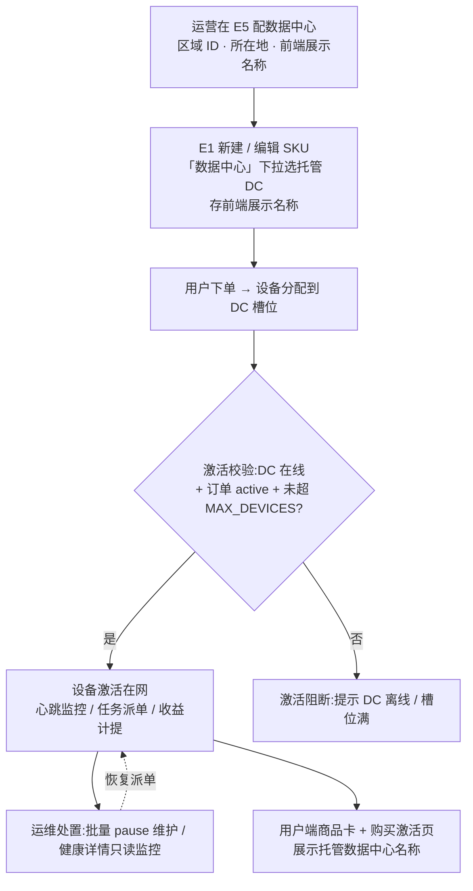

# Nexion 运营后台 · 产品更新日志

> **范围**：运营控制后台（`Nexion-admin-prototype`，dev :3002）的功能更新。前端（uniapp）日志在 `Nexion-uniapp/docs/前端产品更新日志.md`。
> **目的**：对齐产品进度——每次的新增 / 修改 / 移除功能记录在此。
> **图标**：🆕 新增 · ✏️ 修改 · 🗑️ 移除。**格式**：标题 → 概述 → 要点 → 入口 → PRD 章节。**顺序**：最新在上。
> **维护**：后台功能任务收尾在最上方当天日期下追加一条；纯 UI / 文案打磨可省略或合并记录。

---

## 2026-07-12

### ✏️ I2「全网真实事件池」改为真实业务事件闭环

**概述**:移除只能填写“池数量”的伪配置，改为从真实业务终态记录同步、脱敏、去重、过期和按权重抽样；没有真实事件时 social 通道明确跳过，不生成占位内容。

**✏️ 修改**:
- 提现到账、V 等级晋升、Genesis 成交和完整小时新增用户分别读取真实业务表；AI 客户消费因尚无真实计费来源标记为“数据源未接入”，禁止用算力收益或 Mock 替代。
- 新增真实事件明细、类型/状态筛选、同步、抽样预览、停用、恢复、立即过期和软删除；管理端仅返回与事件池行绑定的 `evt_` 引用，不返回或哈希原始订单号，用户、地区和金额均按脱敏口径展示。
- 事件以来源系统、事件类型、来源事件号复合唯一约束幂等入池；只抽取有效且未过期的数据，概率改为一次性编辑全部类型且合计必须为 100%，不再静默修改其他类别。
- 真实事件列表改为数据库端筛选与分页，返回总数；运行时按事件类型独立取候选，并使用类型优先复合索引，避免大池中热门类型挤掉稀有类型。
- 中文、越南语和英语预览与实际派发共用 social 已发布模板和占位符渲染器；通道未启用、模板未发布或无候选事件时不会生成伪预览。

**验证口径**:后端服务/控制器/SQL 契约测试、MySQL 迁移重复执行、前端契约测试、TypeScript 和 production build 纳入收尾验收。

**入口**:`/content/nova`(I2 Nova 推送运营)。

### ✏️ I2～I7 内容域补齐真实 CRUD、结构化配置与用户端运行闭环

**概述**:系统性修复 I2～I7 中“按钮只有展示、下拉来源不明、英文状态直出、组合条件被压成整段文本、管理端改动未进入用户端”的流程缺口。所有业务目录改读后端权威数据，内容发布、通知下发、披露确认和课程奖励补齐事务、状态机、权限与幂等约束。

**✏️ 修改**:
- **I2 Nova**:通道与推送模板提供真实 CRUD；检查间隔和同一用户冷却时间改为结构化时长；模板内容支持中文、越南语和可选英语，通道与跳转位置来自后端目录；编辑模板自动停用通道，重新发布后才允许启用。
- **I3 通知 Campaign**:受众改为 P 阶段范围、语言、注册天数三条件并集内“同时满足”；通知类型与跳转位置来自后端中文目录；下发按真实用户批量入通知流，支持空受众拒绝、并发防重、失败恢复、服务端 CAP/TTL、用户分页读取与标读。
- **I4 信任中心**:版块内容改为结构化字段和独立版本列表，支持新建草稿、编辑、删除、发布、下架与从后端历史版本回滚；状态统一中文，发布与回滚执行高敏权限和审计门槛。
- **I5 风险披露**:法域、适用国家/地区和目标版本全部来自后端目录；固定七章支持中文、越南语和可选英语；发布只读取已保存草稿快照，并把适用用户确认状态置为过期；新增当前披露、确认和受限动作检查接口。
- **I6 i18n**:词条支持中文、英语、越南语版本化 CRUD；发布强制已有一致草稿、三语镜像和占位符一致，发布、归档、完整性扫描与修复均在事务内执行；移除无真实运行支撑的假 A/B 开关。
- **I7 教程中心**:课程、测验和版本历史提供真实 CRUD/发布/回滚；课程与题目均支持中越英三语；用户端课程列表、详情、答题、完课和 NEX 奖励改读真实接口，奖励账本按用户×课程×版本幂等，发布与回滚受 B1 覆盖率红线和专用权限约束。

**验证口径**:前端 TypeScript、Next production build、内容域契约测试、uniapp 类型检查、后端完整 Maven 测试、MySQL 增量迁移重复执行、真实登录接口与浏览器页面流程均纳入本次收尾验收。

**入口**:`/content/nova`(I2) · `/content/notifications`(I3) · `/content/trust`(I4/I5) · `/content/i18n`(I6) · `/content/learn`(I7)。

### ✏️ 恢复独立 I7 教程中心并打通 A6/A7 动态侧栏

**概述**:修复数据库已配置 I7、角色也已授权，但前端静态注册表仍把 I7 合并到 I6，导致左侧菜单缺失的问题。I6 现在只管理国际化词条，I7 独立管理课程、推荐位、奖励和效果指标。

**✏️ 修改**:
- 登录与 session 返回经 A6 角色菜单绑定过滤后的 A7 有效菜单节点；A6 决定可见范围，A7 决定名称和排序，未部署或路由不匹配的节点按白名单拒绝渲染。
- 恢复 I7 `/content/learn` 导航和页面注册，删除原 `/content/learn → /content/i18n` 重定向；I6/I7 复用同一真实后端数据与动作契约，但各自只展示所属业务区。
- I6/I7 写按钮按 A8 权限码收口；只读角色不再看到新建、发布、下架、换推荐课或奖励调整，高敏奖励仍单独要求 `content_i7_course_reward_adjust`。
- 教程数量和分类数改为真实接口动态统计，空库显示明确空态；控制台聚焦或每 60 秒刷新 session，使 A6/A7 调整同步到已打开的侧栏。
- 交互登录和首次改密成功后强制刷新文档，避免浏览器继续运行部署前的旧 SPA 脚本而隐藏新菜单；会话凭证仍只保存在 HttpOnly Cookie。
- 强制改密账号不下发菜单节点；超级管理员读取全部启用且未删除的 A7 节点，普通账号只读取有效角色绑定节点。

**验证口径**:前端 RBAC 契约 13/13、TypeScript、Next production build、I7/登录刷新 Playwright 2/2 通过；后端 Maven 1071/1071、真实登录与 session 均返回 I7「教程中心」及 `/content/learn`。

**入口**:`/content/i18n`(I6 i18n 文案) · `/content/learn`(I7 教程中心) ｜ **关联**:A6 角色管理 · A7 菜单管理。

### 🆕 I1 补齐真实 A/B 实验创建、启动与稳定分流闭环

**概述**:I1 实验面板不再只有说明和历史查看；运营人员可从已有文案内容版本创建待启动实验，确认后启动，用户侧由后端完成受众校验、稳定分桶、曝光与转化归因。

**🆕 新增**:
- 文案池提供“创建 A/B 实验”入口；只能选择同一文案下至少两个非草稿内容版本，分流比例必须合计 100%，受众条件直接继承文案版本并只读展示。
- 创建后进入“待启动”，启动动作要求二次确认和操作理由；创建、启动、停止、采纳均使用真实接口，具备事务、行锁、幂等、状态机校验与强制审计。
- 用户侧新增按文案键查询投放内容和转化上报接口；后端按实验与用户稳定分桶，持久化 Sticky 分配，并保证曝光只记一次、同一转化键幂等。

**验证口径**:前端契约测试、TypeScript、production build、Playwright 实景流程；后端完整 Maven 测试、MySQL 迁移及真实接口联调均纳入收尾验收。

**入口**:`/content/copy-ab`(I1 转化文案 A/B) ｜ **PRD**:后台 PRD v4 §I1 已同步创建、启动、继承受众及接口口径。

## 2026-07-11

### ✏️ I1 文案版本改为独立配置目录，新增文案从启用版本中选择

**概述**:纠正此前把“文案版本列表”仅实现为单条文案发布历史的偏差。I1 现新增独立文案版本配置目录并放到文案池上方，目录提供新增、读取、编辑、启停和删除闭环；原逐文案版本表明确改名为“文案内容历史”。

**✏️ 修改**:
- 文案版本目录字段统一为版本标识、名称、说明、状态、排序、引用数和修订号；版本标识创建后不可修改，已被任意内容历史（含软删审计墓碑）引用时禁止删除，可改为停用。
- 新增文案及基于发布版新增内容版本，必须从 ACTIVE 目录项下拉选择；移除“首版版本号 v1 · 系统自动生成”的错误展示和后端强制 `v1` 逻辑。
- 新增 / 编辑弹窗复用标准下拉表单结构，字号与相邻字段统一；版本配置表的正文、表头、标识和按钮使用统一字号层级。
- 后端新增真实目录表与 CRUD API，写操作要求 I1 写权限、理由、幂等键、revision 并发校验和强制审计；删除带历史引用保护。

**验证口径**:前端 Node 契约 27/27、TypeScript 0 错、Next production build 通过、I1 Playwright 1/1；后端 Maven 1023/1023，目录迁移在本地 MySQL 重跑成功。

**入口**:`/content/copy-ab`(I1 转化文案 A/B) ｜ **PRD**:后台 PRD v4 §I1 已同步独立版本配置与内容历史双层口径。

## 2026-07-08

### ✏️ 创世节点「排放」术语迁移收尾:后台全域从「分红」统一到「排放」

**概述**:承接前端 2026-07-07 的创世节点(Genesis)分红→排放改造,把运营后台全域从旧的「日分红」叙事统一到「NEX 协议排放」。此前后台几乎没跟改(「排放」只在 5 个文件),本次全域铺齐,并消灭「同一笔负债三个名字」的自相矛盾(单源写「日分红承诺」、页面写「排放承诺」、同页内两处又打架)。

**✏️ 修改**:
- **G4 创世经济面**:分红保底率→排放保底率、「排放派发监控」口径、lifetime 分红→排放、派发池/批次/基数口径术语全统一;科目 4 引用与单源对齐,页内三处名字不再打架。
- **财务单源(B1 双账本)**:科目#4 label「Genesis 日分红承诺」→「Genesis 排放承诺」,三处散落硬编码(`ledger.ts` 单源 / 流动性看板 / B 域注册表)同步一致,双账本三面显示不再打架。
- **全域铺开**:D3 到期负债预测、L3 财务报表、L4 报表段、B/F/G/L 注册表摘要、命令中心到期预测、术语表 genesis 定义、紧急开关矩阵 cap/desc、节奏预算注入、财务持仓卡、导航提示等全部 genesis「分红」→「排放」;配套 6 个工程台账 + 2 个 verify manifest 同步。
- **保留**:领导池分红 / NEX 持有者分红(nex-div)/ 佣金分红(非创世,原样);代码标识符(`G.genesis.dividend`·`divBase`·`genesisDividendUsdt`·`dividendSharePct`·`genesis_div` 等)与改造 codename「分红延期改造」不动。

**验证口径**:tsc 0 错、`verify` 238 项全绿(canon 数字口径 / CGM 字段覆盖 / 动作完整性 / 全 needle,「排放派发监控」needle 已对齐)、实景 3 页(G4 genesis / 双账本 / D3)console 0 且科目#4「Genesis 排放承诺」渲染在应付负债结构;nexion-audit 五层 + 2 独立对抗 agent 收尾 confirmed **P0=P1=0**(运行时零漏改零误改、9 个代码标识符完好、科目#4 单源三处一致)。

**入口**:`/finance-products/genesis`(G4)· `/overview/dual-ledger`(B1)· `/finance/pool`(D3) ｜ **PRD**:已同步根 PRD 后台 v4(G4/B2/D3/J1 genesis 排放术语)+ 后台开发落地规格(repo 副本由 push 脚本 root→repo 覆盖)。

## 2026-07-07

### 🆕 M3 即时会话台:坐席消息补「已读 / 未读 / 用户正在输入」状态

**概述**:M3 客服会话台的坐席消息补齐送达状态。坐席回复后,该条消息尾部显「未读」,模拟用户读取后转「已读」;随后显「用户正在输入…」三点气泡,最后到达一条模拟用户短回执,形成「未读 → 已读 → 输入中 → 回执」完整对话闭环,与前端用户端会话中心镜像。

**🆕 新增**:
- 消息线尾部送达回执(仅最后一条坐席消息显示,对齐 iMessage 惯例);seed 会话按前端 unread 语义标好 `status`(顾问会话最近两条主动触达=未读,已解决会话=已读)。
- 共享消息组件 `MessageThread` 加回执渲染 + 用户「正在输入」三点气泡(左侧,`prefers-reduced-motion` 下停动画)。
- 坐席回复触发的三阶段中,**已读态落库持久**(消息 `status` 写入会话存储 · reason=ui-state 不触发 A2 高敏审计):切走切回、刷新都不回退,镜像真后台已读回执是服务端事实;「正在输入 / 用户短回执」保持实时瞬态(切走即停、不落库,真后台由 WS typing 事件驱动)。`SessionMsgStatus` 枚举镜像前端 `ConvMessageStatus`,接真后台零重写。
- 已读落库读取**最新会话镜像**(非延迟回调的旧闭包):避免「标记已读」用发送前快照覆盖、把刚发的坐席回复吃掉(墨菲复验实测抓到并修复的丢消息回归)。
- 回执 / 输入中覆盖**全部坐席→客户消息路径**:文字回复、推送商品卡、单客户主动发起会话开场白三处同享(audit 对抗层抓到初版只接了文字回复一处,已补齐);人群群发无单一读者不模拟。

**验证口径**:tsc 0 错、`verify`(除并行改动中的 genesis needle 外)全绿、M 客服面专项 audit 通过、三个 M3 needle(主动发起会话 / 转工单 / 转入待处理)实景命中;Playwright 实景确认坐席回复后 `未读→已读→输入中→用户回执` 四阶段闭环、切走切回 / 刷新已读不倒退、消息条数不减(丢消息回归已排除)、推送商品卡同享回执,render 0 错。nexion-audit 五层对抗:2 独立 reviewer 提报 1 P1(回执只接了文字回复一处)→ 已补齐 pushSku / 单客户 runInitiate 并实景复验 → 收尾 confirmed P0=P1=0。

**入口**:`/service/sessions`(M3 即时会话台) ｜ **PRD**:已同步后台 PRD v4 §I9(会话详情回执/输入中 + 字段镜像门补 `ConvMessage.status`)+ 前端 PRD v3.7 §11.8.4/§12.9a。

### ✏️ E1 上架节奏门去代际 + 新增「置换侧抢先购」开关

**概述**:E1 面板全面去除代际概念——「代际发布门」更名「上架节奏门」(控制 Pro v2 / Rack P2 分批上架时点,机制不变),发布规则里的固定换新折扣字段($300/$800)删除(抵扣唯一来源=E3 产出阶梯);SKU 管理不再有产品代际、被替代为、以旧换新折扣三个字段。新增运营开关**「置换侧抢先购」**(默认关闭):开启后持有可置换设备的用户可在机型正式上架前 N 天(档位 7/14/30/60/90)通过升级置换提前购买,商城正门不受影响——把新机预售留作置换专属特权由运营掌控。

**✏️ 修改**:
- 上架节奏门时间线 / 发布时点表 / 阶段配置 / 强制提前开放等全部动作与文案按新口径重写;任何 SKU 均可挂上架门(不再限"二代及以后")。
- 「置换侧抢先购」配置行落在上架节奏门卡内:总开关 + 提前天数双下拉点选,走操作确认 + 理由必填 + 审计;与前端同名配置三端对账(canon 哨兵 +2 项)。
- 数据报表(L4)与全站导航、术语表、搜索提示同步去代际词。

**验证口径**:tsc 0 错、`verify` 238 项全绿(canon 93 / 阶梯双副本 39 键 / SKU 字段镜像超集)、3002 实景走查 11 项全过(含开关"开·提前 60 天"真写回显与还原),console 0。

**入口**:`/devices/pricing`(E1 商品目录 & 上架门) ｜ **PRD**:落地规格 RELEASE_GATES 实体 + 前端 PRD §7.1。

## 2026-07-06

### ✏️ E3 改版:「设备衰减」→「任务产能节奏」+ 置换抵扣改产出阶梯

**概述**:设备收益递减的机制叙事从「硬件衰减」全面换成「AI 任务池升级 → 低阶任务量随月龄减少」(数值与原三段曲线完全一致,等效换皮);以旧换新从「按持有月龄算残值 + 最短持有 6 个月门槛」改为「随时可下架置换,抵扣 = 实付价 × 阶梯比例,按该设备累计产出占实付价的比例落档,产出越多抵扣越小」。全部参数运营可调、三端数字对账把守。

**✏️ 修改**:
- 左卡改「任务产能节奏」:段1/段2/段3 每月产能变化、产能下限、产能分段周期(多字段一次调齐)照旧可调;新增「新机任务补贴天数」(纯展示层,不进结算)与「参与任务递减」逐 SKU 开关(8 个设备各自下拉选 参与/免,手机、Cloud Share、电脑共享默认免)。
- 右卡改「升级置换阶梯」:置换总开关、阶梯分档界点(4 值)、各档抵扣率(5 值,默认 75/60/45/30/15%)、仅限升级更高价设备、单笔最多抵扣台数;残值率与最短持有月数两个旧参数删除(阶梯天然抗套利:抵扣只抵货款不入余额)。
- K2 风控「换新套利」视图从「不满持有月数拦残值」改为「高频下架置换 + 礼金/返佣叠加」的行为闭环监控;单用户 360 设备卡去掉代际列,「换机」动作改为同型号硬件置换。
- 操作说明手册(E3 右上角)整册同步新叙事。

**验证口径**:`tsc` 0 错、`verify` 238 项全绿(canon 数字对账扩到 91 项,含阶梯三端 18 项新防线;参数哨兵扩到 39 键双副本一致 + 阶梯递增/递减合法性 + 旧键残留 0)、3002 实景走查。

**入口**:`/devices/trade-in`(E3)· `/risk/abuse`(K2)· 用户 360 设备卡 ｜ **平台**:运营后台 ｜ **规格**:`PRD/specs/FEAT-DEV01-task-capacity-schedule.md` + `FEAT-DEV02-tradein-ladder.md`(主人 2026-07-06 签字)。

### 🆕 K2 新增「短信闸门参数」调参面板

**概述**:风控 K2 页新增短信验证码闸门的 5 个参数调整面板(重发冷却 / 滑块触发次数 / 验证码有效期 / 输错上限 / 滑块票据有效期),与前端登录、注册、重置密码三场景的发码判定同键同源;被短信轰炸时运营可即时收紧阈值,正常用户误伤多时可放宽,不再找开发改代码。

**🆕 新增**:
- 5 个参数各自独立「调整」入口,走操作确认 + 必填理由 + 审计留痕;数值弹窗带单位与下限校验。
- 面板注明发送判定顺序(冷却 → 24h 限频含滑块票据 → 放行)与生效边界(只影响后续发送,已发出验证码按签发时值执行)。

**验证口径**:`tsc` 0 错、`verify` 全绿(含 2 条本面板新哨兵)、3002 实景走查(面板渲染 / 调整弹窗 / 审计写入)console 0。

**入口**:`/risk/abuse`(K2 套利 & 刷量检测) ｜ **平台**:运营后台 ｜ **规格**:CGM-F-021;前端联动 `PRD/specs/FEAT-AUTH01-otp-antibomb-gate.md`。

## 2026-07-03

### ✏️ 操作确认弹窗「执行摘要」默认收起

**概述**：所有高敏操作确认弹窗顶部的「执行摘要」块改为默认收起(打开弹窗只显示「查看详情 ▼」,点击才展开),减少弹窗初始信息密度;展开后内容不变。

**✏️ 修改**：
- 全后台操作确认弹窗共用的执行摘要组件默认折叠;展开 / 收起交互与内容(要做什么 / 影响 / 提交前 / 业务规则)保持不变。

**验证口径**：`npx tsc --noEmit` 0 错、`verify` 237/0(含 walkthrough 自动展开折叠区读业务规则)、3002 实景确认弹窗默认收起 + 点开正常 + console 0。

**入口**：任一高敏动作「调整 / 处置」弹窗 ｜ **平台**：运营后台 ｜ **PRD**：纯交互默认态,无需同步。

## 2026-06-30

### ✏️ 三端入口首页新方案同步（SPEC-6）

**概述**：配合前端 SPEC-6,后台映射把 D 表 M8 从“旧三页撤回态”更新为“新 `entry-surfaces` 三端入口首页”。本次不新增后台操作页面;当前三端首页为评审入口与静态首页,若进入运营化再接 I1 文案 A/B 与 I6 i18n。

**✏️ 修改**：
- `docs/FRONTEND-LEVER-MAP.md` 的 M8 更新为新三端入口首页,并保留旧 `/home-signed`、`/home-h5`、`/home-cloak` 不得恢复的红线。
- `scripts/fe-be-mapping-coverage.mjs` 的 M8 证据新增 `entry-surfaces` 四个路由与共享组件检查。
- 后台开发落地规格同步三端 SPEC-6 口径:当前不开放后台改文案,后续运营化接 I1 / I6。
- 静态评审页启动隔离纳入前后台验收口径:首帧不得触发账户绑定、会话认领、业务轮询、账单写入或里程碑弹层。

**验证口径**：`node scripts/fe-be-mapping-coverage.mjs` PASS 后可证明 M8 新路由存在、旧路由缺席、后台 PRD 和产品日志同步；admin `bash scripts/verify.sh all` PASS（165 checks / 0 failed）；uniapp `node scripts/spec6-entry-surface-runtime.mjs` PASS,证明四个评审路由冷启动不写账户云、会话、设备身份、账单或里程碑状态。

**入口**：后台文档与 verify gate;无新增后台运行入口 ｜ **PRD**：`PRD/三端架构改造/specs/SPEC-6-三端首页新方案.md` + `docs/FRONTEND-LEVER-MAP.md`。

### 🆕 三端改造映射收口与覆盖门（SPEC-5）

**概述**：把三端架构改造 D 表 M1-M11 并入后台 `FRONTEND-LEVER-MAP.md`,并新增 `fe-be-mapping-coverage` 机器门。该任务不新增后台操作页面,目标是防止“前台业务有变化、后台控制面或 PRD 漏同步”。

**🆕 新增 / ✏️ 修改**：
- `docs/FRONTEND-LEVER-MAP.md` 新增“三端架构改造增量映射（SPEC-5 并表）”,逐行覆盖 M1-M11。
- M2 明确“激活登记为前台固定行为，本期无后台登记开关”；后台只承接登记后的算力档位与结算系数。
- `scripts/fe-be-mapping-coverage.mjs` 新增映射覆盖检查:校验 D 表、admin 映射、后台 PRD、关键源码证据、旧三首页删除事实,并阻断运营面工程字段泄漏。
- `scripts/verify.sh` 接入三端改造 FE-BE 映射覆盖 gate。
- K6 规则树状态 / 渠道多选条件改为中文多选控件,保存内部枚举,交互层只展示运营可读状态名。
- 后台开发落地规格声明 `FRONTEND-LEVER-MAP.md` 与 `fe-be-mapping-coverage` 为三端映射收口依据。
- 根目录后台 PRD 副本已同步 admin 内权威副本。

**验证口径**：admin `npx --no-install tsc --noEmit` PASS；`node scripts/fe-be-mapping-coverage.mjs` PASS（M1-M11 全覆盖）；admin `bash scripts/verify.sh all` PASS（165 checks / 0 failed）；uniapp `bash scripts/verify.sh` PASS（83 pass / 0 fail）；双 agent 复审 PASS。

**入口**：后台文档与 verify gate;无新增运行入口 ｜ **PRD**：`PRD/三端架构改造/specs/SPEC-5-映射收口与覆盖门.md` + `docs/FRONTEND-LEVER-MAP.md`。

### ✏️ C5 会话管理口径同步 SPEC-4

**概述**：配合前端 SPEC-4,后台 PRD 将用户会话口径从“异端登录自动强踢”调整为“多载体会话并存 + 指定会话下线 / 全部其他会话下线”。本次不新增后台页面,沿用既有 C5 安全与会话、C2 账户操作承接处置。

**✏️ 修改**：
- C5 session 列表与 revoke-session 契约明确支持多载体 session。
- 强制登出仍走业务确认 + 理由必填 + A2 审计。
- 三端架构 D 表 M10/M11 已回填:账户数据由前台 account-cloud mock 第一阶段承接;载体入口识别无直接后台可控项,白 APP 接管仍归 K6 Janus C2。
- 前台 SPEC-4 复审修复已同步:同设备刷新不重复会话,被下线会话冷启动不重铸 active session,账户云任务身份不混合、`currentTask` object/null 边界不被陈旧 tab 误清空或恢复、base 为空且两端同 id 任务时不回退任务开始 / 完成时间、任务历史不丢、提现状态不回退,中文安全页和钱包提现流程无英文时间 / 枚举文案泄漏。

**验证口径**：admin `node scripts/fe-be-mapping-coverage.mjs` PASS；`node scripts/uniapp-port-coverage-audit.mjs` PASS；`npx --no-install tsc --noEmit` PASS。前台 `bash scripts/verify.sh` PASS（83 pass / 0 fail），并以 Playwright H5 实景确认中文钱包 / 提现追踪页无英文状态枚举和硬编码相对时间泄漏。

**入口**：后台 PRD 文档同步;无新增运行入口 ｜ **PRD**：`docs/PRD/Nexion_运营控制后台_开发落地规格.md` + `PRD/三端架构改造/D_后台可控映射.md`。

## 2026-06-29

### ✏️ K6 Janus C2 配合 SPEC-3 三首页撤回

**概述**：主人确认前一版三端首页不对后,前台三条原型首页已删除;K6 保留策略中心能力,远程地址默认文案从“白壳接管首页”改为“正盘默认首页”,避免指向不存在的页面。

**✏️ 修改**：
- `janus-c2-store.ts` 远程地址选项显示为「正盘默认首页 / 备用接管线路 / 活动接管线路」,不在 UI 暴露 key 名。
- `labels.ts` 新增远程地址文案单源;设备详情、看板、审计日志、审计 JSON 导出全部走中文化映射。
- `evaluate.ts` 让策略适用渠道、定向邀请码、灰度比例、新鲜度保护、最小决策间隔、每日建议 / 命中上限参与判定与干跑,避免“可编辑但不生效”。
- 策略编辑器的定向邀请码改为逐项输入 / 删除 / 添加;规则编辑器的多取值条件改为逐项输入 / 删除 / 添加,禁止单框多值。
- `scripts/verify.sh` 调整 K6 SPEC-3 source contract,检查策略增删改、状态可编辑、规则树可编辑、远程地址中文文案、无工程枚举 UI 泄漏、无单框多值。

**验证口径**：admin `npx --no-install tsc --noEmit` 0 错;K6 source contract 以“正盘默认首页”为默认远程地址文案;后台全量 verify 仍有既有全域旧 needle,不作为本次撤回动作判据。

**入口**：风控与反作弊 → Janus C2 控制台（K6）｜ **PRD**：`Nexion-janus/PRD/Nexion-Janus_C2控制后台功能设计PRD_v1.0.md` + 后台开发落地规格 K6 行已同步。

### 🆕 E6 电脑算力配置补完（显卡映射 + 下载配置）· SPEC-2

**概述**：`算力与设备配置（E6 · /devices/compute-config）` 从 SPEC-2 占位补成真实配置面——覆盖电脑共享算力入口开关、在线加成系数、G1-G6 显卡档位映射、单个显卡识别词增删改、客户端下载地址、下载页中英标题 / 说明。PC 客户端仍按 DR-7 不做真实桌面端;本期落后台可控结构与前端演示链路,默认关闭,开启后用户端只出现弱入口与下载页。

**🆕 新增 / ✏️ 修改**：
- `lib/mock/admin/compute-config.ts`：新增 `COMPUTE_GPU_TIERS`、识别词槽位、下载内容配置;G1-G6 TOPS 单调,客户端下载地址默认空。
- `app/components/domain-views/e-tabs/e6-compute-config.tsx`：E6 页面渲染入口开关、在线系数、显卡映射表、下载配置;档位编辑为「档位展示名称 / 算力 TOPS」两字段;识别词新增 / 编辑 / 删除均为单词条操作;下载文案四字段独立可清空。
- `app/components/domain-views/design-kit.tsx` / `e-view.tsx`：支持多字段弹窗字段可为空,并让 E6 配置改动审计记录登录操作者;保存路径补齐系数、URL、关键词、TOPS 递增、下载文案长度业务校验。
- `scripts/verify.sh`：新增 E6 source contract,覆盖非占位渲染、单框单值、四字段下载文案、登录 actor、TOPS 单调、禁工程字段可见文案、关键词原始槽位索引、比例型系数 0 边界。

**验证口径**：admin `npx tsc --noEmit` 0 错;`node scripts/a2-audit-coverage-sentinel.mjs` PASS;E6 source contract OK。实景(3002 `/devices/compute-config`):H5 系数 0 可提交、999 禁用;非法下载 URL 禁用;G3 TOPS 破坏递增禁用;入口开关、识别词增改删、档位多字段编辑、下载 URL 设置 / 清空、下载文案四字段清空 / 编辑、A2 审计 actor=`本地预览` 全部通过;0 console error。双 agent 最终复审 PASS,P0=0 / P1=0 / P2=0。

**入口**：设备与商城 → 算力与设备配置（E6）｜ **PRD**：已同步后台 PRD V2 `#### [E6] 算力与设备配置` + 后台开发落地规格第 1/2/3/4/9 章;三端改造 SPEC-2 完成回执与 D 表 M5-M7 已回填。

---

### 🆕 K6 Janus C2 控制台(重建并建到 PRD 完整)· SPEC 0–5

**概述**：K 域重新加回 `K6 Janus C2 控制台`(`/risk/janus-c2`),以设计稿 Janus C2 v3 为视觉基础,按 `Nexion-Janus_C2控制后台功能设计PRD_v1.0` 建到富功能完整——覆盖 12 态设备状态机、设备队列、手动状态闭环、多策略增删改、规则树编辑器、干跑、版本/灰度/回滚、健康度分级、审计日志、报表导出。撤销 6-28「🗑️ 移除 K6」条(K6 现为现行功能)。mock 驱动,每个 store/action backend-replaceable。

**🆕 新增**(分 5 SPEC,每个过 tsc 0 错 + Playwright 实景 + 双 agent 审查修到 P0=0):
- **SPEC 0 地基**:`lib/mock/admin/janus-c2/*`(types/labels/devices/strategies/rules-catalog/scoring/transitions/health/evaluate)+ `lib/store/admin/janus-c2-store.ts`(设备覆盖 / 策略 CRUD / 审计 append-only)+ K6 注册(console-nav L2 数 72、registry/k、k-view tab、verify needle)。文案契约:12 态 + 8 动作 + 操作符全运营可读中文,UI 零工程化 code 字段。
- **SPEC 1 设备队列 + 状态机 + 详情**:12 态机 + 状态来源 + 队列全列/筛选/排序/分页 25-100 + §13 详情抽屉(会话 / 成熟度 / 环境 / 判定轨迹 / 操作区)+ §10 建议分 + §11 优先级公式。
- **SPEC 2 手动状态闭环**:§9 逐字段弹窗(禁单框多值)+ §9.3/§9.4 允许/禁止流转矩阵 + 权限门 + 单人强确认 + before/after A2 审计。
- **SPEC 3 策略中心 CRUD**(headline①):多策略增删改 + 状态编辑(草稿/生效/暂停/归档)+ 模板模式 + 编辑器(状态/优先级/动作/适用范围/保护条件)。
- **SPEC 4 规则编辑器 + 干跑 + 版本**(headline②):交互式规则树(全部/任一/满足N条/排除/加权评分 + 嵌套 + 字段/操作符/枚举值全下拉)+ 自然语言解释 + 干跑预估(命中/冲突)+ 发布确认(干跑门 + 发布说明)+ 版本快照/回滚(差异 + 回滚原因)+ 灰度比例。
- **SPEC 5 看板 + 健康 + 审计 + 报表**:§12 健康度分级(HEALTHY/WARNING/RISK/CRITICAL + 10 指标 + 异常下钻 + 建议处理)+ §16/§19 审计日志(before/after + 来源上下文 + 筛选/搜索 + 导出留痕)+ §20 报表导出(漏斗 + 健康 CSV/JSON)+ §5.2 看板(待处理队列 + 命中漏斗 + 最近审计)。

**验证口径**:admin `tsc --noEmit` 0 错。实景(3002 `/risk/janus-c2`):规则编辑器改满足条数 3→5 → 干跑命中 9→6;发布/回滚走确认弹窗带干跑/版本差异 + 必填理由并落 A2 审计;健康度 RISK + 10 指标 + 异常下钻;审计表 before/after 全中文翻译(状态 草稿→生效中);CSV 导出格式正确 + 写审计;0 console error。每 SPEC 双 agent(代码+流程 / 完整性+文案)审查修到 P0=0。
> verify.sh 已含 K6(nav 路由 72 + `命中漏斗` needle);全量 verify 当前因**无关的** uniapp feature-mapping 走查(G1「USDT 锁仓池」缺失)RED,与 K6(admin)改动无关,待主人单独处置。

**入口**:风控与反作弊 → Janus C2 控制台(K6)｜ **PRD**:`Nexion-janus/PRD/Nexion-Janus_C2控制后台功能设计PRD_v1.0.md` + 后台开发落地规格 §域 K 同步。

---

## 2026-06-28

### 🆕 E6 在线加成系数（载体在线分层数值参数）· SPEC-1

**概述**：`算力与设备配置（E6 · /devices/compute-config）` 新增「在线加成系数」配置组——把此前硬编码在前端的载体分层系数升为运营可控数值参数。两个系数分别是「H5 基础托管系数 0.6」与「App 连续在线满额时长 2 小时」,与用户端在线加成口径一致（DR-7：各端各自 mock，结构 / 键一致，PROD 服务端下发）。

**🆕 新增**：
- `lib/mock/admin/compute-config.ts`：新增在线加成系数注册表,与前端在线加成配置保持业务口径一致。
- `e-tabs/e6-compute-config.tsx`：新增在线加成系数区——每个系数显示当前值 + 「调整」按钮,操作确认弹窗提供「目标新值」独立输入并落 A2 审计；退休 SPEC-2「在线加成系数」占位、修正 EStats / 页脚口径。

**验证口径**：admin `tsc --noEmit` 0 错。实景（3002 `/devices/compute-config`）：系数组渲染 H5 基础托管 0.6 / App 连续在线满额 2 小时（= 用户端值）；「调整」弹操作确认（目标新值 + server-canonical 审计文案 + 确认），0 console error。

**入口**：设备与商城 → 算力与设备配置（E6）｜ **PRD**：已同步后台 PRD V2 §10 域 E 新增 `#### [E6a]` 在线加成系数 + `#### [E6b]` 平台特性开关（7 段 + ④a 弹窗规格 + ② 数据流水线 mermaid；走 nexion-admin-prd 4-镜头流水线编写，admin-prd-lint 过）。

---

### 🗑️ 移除 K6 Janus C2 控制台

**概述**：K 域移除 `K6 Janus C2 控制台`，入口 `/risk/janus-c2` 下线。C 域 `C2 账户操作` 仍保留，继续承接账户冻结、模拟登录、信任 / 禁入名单等既有账户处置能力。

**🗑️ 移除**：
- 导航与路由：从 `lib/nav/console-nav.ts` 删除 K6，`/risk/janus-c2` 不再出现在侧边栏、面包屑、路由清单和 K 域视图中。
- 页面实现：移除 K6 Janus C2 页面组件、数据 mock、Janus 专项 CSS、专项 proof 脚本与阶段化 SPEC / 审查证据。
- 产品口径：后台落地规格、全局后台 PRD、ops-actions manifest 不再把 K6 写成现行功能或高敏动作。

**验证口径**：`verify.sh` 的 nav 路由数改为 71，并新增 `/risk/janus-c2` 必须返回 404 的删除哨兵。

**入口**：无｜ **PRD**：后台落地规格与后台 PRD v4 已撤销 K6 现行描述。

---

## 2026-06-25

### 🆕 L6 用户行为热力图（数据与分析 BI 域新子模块）· 页面活跃热力矩阵 + 单页点击坐标下钻

**概述**：运营 / 产品此前看不到用户在前端到底点了哪、卡在哪个页面。L 域（数据与分析 BI）新增第 6 个子模块 L6，把前端各页的浏览 / 点击 / 停留 / 跳出按页面 · UX 层级聚合成热力矩阵，并可点页下钻到单页点击坐标热力（手机线框 + 热区）。只读报表域，不改任何业务规则（口径不属八项 KPI，与 L1/L2 正交互补）。

**🆕 新增**：
- L6 整页（`/analytics/behavior-heatmap`）：① **页面活跃热力矩阵**（行=页面按所选层级上卷，列=PV/UV · 点击 · 平均停留 · 跳出率，格色按强度；活跃维度按列归一化、**跳出率用绝对阈值警示色**，双图例）② 点行**下钻单页** SVG 手机线框 + 点击密度热区 + 区域占比（主 CTA / 内容列表 / 底部导航 / 顶栏，Top 区标「最热」）。
- 粒度可设：**全部（逐页）/ 一级（上卷入口）/ 二级（上卷板块）/ 三级（仅叶子页）** 4 档真区分；时间窗 24h/7d/30d；**可升降排序**（升序定位高跳出 / 低停留的流失页）；行尾 chevron rest 态可点提示 + 选中整行 tint。
- 数据全 backend-replaceable mock（`lib/mock/admin/behavior-heatmap.ts`：page catalog 全 83 路由按 UX 层级 + 确定性种子防 hydration 漂移 + 上卷聚合 + 单页坐标种子）；**导出行为热力序列 CSV**（聚合无 PII，落 `admin.report_exported` 审计）。
- 接线三大单源（console-nav L6 / registry/l.ts / l-view.tsx 的 FOLD + tab），verify nav 69→70；L 域 body 客户端渲染故按 L1–L5 模式只走 nav 自动 HTTP200、不加 body needle（验证靠浏览器实景）。

**前端依赖（PRD 已写清主人强调的「对应前端需求」）**：L6 真跑需前端 uniapp 新增两个 client 行为埋点 `app.page_viewed`（每页 `onShow` + 离开回填停留）/ `app.element_clicked`（tap + 归一化坐标 + zone）+ page catalog 同步，经 A4 schema registry 注册——为本子模块 BI cutover 的 **blocking 前置**（详见后台 PRD Ch16 [L6] ① 前端埋点需求表）。

**实景验证**：tsc 0 · 哨兵全绿（nav 70 / interaction / inner-block / ops-actions / a2-coverage）· Playwright 实景：矩阵 80 行、粒度上卷（全部 80→一级 16，「我的」聚合 34 页等）、三级过滤 22 叶子页、排序升降序（跳出 desc 顶 65.8% / asc 顶 9%）、聚合行下钻显提示、**导出→A2 审计页实时落账**、L1/L5 兄弟页零回归、console 0 · **nexion-audit v4 五层修到 P0=P1=0**（kill 2 误报）。

**入口**：/analytics/behavior-heatmap（侧栏 数据与分析 BI → 用户行为热力图）｜ **PRD**：✅ 已同步——后台 PRD v4 Ch16 新增 [L6] 8 段子模块（前端埋点需求 + page catalog + 4 维口径 + 只读纪律）+ §16.1 索引行 + §17 收口同步（admin-prd-lint 0；2 镜头审查 0 CRIT/HIGH，回源核实 pages.json=83 软化无源数字）。

---

## 2026-06-24

### 🆕✏️ H1 节奏骨架运营可配（总时长 / 当前运营月 / 阶段进度）· 全站当前节奏态收单源派生

**概述**：此前「12 月运营节奏」的**总时长**与**当前运营月**全站写死、任何地方改不了（违反「后台业务值必须可配置」铁律）；且多个面（B4 看板、L1/L4 KPI、D5 提现派发、F3 双轨封顶、首页脉搏）各自读 `PHASE.current` seed 快照，改节奏后会互相分叉。本次把「节奏骨架」做成 H1 运营可配单一真源，所有显示当前节奏态的活渲染面改同源派生。

**🆕 新增**：
- H1 Phase 调度器（`/growth/phase`）新增「节奏骨架」段两控件：① **节奏总时长** select 9/12/15/18/24 月（勾选不手输；< 9 月会令最短 P4 段退化为 0 月故设下限）② **当前节奏位置** 多字段弹窗（当前运营月 select + 本阶段进度 number，各值独立写键）。均经操作确认 + 理由必填 + A2 审计。改总时长后逐月旋钮矩阵行数随之增减、6 段按月数权重 [2,2,3,1,2,2] 等比重分布（默认 12 月精确复现旧 canon：月7=P3/月8=P4）。
- 真写键 `H1.rhythm.{totalMonths, currentMonth, phaseProgressPct}`（持久化 · backend-replaceable）；新增 `rhythmState(pget)` 单源 helper + `dialValueAt(pget, key, month)` 当月派发派生。

**✏️ 修改（同源镜像，8 面）**：B4 节奏状态看板 / H1 矩阵 + 效果归因表 / H1·D5 域头实时态 / L1·L4 KPI 当前 Phase·月 / D5 提现派发只读三项 / F3 双轨日封顶 / 首页 H 域脉搏 —— 全部改 `rhythmState(pget)` 派生，改总时长 / 当前月即时跟随。**架构根治**：废除易陈旧的 `H.phase.dial.*` 镜像快照，D5/F3 当月派发值直接从逐月矩阵 `@当前月` 派生（自动随当前月流转 + 键名零错配，修了「改当前月不流转」+「D5 键名 2/3 错配」两个潜伏一致性缺陷）。

**实景验证**：tsc 0 · canon 0 · 新增机器门 `rhythm-single-source-sentinel`（活渲染面禁直读 PHASE/CURRENT_PHASE 当前态，强制 rhythmState）0 命中 · Playwright 实景注入月9 验：D5 冷却 30d→45d / 惩罚费率 20%→25% / 合规 未激活→激活、F3 binCap+label「月9·P5」、L4 报表当前列移 P5、B4 路线图高亮移 P5、seed 回退（清键→月7·P3）、console 0 · **25-agent 对抗审计揪出 2 P1 + 3 P2（含我漏的 F3/L4 表格/h.ts），全修 + 复验**。

**入口**：/growth/phase（H1 节奏骨架）｜ **PRD**：✅ 已同步——后台 PRD v1 Ch7 [H1] ③(c2) 节奏骨架配置 + ④ 三键参数表 + 当月派发单源派生注 + §1.7 总时长可配注 + 逐月矩阵行数可配注（admin-prd-lint 0）。

---

### 🆕✏️ F4 领导奖池接双端单源 canon · 删自曝失真「顶部 10 人 80%」改派生真值

**概述**：F4「池/配额/大使/榜」的领导奖池区此前多处硬编码自曝失真口径——「顶部 10 人池占比 ≈80%」（用同一种子算真值仅 ~7.85%）、「参与 V8+ 用户 45」（与前端/PRD 的 V3+ 冲突，且与 0 持有人矛盾）、「本周已注入 $214,000 / GMV $4.28M」（与前端 $487,321 / registry $96,400 三源打架）。配合前端「补机制让叙事成真」（重校准全网领袖金字塔让头部集中为真，顶部 10 名领袖 = V8 星上将及以上 10 人分走 ≈61%），后台改为从镜像前端真源的 `LEADERSHIP_CANON` 全派生：池额 = 周 GMV × 比例、集中度 / 参与人数 / 各档份额运行时算，禁硬编码。

**🆕 新增 / ✏️ 修改**：
- `f-tabs/data.ts`：新增 `LEADERSHIP_CANON`（镜像前端 store：gmv/ratio/monthlyCap/unlockRank/各档 votes+pop）+ 派生 helper（池额/总票/合格数/顶部集中度）；`V_VOTES` 改为从 canon 派生；F1 `VRANK.pop` 同步为同一全网分布（V8+ 真实有人）。
- `f-tabs/f4-ops.tsx`：池额 stat/hero、集中度、参与门槛（V3+ 498）、结算措辞（周日快照 → 周一派发）全部从 canon 派生；删「≈80%」「V8+」「$214,000」硬编码；月度 cap 默认对齐 canon（$2.6M 护栏）+ 文案去掉未实现的「顺延」承诺；log2 票权柱改读 `pget`（声明 = 实现，调权重柱随之动）。
- `registry/f.ts`：领导池 metrics（本周奖池 $487,321 / 合格领袖 498 / 周日快照·周一派发）、分配权重组（资格门槛 V3+ / 等级权重指数翻倍 / 头部集中度 ≈61%，删与模型矛盾的「单人封顶 8%」）、F1 领导奖池资格 V6→V3 全部校正。
- `f-tabs/f1-vrank.tsx`（audit 抓的第 3 个领导池渲染面）：f-foot「V3+ 承担 80% 领导池分配」→ 派生「顶部 10 名(V8+)虹吸 ≈61%」；顶栏「V3+ 高价值 614」→ 派生 `leadershipQualifiers()`=498（与 F4/registry 合格领袖同源；会员数 498/100,459/0.50% 三处一致）。
- `f4-ops.tsx`（audit 强化 pget 联动）：池额随 `F.pool.ratio`(pget) 联动、集中度随 `F.pool.votes.*`(pget) 有效票权实时重算——使 f4-warn「调高权重→占比上抬」真兑现。

**实景验证**：tsc 0 · `leadership-pool-canon-sentinel` 双端单源门通过（含 f1-vrank 扫描 + 裸 80% 领导池指纹 + registry/f1 字面跟随 canon 正向断言）· nexion-audit **3 轮修到 P0=P1=0** · 3002 坐实 F1/F4 渲染 $487,321 / 顶部 10 名 ≈61% / V3+ 498 / 总会员 100,459，无 80%·V8·614 残留 · console 0 · **pget 联动注入实景证**（注入 ratio=8%→池 $779,714、V12 票权=2000→集中度 61%→77%）。（附带修复并行引入的 `h-tabs/h1-phase.tsx` 4 处 `setParam` number→string 类型回归，非本任务改动，为解阻塞门。）

**入口**：/network/leadership-pool（F4）+ /network/v-rank（F1 f-foot/顶栏）｜ **PRD**：✅ 已同步——后台 PRD v2 F4②（V_VOTES 展示口径 V3-V12 + 各档占比派生，删旧「用户侧仅 V3-V10」截断注记，**新增 server 周结算业务流程图 mermaid**）；前端 PRD v3.7 §8.5 机制/集中度派生口径同步 + 业务流程图。后台 F4 原已用 topConcentration 计算指标 + top1≤25%/top5≤60% 告警阈值（与模型自洽，无假 80%）。

---

### ✏️ 清理旧双控术语残留 · `no-double-sign` 验证门基线恢复绿

**概述**:运营后台代码注释/脚本里残留的旧双控术语已对齐 2026-06「双签机制取消」决议改写,`no-double-sign-terms` 验证门基线从 6 处残留(门按多正则重复计数报 10)→ **0 残留,恢复绿**。关键判定:PRD/SPEC 里「Maker-Checker」专指**已取消的旧双签机制本身**(SPEC D1:废除 Maker-Checker = 发起人≠复核人的双人审批),而新机制叫「按执行门槛分流 / 单人确认」;故这些注释属**误用废弃机制名称呼新机制**——改写源码对齐术语,优于给门加白名单(改写后门保持全部 banned 正则严格不变,对真残留的拦截力不削弱)。新机制本身(发起人不够权→入 pending 队列→有权者单人执行回写)语义未变,仅术语纠正。

**✏️ 修改**(6 处注释,跨 5 文件):
- `lib/admin/ops-authority.ts` / `lib/admin/propose-or-execute.ts`:「非双签」澄清语 → 「执行者一人 / 不引入第二人会签」。
- `lib/store/admin/pending-ops-store.ts`(2 处)/ `app/components/domain-views/a-tabs/a2-audit.tsx` / `scripts/a2-audit-coverage-sentinel.mjs`:「maker-checker」→ 「按执行门槛分流」。

**实景验证**:tsc 0 · `no-double-sign-terms` 门 0 残留(连验稳定)· 门正则未改(拦截力不减)· 对抗式 workflow(3 独立分类 + 设计审查)确认 6 行均非真双签残留、改写方向与 PRD 一致。

**入口**:无 UI 变化(纯代码注释/术语)｜ **PRD**:后台 v4 / 交互与确认机制改写 SPEC(双签取消决议,无需改——本次为代码术语向既有决议对齐)。

---

### ✏️ J1 Kill-Switch 矩阵移除单闸「应急熔断」按钮(回归 PRD)

**概述**:J1 功能开关总表每行原有「熔断」+「应急熔断」两个按钮,二者对闸的处置完全相同(都即时关停、server 当场拒绝下游、止血速度一致),「应急熔断」仅额外打一个 `emergency=true` 审计标记,但承诺的 SLA 压缩 / I3 升级 / 优先队列在原型里无任何下游消费——对运营者只是「两个看着一样的红按钮该按哪个」的认知负担。且 PRD §15 单闸仅定义 J1-MD1 熔断 / J1-MD2 恢复,「应急轨」是给批量场景(J1-MD3)的,单闸应急按钮 PRD 从未背书。本次删除使 UI 回归 PRD。

**✏️ 修改**:
- 删单闸「应急熔断」按钮;`killGate` 去掉 `emer` 参数,单闸熔断恒走常规轨(emergency=false)。
- 应急轨(emergency=true · A2 高亮 + SLA + I3 升级)收敛为唯一入口=侧栏「一键批量关停 / 发起应急关停」(对齐 J1-MD3,监管点名/法务场景),批量仍写 `J.killswitch.<key>.emergency`、矩阵「应急」列 badge 与恢复时清标记逻辑不变。
- 顺带清理孤儿 CSS `.matrix-tbl .acts button.emer`;ops-actions 台账 OPS-J-01 动作串「熔断/应急熔断/恢复/应急批量」→「熔断/恢复/应急批量」。

**实景验证**:tsc 0 · Playwright 实景(5 闸每行单「熔断」按钮 / 单闸应急按钮计数=0 / 批量应急按钮在 / 熔断仍开确认弹窗带理由 / console 0)· 动作门按 storeAction 反查不受影响。

**入口**:紧急与合规控制 J → Kill-Switch 矩阵 J1(`/emergency/kill-switch`)｜ **PRD**:后台 v4 Ch15 J1(无需改——本次为 UI 向既有 PRD 对齐,单闸应急本就无 PRD 定义)。

---

### 🗑️ A3 系统配置移除「服务器时钟·全平台时间单源」与「防重号策略」两卡

**概述**:运营后台 A3 系统配置页(`/platform/config`)按主人指令移除两张配置卡——(a)「服务器时钟·全平台时间单源」(含每秒跳的 UTC 实时钟、NTP 同步源调参、漂移/告警阈值)与 (b)「防重号策略」(含去重窗口调参、24h 拦截计数、强制范围)。顶部对应两个 KPI(服务器时钟漂移 / 防重号拦截 24h)一并移除。server time 单源 / Idempotency-Key 仍是后端不变量,仅不再在本页设独立运营配置卡。

**🗑️ 移除**:
- A3 两张卡 + 2 个 f-stat KPI;`adjNtp` / `adjIdem` 两个调参动作及真写键 `A.sys.ntpSource` / `A.sys.idempotencyWindow` 退役。
- 顶部 stats 由 4 块 → 2 块(功能开关 / 熔断闸);页面分区重新编号 (a) 功能开关平台 / (b) 熔断闸状态存储 / (c) 系统健康。
- 跨页残留声明同步清理:registry A3 summary、A 域 RO/live 行、A2 操作确认类目「系统参数」、超管角色描述、spec-hints、ops-actions 台账 OPS-A-17;以及 data.ts 死数据(A3_STATS 时钟/防重号字段、NTP_SOURCE)、a-domain.css `.a3-clock`。

**实景验证**:tsc 0 · Playwright 实景(3 卡在 / 7 处被删串全无 / 2 KPI / console 0)· verify 新增 `check_absent` 负向探针坐实两卡已删 · ops-actions / CGM / inner-border 门绿。

**入口**:平台基础 A → 系统配置 A3(`/platform/config`)｜ **PRD**:后台 v1 Ch2 §2.3 A3 + 全局 SystemConfig 模型/API 索引 + 开发落地规格 §9.1(已同步:server time 单源 / Idempotency-Key 重框为固定后端不变量,运营配置卡删除)。

---

## 2026-06-23

### 🆕 F3 双轨结算「结算周期 + 沉淀处置」配置(原冻结字段解冻)

**概述**:F3 双轨结算引擎新增「结算周期 & 沉淀处置」配置卡——结算周期(每日/每周/每月,默认每月)与沉淀处置策略(每月清零/每次对碰清零/转结,默认每月清零)由运营勾选配置(多字段 select 弹窗,能枚举不手输)。沉淀处置即原 PRD 冻结字段 `unmatchedSurplusDisposition`,本次随主人(PM)裁定解冻为三档可配。沉淀改向「转结」放大平台负债 → 前置 B1 兑付覆盖率红线核验。

**🆕 新增**:
- F3 cfg-grid 新增配置卡:`F.binary.settlePeriod` / `F.binary.residualPolicy` 两 select,`param-multi` 多字段确认弹窗(amplify→B1 护栏 + 理由必填 + A2 审计)。
- F 域 shell(f-view)补 `param-multi` 真写分支(逐 key setParam,镜像 E 域);硬编码「月底归零」改读配置派生显示。
- registry F3 summary + 死代码字段同步新口径。

**实景验证**:tsc 0 · 实景真写坐实(改每日/转结 → 派生显示同步 + 审计落账 + B1 护栏)· console 0。

**入口**:分销与团队 F → 双轨结算引擎 F3(`/network/binary`)｜ **PRD**:后台 F3③/④/④a(F3-MD5)/⑤(已同步)+ 前端 §8.4.1.2。

### 🆕 E5 数据中心管理(可增删改) + SKU 表单字段「能勾选不要手输」批次二

**概述**:落地主人「能勾选的不要手输」铁律在 SKU 新增/编辑表单的补漏 + 新建 E5 数据中心可配置管理。① **新建 E5 数据中心管理**——数据中心 {区域 ID / 所在地 / 前端展示名称} 从硬编码改为运营**可增删改的 store 单源**(backend-replaceable);E5 运维页加「数据中心管理」表 + 增/删/改(走操作确认 + A2 审计);DC 监控卡 / 设备库存表改显示「前端展示名称」。② **SKU 表单 5 字段改造**:`datacenter` 改下拉读 E5 数据中心展示名称;`unlocks` 解锁算力池改**可多选勾选**(预置 chips + 自定义,逗号串存);`badge` 营销角标改预置下拉 + 可自定义(datalist);`supersededBy` 被替代为改**可空下拉**(选现存 SKU id,排除自身 + 陈旧值兜底);`tagline` 标语保留自由文案(每款唯一)。**前端不改、不真正联动,只保持功能一致**(逗号串 / 展示名称原样渲染)。

**要点**:
- **store**:新增 `OpsDataCenter` 切片(ensure/add/update/remove + persist v7→v8 migrate);`DATA_CENTERS_SEED` 3 条(Singapore/Dublin/Virginia DC);`OpsSku.aiUnlocks` **保持 string**(逗号串 → 字段镜像哨兵 + 前端零改)。
- **EOps**:新增 `dc-save`/`dc-delete`(`multi-field` businessForm {区域 ID / 所在地 / 前端展示名称} + `destructive-reason`);改区域 id 时**迁移按旧 id 键的暂停态**防静默丢失。
- **SKU 下拉**:`datacenter`/`supersededBy` 可空 `<select>` + 陈旧值兜底(防回显空 → 提交误清);`aiUnlocks` 新 `SkuMultiSelect`(chips toggle + 自定义文本框);`badge` datalist(预置 + 自定义)。
- **DC 健康详情**(补死控件):原「健康详情」按钮只 toast、是空控件,改为打开**只读健康抽屉**(运行 / 派单状态、任务吞吐、P95 延迟、CPU·GPU 平均、心跳曲线、该 DC 绑定设备清单)。

**业务逻辑流转**(数据中心从运营配置 → 用户展示的闭环):

> **现状口径(诚实)**:V2 数据中心承担「运营可配托管命名 + 运维监控」两条线;用户订单设备**实际落哪个 DC** 前端按 productId 派生,与 SKU.datacenter 展示字段**未真实联动**(主人决议:前端不改、只保持功能一致)。

**门**:tsc 0 · verify 全语义门过(动作完整性 built 134 / missing 0 · **SKU 字段镜像 0 缺口**(OpsSku 未变型)· canon failureCount 0 · 交互完整性 PASS(健康详情已非空控件)· needle 108 = BYPASS 既有 SSR 基线、passed 116→118 无回归)· Playwright 实景验:SKU 表单 4 字段渲染(datacenter 下拉读 3 个 E5 DC · aiUnlocks 6 chips + 自定义框 · supersededBy 7 项可空 · badge 5 预置 datalist)+ E5「数据中心管理」表 3 行 + **新增 DC 真写落表/监控卡 + 删除 DC 真删**(运行时证明)+ **健康详情抽屉实景渲染**(Singapore DC 6 项遥测 + 本 DC 设备)+ console 0 error · 对抗审计 0 CRITICAL / 0 HIGH(2 MEDIUM:改 id 暂停态已修;SKU 存 displayName 为主人明确设计,保留)· admin-prd-lint EXIT 0。

**入口**:设备商城 → 设备运维(`/devices/ops`)「数据中心管理」+ DC 卡「健康详情」· 设备商城 → E1 商品目录(`/devices/pricing`)→ 新增 / 编辑 SKU ｜ **PRD**:✅ 已同步——后台 v2 E5 设备运维新增「数据中心管理能力」块(目的 / 界面 / 参数 / 动作 + 弹窗 E5-MD3/MD4 / 接口 / 埋点 + **业务逻辑流转 mermaid 流程图** + 现状口径);`PRD/`(权威)+ `docs/PRD/`(镜像)byte-identical,admin-prd-lint 绿。

### ✏️ openConfirm 弹窗机制扩展支持勾选 + H2 trialOpen 改 select(闭合上批待跟进)

**概述**:上批「能勾选的不要手输」整改只覆盖 `OperationConfirmModal`(EditSpec)路径,遗漏了第二套弹窗机制 `openConfirm`(纯文本框、当时不支持 select)。本次**横向扩展** `openConfirm` 的 `input` 支持枚举勾选,并把 H2 免费试用引擎的 `trialOpen`(「本阶段是否开放再试用」= 开放 / 关闭 二元枚举)从手输文本框改为勾选 chips,杜绝运营输错(如把「开放」误打成「开发」)。

**要点**:
- **共享单源扩展**:`ConfirmReq.input` 加可选 `options?: string[]`(`k-tabs/types.ts` 单一定义,11 域重导出自动可用);共享 `KConfirmModal`(全后台 37 处 openConfirm 共用)在 `options` 非空时渲染 `Chip` 勾选组、否则退回文本框,`inputOk` 按模式分支(勾选用精确判空、文本用 trim 非空)。**今后 openConfirm 与 EditSpec 两条弹窗路径都支持勾选**,新枚举字段直接接 options 即可。
- **trialOpen**(`/growth/trial` · H2 实时生效段)改 开放 / 关闭 勾选;**治理语义不动**(仍 hot=false 单人直改 + 原因必填 + A2 审计,未提升敏感级——方案 A)。
- 其余 openConfirm 文本框(D1 卡段 / 指纹、K1 IP / 网段、K5 userId、K4 覆盖分)是**开放值**,保留手输不变。

**门**:tsc 0 · verify 全语义门过(no-double-sign / modal-contract / 动作完整性 / canon / 字段镜像;needle 108 = BYPASS 既有 SSR 基线、无回归)· Playwright 实景验 trialOpen 渲染开放 / 关闭 chips + 选「关闭」真写 `H2.trialOpen` 行值变更 + K1 文本框未破坏 + console 0 error · 二审 0 CRITICAL / 0 HIGH。

**入口**:免费试用引擎(`/growth/trial`)→ 实时生效段「本阶段是否开放再试用」调整 ｜ **PRD**:纯交互形态改动(trialOpen 功能 / 数据 / 规则 / 治理均不变),按「PRD 只写功能不写 UI」铁律无同步。

### ✏️ 全域「能勾选的不要手输」枚举字段改造(弹窗 text → select)

**概述**:对全后台弹窗可编辑字段做「能勾选的不要手输」最高设计铁律专项审计,把判定为**有限枚举**的 `EditSpec` text 字段改为 `select` 勾选 chips(options 取该域真实枚举,回源不臆造),并清理两处处置类动作的多余手输框。E3(trade-in)上一批已整改,本批覆盖其余域。

**要点**:
- **F1 V-Rank**「分支最低等级」:text → select(13 阶 V0–V12 勾选,不手输「V3」串;options 派生自 VRANK)。
- **G2 兑换**「超 cap 处置策略」:text → select(排队 / 拒绝;data note 已标「枚举」)。
- **G3 行情**「喂价源切换」(内部做市 / 外部喂价)+ 排程控制「钉住某日(D1–D7)」「循环模式(循环 / 停在末值)」:text → select(schedule 含可配置 cron 时刻保留 text;pin 天数派生自 MARKET_CURVE)。
- **H1 Phase**「合规留存」旋钮(是 / 否)+「手动钉住(pin)」(未钉住 / P1–P6):text → select(其余 7 旋钮为数值、schedule/override 为复合参数,均保留 text;phase 列表 `PHASE_LABELS` 派生自 PHASE_BUCKETS)。
- **H1 撤销 override / I1 文案回滚**:移除多余的「目标新值」输入框——这两处是**处置类动作**(run 不消费输入值、目标由点击的台账行/归档版决定),按 MC 显式 edit 契约「处置不传 edit」,避免强迫运营手输被忽略的串。

**门**:tsc 0 · verify 全语义门过(动作完整性 built 134 / missing 0 · MC 弹窗契约 · canon 口径 · 字段镜像 · needle 116/108 为 BYPASS 既有 SSR 基线、无回归)· 5 处弹窗 Playwright 实景验 chips 渲染 + 无自由输入框 + console 0 error · 对抗审计 0 CRITICAL / 0 HIGH。

**入口**:多域调参弹窗(`/network/v-rank` · `/finance-products/exchange` · `/finance-products/market` · `/growth/phase` · `/content/copy-ab`)｜ **PRD**:纯交互层改动,枚举多为既有 select 规格、无功能契约变更,待主人确认是否同步。

**待跟进**:~~另一套弹窗机制 `openConfirm`(纯文本 input、不支持 select)里的 `trialOpen`(开放 / 关闭)枚举字段仍手输~~ → ✅ **已闭合**(见本日顶部条目:横向扩展 openConfirm 支持勾选 + trialOpen 改 select,方案 A 不提升敏感级)。

### ✏️ E3 设备生命周期&Trade-in:运营可读化 + 多字段/勾选弹窗 + 段周期可配 + 操作说明手册

**概述**:E3(`/devices/trade-in`)调参面交互全面改造,回应运营「看不懂、不会填」的反馈。① **运营可读化**——右栏「Trade-in 置换配置」原裸英文(`minHoldingMonths`/`salvage`/`decay`/`eligibility`/`promo`)改中文主标 + 英文代号降小号副标 + 术语 hover 注释;两个最高敏参数(晚期衰减率 / 最短持有月数)去掉整行琥珀高亮(易被误读为「选中态」),改行内「高敏」标。② **段周期可配**——把「衰减周期 + 分段月界」合并为一行「衰减分段周期」,一个按钮一次调齐 早末月 / 中末月 / 总月数三值(主人:三段周期此前无清晰配置入口)。③ **写死项改可调**——「置换资格门槛」原硬编码 `L4+ 持有者` 无入口,改运营可调。④ **多字段 / 勾选弹窗**(新最高设计铁律落地)——一组相关值用「单按钮 → 多字段弹窗」(衰减分段周期 3 值 / 任务锁定阈 S1·Pro·Rack 3 值 / 置换弹窗节奏 5 参);**能枚举的值一律勾选不手输**(资格门槛 = 持有等级 chips、入口路由 = 页面下拉)。⑤ 右上角加**操作说明手册**按钮(读曲线 / 逐参数调高调低影响 / 怎么调 / 月份在哪改 / 高敏释义 / 术语对照 / 原子事务,数值读实时配置)。

**要点**:
- **基建(全后台可复用)**:`OperationConfirmModal` 加通用 `multi-field` businessForm kind(字段支持 number / text / **select** + `ascending` 递增校验 + `wide` 整行)+ `param-multi` 写入 EOp(各字段独立写自己 param key,backend-replaceable);单值调参的 `EditSpec` 已支持 `kind:"select"` 勾选 chips。
- **数据**:`taskLockThresholds` 拆 `taskLock.s1/.pro/.rack`、`promo.rhythm` 拆 5 个独立 key、新增 `tradein.eligibility`;段边界 / 周期沿用 `stageEarlyEnd/stageMidEnd/cycleMonths`,各值独立可调。
- **真写验证**:多字段确认 → 逐字段 setParam → localStorage 持久化 + 曲线重算(实景验 中末 8→9 落库再还原);eligibility chips / routes 下拉实景渲染确认。
- **记忆固化**:新增最高设计铁律「弹窗能勾选的不要手输」;旧「单值输入是平台规则」按主人指令撤销改为「一组相关值用多字段弹窗」。

**门**:tsc 0 · verify 全语义门 + 业务弹窗契约 + 两个 walkthrough gate 过(共享弹窗改动零回归)· 多镜头对抗审计两批 P0=P1=0 · browser console 0 error · admin-prd-lint 绿。

**入口**:设备商城 → 设备生命周期 & Trade-in(`/devices/trade-in`)｜ **PRD**:已同步——后台 v2 E3a 段周期可配(②③④④a-MD5⑤⑥⑧);eligibility / promo / 任务锁定多字段编辑原型对齐既有 PRD 规格(E3b-MD4/MD6 · E3a-MD4),无契约改动。

### ✏️ F1 V-Rank:等级奖励改运营可配 + 删实物奖/发货队列 + 术语易懂化 + 治理口径白话

**概述**:F 分销与团队域 F1(V-Rank 晋升管理,`/network/v-rank`)三项改造。① **奖励可配**——删除原写死的实物奖品(Apple Watch / Porsche 等)与配套发货队列 / Claim / KYC 履约整套,改为每个 V 级一个**运营可配等级奖励清单**,每项可选 USDT / NEX / 代金券 / 系统 SKU / 自定义,支持一阶多项、增删改调序(走操作确认 + 理由必填 + A2 审计;代金券 / SKU 从现存 H7 代金券与上架 SKU 下拉选,不另建)。② **术语易懂化**——晋升门槛「腿数」→「达标分支数」(`directRefs`)、「腿等级」→「分支最低等级」(`vDownlines`,展示如「2 条分支 · 每条 ≥V1」),技术字段名保留不变、仅运营界面列标题 / label 改易懂表达。③ **治理口径白话化**——原混技术代号(科目#7 / B1 / A2 / F4)的 4 条说明重写为运营白话四组(晋升与保级 / 激励与资金风控 / 等级权力 / 奖励派发),去全部技术代号。

**要点**:
- **②界面**:第 3 区由「实物奖品发货队列」改为「等级奖励清单配置」(逐项结构化奖励编辑器);第 4 区「培育奖流水」泛化为「奖励派发流水」(覆盖资金 / 代金券 / SKU 全类)。
- **③参数**:`prizeName[V]` + `cultivationBonus[V]` 两参合并为 `rewards[V]` 有序数组(`{type, amount?, voucherId?, skuId?, label?}`,培育奖 NEX = `type:"NEX"` 项);`directRefs` / `vDownlines` 加运营易懂别名。
- **④动作 / ④a 弹窗**:删「实物奖品发货审核」动作 + F1-MD3 发货弹窗;F1-MD2 加奖励清单逐项编辑器(新增 / 调升资金类项前置 B1 红线预检);F1-MD4「补发/撤销培育奖 NEX」泛化为「补发/撤销单条奖励派发」(资金类走 B1 + D4/C3,代金券/SKU 走账户权益)。
- **⑤接口**:删 `GET /api/admin/team/prize-queue` + `POST .../prize-queue/:id/ship`;新增 `GET /api/admin/team/reward-payouts` + `POST .../reward-payouts/:id/{reissue|reverse}`;`config/v-ranks` 的 payload 由 cultivationBonus/prizeName 改 `rewards[]`。
- **⑥⑦⑧**:删 `admin.prize_shipped` 事件 + 实物 KYC 履约联动;新增 `admin.vrank_reward_granted`(代金券 / SKU 项);奖励清单标的有效性引用 E 域 SKU 目录 + H7 代金券定义。

**门**:admin-prd-lint 全绿(v1/v2/v4 三卷 exit 0,无 banned word / 无裸行号)· F1 区残留 grep(prize-queue / cultivationBonus / 实物奖品 / 发货)= 0(F4d Podium 实物为独立排行榜模块,不在范围)· PRD 双份(`PRD/` 权威 + `docs/PRD/` 镜像)byte-identical。

**入口**:分销与团队 → V-Rank 晋升管理(`/network/v-rank`)｜ **PRD**:已同步——后台 v2 F1(②③④④a⑤⑥⑦⑧ 全段)· v1 §IA 索引 F1 行 · v4 全局接口总表 F 行。

### ✏️ F1 V-Rank 阶梯打磨:列表对齐 + 门槛按钮分色 + 治理排版修复

**概述**:F1 V-Rank 阶梯三处 UI 打磨。① **列表对齐**——每行是独立 grid,末尾动作列为 `auto`、按钮数(0-3)不同会挤动前面各列,加上宽奖励 chip(如 10,000,000 NEX)撑爆 `fr` 轨道,致「奖励 / 在册人数 / 操作按钮」三列跨行错位;固定动作列宽 + 给 grid item 加 `min-width:0`,三列现跨 13 行严格对齐。② **门槛按钮语义分色**——自买额 / 团队GV(业绩金额)= lemon green、直推数 / 达标分支数(人数分支)= cyan、分支最低等级(等级)= 橙,一行内三按钮一眼可分。③ **治理口径排版修复**——`.gov-list .it` 误用 `display:flex` 把行内 `<b>` 与文字拆成独立项(「发放」被 `NEX/USDT` 劈成「发…放」),改 block + 绝对定位项目符号恢复正常文本流。

**入口**:分销与团队 → V-Rank 晋升管理(`/network/v-rank`)｜ **PRD**:纯 UI 打磨,归设计 SKILL,不同步。

### ✏️ E1 SKU 增删改接入 store 镜像(跨域 SKU 单源 + 补动作完整性)

**概述**:E1 商品目录的 SKU 新增 / 编辑 / 上下架 / 删除原只走后端 API + 组件本地态,没写 `platform-config-store.skus`——导致 H7 代金券「适用 SKU」、F1 V-Rank 奖励「SKU 项」等跨域消费读不到 E1 改动(动作完整性门 OPS-E-02..09 报「built 未接线」)。现三个确认 handler 同步镜像写 store CRUD(`addSku/updateSku/setSkuStatus/removeSku`)+ A2 审计 + `ensureSkus` 种子,使 store 成为后台 SKU 单一真源。**动作完整性门 8 项 FAIL → PASS**。

**入口**:设备商城 → E1 商品目录(`/devices/pricing`)｜ **PRD**:无需同步(接线修复,不改功能契约)。

### 🆕 F3 双轨结算:用户结算列表加搜索 + 分页

**概述**:F3 双轨结算引擎(`/network/binary`)「用户结算视图 · 当日」原只展示 4 条 mock、无搜索无分页;现加用户 ID 搜索框(实时过滤 + 清除 + 计数)+ 通用分页器(每页 10/20/50、上下页、`显示 1-10 / 筛选后 N 条 · 总数 30 条`、搜索自动回第 1 页),mock 用户扩到 30(确定性派生:Balance Match = min(A,B)×10% 封顶日上限、弱轨 < $1k 标「阻塞」、达上限标「达封顶」),真后台接入即整页替换。复用 design-kit `useDataListPager` / `DataListPager`,过列表分页两道门。

**入口**:分销与团队 → 双轨结算引擎(`/network/binary`)｜ **PRD**:通用列表能力(搜索 / 分页),无单独章节改动。

### 🗑️ 清理「双签确认」陈旧页面描述 → 单签

**概述**:双签(Maker-Checker)机制已于 2026-06 全量取消(改单人确认 + 理由必填 + A2 审计),但 F/E 域注册表页面描述 + D 域提现 hint 仍残留「财务 + 风控一起确认」「需 X + Y 操作确认」等双签话术(共 **12 处**:`registry/f.ts` 7 · `registry/e.ts` 4 · `nav/spec-hints.ts` 1)。全部改写为单签「走操作确认」/「需操作确认 + 理由」,保留仍准确的 A2 审计 / B1 覆盖率核验信息。

**入口**:F1/F2/F3/F4(分销与团队)· E1/E2/E3(设备商城)· D 域提现 页面顶部描述 ｜ **PRD**:已核验**无需改**——PRD 各卷在「取消双签改写工程」时已改干净(SPEC 为权威记录),本次仅补原型残留。

## 2026-06-22

### 🆕 代金券:H7 配置域 + 用户 360 奖励/派发卡

**概述**：H 增长域新增「代金券」L2(`/growth/vouchers`)——满减 / 折扣两类,运营可配名称、面值、满减门槛、折扣封顶、适用 SKU(下拉多选现存上架 SKU)、受众、有效期、领取入口(多选)、首页弹窗、叠加策略(可否叠加试用收益 / 其它优惠)、可拆分;改参走操作确认(当前值预填 before→after)+ 理由 + A2 审计;促销折扣非负债、不走 B1。用户 360 详情新增「奖励 & 代金券卡」:客服补偿(发 USDT / NEX,复用资产调整台账)+ 派发代金券(下拉选现存券)+ 审计。`OpsVoucher` 为前端 `VoucherDef` 结构化超集、同契约。

**入口**：增长与运营节奏 → 代金券 / 用户与账户 → 用户 360 ｜ **PRD**：已同步。

### 🆕 E1「Phase 配置」后台 CRUD

**概述**：E1 的发布 Phase 从 P1-P6 写死枚举升级为独立业务配置 `nx_admin_phase_config`，运营可在 E1 页面直接新增、编辑、归档 Phase；SKU 解锁 Phase 与代际发布门都改为读取这份配置，支持改成 S1 / 代际第一代等业务命名。

- **🆕 后端**：新增 `POST / PATCH / DELETE /api/admin/devices/e1/phases`，运营只维护 Phase 名称 / 元信息 / 关联 SKU 文案 / 排序 / 状态；内部 `phaseId` 使用 `nx_admin_phase_config.id` 的 MySQL 自增主键，并写入 A2 审计。
- **✏️ 联动**：SKU `unlockPhase` 与代际门 `phase` 不再校验硬编码 P1-P6；新引用写入内部自增 `phaseId`，Phase 改名不会改变 SKU、代际门和当前阶段引用；归档会阻止删除仍被 SKU、代际门或当前阶段使用的 Phase。
- **🆕 前端**：E1 增加「Phase 配置」管理区，支持新增 / 编辑 / 删除；SKU 抽屉和代际门表单的 Phase 下拉改为服务端配置来源，无 Phase 时拦截新增门和非 Share SKU 提交。
- **数据迁移**：`schema.sql` / `seed.sql` 增加 `nx_admin_phase_config`，保留 P1-P6 仅作为首次默认种子；历史 `device.e1.phaseOrder` 只用于空表迁移兜底。
- **门**：后端 `mvn test` 通过；PC `npx tsc --noEmit` + `npm run build` 通过。
- **入口**：设备与商城 → 商品目录 & 代际门（`/devices/pricing`）→ Phase 配置。
- **PRD 章节**：E1 商品目录 & 代际门。

### 🆕 E1「代际发布门」后台可运营配置

**概述**：E1 代际门从历史 `nx_config_item` 写死配置迁到独立业务表 `nx_admin_device_generation_gate`，运营可在 E1 直接新增、编辑、归档 Gen-2 发布门；旧配置只作为首次迁移 seed 和 Phase 元数据来源。

- **🆕 后端**：新增代际门 CRUD 接口，支持 releaseMonth / phase / 折扣 / E5 eligibility / phaseOffset / forceUnlock，并写入 A2 审计；旧 `PATCH /generation-gates` 保留兼容但改为写新业务表。
- **🆕 前端**：E1「Gen-2 发布时点」新增「+ 新增代际门 / 编辑 / 移除」入口，操作确认弹窗内提供结构化业务表单，不再手填 JSON 或直接改配置项。
- **数据迁移**：`schema.sql` / `seed.sql` 增加 `nx_admin_device_generation_gate`，默认迁入 Pro v2 / Rack P2 两条发布门；E1 响应源标识为 `nx_admin_device_generation_gate`。
- **门**：后端 `mvn test` 通过；PC `npx tsc --noEmit` + `npm run build` 通过；本地 `localhost:3002/devices/pricing` 登录后 E1 页面与代际门编辑弹窗验证通过。
- **入口**：设备与商城 → 商品目录 & 代际门（`/devices/pricing`）→ Gen-2 发布时点。
- **PRD 章节**：E1 商品目录 & 代际门。

## 2026-06-18

### 🆕 E1「新增/编辑 SKU」抽屉 · ⑦ 购买限制配置组

**概述**：补齐前端 Pro / Rack P1「购买门」(等级门 + 锁额)的后台可配能力——运营在 SKU 抽屉直接设「谁可买 + 限量多少」,改后 server-canonical 立即对前端商城/详情/checkout 生效。镜像前端 `PurchaseGate`,字段级镜像门(sku-field-mirror)真守。规格见 [Nexion-uniapp/docs/changes/2026-06-18-pro-p1-purchase-gate.md]。

- **🆕 数据层**:`OpsSku.purchaseGate?: PurchaseGate`(rankMin/activeDirectMin/teamVolumeMin + mode all|either + quotaCap/quotaSold/quotaPeriod + enforce),1:1 镜像前端、backend-replaceable;persist v3→v4(迁移重新 seed 带门)。
- **🆕 抽屉 ⑦ 购买限制**:门类型(无等级门/单活跃直推/单 V 级/组合门槛)+ 阈值 + 锁额(cap/已售/周期,留空=不限量)+ enforce(硬拦售罄/仅展示);锁额子项随 cap 条件显示;切门类型清旧条件值;派生提示实时预览;提交前非负/范围校验。种子 Pro=单活跃直推≥5·余23、Rack P1=组合 either·余8。
- **🆕 E1 列表卡** chip 展示购买门(条件 + 余量),运营一眼看哪些 SKU 有门。
- **审计加固(20-agent 对抗审计 → 复核确认 4 项全修)**:① `validateGateForm` 补 sold/activeDirectMin/teamVolumeMin 负数校验(skuNumU regex 保留负号会放负值→反转余量/恒满足)+ formToGate quotaSold clamp;② 无锁额时 period/enforce 下拉隐藏(消「已配置」误导);③ **sku-field-mirror 哨兵 re-point 冻结 H5 → uniapp 真实现面**(原读 H5 无 purchaseGate,门形同虚设;现 Product 25→26 真守);④ `gateRemaining()` 抽单源(抽屉+卡 chip 共用,杜绝公式分叉)。
- **门**:tsc 0 · verify 219 通过(4 失败均与本次无关:确认词面 + 提现 persona/feature walkthrough + canon 产品日产跨端旧漂移)· sku-field-mirror 0 缺口(读 uniapp)· 实景双门类型回填 + 真写 persist + A2 审计 + 负数拦截全过。
- **入口**:E1 商品目录 → 改价/编辑(或新增 SKU)→ ⑦ 购买限制。
- **PRD 章节**:**已同步**——前端 v3.7 §7.1(购买门机制 + 流程图 + Pro/P1 默认)/ §7.5.2(checkout 硬拦截 step 0)/ §8.9(配额单源自 gate);后台 v2 E1a(②界面购买门配置区 / ③参数条件门+锁额门 / ⑤接口 PUT payload + catalog 投影 + 下单二次校验 / ⑦联动 server-canonical + remaining 单源)。

### ✏️ 运营后台逻辑问题整改(39 条核查 · 24 缺口修复)+ PRD 同步

**概述**：对照同事整理的《逻辑问题》清单(39 条)逐条回源核查,判定真BUG/已修复/错误收集,并修复全部真实缺口(24 条);随后把其中 PRD 未覆盖的 12 条同步进运营后台 PRD。

- **判决(39 条)**：真BUG/部分属实并已修 30 条 · 已修复 3 条(B1 覆盖差额公式 / A2 高敏执行落库 / B2 到期堆叠柱)· 错误收集 6 条(原型按渠道简化 / 单人原型无并发 / 全局停派归 J1 / **L1 费率与 F3 归零口径「锁死值」诉求按平台原则判无效——后台业务值必须可配置**)。
- **校验门 / 闸**：A3 配置非法值校验(去重窗口 1–72、功能开关枚举)· C6 CAPTCHA 恢复时限改枚举(杜绝「永不恢复」)· D5 提现三参数改 number+范围 · E1 强制解锁按 E5 资格禁用 + Pro v2 状态单源 · D4 核查中状态门 · K5/C3 手动触发/调账加用户存在校验 · C4 跨域 K5 工单去重。
- **结构化表单 / 状态机 / 冲正**：A1 重置 2FA 身份核验 checklist · A1 改角色权限 diff · A4 schema 结构化注册 · C3 用户定位卡 + 调整生命周期 + 冲正 · C5 高敏动作实名二验门 · D2 延迟/冻结期限+责任人+复查 · D4 调账方向/金额/凭证/分录预览 · E2 新增任务 taskClass/模型/奖励区间/kill · E4 单订单推进/回滚。
- **影响预览 / 批量 / 大功能**：D3 四级资金水位分级 · F3 双轨封顶随 H1 月派生 · G1 APY 影响预览 · G2 兑换放行/排队/拒绝预览 · J1 Kill-Switch 多选批量关停 · J2 国家批量封锁+预览 · E5 设备库存激活/解绑(MAX_DEVICES 校验)· J4 SOP 编排器 · I7 课程 quiz 配置 · L5 导出向导 · H3 任务事件契约与归因。
- **审计加固(nexion-audit 2 轮 · P0=0)**:3 镜头并行审计全部改动后修 2 类 P1——① identity-verify 表单收集的核验渠道/时间/工单号原被 run 丢弃(门控生效但取证蒸发、与「记进审计」承诺不符),已让 a1 重置2FA + c5 三处把 bv 写入 setParam/审计;② d2 延迟/冻结的期限/责任人/复查时间改结构化持久化(`D.withdraw.<id>.lifecycle`,backend-replaceable)并去掉未实现的「列表展示」承诺。复验 P0=P1=0。
- **门**：tsc 0 · verify 220 通过(3 失败均与本次无关:uniapp:5173 未起 + 文档「审批」软词)· 实景 console error 0 · admin-prd-lint 全绿 · audit P0=P1=0。
- **入口**：A1/A3/A4(平台基础)· C3/C4/C5(用户与账户)· D2/D3/D4/D5(资金财务)· E1/E2/E4/E5(设备商城)· F3/G1/G2(分销/金融)· J1/J2/J4(应急)· H3/I7/L5(增长/内容/BI)。
- **PRD 章节**:同步 12 条进 PRD v1(A1-MD5 / A2-MD1 / C3-MD1 / C3④⑦ / C4④ / D2-MD3·MD4 / D3② / D4-MD1)· v3(H3②)· v4(I7 / J4-MD1 / L5-MD1);其余 11 条实现已与 PRD 一致、无需同步。

## 2026-06-16

### 🆕 客服中心 · 跨客服转交会话

**概述**：会话后台是单坐席工作台，现在能把会话转交给别的坐席 / 技能队列 / 备勤池，并处理别人转交来的「转入待处理」会话。

- **发起转交**：会话内「转交」→ 选目标 + 填转交原因（≥6 字）→ 会话进「转入待处理」（从发起方移出，挂到目标）。
- **目标坐席三选一**：接收接入（owner=接入坐席、回进行中）/ 等待处理（停留，一直等）/ 手动退回（退回原坐席或备勤池，必填退回原因）。
- **超时回落开关**：坐席工作台自选——开则超时（默认 30 分钟）未接入自动回落备勤池，关则一直等待。
- **不写 A2 审计**：例行内部交接，不走高敏审计弹窗 / 不调高敏审计写口；原因记入会话系统消息。客户侧不挂断，坐席切换对客无感。

**入口**：客服中心 → 即时会话台（`/service/sessions`）｜ **PRD**：后台 v4 §14 [I9]（含业务流程图 + I9-MD5/MD6 弹窗 + ⑤接口）。

### 🆕 设备「撤销回收」

**概述**：用户 360 画像设备卡，「回收」原是终态无法恢复；新增「撤销回收」，误回收能撤销（恢复为离线，可再上线）。

**入口**：用户与账户 → 用户 360（`/users/search/{id}`）→ 设备卡 ｜ **PRD**：后台 v2 [E3b] ⑤接口（`POST /api/admin/devices/:id/restore`）。

### ✏️ 客服中心 M3 体验优化

- **待处理计数可见（功能）**：左侧导航「即时会话台」入口显待处理徽标 + 收件箱分类档显各档计数；M1/M2/M3 页头「实时计数」改真数字（进行中 N · 待回复 N，随接待 / 转交 / 改状态实时刷新）。
- **接待身份修复**：对话区按会话类型区分「接待顾问 / 接待客服」（原硬编码「客服」与顶部矛盾）。
- **纯 UI 打磨**：接待坐席头像（32px 对齐收件箱）/ 收件箱翻页器 / 工具栏改两整齐按钮 +「顾问话术」→「快捷话术回复」/ 顶部副标改「当前对话用户」/ 发送按钮去扩散环改按压弹性 / 工作台开关旋钮溢出修复（M3 + M5 双 scope CSS 叠加 bug）。

**入口**：客服中心（`/service/*`）｜ **PRD**：待处理 / 实时计数同步 v4 §14 [I9] ②(d)(f)；其余纯 UI 归设计 SKILL 不同步。

## 2026-06-15

### 🆕 NEX 行情周曲线关键帧排程器（G3）

**概述**：后台 NEX 行情引擎从「手动设单值」升级为「配一周价格曲线、保存后按日自动推进」——预设 7 天关键帧（目标价 / 上行概率 / 波动），server 每日 00:00 UTC 自动推进当日帧并更新全站现价。

- 周曲线关键帧表（7 天 × 3 字段，当前生效日高亮、★ 周峰值，点格改值过操作确认）。
- 排程三类：自动按日推进 / 钉住某日 / 跑完循环或停末值；旧 6 手动控件保留为应急 override 层。
- 改目标价 / 上行概率 = 放大流出，以「周峰值价」重估 NEX 计价负债过 B1 红线；现价仍是兑换 / 复投唯一定价源，下游零改。

**入口**：金融产品 → NEX 行情引擎 ｜ **PRD**：后台 §G3（重写为周曲线排程器 7 段规格）。

### 🗑️ 下线积分系统 + Premium 订阅 + NEX v2 锁仓（后台侧）

**概述**：积分机制整套下线改由 NEX 接管；砍 Premium 月度订阅、NEX v2 Founders 24 月锁仓两个冗余金融模块。后台对应改动：

- C3 客服「积分」调整类型、D2 提现队列积分列、H1 提现积分旋钮、各处积分文案全清。
- G5（Premium）+ G6（NEX v2）模块删 + J1 熔断闸 + H1 解锁旋钮删；备付金负债科目 #5（NEX v2 存量在锁本金）保留至到期兑付，仅停新开。

**PRD**：后台 §G5/§G6 删、§J1 7→5 闸、§H1 dial 10→8；经济模型玩法清单删 Premium / NEX v2。

### ✏️ NEX 销毁式提现摩擦闸（后台侧）

**概述**：提现门槛从「攒积分」改「燃烧 NEX」（每提 $100 燃烧 N NEX，N 随阶段 10→20）。后台改动：

- H1 节奏旋钮「提现积分比」→「提现 NEX 闸」；D5/D2 同步只读镜像（顺手修了 H1↔D5 镜像键名不匹配的老问题）。

**PRD**：后台 §D5/§D2/§H1。

### ✏️ 签到改发 NEX + NEX 产出渠道重构（后台侧）

**概述**：签到奖励改小额 NEX，NEX 产出保设备挖矿为主、砍零散白嫖渠道。后台改动：H5/H4 各产出奖励常量下调（注册礼包 200→20、成就 50/100/500/1000→10/20/50/100、转盘 NEX 档下调），复投积分奖励删。

**PRD**：后台 §H5/§H4。

## 2026-06-14

### ✏️ 运营后台全域技术标识符中文化

**概述**：把直接给运营看的开发代号（`ab.newWithdrawFlow` / `/genesis/*` / `server-edge-ip` / 闸名 / `recycle`·`replace` / `home.conversionBanner` 等）改成运营可读中文名 + 一句话说明，技术 key 降小号副标；A3 / J1 / J2 / E3 / I1 / I7 起，全 12 域逐一过一遍。技术 key 原样保留保后台契约。

**PRD**：无需同步（纯展示层中文化，不涉功能 / 数据 / 规则）。

### 🆕 会话中心运营后台（I9）

**概述**：给前端「会话中心」补上运营后台对端——客服主管能配置客服类别、顾问主动话术与推送策略，真坐席能在后台接待并回复用户即时会话（此前前端 mock、后台无对端）。

- **配置**：① 类别启停（专属顾问 / 普通客服 / Nova AI）② 顾问主动话术库 + 推送策略（开关 / 首推延迟 / 冷却 / 单会话上限）③ 即时回复模板池。
- **坐席对话台**：会话列表 + 消息线程 + 模板 / 手输回复（真写）+ 分配 owner + 改状态；写操作经确认弹窗（理由必填）+ 审计，与前端会话字段镜像。

**入口**：内容与合规 CMS → 会话中心运营 ｜ **PRD**：后台 §14 域 I「I9 会话中心运营」8 段 + §17 收口 + A4 `conversation` domain（2026-06-14 同步）。

---

<!-- 新条目：在最上方当天日期下追加，沿用「概述 + 🆕/✏️/🗑️ + 入口 + PRD」格式。 -->
